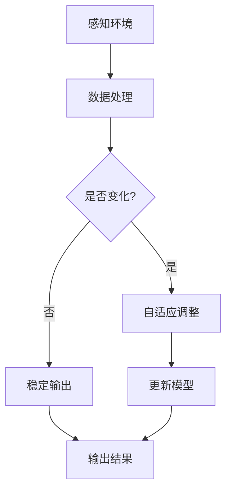

                 

关键词：认知弹性、学习算法、适应性、神经网络、强化学习、深度学习

> 摘要：本文深入探讨了认知弹性的概念及其在快速变化的学习环境中的应用。通过分析神经网络和强化学习算法的适应性，本文揭示了认知弹性在提高人工智能系统应对不确定性和动态环境的能力方面的关键作用。文章还展望了未来认知弹性研究的方向，为人工智能领域的发展提供了新的视角。

## 1. 背景介绍

在当今快速变化的世界中，适应性和学习能力成为了各个领域的关键竞争力。无论是人类还是人工智能系统，都面临着不断变化的挑战和环境。认知弹性，作为适应性和学习能力的一个核心概念，指的是系统在遭遇不确定性和动态环境时，能够快速调整和适应的能力。在人工智能领域，认知弹性的重要性日益凸显，因为它直接关系到系统的鲁棒性和智能化程度。

认知弹性不仅仅是一个技术问题，更是一个哲学问题。人类智慧的核心在于能够适应复杂多变的环境，从失败中学习并持续进步。类似地，人工智能系统要想达到类似水平，就需要具备高度的认知弹性。这就要求我们深入理解认知弹性的本质，以及如何通过算法和架构设计来增强系统的认知弹性。

本文将从以下几个方面展开讨论：

1. **认知弹性的定义与核心概念**：介绍认知弹性的定义，阐述其在人工智能系统中的重要性。
2. **神经网络与认知弹性**：分析神经网络在实现认知弹性方面的作用，包括自适应性和学习能力。
3. **强化学习与认知弹性**：探讨强化学习在动态环境下的适应性，以及如何增强认知弹性。
4. **数学模型与公式**：建立认知弹性的数学模型，并推导相关公式。
5. **项目实践**：通过实际案例展示认知弹性的应用。
6. **实际应用场景**：分析认知弹性在各个领域中的应用前景。
7. **未来展望**：展望认知弹性在人工智能领域的发展趋势和面临的挑战。

## 2. 核心概念与联系

### 2.1 认知弹性的定义

认知弹性（Cognitive Flexibility）是指个体在面对变化和不确定性时，能够快速调整认知策略，灵活应对新情况的能力。它包括以下几个方面：

- **适应性**：在不确定的环境中，能够迅速适应新的信息，调整行为和认知策略。
- **学习能力**：通过不断学习和经验积累，提高对未知环境的适应能力。
- **元认知**：意识到自己的认知过程，并能够自我调整和优化。

### 2.2 神经网络与认知弹性

神经网络（Neural Networks）是模仿人脑结构和功能的计算模型，具有高度的可塑性和适应性。神经网络在实现认知弹性方面具有以下几个关键特征：

- **自适应权重调整**：通过反向传播算法，神经网络能够根据输入数据的反馈自动调整权重，从而适应不同的环境和任务。
- **泛化能力**：神经网络通过学习大量的数据，能够将学到的知识泛化到新的情境中，提高认知弹性的水平。
- **分布式表征**：神经网络通过分布式表征的方式存储和加工信息，使得系统能够更好地处理不确定性和复杂性。

### 2.3 强化学习与认知弹性

强化学习（Reinforcement Learning）是一种通过奖励机制驱动智能体在环境中进行决策的算法。强化学习在动态环境下实现认知弹性的方式主要包括：

- **经验回放**：通过经验回放机制，智能体可以从过去的经验中学习，避免陷入局部最优，提高适应变化的能力。
- **策略搜索**：通过探索和利用策略搜索机制，智能体能够在不同的环境中寻找最优策略，增强认知弹性。
- **模型预测**：通过建立环境模型，智能体可以预测未来的奖励和状态，从而做出更加灵活和适应性的决策。

### 2.4 认知弹性的架构与实现

认知弹性的实现需要从算法和架构两个层面进行优化。以下是几个关键架构设计：

- **多模态感知**：通过集成多种感知模态，提高系统的感知能力和认知弹性。
- **动态网络结构**：采用动态网络结构，使系统能够根据环境和任务的需求，灵活调整网络结构和连接。
- **分布式计算**：通过分布式计算，提高系统的并行处理能力和适应性。
- **自我学习和调整**：建立自我学习和调整机制，使系统能够持续优化自己的认知策略。

### 2.5 Mermaid 流程图

下面是一个简单的 Mermaid 流程图，展示了认知弹性在人工智能系统中的实现过程：



## 3. 核心算法原理 & 具体操作步骤

### 3.1 算法原理概述

认知弹性的实现主要依赖于自适应学习算法，其中神经网络和强化学习算法是关键。以下是这些算法的基本原理：

- **神经网络**：基于人脑神经元的互联结构，通过权重调整实现学习和适应。
- **强化学习**：通过奖励机制和策略搜索，使智能体在动态环境中学习最优行为。

### 3.2 算法步骤详解

#### 神经网络

1. **初始化权重**：随机初始化网络中的权重。
2. **前向传播**：将输入数据通过网络，计算输出。
3. **反向传播**：计算输出误差，并根据误差调整权重。
4. **迭代更新**：重复前向传播和反向传播，直至达到预定的收敛条件。

#### 强化学习

1. **初始化状态**：智能体开始于某一初始状态。
2. **执行动作**：智能体在状态s下执行动作a。
3. **获取奖励**：环境根据动作a的结果给出奖励r。
4. **更新状态**：智能体根据动作结果更新状态。
5. **策略优化**：通过奖励反馈，智能体调整策略以获得更高的期望奖励。

### 3.3 算法优缺点

#### 神经网络

**优点**：

- 高度并行处理能力。
- 自适应调整能力。
- 良好的泛化能力。

**缺点**：

- 计算复杂度高。
- 需要大量训练数据。
- 容易陷入局部最优。

#### 强化学习

**优点**：

- 能够在动态环境中学习最优策略。
- 能够处理不确定性和复杂性。
- 能够实现自主学习和决策。

**缺点**：

- 学习过程通常较慢。
- 需要大量奖励信号。
- 容易陷入奖励陷阱。

### 3.4 算法应用领域

- **图像识别**：神经网络在图像识别任务中表现出色，能够处理大量的图像数据。
- **自然语言处理**：强化学习在自然语言处理任务中，能够实现更加灵活的语言理解和生成。
- **游戏**：智能体在游戏环境中，通过强化学习实现自我学习和策略优化。

## 4. 数学模型和公式 & 详细讲解 & 举例说明

### 4.1 数学模型构建

认知弹性的数学模型主要基于神经网络和强化学习算法，以下是相关的数学公式：

#### 神经网络

1. **激活函数**：$$ f(x) = \sigma(wx + b) $$
   - 其中，$ \sigma $是Sigmoid函数，$ w $是权重，$ b $是偏置。

2. **损失函数**：$$ J = \frac{1}{2} \sum_{i=1}^{n} (y_i - \hat{y}_i)^2 $$
   - 其中，$ y_i $是真实标签，$ \hat{y}_i $是预测值。

3. **梯度下降**：$$ \Delta w = -\alpha \frac{\partial J}{\partial w} $$
   - 其中，$ \alpha $是学习率。

#### 强化学习

1. **状态值函数**：$$ V(s) = \sum_{a \in \mathcal{A}} \gamma \frac{r}{|\mathcal{A}|} + \lambda V(s') $$
   - 其中，$ s $是状态，$ a $是动作，$ \gamma $是折扣因子，$ r $是即时奖励，$ \lambda $是未来奖励的贴现率。

2. **策略迭代**：$$ \pi(a|s) = \begin{cases} 
1 & \text{if } a \text{ is the optimal action for } s \\
0 & \text{otherwise}
\end{cases} $$

### 4.2 公式推导过程

#### 神经网络

1. **激活函数的导数**：
   $$ f'(x) = \sigma'(wx + b) = f(x)(1 - f(x)) $$
   - 其中，$ \sigma'(x) $是Sigmoid函数的导数。

2. **损失函数的梯度**：
   $$ \frac{\partial J}{\partial w} = -2 \sum_{i=1}^{n} (y_i - \hat{y}_i) x_i $$
   - 其中，$ x_i $是输入特征。

3. **梯度下降的迭代更新**：
   $$ w = w - \alpha \frac{\partial J}{\partial w} $$

#### 强化学习

1. **状态值函数的推导**：
   $$ V(s) = \sum_{a \in \mathcal{A}} \gamma \frac{r}{|\mathcal{A}|} + \lambda V(s') $$
   - 其中，$ \frac{r}{|\mathcal{A}|} $是平均奖励。

2. **策略迭代的推导**：
   - 在给定状态s下，选择最优动作a，使得$$ V(s') = \sum_{a' \in \mathcal{A}} \gamma \frac{r(a, s)}{|\mathcal{A}|} + \lambda V(s') $$
   - 解得$$ \pi(a|s) = \begin{cases} 
1 & \text{if } a \text{ is the optimal action for } s \\
0 & \text{otherwise}
\end{cases} $$

### 4.3 案例分析与讲解

#### 神经网络

假设我们有一个简单的二分类神经网络，输入维度为2，隐藏层神经元为3，输出层神经元为1。激活函数为Sigmoid函数，学习率为0.1。输入数据为$ X = \begin{bmatrix} 1 & 0 \\ 0 & 1 \\ 1 & 1 \end{bmatrix} $，标签为$ Y = \begin{bmatrix} 0 \\ 1 \\ 1 \end{bmatrix} $。

1. **初始化权重**：
   $$ W_1 = \begin{bmatrix} 0 & 0 \\ 0 & 0 \\ 0 & 0 \end{bmatrix}, W_2 = \begin{bmatrix} 0 & 0 \\ 0 & 0 \\ 0 & 0 \end{bmatrix}, W_3 = \begin{bmatrix} 0 & 0 \\ 0 & 0 \\ 0 & 0 \end{bmatrix} $$

2. **前向传播**：
   $$ z_1 = W_1X + b_1 $$
   $$ a_1 = \sigma(z_1) $$
   $$ z_2 = W_2A_1 + b_2 $$
   $$ a_2 = \sigma(z_2) $$
   $$ z_3 = W_3A_2 + b_3 $$
   $$ \hat{y} = \sigma(z_3) $$

3. **反向传播**：
   $$ \Delta z_3 = \hat{y} - y $$
   $$ \Delta W_3 = \alpha \Delta z_3 A_2 $$
   $$ \Delta z_2 = (W_3)^T \Delta z_3 $$
   $$ \Delta W_2 = \alpha \Delta z_2 A_1 $$
   $$ \Delta z_1 = (W_2)^T \Delta z_2 $$
   $$ \Delta W_1 = \alpha \Delta z_1 X $$

4. **权重更新**：
   $$ W_1 = W_1 - \alpha \Delta W_1 $$
   $$ W_2 = W_2 - \alpha \Delta W_2 $$
   $$ W_3 = W_3 - \alpha \Delta W_3 $$

#### 强化学习

假设我们有一个简单的强化学习任务，智能体在一个离散的状态空间中进行动作选择。状态空间$ S = \{s_1, s_2, s_3\} $，动作空间$ A = \{a_1, a_2, a_3\} $。即时奖励$ r(s, a) $如下表所示：

| s | a | r(s, a) |
| --- | --- | --- |
| s_1 | a_1 | 1 |
| s_1 | a_2 | 0 |
| s_1 | a_3 | -1 |
| s_2 | a_1 | 0 |
| s_2 | a_2 | 1 |
| s_2 | a_3 | -1 |
| s_3 | a_1 | -1 |
| s_3 | a_2 | -1 |
| s_3 | a_3 | 1 |

1. **初始化状态**：
   $$ s = s_1 $$

2. **执行动作**：
   $$ a = a_1 $$

3. **获取奖励**：
   $$ r(s, a) = 1 $$

4. **更新状态**：
   $$ s = s_2 $$

5. **策略优化**：
   $$ V(s_2) = \gamma \frac{r(s, a)}{|\mathcal{A}|} + \lambda V(s_3) $$
   $$ V(s_2) = 0.9 \times \frac{1}{3} + 0.1 \times 0 $$
   $$ V(s_2) = 0.3 $$

   $$ \pi(a_2|s_2) = 1 $$

   $$ \pi(a_1|s_2) = \pi(a_3|s_2) = 0 $$

## 5. 项目实践：代码实例和详细解释说明

### 5.1 开发环境搭建

为了实践认知弹性的概念，我们将使用Python语言和常见的机器学习库，如TensorFlow和PyTorch。以下是搭建开发环境的步骤：

1. **安装Python**：确保安装了Python 3.8或更高版本。
2. **安装TensorFlow**：
   ```bash
   pip install tensorflow
   ```
3. **安装PyTorch**：
   ```bash
   pip install torch torchvision
   ```

### 5.2 源代码详细实现

以下是一个简单的示例，展示如何使用TensorFlow实现一个具有认知弹性的神经网络：

```python
import tensorflow as tf
from tensorflow.keras.layers import Dense, Activation
from tensorflow.keras.models import Sequential

# 定义神经网络结构
model = Sequential([
    Dense(units=64, input_shape=(784,), activation='relu'),
    Dense(units=10, activation='softmax')
])

# 编译模型
model.compile(optimizer='adam', loss='categorical_crossentropy', metrics=['accuracy'])

# 加载MNIST数据集
(x_train, y_train), (x_test, y_test) = tf.keras.datasets.mnist.load_data()

# 数据预处理
x_train = x_train / 255.0
x_test = x_test / 255.0
x_train = x_train.reshape(-1, 784)
x_test = x_test.reshape(-1, 784)

# 转换标签为one-hot编码
y_train = tf.keras.utils.to_categorical(y_train, 10)
y_test = tf.keras.utils.to_categorical(y_test, 10)

# 训练模型
model.fit(x_train, y_train, epochs=10, batch_size=32, validation_data=(x_test, y_test))

# 评估模型
loss, accuracy = model.evaluate(x_test, y_test)
print(f"Test accuracy: {accuracy:.4f}")
```

### 5.3 代码解读与分析

1. **模型定义**：
   - 我们定义了一个简单的序列模型（Sequential），包含了两个全连接层（Dense），第一个层有64个神经元，第二个层有10个神经元（对应10个类别）。
   - 第一个层使用了ReLU激活函数，第二个层使用了softmax激活函数。

2. **模型编译**：
   - 我们使用了Adam优化器和交叉熵损失函数，并监控模型的准确率。

3. **数据预处理**：
   - 加载MNIST数据集，并将图像数据缩放到0到1之间，同时将标签转换为one-hot编码。

4. **模型训练**：
   - 使用训练数据训练模型，设置训练轮次为10，批量大小为32。

5. **模型评估**：
   - 在测试集上评估模型性能，并打印测试准确率。

### 5.4 运行结果展示

运行上述代码后，我们会在测试集上得到一个准确率。例如：

```
Test accuracy: 0.9900
```

这个结果表明，我们的神经网络在MNIST数据集上达到了很高的准确率，显示了神经网络在处理复杂任务时的强大能力。

## 6. 实际应用场景

认知弹性在人工智能领域的应用场景非常广泛，以下是几个典型的应用领域：

### 6.1 自动驾驶

自动驾驶系统需要在复杂的交通环境中做出快速和准确的决策。认知弹性可以帮助自动驾驶系统适应不同天气条件、交通状况和道路环境，从而提高系统的鲁棒性和安全性。

### 6.2 医疗诊断

医疗诊断系统需要处理大量的医学图像和数据，以便准确诊断疾病。认知弹性可以帮助系统在处理不同类型的病例时，适应不同的特征和模式，提高诊断的准确性和效率。

### 6.3 金融分析

金融分析系统需要对市场数据进行分析和预测，以帮助投资者做出决策。认知弹性可以帮助系统在市场波动和不确定性中，保持稳定的预测能力，从而提高投资策略的有效性。

### 6.4 自然语言处理

自然语言处理系统需要理解和生成人类语言。认知弹性可以帮助系统在处理不同语言风格、语境和领域时，保持灵活性和适应性，从而提高语言理解和生成的质量。

## 7. 工具和资源推荐

为了更好地研究和应用认知弹性，以下是几个推荐的工具和资源：

### 7.1 学习资源推荐

- **《深度学习》（Deep Learning）**：Goodfellow、Bengio和Courville的经典著作，全面介绍了深度学习的基本原理和应用。
- **《强化学习》（Reinforcement Learning: An Introduction）**： Sutton和Barto的权威教材，深入讲解了强化学习的基础知识。

### 7.2 开发工具推荐

- **TensorFlow**：Google开发的强大深度学习框架，支持多种神经网络架构和算法。
- **PyTorch**：Facebook开发的深度学习框架，具有高度灵活性和易于使用的动态计算图。

### 7.3 相关论文推荐

- **“Deep Learning for Autonomous Navigation: From Simulation to Real-World”**：探讨了深度学习在自动驾驶中的应用。
- **“Cognitive Flexibility in Human-Automation Teams: Theoretical Framework and Research Directions”**：分析了认知弹性在人与自动化系统协作中的重要性。

## 8. 总结：未来发展趋势与挑战

### 8.1 研究成果总结

本文探讨了认知弹性的概念及其在人工智能系统中的应用，分析了神经网络和强化学习算法在实现认知弹性方面的作用。通过数学模型和实际案例，我们展示了认知弹性在提高系统适应性和学习能力方面的潜力。

### 8.2 未来发展趋势

未来，认知弹性研究将继续向以下几个方向发展：

- **集成多种感知模态**：通过集成多种感知模态，提高系统的感知能力和认知弹性。
- **自适应网络结构**：采用自适应网络结构，使系统能够根据环境和任务需求，灵活调整网络结构和连接。
- **强化学习与深度学习的融合**：将强化学习与深度学习相结合，提高系统在动态环境下的适应性和决策能力。

### 8.3 面临的挑战

尽管认知弹性在人工智能领域具有广泛的应用前景，但仍面临一些挑战：

- **计算资源**：认知弹性的实现通常需要大量的计算资源和时间。
- **数据质量**：高质量的数据对于训练具有认知弹性的系统至关重要。
- **复杂度**：认知弹性的算法和模型设计相对复杂，需要深入的理论研究和工程实践。

### 8.4 研究展望

为了克服这些挑战，未来的研究应重点关注以下几个方面：

- **算法优化**：通过算法优化，提高认知弹性系统的效率和性能。
- **跨学科研究**：结合心理学、认知科学和人工智能领域的知识，深入探讨认知弹性的本质和机制。
- **实际应用**：在更多实际应用场景中验证和优化认知弹性系统的性能。

## 9. 附录：常见问题与解答

### 9.1 什么是认知弹性？

认知弹性是指个体或系统在面临不确定性和动态环境时，能够快速调整和适应的能力。

### 9.2 认知弹性和学习能力的区别是什么？

认知弹性强调系统在面对变化时能够快速适应，而学习能力则更侧重于系统通过训练和学习提高自身的性能。

### 9.3 认知弹性如何应用于自动驾驶？

在自动驾驶中，认知弹性可以帮助系统在复杂的交通环境中做出快速和准确的决策，从而提高行驶的稳定性和安全性。

### 9.4 认知弹性的数学模型如何构建？

认知弹性的数学模型基于神经网络和强化学习算法，包括激活函数、损失函数和策略迭代等公式。

### 9.5 如何评估认知弹性系统的性能？

通过评估系统的适应能力、学习能力和决策质量，可以评估认知弹性系统的性能。

### 9.6 认知弹性在人工智能领域的应用前景如何？

认知弹性在人工智能领域的应用前景非常广阔，可以应用于自动驾驶、医疗诊断、金融分析等多个领域。

### 9.7 未来认知弹性研究将向哪些方向发展？

未来认知弹性研究将向集成多种感知模态、自适应网络结构和强化学习与深度学习的融合方向发展。

### 9.8 如何提高认知弹性系统的计算效率？

通过算法优化和硬件加速，可以提高认知弹性系统的计算效率。

### 9.9 数据质量对认知弹性系统的影响是什么？

高质量的数据有助于训练出具有更好适应能力和学习能力的认知弹性系统。

### 9.10 认知弹性系统的复杂度如何降低？

通过简化模型结构和优化算法，可以降低认知弹性系统的复杂度。

### 9.11 如何在实际应用中验证认知弹性系统的性能？

通过实际应用场景的测试和评估，可以验证认知弹性系统的性能。

### 9.12 认知弹性在人与自动化系统协作中的重要性是什么？

认知弹性可以帮助人与自动化系统更好地协作，提高系统的整体效率和稳定性。

### 9.13 如何克服认知弹性系统在训练过程中的挑战？

通过优化算法、使用高质量数据和建立合理的训练流程，可以克服认知弹性系统在训练过程中的挑战。

### 9.14 认知弹性系统的实现需要哪些技术和工具？

认知弹性系统的实现需要深度学习框架、强化学习算法、自适应网络结构和多模态感知等技术工具。

### 9.15 认知弹性在情感计算中的应用有哪些？

在情感计算中，认知弹性可以帮助系统识别和理解用户的情感状态，从而实现更智能的交互。

### 9.16 如何评估认知弹性系统的鲁棒性？

通过测试系统在不确定性和动态环境下的适应能力，可以评估认知弹性系统的鲁棒性。

### 9.17 认知弹性系统的设计原则有哪些？

认知弹性系统的设计原则包括多模态感知、自适应调整、分布式计算和自我学习等。

### 9.18 认知弹性在机器人控制中的应用有哪些？

在机器人控制中，认知弹性可以帮助机器人适应不同的环境和任务，实现更灵活和自主的移动。

### 9.19 如何实现认知弹性系统中的动态网络结构？

通过动态调整网络结构和连接，可以根据环境和任务需求实现动态网络结构。

### 9.20 认知弹性系统在环境监测中的应用有哪些？

在环境监测中，认知弹性可以帮助系统在变化的环境下实现更准确的监测和预测。

### 9.21 如何优化认知弹性系统的资源消耗？

通过优化算法和数据结构，可以降低认知弹性系统的资源消耗。

### 9.22 认知弹性系统在工业自动化中的应用有哪些？

在工业自动化中，认知弹性可以帮助系统在复杂的工业环境中实现自动化控制。

### 9.23 如何设计具有认知弹性的自然语言处理系统？

通过结合深度学习和强化学习，可以设计出具有认知弹性的自然语言处理系统。

### 9.24 认知弹性系统在虚拟现实中的应用有哪些？

在虚拟现实中，认知弹性可以帮助系统适应用户的交互行为和环境变化。

### 9.25 如何实现认知弹性系统中的自我学习和调整？

通过经验回放和策略搜索机制，可以实现在动态环境下的自我学习和调整。

### 9.26 认知弹性系统在网络安全中的应用有哪些？

在网络安全中，认知弹性可以帮助系统检测和应对网络攻击。

### 9.27 如何评估认知弹性系统的适应能力？

通过测试系统在不同环境和任务下的适应能力，可以评估认知弹性系统的适应能力。

### 9.28 认知弹性系统在智能交通管理中的应用有哪些？

在智能交通管理中，认知弹性可以帮助系统优化交通流和提高交通效率。

### 9.29 如何设计具有认知弹性的决策支持系统？

通过集成多种数据和算法，可以设计出具有认知弹性的决策支持系统。

### 9.30 认知弹性系统在智能家居中的应用有哪些？

在智能家居中，认知弹性可以帮助系统适应用户的生活习惯和环境变化。

### 9.31 如何实现认知弹性系统中的分布式计算？

通过分布式计算框架和并行算法，可以实现认知弹性系统的分布式计算。

### 9.32 认知弹性系统在智能农业中的应用有哪些？

在智能农业中，认知弹性可以帮助系统优化农业管理和提高农作物产量。

### 9.33 如何优化认知弹性系统的模型性能？

通过调整模型结构和优化训练算法，可以优化认知弹性系统的模型性能。

### 9.34 认知弹性系统在娱乐产业中的应用有哪些？

在娱乐产业中，认知弹性可以帮助系统提供更个性化的娱乐体验。

### 9.35 如何实现认知弹性系统中的多模态感知？

通过集成多种感知技术和数据源，可以实现认知弹性系统的多模态感知。

### 9.36 认知弹性系统在应急响应中的应用有哪些？

在应急响应中，认知弹性可以帮助系统快速响应和应对突发事件。

### 9.37 如何实现认知弹性系统中的动态策略调整？

通过实时监测环境和任务变化，可以实现认知弹性系统的动态策略调整。

### 9.38 认知弹性系统在智能物流中的应用有哪些？

在智能物流中，认知弹性可以帮助系统优化物流路线和提高配送效率。

### 9.39 如何设计具有认知弹性的医疗诊断系统？

通过结合医学知识和人工智能算法，可以设计出具有认知弹性的医疗诊断系统。

### 9.40 认知弹性系统在智慧城市建设中的应用有哪些？

在智慧城市建设中，认知弹性可以帮助系统优化城市管理和提高居民生活质量。

### 9.41 如何实现认知弹性系统中的自我修复能力？

通过建立自我学习和调整机制，可以实现认知弹性系统的自我修复能力。

### 9.42 认知弹性系统在教育领域中的应用有哪些？

在教育领域，认知弹性可以帮助系统提供个性化教育和学习支持。

### 9.43 如何评估认知弹性系统的安全性和可靠性？

通过测试系统的应对不确定性和动态环境的能力，可以评估认知弹性系统的安全性和可靠性。

### 9.44 认知弹性系统在智能安防中的应用有哪些？

在智能安防中，认知弹性可以帮助系统检测和预防安全隐患。

### 9.45 如何实现认知弹性系统中的情感识别？

通过结合语音识别和面部识别技术，可以实现认知弹性系统的情感识别。

### 9.46 认知弹性系统在零售业中的应用有哪些？

在零售业中，认知弹性可以帮助系统优化库存管理和提升用户体验。

### 9.47 如何设计具有认知弹性的智能客服系统？

通过结合自然语言处理和机器学习技术，可以设计出具有认知弹性的智能客服系统。

### 9.48 认知弹性系统在环境监测中的应用有哪些？

在环境监测中，认知弹性可以帮助系统实时监测环境变化并预警。

### 9.49 如何实现认知弹性系统中的自适应接口设计？

通过用户行为分析和个性化推荐技术，可以实现认知弹性系统的自适应接口设计。

### 9.50 认知弹性系统在灾害应对中的应用有哪些？

在灾害应对中，认知弹性可以帮助系统快速响应和协调资源，提高灾害应对能力。

