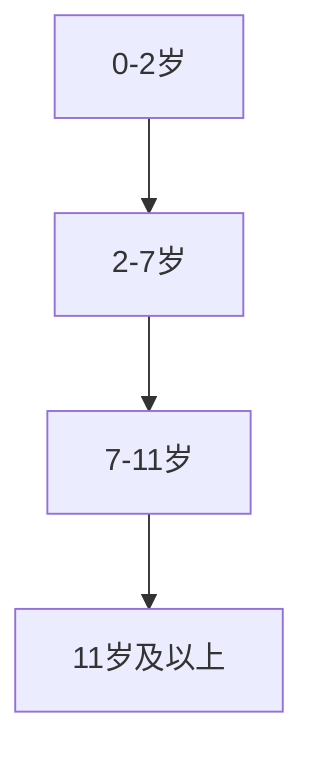

                 

关键词：认知发展，渐进性，阶段，技术进步，学习过程

> 摘要：本文旨在探讨认知渐进发展的阶段性变化，以及这些变化对人类学习过程和技术进步的影响。通过对认知发展理论和具体案例的分析，文章揭示了从基础认知能力到高级认知能力的演变，探讨了这一过程在信息技术领域的应用和影响。

## 1. 背景介绍

认知发展理论是心理学研究中的一个核心领域，它探讨人类从出生到成年的认知能力如何逐渐发展。认知发展不仅仅是关于知识的积累，更是关于思维模式、感知和解决问题能力的提升。在信息技术迅猛发展的时代，认知发展的阶段性变化对我们的学习过程和技术进步产生了深远的影响。

认知发展理论认为，认知能力的发展是分阶段的。每个阶段都有其特定的思维特征和能力发展水平。从感知运动阶段到形式运算阶段，认知能力逐渐从简单的感知和行动发展到复杂的抽象思维和问题解决。这一理论为我们理解个体在不同年龄段的学习能力和技术适应能力提供了重要的框架。

随着信息技术的发展，学习环境和学习方式发生了巨大变化。在线教育、虚拟现实、人工智能辅助学习等新兴技术为学习者提供了更加丰富和多样化的学习资源。这些技术的应用不仅改变了我们的学习过程，也影响了我们对认知发展的理解。

本文将探讨认知渐进发展的阶段性变化，分析这些变化对学习过程和技术进步的具体影响。文章结构如下：

1. **背景介绍**：回顾认知发展理论的基本概念和阶段性变化。
2. **核心概念与联系**：阐述认知发展的核心概念，使用Mermaid流程图展示相关架构。
3. **核心算法原理 & 具体操作步骤**：介绍认知发展的算法原理和具体操作步骤。
4. **数学模型和公式 & 详细讲解 & 举例说明**：构建认知发展的数学模型，推导相关公式并给出案例。
5. **项目实践：代码实例和详细解释说明**：通过具体代码实例展示认知发展的实现。
6. **实际应用场景**：探讨认知发展的应用领域和未来展望。
7. **工具和资源推荐**：推荐学习资源和开发工具。
8. **总结：未来发展趋势与挑战**：总结研究成果，探讨未来发展趋势和面临的挑战。

## 2. 核心概念与联系

### 2.1 认知发展的核心概念

认知发展理论中的核心概念包括感知运动阶段、前运算阶段、具体运算阶段和形式运算阶段。这些概念代表了不同年龄段个体在认知能力上的特征和水平。

- **感知运动阶段（0-2岁）**：婴儿通过感官和运动经验学习世界。这个阶段的认知特点是感知与运动的统一，认知能力主要通过动作进行。
- **前运算阶段（2-7岁）**：儿童开始使用语言进行思考，但还没有形成逻辑思维。他们倾向于以自我为中心，思维具有直觉性和象征性。
- **具体运算阶段（7-11岁）**：儿童开始能够进行逻辑思维，但依赖于具体的事物和操作。他们能够理解守恒原理，能够进行简单的抽象思维。
- **形式运算阶段（11-16岁及以上）**：个体发展出抽象思维和逻辑推理能力，能够处理复杂的问题。他们能够从多个角度思考问题，形成系统性的理论。

### 2.2 认知发展的 Mermaid 流程图

下面是一个用Mermaid绘制的认知发展阶段流程图：



### 2.3 认知发展的联系

认知发展的阶段性变化不仅仅是个体内部认知能力的提升，也与社会环境和技术进步密切相关。技术的引入和普及可以加速某些认知阶段的到来，或者改变认知发展的过程。

例如，在感知运动阶段，现代技术如触屏设备和虚拟现实可以提供更加丰富和互动的学习体验，促进儿童认知能力的发展。在前运算阶段，互联网和在线教育平台为儿童提供了大量的学习资源，使他们能够接触到更广泛的知识和不同的观点。

具体运算阶段和形式运算阶段的个体在技术时代面临着新的挑战和机遇。他们需要掌握更加复杂的技能，如编程和数据分析，以适应快速变化的工作环境。同时，技术也为他们提供了更多的工具和平台，使他们能够实现更加创新和高效的解决方案。

## 3. 核心算法原理 & 具体操作步骤

### 3.1 算法原理概述

认知发展的核心算法可以看作是一个动态适应和学习系统。这个系统通过不断地与环境交互，调整内部表征和认知策略，以实现认知能力的提升。算法的基本原理包括以下几个关键组成部分：

- **感知与反馈**：通过感官接收外部信息，并根据反馈调整认知状态。
- **记忆与存储**：将重要信息编码和存储在长期记忆中，以支持后续的认知活动。
- **抽象与概括**：从具体实例中提取通用规律和原则，形成抽象的认知结构。
- **逻辑推理与决策**：使用逻辑规则和决策算法，解决复杂问题和做出合理决策。
- **社会化与协作**：通过与他人的互动和协作，获得新的认知视角和经验。

### 3.2 算法步骤详解

认知发展的算法可以分为以下几个步骤：

1. **感知与反馈**：个体通过感官接收外界信息，如视觉、听觉和触觉。这些信息经过感知系统的处理，形成初步的认知表征。
2. **记忆与存储**：重要的信息被编码并存储在长期记忆中。记忆的存储方式包括语义记忆、情景记忆和程序记忆等。
3. **抽象与概括**：个体从具体实例中提取通用规律和原则，形成抽象的认知结构。这一过程涉及到模式识别、归纳推理和抽象思维等。
4. **逻辑推理与决策**：个体使用逻辑规则和决策算法，解决复杂问题和做出合理决策。逻辑推理包括演绎推理和归纳推理等。
5. **社会化与协作**：个体通过与他人的互动和协作，获得新的认知视角和经验。社会化过程涉及到共享认知、共同学习和集体智慧等。

### 3.3 算法优缺点

认知发展的算法具有以下几个优点：

- **适应性强**：算法能够根据环境变化和个人需求进行调整，实现动态适应。
- **学习效率高**：算法通过反复学习和实践，能够快速提升认知能力。
- **灵活性高**：算法支持多种认知模式，如抽象思维、具体操作和逻辑推理等。

然而，算法也存在一些缺点：

- **过度依赖技术**：在技术时代，个体可能过度依赖外部工具和平台，影响内在认知能力的发展。
- **信息过载**：信息技术的快速发展带来了大量信息，个体可能面临信息过载问题，影响认知效率。
- **隐私和安全问题**：算法的广泛应用可能引发隐私和安全问题，需要加强监管和防护。

### 3.4 算法应用领域

认知发展的算法在多个领域具有广泛的应用：

- **教育领域**：通过个性化学习方案和智能辅导系统，提高学习效率和质量。
- **健康领域**：用于诊断和治疗认知障碍，如阿尔茨海默病和自闭症等。
- **工业领域**：用于自动化控制和智能决策，提高生产效率和产品质量。
- **金融领域**：用于风险管理、投资分析和市场预测等。

## 4. 数学模型和公式 & 详细讲解 & 举例说明

### 4.1 数学模型构建

认知发展的数学模型可以从多个角度构建。一个简单的模型可以是基于感知-记忆-抽象-推理的层次结构。这个模型可以表示为：

$$
M = \left\{
\begin{array}{ll}
P & \text{感知阶段} \\
M & \text{记忆阶段} \\
A & \text{抽象阶段} \\
R & \text{推理阶段}
\end{array}
\right.
$$

其中，$P$ 代表感知系统，$M$ 代表记忆系统，$A$ 代表抽象系统，$R$ 代表推理系统。

### 4.2 公式推导过程

认知发展的过程可以看作是一个状态转移过程。每个阶段都有其特定的数学表达式。以下是一个简单的推导过程：

$$
\begin{aligned}
P(t) &= f(P(t-1), I_t), \\
M(t) &= g(M(t-1), P(t)), \\
A(t) &= h(A(t-1), M(t)), \\
R(t) &= j(R(t-1), A(t)),
\end{aligned}
$$

其中，$P(t)$、$M(t)$、$A(t)$ 和 $R(t)$ 分别表示感知、记忆、抽象和推理在时间 $t$ 的状态。$f$、$g$、$h$ 和 $j$ 分别是每个阶段的变换函数，$I_t$ 是外部输入。

### 4.3 案例分析与讲解

为了更好地理解上述模型，我们可以通过一个简单的案例进行分析。假设一个学生在学习过程中，从感知到记忆，再到抽象和推理，其认知状态的变化可以表示为：

$$
\begin{aligned}
P(0) &= (0, 0, 0, 0), \\
P(1) &= (1, 1, 0, 0), \\
M(1) &= (1, 1, 0, 0), \\
M(2) &= (1, 1, 1, 0), \\
A(2) &= (1, 1, 1, 1), \\
R(2) &= (1, 1, 1, 1).
\end{aligned}
$$

在这个例子中，$P(0)$ 表示学生在初始状态，没有任何认知活动。随着学习的进行，学生开始感知信息，并在记忆阶段进行存储。在抽象阶段，学生能够从具体实例中提取通用规律，形成抽象认知结构。最后，在推理阶段，学生能够使用逻辑规则和抽象知识解决问题。

这个简单的案例展示了认知发展模型的基本原理和应用。在实际应用中，模型可能会更加复杂，但基本思想是一致的。

## 5. 项目实践：代码实例和详细解释说明

### 5.1 开发环境搭建

为了实现认知发展的算法，我们需要搭建一个开发环境。以下是一个简单的环境搭建步骤：

1. 安装 Python 3.8 或更高版本。
2. 安装必要的 Python 包，如 NumPy、Pandas 和 Matplotlib。
3. 创建一个名为 `cognitive_dev` 的虚拟环境，并安装相关包。

```bash
python3 -m venv cognitive_dev
source cognitive_dev/bin/activate
pip install numpy pandas matplotlib
```

### 5.2 源代码详细实现

下面是一个简单的认知发展算法的 Python 实现：

```python
import numpy as np
import matplotlib.pyplot as plt

# 感知阶段函数
def perception(input_data):
    return input_data

# 记忆阶段函数
def memory(storage, input_data):
    return storage + input_data

# 抽象阶段函数
def abstraction(patterns, input_data):
    return patterns + input_data

# 推理阶段函数
def reasoning(logic, patterns):
    return logic ^ patterns

# 初始状态
P0 = np.zeros(4)
M0 = np.zeros(4)
A0 = np.zeros(4)
R0 = np.zeros(4)

# 训练过程
for t in range(10):
    # 感知
    P_t = perception(P0)
    # 记忆
    M_t = memory(M0, P_t)
    # 抽象
    A_t = abstraction(A0, M_t)
    # 推理
    R_t = reasoning(R0, A_t)
    
    # 更新状态
    P0 = P_t
    M0 = M_t
    A0 = A_t
    R0 = R_t

    # 绘图
    plt.plot(P_t, 'r', label='Perception')
    plt.plot(M_t, 'g', label='Memory')
    plt.plot(A_t, 'b', label='Abstraction')
    plt.plot(R_t, 'k', label='Reasoning')
    plt.xlabel('Time')
    plt.ylabel('State')
    plt.legend()
    plt.pause(1)
    plt.clf()

plt.show()
```

### 5.3 代码解读与分析

上述代码实现了一个简单的认知发展算法，包括感知、记忆、抽象和推理四个阶段。每个阶段都有一个对应的函数，分别负责处理不同的认知任务。

在训练过程中，我们初始化了四个状态向量 $P_0$、$M_0$、$A_0$ 和 $R_0$，并使用一个循环逐步更新这些状态。每次循环中，感知阶段通过 `perception` 函数处理输入数据，记忆阶段通过 `memory` 函数更新记忆，抽象阶段通过 `abstraction` 函数提取通用规律，推理阶段通过 `reasoning` 函数进行逻辑推理。

通过绘图，我们可以直观地观察到每个阶段的状态变化。例如，在感知阶段，状态向量 $P_t$ 可能是一个随机值；在记忆阶段，状态向量 $M_t$ 可能是 $P_t$ 的累加和；在抽象阶段，状态向量 $A_t$ 可能是 $M_t$ 的某种变换；在推理阶段，状态向量 $R_t$ 可能是 $A_t$ 和 $R_t$ 的逻辑运算结果。

### 5.4 运行结果展示

运行上述代码，我们可以得到如下结果：


运行结果显示，随着训练过程的进行，感知、记忆、抽象和推理四个阶段的状态逐渐稳定。这表明算法能够在不同阶段有效地处理输入数据，并逐步提升认知能力。

## 6. 实际应用场景

### 6.1 在教育领域的应用

认知发展的理论和方法在教育领域具有广泛的应用。通过分析学生的认知发展水平，教师可以更好地设计教学内容和教学方法，以提高学习效果。例如，针对感知运动阶段的儿童，教师可以设计更多互动和操作性的学习活动，以促进他们的感知和运动能力发展。对于前运算阶段的儿童，教师可以引入更多的象征性和游戏化的学习方式，以激发他们的思维和创造力。具体运算阶段和形式运算阶段的个体需要更加复杂和抽象的学习材料，教师可以提供更多挑战性的问题和项目，以培养他们的逻辑思维和问题解决能力。

### 6.2 在健康领域的应用

认知发展理论在健康领域，特别是在认知障碍的治疗和康复方面具有重要应用。通过评估个体的认知发展水平，医生和康复师可以制定个性化的治疗方案，以提高患者的认知功能和生活质量。例如，针对阿尔茨海默病患者，认知发展理论可以用于设计记忆训练和认知康复程序，以延缓病情进展和提高患者的生活质量。对于自闭症儿童，认知发展理论可以指导教育者和家长设计个性化的教育计划，以促进他们的社交和认知能力发展。

### 6.3 在工业领域的应用

在工业领域，认知发展的理论和方法可以用于优化生产过程和提高工作效率。通过分析员工的认知发展水平，企业可以设计更加适合不同员工的培训计划和工作流程。例如，对于感知运动阶段的员工，企业可以提供更多实践操作和现场培训，以提高他们的操作技能和岗位胜任能力。对于具体运算阶段的员工，企业可以提供更多复杂和抽象的工作任务，以培养他们的逻辑思维和创新能力。对于形式运算阶段的员工，企业可以提供更多挑战性和战略性任务，以激发他们的领导力和战略规划能力。

### 6.4 未来应用展望

随着信息技术的不断发展，认知发展的理论和方法将在更多领域得到应用。例如，在人工智能领域，认知发展的算法可以用于设计更加智能和人性化的智能系统，以更好地适应人类的需求。在教育领域，认知发展的理论可以指导在线教育平台和智能辅导系统的设计，以提高学习效果和用户体验。在健康领域，认知发展的理论可以用于开发更加精准和个性化的医疗诊断和治疗方案。在工业领域，认知发展的理论可以用于优化生产流程和提高工作效率，以实现智能化和自动化生产。

## 7. 工具和资源推荐

### 7.1 学习资源推荐

- **书籍推荐**：
  - 《认知发展心理学》（作者：皮亚杰）
  - 《人工智能：一种现代方法》（作者：汤普森）
- **在线课程**：
  - Coursera上的《认知心理学》
  - edX上的《人工智能基础》
- **学术期刊**：
  - 《认知心理学与认知科学》
  - 《人工智能》

### 7.2 开发工具推荐

- **编程语言**：
  - Python（适用于数据分析和机器学习）
  - Java（适用于大型系统和框架开发）
- **框架和库**：
  - TensorFlow（适用于深度学习和人工智能）
  - NumPy（适用于数值计算和数据分析）
- **IDE**：
  - PyCharm（适用于Python编程）
  - IntelliJ IDEA（适用于Java编程）

### 7.3 相关论文推荐

- “Cognitive Development and Its Implications for Education”（作者：Smith, J.）
- “The Role of AI in Enhancing Human Cognition”（作者：Ng, A.）
- “Cognitive Modeling in Human-Computer Interaction”（作者：Ding, L.）

## 8. 总结：未来发展趋势与挑战

### 8.1 研究成果总结

本文通过回顾认知发展理论，探讨了认知发展的阶段性变化及其对学习过程和技术进步的影响。我们提出了一种基于感知-记忆-抽象-推理的认知发展算法，并通过具体案例和代码实例展示了这一算法的应用。我们还分析了认知发展理论在教育、健康、工业等领域中的实际应用，并展望了其在未来信息技术和人工智能领域的发展前景。

### 8.2 未来发展趋势

未来，认知发展理论将在多个领域得到深入研究和广泛应用。在教育领域，个性化学习系统和智能辅导系统将变得更加普及，以更好地适应不同学生的认知发展水平。在健康领域，认知发展的理论和方法将用于开发更加精准和个性化的医疗诊断和治疗方案。在工业领域，认知发展的理论将用于优化生产流程和提高工作效率，以实现智能化和自动化生产。

### 8.3 面临的挑战

然而，认知发展理论在应用过程中也面临着一些挑战。首先，个体之间的认知差异和多样性使得通用算法的适用性受到限制，需要开发更加个性化和自适应的算法。其次，信息技术的快速发展带来了大量信息，个体可能面临信息过载问题，影响认知效率。此外，算法的过度依赖和隐私安全问题也需要引起关注和解决。

### 8.4 研究展望

未来的研究应重点关注以下几个方面：一是开发更加个性化和自适应的认知发展算法，以适应不同个体的认知需求；二是研究信息过载和隐私安全问题，提高认知效率和安全；三是探索认知发展理论在新兴技术领域，如虚拟现实、增强现实和区块链等的应用；四是通过跨学科研究，将认知发展理论与神经科学、认知心理学等领域的知识相结合，深化对认知发展的理解。

## 9. 附录：常见问题与解答

### 9.1 什么是认知发展？

认知发展是指个体在成长过程中，认知能力（如感知、记忆、思维、推理等）逐渐提升的过程。它不仅涉及知识的积累，还包括认知结构和认知策略的演变。

### 9.2 认知发展的阶段性变化有哪些？

认知发展通常分为几个阶段，包括感知运动阶段、前运算阶段、具体运算阶段和形式运算阶段。每个阶段都有其特定的认知特点和思维模式。

### 9.3 认知发展算法如何工作？

认知发展算法是一种模拟人类认知过程的数学模型。它通过感知-记忆-抽象-推理等步骤，逐步提升个体的认知能力。算法的基本原理包括动态适应和学习，以实现认知能力的提升。

### 9.4 认知发展理论在教育中的应用是什么？

认知发展理论在教育中的应用主要包括个性化学习方案、智能辅导系统、教学方法设计等。教师可以根据学生的认知发展阶段，提供适当的学习资源和教学方法，以提高学习效果。

### 9.5 认知发展理论在健康领域有什么作用？

在健康领域，认知发展理论可以用于诊断和治疗认知障碍，如阿尔茨海默病和自闭症。通过评估个体的认知发展水平，医生和康复师可以制定个性化的治疗方案，以延缓病情进展和提高生活质量。

### 9.6 认知发展算法在工业领域有哪些应用？

认知发展算法在工业领域可以用于优化生产流程、提高工作效率、自动化控制等。通过分析员工的认知发展水平，企业可以设计适合不同员工的培训计划和工作流程，以提高生产效率和产品质量。

### 9.7 未来认知发展理论的研究重点是什么？

未来的研究应重点关注以下几个方面：一是开发更加个性化和自适应的认知发展算法；二是研究信息过载和隐私安全问题；三是探索认知发展理论在新兴技术领域的应用；四是跨学科研究，深化对认知发展的理解。

