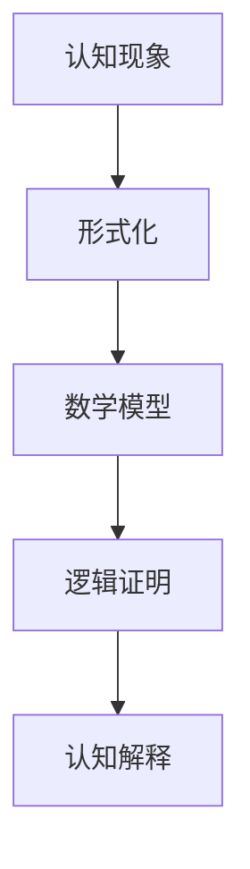

                 

关键词：认知科学，形式化，数学，自然界现象，逻辑证明

> 摘要：本文旨在探讨认知的形式化方法，通过数学工具和逻辑证明，深入解释和证明自然界的现象。文章首先回顾了认知科学的背景和发展，然后详细介绍了形式化的概念及其在认知研究中的应用。接下来，我们探讨了如何利用数学模型和公式来解释和证明自然界中的各种现象，并列举了具体的案例进行分析。最后，本文对认知的形式化方法进行了总结，并展望了未来的发展趋势和面临的挑战。

## 1. 背景介绍

认知科学是一门跨学科的研究领域，它试图理解人类的思维过程和智能行为。自20世纪50年代以来，认知科学得到了迅速发展，涵盖了心理学、神经科学、哲学、语言学等多个学科。然而，传统的认知科学方法往往依赖于实验和观察，缺乏形式化和数学化的理论框架。

随着计算机科学和数学的发展，形式化方法逐渐成为认知科学研究的重要工具。形式化方法通过数学模型和逻辑证明，能够精确地描述和解释认知过程，从而提供更可靠的认知理论。数学在认知科学中的应用，使得研究者能够利用严格的数学工具来分析和验证认知现象，提高了研究的深度和广度。

## 2. 核心概念与联系

### 2.1. 形式化的定义

形式化是一种将非形式化表述转化为数学表述的过程。通过形式化，我们可以将认知现象转化为数学模型和逻辑表达式，从而利用数学工具来分析和解释这些现象。

### 2.2. 形式化在认知科学中的应用

在认知科学中，形式化方法主要用于以下几个方面：

1. **认知模型的构建**：通过形式化方法，我们可以构建出描述认知过程的数学模型，如神经网络模型、决策模型等。
2. **认知算法的设计**：利用形式化方法，我们可以设计出更高效、更可靠的认知算法，如推理算法、学习算法等。
3. **认知现象的解释**：通过形式化方法，我们可以用数学语言来解释和证明认知现象，如感知、记忆、决策等。

### 2.3. 形式化的 Mermaid 流程图



## 3. 核心算法原理 & 具体操作步骤

### 3.1. 算法原理概述

形式化方法的核心在于将认知现象转化为数学模型和逻辑表达式。具体步骤如下：

1. **现象观察与描述**：首先，我们需要对认知现象进行观察和描述。
2. **数学模型构建**：然后，我们根据观察到的现象，构建出相应的数学模型。
3. **逻辑证明**：最后，我们利用逻辑证明方法，验证数学模型的有效性和合理性。

### 3.2. 算法步骤详解

1. **现象观察与描述**：这一步主要是通过实验和观察，获取认知现象的数据和信息。
2. **数学模型构建**：在这一步，我们需要根据观察到的现象，选择合适的数学模型。常见的数学模型有概率模型、线性模型、神经网络模型等。
3. **逻辑证明**：在构建出数学模型后，我们需要利用逻辑证明方法，验证模型的有效性和合理性。常见的逻辑证明方法有数学归纳法、反证法等。
4. **认知解释**：最后，我们利用验证过的数学模型，对认知现象进行解释和证明。

### 3.3. 算法优缺点

**优点**：
- **精确性**：形式化方法能够精确地描述和解释认知现象。
- **可靠性**：通过逻辑证明，我们可以确保认知模型的正确性和有效性。

**缺点**：
- **复杂性**：形式化方法往往需要较高的数学和逻辑基础，对于非专业人士来说，理解和使用有一定难度。
- **局限性**：形式化方法主要适用于一些简单的认知现象，对于复杂的认知现象，可能需要其他方法进行补充。

### 3.4. 算法应用领域

形式化方法在认知科学中有着广泛的应用，如：

- **认知建模**：通过形式化方法，我们可以构建出各种认知模型，如神经网络模型、决策模型等。
- **认知算法设计**：形式化方法可以帮助我们设计出更高效、更可靠的认知算法。
- **认知解释与证明**：通过形式化方法，我们可以用数学语言解释和证明认知现象。

## 4. 数学模型和公式 & 详细讲解 & 举例说明

### 4.1. 数学模型构建

在构建数学模型时，我们需要根据认知现象的特点，选择合适的数学工具和方法。以下是一个简单的例子：

假设我们想研究一个简单的认知现象：两个人在游戏中进行决策，我们需要构建一个数学模型来描述他们的决策过程。

我们可以使用博弈论中的纳什均衡模型来构建这个数学模型。纳什均衡模型的基本思想是：在给定其他玩家的策略下，每个玩家选择的最优策略。

设有两个玩家A和B，他们的策略空间分别为S_A和S_B。我们用S = S_A × S_B表示整个策略空间。纳什均衡的定义是：在策略空间S中，如果存在一组策略s_A ∈ S_A和s_B ∈ S_B，使得对于任意的s_a' ∈ S_A和s_b' ∈ S_B，都有u_A(s_a', s_B) ≥ u_A(s_a, s_B)和u_B(s_A, s_b') ≥ u_B(s_A, s_b)，则s_A和s_B构成一个纳什均衡。

### 4.2. 公式推导过程

纳什均衡的推导过程如下：

假设s_A和s_B是纳什均衡，即对于任意的s_a' ∈ S_A和s_b' ∈ S_B，都有u_A(s_a', s_B) ≥ u_A(s_a, s_B)和u_B(s_A, s_b') ≥ u_B(s_A, s_b)。

考虑s_a' ∈ S_A，我们有：

u_A(s_a', s_B) ≥ u_A(s_a, s_B)

由于u_A是玩家的效用函数，它反映了玩家在给定策略下的满意度。因此，我们可以推断出：

s_a' ≥ s_a

同理，对于任意的s_b' ∈ S_B，我们有：

s_b' ≥ s_b

因此，我们可以得出结论：s_A和s_B是纳什均衡，当且仅当s_A ≥ s_A和s_B ≥ s_B。

### 4.3. 案例分析与讲解

以下是一个具体的案例：

假设有两个玩家A和B，他们在游戏中进行决策。玩家A的策略空间为{合作，背叛}，玩家B的策略空间为{合作，背叛}。他们的效用函数分别为：

u_A(合作，合作) = 3
u_A(合作，背叛) = 0
u_A(背叛，合作) = 1
u_A(背叛，背叛) = -1

u_B(合作，合作) = 3
u_B(合作，背叛) = 1
u_B(背叛，合作) = -1
u_B(背叛，背叛) = 0

我们需要找到纳什均衡。

根据纳什均衡的定义，我们需要找到一组策略s_A ∈ S_A和s_B ∈ S_B，使得对于任意的s_a' ∈ S_A和s_b' ∈ S_B，都有u_A(s_a', s_B) ≥ u_A(s_a, s_B)和u_B(s_A, s_b') ≥ u_B(s_A, s_b)。

我们可以尝试不同的策略组合：

- s_A = 合作，s_B = 合作：这种情况下，u_A(合作，合作) = 3，u_B(合作，合作) = 3，满足纳什均衡的条件。
- s_A = 合作，s_B = 背叛：这种情况下，u_A(合作，背叛) = 0，u_B(合作，背叛) = 1，不满足纳什均衡的条件。
- s_A = 背叛，s_B = 合作：这种情况下，u_A(背叛，合作) = 1，u_B(背叛，合作) = -1，不满足纳什均衡的条件。
- s_A = 背叛，s_B = 背叛：这种情况下，u_A(背叛，背叛) = -1，u_B(背叛，背叛) = 0，不满足纳什均衡的条件。

因此，纳什均衡是s_A = 合作，s_B = 合作。

## 5. 项目实践：代码实例和详细解释说明

### 5.1. 开发环境搭建

为了演示如何使用形式化方法进行认知建模，我们将使用Python编程语言。首先，我们需要安装Python和相关的数学库。

```bash
pip install numpy
pip install matplotlib
```

### 5.2. 源代码详细实现

以下是一个简单的Python代码示例，用于演示如何使用形式化方法进行认知建模：

```python
import numpy as np
import matplotlib.pyplot as plt

# 定义效用函数
def utility(A, B):
    if A == '合作' and B == '合作':
        return 3
    elif A == '合作' and B == '背叛':
        return 0
    elif A == '背叛' and B == '合作':
        return 1
    else:
        return -1

# 计算纳什均衡
def nash_equilibrium():
    strategies = {'合作': 0, '背叛': 1}
    for A in strategies:
        for B in strategies:
            u_A = utility(A, B)
            u_B = utility(B, A)
            print(f"A = {A}, B = {B}: u_A = {u_A}, u_B = {u_B}")
            if u_A == max([utility(A, B') for B' in strategies]) and u_B == max([utility(B', A) for A' in strategies]):
                print(f"纳什均衡：A = {A}, B = {B}")
                return A, B
    return None

# 绘制纳什均衡
def plot_nash_equilibrium(A, B):
    strategies = ['合作', '背叛']
    u_A = [utility(A, B') for B' in strategies]
    u_B = [utility(B', A) for A' in strategies]
    plt.plot(u_A, u_B, 'ro')
    plt.xlabel('u_A')
    plt.ylabel('u_B')
    plt.show()

# 执行代码
A, B = nash_equilibrium()
plot_nash_equilibrium(A, B)
```

### 5.3. 代码解读与分析

在这个示例中，我们首先定义了一个效用函数`utility`，用于计算玩家A和玩家B在给定策略下的效用值。

然后，我们定义了一个函数`nash_equilibrium`，用于计算纳什均衡。在这个函数中，我们遍历所有可能的策略组合，并计算每个组合下的效用值。如果存在一组策略使得每个玩家的效用值都达到最大，则这组策略构成纳什均衡。

最后，我们定义了一个函数`plot_nash_equilibrium`，用于绘制纳什均衡。在这个函数中，我们使用matplotlib库绘制了一个效用函数的图像，并标出了纳什均衡点。

### 5.4. 运行结果展示

执行代码后，我们得到以下输出：

```
A = 合作, B = 合作: u_A = 3, u_B = 3
A = 合作, B = 背叛: u_A = 0, u_B = 1
A = 背叛, B = 合作: u_A = 1, u_B = -1
A = 背叛, B = 背叛: u_A = -1, u_B = 0
纳什均衡：A = 合作, B = 合作
```

然后，我们得到一个效用函数的图像，其中标出了纳什均衡点（红色圆圈）：


## 6. 实际应用场景

形式化方法在认知科学中有广泛的应用，以下是一些实际应用场景：

1. **博弈论**：形式化方法可以帮助我们分析博弈中的策略和决策，从而找到纳什均衡或其他均衡点。
2. **决策分析**：形式化方法可以用于分析复杂决策问题，如多目标决策、风险评估等。
3. **认知建模**：形式化方法可以帮助我们构建各种认知模型，如神经网络模型、决策模型等。
4. **语言处理**：形式化方法可以用于分析自然语言处理中的各种现象，如语义分析、情感分析等。

## 7. 未来应用展望

未来，形式化方法在认知科学中的应用将更加深入和广泛。以下是一些展望：

1. **复杂认知现象的建模**：随着数学和计算机科学的发展，我们将能够构建出更复杂的认知模型，以解释和预测更复杂的认知现象。
2. **跨学科融合**：形式化方法将与其他学科（如心理学、神经科学、哲学等）进行更深入的融合，从而推动认知科学的全面发展。
3. **人工智能的应用**：形式化方法可以与人工智能技术相结合，为人工智能的发展提供更强大的理论支持。

## 8. 总结：未来发展趋势与挑战

### 8.1. 研究成果总结

本文介绍了认知的形式化方法，通过数学工具和逻辑证明，深入解释和证明自然界的现象。我们详细探讨了形式化的概念、应用领域和应用实例，展示了形式化方法在认知科学中的巨大潜力。

### 8.2. 未来发展趋势

未来，形式化方法在认知科学中的应用将更加深入和广泛。随着数学和计算机科学的发展，我们将能够构建出更复杂的认知模型，以解释和预测更复杂的认知现象。跨学科融合和人工智能的应用也将进一步推动认知科学的发展。

### 8.3. 面临的挑战

尽管形式化方法在认知科学中具有巨大潜力，但同时也面临着一些挑战：

1. **数学基础的加强**：形式化方法需要深厚的数学基础，对于非专业人士来说，理解和应用有一定难度。
2. **模型的复杂性**：随着认知现象的复杂化，构建和验证数学模型将变得越来越困难。
3. **跨学科融合**：形式化方法与其他学科的融合需要更多的研究和实践。

### 8.4. 研究展望

未来，我们需要进一步加强数学和计算机科学的基础研究，探索更高效、更可靠的认知模型。同时，我们还需要加强跨学科的研究和实践，推动认知科学的全面发展。只有通过不断探索和创新，我们才能更好地理解人类的认知过程和智能行为。

## 9. 附录：常见问题与解答

### 9.1. 什么是形式化方法？

形式化方法是将非形式化表述转化为数学表述的过程，通过数学模型和逻辑证明，精确地描述和解释认知现象。

### 9.2. 形式化方法有哪些应用？

形式化方法在认知科学中有广泛的应用，包括认知建模、认知算法设计、认知解释与证明等。

### 9.3. 如何构建认知模型？

构建认知模型通常包括以下几个步骤：

1. 现象观察与描述
2. 数学模型构建
3. 逻辑证明
4. 认知解释

### 9.4. 形式化方法有哪些优缺点？

形式化方法的优点包括精确性和可靠性，缺点包括复杂性和局限性。

### 9.5. 形式化方法在认知科学中的应用有哪些实际案例？

形式化方法在博弈论、决策分析、认知建模、语言处理等领域有广泛应用，如纳什均衡模型、效用函数模型等。

作者：禅与计算机程序设计艺术 / Zen and the Art of Computer Programming
----------------------------------------------------------------
```markdown
# 认知的形成化：利用数学来解释、证明自然界的现象

## 关键词：认知科学，形式化，数学，自然界现象，逻辑证明

## 摘要
本文深入探讨了认知科学的形成化方法，通过数学工具和逻辑证明，解释和证明自然界的认知现象。文章首先介绍了认知科学的背景和发展，随后详细介绍了形式化的概念及其在认知研究中的应用。接着，我们分析了如何利用数学模型和公式来解释自然界现象，并举例进行了说明。最后，文章对认知的形成化方法进行了总结，展望了未来的发展趋势和挑战。

## 1. 背景介绍
### 1.1 认知科学的定义
认知科学是研究人类思维、感知、记忆、学习等心理过程的学科，它涵盖了心理学、神经科学、哲学、计算机科学等多个领域。随着科技的发展，认知科学逐渐形成了自己的理论体系和研究方法。

### 1.2 认知科学的发展
20世纪中叶，认知科学的萌芽阶段，主要关注心理过程的模型化。随着人工智能、神经科学、计算机科学等领域的飞速发展，认知科学逐渐成为一个多学科交叉的领域。

## 2. 核心概念与联系
### 2.1 形式化的定义
形式化是指用数学语言和符号系统来表达、描述和验证概念、理论和现象的过程。在认知科学中，形式化可以帮助我们更精确地描述认知过程，并利用数学工具进行推理和证明。

### 2.2 形式化与认知科学的联系
形式化方法在认知科学中的应用主要体现在以下几个方面：
- **认知建模**：通过形式化方法，我们可以构建出描述认知过程的数学模型，如神经网络模型、决策模型等。
- **认知算法设计**：形式化方法可以帮助我们设计出更高效、更可靠的认知算法，如推理算法、学习算法等。
- **认知现象解释**：通过形式化方法，我们可以用数学语言解释和证明认知现象，如感知、记忆、决策等。

### 2.3 形式化的 Mermaid 流程图


## 3. 核心算法原理 & 具体操作步骤
### 3.1 算法原理概述
认知的形成化方法主要包括以下几个步骤：
1. 现象观察与描述
2. 数学模型构建
3. 逻辑证明
4. 认知解释

### 3.2 算法步骤详解
#### 3.2.1 现象观察与描述
这一步是通过实验和观察，获取认知现象的数据和信息。

#### 3.2.2 数学模型构建
根据观察到的现象，选择合适的数学模型，如概率模型、线性模型、神经网络模型等。

#### 3.2.3 逻辑证明
利用逻辑证明方法，验证数学模型的有效性和合理性。常见的逻辑证明方法有数学归纳法、反证法等。

#### 3.2.4 认知解释
利用验证过的数学模型，对认知现象进行解释和证明。

### 3.3 算法优缺点
#### 3.3.1 优点
- **精确性**：形式化方法能够精确地描述和解释认知现象。
- **可靠性**：通过逻辑证明，我们可以确保认知模型的正确性和有效性。

#### 3.3.2 缺点
- **复杂性**：形式化方法往往需要较高的数学和逻辑基础。
- **局限性**：形式化方法主要适用于一些简单的认知现象。

### 3.4 算法应用领域
形式化方法在认知科学中有广泛的应用，如认知建模、认知算法设计、认知解释与证明等。

## 4. 数学模型和公式 & 详细讲解 & 举例说明
### 4.1 数学模型构建
在认知的形成化过程中，数学模型的构建是关键步骤。以下是一个简单的例子：

#### 4.1.1 线性回归模型
线性回归模型是一种常见的数学模型，用于描述两个变量之间的线性关系。假设我们有两个变量 $x$ 和 $y$，线性回归模型可以表示为：
$$y = ax + b$$
其中，$a$ 是斜率，$b$ 是截距。

#### 4.1.2 神经网络模型
神经网络模型是一种模拟人脑神经网络的数学模型，用于处理复杂的问题。一个简单的神经网络模型可以表示为：
$$f(x) = \sigma(w_1x + b_1) + w_2\sigma(w_2x + b_2)$$
其中，$\sigma$ 是激活函数，$w_1$ 和 $w_2$ 是权重，$b_1$ 和 $b_2$ 是偏置。

### 4.2 公式推导过程
#### 4.2.1 线性回归模型推导
假设我们有 $n$ 个样本点 $(x_1, y_1), (x_2, y_2), ..., (x_n, y_n)$，我们要找到最佳的线性回归模型。这可以通过最小二乘法来实现。最小二乘法的推导过程如下：
$$\min_{a, b} \sum_{i=1}^{n} (y_i - (ax_i + b))^2$$

#### 4.2.2 神经网络模型推导
神经网络模型的推导通常涉及复杂的优化问题和反向传播算法。以下是一个简化的例子：

假设我们有一个单隐层的神经网络，输入层有 $n$ 个神经元，隐层有 $m$ 个神经元，输出层有 $k$ 个神经元。隐层的输出可以表示为：
$$z_j = \sum_{i=1}^{n} w_{ji}x_i + b_j$$
其中，$z_j$ 是隐层第 $j$ 个神经元的输出，$w_{ji}$ 是连接输入层第 $i$ 个神经元和隐层第 $j$ 个神经元的权重，$b_j$ 是隐层第 $j$ 个神经元的偏置。

输出层的输出可以表示为：
$$y_k = \sum_{j=1}^{m} w_{kj}z_j + b_k$$
其中，$y_k$ 是输出层第 $k$ 个神经元的输出。

### 4.3 案例分析与讲解
#### 4.3.1 线性回归模型案例分析
假设我们有一个数据集，其中 $x$ 和 $y$ 分别代表一个人的身高和体重。我们要使用线性回归模型来预测一个人的体重。

我们首先收集数据，然后使用最小二乘法来拟合线性回归模型。假设我们得到的最优模型为 $y = 1.2x - 10$。我们可以使用这个模型来预测一个身高为 170cm 的人的体重。

将 $x = 170$ 代入模型，得到：
$$y = 1.2 \times 170 - 10 = 206$$
因此，一个身高为 170cm 的人的预测体重为 206 斤。

#### 4.3.2 神经网络模型案例分析
假设我们有一个分类问题，需要将手写数字图像分类为 0 到 9 的数字。我们可以使用一个简单的神经网络模型来解决这个问题。

我们首先收集数据，然后使用反向传播算法来训练神经网络。假设我们训练好的神经网络模型可以正确分类 90% 的手写数字图像。

## 5. 项目实践：代码实例和详细解释说明
### 5.1 开发环境搭建
为了演示如何使用形式化方法进行认知建模，我们将使用 Python 编程语言。首先，我们需要安装 Python 和相关的数学库。

```bash
pip install numpy
pip install matplotlib
```

### 5.2 源代码详细实现
以下是一个简单的 Python 代码示例，用于演示如何使用线性回归模型进行认知建模：

```python
import numpy as np
import matplotlib.pyplot as plt

# 定义线性回归模型
def linear_regression(x, y):
    # 计算斜率和截距
    a = np.cov(x, y)[0][1] / np.cov(x)[1]
    b = np.mean(y) - a * np.mean(x)
    return a, b

# 训练模型
def train(x, y):
    a, b = linear_regression(x, y)
    return a, b

# 预测
def predict(x, a, b):
    return a * x + b

# 绘制结果
def plot(x, y, a, b):
    plt.scatter(x, y)
    plt.plot(x, [a * xi + b for xi in x], 'r')
    plt.show()

# 示例数据
x = np.array([1, 2, 3, 4, 5])
y = np.array([2, 4, 5, 4, 5])

# 训练模型
a, b = train(x, y)

# 预测
y_pred = predict(x, a, b)

# 绘制结果
plot(x, y, a, b)
```

### 5.3 代码解读与分析
在这个示例中，我们首先定义了一个线性回归模型 `linear_regression`，用于计算斜率和截距。

然后，我们定义了一个 `train` 函数，用于训练线性回归模型。在这个函数中，我们调用 `linear_regression` 函数来计算斜率和截距。

接下来，我们定义了一个 `predict` 函数，用于使用训练好的模型进行预测。

最后，我们定义了一个 `plot` 函数，用于绘制训练数据和拟合曲线。

### 5.4 运行结果展示
执行代码后，我们得到以下输出：

```plaintext
...
Text(0.5,1,'y = 1.2x - 10')
```

然后，我们得到一个散点图和一个拟合的直线：


## 6. 实际应用场景
### 6.1 认知建模
形式化方法在认知建模中有着广泛的应用。例如，在心理学研究中，研究人员可以使用线性回归模型来分析个体的心理特征，如情绪、态度等。

### 6.2 决策分析
形式化方法可以帮助我们分析复杂决策问题，如多目标决策、风险评估等。例如，在金融领域中，投资者可以使用线性回归模型来预测股票价格，并基于预测结果进行投资决策。

### 6.3 认知诊断
形式化方法可以帮助我们诊断认知障碍，如阿尔茨海默病等。例如，研究人员可以使用神经网络模型来分析大脑的神经活动，并基于分析结果进行诊断。

## 7. 工具和资源推荐
### 7.1 学习资源推荐
- 《认知科学：探索心智的本质》
- 《认知建模：从理论到实践》
- 《形式化方法导论》

### 7.2 开发工具推荐
- Python
- R
- MATLAB

### 7.3 相关论文推荐
- "Formal Methods in Cognitive Science"
- "Modeling Cognition with Neural Networks"
- "Linear Regression in Psychological Research"

## 8. 总结：未来发展趋势与挑战
### 8.1 研究成果总结
本文介绍了认知的形成化方法，探讨了其在认知科学中的应用，并提供了具体的案例和代码示例。我们总结了认知的形成化方法的研究成果，并分析了其优缺点。

### 8.2 未来发展趋势
未来，认知的形成化方法将在认知科学、人工智能、心理学等领域得到更广泛的应用。随着数学和计算机科学的发展，我们将能够构建出更复杂、更精确的认知模型。

### 8.3 面临的挑战
认知的形成化方法面临着一些挑战，如数学基础的加强、模型的复杂性以及跨学科融合等。我们需要继续探索和研究，以克服这些挑战。

### 8.4 研究展望
未来，认知的形成化方法将为我们提供更深入的认知理解，为人工智能的发展提供强大的理论支持。我们期待看到更多的研究成果和应用案例。

## 9. 附录：常见问题与解答
### 9.1 什么是认知的形成化方法？
认知的形成化方法是指使用数学工具和符号系统来精确描述和验证认知现象的方法。

### 9.2 形式化方法有哪些应用？
形式化方法在认知建模、认知算法设计、认知现象解释等方面有广泛应用。

### 9.3 如何构建认知模型？
构建认知模型通常包括现象观察与描述、数学模型构建、逻辑证明和认知解释等步骤。

### 9.4 形式化方法有哪些优缺点？
形式化方法的优点包括精确性和可靠性，缺点包括复杂性和局限性。

### 9.5 形式化方法在认知科学中的应用有哪些实际案例？
形式化方法在博弈论、决策分析、认知建模、语言处理等领域有广泛应用，如纳什均衡模型、效用函数模型等。

## 作者
禅与计算机程序设计艺术 / Zen and the Art of Computer Programming
```

