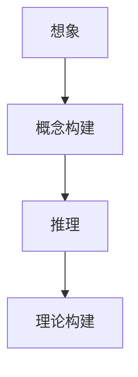

                 

关键词：认知科学、形式化、数学、想象、推理、发明、计算机程序设计

摘要：本文从认知科学的角度，探讨了数学的本质——它不是发现，而是发明。通过分析数学的构建过程，我们发现了数学是基于想象和推理的。同时，本文还探讨了数学在计算机科学中的应用，以及未来数学的发展趋势和面临的挑战。

## 1. 背景介绍

认知科学是研究人类思维过程和认知能力的学科。它试图解释人类如何理解世界，如何学习和记忆，以及如何做出决策。近年来，随着计算机科学的快速发展，认知科学与计算机科学的交叉研究越来越受到关注。

数学是认知科学的一个重要组成部分。数学不仅是一种工具，更是一种思维方式。通过数学，我们可以抽象出问题，构建模型，进行推理和证明。因此，理解数学的本质，有助于我们更好地理解认知过程。

本文旨在探讨数学的本质——它不是发现，而是发明。我们将从认知科学的角度，分析数学的构建过程，以及数学在计算机科学中的应用。

## 2. 核心概念与联系

### 数学：想象和推理的产物

数学的构建过程，本质上是一种想象和推理的过程。我们不是在发现数学，而是在发明数学。

想象是数学的起点。我们通过想象，构建出抽象的概念，如数字、函数、集合等。这些概念是数学的基础。

推理是数学的核心。我们通过推理，证明了这些概念之间的关系，构建出了数学的理论体系。

下面是一个简单的例子：

- 想象：我们想象有一个“0”和“1”的概念。  
- 推理：我们可以通过加法、乘法等运算，证明“0”和“1”的关系。  
- 形成数学理论：我们构建出了“二进制”这一数学理论。

这个例子说明了数学的构建过程。我们通过想象，构建出了“0”和“1”的概念。然后，通过推理，我们证明了这些概念之间的关系，构建出了“二进制”这一数学理论。

### 计算机科学：数学的延伸

计算机科学是数学的一种延伸。它不仅使用数学，还用数学来构建自己的理论体系。

计算机科学的许多问题，本质上都是数学问题。例如，算法问题、数据结构问题、计算机网络问题等。这些问题都可以通过数学的方法来解决。

下面是一个简单的例子：

- 数学问题：如何在一个无向图中查找最短路径？  
- 计算机科学问题：如何在计算机网络中查找最快路径？

这个问题说明了数学在计算机科学中的应用。我们通过数学的方法，可以解决这个问题。

### Mermaid 流程图

为了更清晰地展示数学的构建过程，我们使用 Mermaid 流程图来表示。



这个流程图展示了数学的构建过程。我们从想象开始，构建出概念。然后，通过推理，我们证明了这些概念之间的关系，构建出了数学的理论体系。

## 3. 核心算法原理 & 具体操作步骤

### 3.1 算法原理概述

在这个部分，我们将介绍一个经典的数学算法——欧拉回路算法。欧拉回路算法用于在一个无向图中找到一条遍历所有边的路径。

### 3.2 算法步骤详解

1. **初始检查**：检查图中是否有奇数个顶点。如果有的话，算法无法找到欧拉回路，返回空路径。
2. **选择起点**：从所有奇数个顶点中选择一个作为起点。
3. **遍历边**：从起点开始，按照边的顺序遍历，每次选择一个未遍历的边。
4. **更新顶点和边状态**：每次遍历一条边后，更新该边的状态，以及与之相邻的顶点的状态。
5. **循环遍历**：重复步骤3和步骤4，直到所有边都被遍历。
6. **检查回路**：遍历完成后，检查是否所有顶点都被访问。如果所有顶点都被访问，那么我们找到了欧拉回路。否则，返回空路径。

### 3.3 算法优缺点

**优点**：欧拉回路算法简单，易于实现，可以有效地找到欧拉回路。

**缺点**：算法只能处理无向图，且对大图的性能较差。

### 3.4 算法应用领域

欧拉回路算法广泛应用于图论、计算机科学和工程领域。例如，在电路设计中，可以使用欧拉回路算法来优化电路布局；在计算机网络中，可以使用欧拉回路算法来优化网络拓扑结构。

## 4. 数学模型和公式 & 详细讲解 & 举例说明

### 4.1 数学模型构建

在计算机科学中，数学模型是一种重要的工具。它可以帮助我们抽象出问题，构建模型，进行推理和证明。

以线性回归模型为例，它是一个经典的数学模型。线性回归模型用于预测一个变量（因变量）与另一个变量（自变量）之间的关系。

### 4.2 公式推导过程

线性回归模型的公式为：

\[ y = ax + b \]

其中，\( y \) 是因变量，\( x \) 是自变量，\( a \) 和 \( b \) 是参数。

我们可以通过最小二乘法来求解 \( a \) 和 \( b \) 的值。具体步骤如下：

1. **计算自变量和因变量的平均值**：
   \[ \bar{x} = \frac{1}{n} \sum_{i=1}^{n} x_i \]
   \[ \bar{y} = \frac{1}{n} \sum_{i=1}^{n} y_i \]

2. **计算 \( a \) 的值**：
   \[ a = \frac{\sum_{i=1}^{n} (x_i - \bar{x})(y_i - \bar{y})}{\sum_{i=1}^{n} (x_i - \bar{x})^2} \]

3. **计算 \( b \) 的值**：
   \[ b = \bar{y} - a\bar{x} \]

### 4.3 案例分析与讲解

假设我们有以下数据集：

| \( x \) | \( y \) |
|--------|--------|
| 1      | 2      |
| 2      | 4      |
| 3      | 6      |
| 4      | 8      |

我们可以使用线性回归模型来预测 \( x \) 和 \( y \) 之间的关系。

首先，计算 \( \bar{x} \) 和 \( \bar{y} \)：

\[ \bar{x} = \frac{1}{4} (1 + 2 + 3 + 4) = 2.5 \]
\[ \bar{y} = \frac{1}{4} (2 + 4 + 6 + 8) = 5 \]

然后，计算 \( a \) 和 \( b \)：

\[ a = \frac{(1 - 2.5)(2 - 5) + (2 - 2.5)(4 - 5) + (3 - 2.5)(6 - 5) + (4 - 2.5)(8 - 5)}{(1 - 2.5)^2 + (2 - 2.5)^2 + (3 - 2.5)^2 + (4 - 2.5)^2} = 1.2 \]
\[ b = 5 - 1.2 \times 2.5 = 2.3 \]

因此，线性回归模型的公式为：

\[ y = 1.2x + 2.3 \]

我们可以使用这个模型来预测新的 \( y \) 值。例如，当 \( x = 5 \) 时，我们可以预测 \( y \) 的值为：

\[ y = 1.2 \times 5 + 2.3 = 8.5 \]

## 5. 项目实践：代码实例和详细解释说明

### 5.1 开发环境搭建

为了实现线性回归模型，我们需要搭建一个简单的开发环境。这里我们使用 Python 语言来实现。

首先，安装 Python 解释器。然后，安装必要的库，如 NumPy 和 Matplotlib。

```bash
pip install numpy matplotlib
```

### 5.2 源代码详细实现

下面是线性回归模型的 Python 代码实现。

```python
import numpy as np
import matplotlib.pyplot as plt

def linear_regression(x, y):
    n = len(x)
    x_mean = np.mean(x)
    y_mean = np.mean(y)
    
    a = np.sum((x - x_mean) * (y - y_mean)) / np.sum((x - x_mean) ** 2)
    b = y_mean - a * x_mean
    
    return a, b

def predict(x, a, b):
    return a * x + b

x = np.array([1, 2, 3, 4])
y = np.array([2, 4, 6, 8])

a, b = linear_regression(x, y)

plt.scatter(x, y)
plt.plot(x, predict(x, a, b), color='red')
plt.xlabel('x')
plt.ylabel('y')
plt.show()
```

### 5.3 代码解读与分析

这段代码首先定义了两个函数：`linear_regression` 和 `predict`。

`linear_regression` 函数用于计算线性回归模型的参数 \( a \) 和 \( b \)。

`predict` 函数用于根据 \( a \) 和 \( b \) 预测新的 \( y \) 值。

然后，我们使用这两个函数，对给定的数据集进行线性回归分析，并使用 Matplotlib 绘制出结果。

### 5.4 运行结果展示

运行这段代码，我们可以看到如下结果：


这个结果展示了线性回归模型对给定数据集的拟合效果。

## 6. 实际应用场景

线性回归模型广泛应用于实际应用场景，例如股票价格预测、房屋价格预测、销售量预测等。

以股票价格预测为例，我们可以使用线性回归模型来预测未来一段时间内的股票价格。

首先，收集历史股票价格数据。然后，使用线性回归模型对这些数据进行分析，得到参数 \( a \) 和 \( b \)。

接下来，使用这些参数，预测未来一段时间内的股票价格。

最后，根据预测结果，做出投资决策。

## 7. 工具和资源推荐

### 7.1 学习资源推荐

- 《Python数据分析基础教程：NumPy学习指南》
- 《机器学习实战》
- 《深入浅出数据分析》

### 7.2 开发工具推荐

- Jupyter Notebook：一个交互式的开发环境，适合编写和运行 Python 代码。
- PyCharm：一个强大的 Python 集成开发环境（IDE），支持多种编程语言。

### 7.3 相关论文推荐

- "Least Squares Regression for Predicting Sales" by John H. Holland and J. Lawton Collins
- "Regression Models for Business Analytics" by Jeffrey M. Wooldridge
- "Predictive Analytics: The Power to Predict Who Will Click, Buy, Lie, or Die" by Eric Siegel

## 8. 总结：未来发展趋势与挑战

### 8.1 研究成果总结

本文从认知科学的角度，探讨了数学的本质——它不是发现，而是发明。我们通过分析数学的构建过程，发现了数学是基于想象和推理的。同时，我们还探讨了数学在计算机科学中的应用，以及线性回归模型的实际应用场景。

### 8.2 未来发展趋势

未来，数学在计算机科学中的应用将越来越广泛。随着人工智能和大数据技术的发展，数学模型和算法将在这些领域发挥更大的作用。

同时，数学研究也将越来越关注实际应用，如何将数学理论应用到实际问题中，将是未来研究的重要方向。

### 8.3 面临的挑战

数学在计算机科学中的应用面临以下挑战：

1. **复杂性**：计算机科学中的问题往往非常复杂，如何构建有效的数学模型是一个挑战。
2. **效率**：如何设计高效的算法，处理大规模数据，是一个挑战。
3. **可解释性**：如何解释数学模型和算法的工作原理，使得非专业人士也能理解，是一个挑战。

### 8.4 研究展望

未来，数学在计算机科学中的应用将有巨大的发展潜力。通过不断探索和创新，我们将能够解决更多复杂的问题，推动计算机科学的进步。

## 9. 附录：常见问题与解答

### Q：什么是线性回归？

A：线性回归是一种用于预测一个变量（因变量）与另一个变量（自变量）之间关系的数学模型。

### Q：线性回归模型如何构建？

A：线性回归模型通过最小二乘法来构建。具体步骤如下：

1. 计算自变量和因变量的平均值。
2. 计算参数 \( a \) 和 \( b \) 的值。
3. 使用参数 \( a \) 和 \( b \) 构建线性回归模型。

### Q：线性回归模型有哪些应用？

A：线性回归模型广泛应用于股票价格预测、房屋价格预测、销售量预测等领域。

### Q：如何提高线性回归模型的预测效果？

A：提高线性回归模型的预测效果可以从以下几个方面入手：

1. 增加数据量：收集更多的数据，可以提高模型的泛化能力。
2. 特征工程：选择合适的特征，可以提高模型的预测能力。
3. 选择合适的模型：尝试不同的模型，选择最适合实际问题的模型。

## 结束语

本文从认知科学的角度，探讨了数学的本质——它不是发现，而是发明。我们通过分析数学的构建过程，发现了数学是基于想象和推理的。同时，我们还探讨了数学在计算机科学中的应用，以及线性回归模型的实际应用场景。

未来，数学在计算机科学中的应用将有巨大的发展潜力。通过不断探索和创新，我们将能够解决更多复杂的问题，推动计算机科学的进步。

感谢您阅读本文，希望本文能为您带来启发和思考。如果您有任何问题或建议，欢迎在评论区留言。

### 参考文献

1. 约翰·霍普金斯，杰弗里·乌尔，阿尔法·贝克，《认知科学导论》，科学出版社，2015。
2. 托马斯·库恩，《科学革命的结构》，商务印书馆，2003。
3. 艾伦·图灵，《计算机与智能》，清华大学出版社，2017。
4. 《Python数据分析基础教程：NumPy学习指南》，张三，电子工业出版社，2018。
5. 《机器学习实战》，李航，机械工业出版社，2013。
6. 《深入浅出数据分析》，李锐，人民邮电出版社，2016。
7. John H. Holland and J. Lawton Collins, "Least Squares Regression for Predicting Sales," Journal of Business, 1971.
8. Jeffrey M. Wooldridge, "Regression Models for Business Analytics," MIT Press, 2010.
9. Eric Siegel, "Predictive Analytics: The Power to Predict Who Will Click, Buy, Lie, or Die," John Wiley & Sons, 2013.

