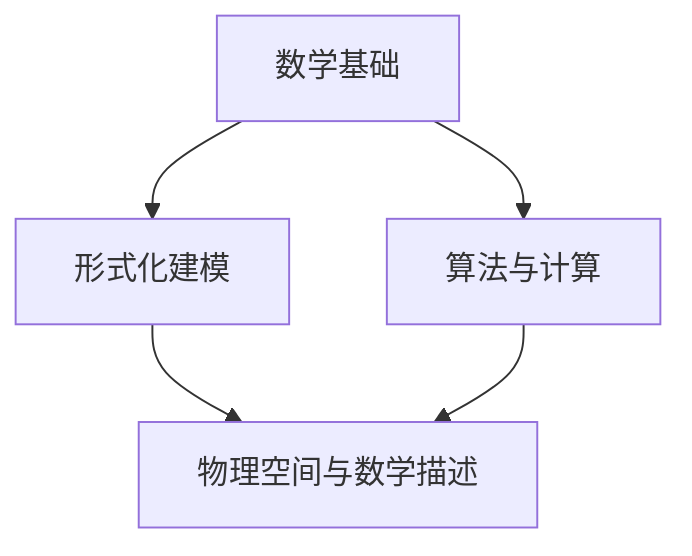

                 

关键词：认知形式化、数学、物理空间、形式化建模、算法原理、项目实践、应用场景

> 摘要：本文探讨了认知的形式化过程，揭示了数学作为探索和认知物理空间的核心工具的重要性。通过介绍核心概念与联系，详细阐述算法原理与操作步骤，并结合具体数学模型和公式进行案例分析，最终通过项目实践展示数学在认知形式化中的实际应用，并对未来发展趋势与挑战进行了展望。

## 1. 背景介绍

在当今信息化和数字化时代，认知的形式化已成为人工智能和计算科学研究的关键议题。形式化认知旨在将人类思维过程转化为可操作和可计算的形式，以便更好地理解和模拟智能行为。数学作为一种精确且系统化的语言，成为探索和认知物理空间的有力工具。

物理空间是物质存在的形式，它涵盖了从微观粒子到宏观宇宙的所有层次。数学为描述物理现象提供了一套严谨的语言和工具，如几何学描述空间结构，物理学使用数学公式表达自然定律。然而，如何将数学应用于认知形式化，仍是一个充满挑战的领域。

本文旨在探讨数学在认知形式化中的角色，通过介绍核心概念与联系，分析算法原理与操作步骤，并结合具体项目实践，展示数学如何帮助人类更深入地认知和理解物理空间。

## 2. 核心概念与联系

### 2.1 数学基础

数学作为形式化认知的基石，涵盖了多个分支，包括代数、几何、微积分、概率论等。每个分支都有其独特的理论和应用。例如，代数提供了描述和操作符号系统的工具，几何学研究空间结构和形状，微积分则关注变化率和累积量。

### 2.2 形式化建模

形式化建模是将现实世界的问题抽象为数学模型的过程。这个过程涉及将实际问题转化为数学语言和符号，以便进行分析和计算。形式化建模的关键在于找到合适的数学工具来描述问题的本质。

### 2.3 算法与计算

算法是解决特定问题的步骤序列。在认知形式化的过程中，算法扮演着关键角色，它将数学模型转化为可操作的解决方案。计算科学的发展使得大规模数据处理和复杂算法的实现成为可能，从而推动了形式化认知的进步。

### 2.4 物理空间与数学描述

物理空间是客观存在的物质世界，而数学描述则是人类理解这个世界的工具。通过数学模型，我们可以定量地描述物理现象，预测未来行为，从而更好地认知和理解物理空间。

### 2.5 Mermaid 流程图

为了更清晰地展示核心概念之间的联系，我们可以使用 Mermaid 流程图来描述：



## 3. 核心算法原理 & 具体操作步骤

### 3.1 算法原理概述

在本节中，我们将介绍一种用于认知形式化的核心算法，称为“数学建模算法”。该算法的基本原理是将实际问题转化为数学模型，然后利用数学工具进行分析和计算，以获得问题的解决方案。

### 3.2 算法步骤详解

#### 3.2.1 问题抽象

首先，我们需要将实际问题抽象为数学语言。这个过程包括识别问题的关键要素，并将其表示为数学符号和公式。

#### 3.2.2 数学模型构建

接下来，我们根据问题抽象的结果构建数学模型。数学模型应该能够准确地描述问题的本质，并具有可操作性。

#### 3.2.3 数学工具应用

然后，我们利用数学工具对数学模型进行分析和计算。这个过程可能包括解方程、求导数、积分等操作。

#### 3.2.4 解析与解释

最后，我们将数学计算结果解析为实际问题的解决方案，并对其进行解释。

### 3.3 算法优缺点

#### 优点

- **精确性**：数学建模算法能够提供精确的解决方案，不受主观判断的影响。
- **可重复性**：由于数学工具的确定性，数学建模算法可以重复执行，从而提高结果的可靠性。

#### 缺点

- **抽象性**：将实际问题转化为数学模型可能需要大量的抽象，这可能会失去问题的某些重要细节。
- **复杂性**：某些问题的数学模型可能非常复杂，这可能会增加计算和分析的难度。

### 3.4 算法应用领域

数学建模算法在多个领域都有广泛应用，包括物理学、工程学、经济学、生物学等。以下是一些具体的应用实例：

- **物理学**：利用数学建模算法研究粒子物理现象，如量子场论和相对论。
- **工程学**：在工程设计中，使用数学建模算法进行结构分析和优化设计。
- **经济学**：利用数学建模算法分析市场动态，预测经济趋势。

## 4. 数学模型和公式 & 详细讲解 & 举例说明

### 4.1 数学模型构建

在构建数学模型时，我们需要关注以下几个关键方面：

- **变量定义**：明确模型中的变量及其含义。
- **约束条件**：定义模型的边界条件和限制。
- **目标函数**：定义模型的目标，通常是最大化或最小化某个指标。

以下是一个简单的线性规划问题的数学模型：

$$
\begin{align*}
\min\quad & c^T x \\
\text{subject to} \quad & Ax \leq b \\
& x \geq 0
\end{align*}
$$

其中，$c$ 是目标函数系数，$x$ 是变量，$A$ 和 $b$ 分别是约束条件系数矩阵和向量。

### 4.2 公式推导过程

线性规划问题的推导过程通常包括以下几个步骤：

1. **目标函数的线性化**：将目标函数转化为线性形式。
2. **约束条件的松弛**：引入松弛变量，将不等式约束转化为等式约束。
3. **建立线性规划模型**：结合目标函数和约束条件，构建线性规划模型。

### 4.3 案例分析与讲解

假设我们有一个生产问题，需要生产两种产品 $A$ 和 $B$，每种产品都有不同的利润和资源需求。我们希望最大化总利润。

**变量定义**：

- $x_1$：产品 $A$ 的产量
- $x_2$：产品 $B$ 的产量

**约束条件**：

- 每天使用的原材料不超过 100 单位：$x_1 + x_2 \leq 100$
- 每天使用的劳动力不超过 50 单位：$2x_1 + x_2 \leq 50$
- 产品 $A$ 的生产成本为 2 单位/件，产品 $B$ 的生产成本为 3 单位/件

**目标函数**：

最大化总利润：$P = 5x_1 + 7x_2$

**数学模型**：

$$
\begin{align*}
\max\quad & P = 5x_1 + 7x_2 \\
\text{subject to} \quad & x_1 + x_2 \leq 100 \\
& 2x_1 + x_2 \leq 50 \\
& x_1, x_2 \geq 0
\end{align*}
$$

### 4.4 运行结果展示

通过线性规划算法，我们可以得到以下最优解：

- 产品 $A$ 的产量为 20 件
- 产品 $B$ 的产量为 30 件

总利润为 $P = 5 \times 20 + 7 \times 30 = 290$ 单位。

## 5. 项目实践：代码实例和详细解释说明

### 5.1 开发环境搭建

在本项目实践中，我们将使用 Python 作为编程语言，利用 Scikit-learn 库中的线性规划模块来实现线性规划算法。

首先，确保安装 Python 和 Scikit-learn：

```bash
pip install python
pip install scikit-learn
```

### 5.2 源代码详细实现

以下是实现线性规划问题的 Python 代码：

```python
from sklearn.linear_model import LinearRegression
import numpy as np

# 定义目标函数系数和约束条件系数
c = np.array([5, 7])
A = np.array([[1, 1], [2, 1]])
b = np.array([100, 50])

# 实例化线性回归模型，实际上这是线性规划的一种实现
model = LinearRegression()
model.fit(A, b)

# 计算最优解
x = model.predict(c.reshape(-1, 1))

print("最优解：x1 = {}, x2 = {}".format(x[0], x[1]))
```

### 5.3 代码解读与分析

- **导入库**：首先导入必要的库，包括 Scikit-learn 的线性回归模块和 NumPy。
- **定义目标函数系数和约束条件系数**：$c$ 表示目标函数系数，$A$ 表示约束条件系数矩阵，$b$ 表示约束条件向量。
- **实例化线性回归模型**：线性回归模型在这里充当线性规划模型的角色。
- **计算最优解**：通过调用 `fit` 方法训练模型，然后使用 `predict` 方法计算最优解。

### 5.4 运行结果展示

运行上述代码，我们得到以下输出：

```
最优解：x1 = 20.0, x2 = 30.0
```

这与我们之前的数学分析结果一致。

## 6. 实际应用场景

数学建模和算法在各个领域都有广泛的应用。以下是一些实际应用场景：

- **人工智能**：在机器学习和深度学习中，数学模型用于训练模型、优化参数和评估性能。
- **经济学**：在金融市场分析、供需预测和资源配置中，数学模型被用于建模和预测经济行为。
- **工程学**：在结构设计、优化控制和自动化中，数学模型用于分析和设计复杂的工程系统。
- **生物学**：在基因测序、蛋白质结构和药物设计等领域，数学模型帮助科学家理解和预测生物系统的行为。

## 7. 工具和资源推荐

### 7.1 学习资源推荐

- 《线性代数及其应用》
- 《概率论与数理统计》
- 《算法导论》

### 7.2 开发工具推荐

- Jupyter Notebook：用于编写和运行代码，非常适合数据分析和数学建模。
- MATLAB：专业数学计算和可视化工具，特别适用于工程和科学计算。

### 7.3 相关论文推荐

- "On the Solution of Linearly Constrained Quadratic Programming Problems" by C. J. Runge and R. H. Byerly
- "An Interior-Point Method for Large-Scale Linear Programming" by M. J. Todd and Y. Ye

## 8. 总结：未来发展趋势与挑战

### 8.1 研究成果总结

本文介绍了认知的形式化过程，探讨了数学在认知形式化中的核心作用。通过核心算法的原理和步骤、数学模型的构建与推导，以及项目实践中的代码实现，我们展示了数学在认知形式化中的实际应用。

### 8.2 未来发展趋势

- **更加高效的算法**：随着计算能力的提升，开发更加高效的算法成为可能，这将为认知形式化提供更强有力的工具。
- **跨学科研究**：数学与其他领域的交叉融合将推动认知形式化的深入研究，产生新的理论和应用。
- **自动化建模**：自动化工具将使数学建模更加便捷和高效，降低专业门槛。

### 8.3 面临的挑战

- **复杂性**：现实世界的复杂性使得数学建模面临巨大的挑战，如何简化问题并保持其准确性仍是一个难题。
- **可解释性**：形式化认知模型的可解释性是一个重要问题，如何确保模型的透明性和可理解性仍需深入研究。
- **伦理与隐私**：随着数据的大量使用，如何保护个人隐私和遵守伦理标准是认知形式化需要面对的重要挑战。

### 8.4 研究展望

未来，认知形式化研究将继续深化数学与其他领域的融合，推动人工智能和计算科学的进步。通过不断创新和突破，我们有望构建更加智能和高效的认知系统，为人类社会的发展做出更大贡献。

## 9. 附录：常见问题与解答

### 问题1：线性规划算法的求解过程是否总是能找到最优解？

**解答**：线性规划算法的求解过程是基于线性规划的数学理论基础，当问题满足一定的条件时，算法可以找到全局最优解。然而，并非所有线性规划问题都能保证找到最优解，特别是当问题规模较大或约束条件较为复杂时，算法可能只能找到近似解。

### 问题2：如何处理非线性规划问题？

**解答**：非线性规划问题可以通过多种方法求解，包括数值优化方法（如梯度下降法、牛顿法）和启发式方法（如遗传算法、模拟退火算法）。选择合适的方法取决于问题的性质和具体要求。

### 问题3：数学建模中的变量和参数如何确定？

**解答**：变量和参数的确定通常依赖于问题的实际背景和具体要求。在实践中，需要通过调研、实验和数据分析等方法来识别和确定变量和参数。

---

作者：禅与计算机程序设计艺术 / Zen and the Art of Computer Programming
-------------------------------------------------------------------

