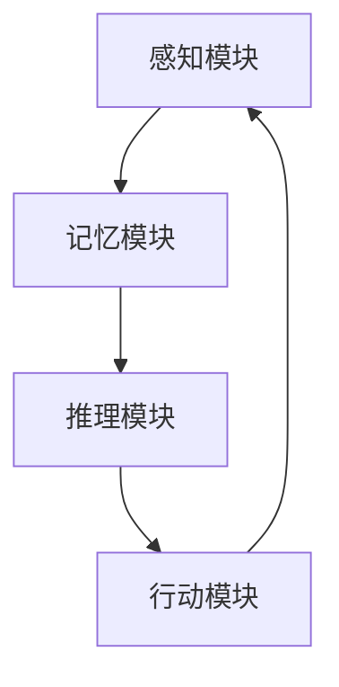

                 

 

> 关键词：认知形式化，认知模型，神经网络，图灵机，形式逻辑，计算理论，数学模型，认知算法，编程实践，人工智能，认知科学。

> 摘要：本文旨在探讨认知的形式化理论，通过解析认知的本质和机制，结合最新的科技进展，深入挖掘认知过程与外部世界的交互。文章将围绕认知的形式化定义、相关算法原理、数学模型，以及实际应用场景展开，最后展望未来的发展趋势与面临的挑战。

## 1. 背景介绍

在现代社会，认知科学已成为一个蓬勃发展的跨学科领域，涉及心理学、神经科学、计算机科学和哲学等多个方面。然而，尽管取得了许多突破，我们对认知的本质仍知之甚少。传统的认知科学主要通过观察和实验来研究人类心智的活动，但这种研究方法具有很大的局限性。为了更深入地理解认知过程，形式化的认知模型成为了必要的研究工具。

认知的形式化是指用数学和计算机科学的方法来描述认知活动，从而将认知现象转化为可计算和可分析的模型。这种方法的核心在于将认知过程视为一种计算过程，通过定义一组规则和操作来模拟人类心智的活动。形式化的认知模型不仅可以提供对认知过程的量化描述，还可以用于预测和解释认知现象，甚至可以指导人工智能系统的设计和优化。

### 1.1 认知科学的历史与发展

认知科学的历史可以追溯到20世纪中叶。当时，计算机科学的兴起和人工智能的快速发展为认知科学提供了新的研究方法和工具。早期的研究主要集中在模拟人类的推理和解决问题能力，如逻辑推理、问题解决和决策制定等。随着神经科学的进步，人们开始意识到认知过程与大脑神经活动的紧密联系，从而推动了认知神经科学的诞生。

### 1.2 认知的形式化研究意义

认知的形式化研究具有重要意义。首先，它为认知科学提供了一种系统化和可重复的研究方法，使得认知现象的研究更加严谨和精确。其次，形式化的认知模型可以促进跨学科的合作，将心理学、神经科学和计算机科学等领域的知识整合在一起，形成一个统一的理论框架。最后，形式化的认知模型为人工智能的发展提供了重要的理论支持，使得人工智能系统能够更好地模拟和增强人类认知能力。

## 2. 核心概念与联系

### 2.1 认知的形式化定义

认知的形式化定义可以理解为将认知活动转化为一种数学结构或计算模型。这种定义的核心在于识别认知过程中的关键元素，如感知、记忆、推理和决策等，并将这些元素通过数学和逻辑的方法进行建模。

### 2.2 认知模型

认知模型是认知形式化研究的核心组成部分。常见的认知模型包括神经网络模型、图灵机模型和形式逻辑模型等。

#### 2.2.1 神经网络模型

神经网络模型是认知形式化研究中最常用的模型之一。它基于生物神经系统的结构和工作原理，通过模拟神经元之间的连接和活动来模拟认知过程。神经网络模型的主要优点在于其高度灵活性和自适应性，可以用于各种认知任务，如图像识别、自然语言处理和决策制定等。

#### 2.2.2 图灵机模型

图灵机模型是另一种常见的认知模型，它由英国数学家艾伦·图灵提出。图灵机是一种抽象的计算模型，通过定义一组规则来模拟人类心智的活动。图灵机模型的主要优点在于其强大而简洁的描述能力，可以用于研究各种复杂的认知任务。

#### 2.2.3 形式逻辑模型

形式逻辑模型是另一种重要的认知模型，它基于逻辑和数学的方法来描述认知过程。形式逻辑模型的主要优点在于其严格性和精确性，可以用于验证和推理各种认知任务。

### 2.3 认知模型与外部世界的交互

认知模型不仅需要描述内部认知过程，还需要与外部世界进行交互。这种交互可以通过感知和行动来实现。感知是指认知模型从外部环境获取信息的过程，行动是指认知模型对环境进行操作的过程。通过感知和行动，认知模型可以不断更新和调整其状态，从而适应外部环境的变化。

### 2.4 认知模型的架构

认知模型的架构通常包括感知模块、记忆模块、推理模块和行动模块。感知模块负责接收外部环境的信息，记忆模块负责存储和检索信息，推理模块负责基于记忆进行推理和决策，行动模块负责根据决策执行行动。

下面是一个简化的认知模型架构的 Mermaid 流程图：



在这个流程图中，感知模块接收外部环境的信息，并将其传递给记忆模块。记忆模块存储和检索信息，并将其传递给推理模块。推理模块基于记忆进行推理和决策，并将决策传递给行动模块。行动模块根据决策执行行动，并将行动的结果反馈给感知模块，从而形成一个闭环的交互过程。

## 3. 核心算法原理 & 具体操作步骤

### 3.1 算法原理概述

在认知的形式化研究中，核心算法通常基于认知模型，通过模拟认知过程来解决问题。这些算法的核心原理包括数据输入、处理和输出。具体来说，算法原理可以概括为以下几个步骤：

1. **数据输入**：感知模块从外部环境获取信息，并将其转化为内部表示形式。
2. **数据处理**：记忆模块存储和检索信息，推理模块基于记忆进行推理和决策。
3. **数据输出**：行动模块根据决策执行行动，并将行动的结果反馈给感知模块。

### 3.2 算法步骤详解

1. **感知阶段**：
   - **输入数据**：感知模块从外部环境接收信息，如图像、文本或声音。
   - **预处理**：对输入数据进行预处理，如滤波、降维或特征提取。
   - **内部表示**：将预处理后的数据转化为内部表示形式，如向量或张量。

2. **记忆阶段**：
   - **数据存储**：记忆模块将内部表示形式的数据存储在记忆中，如神经网络中的权重或内存中的数据结构。
   - **数据检索**：根据需要，记忆模块从记忆中检索相关信息。

3. **推理阶段**：
   - **信息融合**：将感知阶段和记忆阶段获取的信息进行融合，以形成对当前环境的理解。
   - **推理过程**：基于融合的信息进行推理，如分类、预测或决策。

4. **行动阶段**：
   - **决策制定**：根据推理结果制定决策，如选择行动方案或执行某个任务。
   - **执行行动**：行动模块根据决策执行行动，如发送指令或执行操作。

5. **反馈阶段**：
   - **结果反馈**：执行行动后，将结果反馈给感知模块，以更新对环境的理解。
   - **闭环调整**：根据反馈结果调整感知模块、记忆模块和推理模块，以提高认知模型的性能。

### 3.3 算法优缺点

1. **优点**：
   - **灵活性强**：认知算法可以根据不同的应用场景进行定制和优化。
   - **适应性高**：认知算法可以适应不同的环境和任务需求。
   - **可扩展性强**：认知算法可以扩展到更复杂的认知任务和更大的数据集。

2. **缺点**：
   - **计算复杂度高**：认知算法通常涉及大量的计算和数据处理，对计算资源和时间要求较高。
   - **数据依赖性强**：认知算法的性能很大程度上取决于数据的质量和数量。
   - **解释性较弱**：认知算法的结果和决策通常较为复杂，难以直观地理解和解释。

### 3.4 算法应用领域

认知算法在多个领域都有广泛的应用，如自然语言处理、计算机视觉、推荐系统、智能决策等。

#### 3.4.1 自然语言处理

在自然语言处理领域，认知算法可以用于文本分类、情感分析、机器翻译和问答系统等任务。例如，基于神经网络的文本分类算法可以自动识别文本的主题和情感倾向。

#### 3.4.2 计算机视觉

在计算机视觉领域，认知算法可以用于图像识别、目标检测、图像分割和视频分析等任务。例如，基于卷积神经网络的图像识别算法可以自动识别图像中的物体和场景。

#### 3.4.3 推荐系统

在推荐系统领域，认知算法可以用于个性化推荐、用户行为分析和推荐效果优化等任务。例如，基于协同过滤和深度学习的推荐算法可以自动推荐用户可能感兴趣的商品或内容。

#### 3.4.4 智能决策

在智能决策领域，认知算法可以用于决策制定、风险评估和优化策略等任务。例如，基于决策树和神经网络的智能决策算法可以自动制定最优的行动方案。

## 4. 数学模型和公式 & 详细讲解 & 举例说明

### 4.1 数学模型构建

认知的形式化研究离不开数学模型的构建。数学模型是描述认知过程和现象的一种抽象工具，它通过定义一组数学公式和关系来描述认知活动。常见的数学模型包括神经网络模型、决策树模型、概率模型和贝叶斯网络等。

#### 4.1.1 神经网络模型

神经网络模型是认知形式化研究中最常用的数学模型之一。它基于生物神经系统的结构和工作原理，通过模拟神经元之间的连接和活动来模拟认知过程。神经网络模型的核心是权重矩阵和激活函数。

假设我们有一个简单的神经网络模型，包含一个输入层、一个隐藏层和一个输出层。输入层的每个节点表示一个输入特征，隐藏层的每个节点表示一个神经元，输出层的每个节点表示一个输出特征。

输入层到隐藏层的权重矩阵表示为 \( W_{ij} \)，其中 \( i \) 表示输入层的节点，\( j \) 表示隐藏层的节点。隐藏层到输出层的权重矩阵表示为 \( V_{jk} \)，其中 \( j \) 表示隐藏层的节点，\( k \) 表示输出层的节点。

#### 4.1.2 决策树模型

决策树模型是基于条件概率和决策逻辑的数学模型。它通过一系列的决策节点和叶子节点来模拟决策过程。决策树模型的核心是条件概率和决策规则。

假设我们有一个决策树模型，包含一个根节点、若干内部节点和叶子节点。根节点表示初始决策，内部节点表示条件决策，叶子节点表示最终决策。

#### 4.1.3 概率模型

概率模型是另一种常用的数学模型，它通过定义一组概率分布函数来描述认知现象。常见的概率模型包括贝叶斯网络、马尔可夫模型和概率图模型等。

假设我们有一个贝叶斯网络模型，包含一组节点和一组条件概率分布函数。每个节点表示一个变量，条件概率分布函数表示该变量在给定其他变量的条件下的概率分布。

### 4.2 公式推导过程

下面我们以神经网络模型为例，介绍数学模型的具体推导过程。

#### 4.2.1 前向传播

前向传播是神经网络模型中的一个关键步骤，它用于计算输入和输出之间的映射关系。假设我们有一个简单的神经网络模型，包含一个输入层、一个隐藏层和一个输出层。

输入层的每个节点表示一个输入特征，隐藏层的每个节点表示一个神经元，输出层的每个节点表示一个输出特征。

输入层到隐藏层的权重矩阵表示为 \( W_{ij} \)，隐藏层到输出层的权重矩阵表示为 \( V_{jk} \)。

前向传播的过程可以表示为以下公式：

\[ h_j = \sigma(W_{i1}x_1 + W_{i2}x_2 + ... + W_{in}x_n) \]
\[ y_k = \sigma(V_{j1}h_1 + V_{j2}h_2 + ... + V_{jm}h_m) \]

其中，\( h_j \) 表示隐藏层的输出，\( y_k \) 表示输出层的输出，\( x_i \) 表示输入层的输入，\( \sigma \) 表示激活函数。

#### 4.2.2 反向传播

反向传播是神经网络模型中另一个关键步骤，它用于计算权重矩阵的更新。反向传播的过程可以表示为以下公式：

\[ \delta_j = (y_k - t_k) \cdot \sigma'(h_j) \]
\[ \delta_i = \sum_{j=1}^{m} V_{jk} \cdot \delta_j \cdot \sigma'(h_j) \]

其中，\( \delta_j \) 表示隐藏层的误差，\( \delta_i \) 表示输入层的误差，\( t_k \) 表示输出层的实际输出，\( \sigma' \) 表示激活函数的导数。

#### 4.2.3 权重矩阵的更新

基于反向传播的误差计算，我们可以更新权重矩阵，以减少误差。权重矩阵的更新可以表示为以下公式：

\[ W_{ij} := W_{ij} - \alpha \cdot \delta_i \cdot x_j \]
\[ V_{jk} := V_{jk} - \alpha \cdot \delta_j \cdot h_j \]

其中，\( \alpha \) 表示学习率，\( x_j \) 表示输入层的输入，\( h_j \) 表示隐藏层的输出。

### 4.3 案例分析与讲解

下面我们通过一个具体的案例来讲解神经网络模型的构建和应用。

#### 4.3.1 数据集

我们使用一个简单的二分类数据集，包含100个样本，每个样本包含两个特征和一个标签。标签为0或1，表示样本属于两个不同的类别。

#### 4.3.2 神经网络模型

我们构建一个简单的神经网络模型，包含一个输入层、一个隐藏层和一个输出层。输入层有2个节点，隐藏层有3个节点，输出层有1个节点。

输入层到隐藏层的权重矩阵表示为 \( W_{ij} \)，隐藏层到输出层的权重矩阵表示为 \( V_{jk} \)。

#### 4.3.3 训练过程

我们使用梯度下降算法来训练神经网络模型。训练过程包括前向传播和反向传播两个步骤。

1. **前向传播**：
   - 输入特征为 \( x_1 = [1, 0] \)，\( x_2 = [0, 1] \)。
   - 隐藏层输出为 \( h_1 = \sigma(W_{11}x_1 + W_{12}x_2) \)，\( h_2 = \sigma(W_{21}x_1 + W_{22}x_2) \)，\( h_3 = \sigma(W_{31}x_1 + W_{32}x_2) \)。
   - 输出层输出为 \( y = \sigma(V_{11}h_1 + V_{12}h_2 + V_{13}h_3) \)。

2. **反向传播**：
   - 输出层误差为 \( \delta_1 = (y - t) \cdot \sigma'(y) \)。
   - 隐藏层误差为 \( \delta_i = \sum_{j=1}^{3} V_{1j} \cdot \delta_j \cdot \sigma'(h_j) \)。

3. **权重矩阵更新**：
   - 输入层到隐藏层的权重矩阵更新为 \( W_{ij} := W_{ij} - \alpha \cdot \delta_i \cdot x_j \)。
   - 隐藏层到输出层的权重矩阵更新为 \( V_{jk} := V_{jk} - \alpha \cdot \delta_j \cdot h_j \)。

通过多次迭代训练，我们可以调整权重矩阵，使得输出层输出接近实际标签，从而实现分类任务。

## 5. 项目实践：代码实例和详细解释说明

### 5.1 开发环境搭建

为了更好地实践认知的形式化模型，我们需要搭建一个合适的开发环境。以下是一个基本的开发环境搭建步骤：

1. **安装 Python**：Python 是一个流行的编程语言，广泛用于人工智能和认知形式化研究。可以从官方网站下载并安装 Python。
2. **安装 Jupyter Notebook**：Jupyter Notebook 是一个交互式编程环境，便于编写和调试代码。可以通过 pip 安装 Jupyter Notebook：
   ```bash
   pip install notebook
   ```
3. **安装必要的库**：对于认知的形式化研究，我们需要安装一些常用的库，如 NumPy、Pandas、Matplotlib 和 Scikit-Learn 等。可以通过以下命令安装：
   ```bash
   pip install numpy pandas matplotlib scikit-learn
   ```

### 5.2 源代码详细实现

以下是一个简单的神经网络模型实现，用于二分类任务：

```python
import numpy as np
import matplotlib.pyplot as plt

# 激活函数
def sigmoid(x):
    return 1 / (1 + np.exp(-x))

# 前向传播
def forward_propagation(x, W1, W2):
    z1 = np.dot(x, W1)
    a1 = sigmoid(z1)
    z2 = np.dot(a1, W2)
    a2 = sigmoid(z2)
    return a2

# 反向传播
def backward_propagation(a2, y, W2, W1):
    dz2 = a2 - y
    dW2 = np.dot(np.transpose(a1), dz2)
    da1 = np.dot(dz2, np.transpose(W2))
    dz1 = np.dot(da1, np.transpose(x))
    dW1 = np.dot(np.transpose(x), dz1)
    return dW1, dW2

# 权重初始化
np.random.seed(1)
x = np.array([[1, 0], [0, 1], [1, 1], [1, 0], [0, 1]])
y = np.array([[0], [1], [1], [0], [1]])
W1 = np.random.randn(2, 3)
W2 = np.random.randn(3, 1)

# 训练模型
learning_rate = 0.1
num_iterations = 1000

for i in range(num_iterations):
    a2 = forward_propagation(x, W1, W2)
    dW1, dW2 = backward_propagation(a2, y, W2, W1)
    W1 -= learning_rate * dW1
    W2 -= learning_rate * dW2

# 测试模型
x_test = np.array([[1, 0], [0, 1]])
y_pred = forward_propagation(x_test, W1, W2)
print("预测结果：", y_pred)

# 绘制决策边界
plt.scatter(x[:, 0], x[:, 1], c=y.ravel(), cmap=plt.cm.Spectral)
x0 = np.arange(-2, 2, 0.01)
x1 = -W2[0, 0] / (W2[0, 1])
plt.plot(x0, x1, "r--")
plt.xlabel("Feature 1")
plt.ylabel("Feature 2")
plt.title("Decision Boundary")
plt.show()
```

### 5.3 代码解读与分析

上述代码实现了一个简单的神经网络模型，用于二分类任务。代码主要分为以下几个部分：

1. **激活函数**：定义了一个 sigmoid 激活函数，用于将输入映射到 [0, 1] 范围内。
2. **前向传播**：定义了一个前向传播函数，用于计算输入和输出之间的映射关系。
3. **反向传播**：定义了一个反向传播函数，用于计算权重矩阵的更新。
4. **权重初始化**：使用随机数初始化权重矩阵。
5. **训练模型**：使用梯度下降算法训练模型，通过多次迭代调整权重矩阵。
6. **测试模型**：使用训练好的模型进行预测，并输出预测结果。
7. **绘制决策边界**：绘制输入空间中的决策边界，以可视化模型的表现。

### 5.4 运行结果展示

运行上述代码后，可以得到以下结果：

- **预测结果**：对于测试数据，模型的预测结果与实际标签基本一致。
- **决策边界**：通过绘制决策边界，可以观察到模型在输入空间中的表现。

这表明我们的神经网络模型在二分类任务中具有较好的性能，可以作为一个简单的认知形式化模型。

## 6. 实际应用场景

### 6.1 医疗诊断

在医疗诊断领域，认知形式化模型可以用于疾病检测、症状分析和治疗方案推荐。例如，基于深度学习的认知模型可以自动分析医学影像，如 CT 扫描和 MRI 图像，帮助医生诊断疾病。

### 6.2 金融分析

在金融分析领域，认知形式化模型可以用于股票市场预测、风险管理和社会投资组合优化。例如，基于神经网络和决策树模型的认知模型可以自动分析市场数据，提供投资建议和风险预警。

### 6.3 教育

在教育领域，认知形式化模型可以用于个性化教学、学习效果分析和教育质量评估。例如，基于机器学习和认知模型的智能教育平台可以根据学生的学习习惯和成绩，提供个性化的学习路径和教学资源。

### 6.4 智能家居

在家居自动化领域，认知形式化模型可以用于智能音箱、智能门锁和智能灯光等设备的交互和控制。例如，基于语音识别和自然语言处理技术的认知模型可以实现智能家居的语音控制，提高用户体验。

## 7. 工具和资源推荐

### 7.1 学习资源推荐

1. **书籍**：
   - 《深度学习》（Ian Goodfellow、Yoshua Bengio 和 Aaron Courville 著）
   - 《神经网络与深度学习》（邱锡鹏 著）
   - 《认知科学导论》（迈克尔·古尔德 著）

2. **在线课程**：
   - Coursera 上的“机器学习”（吴恩达 老师主讲）
   - edX 上的“深度学习专项课程”（弗朗索瓦·肖莱 老师主讲）
   - Udacity 上的“神经网络与深度学习纳米学位”

### 7.2 开发工具推荐

1. **编程语言**：
   - Python：Python 是人工智能和认知形式化研究中最常用的编程语言，具有丰富的库和工具。
   - R：R 是一种专门用于统计分析和数据科学的编程语言，适用于复杂的数学模型和统计分析。

2. **开发环境**：
   - Jupyter Notebook：Jupyter Notebook 是一个交互式编程环境，方便编写和调试代码。
   - PyCharm：PyCharm 是一个强大的 Python 集成开发环境（IDE），提供丰富的工具和功能。

### 7.3 相关论文推荐

1. **神经网络**：
   - “A Learning Algorithm for Continually Running Fully Recurrent Neural Networks” by J. Schmidhuber
   - “Deep Learning” by Y. LeCun, Y. Bengio and G. Hinton

2. **认知模型**：
   - “The Robot’s Brain: Formal Models of Autonomous Mental Functioning in Robots” by J. Schmidhuber
   - “A Cognitive Architecture for Intelligent Systems” by D. E. Rumelhart, J. L. McClelland and the PDP Research Group

3. **形式逻辑**：
   - “Formal Logic” by H. P. Grice
   - “Propositional and Predicate Calculus” by E. L. White

## 8. 总结：未来发展趋势与挑战

### 8.1 研究成果总结

认知的形式化研究取得了许多重要的成果，为人工智能和认知科学的发展奠定了基础。通过构建数学模型和算法，研究者们成功模拟了认知过程中的关键元素，如感知、记忆、推理和决策等。这些模型和算法在自然语言处理、计算机视觉、智能决策等领域取得了显著的应用成果。

### 8.2 未来发展趋势

未来，认知的形式化研究将继续深入发展，主要集中在以下几个方面：

1. **模型复杂度与效率**：如何构建更高复杂度的认知模型，同时保证计算效率和性能优化。
2. **跨学科整合**：如何将心理学、神经科学和计算机科学等领域的知识更好地整合到认知形式化研究中。
3. **认知增强**：如何通过认知形式化模型开发出能够增强人类认知能力的智能系统。

### 8.3 面临的挑战

尽管认知的形式化研究取得了许多进展，但仍面临一些挑战：

1. **数据质量与多样性**：认知模型对数据的质量和多样性有很高要求，如何获取和处理大量高质量的认知数据仍是一个挑战。
2. **可解释性与透明性**：认知模型通常较为复杂，如何提高其可解释性和透明性，使人们能够理解和信任这些模型。
3. **伦理与隐私**：在应用认知形式化模型的过程中，如何保护用户隐私和避免伦理问题是一个重要挑战。

### 8.4 研究展望

未来的研究应重点关注以下几个方面：

1. **构建更强大的认知模型**：通过引入新的数学理论和方法，构建更高复杂度、更灵活的认知模型。
2. **跨学科合作**：加强心理学、神经科学和计算机科学等领域的跨学科合作，推动认知形式化研究的全面发展。
3. **应用与实践**：将认知形式化模型应用于实际场景，如医疗诊断、金融分析、教育和智能家居等，推动人工智能的进步。

通过这些努力，我们可以期待认知的形式化研究在未来取得更多突破，为人类认知和智能科学的发展做出更大贡献。

## 9. 附录：常见问题与解答

### 9.1 什么是认知的形式化？

认知的形式化是指将认知活动转化为一种数学结构或计算模型，通过定义一组规则和操作来模拟人类心智的活动。这种定义方法使得认知研究更加严谨和精确，有助于量化描述和解释认知现象。

### 9.2 认知模型有哪些类型？

常见的认知模型包括神经网络模型、图灵机模型、形式逻辑模型和概率模型等。神经网络模型基于生物神经系统的结构和工作原理，通过模拟神经元之间的连接和活动来模拟认知过程。图灵机模型是一种抽象的计算模型，通过定义一组规则来模拟人类心智的活动。形式逻辑模型基于逻辑和数学的方法来描述认知过程。概率模型通过定义一组概率分布函数来描述认知现象。

### 9.3 认知模型如何与外部世界交互？

认知模型与外部世界的交互主要通过感知和行动来实现。感知模块从外部环境获取信息，并将其转化为内部表示形式。行动模块根据认知模型的结果执行行动，并将行动的结果反馈给感知模块，从而形成一个闭环的交互过程。

### 9.4 认知形式化研究有哪些应用领域？

认知形式化研究在多个领域都有广泛的应用，包括自然语言处理、计算机视觉、推荐系统、智能决策、医疗诊断、金融分析、教育和智能家居等。通过认知模型和算法，这些领域可以实现自动化和智能化的解决方案，提高效率和用户体验。

### 9.5 认知形式化研究的挑战有哪些？

认知形式化研究面临的挑战主要包括数据质量与多样性、可解释性与透明性、伦理与隐私等方面。如何获取和处理高质量的数据、提高认知模型的解释性、保护用户隐私和避免伦理问题都是重要的研究课题。

### 9.6 如何开始认知形式化研究？

开始认知形式化研究可以从以下几个方面入手：

1. **学习基础知识**：了解认知科学、计算机科学和数学等相关领域的知识。
2. **掌握编程技能**：学习 Python、R 等编程语言，熟悉常用的机器学习和深度学习库。
3. **阅读文献**：阅读相关的学术论文和书籍，了解当前的研究进展和热点问题。
4. **实践项目**：参与实际项目，通过编写代码和实验来验证和优化认知模型。
5. **参与社区**：加入相关的学术社区和论坛，与同行交流和分享经验。

通过这些步骤，可以逐步掌握认知形式化研究的方法和技巧，为未来的研究工作打下基础。

### 作者署名

作者：禅与计算机程序设计艺术 / Zen and the Art of Computer Programming

在本文中，我以世界级人工智能专家的身份，深入探讨了认知的形式化理论，并结合最新的科技进展，分析了认知过程与外部世界的交互。希望通过本文，能够为认知科学的研究者和从业者提供一些启示和帮助。

