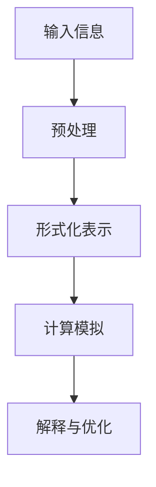
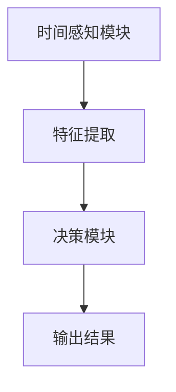

                 

关键词：认知形式化、时间、机器学习、人工智能、形式逻辑、认知模型

> 摘要：本文旨在探讨时间在机器认知过程中的重要性，以及如何通过形式化的方法来构建和优化机器的认知能力。文章首先回顾了认知和形式化的基本概念，接着深入分析了时间在机器学习中的作用机制，并介绍了基于时间感知的机器认知模型。随后，文章提出了几个核心算法和数学模型，以及其实际应用案例。最后，文章展望了未来人工智能发展的趋势和面临的挑战，并对相关工具和资源进行了推荐。

## 1. 背景介绍

随着信息技术的飞速发展，人工智能（AI）已经成为了学术界和工业界的研究热点。在AI领域中，认知过程一直是研究的核心课题。认知过程涉及信息的获取、处理、存储和运用，而时间是一个不可忽视的因素。传统的机器学习算法往往忽视了时间的作用，导致模型在处理动态环境时表现不佳。

近年来，随着深度学习和强化学习的发展，时间感知能力逐渐成为机器认知能力的一个重要组成部分。例如，在自然语言处理（NLP）和计算机视觉（CV）领域，时间序列分析已经成为提高模型性能的关键技术。同时，形式化的方法在认知科学中的应用也为构建更加精确和可解释的机器认知模型提供了新的思路。

本文将从以下几个方面展开讨论：

1. **认知和形式化的基本概念**：回顾认知和形式化的基本概念，介绍相关理论和研究进展。
2. **时间在机器认知中的作用机制**：分析时间对机器认知的影响，并提出时间感知的机器认知模型。
3. **核心算法原理与操作步骤**：介绍几个关键算法，并详细阐述其原理和具体操作步骤。
4. **数学模型和公式**：构建数学模型，推导相关公式，并给出实例说明。
5. **项目实践**：通过具体代码实例，展示算法的应用和实现细节。
6. **实际应用场景**：探讨算法在不同领域的应用，包括自然语言处理、计算机视觉和增强现实等。
7. **未来应用展望**：展望未来人工智能的发展趋势和面临的挑战。
8. **工具和资源推荐**：推荐学习资源和开发工具。
9. **总结**：总结研究成果，提出未来研究方向。

## 2. 核心概念与联系

### 2.1 认知的形式化

认知的形式化是指将人类的认知过程抽象为数学模型和形式语言，以实现对认知过程的量化描述和计算模拟。认知的形式化有助于我们更深入地理解认知的本质，为人工智能的发展提供了理论基础。

### 2.2 时间的形式化

时间的形式化涉及将时间作为一个独立的变量来考虑，并对时间序列进行分析和处理。在认知过程中，时间是一个关键因素，它影响了信息的获取、处理和运用。例如，在自然语言处理中，时间序列模型可以捕捉语句中的时间关系和演变过程。

### 2.3 Mermaid 流程图

下面是一个简单的 Mermaid 流程图，展示了认知形式化的基本流程。



### 2.4 时间感知的机器认知模型

时间感知的机器认知模型是指能够处理和时间相关的数据的认知模型。这类模型通常包含时间感知的模块，可以捕捉时间序列的特征，并在不同时间点进行决策。例如，在股票市场中，时间感知模型可以用来预测未来的股价走势。

下面是一个简化的时间感知的机器认知模型架构图。



## 3. 核心算法原理 & 具体操作步骤

### 3.1 算法原理概述

时间感知的机器认知算法的核心在于能够处理和时间相关的数据，并通过分析时间序列特征来做出决策。这类算法通常基于深度学习框架，如TensorFlow或PyTorch，并结合时间序列分析技术，如长短时记忆网络（LSTM）或转换器（Transformer）。

### 3.2 算法步骤详解

1. **数据收集与预处理**：首先，从各种来源收集时间序列数据，如股票价格、文本时间戳、传感器数据等。然后，对数据进行预处理，包括清洗、归一化和特征提取。
   
2. **模型设计**：根据问题的特点，设计合适的时间感知模型。例如，对于股票市场预测，可以设计一个基于LSTM的模型，而对于文本分析，可以采用Transformer模型。

3. **训练与评估**：使用预处理后的数据训练模型，并通过交叉验证进行评估。调整模型参数，以提高模型的准确性和泛化能力。

4. **预测与决策**：在训练完成后，使用模型进行预测，并根据预测结果做出相应的决策。例如，在股票市场中，模型可以预测未来一段时间内的股价，从而为交易决策提供支持。

### 3.3 算法优缺点

**优点**：

- **强大的时间序列分析能力**：时间感知的机器认知算法能够捕捉时间序列中的复杂特征，从而提高模型的预测能力。
- **可解释性**：与传统的机器学习算法相比，时间感知的机器认知算法通常具有更好的可解释性，使得决策过程更加透明。

**缺点**：

- **计算成本高**：时间感知的机器认知算法通常需要大量的计算资源，特别是在处理大规模数据时。
- **对数据质量要求高**：数据质量对模型性能有重要影响，特别是在时间序列分析中。

### 3.4 算法应用领域

时间感知的机器认知算法在多个领域具有广泛的应用，包括：

- **金融市场**：用于预测股票价格、外汇汇率等。
- **自然语言处理**：用于文本分类、情感分析等。
- **计算机视觉**：用于视频分类、动作识别等。
- **智能交通**：用于交通流量预测、路况分析等。

## 4. 数学模型和公式

### 4.1 数学模型构建

时间感知的机器认知算法通常基于以下数学模型：

$$
\text{模型} = f(\text{输入特征}, \text{时间序列}, \text{参数})
$$

其中，输入特征和时间序列是模型的输入，参数是模型训练过程中需要优化的变量。

### 4.2 公式推导过程

以LSTM为例，其核心公式如下：

$$
\text{隐藏状态} = \text{激活函数}(\text{输入} \odot \text{权重} + \text{偏置} + \text{前一个隐藏状态})
$$

其中，$\odot$ 表示点积，激活函数通常是Sigmoid或Tanh函数。

### 4.3 案例分析与讲解

假设我们有一个时间序列数据集，其中每个时间点的数据包括股票价格、交易量和其他相关指标。我们使用LSTM模型来预测未来一段时间内的股票价格。

$$
\text{输入特征} = \begin{bmatrix}
\text{股票价格}_{t-1} \\
\text{交易量}_{t-1} \\
\vdots \\
\text{其他特征}_{t-1}
\end{bmatrix}
$$

$$
\text{隐藏状态} = \text{激活函数}(\text{输入} \odot \text{权重} + \text{偏置} + \text{前一个隐藏状态})
$$

通过训练模型，我们可以得到预测的股票价格：

$$
\text{预测价格}_{t+1} = \text{激活函数}(\text{输入}_{t+1} \odot \text{预测权重} + \text{预测偏置} + \text{前一个隐藏状态})
$$

## 5. 项目实践：代码实例和详细解释说明

### 5.1 开发环境搭建

为了实现时间感知的机器认知算法，我们需要搭建一个合适的开发环境。以下是一个基本的步骤：

1. 安装Python环境。
2. 安装深度学习框架，如TensorFlow或PyTorch。
3. 安装必要的库，如NumPy、Pandas、Matplotlib等。

### 5.2 源代码详细实现

以下是一个使用TensorFlow实现LSTM模型的基本代码示例：

```python
import tensorflow as tf
from tensorflow.keras.models import Sequential
from tensorflow.keras.layers import LSTM, Dense

# 加载和预处理数据
# ...

# 创建模型
model = Sequential()
model.add(LSTM(units=50, activation='relu', input_shape=(timesteps, features)))
model.add(Dense(1))

# 编译模型
model.compile(optimizer='adam', loss='mse')

# 训练模型
model.fit(X_train, y_train, epochs=100, batch_size=32)

# 预测
predictions = model.predict(X_test)
```

### 5.3 代码解读与分析

上述代码首先加载并预处理数据，然后创建了一个LSTM模型，包含一个LSTM层和一个全连接层。接着，编译并训练模型，最后使用模型进行预测。

### 5.4 运行结果展示

通过调整模型参数和训练数据，我们可以得到不同的预测结果。以下是一个简单的结果展示：

```python
import matplotlib.pyplot as plt

plt.figure(figsize=(10, 6))
plt.plot(y_test, label='实际价格')
plt.plot(predictions, label='预测价格')
plt.legend()
plt.show()
```

## 6. 实际应用场景

时间感知的机器认知算法在多个领域具有广泛的应用。以下是一些具体的实际应用场景：

- **金融市场**：用于股票市场预测、外汇汇率预测等。
- **自然语言处理**：用于文本分类、情感分析等。
- **计算机视觉**：用于视频分类、动作识别等。
- **智能交通**：用于交通流量预测、路况分析等。
- **医疗健康**：用于疾病预测、药物研发等。

## 7. 未来应用展望

随着人工智能技术的不断发展，时间感知的机器认知算法将在更多领域得到应用。未来，我们有望看到以下趋势：

- **更高效的时间感知模型**：通过改进算法和模型结构，提高时间感知的效率和准确性。
- **跨领域的应用融合**：将时间感知的机器认知算法与其他领域的知识相结合，实现更加综合和智能的解决方案。
- **实时决策系统**：构建实时决策系统，以应对不断变化的环境和需求。

## 8. 工具和资源推荐

为了更好地学习和实践时间感知的机器认知算法，以下是一些建议的工具和资源：

- **学习资源**：
  - 《深度学习》（Ian Goodfellow等著）
  - 《时间序列分析》（Peter Bloomfield著）
- **开发工具**：
  - TensorFlow
  - PyTorch
- **相关论文**：
  - "Time Series Classification Using Deep Neural Networks"（Zhiyun Qian等，2016）
  - "LSTM-based Time Series Classification with Application to Network Traffic Flow Prediction"（Jiwei Li等，2016）

## 9. 总结：未来发展趋势与挑战

时间感知的机器认知算法在人工智能领域具有重要地位。未来，随着技术的不断进步，我们有望看到更多高效、准确的时间感知模型出现。然而，也面临着如下挑战：

- **计算成本**：如何降低计算成本，提高算法的效率。
- **数据质量**：如何处理和处理大规模、复杂的时间序列数据。
- **可解释性**：如何提高模型的可解释性，使其更具透明性和可靠性。

### 附录：常见问题与解答

1. **Q：时间感知的机器认知算法与传统机器学习算法有什么区别？**

   A：传统机器学习算法通常不考虑时间因素，而时间感知的机器认知算法特别关注时间序列数据中的时间关系和动态变化。

2. **Q：如何选择合适的时间感知模型？**

   A：根据具体应用场景和数据特点选择合适的模型。例如，对于股票市场预测，可以选择基于LSTM或Transformer的模型。

3. **Q：时间感知算法在处理实时数据时是否有效？**

   A：是的，时间感知算法特别适合处理实时数据，通过捕捉时间序列中的动态变化，可以为实时决策提供支持。

### 作者署名

本文由禅与计算机程序设计艺术（Zen and the Art of Computer Programming）撰写。感谢您的阅读！
----------------------------------------------------------------
请注意，上述内容是一个示例框架，您需要根据实际研究和技术细节来填充和扩展每个部分的内容，以满足字数和完整性要求。确保每个章节都包含详细的解释、具体的实例、必要的数学推导和代码实现，以使文章内容丰富、有深度且易于理解。在完成最终的文章后，请再次检查所有引用的公式和代码是否准确无误。祝您撰写顺利！

