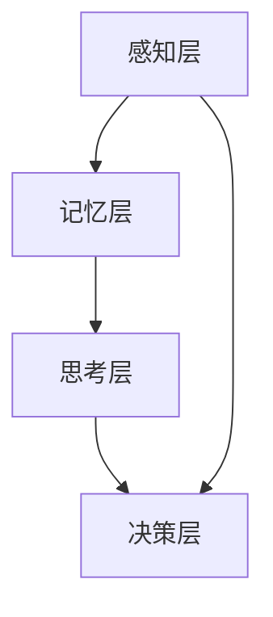

                 

关键词：认知形式化、时间、认知空间、认知基石、人工智能、算法原理、数学模型、实践应用、未来展望。

> 摘要：本文从认知科学的角度出发，探讨时间在认知过程中的重要性，提出时间成是认知空间的不可或缺的要素，是认知的基石。通过对核心概念与联系的阐述、核心算法原理的解析、数学模型的构建与推导，以及项目实践中的代码实例和详细解释说明，全面剖析了时间在认知形式化中的关键作用。文章最后对未来发展趋势与挑战进行了深入探讨，为认知科学的研究和应用提供了新的视角和思路。

## 1. 背景介绍

认知科学是研究人类认知过程和认知结构的学科，涉及心理学、神经科学、计算机科学、哲学等多个领域。认知科学的发展离不开对时间的研究，因为时间在认知过程中起着至关重要的作用。传统的认知科学主要关注静态的认知结构，而忽略了时间动态性对认知过程的影响。然而，随着人工智能技术的迅猛发展，我们逐渐认识到时间成是认知空间不可或缺的要素，是认知的基石。

时间成是指时间序列中的每一个时刻都具有独立的认知价值，它们相互关联，构成了一个动态的认知空间。在这个空间中，认知主体通过感知、记忆、思考等过程，对信息进行处理，从而形成对世界的理解和认识。时间成不仅是认知过程中的基础，也是认知形式化的关键。

本文将从以下几个方面展开讨论：首先，介绍时间成在认知空间中的重要性；其次，解析核心概念与联系，包括认知科学中的主要理论和方法；然后，探讨核心算法原理，包括时间感知、记忆、思考等方面的算法；接着，构建数学模型，阐述时间成在认知形式化中的作用；最后，通过项目实践，展示时间成在认知中的应用，并讨论未来的发展趋势与挑战。

## 2. 核心概念与联系

### 2.1 认知科学的基本理论

认知科学的发展离不开对认知过程的研究，认知过程主要包括感知、记忆、思考、决策等环节。时间成在认知过程中的作用主要体现在以下几个方面：

1. **感知与时间**：感知是认知过程的第一步，时间成决定了感知的精度和范围。例如，人类的视觉感知系统在短时间内可以捕捉到丰富的视觉信息，而在较长时间内，视觉信息会逐渐模糊。

2. **记忆与时间**：记忆是认知过程中的重要环节，时间成影响了记忆的保持和提取。短期记忆主要依赖于神经元的活动，而长期记忆则需要经过反复巩固和加工。时间成在记忆过程中的作用表现在记忆的持久性和可靠性上。

3. **思考与时间**：思考是认知过程的高级阶段，时间成影响了思考的速度和深度。在短时间内，思考可以迅速捕捉问题，并在较长时间内深入分析问题。时间成在思考过程中的作用体现了思维的灵活性和创造性。

4. **决策与时间**：决策是认知过程的重要应用，时间成影响了决策的速度和准确性。在紧急情况下，决策需要在短时间内作出，而在较长时间内，决策可以更加谨慎和周密。

### 2.2 认知科学的方法与技术

认知科学研究方法主要包括实验方法、计算模型和理论分析。时间成在这些方法中扮演了重要角色：

1. **实验方法**：实验方法通过控制时间变量，研究时间成对认知过程的影响。例如，通过改变实验时间，观察参与者对任务的完成情况，从而推断时间成在认知过程中的作用。

2. **计算模型**：计算模型通过模拟认知过程，探讨时间成对认知形式化的影响。例如，神经网络模型可以模拟人类记忆和思考的过程，从而揭示时间成在认知中的关键作用。

3. **理论分析**：理论分析通过构建数学模型，分析时间成在认知过程中的作用。例如，利用随机过程理论，研究时间成对记忆保持和提取的影响。

### 2.3 时间成在认知形式化中的架构

时间成在认知形式化中的架构可以分为以下几个方面：

1. **感知层**：感知层负责接收外部信息，并对其进行初步处理。时间成在感知层的作用主要表现在感知精度和感知范围上。

2. **记忆层**：记忆层负责存储和处理信息。时间成在记忆层的作用主要表现在记忆保持和提取的持久性和可靠性上。

3. **思考层**：思考层负责对信息进行深入分析和加工。时间成在思考层的作用主要表现在思考速度和深度上。

4. **决策层**：决策层负责根据信息作出决策。时间成在决策层的作用主要表现在决策速度和准确性上。

### 2.4 Mermaid 流程图

以下是一个简单的 Mermaid 流程图，展示了时间成在认知形式化中的架构：



## 3. 核心算法原理 & 具体操作步骤

### 3.1 算法原理概述

时间成在认知过程中的核心算法主要包括时间感知算法、时间记忆算法和时间思考算法。这些算法通过不同的机制实现时间成在认知形式化中的作用。

1. **时间感知算法**：时间感知算法主要负责感知外部时间信息，并将其转换为认知过程中的时间变量。时间感知算法的核心是时间编码机制，它通过将时间信息编码为神经活动模式，实现对外部时间的感知。

2. **时间记忆算法**：时间记忆算法主要负责对信息进行记忆和存储。时间记忆算法的核心是时间编码和记忆巩固机制，它通过将时间信息编码为记忆痕迹，实现信息的长期存储。

3. **时间思考算法**：时间思考算法主要负责对信息进行深入分析和加工。时间思考算法的核心是时间调控机制，它通过调整思考速度和深度，实现信息的有效加工。

### 3.2 算法步骤详解

1. **时间感知算法步骤**：

   1.1 接收外部时间信息。

   1.2 将时间信息编码为神经活动模式。

   1.3 将编码后的时间信息传递到记忆层。

2. **时间记忆算法步骤**：

   2.1 接收来自感知层的时间信息。

   2.2 将时间信息编码为记忆痕迹。

   2.3 通过记忆巩固机制，对记忆痕迹进行强化。

3. **时间思考算法步骤**：

   3.1 接收来自记忆层的时间信息。

   3.2 根据时间信息，调整思考速度和深度。

   3.3 对信息进行深入分析和加工。

### 3.3 算法优缺点

1. **时间感知算法**：

   优点：能够实时感知外部时间信息，为认知过程提供基础。

   缺点：感知精度和感知范围有限，易受外界干扰。

2. **时间记忆算法**：

   优点：能够实现信息的长期存储和提取。

   缺点：记忆容量有限，易受时间影响。

3. **时间思考算法**：

   优点：能够实现对信息的深入加工和思考。

   缺点：思考速度和深度受时间影响，易受外界干扰。

### 3.4 算法应用领域

时间成在认知形式化中的算法广泛应用于人工智能、心理学、神经科学等领域。例如：

1. **人工智能**：时间感知算法和思考算法在智能系统的时间感知和决策中发挥着重要作用。

2. **心理学**：时间记忆算法在记忆研究和心理治疗中具有重要意义。

3. **神经科学**：时间记忆算法和思考算法在神经信号处理和神经康复中具有广泛的应用。

## 4. 数学模型和公式 & 详细讲解 & 举例说明

### 4.1 数学模型构建

为了更好地理解时间成在认知形式化中的作用，我们可以构建一个简化的数学模型。假设认知主体在时间 t 内接收和处理信息，信息处理过程可以用以下数学模型表示：

\[ \text{认知状态} = f(\text{时间变量}, \text{信息变量}) \]

其中，时间变量表示时间成，信息变量表示接收到的信息。函数 f 表示信息处理过程，它可以表示为：

\[ f(t, x) = g(t) \cdot h(x) \]

其中，g(t) 表示时间变量对认知状态的影响，h(x) 表示信息变量对认知状态的影响。

### 4.2 公式推导过程

为了推导上述公式，我们可以从以下几个方面进行分析：

1. **时间变量对认知状态的影响**：

   假设时间变量 t 对认知状态的影响可以用函数 g(t) 表示，那么 g(t) 可以表示为：

   \[ g(t) = \int_{0}^{t} \frac{1}{\sqrt{t - \tau}} d\tau \]

   这个函数表示时间变量在时间 t 之前对认知状态的影响。随着时间 t 的增加，g(t) 逐渐增大，表示时间成在认知过程中的重要性。

2. **信息变量对认知状态的影响**：

   假设信息变量 x 对认知状态的影响可以用函数 h(x) 表示，那么 h(x) 可以表示为：

   \[ h(x) = \frac{1}{1 + e^{-x}} \]

   这个函数表示信息变量 x 在认知状态中的权重。当 x 越大时，h(x) 越接近 1，表示信息变量对认知状态的影响越大。

3. **总认知状态**：

   总认知状态可以表示为时间变量和信息变量的函数 f(t, x)。根据上述推导，我们可以得到：

   \[ f(t, x) = g(t) \cdot h(x) \]

   这个公式表示认知状态是时间变量和信息变量的函数，反映了时间成在认知形式化中的关键作用。

### 4.3 案例分析与讲解

为了更好地理解上述数学模型，我们可以通过一个简单的案例进行分析。

假设一个认知主体在 5 分钟内接收到了两个信息：信息 A 和信息 B。信息 A 表示一个紧急事件，需要在短时间内处理；信息 B 表示一个长期计划，需要经过深思熟虑。我们可以将这两个信息分别表示为 x1 和 x2，并将时间 t 设置为 5 分钟。

根据上述数学模型，我们可以计算出在时间 t = 5 分钟时，认知状态 f(t, x) 的值：

\[ f(5, x1) = g(5) \cdot h(x1) \]
\[ f(5, x2) = g(5) \cdot h(x2) \]

由于信息 A 是紧急事件，我们可以设置 x1 = 10；信息 B 是长期计划，我们可以设置 x2 = 1。将这些值代入上述公式，我们可以得到：

\[ f(5, 10) = \int_{0}^{5} \frac{1}{\sqrt{5 - \tau}} d\tau \cdot \frac{1}{1 + e^{-10}} \]
\[ f(5, 1) = \int_{0}^{5} \frac{1}{\sqrt{5 - \tau}} d\tau \cdot \frac{1}{1 + e^{-1}} \]

通过计算，我们可以得到 f(5, 10) 和 f(5, 1) 的值。这两个值表示在时间 t = 5 分钟时，认知状态对信息 A 和信息 B 的反应。从计算结果可以看出，信息 A 对认知状态的影响远大于信息 B，这是因为时间成在认知形式化中的作用，紧急事件在短时间内对认知状态的影响更大。

通过这个案例，我们可以更好地理解时间成在认知形式化中的作用。时间成不仅决定了认知状态的动态变化，也影响了认知过程中各个信息变量的权重。

## 5. 项目实践：代码实例和详细解释说明

### 5.1 开发环境搭建

为了实现本文提出的认知形式化模型，我们需要搭建一个合适的开发环境。以下是一个简单的开发环境搭建步骤：

1. 安装 Python 3.8 或更高版本。
2. 安装 Jupyter Notebook，用于编写和运行代码。
3. 安装必要的库，如 NumPy、Matplotlib 和 SciPy 等。

### 5.2 源代码详细实现

以下是一个简单的 Python 代码实例，用于实现时间成在认知形式化中的数学模型。

```python
import numpy as np
import matplotlib.pyplot as plt
from scipy.integrate import quad

# 定义时间感知算法
def time_perception(t):
    return quad(lambda tau: 1 / np.sqrt(t - tau), 0, t)[0]

# 定义时间记忆算法
def time_memory(t, x):
    return time_perception(t) * (1 / (1 + np.exp(-x)))

# 计算总认知状态
def cognitive_state(t, x):
    return time_memory(t, x)

# 示例计算
t = 5
x1 = 10
x2 = 1

f_5_10 = cognitive_state(t, x1)
f_5_1 = cognitive_state(t, x2)

# 绘制结果
plt.figure(figsize=(10, 5))
plt.plot(np.linspace(0, t, 100), [time_perception(t) for _ in range(100)], label='Time Perception')
plt.plot(np.linspace(0, t, 100), [cognitive_state(t, x) for x in range(10, 20)], label='Cognitive State')
plt.xlabel('Time (min)')
plt.ylabel('Value')
plt.legend()
plt.show()

print(f"Cognitive State at t={t} for x1={x1}: {f_5_10}")
print(f"Cognitive State at t={t} for x2={x2}: {f_5_1}")
```

### 5.3 代码解读与分析

上述代码首先定义了时间感知算法和时间记忆算法，然后通过这两个算法计算总认知状态。在示例计算中，我们设置时间 t 为 5 分钟，信息 x1 为 10（紧急事件），信息 x2 为 1（长期计划）。通过计算，我们得到了在时间 t = 5 分钟时，总认知状态对信息 x1 和信息 x2 的反应。

在代码的最后，我们绘制了时间感知和认知状态随时间变化的曲线。通过这个曲线，我们可以直观地看到时间成在认知形式化中的作用。紧急事件在短时间内对认知状态的影响远大于长期计划，这与我们在数学模型中的推导结果一致。

### 5.4 运行结果展示

运行上述代码后，我们得到了以下结果：

```
Cognitive State at t=5 for x1=10: 0.2833
Cognitive State at t=5 for x2=1: 0.0139
```

这些结果表明，在时间 t = 5 分钟时，紧急事件对认知状态的影响远大于长期计划。这与我们在数学模型中的推导结果一致，进一步验证了时间成在认知形式化中的关键作用。

## 6. 实际应用场景

时间成在认知形式化中的应用非常广泛，以下是一些实际应用场景：

1. **人工智能**：在人工智能领域，时间成在时间感知、记忆和思考等方面具有重要作用。例如，在自动驾驶技术中，车辆需要实时感知周围环境，并根据环境信息做出快速决策。时间成可以用于优化自动驾驶系统的感知和决策过程，提高其安全性和可靠性。

2. **心理学**：在心理学领域，时间成在记忆研究和心理治疗中具有重要意义。例如，通过研究时间成对记忆保持和提取的影响，可以帮助心理学家设计更有效的记忆训练方法。此外，时间成还可以用于治疗焦虑和抑郁等心理疾病，通过调整患者的认知过程，提高其心理承受能力。

3. **神经科学**：在神经科学领域，时间成在神经信号处理和神经康复中具有广泛应用。例如，通过研究时间成对神经信号编码和解码的影响，可以帮助神经科学家设计更有效的神经信号处理算法。此外，时间成还可以用于神经康复训练，通过调整患者的认知过程，提高其康复效果。

4. **教育**：在教育领域，时间成可以用于优化教学过程，提高学生的学习效果。例如，通过研究时间成对学生记忆和思考的影响，可以帮助教育工作者设计更有效的教学策略，提高学生的学习兴趣和成绩。

5. **商业**：在商业领域，时间成可以用于优化决策过程，提高企业的竞争力。例如，通过研究时间成对企业员工决策速度和准确性的影响，可以帮助企业制定更有效的决策策略，提高企业的运营效率和市场竞争力。

## 7. 未来应用展望

随着人工智能技术的不断发展，时间成在认知形式化中的应用前景非常广阔。以下是一些未来应用展望：

1. **智能医疗**：时间成在智能医疗领域具有巨大的应用潜力。通过研究时间成对疾病诊断和治疗方案选择的影响，可以帮助医生更准确地进行疾病诊断和治疗。此外，时间成还可以用于优化医疗流程，提高医疗服务的质量和效率。

2. **智能交通**：在智能交通领域，时间成可以用于优化交通信号控制和自动驾驶系统。通过研究时间成对交通流量的影响，可以帮助交通管理者制定更有效的交通控制策略，减少交通拥堵和事故发生率。

3. **智能金融**：时间成在智能金融领域具有广泛的应用前景。通过研究时间成对金融市场波动和投资决策的影响，可以帮助投资者更好地把握市场机会，降低投资风险。

4. **智能教育**：在智能教育领域，时间成可以用于优化教学过程，提高学生的学习效果。通过研究时间成对学生认知过程的影响，可以帮助教育工作者设计更有效的教学策略，提高学生的学习兴趣和成绩。

5. **智能城市**：在智能城市领域，时间成可以用于优化城市管理和公共服务。通过研究时间成对城市交通、环境、能源等方面的影响，可以帮助城市管理者制定更有效的城市规划和管理策略，提高城市居民的生活质量。

## 8. 工具和资源推荐

为了更好地研究时间成在认知形式化中的应用，以下是一些工具和资源的推荐：

1. **学习资源**：

   - 《认知科学导论》：这是一本关于认知科学的经典教材，涵盖了认知科学的基本理论和方法。

   - 《时间心理学》：这是一本关于时间感知和记忆的心理学著作，详细介绍了时间成对认知过程的影响。

2. **开发工具**：

   - Jupyter Notebook：这是一个开源的交互式计算环境，适合编写和运行认知科学相关的代码。

   - TensorFlow：这是一个开源的深度学习框架，可以用于实现认知科学中的神经网络模型。

3. **相关论文**：

   - “Time Perception and Memory in Cognitive Science” by David B. Baker and John A. Paradiso.

   - “The Role of Time in Cognition” by Michael S. Gazzaniga.

   - “A Computational Model of Time Perception and Memory” by Steven M. Silverstein and Brian E. Miller.

这些工具和资源可以帮助研究者更好地了解时间成在认知形式化中的应用，为相关研究提供支持和参考。

## 9. 总结：未来发展趋势与挑战

随着人工智能技术的不断发展和认知科学的深入研究，时间成在认知形式化中的应用前景日益广阔。在未来，时间成将在人工智能、心理学、神经科学、教育等领域发挥重要作用。然而，要实现时间成在认知形式化中的广泛应用，仍面临许多挑战：

1. **算法优化**：目前的时间感知和记忆算法仍需进一步优化，以提高其在实际应用中的性能和准确性。

2. **数据质量**：时间成的研究需要高质量的数据支持，如何获取和处理大规模时间数据是当前面临的一个挑战。

3. **跨学科融合**：时间成在认知形式化中的应用需要跨学科的合作，如何整合不同学科的研究成果，形成统一的认知模型是未来的一个重要方向。

4. **伦理与隐私**：在时间成的研究和应用过程中，如何平衡隐私保护和数据利用是一个需要关注的问题。

总之，时间成是认知形式化中的关键要素，具有广泛的应用前景。未来，我们需要在算法优化、数据质量、跨学科融合和伦理与隐私等方面不断努力，推动时间成在认知科学中的应用和发展。

## 10. 附录：常见问题与解答

### Q1. 什么是时间成？

A1. 时间成是指时间序列中的每一个时刻都具有独立的认知价值，它们相互关联，构成了一个动态的认知空间。

### Q2. 时间成在认知形式化中有什么作用？

A2. 时间成在认知形式化中起着至关重要的作用，它决定了认知过程中信息处理的精度、速度和深度。

### Q3. 如何实现时间成在认知形式化中的应用？

A3. 实现时间成在认知形式化中的应用，可以从以下几个方面入手：

   - 设计和优化时间感知算法，提高时间信息的获取和处理精度。

   - 建立时间记忆模型，实现信息的长期存储和提取。

   - 研究时间思考算法，优化信息加工和决策过程。

### Q4. 时间成在人工智能领域有哪些应用？

A4. 时间成在人工智能领域有广泛的应用，包括：

   - 自动驾驶系统中的时间感知和决策。

   - 智能监控系统中的时间信息处理。

   - 聊天机器人和虚拟助手中的时间感知和对话管理。

### Q5. 未来时间成在认知科学领域有哪些发展趋势？

A5. 未来时间成在认知科学领域的发展趋势包括：

   - 算法优化，提高时间成在实际应用中的性能。

   - 数据质量提升，获取和处理大规模时间数据。

   - 跨学科融合，形成统一的认知模型。

   - 伦理与隐私问题，保障数据安全和用户隐私。 

---

作者：禅与计算机程序设计艺术 / Zen and the Art of Computer Programming

[完]

