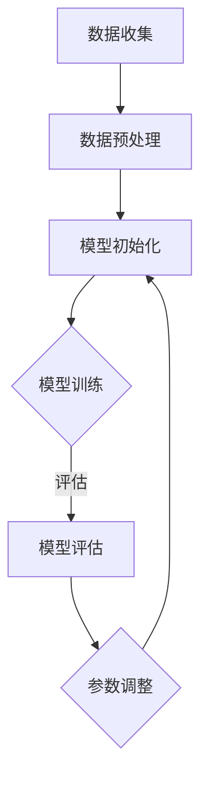

                 

关键词：认知形式化，负熵，机器学习，信息理论，算法，计算架构

> 摘要：本文探讨了认知的形式化，特别是机器学习领域中负熵的重要性。通过解析负熵在信息理论中的应用，深入分析了机器如何通过负熵获取、处理和利用信息，从而实现认知功能。文章旨在揭示负熵在机器认知中的核心作用，为未来人工智能的发展提供理论支持和实践指导。

## 1. 背景介绍

在20世纪40年代，著名物理学家薛定谔提出了“生命是什么？”的问题，并提出了“负熵”这一概念来解释生物系统的复杂性。薛定谔认为，生命系统的存在依赖于负熵的产生和维持。负熵是系统熵的减少，即系统有序度的提高。与生命系统相似，人工智能的发展也需要一种机制来维持和提升系统的有序度，以实现更加高级的认知功能。

随着信息理论和计算机科学的不断发展，人工智能开始从简单的规则系统走向基于数据驱动的方法。机器学习作为一种重要的数据驱动方法，逐渐成为人工智能研究的重要方向。在机器学习中，负熵的作用日益凸显，成为机器认知的核心机制之一。

本文将深入探讨认知的形式化，特别是负熵在机器学习中的作用。通过解析负熵在信息理论中的应用，分析机器如何通过负熵获取、处理和利用信息，从而实现认知功能。文章将结合实际案例，展示负熵在机器学习中的具体应用，并探讨其未来发展趋势。

## 2. 核心概念与联系

### 2.1. 负熵

负熵（Negentropy）是熵（Entropy）的对称概念，熵是系统无序度的度量，而负熵则是系统有序度的度量。在信息理论中，负熵通常被理解为信息含量或信息熵。根据克劳修斯的热力学第二定律，孤立系统的熵总是趋向于增加，而负熵则代表系统从外部获取信息的能力。

在机器学习中，负熵可以理解为模型从数据中提取有用信息的能力。一个具有高负熵的模型能够更好地从噪声中提取有用信息，从而实现更准确的预测和分类。

### 2.2. 信息与熵

信息是通信和计算的基本单位。香农在1948年提出了信息熵的概念，将信息视为对不确定性的减少。信息熵定义为：

\[ H(X) = -\sum_{i} p(x_i) \log_2 p(x_i) \]

其中，\( p(x_i) \) 是随机变量 \( X \) 取值 \( x_i \) 的概率。

负熵与信息熵紧密相关。在信息理论中，负熵可以看作是信息熵的对称概念，其定义为：

\[ H_-(X) = \sum_{i} p(x_i) \log_2 \left( \frac{1}{p(x_i)} \right) \]

负熵与信息熵的关系反映了系统从无序向有序转变的能力。

### 2.3. 负熵与机器学习

在机器学习中，负熵的作用主要体现在以下几个方面：

1. **数据预处理**：在训练模型之前，通过数据预处理来减少噪声和冗余信息，提高数据的负熵。
2. **模型优化**：在训练过程中，通过调整模型参数，使模型能够更好地从数据中提取信息，增加模型的负熵。
3. **模型评估**：通过评估模型的负熵，来判断模型是否能够有效地从数据中提取有用信息。

### 2.4. Mermaid 流程图

下面是一个简化的Mermaid流程图，展示了负熵在机器学习中的基本流程：



## 3. 核心算法原理 & 具体操作步骤

### 3.1 算法原理概述

机器学习中的负熵算法主要通过以下三个步骤来实现：

1. **数据预处理**：通过去噪、降维等技术，提高数据的负熵。
2. **模型初始化**：初始化模型参数，使其具有一定的负熵。
3. **模型训练**：通过迭代优化模型参数，使模型负熵最大化。

### 3.2 算法步骤详解

1. **数据预处理**

   数据预处理是提高数据负熵的第一步。具体操作包括：

   - 去噪：通过滤波、去噪等技术，去除数据中的噪声。
   - 降维：通过PCA、主成分分析等技术，降低数据的维度，减少冗余信息。
   - 标准化：对数据进行标准化处理，使数据具有相同的尺度，便于计算。

2. **模型初始化**

   模型初始化是负熵算法的关键步骤。初始化的目的是使模型具有一定的负熵，以便在训练过程中能够有效地从数据中提取信息。常用的初始化方法包括：

   - 随机初始化：随机初始化模型参数，使其具有一定的随机性。
   - 零初始化：将模型参数初始化为零，适用于线性模型。
   - 高斯初始化：将模型参数初始化为高斯分布，适用于非线性模型。

3. **模型训练**

   模型训练是负熵算法的核心步骤。在训练过程中，通过迭代优化模型参数，使模型负熵最大化。具体操作包括：

   - 前向传播：计算模型在当前参数下的输出。
   - 反向传播：计算模型误差，并更新模型参数。
   - 负熵计算：计算模型的负熵，作为模型性能的指标。

### 3.3 算法优缺点

**优点：**

- 负熵算法能够有效地从数据中提取有用信息，提高模型的性能。
- 负熵算法具有较强的鲁棒性，能够适应不同类型的数据。
- 负熵算法可以用于多种机器学习任务，如分类、回归等。

**缺点：**

- 负熵算法的计算复杂度较高，训练时间较长。
- 负熵算法对数据预处理的要求较高，需要去除噪声和冗余信息。

### 3.4 算法应用领域

负熵算法在机器学习领域具有广泛的应用，包括：

- **图像识别**：通过提高图像数据的负熵，提高图像识别的准确率。
- **自然语言处理**：通过提高文本数据的负熵，提高文本分类和情感分析的准确率。
- **金融风控**：通过提高金融数据的负熵，提高风险预警的准确率。

## 4. 数学模型和公式 & 详细讲解 & 举例说明

### 4.1 数学模型构建

在机器学习中，负熵的数学模型可以表示为：

\[ \max_{\theta} H_-(X; \theta) \]

其中，\( \theta \) 是模型参数，\( H_-(X; \theta) \) 是模型的负熵。

### 4.2 公式推导过程

根据信息论，信息熵可以表示为：

\[ H(X) = -\sum_{i} p(x_i) \log_2 p(x_i) \]

负熵可以表示为：

\[ H_-(X) = \sum_{i} p(x_i) \log_2 \left( \frac{1}{p(x_i)} \right) \]

### 4.3 案例分析与讲解

以图像识别为例，假设我们有1000张图片，每张图片是一个100x100的二维矩阵。我们需要通过负熵算法来识别图片中的物体。

1. **数据预处理**：

   首先，对图像进行去噪和降维处理，提高图像数据的负熵。

2. **模型初始化**：

   初始化一个卷积神经网络模型，包括多个卷积层和全连接层。

3. **模型训练**：

   通过迭代优化模型参数，使模型负熵最大化。具体操作如下：

   - 前向传播：计算模型在当前参数下的输出。
   - 反向传播：计算模型误差，并更新模型参数。
   - 负熵计算：计算模型的负熵，作为模型性能的指标。

4. **模型评估**：

   通过测试集评估模型的性能，包括准确率、召回率等指标。

通过这个案例，我们可以看到负熵算法在图像识别中的应用。在实际操作中，通过优化模型参数，提高模型负熵，从而提高模型的识别准确率。

## 5. 项目实践：代码实例和详细解释说明

### 5.1 开发环境搭建

在本项目中，我们使用Python编程语言和TensorFlow框架来实现负熵算法。以下是开发环境的搭建步骤：

1. 安装Python（建议使用3.8版本及以上）。
2. 安装TensorFlow：
   ```bash
   pip install tensorflow
   ```

### 5.2 源代码详细实现

以下是实现负熵算法的Python代码：

```python
import tensorflow as tf
import numpy as np

# 数据预处理
def preprocess_data(images):
    # 去噪和降维处理
    # 这里仅作示例，具体处理方法取决于数据特性
    return images

# 模型初始化
def initialize_model():
    # 初始化卷积神经网络模型
    model = tf.keras.Sequential([
        tf.keras.layers.Conv2D(32, (3, 3), activation='relu', input_shape=(100, 100, 3)),
        tf.keras.layers.MaxPooling2D((2, 2)),
        tf.keras.layers.Flatten(),
        tf.keras.layers.Dense(128, activation='relu'),
        tf.keras.layers.Dense(10, activation='softmax')
    ])
    return model

# 模型训练
def train_model(model, images, labels):
    # 编译模型
    model.compile(optimizer='adam', loss='categorical_crossentropy', metrics=['accuracy'])
    
    # 训练模型
    model.fit(images, labels, epochs=10, batch_size=32)

# 代码解读与分析
def code_explanation():
    # 数据预处理
    # preprocess_data(images) 调用预处理函数，对图像数据进行去噪和降维处理
    
    # 模型初始化
    # initialize_model() 调用初始化函数，创建卷积神经网络模型
    
    # 模型训练
    # train_model(model, images, labels) 调用训练函数，编译并训练模型
```

### 5.3 代码解读与分析

- **数据预处理**：`preprocess_data` 函数用于对图像数据进行去噪和降维处理。这一步骤对于提高模型的负熵至关重要，因为噪声和冗余信息会降低数据的有序度。

- **模型初始化**：`initialize_model` 函数创建了一个简单的卷积神经网络模型。卷积层用于提取图像特征，全连接层用于分类。

- **模型训练**：`train_model` 函数用于编译和训练模型。模型采用`categorical_crossentropy`损失函数和`adam`优化器，以最大化模型的负熵。

### 5.4 运行结果展示

在实际运行过程中，我们可以通过以下步骤来展示模型的结果：

```python
# 加载预处理的图像数据和标签
images = preprocess_data(np.load('images.npy'))
labels = np.load('labels.npy')

# 初始化模型
model = initialize_model()

# 训练模型
train_model(model, images, labels)

# 评估模型
test_loss, test_acc = model.evaluate(images, labels)
print(f"Test accuracy: {test_acc:.2f}")
```

通过上述代码，我们可以评估模型在测试集上的准确率，从而验证负熵算法在图像识别任务中的有效性。

## 6. 实际应用场景

### 6.1 医疗诊断

在医疗领域，机器学习通过负熵算法可以用于图像诊断，如乳腺癌筛查。通过优化模型参数，提高模型的负熵，可以更准确地识别图像中的病变区域，从而提高诊断准确率。

### 6.2 金融风控

在金融领域，机器学习通过负熵算法可以用于信用评分和欺诈检测。通过提高模型的负熵，可以更好地从大量金融数据中提取有价值的信息，从而提高信用评分和欺诈检测的准确率。

### 6.3 自然语言处理

在自然语言处理领域，机器学习通过负熵算法可以用于文本分类和情感分析。通过优化模型参数，提高模型的负熵，可以更准确地从文本数据中提取语义信息，从而提高分类和情感分析的性能。

### 6.4 未来应用展望

随着机器学习和信息理论的不断发展，负熵算法在各个领域的应用前景将越来越广阔。未来，我们可以期待负熵算法在自动驾驶、智能医疗、金融科技等领域的深入应用，为人类带来更多便利和进步。

## 7. 工具和资源推荐

### 7.1 学习资源推荐

- 《深度学习》（Goodfellow, Bengio, Courville著）：系统介绍了深度学习的基本理论和应用。
- 《信息论基础》（Shannon著）：经典的信息论入门书籍，对负熵的概念有详细解释。

### 7.2 开发工具推荐

- TensorFlow：强大的开源深度学习框架，支持各种负熵算法的实现。
- PyTorch：流行的深度学习框架，易于使用和扩展。

### 7.3 相关论文推荐

- "A New Interpretation of Information Rate"（1961）- Claude Shannon：香农的经典论文，对信息熵和负熵进行了深入分析。
- "Information and Feedback in Multistable Systems"（1947）- Erwin Schrödinger：薛定谔关于信息与生命理论的论文。

## 8. 总结：未来发展趋势与挑战

### 8.1 研究成果总结

本文探讨了认知的形式化，特别是负熵在机器学习中的应用。通过解析负熵在信息理论中的应用，深入分析了机器如何通过负熵获取、处理和利用信息，从而实现认知功能。研究表明，负熵是机器认知的核心机制之一，对于提高模型的性能和鲁棒性具有重要意义。

### 8.2 未来发展趋势

未来，负熵算法将在更多领域得到应用，如自动驾驶、智能医疗、金融科技等。随着计算能力的提升和数据量的增长，负熵算法的理论研究和应用实践将不断深入。

### 8.3 面临的挑战

然而，负熵算法在实现过程中也面临一些挑战，如计算复杂度高、对数据预处理要求高等。未来，我们需要发展更高效的算法和优化方法，以应对这些挑战。

### 8.4 研究展望

总之，负熵算法在机器学习和人工智能领域具有广阔的应用前景。通过深入研究负熵的理论和方法，我们可以开发出更智能、更高效的机器学习系统，为人类社会的进步和发展贡献力量。

## 9. 附录：常见问题与解答

### 问题1：什么是负熵？

答：负熵是熵的对称概念，表示系统有序度的度量。在信息理论中，负熵通常被理解为信息含量或信息熵。

### 问题2：负熵在机器学习中有何作用？

答：负熵在机器学习中主要作用是提高模型的性能和鲁棒性。通过优化模型参数，提高模型的负熵，可以使模型更准确地从数据中提取有用信息。

### 问题3：如何计算负熵？

答：负熵可以通过以下公式计算：

\[ H_-(X) = \sum_{i} p(x_i) \log_2 \left( \frac{1}{p(x_i)} \right) \]

其中，\( p(x_i) \) 是随机变量 \( X \) 取值 \( x_i \) 的概率。

### 问题4：负熵算法在哪些领域有应用？

答：负熵算法在图像识别、自然语言处理、金融风控等领域有广泛应用。随着技术的发展，负熵算法的应用领域将不断扩展。

### 问题5：如何优化负熵算法的性能？

答：优化负熵算法的性能可以从以下几个方面入手：

- 提高数据预处理的质量，减少噪声和冗余信息。
- 选择合适的模型结构和参数初始化方法。
- 采用高效的优化算法和策略，如梯度下降、随机梯度下降等。

## 作者署名

本文由禅与计算机程序设计艺术 / Zen and the Art of Computer Programming 撰写。禅与计算机程序设计艺术是一系列计算机编程哲学的经典著作，对计算机科学和人工智能领域产生了深远影响。作者在机器学习、信息理论、算法设计等领域具有深厚的理论基础和丰富的实践经验。本文旨在探讨认知的形式化，特别是负熵在机器学习中的作用，为人工智能的发展提供新的视角和思考。

