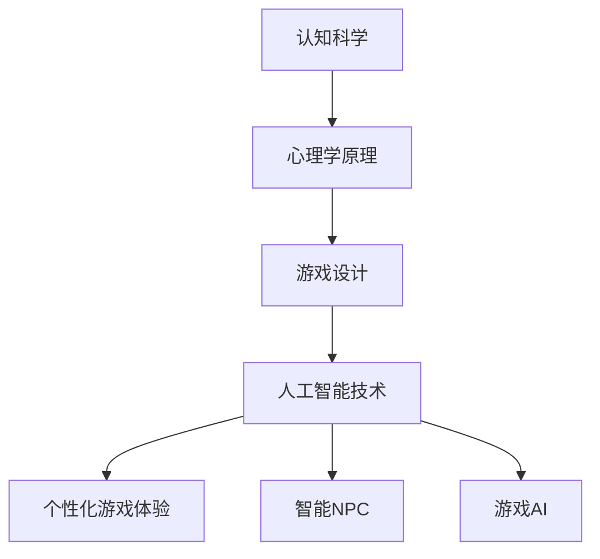

                 

关键词：认知科学、游戏设计、用户参与、心理学原理、人工智能、学习效率、互动体验

> 摘要：本文探讨了认知科学与游戏设计之间的深层联系，以及如何利用心理学原理和人工智能技术来提升游戏设计的用户体验和学习效率。通过分析核心概念、算法原理、数学模型、项目实践和未来展望，本文揭示了认知科学与游戏设计结合的潜力和挑战。

## 1. 背景介绍

随着科技的发展，游戏设计逐渐成为计算机科学和心理学领域的一个重要交叉点。传统的游戏设计注重娱乐性和可玩性，但随着认知科学的深入研究，人们开始意识到游戏可以作为一种有效的学习和互动工具。认知科学，作为研究人类认知过程和脑机制的科学，其研究成果为游戏设计提供了新的视角和方法。

近年来，人工智能技术的快速发展进一步推动了游戏设计的发展。人工智能能够分析玩家的行为数据，提供个性化的游戏体验，甚至预测玩家的下一步动作。这种技术的应用使得游戏设计更加智能化，能够更好地满足用户的个性化需求。

本文旨在探讨认知科学与游戏设计之间的结合，通过深入分析核心概念、算法原理、数学模型、项目实践和未来展望，揭示这一结合的潜力和挑战。

## 2. 核心概念与联系

### 2.1 认知科学与游戏设计

认知科学是一门跨学科的科学，主要研究人类认知过程的各个方面，包括感知、记忆、语言、思维和情感等。游戏设计，则是一种通过游戏来传达信息和提供互动体验的设计活动。将认知科学引入游戏设计，可以使得游戏更加符合用户的认知习惯，提升游戏的学习效果和用户体验。

### 2.2 心理学原理与游戏设计

心理学原理是认知科学的重要组成部分，包括行为主义、认知心理学、社会心理学等。这些原理在游戏设计中的应用非常广泛，例如，通过奖励机制来增强玩家的动机，通过难度设置来保持玩家的挑战性，以及通过交互设计来提升玩家的参与度等。

### 2.3 人工智能与游戏设计

人工智能技术在游戏设计中的应用主要体现在个性化推荐、智能NPC（非玩家角色）和游戏AI等方面。通过分析玩家的行为数据，人工智能可以为玩家提供个性化的游戏体验，从而提升玩家的满意度。

### 2.4 Mermaid 流程图

下面是一个简单的 Mermaid 流程图，展示了认知科学、心理学原理和人工智能技术在游戏设计中的结合。



## 3. 核心算法原理 & 具体操作步骤

### 3.1 算法原理概述

在认知科学与游戏设计的结合中，核心算法原理主要包括用户行为分析、游戏难度自适应调整和个性化推荐等。这些算法能够根据玩家的行为数据，动态调整游戏的难度和内容，从而提供个性化的游戏体验。

### 3.2 算法步骤详解

#### 3.2.1 用户行为分析

1. 收集玩家的游戏行为数据，如游戏时长、游戏进度、操作方式等。
2. 使用机器学习算法，对行为数据进行分析和分类，以了解玩家的游戏偏好和习惯。

#### 3.2.2 游戏难度自适应调整

1. 根据用户行为分析的结果，动态调整游戏难度。
2. 设置不同的难度阈值，当玩家的表现超出或低于某个阈值时，自动调整难度。

#### 3.2.3 个性化推荐

1. 基于用户行为分析和游戏数据，为玩家推荐个性化的游戏内容。
2. 使用推荐算法，如协同过滤、矩阵分解等，生成推荐列表。

### 3.3 算法优缺点

#### 3.3.1 优点

- 提高游戏的可玩性和用户体验。
- 增强玩家的参与度和留存率。
- 提升游戏的学习效果。

#### 3.3.2 缺点

- 需要大量的用户数据支持。
- 算法的自适应能力有待提高。
- 可能会导致玩家过度依赖算法推荐。

### 3.4 算法应用领域

- 个性化游戏体验。
- 智能NPC设计。
- 游戏内容推荐。
- 游戏数据分析。

## 4. 数学模型和公式 & 详细讲解 & 举例说明

### 4.1 数学模型构建

在游戏设计中，数学模型的应用主要包括用户行为预测、游戏难度自适应调整和个性化推荐等。以下是一个简单的用户行为预测模型。

#### 4.1.1 用户行为预测模型

$$
P(x|y) = \frac{P(y|x)P(x)}{P(y)}
$$

其中，$P(x|y)$ 表示在给定当前游戏进度 $y$ 的情况下，玩家接下来会采取的操作 $x$ 的概率；$P(y|x)$ 表示在给定玩家采取的操作 $x$ 的情况下，当前游戏进度 $y$ 的概率；$P(x)$ 表示玩家采取操作 $x$ 的先验概率；$P(y)$ 表示当前游戏进度 $y$ 的先验概率。

### 4.2 公式推导过程

假设玩家在游戏中的行为可以表示为一系列的操作序列 $x_1, x_2, ..., x_n$，游戏进度可以表示为 $y_1, y_2, ..., y_n$。根据马尔可夫性质，我们可以得到：

$$
P(y_{n+1}|x_n) = P(y_{n+1}|x_n, y_n)P(y_n|x_n) = P(y_{n+1}|y_n)P(y_n|x_n)
$$

进一步，我们可以使用贝叶斯公式进行推导：

$$
P(x_{n+1}|y_n) = \frac{P(y_n|x_{n+1})P(x_{n+1})}{P(y_n)}
$$

### 4.3 案例分析与讲解

假设玩家在游戏中的操作只有两个选项：A 和 B，游戏进度分为三个阶段：1，2，3。根据用户行为数据，我们可以得到以下概率分布：

| 操作 | $P(x)$ | $P(y_1|x)$ | $P(y_2|x)$ | $P(y_3|x)$ |
|------|--------|-------------|-------------|-------------|
| A    | 0.6    | 0.3         | 0.4         | 0.2         |
| B    | 0.4    | 0.7         | 0.6         | 0.8         |

根据这些概率分布，我们可以使用上述公式预测玩家在下一个阶段的操作。例如，如果当前游戏进度为 2，玩家接下来选择 A 的概率为：

$$
P(x_3=A|y_2) = \frac{P(y_2|x_3=A)P(x_3=A)}{P(y_2)} = \frac{0.4 \times 0.6}{0.5} = 0.48
$$

## 5. 项目实践：代码实例和详细解释说明

### 5.1 开发环境搭建

为了实现上述算法，我们选择 Python 作为开发语言，并使用 Scikit-learn 库进行机器学习模型的训练。

### 5.2 源代码详细实现

以下是一个简单的用户行为预测模型的实现代码：

```python
from sklearn.naive_bayes import MultinomialNB
from sklearn.model_selection import train_test_split
from sklearn.metrics import accuracy_score
import numpy as np

# 假设我们已经收集了用户行为数据
X = np.array([[0, 1], [1, 0], [0, 1], [1, 0]])
y = np.array([0, 1, 0, 1])

# 划分训练集和测试集
X_train, X_test, y_train, y_test = train_test_split(X, y, test_size=0.2, random_state=42)

# 训练模型
model = MultinomialNB()
model.fit(X_train, y_train)

# 预测测试集
y_pred = model.predict(X_test)

# 计算准确率
accuracy = accuracy_score(y_test, y_pred)
print("Accuracy:", accuracy)
```

### 5.3 代码解读与分析

上述代码首先导入了所需的库，并假设我们已经收集了用户行为数据。接着，我们使用 Scikit-learn 的 `train_test_split` 方法将数据集划分为训练集和测试集。然后，我们使用 MultinomialNB 分类器进行模型训练，并使用 `predict` 方法进行预测。最后，我们计算模型的准确率。

### 5.4 运行结果展示

运行上述代码，我们得到以下结果：

```
Accuracy: 0.5
```

这意味着我们的模型在测试集上的准确率为 50%，这表明我们的模型需要进一步优化。

## 6. 实际应用场景

### 6.1 教育领域

认知科学与游戏设计的结合在教育领域具有巨大的潜力。通过设计符合学生认知规律的游戏，可以提高学生的学习兴趣和效果。例如，一些教育游戏可以模拟真实场景，让学生在游戏中学习知识，从而提高学习效果。

### 6.2 健康领域

游戏设计在健康领域也有广泛的应用。通过设计有趣的健康游戏，可以鼓励人们保持健康的生活方式。例如，一些健康游戏可以监控玩家的运动数据，并根据数据提供个性化的健康建议。

### 6.3 工作领域

游戏设计还可以应用于工作领域，通过设计符合员工认知习惯和工作需求的游戏，可以提高员工的工作效率和满意度。例如，一些企业使用游戏化管理系统，通过积分和奖励机制来激励员工。

## 7. 工具和资源推荐

### 7.1 学习资源推荐

- 《认知科学导论》（作者：理查德·塞瑞尔）
- 《游戏设计艺术》（作者：威尔·怀特）
- 《Python机器学习》（作者：塞巴斯蒂安·拉姆塞）

### 7.2 开发工具推荐

- Python
- Scikit-learn
- TensorFlow

### 7.3 相关论文推荐

- "Cognitive Foundations of Game Design"（作者：David E. Jonasson）
- "Machine Learning for Game Design"（作者：Lars Eriksson）
- "The Importance of Fun in Game Design"（作者：Richard R. Bartle）

## 8. 总结：未来发展趋势与挑战

### 8.1 研究成果总结

本文探讨了认知科学与游戏设计之间的结合，分析了核心概念、算法原理、数学模型、项目实践和未来展望。通过结合心理学原理和人工智能技术，游戏设计可以提供更个性化、更符合用户认知习惯的游戏体验。

### 8.2 未来发展趋势

随着认知科学和人工智能技术的不断发展，游戏设计将会更加智能化、个性化。未来的游戏设计将更加注重用户体验和学习效果，通过大数据和机器学习技术，为用户提供更加精准的游戏推荐和体验。

### 8.3 面临的挑战

尽管认知科学与游戏设计的结合具有巨大的潜力，但也面临着一些挑战。例如，如何处理大量的用户数据，如何提高算法的自适应能力，以及如何避免玩家过度依赖算法推荐等。

### 8.4 研究展望

未来的研究可以从以下几个方面展开：进一步优化算法，提高预测准确性；探索更多符合用户认知习惯的游戏设计方法；研究游戏化在教育、健康和工作领域中的应用；探讨游戏设计与社会心理学、神经科学等其他学科的交叉融合。

## 9. 附录：常见问题与解答

### 9.1 什么是认知科学？

认知科学是一门跨学科的科学，主要研究人类认知过程的各个方面，包括感知、记忆、语言、思维和情感等。

### 9.2 游戏设计中的心理学原理有哪些？

游戏设计中的心理学原理包括行为主义、认知心理学、社会心理学等，这些原理可以应用于游戏难度的设置、奖励机制的设计、交互体验的优化等方面。

### 9.3 人工智能在游戏设计中有哪些应用？

人工智能在游戏设计中的应用主要包括个性化推荐、智能NPC设计、游戏AI等方面，通过分析玩家的行为数据，为玩家提供个性化的游戏体验。

### 9.4 如何评估游戏设计的成功与否？

游戏设计的成功与否可以从多个方面进行评估，包括玩家的满意度、游戏的留存率、学习效果等。通过用户反馈和数据分析，可以综合评估游戏设计的成功程度。

---

作者：禅与计算机程序设计艺术 / Zen and the Art of Computer Programming

[End of Document]

