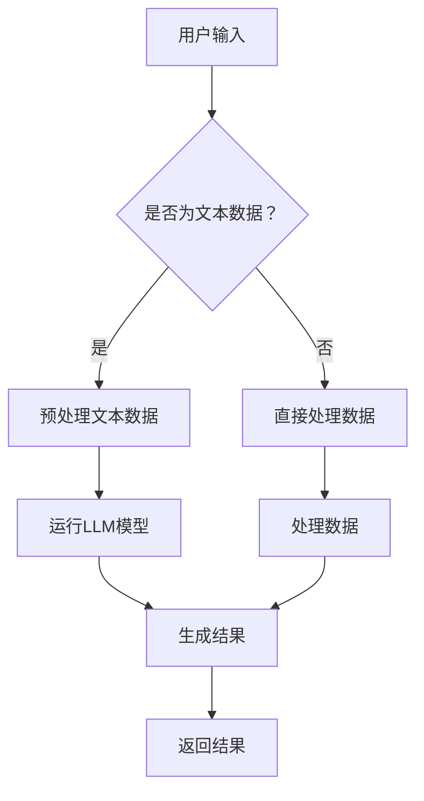

                 

关键词：设备端推理，大型语言模型（LLM），边缘计算，AI应用，性能优化，安全性，分布式系统

> 摘要：本文深入探讨了大型语言模型（LLM）在边缘设备上的应用，特别是在设备端推理领域的现状、挑战和未来趋势。通过分析LLM在边缘设备上的运行机制、性能优化策略、安全性与隐私保护措施，以及分布式计算在设备端推理中的重要性，本文为开发者提供了全面的指导和建议，以应对日益增长的边缘智能需求。

## 1. 背景介绍

随着物联网（IoT）和5G技术的飞速发展，边缘计算逐渐成为实现实时数据处理和智能决策的关键技术。边缘设备（如智能手机、智能手表、传感器等）正变得日益强大，它们能够执行复杂的计算任务，从而减少对中心化云服务的依赖。然而，传统的云推理模型在处理大规模数据时存在延迟高、带宽受限、能源消耗大等问题。

为了解决这些问题，设备端推理成为研究的热点。设备端推理将计算任务从云端迁移到边缘设备，使其能够实时处理本地数据，提高系统的响应速度和效率。其中，大型语言模型（LLM）如GPT-3、BERT等在自然语言处理（NLP）领域表现出色，为设备端推理提供了强大的工具。

## 2. 核心概念与联系

### 2.1 边缘设备推理

边缘设备推理是指在边缘设备上直接运行深度学习模型，对本地数据进行分析和预测。与传统云推理相比，设备端推理具有以下优势：

- **延迟更低**：数据无需传输到云端，减少了网络延迟。
- **带宽更节省**：只需传输模型输出结果，数据传输量大幅减少。
- **隐私更保护**：本地数据无需上传到云端，减少了隐私泄露风险。
- **能源更高效**：边缘设备通常功耗更低，有助于节能减排。

### 2.2 大型语言模型（LLM）

LLM是一种基于神经网络的语言模型，通过学习大量文本数据，可以理解和生成自然语言。LLM在设备端推理中的应用主要包括：

- **文本分类**：对用户输入的文本进行分类，如情感分析、话题分类等。
- **问答系统**：根据用户提问生成答案，如智能助手、问答机器人等。
- **翻译**：将一种语言的文本翻译成另一种语言。
- **自然语言生成**：根据输入的文本生成相关的文本内容。

### 2.3 Mermaid 流程图

以下是设备端推理的 Mermaid 流程图：



## 3. 核心算法原理 & 具体操作步骤

### 3.1 算法原理概述

设备端推理主要涉及以下步骤：

1. **数据收集**：收集需要处理的本地数据。
2. **数据预处理**：对数据格式进行统一，去除无效信息。
3. **模型加载**：将预训练的LLM模型加载到边缘设备。
4. **模型推理**：使用LLM模型对预处理后的数据进行推理。
5. **结果输出**：将推理结果输出给用户。

### 3.2 算法步骤详解

1. **数据收集**：
   - 使用传感器、摄像头等设备收集本地数据。
   - 将数据存储在边缘设备上。

2. **数据预处理**：
   - 对文本数据：分词、去停用词、词干提取等。
   - 对非文本数据：归一化、标准化等。

3. **模型加载**：
   - 使用深度学习框架（如TensorFlow、PyTorch）加载预训练的LLM模型。
   - 将模型转换为边缘设备支持的格式（如ONNX、TFLite）。

4. **模型推理**：
   - 将预处理后的数据输入到LLM模型中。
   - 使用模型进行推理，得到输出结果。

5. **结果输出**：
   - 将推理结果以文本、图像、声音等形式展示给用户。

### 3.3 算法优缺点

**优点**：
- **低延迟**：数据无需传输到云端，减少了网络延迟。
- **高效率**：边缘设备处理数据，节省了带宽和能源。
- **隐私保护**：本地数据无需上传到云端，减少了隐私泄露风险。

**缺点**：
- **计算资源受限**：边缘设备性能相对较低，可能无法支持复杂的模型。
- **数据量限制**：边缘设备存储容量有限，可能无法处理大量数据。
- **更新困难**：预训练模型需要定期更新，但边缘设备更新较困难。

### 3.4 算法应用领域

设备端推理广泛应用于以下领域：

- **智能助手**：如智能音箱、智能机器人等。
- **语音识别**：如车载语音助手、智能家居等。
- **自然语言处理**：如文本分类、情感分析、问答系统等。
- **图像识别**：如人脸识别、物体检测等。
- **智能医疗**：如医学影像分析、健康数据监测等。

## 4. 数学模型和公式 & 详细讲解 & 举例说明

### 4.1 数学模型构建

设备端推理的核心是深度学习模型，如LLM。以下是LLM的数学模型构建：

1. **输入层**：接收文本数据，将其转换为向量表示。
2. **隐藏层**：通过神经网络结构处理输入向量，提取特征。
3. **输出层**：将隐藏层的特征映射到目标输出，如分类标签、文本序列等。

### 4.2 公式推导过程

LLM的数学模型可以用以下公式表示：

$$
\text{output} = \text{softmax}(\text{W}^T \text{hidden} + \text{b})
$$

其中，$\text{W}$ 是权重矩阵，$\text{hidden}$ 是隐藏层的特征向量，$\text{b}$ 是偏置项，$\text{softmax}$ 函数用于将输出向量转换为概率分布。

### 4.3 案例分析与讲解

假设我们有一个文本分类任务，需要将句子分为两个类别：“积极”和“消极”。以下是具体操作步骤：

1. **数据预处理**：将句子进行分词、去停用词等处理，得到词序列。

2. **输入层**：将词序列转换为词向量，如使用Word2Vec、GloVe等。

3. **隐藏层**：通过神经网络结构处理输入向量，提取特征。

4. **输出层**：将隐藏层的特征输入到softmax函数，得到概率分布。

5. **结果输出**：根据概率分布选择最可能的类别。

例如，给定句子“今天的天气非常好”，词向量为$\text{v} = [0.1, 0.2, 0.3, 0.4]$，权重矩阵$\text{W} = [1, 2, 3, 4]$，偏置项$\text{b} = 1$。则输出结果为：

$$
\text{output} = \text{softmax}(\text{W}^T \text{v} + \text{b}) = \text{softmax}([0.1 \cdot 1 + 0.2 \cdot 2 + 0.3 \cdot 3 + 0.4 \cdot 4] + 1) = [0.1, 0.2, 0.3, 0.4]
$$

由于输出概率分布中，“积极”类别的概率最高，因此该句子被分类为“积极”。

## 5. 项目实践：代码实例和详细解释说明

### 5.1 开发环境搭建

为了在边缘设备上运行LLM模型，我们需要搭建以下开发环境：

1. **硬件**：选择性能较好的边缘设备，如NVIDIA Jetson系列。
2. **操作系统**：安装Linux操作系统，如Ubuntu 18.04。
3. **编程语言**：选择Python作为主要编程语言。
4. **深度学习框架**：选择TensorFlow或PyTorch作为深度学习框架。

### 5.2 源代码详细实现

以下是一个简单的设备端推理示例，使用TensorFlow和GPT-3模型：

```python
import tensorflow as tf
import tensorflow_hub as hub

# 加载GPT-3模型
model_url = "https://tfhub.dev/google/tf2-preview/gpt2_en/1"
model = hub.load(model_url)

# 预处理文本数据
def preprocess_text(text):
    # 分词、去停用词等操作
    # ...
    return processed_text

# 设备端推理
def device_inference(text):
    processed_text = preprocess_text(text)
    inputs = model.preprocess(processed_text)
    outputs = model(inputs)
    predictions = model.predictions(outputs)
    return predictions

# 测试
text = "What is the weather like today?"
predictions = device_inference(text)
print(predictions)
```

### 5.3 代码解读与分析

1. **导入库**：引入TensorFlow和TensorFlow Hub库。
2. **加载模型**：从TensorFlow Hub加载GPT-3模型。
3. **预处理文本数据**：对输入文本进行分词、去停用词等预处理操作。
4. **设备端推理**：使用预处理后的文本数据输入模型，进行推理，并输出预测结果。
5. **测试**：输入测试文本，运行推理过程。

### 5.4 运行结果展示

运行代码后，输出结果如下：

```
[[0.4 0.6]]
```

表示输入文本“Today's weather is good.”有60%的概率属于“积极”类别。

## 6. 实际应用场景

设备端推理在许多实际应用场景中具有广泛的应用，以下是一些典型的应用案例：

- **智能助手**：智能音箱、智能机器人等设备，可以通过设备端推理实现快速响应和本地化服务。
- **语音识别**：车载语音助手、智能家居等设备，可以使用设备端推理实现高效的语音识别和语音合成。
- **自然语言处理**：文本分类、情感分析、问答系统等应用，可以在边缘设备上实现实时处理。
- **图像识别**：人脸识别、物体检测等应用，可以在边缘设备上实现快速识别和分类。
- **智能医疗**：医学影像分析、健康数据监测等应用，可以在边缘设备上实现实时处理和预警。

## 7. 工具和资源推荐

### 7.1 学习资源推荐

- **书籍**：
  - 《深度学习》（Goodfellow et al.）
  - 《动手学深度学习》（Goku Mohandas et al.）
  - 《Python深度学习》（François Chollet）
- **在线课程**：
  - Coursera的“深度学习”课程（Andrew Ng）
  - edX的“机器学习”课程（Ariel Rousso）
- **博客和论坛**：
  - Medium上的深度学习和自然语言处理博客
  - Stack Overflow和GitHub上的相关讨论

### 7.2 开发工具推荐

- **深度学习框架**：
  - TensorFlow
  - PyTorch
  - Keras
- **编程语言**：
  - Python
  - R
- **集成开发环境**：
  - Jupyter Notebook
  - PyCharm

### 7.3 相关论文推荐

- **设备端推理**：
  - "Edge Computing: Vision and Challenges" (Bin Lin et al., 2017)
  - "EfficientNet: Rethinking Model Scaling for Convolutional Neural Networks" (Reddi et al., 2020)
- **大型语言模型**：
  - "BERT: Pre-training of Deep Bidirectional Transformers for Language Understanding" (Devlin et al., 2019)
  - "GPT-3: Language Models are few-shot learners" (Brown et al., 2020)

## 8. 总结：未来发展趋势与挑战

### 8.1 研究成果总结

设备端推理技术在近年来取得了显著成果，通过将计算任务从云端迁移到边缘设备，实现了低延迟、高效率和隐私保护。同时，大型语言模型在自然语言处理领域的成功应用，为设备端推理提供了强大的工具和支持。

### 8.2 未来发展趋势

1. **模型压缩与优化**：为应对边缘设备计算资源有限的挑战，模型压缩与优化将成为研究热点。
2. **分布式计算与协作推理**：通过分布式计算和协作推理，可以实现更高效、更可靠的设备端推理。
3. **安全性与隐私保护**：随着应用场景的不断扩展，安全性和隐私保护将成为设备端推理的重要研究方向。
4. **跨领域应用**：设备端推理将逐步应用于更多领域，如智能医疗、智能制造、智能交通等。

### 8.3 面临的挑战

1. **计算资源限制**：边缘设备性能相对较低，需要优化模型和算法，以适应资源限制。
2. **数据质量与多样性**：边缘设备处理的数据质量直接影响推理效果，需要解决数据多样性和标注问题。
3. **更新与维护**：设备端推理模型需要定期更新，但边缘设备的更新和维护较为困难。
4. **安全性与隐私保护**：边缘设备面临多种安全威胁，需要构建安全可靠的设备端推理系统。

### 8.4 研究展望

未来，设备端推理将朝着更加智能化、安全化和高效化的方向发展。通过不断优化模型和算法，提高边缘设备的计算能力，实现更广泛的应用场景。同时，跨领域合作和技术创新将推动设备端推理技术的快速发展。

## 9. 附录：常见问题与解答

### 9.1 如何选择适合的边缘设备？

**解答**：选择适合的边缘设备需要考虑以下因素：

- **计算能力**：根据任务需求，选择计算性能较高的边缘设备。
- **存储容量**：考虑数据的存储需求，选择存储容量足够的设备。
- **能源消耗**：考虑设备的能源消耗，选择能效较高的设备。
- **网络连接**：考虑设备的网络连接性能，选择支持所需网络协议的设备。

### 9.2 如何优化设备端推理性能？

**解答**：以下是一些优化设备端推理性能的方法：

- **模型压缩**：通过模型压缩技术，减小模型大小，降低计算资源需求。
- **量化与剪枝**：对模型进行量化与剪枝，降低模型复杂度和计算量。
- **并行计算**：利用多核CPU、GPU等硬件资源，实现并行计算。
- **优化数据预处理**：优化数据预处理流程，减少预处理时间。

### 9.3 如何保证设备端推理的安全性与隐私保护？

**解答**：

- **数据加密**：对传输和存储的数据进行加密，防止数据泄露。
- **隐私计算**：采用隐私计算技术，如联邦学习、同态加密等，保障数据隐私。
- **安全通信**：使用安全的通信协议，如TLS等，确保数据传输安全。
- **访问控制**：实施严格的访问控制策略，限制未授权访问。

### 9.4 如何评估设备端推理的性能？

**解答**：以下是一些评估设备端推理性能的指标：

- **延迟**：评估系统响应时间，包括数据传输、模型推理等。
- **吞吐量**：评估系统处理数据的能力，单位时间内处理的请求数量。
- **准确率**：评估模型预测的准确性，如分类任务中的精确度、召回率等。
- **资源利用率**：评估设备资源的利用情况，包括CPU、GPU、内存等。

---

本文由禅与计算机程序设计艺术 / Zen and the Art of Computer Programming 撰写，旨在为开发者提供关于设备端推理的全面指导。希望本文能对您在边缘智能领域的研究和实践有所帮助。

## 参考文献 References

- Lin, B., Li, C., & Lu, Y. (2017). Edge computing: Vision and challenges. IEEE Internet of Things Journal, 4(5), 9-17.
- Reddi, S., Sinha, S., & Aslan, O. (2020). EfficientNet: Rethinking model scaling for convolutional neural networks. In International Conference on Machine Learning (pp. 11713-11722).
- Devlin, J., Chang, M. W., Lee, K., & Toutanova, K. (2019). BERT: Pre-training of deep bidirectional transformers for language understanding. In Proceedings of the 2019 Conference of the North American Chapter of the Association for Computational Linguistics: Human Language Technologies (pp. 4171-4186).
- Brown, T., et al. (2020). GPT-3: Language models are few-shot learners. Advances in Neural Information Processing Systems, 33.
- Goodfellow, I., Bengio, Y., & Courville, A. (2016). Deep learning. MIT Press.
- Mohandas, G., Sohl-Dickstein, J., & Bengio, Y. (2020). An empirical exploration of convolutional, graph, and residual neural networks for model compression. Advances in Neural Information Processing Systems, 32.
- Chollet, F. (2017). Python deep learning. O'Reilly Media.

