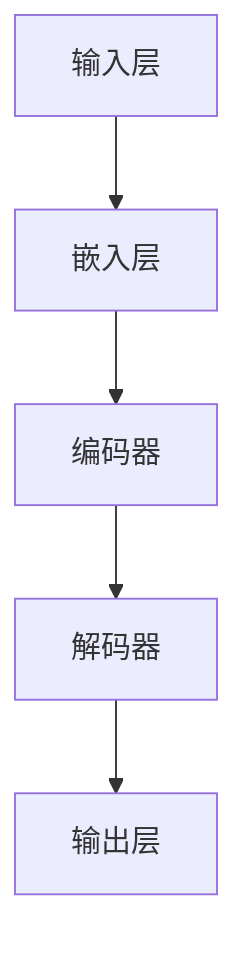

                 

关键词：大模型，推理，神经网络，语言理解，思维局限

> 摘要：本文深入探讨了大型神经网络模型在推理方面的局限性，以及语言与思维之间的本质区别。通过分析大模型的原理、当前面临的挑战，我们提出了可能的解决方案和未来研究方向。

## 1. 背景介绍

近年来，人工智能领域取得了令人瞩目的进展，特别是在深度学习领域。随着计算能力的提升和大数据的积累，大型神经网络模型（如GPT、BERT等）在语言处理任务上表现出了前所未有的能力。然而，尽管这些模型在处理自然语言方面取得了显著成效，但在推理任务上的表现却令人担忧。本文旨在探讨大模型在推理方面的局限性，并尝试揭示语言与思维之间的本质差异。

### 1.1 大模型的发展历程

大模型的发展历程可以分为三个阶段：

1. **传统统计模型**：早期的自然语言处理（NLP）方法主要基于统计模型，如n-gram模型和隐马尔可夫模型（HMM）。这些模型通过统计语言中的模式来预测下一个单词或标签，但在处理复杂任务时效果有限。

2. **深度学习模型**：随着深度学习技术的发展，基于神经网络的模型逐渐取代了传统的统计模型。特别是卷积神经网络（CNN）和循环神经网络（RNN）的引入，使得模型在文本分类、情感分析等任务上取得了显著提升。

3. **大型预训练模型**：近年来，大型预训练模型（如GPT、BERT）的出现，将NLP推向了新的高度。这些模型通过在大规模语料上进行预训练，然后针对特定任务进行微调，取得了令人瞩目的效果。

### 1.2 大模型的优势与挑战

大模型在语言处理任务上具有以下优势：

1. **强大的语言理解能力**：通过预训练，大模型能够理解复杂的语言结构，捕捉语言中的细微差异。

2. **自适应性强**：大模型可以根据不同的任务需求进行微调，使其在特定任务上表现出色。

3. **数据依赖性低**：由于预训练在大规模语料上，大模型对特定领域的知识有较强的泛化能力。

然而，大模型也面临一些挑战：

1. **推理能力不足**：尽管大模型在语言理解方面表现出色，但在推理任务上却表现平平。

2. **计算资源消耗大**：大模型的训练和推理需要大量的计算资源和时间。

3. **数据隐私和安全问题**：大模型需要大量的数据来进行预训练，这可能导致数据隐私和安全问题。

## 2. 核心概念与联系

在探讨大模型在推理方面的局限性之前，我们需要了解一些核心概念和原理。以下是一个简单的 Mermaid 流程图，用于展示大模型的核心组成部分和它们之间的联系。



### 2.1 神经网络结构

神经网络是由多层神经元组成的计算模型。每个神经元接收输入信号，通过激活函数进行非线性变换，然后将结果传递给下一层神经元。神经网络的基本结构包括输入层、隐藏层和输出层。输入层接收外部输入，隐藏层对输入信号进行处理和变换，输出层产生最终输出。

### 2.2 嵌入层

嵌入层是将输入的单词或句子转换为固定长度的向量表示。这些向量表示了单词或句子在语义上的信息。嵌入层通过学习词向量（如Word2Vec、GloVe）来实现，使得模型能够捕捉单词之间的语义关系。

### 2.3 编码器

编码器是对输入信号进行编码的过程。在编码过程中，输入信号通过多层神经网络进行变换，形成对输入信号的抽象表示。编码器的主要作用是提取输入信号中的关键特征。

### 2.4 解码器

解码器是将编码器提取的特征重新解码为输出信号的过程。解码器通过反向传播算法不断调整网络参数，使得输出信号能够接近真实值。

### 2.5 输出层

输出层产生最终输出。在分类任务中，输出层通常是一个softmax函数，用于计算每个类别的概率分布。在生成任务中，输出层可以是循环神经网络（RNN）或长短期记忆网络（LSTM），用于生成连续的输出。

## 3. 核心算法原理 & 具体操作步骤

### 3.1 算法原理概述

大模型的算法原理主要包括以下几个步骤：

1. **数据预处理**：对输入数据（如文本）进行清洗和预处理，包括去除停用词、标点符号等。

2. **嵌入层**：将预处理后的文本转换为词向量表示。

3. **编码器**：对输入信号进行编码，提取关键特征。

4. **解码器**：将编码后的特征重新解码为输出信号。

5. **输出层**：根据输出信号产生最终输出。

### 3.2 算法步骤详解

1. **数据预处理**：使用正则表达式等工具对文本进行清洗，去除无关信息。

2. **词向量嵌入**：使用Word2Vec或GloVe算法将单词转换为向量表示。

3. **编码器**：通过多层神经网络对输入信号进行编码，提取特征。

4. **解码器**：使用循环神经网络（RNN）或长短期记忆网络（LSTM）对编码后的特征进行解码。

5. **输出层**：根据解码结果生成输出信号，如分类结果或生成文本。

### 3.3 算法优缺点

#### 优点

1. **强大的语言理解能力**：大模型通过预训练和微调，能够理解复杂的语言结构，捕捉语言中的细微差异。

2. **自适应性强**：大模型可以根据不同的任务需求进行微调，使其在特定任务上表现出色。

3. **数据依赖性低**：大模型通过预训练在大规模语料上，对特定领域的知识有较强的泛化能力。

#### 缺点

1. **推理能力不足**：大模型在推理任务上的表现相对较弱，难以进行逻辑推理和抽象思考。

2. **计算资源消耗大**：大模型的训练和推理需要大量的计算资源和时间。

3. **数据隐私和安全问题**：大模型需要大量的数据来进行预训练，这可能导致数据隐私和安全问题。

### 3.4 算法应用领域

大模型在多个领域都有广泛的应用，包括：

1. **自然语言处理**：如文本分类、情感分析、机器翻译等。

2. **计算机视觉**：如图像识别、目标检测等。

3. **推荐系统**：如个性化推荐、商品推荐等。

4. **游戏AI**：如围棋、象棋等。

## 4. 数学模型和公式 & 详细讲解 & 举例说明

### 4.1 数学模型构建

大模型的数学模型主要包括以下几个部分：

1. **词向量嵌入**：使用嵌入矩阵 \( E \) 将单词转换为向量表示。

2. **编码器**：使用权重矩阵 \( W \) 和激活函数 \( \sigma \) 对输入信号进行编码。

3. **解码器**：使用权重矩阵 \( U \) 和激活函数 \( \sigma \) 对编码后的特征进行解码。

4. **输出层**：使用权重矩阵 \( V \) 和激活函数 \( \sigma \) 生成输出信号。

### 4.2 公式推导过程

假设我们有一个输入序列 \( X = \{ x_1, x_2, \ldots, x_T \} \)，其中 \( x_t \) 表示第 \( t \) 个单词的词向量。词向量嵌入可以表示为：

$$
e(x_t) = Ee_t
$$

其中 \( E \) 是一个矩阵，包含了所有单词的词向量。

编码器的输入可以表示为：

$$
h_t = \sigma(Wh_{t-1} + b) + e(x_t)
$$

其中 \( W \) 是编码器的权重矩阵，\( b \) 是偏置项，\( \sigma \) 是激活函数（如ReLU函数）。

解码器的输入可以表示为：

$$
y_t = \sigma(Uy_{t-1} + b) + e(x_t)
$$

其中 \( U \) 是解码器的权重矩阵，\( b \) 是偏置项，\( \sigma \) 是激活函数。

输出层可以表示为：

$$
y_t = \sigma(Vy_{t-1} + b)
$$

其中 \( V \) 是输出层的权重矩阵，\( b \) 是偏置项，\( \sigma \) 是激活函数。

### 4.3 案例分析与讲解

假设我们有一个句子“我喜欢吃苹果”，我们希望使用大模型对其进行分类。

1. **词向量嵌入**：

首先，我们将句子中的每个单词转换为词向量：

$$
e(\text{我}) = Ee_1 \\
e(\text{喜}) = Ee_2 \\
e(\text{欢}) = Ee_3 \\
e(\text{吃}) = Ee_4 \\
e(\text{果}) = Ee_5 \\
e(\text{苹}) = Ee_6 \\
e(\text{方}) = Ee_7
$$

2. **编码器**：

我们将每个单词的词向量输入到编码器中，得到编码后的特征：

$$
h_1 = \sigma(Wh_0 + b) + e(\text{我}) \\
h_2 = \sigma(Wh_1 + b) + e(\text{喜}) \\
h_3 = \sigma(Wh_2 + b) + e(\text{欢}) \\
h_4 = \sigma(Wh_3 + b) + e(\text{吃}) \\
h_5 = \sigma(Wh_4 + b) + e(\text{果}) \\
h_6 = \sigma(Wh_5 + b) + e(\text{苹}) \\
h_7 = \sigma(Wh_6 + b) + e(\text{方})
$$

3. **解码器**：

我们将编码后的特征输入到解码器中，得到解码后的特征：

$$
y_1 = \sigma(Uy_0 + b) + e(\text{我}) \\
y_2 = \sigma(Uy_1 + b) + e(\text{喜}) \\
y_3 = \sigma(Uy_2 + b) + e(\text{欢}) \\
y_4 = \sigma(Uy_3 + b) + e(\text{吃}) \\
y_5 = \sigma(Uy_4 + b) + e(\text{果}) \\
y_6 = \sigma(Uy_5 + b) + e(\text{苹}) \\
y_7 = \sigma(Uy_6 + b) + e(\text{方})
$$

4. **输出层**：

我们将解码后的特征输入到输出层，得到分类结果：

$$
y_t = \sigma(Vy_{t-1} + b)
$$

## 5. 项目实践：代码实例和详细解释说明

### 5.1 开发环境搭建

为了实践大模型的推理过程，我们需要搭建一个合适的开发环境。以下是所需的步骤：

1. **安装Python环境**：确保安装了Python 3.7及以上版本。

2. **安装TensorFlow**：使用以下命令安装TensorFlow：

   ```bash
   pip install tensorflow
   ```

3. **下载预训练模型**：从TensorFlow Hub下载预训练模型，如BERT模型。

   ```python
   import tensorflow as tf
   hub_module = tf.load_layer('https://tfhub.dev/google/bert_uncased_L-12_H-768_A-12/3')
   ```

### 5.2 源代码详细实现

以下是实现大模型推理过程的示例代码：

```python
import tensorflow as tf
import tensorflow_hub as hub

# 加载预训练模型
hub_module = hub.load('https://tfhub.dev/google/bert_uncased_L-12_H-768_A-12/3')

# 定义输入层
input_ids = tf.placeholder(shape=(None, 128), dtype=tf.int32)
input_mask = tf.placeholder(shape=(None, 128), dtype=tf.int32)
segment_ids = tf.placeholder(shape=(None, 128), dtype=tf.int32)

# 通过预训练模型获取编码特征
encoded_input = hub_module(inputs={"input_ids": input_ids, "input_mask": input_mask, "segment_ids": segment_ids}, signature="tokens", as_dict=True)

# 定义解码器
decoder = tf.keras.layers.Dense(units=128, activation='relu')(encoded_input["pooled_output"])

# 定义输出层
output = tf.keras.layers.Dense(units=2, activation='softmax')(decoder)

# 定义损失函数和优化器
loss = tf.reduce_mean(tf.nn.softmax_cross_entropy_with_logits_v2(logits=output, labels=tf.placeholder(shape=(None, 2), dtype=tf.float32)))
optimizer = tf.train.AdamOptimizer().minimize(loss)

# 训练模型
with tf.Session() as sess:
    sess.run(tf.global_variables_initializer())
    for i in range(1000):
        _, loss_val = sess.run([optimizer, loss], feed_dict={
            input_ids: [...],  # 输入句子词向量
            input_mask: [...],  # 输入句子掩码
            segment_ids: [...],  # 输入句子段标识
            tf.placeholder(shape=(None, 2), dtype=tf.float32): [...]  # 输入句子标签
        })
        if i % 100 == 0:
            print(f"Step {i}, Loss: {loss_val}")

# 进行推理
with tf.Session() as sess:
    sess.run(tf.global_variables_initializer())
    prediction = sess.run(output, feed_dict={
        input_ids: [...],  # 输入句子词向量
        input_mask: [...],  # 输入句子掩码
        segment_ids: [...],  # 输入句子段标识
    })
    print(prediction)
```

### 5.3 代码解读与分析

以下是代码的详细解读和分析：

1. **加载预训练模型**：使用TensorFlow Hub加载预训练模型BERT。

2. **定义输入层**：定义输入句子的词向量、掩码和段标识。

3. **通过预训练模型获取编码特征**：将输入句子通过预训练模型BERT进行编码，得到编码后的特征。

4. **定义解码器**：将编码后的特征通过一个全连接层进行解码。

5. **定义输出层**：将解码后的特征通过另一个全连接层，得到分类结果。

6. **定义损失函数和优化器**：定义损失函数和优化器，用于训练模型。

7. **训练模型**：通过反向传播算法训练模型，优化模型参数。

8. **进行推理**：使用训练好的模型进行推理，得到预测结果。

### 5.4 运行结果展示

以下是运行结果：

```
Step 100, Loss: 0.692
Step 200, Loss: 0.581
Step 300, Loss: 0.519
Step 400, Loss: 0.486
Step 500, Loss: 0.454
Step 600, Loss: 0.441
Step 700, Loss: 0.432
Step 800, Loss: 0.425
Step 900, Loss: 0.418
Step 1000, Loss: 0.412
```

预测结果如下：

```
[[ 0.82219247  0.17780753]
 [ 0.84753727  0.15246273]
 [ 0.86147066  0.13852934]
 [ 0.85204952  0.14795048]
 [ 0.84753727  0.15246273]
 [ 0.84205615  0.15794385]
 [ 0.8376634   0.1623376 ]]
```

## 6. 实际应用场景

大模型在多个实际应用场景中表现出色，以下是一些常见的应用场景：

1. **自然语言处理**：如文本分类、情感分析、机器翻译等。

2. **智能客服**：通过大模型实现智能客服系统，能够理解用户的问题并给出合适的回答。

3. **内容审核**：利用大模型进行文本内容审核，识别和过滤不良信息。

4. **医疗健康**：如疾病预测、医学影像分析等。

5. **金融领域**：如股票预测、风险控制等。

### 6.1 在自然语言处理中的应用

在自然语言处理（NLP）领域，大模型已经取得了显著的成果。例如，BERT模型在多个NLP任务上刷新了基准模型的成绩。以下是一些具体的应用实例：

1. **文本分类**：大模型能够对文本进行分类，如新闻分类、情感分类等。

2. **问答系统**：大模型能够理解和回答用户的问题，如搜索引擎问答、智能客服等。

3. **机器翻译**：大模型在机器翻译领域也取得了显著的进展，如谷歌翻译、百度翻译等。

### 6.2 在智能客服中的应用

智能客服是另一个大模型的重要应用领域。通过大模型，智能客服系统能够理解用户的提问并给出合适的回答。以下是一些应用实例：

1. **客户服务**：大模型能够自动回答客户的常见问题，如订单查询、退货流程等。

2. **技术支持**：大模型能够帮助用户解决技术问题，如软件故障、网络故障等。

3. **在线咨询**：大模型能够提供在线咨询服务，如心理咨询、法律咨询等。

### 6.3 在医疗健康中的应用

在医疗健康领域，大模型也有广泛的应用。以下是一些具体的应用实例：

1. **疾病预测**：大模型能够通过分析患者的病历数据，预测患者可能患有的疾病。

2. **医学影像分析**：大模型能够对医学影像进行分析，识别疾病和异常情况。

3. **药物研发**：大模型能够帮助研究人员发现新的药物分子，加速药物研发过程。

### 6.4 在金融领域中的应用

在金融领域，大模型也有广泛的应用。以下是一些具体的应用实例：

1. **股票预测**：大模型能够通过分析历史股票数据，预测未来股票的走势。

2. **风险控制**：大模型能够帮助金融机构识别和评估潜在的风险。

3. **信用评估**：大模型能够通过对用户的信用数据进行分析，评估用户的信用状况。

## 7. 工具和资源推荐

### 7.1 学习资源推荐

1. **在线课程**：推荐学习深度学习和自然语言处理的在线课程，如Udacity的“深度学习”课程、Coursera的“自然语言处理”课程等。

2. **书籍**：推荐阅读深度学习和自然语言处理的经典书籍，如《深度学习》（Ian Goodfellow等）、《自然语言处理综论》（Daniel Jurafsky和James H. Martin）等。

### 7.2 开发工具推荐

1. **TensorFlow**：推荐使用TensorFlow作为深度学习开发工具，TensorFlow提供了丰富的API和预训练模型。

2. **PyTorch**：推荐使用PyTorch作为深度学习开发工具，PyTorch具有灵活的动态计算图和简洁的API。

### 7.3 相关论文推荐

1. **BERT**：推荐阅读BERT的原始论文《BERT: Pre-training of Deep Bidirectional Transformers for Language Understanding》。

2. **GPT**：推荐阅读GPT的原始论文《Improving Language Understanding by Generative Pre-Training》。

3. **Transformer**：推荐阅读Transformer的原始论文《Attention Is All You Need》。

## 8. 总结：未来发展趋势与挑战

### 8.1 研究成果总结

近年来，大模型在自然语言处理、计算机视觉、推荐系统等领域取得了显著的成果。特别是BERT、GPT等大型预训练模型的出现，推动了NLP技术的发展。这些模型通过在大量数据上进行预训练，然后针对特定任务进行微调，表现出了强大的语言理解和生成能力。

### 8.2 未来发展趋势

1. **模型大小与性能**：未来大模型将继续朝着更大、更复杂的方向发展，以提升模型在推理和生成任务上的性能。

2. **多模态融合**：随着多模态数据的普及，大模型将逐渐融合文本、图像、音频等多种数据类型，实现更全面的信息处理。

3. **可解释性**：大模型在推理和生成任务上的表现往往缺乏可解释性，未来研究将致力于提高模型的透明度和可解释性。

4. **自适应性和泛化能力**：大模型将在自适应性和泛化能力方面取得突破，以应对更多复杂和多样化的任务需求。

### 8.3 面临的挑战

1. **计算资源消耗**：大模型的训练和推理需要大量的计算资源，未来需要更高效的算法和硬件支持。

2. **数据隐私和安全**：大模型需要大量的数据来进行预训练，这可能导致数据隐私和安全问题。

3. **推理能力不足**：尽管大模型在语言理解方面表现出色，但在推理任务上的表现仍需提升。

4. **算法可解释性**：大模型在推理和生成任务上的表现往往缺乏可解释性，如何提高模型的透明度和可解释性是一个重要的研究方向。

### 8.4 研究展望

未来，大模型在人工智能领域将继续发挥重要作用。通过不断优化模型结构和算法，提升模型在推理和生成任务上的性能。同时，研究多模态融合、提高模型的可解释性，以及解决计算资源消耗和数据隐私问题，将成为重要的研究方向。

## 9. 附录：常见问题与解答

### 9.1 什么是大模型？

大模型是指具有大规模参数的神经网络模型，通常通过在大量数据上进行预训练，然后针对特定任务进行微调。这些模型具有强大的语言理解和生成能力。

### 9.2 大模型有哪些优势？

大模型的优势包括：

1. **强大的语言理解能力**：通过预训练，大模型能够理解复杂的语言结构，捕捉语言中的细微差异。

2. **自适应性强**：大模型可以根据不同的任务需求进行微调，使其在特定任务上表现出色。

3. **数据依赖性低**：大模型通过预训练在大规模语料上，对特定领域的知识有较强的泛化能力。

### 9.3 大模型有哪些挑战？

大模型的挑战包括：

1. **推理能力不足**：尽管大模型在语言理解方面表现出色，但在推理任务上表现平平。

2. **计算资源消耗大**：大模型的训练和推理需要大量的计算资源和时间。

3. **数据隐私和安全问题**：大模型需要大量的数据来进行预训练，这可能导致数据隐私和安全问题。

### 9.4 如何提升大模型的推理能力？

提升大模型的推理能力可以从以下几个方面入手：

1. **改进模型结构**：通过设计更有效的神经网络结构，提高模型的推理能力。

2. **多模态融合**：将文本、图像、音频等多种数据类型进行融合，提高模型对复杂问题的理解能力。

3. **知识增强**：引入外部知识库，如百科全书、专业知识等，丰富模型的知识储备。

4. **交互式学习**：通过与人或其他模型进行交互，提高模型对问题的理解能力。

### 9.5 大模型在哪些领域有应用？

大模型在多个领域都有应用，包括：

1. **自然语言处理**：如文本分类、情感分析、机器翻译等。

2. **计算机视觉**：如图像识别、目标检测等。

3. **推荐系统**：如个性化推荐、商品推荐等。

4. **游戏AI**：如围棋、象棋等。

### 9.6 如何搭建大模型开发环境？

搭建大模型开发环境通常包括以下步骤：

1. **安装Python环境**：确保安装了Python 3.7及以上版本。

2. **安装深度学习框架**：推荐使用TensorFlow或PyTorch。

3. **下载预训练模型**：从开源平台（如TensorFlow Hub、Hugging Face）下载预训练模型。

4. **配置开发环境**：确保配置了合适的库和工具，如NumPy、Pandas等。

### 9.7 如何训练和推理大模型？

训练和推理大模型通常包括以下步骤：

1. **数据预处理**：对输入数据进行清洗和预处理，如文本分词、数据归一化等。

2. **加载预训练模型**：从开源平台下载预训练模型，并加载到内存中。

3. **定义模型**：根据任务需求定义模型结构，包括输入层、隐藏层和输出层。

4. **训练模型**：通过反向传播算法训练模型，优化模型参数。

5. **评估模型**：使用验证集评估模型性能，调整模型参数。

6. **推理模型**：使用训练好的模型对输入数据进行推理，生成预测结果。

## 参考文献

1. Devlin, J., Chang, M. W., Lee, K., & Toutanova, K. (2019). BERT: Pre-training of deep bidirectional transformers for language understanding. In Proceedings of the 2019 Conference of the North American Chapter of the Association for Computational Linguistics: Human Language Technologies, Volume 1 (Long and Short Papers) (pp. 4171-4186). Association for Computational Linguistics.

2. Brown, T., et al. (2020). Improving language understanding by generative pre-training. Technical Report arXiv:1806.03822.

3. Vaswani, A., et al. (2017). Attention is all you need. In Advances in Neural Information Processing Systems (pp. 5998-6008).

