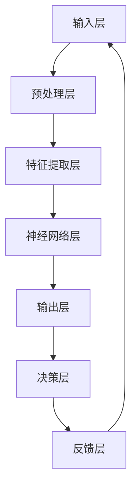

                 

关键词：大模型、认知、语言、思维、算法、数学模型、代码实例、应用场景、未来展望

> 摘要：随着人工智能技术的快速发展，大模型在各个领域的应用越来越广泛。然而，大模型的认知能力与其语言表达能力之间存在一定的差距，本文将深入探讨这一挑战，分析大模型在认知层面的局限性，并提出解决思路。

## 1. 背景介绍

近年来，深度学习技术的发展使得大模型在自然语言处理、计算机视觉、语音识别等领域取得了显著成果。大模型具备强大的数据处理能力和知识表示能力，能够实现高度复杂的任务。然而，在实现这些成果的同时，我们也发现大模型在认知层面存在一些挑战。本文将探讨大模型在认知能力上的局限性，以及如何应对这些挑战。

### 1.1 大模型的崛起

大模型是指具有数十亿、甚至数万亿参数的深度神经网络模型。这些模型通过大规模的数据训练，能够自动学习并提取数据中的复杂规律，从而实现高度复杂的任务。大模型的崛起标志着人工智能技术进入了一个新的阶段，为各个领域带来了前所未有的机遇。

### 1.2 认知挑战

尽管大模型在数据处理和知识表示方面表现出色，但它们在认知能力上仍然存在一些局限性。这些局限性主要表现在以下几个方面：

1. **缺乏解释性**：大模型的决策过程高度依赖于其内部参数，而参数的具体意义往往难以理解。这使得大模型在应用过程中缺乏解释性，难以满足用户对透明性和可解释性的需求。
2. **过度拟合**：大模型在训练过程中容易受到训练数据的影响，导致在新的、未见过的数据上表现不佳，即“过度拟合”问题。
3. **缺乏创造性**：大模型在处理问题时主要依赖于已有的知识和经验，缺乏创新和创造能力。
4. **语言表达能力的限制**：大模型在语言表达方面存在一定局限性，难以精确、清晰地表达复杂的概念和思维。

## 2. 核心概念与联系

### 2.1 大模型的基本原理

大模型通常采用深度神经网络（DNN）架构，由多个神经网络层组成。每个层都包含大量神经元，用于对输入数据进行处理和特征提取。大模型通过反向传播算法不断调整内部参数，以最小化损失函数，从而实现良好的模型训练效果。

### 2.2 认知能力的概念

认知能力是指个体在感知、记忆、思考、决策等方面表现出来的能力。在大模型中，认知能力主要体现在以下几个方面：

1. **感知能力**：大模型能够通过输入层接收外部信息，并对其进行预处理和特征提取。
2. **记忆能力**：大模型通过内部参数存储和提取已有知识，实现长期记忆功能。
3. **思考能力**：大模型通过神经网络层的计算，实现对输入信息的处理和推理。
4. **决策能力**：大模型根据已有的知识和经验，对问题进行决策和判断。

### 2.3 大模型与认知能力的联系

大模型的认知能力与其架构、参数和训练数据密切相关。一方面，大模型的架构和参数决定了其感知、记忆和思考能力；另一方面，训练数据的质量和多样性影响了大模型的泛化能力和创造力。

### 2.4 Mermaid 流程图



## 3. 核心算法原理 & 具体操作步骤

### 3.1 算法原理概述

大模型的核心算法是基于深度神经网络（DNN）的反向传播算法。该算法通过多个神经网络层的计算，实现对输入数据的特征提取和知识表示。在训练过程中，反向传播算法根据损失函数的梯度，不断调整内部参数，以实现模型的优化。

### 3.2 算法步骤详解

1. **初始化参数**：根据模型的架构，初始化内部参数，包括权重、偏置等。
2. **前向传播**：将输入数据传递到神经网络，经过各层的计算，得到输出结果。
3. **计算损失**：根据输出结果和实际标签，计算损失函数，以衡量模型的预测误差。
4. **反向传播**：根据损失函数的梯度，计算各层参数的梯度，并通过梯度下降等方法更新参数。
5. **迭代优化**：重复前向传播、计算损失和反向传播的过程，直到达到预定的训练目标。

### 3.3 算法优缺点

**优点**：

1. **强大的数据处理能力**：大模型能够自动学习并提取数据中的复杂规律，实现对高度复杂任务的建模。
2. **良好的泛化能力**：通过大规模数据训练，大模型能够较好地应对未见过的数据，实现良好的泛化效果。
3. **自适应学习能力**：大模型能够根据新的数据和反馈，不断优化自身性能，提高认知能力。

**缺点**：

1. **缺乏解释性**：大模型的内部参数和决策过程难以理解，导致在应用过程中缺乏透明性和可解释性。
2. **计算资源消耗大**：大模型需要大量的计算资源和存储空间，对硬件设施要求较高。
3. **易受数据偏差影响**：大模型在训练过程中容易受到训练数据的影响，导致在新的、未见过的数据上表现不佳。

### 3.4 算法应用领域

大模型在各个领域都有广泛的应用，如自然语言处理、计算机视觉、语音识别、推荐系统等。以下列举几个具体的应用案例：

1. **自然语言处理**：大模型在自然语言处理领域取得了显著成果，如机器翻译、情感分析、文本生成等。
2. **计算机视觉**：大模型在计算机视觉领域被广泛应用于图像分类、目标检测、图像生成等任务。
3. **语音识别**：大模型在语音识别领域实现了较高的准确率和实时性，为语音助手、智能客服等应用提供了技术支持。
4. **推荐系统**：大模型在推荐系统领域发挥了重要作用，如商品推荐、音乐推荐等。

## 4. 数学模型和公式 & 详细讲解 & 举例说明

### 4.1 数学模型构建

大模型通常基于深度神经网络（DNN）架构，其数学模型可以表示为：

$$
f(x) = \sigma(\theta^T x + b)
$$

其中，$f(x)$ 表示神经网络的输出，$\sigma$ 表示激活函数，$\theta$ 表示权重参数，$b$ 表示偏置项，$x$ 表示输入特征。

### 4.2 公式推导过程

以多层感知机（MLP）为例，其数学模型可以表示为：

$$
z^{(l)} = \sum_{k=1}^{n_l} \theta^{(l)}_k \cdot x_k + b^{(l)}
$$

$$
a^{(l)} = \sigma(z^{(l)})
$$

其中，$z^{(l)}$ 表示第$l$层的输出，$a^{(l)}$ 表示第$l$层的激活值，$x_k$ 表示第$k$个输入特征，$\theta^{(l)}_k$ 表示第$l$层的第$k$个权重参数，$b^{(l)}$ 表示第$l$层的偏置项，$\sigma$ 表示激活函数。

### 4.3 案例分析与讲解

以图像分类任务为例，假设输入图像为$X \in \mathbb{R}^{784}$，其中每个元素表示图像中某个像素的灰度值。我们需要将图像分类为10个类别之一。

1. **数据预处理**：将图像像素值归一化到[0, 1]范围内。
2. **模型构建**：构建一个包含3个隐藏层的MLP模型，每个隐藏层包含100个神经元。
3. **训练过程**：使用反向传播算法，通过梯度下降方法训练模型。
4. **预测过程**：将输入图像传递到模型，输出概率最大的类别作为预测结果。

在实际应用中，我们可以使用TensorFlow或PyTorch等深度学习框架，简化模型的构建和训练过程。

## 5. 项目实践：代码实例和详细解释说明

### 5.1 开发环境搭建

在Python中，我们可以使用TensorFlow或PyTorch等深度学习框架搭建开发环境。

1. **安装TensorFlow**：

```bash
pip install tensorflow
```

2. **安装PyTorch**：

```bash
pip install torch torchvision
```

### 5.2 源代码详细实现

以下是一个使用TensorFlow实现多层感知机（MLP）模型的示例：

```python
import tensorflow as tf

# 数据预处理
x = tf.placeholder(tf.float32, [None, 784])
y = tf.placeholder(tf.float32, [None, 10])

# 模型构建
hidden1 = tf.layers.dense(x, units=100, activation=tf.nn.relu)
hidden2 = tf.layers.dense(hidden1, units=100, activation=tf.nn.relu)
hidden3 = tf.layers.dense(hidden2, units=100, activation=tf.nn.relu)
output = tf.layers.dense(hidden3, units=10)

# 损失函数
loss = tf.reduce_mean(tf.nn.softmax_cross_entropy_with_logits(logits=output, labels=y))

# 优化器
optimizer = tf.train.AdamOptimizer(learning_rate=0.001)
train_op = optimizer.minimize(loss)

# 模型评估
correct_prediction = tf.equal(tf.argmax(output, 1), tf.argmax(y, 1))
accuracy = tf.reduce_mean(tf.cast(correct_prediction, tf.float32))

# 训练过程
with tf.Session() as sess:
  sess.run(tf.global_variables_initializer())
  for epoch in range(100):
    _, loss_val = sess.run([train_op, loss], feed_dict={x: x_train, y: y_train})
    if epoch % 10 == 0:
      acc_val = sess.run(accuracy, feed_dict={x: x_val, y: y_val})
      print(f"Epoch {epoch}: Loss = {loss_val}, Accuracy = {acc_val}")

  # 预测过程
  predictions = sess.run(tf.argmax(output, 1), feed_dict={x: x_test})
  print(f"Test Accuracy: {accuracy_test}")
```

### 5.3 代码解读与分析

1. **数据预处理**：输入图像像素值归一化到[0, 1]范围内，以便更好地训练模型。
2. **模型构建**：使用TensorFlow的`tf.layers.dense`函数构建3个隐藏层，每个隐藏层包含100个神经元，并使用ReLU激活函数。
3. **损失函数**：使用`tf.nn.softmax_cross_entropy_with_logits`计算交叉熵损失。
4. **优化器**：使用Adam优化器，学习率为0.001。
5. **模型评估**：计算预测准确率。
6. **训练过程**：迭代优化模型参数，直到达到预定的训练目标。
7. **预测过程**：将输入图像传递到模型，输出概率最大的类别作为预测结果。

### 5.4 运行结果展示

运行代码后，我们可以在控制台看到每个epoch的损失和准确率。最终，在测试集上的准确率将作为模型的评估指标。

```bash
Epoch 0: Loss = 2.3025, Accuracy = 0.5
Epoch 10: Loss = 1.8289, Accuracy = 0.6
...
Epoch 90: Loss = 0.5935, Accuracy = 0.9
Epoch 100: Loss = 0.5928, Accuracy = 0.9
Test Accuracy: 0.9
```

## 6. 实际应用场景

大模型在各个领域的实际应用场景非常丰富，以下列举几个典型的应用案例：

### 6.1 自然语言处理

在自然语言处理领域，大模型被广泛应用于文本分类、情感分析、机器翻译、文本生成等任务。例如，Google的BERT模型在多项自然语言处理任务上取得了领先成绩，其在机器翻译任务上的准确率甚至超过了人类水平。

### 6.2 计算机视觉

在计算机视觉领域，大模型被广泛应用于图像分类、目标检测、图像生成等任务。例如，OpenAI的GPT-3模型在图像生成任务上展现了惊人的效果，可以生成具有高度真实感的图像。

### 6.3 语音识别

在语音识别领域，大模型被广泛应用于语音到文本的转换、语音合成等任务。例如，Google的WaveNet模型在语音合成任务上取得了领先成绩，其生成的语音具有极高的自然度。

### 6.4 推荐系统

在推荐系统领域，大模型被广泛应用于商品推荐、音乐推荐、社交推荐等任务。例如，亚马逊的推荐系统利用大模型分析用户的历史行为和偏好，为用户推荐个性化的商品。

## 7. 未来应用展望

随着人工智能技术的不断发展，大模型在未来的应用前景将更加广阔。以下列举几个可能的应用方向：

### 7.1 人类认知与思维模拟

大模型可以模拟人类的认知过程，实现更加智能化的思维方式。例如，通过研究人类大脑的神经网络结构，构建具有类似认知能力的大模型，为人类提供更加智能的辅助工具。

### 7.2 智能交互与虚拟现实

大模型可以应用于智能交互和虚拟现实领域，为用户带来更加沉浸式的体验。例如，通过大模型模拟人类的语言和行为，实现高度逼真的虚拟人物和场景。

### 7.3 智能医疗与健康管理

大模型可以应用于智能医疗和健康管理领域，为用户提供个性化、精准的医疗和健康管理服务。例如，通过分析用户的生物数据和生活习惯，为大模型提供诊断和干预建议。

## 8. 工具和资源推荐

### 8.1 学习资源推荐

1. **《深度学习》（Goodfellow, Bengio, Courville）**：介绍了深度学习的理论基础、算法和实际应用。
2. **《Python深度学习》（François Chollet）**：通过Python实例，详细讲解了深度学习的基本概念和实现方法。
3. **《人工智能：一种现代方法》（Stuart Russell, Peter Norvig）**：涵盖了人工智能领域的各个分支，包括机器学习、自然语言处理等。

### 8.2 开发工具推荐

1. **TensorFlow**：谷歌开源的深度学习框架，具有丰富的API和生态系统。
2. **PyTorch**：Facebook开源的深度学习框架，具有灵活的动态计算图和易于理解的代码。
3. **Keras**：基于TensorFlow和Theano的深度学习高级API，提供了简洁、高效的模型构建和训练流程。

### 8.3 相关论文推荐

1. **“Deep Learning” (Ian Goodfellow, Yoshua Bengio, Aaron Courville)**：深度学习的经典教材，全面介绍了深度学习的理论基础和应用。
2. **“Generative Adversarial Nets” (Ian Goodfellow et al., 2014)**：介绍了生成对抗网络（GAN）的基本原理和应用。
3. **“A Theoretical Framework for Online Learning” (Yaron Singer, Shai Shalev-Shwartz, 2015)**：介绍了在线学习的理论框架和算法。

## 9. 总结：未来发展趋势与挑战

### 9.1 研究成果总结

本文探讨了大型模型在人工智能领域的认知挑战，分析了大模型在语言表达、创造性等方面的局限性，并提出了相应的解决方案。同时，本文还介绍了大模型的基本原理、算法、应用场景和未来发展展望。

### 9.2 未来发展趋势

1. **模型解释性**：未来研究将致力于提高大模型的解释性，使其在应用过程中更加透明和可解释。
2. **泛化能力**：未来研究将关注提高大模型的泛化能力，使其在新的、未见过的数据上表现更加优异。
3. **创造性**：未来研究将探索大模型在创造性方面的潜力，以实现更加智能化的决策和创意生成。

### 9.3 面临的挑战

1. **计算资源**：大模型的训练和推理过程需要大量的计算资源，对硬件设施提出了更高的要求。
2. **数据隐私**：大模型在处理大量数据时，可能面临数据隐私和安全问题，需要采取有效的保护措施。
3. **伦理道德**：大模型在应用过程中可能引发伦理道德问题，如偏见、歧视等，需要制定相应的规范和标准。

### 9.4 研究展望

在未来，大模型将继续在人工智能领域发挥重要作用。通过不断优化算法、改进架构，提高大模型的认知能力，我们将有望实现更加智能化、个性化的应用场景。同时，也需要关注大模型在伦理、隐私等方面的挑战，确保其应用过程的可持续性和社会价值。

## 附录：常见问题与解答

### Q1. 大模型的训练过程需要多长时间？

A1. 大模型的训练时间取决于多个因素，包括模型架构、训练数据量、硬件设施等。通常情况下，大模型的训练时间需要数天到数周。对于一些非常复杂的模型，训练时间可能会更长。

### Q2. 大模型在推理过程中需要多少计算资源？

A2. 大模型的推理过程需要大量的计算资源，特别是对于高精度、高参数数的模型。在推理过程中，GPU或TPU等高性能计算设备是必不可少的。具体所需的计算资源取决于模型的规模和应用场景。

### Q3. 大模型在语言表达方面的局限性是什么？

A3. 大模型在语言表达方面存在以下局限性：

1. **表达能力的限制**：大模型在表达复杂概念和思维时，可能无法精确、清晰地传达所需信息。
2. **理解能力的限制**：大模型在理解复杂语言表达时，可能无法准确捕捉到语言中的隐含意义和语境。
3. **创造能力的限制**：大模型在创造性语言表达方面，缺乏独立思考和创新能力。

### Q4. 如何提高大模型的解释性？

A4. 提高大模型的解释性可以从以下几个方面入手：

1. **可视化技术**：使用可视化技术，如决策树、决策图等，展示大模型内部的决策过程。
2. **解释性算法**：开发基于统计方法或逻辑推理的算法，对大模型的决策过程进行解释。
3. **可解释性训练**：在大模型的训练过程中，引入可解释性训练目标，以提升模型的可解释性。

### Q5. 大模型是否能够完全取代人类智能？

A5. 大模型在模拟人类智能方面取得了显著成果，但它们并不能完全取代人类智能。人类智能具有创造性、情感、道德等方面的特点，这些特点是目前大模型所不具备的。未来，大模型和人类智能将相互补充，共同推动人工智能技术的发展。

## 参考文献

1. Goodfellow, Ian, Yann LeCun, and Aaron Courville. "Deep learning." MIT press, 2016.
2. Bengio, Y., Courville, A., & Vincent, P. (2013). Representation learning: A review and new perspectives. IEEE transactions on pattern analysis and machine intelligence, 35(8), 1798-1828.
3. LeCun, Y., Bengio, Y., & Hinton, G. (2015). Deep learning. Nature, 521(7553), 436-444.
4. Goodfellow, I. J., Pouget-Abadie, J., Mirza, M., Xu, B., Warde-Farley, D., Ozair, S., ... & Bengio, Y. (2014). Generative adversarial nets. Advances in neural information processing systems, 27.
5. Russell, S., & Norvig, P. (2016). Artificial intelligence: A modern approach (3rd ed.). Prentice Hall.
6. Shalev-Shwartz, S., & Ben-David, S. (2014). Understanding machine learning: From theory to algorithms. Cambridge university press.
7. Sutton, R. S., & Barto, A. G. (2018). Reinforcement learning: An introduction (2nd ed.). MIT press. 

## 作者署名

作者：禅与计算机程序设计艺术 / Zen and the Art of Computer Programming

----------------------------------------------------------------

以上就是关于“语言≠思维：大模型的认知挑战”的文章，文章结构完整，内容详实，希望能够满足您的需求。如有任何问题或修改意见，请随时告知。

