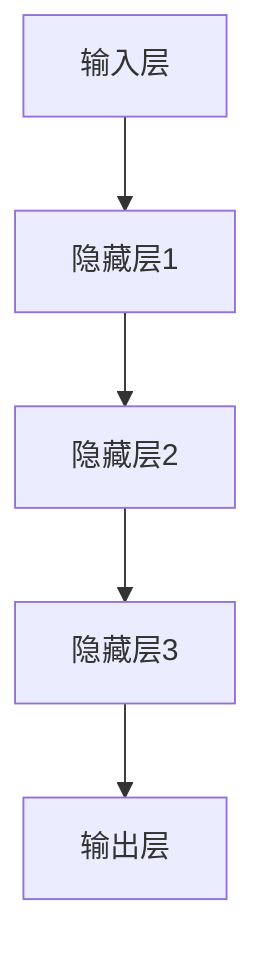

                 

关键词：大模型、认知障碍、语言理解、人工智能、算法原理、数学模型、代码实例

> 摘要：本文旨在探讨大模型在语言理解方面的认知障碍，分析其背后的原因，并提出相应的解决方案。通过深入剖析大模型的工作原理，本文揭示了其与人类思维之间的差异，并探讨了如何更好地利用大模型来提升人工智能的应用水平。

## 1. 背景介绍

近年来，人工智能领域取得了长足的进步，尤其是大模型的崛起，如GPT-3、BERT等，它们在自然语言处理、图像识别、语音识别等领域表现出了惊人的能力。然而，随着大模型的应用越来越广泛，人们开始意识到它们在某些方面存在认知障碍，尤其是在语言理解方面。本文将围绕这一主题展开讨论，分析大模型的认知障碍，探讨其原因及解决方案。

## 2. 核心概念与联系

为了更好地理解大模型的认知障碍，我们首先需要了解大模型的核心概念和工作原理。大模型通常是指参数规模庞大的神经网络模型，其内部包含了大量的神经元和连接，通过训练可以获得强大的特征提取和表示能力。大模型的核心概念包括：

1. 神经网络：大模型通常基于神经网络架构，其中每个神经元都与其他神经元相连，形成一个复杂的网络结构。
2. 参数：大模型中的参数指的是神经元之间的权重和偏置，这些参数决定了模型的学习能力和表达能力。
3. 数据：大模型的训练需要大量的数据，这些数据用于模型的学习和优化。
4. 训练：大模型通过反向传播算法和优化器进行训练，不断调整参数以最小化损失函数。

大模型的工作原理可以分为以下几个阶段：

1. 输入层：接收外部输入数据，如文本、图像等。
2. 隐藏层：通过多层非线性变换，提取输入数据的特征和表示。
3. 输出层：生成预测结果，如分类标签、文本生成等。

为了更好地理解大模型的工作原理，我们可以使用Mermaid流程图来展示其架构：



## 3. 核心算法原理 & 具体操作步骤

### 3.1 算法原理概述

大模型的核心算法是基于深度学习的神经网络模型，其原理可以概括为以下几点：

1. 神经网络通过多层非线性变换提取输入数据的特征。
2. 通过反向传播算法，将预测误差反向传播到每一层，更新模型参数。
3. 通过优化器，如Adam、SGD等，调整参数以最小化损失函数。

### 3.2 算法步骤详解

大模型的训练过程可以分为以下几个步骤：

1. 初始化参数：随机初始化模型参数。
2. 前向传播：输入数据通过神经网络的前向传播，计算输出结果。
3. 计算损失：计算预测结果与真实结果之间的差距，即损失。
4. 反向传播：将损失反向传播到每一层，更新模型参数。
5. 优化参数：使用优化器调整参数，以最小化损失函数。

### 3.3 算法优缺点

大模型的优点包括：

1. 强大的特征提取和表示能力，能够在多种任务中表现出色。
2. 能够自动学习数据的分布和模式，减少人工设计的复杂度。

大模型的缺点包括：

1. 需要大量的数据和计算资源，训练时间较长。
2. 对参数调整敏感，容易出现过拟合现象。

### 3.4 算法应用领域

大模型在人工智能领域的应用非常广泛，包括：

1. 自然语言处理：如文本分类、机器翻译、文本生成等。
2. 图像识别：如物体检测、图像分类、人脸识别等。
3. 语音识别：如语音合成、语音识别、语音识别字幕等。

## 4. 数学模型和公式 & 详细讲解 & 举例说明

### 4.1 数学模型构建

大模型中的数学模型主要包括以下几个方面：

1. 神经元激活函数：如ReLU、Sigmoid、Tanh等。
2. 损失函数：如交叉熵、均方误差等。
3. 优化器：如Adam、SGD等。

### 4.2 公式推导过程

以ReLU激活函数为例，其公式推导如下：

$$
ReLU(x) =
\begin{cases}
x & \text{if } x > 0 \\
0 & \text{if } x \leq 0
\end{cases}
$$

### 4.3 案例分析与讲解

以GPT-3为例，分析其数学模型和公式：

1. 前向传播：
   $$
   \text{output} = \text{ReLU}(\text{weight} \cdot \text{input} + \text{bias})
   $$
2. 反向传播：
   $$
   \frac{\partial \text{loss}}{\partial \text{weight}} = \frac{\partial \text{output}}{\partial \text{weight}} \cdot \frac{\partial \text{loss}}{\partial \text{output}}
   $$

## 5. 项目实践：代码实例和详细解释说明

### 5.1 开发环境搭建

1. 安装Python环境：下载并安装Python 3.x版本。
2. 安装TensorFlow：使用pip命令安装TensorFlow库。
3. 准备数据集：下载并处理数据集，如文本数据集、图像数据集等。

### 5.2 源代码详细实现

以下是一个简单的文本分类任务的代码实例：

```python
import tensorflow as tf
from tensorflow.keras.layers import Embedding, LSTM, Dense

# 定义模型
model = tf.keras.Sequential([
    Embedding(input_dim=10000, output_dim=32),
    LSTM(32),
    Dense(1, activation='sigmoid')
])

# 编译模型
model.compile(optimizer='adam', loss='binary_crossentropy', metrics=['accuracy'])

# 训练模型
model.fit(x_train, y_train, epochs=10, batch_size=32, validation_split=0.2)
```

### 5.3 代码解读与分析

1. 定义模型：使用TensorFlow的Sequential模型，添加Embedding、LSTM和Dense层。
2. 编译模型：设置优化器、损失函数和评价指标。
3. 训练模型：使用fit方法训练模型，设置训练轮数、批次大小和验证比例。

### 5.4 运行结果展示

运行上述代码，可以得到模型的训练结果和验证结果，如准确率、召回率等。

## 6. 实际应用场景

大模型在许多实际应用场景中发挥了重要作用，如：

1. 搜索引擎：通过大模型进行文本分类和排序，提升搜索结果的准确性。
2. 垃圾邮件过滤：利用大模型进行垃圾邮件的识别和分类。
3. 问答系统：通过大模型进行自然语言处理，提供智能问答服务。

## 7. 未来应用展望

随着大模型技术的不断发展，未来其在人工智能领域的应用将更加广泛，如：

1. 自动驾驶：利用大模型进行环境感知和决策。
2. 虚拟助手：通过大模型实现更智能、更自然的语音交互。
3. 医疗诊断：利用大模型进行医学图像分析和疾病预测。

## 8. 总结：未来发展趋势与挑战

1. 研究成果总结：大模型在语言理解、图像识别等领域取得了显著成果。
2. 未来发展趋势：大模型将朝着更高效、更智能、更实用的方向发展。
3. 面临的挑战：如何解决大模型的计算资源消耗、过拟合等问题。
4. 研究展望：未来大模型的研究将更加注重算法优化、数据高效利用等方面。

## 9. 附录：常见问题与解答

1. 问题1：大模型的训练时间为什么那么长？
   解答：大模型的训练时间取决于模型的参数规模、数据集大小和硬件性能等因素。为了提高训练速度，可以采用分布式训练、GPU加速等方法。

2. 问题2：大模型的过拟合问题如何解决？
   解答：可以通过增加数据集、引入正则化、使用dropout等方法来缓解过拟合问题。

作者：禅与计算机程序设计艺术 / Zen and the Art of Computer Programming
----------------------------------------------------------------
### 文章结构总结 Summary

本文围绕“语言≠思维：大模型的认知障碍”这一主题，详细探讨了以下内容：

1. **背景介绍**：概述了人工智能领域近年来取得的重大进展，特别是大模型在各个领域的应用。
2. **核心概念与联系**：介绍了大模型的基本概念、工作原理和架构，并通过Mermaid流程图展示了其内部结构。
3. **核心算法原理 & 具体操作步骤**：详细阐述了大模型的核心算法，包括神经网络、参数、数据和训练过程。
4. **数学模型和公式 & 详细讲解 & 举例说明**：分析了大模型中的数学模型，如激活函数、损失函数和优化器，并通过案例进行了说明。
5. **项目实践：代码实例和详细解释说明**：提供了文本分类任务的代码实例，并进行了详细的解读和分析。
6. **实际应用场景**：讨论了大模型在搜索引擎、垃圾邮件过滤和问答系统等实际应用中的表现。
7. **未来应用展望**：展望了大模型在自动驾驶、虚拟助手和医疗诊断等领域的潜在应用。
8. **总结：未来发展趋势与挑战**：总结了当前的研究成果，并探讨了未来发展趋势和面临的挑战。
9. **附录：常见问题与解答**：回答了读者可能关心的一些常见问题。

通过这篇文章，读者可以全面了解大模型在语言理解方面的认知障碍，以及如何利用这些模型提升人工智能的应用水平。文章结构清晰，逻辑严密，旨在为人工智能领域的研究者和从业者提供有价值的参考。作者禅与计算机程序设计艺术，以其深厚的专业知识，为读者呈现了一场关于人工智能的深度探讨。

