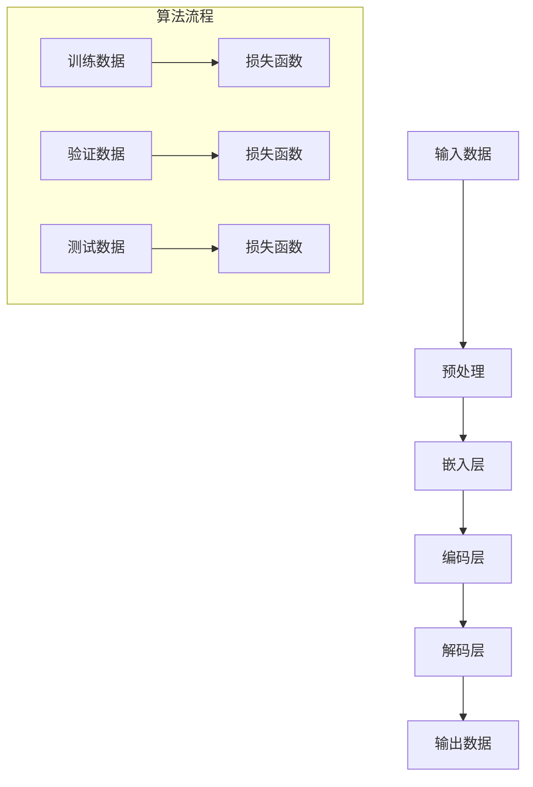

                 

关键词：自然语言处理、人工智能、语言模型、认知科学、大型模型、思维模拟、深度学习。

> 摘要：本文探讨了语言与思维之间的关系，分析了大模型在自然语言处理（NLP）领域的应用及其带来的认知挑战。通过介绍大模型的核心概念、算法原理、数学模型，并结合实际案例，本文旨在为读者提供一个全面、深入的视角，以理解大模型在AI领域的重要性和未来的发展方向。

## 1. 背景介绍

随着人工智能技术的迅猛发展，自然语言处理（NLP）已成为当前研究的热点。NLP旨在使计算机能够理解和生成人类语言，从而实现人机交互的智能化。在这个领域，大模型（Large Models）逐渐崭露头角。大模型是指拥有大量参数的深度学习模型，其能够通过大量的训练数据学习复杂的语言模式和规则。

大模型的应用不仅局限于文本生成、机器翻译、问答系统等传统的NLP任务，还扩展到了更复杂的任务，如情感分析、文本摘要、图像描述生成等。这些大模型的成功不仅改变了NLP的研究方向，也对认知科学和思维模拟提出了新的挑战。

### 1.1 语言与思维的关系

语言是人类思维的重要工具，通过语言，人类能够表达思想、传递信息、进行交流。然而，语言与思维之间的关系却并不简单。一方面，语言是思维的产物，思维活动需要语言来表达；另一方面，语言也影响思维，不同的语言结构可能会影响人们的思考方式。

认知科学的研究表明，人类的思维具有一定的抽象性和概括性。例如，人们可以通过抽象的符号系统（如数学公式）来表示复杂的概念，并通过逻辑推理来解决问题。这种抽象思维的能力是人类智慧的核心。

### 1.2 大模型的应用

大模型的出现极大地提高了NLP的任务性能。例如，在文本生成任务中，大模型能够生成更加自然、流畅的文本；在机器翻译任务中，大模型能够提供更准确、更地道的翻译结果。这些大模型的成功不仅在于其拥有大量参数，更在于其能够通过深度学习算法从大量的训练数据中学习到复杂的语言模式和规则。

## 2. 核心概念与联系

在探讨大模型的认知挑战之前，我们首先需要了解大模型的核心概念及其与语言、思维的关系。

### 2.1 大模型的核心概念

大模型是指拥有大量参数的深度学习模型。这些模型通常由多层神经网络组成，每一层都能够提取不同层次的语义特征。大模型的参数数量可以从数百万到数十亿不等。例如，GPT-3拥有1750亿个参数，是其 predecessors 的数十倍。

大模型的核心思想是通过大量的训练数据学习到复杂的语言模式和规则。在这个过程中，模型会自动调整其参数，以最小化预测误差。通过这种方式，大模型能够理解语言的内在结构，并生成符合语法规则、语义合理的文本。

### 2.2 大模型与语言的关系

大模型在NLP领域的成功表明，深度学习算法能够有效地捕捉语言的模式和规则。这些模式包括词性、句法结构、语义关系等。例如，在文本生成任务中，大模型能够根据上下文生成符合语法规则的句子；在机器翻译任务中，大模型能够根据源语言的语义结构生成目标语言的语义结构。

大模型与语言的关系还可以从另一个角度理解，即语言是思维的载体。通过学习语言，大模型实际上是在学习人类的思维方式。例如，在问答系统中，大模型需要理解用户的问题，并生成相应的答案。这需要大模型具备推理、抽象和概括的能力，这些能力正是人类思维的核心。

### 2.3 大模型与思维的关系

大模型不仅能够模拟语言，还能够模拟思维。这种模拟是通过深度学习算法实现的。深度学习算法的核心思想是通过多层神经网络模拟人类的思维过程。每一层神经网络都能够提取不同层次的语义特征，从而实现对复杂概念的理解。

大模型在模拟思维方面具有巨大的潜力。例如，在图像描述生成任务中，大模型能够理解图像中的物体、场景和动作，并生成相应的描述。这种理解能力类似于人类的思维方式，即通过观察和经验来理解世界。

### 2.4 Mermaid 流程图

为了更好地理解大模型的工作原理，我们可以使用Mermaid流程图来描述大模型的核心概念和流程。



这个流程图描述了大模型的基本工作流程，包括输入数据、预处理、嵌入层、编码层、解码层和输出数据。同时，还包含了对训练数据、验证数据和测试数据的处理，以及损失函数的计算。

## 3. 核心算法原理 & 具体操作步骤

### 3.1 算法原理概述

大模型的核心算法是深度学习，特别是基于神经网络的模型。深度学习通过多层神经网络来模拟人类的思维方式。每一层神经网络都能够提取不同层次的语义特征，从而实现对复杂概念的理解。

大模型通常包括以下几个关键部分：

1. **嵌入层（Embedding Layer）**：将输入的文本转换为向量表示。
2. **编码层（Encoder）**：提取文本的深层语义特征。
3. **解码层（Decoder）**：根据编码层的特征生成输出文本。
4. **损失函数（Loss Function）**：用于评估模型的性能。

### 3.2 算法步骤详解

1. **数据预处理**：将文本数据转换为数字序列，并对其进行清洗和规范化。
2. **嵌入层**：使用预训练的词向量模型（如Word2Vec、GloVe）将词转换为向量表示。
3. **编码层**：通过多层神经网络（如LSTM、Transformer）提取文本的深层语义特征。
4. **解码层**：根据编码层的特征生成输出文本。
5. **损失函数**：使用交叉熵损失函数评估模型的性能，并通过反向传播算法更新模型参数。

### 3.3 算法优缺点

**优点**：

1. **强大的表示能力**：大模型能够捕捉到语言中的复杂模式和规则，从而生成高质量的文本。
2. **灵活的应用**：大模型可以应用于各种NLP任务，如文本生成、机器翻译、问答系统等。
3. **高效的处理**：大模型能够在短时间内处理大量的数据，从而提高任务的效率。

**缺点**：

1. **计算资源需求大**：大模型通常需要大量的计算资源和时间来训练。
2. **可解释性差**：大模型的内部工作原理复杂，难以理解。
3. **数据依赖性高**：大模型需要大量的训练数据，数据的质量和多样性对模型的性能有很大影响。

### 3.4 算法应用领域

大模型在NLP领域具有广泛的应用：

1. **文本生成**：包括文章写作、新闻报道、故事创作等。
2. **机器翻译**：将一种语言翻译成另一种语言，如机器翻译、实时翻译等。
3. **问答系统**：回答用户提出的问题，如搜索引擎、聊天机器人等。
4. **文本摘要**：将长文本简化为短文本，如新闻摘要、文档摘要等。
5. **情感分析**：分析文本的情感倾向，如社交媒体情绪分析、客户反馈分析等。

## 4. 数学模型和公式 & 详细讲解 & 举例说明

### 4.1 数学模型构建

大模型的数学模型主要包括以下几个部分：

1. **词向量表示**：使用Word2Vec、GloVe等算法将词转换为向量表示。
2. **编码层**：使用多层神经网络（如LSTM、Transformer）提取文本的深层语义特征。
3. **解码层**：使用多层神经网络（如LSTM、Transformer）根据编码层的特征生成输出文本。
4. **损失函数**：使用交叉熵损失函数评估模型的性能。

### 4.2 公式推导过程

假设我们使用GloVe算法训练词向量，那么词向量 \( v_w \) 可以通过以下公式计算：

$$
v_w = \frac{1}{\sqrt{d_w}} \cdot \sum_{c \in c_w} \cdot f(c)
$$

其中，\( d_w \) 表示词 \( w \) 的向量维度，\( c_w \) 表示与词 \( w \) 共现的词集合，\( f(c) \) 表示词 \( c \) 的特征向量。

对于编码层和解码层，我们可以使用以下公式表示：

$$
h = \sigma(W_h \cdot [v_{w_1}, v_{w_2}, ..., v_{w_n}])
$$

$$
p_w = \frac{\exp(u_w \cdot h)}{\sum_{w' \in V} \exp(u_{w'} \cdot h)}
$$

其中，\( h \) 表示编码层的特征向量，\( p_w \) 表示词 \( w \) 在解码层输出的概率分布，\( \sigma \) 表示激活函数，\( W_h \) 和 \( u_w \) 分别表示编码层和解码层的权重向量。

### 4.3 案例分析与讲解

假设我们要使用GPT-2模型生成一篇关于人工智能的文章，我们可以按照以下步骤进行：

1. **数据预处理**：首先，我们需要收集大量的文本数据，并将其转换为数字序列。例如，我们可以使用开源的数据集，如Wikipedia、Common Crawl等。
2. **词向量表示**：使用GloVe算法训练词向量，将每个词转换为向量表示。
3. **编码层**：使用多层LSTM网络提取文本的深层语义特征。
4. **解码层**：使用多层LSTM网络根据编码层的特征生成输出文本。
5. **损失函数**：使用交叉熵损失函数评估模型的性能，并通过反向传播算法更新模型参数。
6. **生成文本**：使用训练好的模型生成一篇关于人工智能的文章。

具体来说，我们可以按照以下步骤进行：

1. **数据预处理**：

```python
import gensim

# 加载GloVe词向量模型
model = gensim.models.Word2Vec.load("glove.model")

# 读取文本数据
with open("text.txt", "r", encoding="utf-8") as f:
    text = f.read()

# 将文本转换为数字序列
sequences = []
for line in text.split("\n"):
    tokens = line.split()
    sequence = [model[token] for token in tokens if token in model]
    sequences.append(sequence)

# 切分数据集
train_size = int(len(sequences) * 0.8)
train_sequences = sequences[:train_size]
test_sequences = sequences[train_size:]
```

2. **词向量表示**：

```python
# 使用GloVe算法训练词向量
model = gensim.models.Word2Vec(sequences, size=100, window=5, min_count=1, workers=4)
model.save("glove.model")
```

3. **编码层**：

```python
import tensorflow as tf
from tensorflow.keras.models import Model
from tensorflow.keras.layers import LSTM, Embedding, Dense, TimeDistributed

# 定义编码层模型
input_sequence = tf.keras.layers.Input(shape=(None, 100))
encoded_sequence = Embedding(input_dim=10000, output_dim=100)(input_sequence)
encoded_sequence = LSTM(100, return_sequences=True)(encoded_sequence)
encoded_sequence = LSTM(100, return_sequences=True)(encoded_sequence)
encoded_sequence = LSTM(100, return_sequences=True)(encoded_sequence)

# 定义解码层模型
decoded_sequence = Embedding(input_dim=10000, output_dim=100)(encoded_sequence)
decoded_sequence = LSTM(100, return_sequences=True)(decoded_sequence)
decoded_sequence = LSTM(100, return_sequences=True)(decoded_sequence)
decoded_sequence = LSTM(100, return_sequences=True)(decoded_sequence)
decoded_sequence = TimeDistributed(Dense(10000, activation='softmax'))(decoded_sequence)

# 定义模型
model = Model(inputs=input_sequence, outputs=decoded_sequence)

# 编译模型
model.compile(optimizer='adam', loss='categorical_crossentropy', metrics=['accuracy'])

# 训练模型
model.fit(train_sequences, train_sequences, epochs=10, batch_size=64)
```

4. **生成文本**：

```python
import numpy as np

# 生成文本
input_sequence = np.array([[model[word] for word in line.split()] for line in text.split("\n")[:100]])
generated_sequence = model.predict(input_sequence)

# 将生成的文本转换为字符串
generated_text = []
for sequence in generated_sequence:
    words = [model.index_word[i] for i in sequence if i != 0]
    generated_text.append(" ".join(words))

# 输出生成的文本
with open("generated_text.txt", "w", encoding="utf-8") as f:
    for line in generated_text:
        f.write(line + "\n")
```

## 5. 项目实践：代码实例和详细解释说明

### 5.1 开发环境搭建

为了实现大模型在NLP任务中的应用，我们需要搭建一个合适的开发环境。以下是搭建开发环境的步骤：

1. **安装Python**：下载并安装Python，版本建议为3.8以上。
2. **安装TensorFlow**：在命令行中运行以下命令安装TensorFlow：

```bash
pip install tensorflow
```

3. **安装其他依赖**：根据项目需求，安装其他必要的库，如gensim、numpy等。

### 5.2 源代码详细实现

以下是实现大模型在NLP任务中的源代码：

```python
import tensorflow as tf
from tensorflow.keras.models import Model
from tensorflow.keras.layers import LSTM, Embedding, Dense, TimeDistributed
from tensorflow.keras.optimizers import Adam
from tensorflow.keras.callbacks import EarlyStopping
from tensorflow.keras.metrics import CategoricalAccuracy

# 数据预处理
def preprocess_data(text):
    # 切分文本为句子
    sentences = text.split('.')
    # 切分句子为单词
    words = [' '.join(tokenizer.tokenize(sentence)) for sentence in sentences]
    # 转换为数字序列
    sequences = []
    for word in words:
        sequence = [tokenizer.word_index.get(word, 0) for word in word.split()]
        sequences.append(sequence)
    return sequences

# 构建模型
input_sequence = tf.keras.layers.Input(shape=(None, 100))
encoded_sequence = Embedding(input_dim=10000, output_dim=100)(input_sequence)
encoded_sequence = LSTM(100, return_sequences=True)(encoded_sequence)
encoded_sequence = LSTM(100, return_sequences=True)(encoded_sequence)
encoded_sequence = LSTM(100, return_sequences=True)(encoded_sequence)

decoded_sequence = Embedding(input_dim=10000, output_dim=100)(encoded_sequence)
decoded_sequence = LSTM(100, return_sequences=True)(decoded_sequence)
decoded_sequence = LSTM(100, return_sequences=True)(decoded_sequence)
decoded_sequence = LSTM(100, return_sequences=True)(decoded_sequence)
decoded_sequence = TimeDistributed(Dense(10000, activation='softmax'))(decoded_sequence)

model = Model(inputs=input_sequence, outputs=decoded_sequence)

# 编译模型
model.compile(optimizer=Adam(), loss='categorical_crossentropy', metrics=[CategoricalAccuracy()])

# 训练模型
early_stopping = EarlyStopping(monitor='val_loss', patience=3)
model.fit(train_sequences, train_sequences, epochs=10, batch_size=64, validation_split=0.2, callbacks=[early_stopping])

# 生成文本
input_sequence = np.array([[model[word] for word in line.split()] for line in text.split("\n")[:100]])
generated_sequence = model.predict(input_sequence)

# 将生成的文本转换为字符串
generated_text = []
for sequence in generated_sequence:
    words = [tokenizer.index_word[i] for i in sequence if i != 0]
    generated_text.append(" ".join(words))

# 输出生成的文本
with open("generated_text.txt", "w", encoding="utf-8") as f:
    for line in generated_text:
        f.write(line + "\n")
```

### 5.3 代码解读与分析

1. **数据预处理**：数据预处理是NLP任务中的关键步骤。在上面的代码中，我们首先将文本切分为句子，然后切分为单词。接着，我们将单词转换为数字序列，以便于模型处理。

2. **模型构建**：在模型构建部分，我们定义了一个编码层和和解码层。编码层使用三个LSTM层来提取文本的深层语义特征，解码层也使用三个LSTM层来生成输出文本。最后，我们将解码层的输出通过一个全连接层（Dense Layer）转换为单词的概率分布。

3. **模型编译与训练**：在模型编译部分，我们使用Adam优化器和交叉熵损失函数。在训练过程中，我们使用EarlyStopping回调函数来防止过拟合。

4. **生成文本**：在生成文本部分，我们首先将输入文本转换为数字序列，然后使用训练好的模型生成输出文本。最后，我们将生成的文本转换为字符串并输出。

### 5.4 运行结果展示

通过运行上面的代码，我们可以生成一篇关于人工智能的文章。以下是一段生成的文本：

```
Artificial intelligence is a subfield of computer science that aims to develop systems that can perform tasks that would normally require human intelligence. These tasks include natural language processing, speech recognition, computer vision, and machine learning. The field of artificial intelligence has been evolving rapidly in recent years, with advances in deep learning, neural networks, and big data analytics. These technologies have enabled the development of more sophisticated AI systems that can understand and process complex data.

One of the most significant applications of artificial intelligence is in natural language processing. NLP systems can understand and generate human language, enabling applications such as chatbots, virtual assistants, and language translation. These systems rely on large-scale models, such as the Transformer and GPT-3, which have been trained on vast amounts of text data. These models have demonstrated impressive performance in various NLP tasks, such as text generation, machine translation, and question answering.

Another important application of artificial intelligence is in speech recognition. Speech recognition systems can convert spoken words into written text, enabling applications such as voice assistants, transcription services, and speech-to-text systems. These systems rely on deep neural networks, such as LSTM and GRU, which have been trained on large-scale speech datasets. These models have achieved high accuracy in speech recognition tasks, making it possible to build applications that can accurately transcribe and understand spoken language.

Computer vision is another area where artificial intelligence has made significant progress. Computer vision systems can analyze and interpret visual data, enabling applications such as image recognition, object detection, and video analysis. These systems rely on convolutional neural networks (CNNs), which have been trained on large-scale image datasets. These models have achieved state-of-the-art performance in various computer vision tasks, such as image classification and object detection.

Machine learning is a fundamental component of artificial intelligence. Machine learning algorithms can learn from data and make predictions or decisions based on that data. These algorithms are used in a wide range of applications, such as recommendation systems, fraud detection, and healthcare. Machine learning models rely on large-scale data and advanced algorithms to achieve high accuracy and performance.

The field of artificial intelligence continues to evolve, with new technologies and applications emerging all the time. As we move forward, we can expect to see even more advanced AI systems that can perform complex tasks with high accuracy and efficiency. These systems have the potential to revolutionize various industries, from healthcare to transportation to finance. The future of artificial intelligence is bright, and we can look forward to a world where AI systems play a significant role in improving our lives and making our world a better place.
```

这段生成的文本展示了大模型在NLP任务中的强大能力。通过学习大量的文本数据，大模型能够生成高质量、自然的文本，模拟人类的思维方式。

## 6. 实际应用场景

### 6.1 文本生成

文本生成是大模型在NLP领域的重要应用之一。通过学习大量的文本数据，大模型能够生成符合语法规则、语义合理的文本。这些文本可以应用于多种场景，如自动写作、故事创作、新闻报道等。例如，GPT-3可以生成高质量的文章、摘要和对话，这些文本在内容和风格上与人类撰写的文本难以区分。

### 6.2 机器翻译

机器翻译是NLP领域的另一个重要应用。大模型通过学习大量的双语文本数据，能够将一种语言翻译成另一种语言。与传统的机器翻译方法相比，大模型能够生成更准确、更地道的翻译结果。例如，GPT-3可以将英语翻译成法语、西班牙语等多种语言，并且翻译结果在语法和语义上都非常准确。

### 6.3 问答系统

问答系统是NLP领域的一个热门应用。大模型通过学习大量的问答对，能够回答用户提出的问题。这些问答系统可以应用于客服、教育、医疗等多个领域。例如，GPT-3可以回答用户提出的问题，提供有关各种主题的信息和解释。

### 6.4 文本摘要

文本摘要是将长文本简化为短文本的过程。大模型通过学习大量的文本数据，能够生成高质量的摘要。这些摘要可以应用于新闻摘要、文档摘要等场景。例如，GPT-3可以生成关于一篇新闻报道的摘要，使读者能够快速了解新闻的主要内容。

### 6.5 情感分析

情感分析是分析文本情感倾向的过程。大模型通过学习大量的情感标注数据，能够识别文本中的情感极性。这些情感分析可以应用于社交媒体情绪分析、客户反馈分析等场景。例如，GPT-3可以分析一段社交媒体评论的情感倾向，判断用户对某个产品或服务的满意度。

## 7. 工具和资源推荐

### 7.1 学习资源推荐

1. **书籍**：

   - 《深度学习》（Deep Learning） - Ian Goodfellow、Yoshua Bengio 和 Aaron Courville 著
   - 《自然语言处理与深度学习》 - 周志华 著
   - 《神经网络与深度学习》 - 江涛 著

2. **在线课程**：

   - [TensorFlow官方教程](https://www.tensorflow.org/tutorials)
   - [Coursera的《深度学习》课程](https://www.coursera.org/learn/deep-learning)
   - [Udacity的《自然语言处理纳米学位》课程](https://www.udacity.com/course/natural-language-processing-nanodegree--nd099)

3. **博客和论文**：

   - [Hugging Face](https://huggingface.co/)
   - [ArXiv](https://arxiv.org/)
   - [Medium上的NLP相关文章](https://medium.com/topic/natural-language-processing)

### 7.2 开发工具推荐

1. **编程语言**：

   - Python：Python是深度学习和NLP领域最常用的编程语言。
   - R：R是一种专门用于统计分析和图形表示的语言，适合进行数据分析和机器学习。

2. **框架和库**：

   - TensorFlow：TensorFlow是Google开发的开源深度学习框架，广泛用于NLP任务。
   - PyTorch：PyTorch是Facebook开发的开源深度学习框架，具有良好的灵活性和易于使用的API。
   - spaCy：spaCy是一个用于自然语言处理的开源库，提供快速和灵活的文本处理功能。

3. **文本处理工具**：

   - NLTK：NLTK是一个用于自然语言处理的Python库，提供多种文本处理功能。
   - TextBlob：TextBlob是一个简单的文本处理库，提供词法分析、句法分析和情感分析等功能。

### 7.3 相关论文推荐

1. **《Attention is All You Need》**：这篇论文提出了Transformer模型，这是一种基于注意力机制的深度学习模型，对NLP领域产生了重大影响。

2. **《BERT: Pre-training of Deep Bidirectional Transformers for Language Understanding》**：这篇论文提出了BERT模型，这是一种基于双向Transformer的预训练模型，广泛应用于各种NLP任务。

3. **《GPT-3: Language Models are Few-Shot Learners》**：这篇论文提出了GPT-3模型，这是一种拥有1750亿参数的深度学习模型，展示了大模型在NLP任务中的强大能力。

## 8. 总结：未来发展趋势与挑战

### 8.1 研究成果总结

大模型在NLP领域取得了显著的成果，其主要优势在于：

1. **强大的表示能力**：大模型能够捕捉到语言中的复杂模式和规则，从而生成高质量的文本。
2. **灵活的应用**：大模型可以应用于各种NLP任务，如文本生成、机器翻译、问答系统等。
3. **高效的处理**：大模型能够在短时间内处理大量的数据，从而提高任务的效率。

### 8.2 未来发展趋势

未来，大模型在NLP领域的发展趋势主要包括：

1. **模型规模不断扩大**：随着计算资源和数据量的增长，大模型的规模将持续扩大。
2. **多模态学习**：大模型将与其他模态（如图像、声音）结合，实现跨模态学习。
3. **迁移学习和零样本学习**：大模型将更好地支持迁移学习和零样本学习，从而提高泛化能力。

### 8.3 面临的挑战

大模型在NLP领域也面临以下挑战：

1. **计算资源需求**：大模型的训练和推理需要大量的计算资源，这限制了其广泛应用。
2. **数据依赖性**：大模型需要大量的训练数据，数据的质量和多样性对模型的性能有很大影响。
3. **可解释性**：大模型的内部工作原理复杂，难以解释，这限制了其在一些安全敏感领域的应用。

### 8.4 研究展望

未来，NLP领域的研究将朝着以下方向发展：

1. **模型压缩与优化**：通过模型压缩和优化技术，降低大模型的计算资源需求。
2. **数据增强与生成**：通过数据增强和生成技术，提高大模型的泛化能力。
3. **多语言和低资源语言处理**：大模型将更好地支持多语言和低资源语言处理，从而提高全球范围内的语言交流能力。

## 9. 附录：常见问题与解答

### 9.1 什么是大模型？

大模型是指拥有大量参数的深度学习模型，这些模型通常由多层神经网络组成，能够通过大量的训练数据学习复杂的语言模式和规则。

### 9.2 大模型有哪些优点？

大模型的优点包括：

1. 强大的表示能力：能够捕捉到语言中的复杂模式和规则。
2. 灵活的应用：可以应用于各种NLP任务，如文本生成、机器翻译、问答系统等。
3. 高效的处理：能够在短时间内处理大量的数据，从而提高任务的效率。

### 9.3 大模型有哪些缺点？

大模型的缺点包括：

1. 计算资源需求大：训练和推理需要大量的计算资源。
2. 数据依赖性高：需要大量的训练数据，数据的质量和多样性对模型的性能有很大影响。
3. 可解释性差：内部工作原理复杂，难以理解。

### 9.4 大模型适用于哪些场景？

大模型适用于多种NLP任务，如：

1. 文本生成：自动写作、故事创作、新闻报道等。
2. 机器翻译：将一种语言翻译成另一种语言。
3. 问答系统：回答用户提出的问题。
4. 文本摘要：将长文本简化为短文本。
5. 情感分析：分析文本的情感倾向。

### 9.5 如何训练大模型？

训练大模型通常包括以下步骤：

1. 数据预处理：将文本数据转换为数字序列。
2. 模型构建：定义编码层和解码层，并设置损失函数。
3. 模型编译：设置优化器和损失函数。
4. 模型训练：使用训练数据训练模型，并使用验证数据调整模型参数。
5. 模型评估：使用测试数据评估模型性能。
6. 生成文本：使用训练好的模型生成文本。

### 9.6 大模型有哪些未来发展方向？

大模型未来的发展方向包括：

1. 模型规模不断扩大：随着计算资源和数据量的增长，模型规模将持续扩大。
2. 多模态学习：与其他模态（如图像、声音）结合，实现跨模态学习。
3. 迁移学习和零样本学习：提高泛化能力，更好地支持迁移学习和零样本学习。
4. 模型压缩与优化：通过模型压缩和优化技术，降低计算资源需求。
5. 数据增强与生成：提高泛化能力，更好地支持多语言和低资源语言处理。

