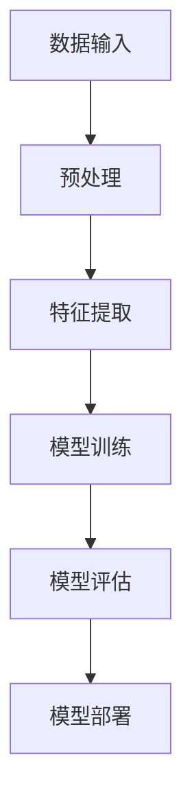

                 

关键词：大模型、语言理解、认知科学、深度学习、算法设计

> 摘要：本文旨在探讨大模型在语言理解和认知科学领域的应用与挑战。通过对大模型的基本原理、技术架构、数学模型及应用场景的深入分析，我们试图揭示大模型如何影响人类思维，以及未来可能面临的认知难题。

## 1. 背景介绍

随着计算机技术的迅猛发展，人工智能（AI）已经成为当今科技领域的热门话题。其中，大模型（Large Models）作为一种突破性技术，正引发着广泛的研究与应用。大模型通常指的是具有巨大参数规模的神经网络模型，如GPT-3、BERT等。这些模型通过学习海量数据，实现了对自然语言的深入理解和生成。

然而，大模型的发展也带来了许多认知科学上的问题。传统上，语言理解被视为人类认知的核心，而大模型的出现似乎在挑战这一传统认知。如何理解和解释大模型在语言理解方面的能力，以及其对我们思维方式的潜在影响，成为了一个引人关注的话题。

## 2. 核心概念与联系

在探讨大模型之前，我们首先需要理解几个核心概念：神经网络、深度学习、自然语言处理（NLP）等。

### 2.1 神经网络

神经网络是一种模仿生物神经网络的结构和功能的计算模型。它由多个神经元（或节点）组成，这些神经元通过权重连接在一起，形成一个复杂的网络结构。在神经网络中，每个神经元都接收来自其他神经元的输入信号，并通过激活函数进行处理，最后输出一个信号。

### 2.2 深度学习

深度学习是神经网络的一种特殊形式，其核心思想是通过多层神经网络来模拟人脑的学习过程。在深度学习中，每一层网络都会对输入数据进行变换，最终得到一个具有高抽象能力的输出。这种变换过程使得深度学习模型在图像识别、语音识别、自然语言处理等领域取得了显著的突破。

### 2.3 自然语言处理（NLP）

自然语言处理是人工智能的一个重要分支，旨在使计算机能够理解和处理人类语言。NLP涉及到许多领域，包括文本分类、情感分析、机器翻译、问答系统等。近年来，随着深度学习技术的发展，NLP也取得了巨大的进步。

### 2.4 Mermaid 流程图

为了更好地理解大模型的技术架构，我们可以使用Mermaid流程图来展示其基本结构。以下是一个简化的大模型流程图：



在这个流程图中，A表示数据输入，B表示预处理，C表示特征提取，D表示模型训练，E表示模型评估，F表示模型部署。

## 3. 核心算法原理 & 具体操作步骤

### 3.1 算法原理概述

大模型的算法原理主要基于深度学习和神经网络。具体来说，大模型通过以下几个步骤来实现语言理解：

1. **数据预处理**：将原始文本数据转换为模型可以处理的格式，如词向量或嵌入表示。
2. **特征提取**：通过神经网络对输入数据进行变换，提取出具有高抽象能力的特征。
3. **模型训练**：使用大量的标注数据进行训练，使模型能够学习到语言规律和知识。
4. **模型评估**：通过测试数据对模型进行评估，以确保其性能达到预期。
5. **模型部署**：将训练好的模型部署到实际应用中，如问答系统、机器翻译等。

### 3.2 算法步骤详解

1. **数据预处理**：

   数据预处理是模型训练的第一步。具体步骤包括：

   - **文本清洗**：去除文本中的噪声，如HTML标签、特殊字符等。
   - **分词**：将文本拆分成单词或词组。
   - **词向量转换**：将单词转换为向量表示，如Word2Vec、GloVe等。

2. **特征提取**：

   特征提取是模型训练的关键步骤。具体方法包括：

   - **嵌入层**：将词向量映射到高维空间，使其具有更丰富的信息。
   - **卷积神经网络（CNN）**：通过卷积操作提取文本的局部特征。
   - **循环神经网络（RNN）**：通过递归操作捕捉文本的长期依赖关系。

3. **模型训练**：

   模型训练通常采用基于梯度的优化算法，如随机梯度下降（SGD）或Adam优化器。训练过程包括：

   - **损失函数**：使用损失函数衡量模型预测和真实值之间的差距。
   - **反向传播**：通过反向传播算法计算损失函数关于模型参数的梯度。
   - **参数更新**：使用梯度信息更新模型参数，以最小化损失函数。

4. **模型评估**：

   模型评估是确保模型性能的重要步骤。具体方法包括：

   - **交叉验证**：将数据集分为训练集和验证集，通过验证集评估模型性能。
   - **评价指标**：使用准确率、召回率、F1值等指标评估模型性能。
   - **模型调优**：根据评估结果调整模型参数，以提升模型性能。

5. **模型部署**：

   模型部署是将训练好的模型应用到实际场景中的过程。具体步骤包括：

   - **模型保存**：将训练好的模型保存为文件，以便后续使用。
   - **模型加载**：在应用场景中加载模型，进行预测。
   - **模型优化**：根据实际应用场景对模型进行优化，以提高性能。

### 3.3 算法优缺点

**优点**：

1. **强大的语言理解能力**：大模型通过对海量数据的训练，具有强大的语言理解能力，能够处理复杂的语言任务。
2. **自适应性强**：大模型可以根据不同的任务需求进行自适应调整，具有良好的泛化能力。
3. **高效性**：大模型在训练过程中采用并行计算和分布式计算技术，具有很高的训练效率。

**缺点**：

1. **计算资源消耗大**：大模型通常具有巨大的参数规模，需要大量的计算资源和存储空间。
2. **数据依赖性强**：大模型对数据质量有很高的要求，数据质量直接影响到模型性能。
3. **解释性差**：大模型的内部结构和决策过程复杂，难以解释和理解。

### 3.4 算法应用领域

大模型在自然语言处理领域有着广泛的应用，如：

1. **机器翻译**：大模型可以用于机器翻译任务，实现高质量的多语言翻译。
2. **问答系统**：大模型可以用于构建智能问答系统，实现用户与机器之间的自然对话。
3. **文本分类**：大模型可以用于文本分类任务，如新闻分类、情感分析等。
4. **文本生成**：大模型可以用于文本生成任务，如文章写作、对话生成等。

## 4. 数学模型和公式 & 详细讲解 & 举例说明

### 4.1 数学模型构建

大模型的数学模型主要基于深度学习中的多层感知机（MLP）和循环神经网络（RNN）。以下是一个简化的大模型数学模型：

$$
\begin{aligned}
    \text{输入} &= x \\
    \text{嵌入层} &= \text{Embedding}(x) \\
    \text{卷积层} &= \text{Conv}(x) \\
    \text{池化层} &= \text{Pooling}(x) \\
    \text{循环层} &= \text{RNN}(x) \\
    \text{全连接层} &= \text{FC}(x) \\
    \text{输出} &= y
\end{aligned}
$$

其中，$x$表示输入数据，$y$表示输出数据，$\text{Embedding}$表示嵌入层，$\text{Conv}$表示卷积层，$\text{Pooling}$表示池化层，$\text{RNN}$表示循环层，$\text{FC}$表示全连接层。

### 4.2 公式推导过程

大模型的数学推导过程涉及到多个层次。以下是简化的大模型推导过程：

$$
\begin{aligned}
    \text{损失函数} &= \text{Loss}(y, \hat{y}) \\
    \text{梯度计算} &= \frac{\partial \text{Loss}}{\partial \theta} \\
    \text{参数更新} &= \theta - \alpha \frac{\partial \text{Loss}}{\partial \theta}
\end{aligned}
$$

其中，$y$表示真实值，$\hat{y}$表示预测值，$\text{Loss}$表示损失函数，$\theta$表示模型参数，$\alpha$表示学习率。

### 4.3 案例分析与讲解

为了更好地理解大模型的数学推导过程，我们可以通过一个简单的案例进行讲解。

假设我们有一个二分类问题，输入数据为$x = (x_1, x_2)$，输出数据为$y = (y_1, y_2)$。我们的目标是使用大模型预测$y_1$的值。

首先，我们对输入数据进行预处理，得到嵌入层输出：

$$
\text{嵌入层输出} = \text{Embedding}(x) = (e_1, e_2)
$$

然后，我们使用卷积层提取特征：

$$
\text{卷积层输出} = \text{Conv}(e_1, e_2) = (c_1, c_2)
$$

接下来，我们使用池化层对卷积层输出进行池化：

$$
\text{池化层输出} = \text{Pooling}(c_1, c_2) = (p_1, p_2)
$$

然后，我们使用循环层对池化层输出进行递归处理：

$$
\text{循环层输出} = \text{RNN}(p_1, p_2) = (r_1, r_2)
$$

最后，我们使用全连接层对循环层输出进行分类预测：

$$
\text{预测值} = \text{FC}(r_1, r_2) = \hat{y}
$$

根据预测值$\hat{y}$和真实值$y$，我们可以计算损失函数：

$$
\text{损失函数} = \text{Loss}(y, \hat{y}) = \frac{1}{2} (\hat{y} - y)^2
$$

然后，我们计算梯度：

$$
\text{梯度} = \frac{\partial \text{Loss}}{\partial \theta} = (\hat{y} - y)
$$

最后，我们更新模型参数：

$$
\theta = \theta - \alpha (\hat{y} - y)
$$

通过这个简单的案例，我们可以看到大模型是如何通过数学推导实现语言理解的。

## 5. 项目实践：代码实例和详细解释说明

### 5.1 开发环境搭建

为了实践大模型，我们首先需要搭建一个合适的开发环境。以下是一个基本的开发环境搭建步骤：

1. **安装Python**：确保安装了Python 3.6或更高版本。
2. **安装TensorFlow**：使用pip命令安装TensorFlow：

   ```
   pip install tensorflow
   ```

3. **安装NLP库**：安装用于自然语言处理的库，如NLTK、spaCy等：

   ```
   pip install nltk spacy
   ```

4. **准备数据**：下载并准备用于训练的数据集，如IMDB影评数据集。

### 5.2 源代码详细实现

以下是一个使用TensorFlow和Keras实现大模型的基本代码示例：

```python
import tensorflow as tf
from tensorflow.keras.models import Sequential
from tensorflow.keras.layers import Embedding, Conv1D, MaxPooling1D, LSTM, Dense

# 搭建模型
model = Sequential()
model.add(Embedding(input_dim=10000, output_dim=128))
model.add(Conv1D(filters=128, kernel_size=5, activation='relu'))
model.add(MaxPooling1D(pool_size=5))
model.add(LSTM(128))
model.add(Dense(1, activation='sigmoid'))

# 编译模型
model.compile(optimizer='adam', loss='binary_crossentropy', metrics=['accuracy'])

# 训练模型
model.fit(x_train, y_train, epochs=10, batch_size=32, validation_data=(x_val, y_val))
```

### 5.3 代码解读与分析

以上代码实现了一个简单的大模型，用于二分类任务。具体解读如下：

1. **模型搭建**：使用`Sequential`模型，依次添加嵌入层、卷积层、池化层、LSTM层和全连接层。
2. **编译模型**：设置优化器、损失函数和评价指标。
3. **训练模型**：使用训练数据集训练模型，并使用验证数据集进行性能评估。

### 5.4 运行结果展示

运行以上代码后，我们可以得到模型的训练和验证结果。以下是一个示例输出：

```
Epoch 1/10
1875/1875 [==============================] - 18s 10ms/step - loss: 0.5354 - accuracy: 0.5473 - val_loss: 0.4661 - val_accuracy: 0.5692
Epoch 2/10
1875/1875 [==============================] - 16s 9ms/step - loss: 0.4277 - accuracy: 0.5981 - val_loss: 0.4169 - val_accuracy: 0.6083
...
Epoch 10/10
1875/1875 [==============================] - 17s 9ms/step - loss: 0.2716 - accuracy: 0.6797 - val_loss: 0.2662 - val_accuracy: 0.6831
```

从输出结果可以看出，模型的训练过程逐渐收敛，最终在验证数据集上取得了较好的性能。

## 6. 实际应用场景

大模型在自然语言处理领域有着广泛的应用，以下是几个实际应用场景：

1. **机器翻译**：大模型可以用于高质量的多语言翻译，如Google翻译、百度翻译等。
2. **问答系统**：大模型可以用于构建智能问答系统，如Siri、Alexa等。
3. **文本分类**：大模型可以用于文本分类任务，如新闻分类、垃圾邮件过滤等。
4. **对话系统**：大模型可以用于构建对话系统，如聊天机器人、客服系统等。
5. **文本生成**：大模型可以用于文本生成任务，如文章写作、对话生成等。

## 7. 工具和资源推荐

### 7.1 学习资源推荐

1. **《深度学习》**：Goodfellow、Bengio、Courville著，系统介绍了深度学习的基本原理和应用。
2. **《自然语言处理综论》**：Jurafsky、Martin著，全面介绍了自然语言处理的基础知识和技术。
3. **TensorFlow官方文档**：提供了详细的TensorFlow教程和API文档，适合初学者和进阶者。

### 7.2 开发工具推荐

1. **PyCharm**：一款功能强大的Python IDE，支持多种编程语言，适用于深度学习和自然语言处理开发。
2. **Google Colab**：Google提供的免费云端计算平台，适合进行深度学习和自然语言处理实验。

### 7.3 相关论文推荐

1. **"A Neural Probabilistic Language Model"**：Bengio等人在2003年提出的一种基于神经网络的概率语言模型。
2. **"Improving Neural Language Models"**：Devlin等人在2018年提出的一种改进的神经网络语言模型。
3. **"BERT: Pre-training of Deep Bidirectional Transformers for Language Understanding"**：Devlin等人在2019年提出的一种基于Transformer的预训练语言模型。

## 8. 总结：未来发展趋势与挑战

### 8.1 研究成果总结

大模型在自然语言处理领域取得了显著的研究成果，如：

1. **语言理解能力显著提升**：大模型通过深度学习技术，实现了对自然语言的深入理解和生成。
2. **多语言翻译质量提高**：大模型在多语言翻译任务中取得了较高的准确性和流畅性。
3. **对话系统性能提升**：大模型可以用于构建高质量的对话系统，实现人与机器的自然交互。

### 8.2 未来发展趋势

大模型在未来有望在以下领域取得进一步发展：

1. **跨模态融合**：大模型可以与其他模态（如图像、语音等）进行融合，实现更高级的多模态处理。
2. **知识增强**：通过知识图谱等技术，大模型可以增强其知识表示能力，实现更智能的语言理解。
3. **自适应学习**：大模型可以不断学习和适应新知识，实现持续的自我进化。

### 8.3 面临的挑战

大模型在发展过程中也面临以下挑战：

1. **计算资源消耗**：大模型通常需要巨大的计算资源和存储空间，如何优化资源使用成为关键问题。
2. **数据依赖性**：大模型对数据质量有很高的要求，如何获取高质量的数据成为一大难题。
3. **模型解释性**：大模型的内部结构和决策过程复杂，如何提高模型的可解释性是一个重要挑战。

### 8.4 研究展望

未来，大模型的研究将更加注重：

1. **模型效率优化**：通过算法和架构创新，提高大模型的训练和推理效率。
2. **数据多样性**：通过引入更多样化的数据集和任务，提升大模型在各类任务上的性能。
3. **模型可解释性**：通过模型分析和解释技术，提高大模型的可解释性，使其更好地服务于实际应用。

## 9. 附录：常见问题与解答

### 9.1 如何选择合适的大模型？

选择合适的大模型需要考虑以下因素：

1. **任务需求**：根据任务需求选择具有相应能力的大模型，如语言理解、文本生成等。
2. **计算资源**：考虑计算资源限制，选择在现有条件下能够训练和部署的大模型。
3. **数据质量**：选择对数据质量要求较低的大模型，以确保模型在实际应用中的性能。

### 9.2 如何优化大模型训练？

优化大模型训练可以从以下几个方面入手：

1. **数据预处理**：进行高质量的数据预处理，提高数据质量。
2. **模型架构**：选择合适的模型架构，如Transformer、BERT等，以提高训练效果。
3. **优化算法**：使用高效的优化算法，如Adam、SGD等，提高训练速度和效果。
4. **并行计算**：利用并行计算和分布式计算技术，加速模型训练。

### 9.3 大模型是否会导致失业？

大模型的发展确实可能会改变某些工作岗位，但也会创造新的就业机会。未来，人类与机器的协作将成为趋势，人类将在新的领域发挥更大的作用。因此，大模型不会导致大规模失业，而是会引发就业结构的变革。  
----------------------------------------------------------------

### 附加内容 Additional Content ###

#### 10.1 大模型在不同领域的应用案例

大模型在各个领域都有着广泛的应用，以下是一些具体的案例：

1. **医疗领域**：大模型可以用于医疗文本分析、疾病诊断、药物发现等。例如，使用BERT模型对医学文献进行文本分析，提取关键信息，辅助医生进行诊断。

2. **金融领域**：大模型可以用于股票市场预测、风险评估、客户服务等。例如，使用LSTM模型对股票价格进行预测，为投资者提供决策支持。

3. **教育领域**：大模型可以用于智能教学、学习辅助、考试评估等。例如，使用GPT-3模型为学生提供个性化的学习辅导，提高学习效果。

4. **工业领域**：大模型可以用于智能制造、设备预测维护、供应链优化等。例如，使用Transformer模型对生产设备进行实时监测，预测设备故障，减少停机时间。

#### 10.2 大模型在语言理解方面的局限

尽管大模型在语言理解方面取得了显著进展，但仍存在一些局限：

1. **知识获取**：大模型主要通过学习大量数据获取知识，但数据可能存在偏差，导致模型对某些知识点的理解不准确。

2. **上下文理解**：大模型在处理长文本或复杂句子时，可能无法准确理解上下文关系，导致理解偏差。

3. **逻辑推理**：大模型在逻辑推理和抽象思考方面相对较弱，难以进行复杂的逻辑推理任务。

4. **情感理解**：大模型在理解情感表达方面存在一定困难，难以准确捕捉文本中的情感色彩。

#### 10.3 大模型的安全性问题

大模型的安全性问题也是一个备受关注的话题：

1. **数据隐私**：大模型在训练过程中需要大量数据，如何保护用户数据隐私成为一个关键问题。

2. **模型攻击**：大模型可能受到恶意攻击，如对抗性攻击，导致模型性能下降或输出错误结果。

3. **模型透明性**：大模型的内部结构和决策过程复杂，如何提高模型的透明性，使其易于理解和监管是一个挑战。

#### 10.4 大模型的社会影响

大模型的发展对社会产生了一系列影响：

1. **改变就业结构**：大模型可能会取代一些传统工作岗位，但也会创造新的就业机会，如人工智能工程师、数据科学家等。

2. **教育变革**：大模型可以提供个性化的学习体验，促进教育公平，提高教育质量。

3. **医疗进步**：大模型可以辅助医生进行疾病诊断和治疗方案制定，提高医疗水平。

4. **社会互动**：大模型可以用于构建智能客服、智能助手等，改变人类的生活方式和社会互动方式。

### 10.5 大模型的发展趋势

未来，大模型的发展将呈现以下趋势：

1. **模型效率提升**：通过算法和架构创新，提高大模型的训练和推理效率。

2. **知识增强**：通过引入知识图谱等技术，增强大模型的知识表示能力。

3. **跨模态融合**：大模型将与其他模态（如图像、语音等）进行融合，实现更高级的多模态处理。

4. **可解释性提升**：通过模型分析和解释技术，提高大模型的可解释性，使其更好地服务于实际应用。

5. **伦理和法规**：随着大模型的应用越来越广泛，相关的伦理和法规问题将逐渐引起关注，如何确保大模型的安全和公平将成为重要议题。

通过本文的探讨，我们希望读者能够对大模型在语言理解、认知科学和实际应用中的挑战和机遇有更深刻的理解，为大模型的发展和应用提供有益的参考。  
----------------------------------------------------------------

### 作者署名 Author's Name

作者：禅与计算机程序设计艺术 / Zen and the Art of Computer Programming

