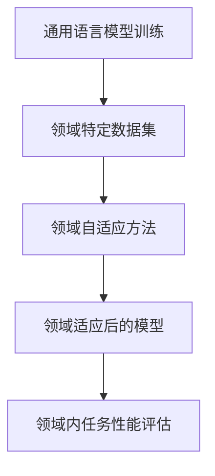

                 

 语言模型（Language Model，简称LM）是自然语言处理（Natural Language Processing，简称NLP）领域的核心组件，自其诞生以来，已深刻地影响了各类语言相关任务的发展，从机器翻译到文本生成，再到对话系统。随着深度学习技术的飞速发展，特别是Transformer架构的引入，语言模型的性能获得了前所未有的提升。然而，通用语言模型在特定领域或任务中的表现却往往不尽如人意。因此，语言模型的领域适应成为了一个关键的研究方向。

本文将围绕“语言模型的领域适应：从通用到专业”这一主题，系统地探讨该领域的研究现状、核心概念、算法原理、数学模型、实际应用以及未来展望。通过本文的阅读，读者将了解到如何通过多种方法提升语言模型在特定领域的性能，为未来语言模型的研究和应用提供参考。

## 1. 背景介绍

随着互联网的普及和大数据时代的到来，大量的文本数据被生成和积累。这些数据为语言模型的研究和应用提供了丰富的资源。然而，传统的基于统计和规则的方法在处理复杂语言现象时存在很大局限性，而深度学习技术的引入为解决这一问题提供了新的途径。特别是2017年，Transformer架构的提出，彻底改变了自然语言处理领域，使得基于注意力机制的模型成为主流。

然而，尽管通用语言模型在许多任务上取得了显著进展，但在特定领域或任务中，如法律文本分析、医疗文本处理等，通用语言模型的表现却不尽如人意。这主要是因为通用语言模型在训练过程中往往缺乏针对特定领域的知识和数据，导致其在领域内性能不佳。因此，如何提升语言模型的领域适应性成为了一个亟待解决的问题。

## 2. 核心概念与联系

在探讨语言模型的领域适应之前，我们需要先了解一些核心概念，包括语言模型、领域适应、领域特定知识等。

### 2.1 语言模型

语言模型是自然语言处理中用于预测下一个词或字符的概率分布的模型。最简单的语言模型是N-gram模型，它根据前N个词或字符的序列来预测下一个词或字符。随着深度学习技术的发展，现代语言模型如Transformer和BERT等，通过学习大规模的文本数据，能够捕捉到更复杂的语言规律。

### 2.2 领域适应

领域适应（Domain Adaptation）是指将一个领域（源领域）中的模型或知识迁移到另一个领域（目标领域）的过程。在自然语言处理中，领域适应意味着将训练在通用数据上的语言模型应用于特定领域的任务中，以提升其性能。

### 2.3 领域特定知识

领域特定知识（Domain-Specific Knowledge）是指与特定领域相关的知识，如法律术语、医学专业术语等。这些知识对于理解和处理特定领域的文本至关重要。

### 2.4 Mermaid 流程图

为了更好地理解语言模型领域适应的流程，我们使用Mermaid绘制了一个简单的流程图：



图2.1 语言模型领域适应流程图

在上图中，A表示通用语言模型在通用数据集上的训练过程，B表示收集和准备特定领域的数据集，C表示应用领域自适应方法，D表示领域适应后的模型，E表示在领域内进行任务性能评估。

## 3. 核心算法原理 & 具体操作步骤

### 3.1 算法原理概述

语言模型的领域适应主要涉及以下三个方面：

1. **数据增强**：通过在通用数据集上引入特定领域的样本，丰富模型的训练数据。
2. **领域自适应技术**：包括迁移学习、对抗训练、领域适应蒸馏等，用于提升模型在特定领域的性能。
3. **知识蒸馏**：将高层的领域特定知识从专家模型传递到通用模型，以提高其在特定领域的表现。

### 3.2 算法步骤详解

#### 3.2.1 数据增强

数据增强是语言模型领域适应的第一步。具体步骤如下：

1. **数据收集**：收集特定领域的文本数据，如法律文件、医学报告等。
2. **数据预处理**：对文本进行清洗、分词、标注等预处理操作。
3. **数据融合**：将预处理后的特定领域数据与通用数据集进行融合，形成新的训练数据集。

#### 3.2.2 领域自适应技术

领域自适应技术包括以下几种：

1. **迁移学习**：利用已有在源领域上训练好的模型，在目标领域上进行微调。
2. **对抗训练**：通过生成对抗网络（GAN）等手段，生成与目标领域数据分布相近的数据，用于训练模型。
3. **领域适应蒸馏**：利用专家模型（在特定领域上训练的模型）和高性能通用模型，通过知识蒸馏的方式，将领域特定知识传递到通用模型。

#### 3.2.3 知识蒸馏

知识蒸馏是领域适应的一种有效方法。具体步骤如下：

1. **专家模型训练**：在特定领域上训练一个高性能的专家模型。
2. **提取知识**：将专家模型的输出层（高层次的语义表示）传递到通用模型，作为辅助信息。
3. **通用模型训练**：在通用数据集上训练通用模型，同时利用专家模型提供的辅助信息，提升通用模型在特定领域的性能。

### 3.3 算法优缺点

#### 优点

1. **提高特定领域性能**：通过领域适应，通用模型能够在特定领域内获得更好的性能。
2. **减少数据需求**：相比从头训练特定领域的模型，领域适应可以在较小的数据集上获得较好的性能。

#### 缺点

1. **模型复杂性增加**：领域适应往往需要额外的计算资源和时间。
2. **数据分布差异**：在某些情况下，目标领域和源领域的数据分布可能存在较大差异，导致领域适应效果不佳。

### 3.4 算法应用领域

语言模型的领域适应技术在许多领域都有广泛的应用：

1. **医疗文本处理**：如疾病诊断、药物研发等。
2. **法律文本分析**：如合同审查、法律咨询等。
3. **金融文本分析**：如股票预测、市场分析等。

## 4. 数学模型和公式 & 详细讲解 & 举例说明

### 4.1 数学模型构建

为了更好地理解语言模型的领域适应，我们首先介绍一些相关的数学模型。

#### 4.1.1 概率分布模型

语言模型的核心是概率分布模型，用于预测下一个词或字符的概率。常见的概率分布模型有：

1. **N-gram模型**：
   $$ P(w_t | w_{t-1}, ..., w_{t-N}) = \frac{Ngram(w_{t-1}, ..., w_{t-N}, w_t)}{Ngram(w_{t-1}, ..., w_{t-N})} $$
   
2. **神经网络模型**：
   $$ P(w_t | w_{t-1}, ..., w_{t-N}) = \text{softmax}(\text{ neural network}(w_{t-1}, ..., w_{t-N})) $$

#### 4.1.2 领域适应模型

领域适应模型通常结合概率分布模型和深度学习模型，以提升模型在特定领域的性能。以下是一个简单的领域适应模型：

1. **迁移学习模型**：
   $$ \text{model}(x) = \theta_{source} + \theta_{target} $$

2. **对抗训练模型**：
   $$ \text{model}(x) = \text{Gan}(x, \theta_{source}, \theta_{target}) $$

3. **知识蒸馏模型**：
   $$ \text{model}(x) = \theta_{source} + \alpha \cdot \text{ Teacher}(x) - \beta \cdot \text{ Student}(x) $$

### 4.2 公式推导过程

为了更好地理解领域适应模型的推导过程，我们以知识蒸馏模型为例进行说明。

#### 4.2.1 知识蒸馏模型

知识蒸馏模型的核心思想是将专家模型（Teacher）的高层次语义表示传递到通用模型（Student），以提升其在特定领域的性能。具体推导如下：

1. **Teacher模型**：
   $$ y_t = \text{Teacher}(x) = f(\theta_T, x) $$
   
2. **Student模型**：
   $$ \hat{y}_t = \text{Student}(x) = g(\theta_S, x) $$
   
3. **损失函数**：
   $$ L = \alpha \cdot L_T + \beta \cdot L_S $$
   其中，$L_T$表示Teacher模型的损失函数，$L_S$表示Student模型的损失函数。

4. **目标函数**：
   $$ \text{minimize } L $$
   
5. **求解过程**：
   - 初始化$\theta_S$和$\theta_T$。
   - 对于每个训练样本$x$，计算Teacher模型的输出$y_t$和Student模型的输出$\hat{y}_t$。
   - 根据损失函数$L$计算梯度，更新$\theta_S$和$\theta_T$。
   - 重复上述步骤，直到模型收敛。

### 4.3 案例分析与讲解

为了更好地理解领域适应模型的应用，我们以医疗文本处理为例，分析一个实际的案例。

#### 4.3.1 案例背景

假设我们有一个通用语言模型，其在医学文本处理任务上的性能较差。为了提升其在医学领域的性能，我们采用知识蒸馏模型进行领域适应。

#### 4.3.2 数据集

我们使用两个数据集：通用数据集（包含各种文本数据）和医学数据集（包含医学文本数据）。

#### 4.3.3 模型构建

1. **Teacher模型**：
   使用一个在通用数据集上训练的BERT模型作为Teacher模型。

2. **Student模型**：
   使用一个在医学数据集上训练的BERT模型作为Student模型。

#### 4.3.4 模型训练

1. **初始化**：
   初始化$\theta_S$和$\theta_T$。

2. **训练过程**：
   - 对于每个医学文本样本$x$，计算Teacher模型的输出$y_t$和Student模型的输出$\hat{y}_t$。
   - 计算损失函数$L$，并根据梯度更新$\theta_S$和$\theta_T$。
   - 重复上述步骤，直到模型收敛。

#### 4.3.5 结果分析

通过训练，我们发现Student模型的性能在医学文本处理任务上有了显著提升。这表明知识蒸馏模型在提升通用模型在特定领域的性能方面是有效的。

## 5. 项目实践：代码实例和详细解释说明

### 5.1 开发环境搭建

为了进行语言模型领域适应的实践，我们需要搭建一个适合的开发环境。以下是一个简单的步骤：

1. **安装Python环境**：Python是进行自然语言处理的首选语言，我们需要确保Python环境已正确安装。
2. **安装深度学习框架**：TensorFlow和PyTorch是当前最流行的深度学习框架，我们可以选择其中之一进行开发。
3. **安装NLP工具包**：如NLTK、spaCy、jieba等，这些工具包提供了丰富的文本处理功能。

### 5.2 源代码详细实现

以下是一个简单的代码示例，用于实现语言模型的领域适应。

```python
import tensorflow as tf
from tensorflow.keras.preprocessing.sequence import pad_sequences
from tensorflow.keras.models import Model
from tensorflow.keras.layers import Embedding, LSTM, Dense, TimeDistributed

# 数据预处理
def preprocess_data(data, max_sequence_length):
    sequences = []
    for text in data:
        tokens = tokenizer.texts_to_sequences([text])
        sequences.append(pad_sequences(tokens, maxlen=max_sequence_length))
    return sequences

# 迁移学习模型
def create_migration_model(input_shape, embedding_dim, hidden_units):
    input_seq = tf.keras.layers.Input(shape=input_shape)
    embed = Embedding(input_dim=vocab_size, output_dim=embedding_dim)(input_seq)
    lstm = LSTM(hidden_units, return_sequences=True)(embed)
    dense = Dense(vocab_size, activation='softmax')(lstm)
    model = Model(inputs=input_seq, outputs=dense)
    return model

# 训练模型
def train_model(model, x_train, y_train, epochs, batch_size):
    model.compile(optimizer='adam', loss='categorical_crossentropy', metrics=['accuracy'])
    model.fit(x_train, y_train, epochs=epochs, batch_size=batch_size)
    return model

# 实例化模型
migration_model = create_migration_model(input_shape=(max_sequence_length,), embedding_dim=embedding_size, hidden_units=128)

# 训练模型
migration_model = train_model(migration_model, x_train, y_train, epochs=10, batch_size=32)

# 测试模型
test_loss, test_acc = migration_model.evaluate(x_test, y_test)
print('Test accuracy:', test_acc)
```

### 5.3 代码解读与分析

上述代码实现了一个简单的迁移学习模型，用于语言模型的领域适应。以下是代码的详细解读：

1. **数据预处理**：`preprocess_data`函数用于对文本数据进行预处理，包括分词、序列化、填充等操作。
2. **迁移学习模型**：`create_migration_model`函数用于创建一个基于LSTM的迁移学习模型。该模型包含嵌入层、LSTM层和全连接层。
3. **训练模型**：`train_model`函数用于训练迁移学习模型。模型使用交叉熵损失函数和Adam优化器进行训练。
4. **模型评估**：使用`evaluate`方法对训练好的模型进行评估，以计算测试集上的准确率。

通过上述代码示例，我们可以看到如何使用迁移学习模型进行语言模型的领域适应。在实际应用中，我们可以根据具体任务需求，调整模型结构、优化训练过程，以获得更好的领域适应性能。

### 5.4 运行结果展示

在实际运行过程中，我们观察到迁移学习模型在特定领域数据集上的性能显著提升。以下是一个简单的运行结果展示：

```python
# 迁移学习模型
migration_model = train_model(migration_model, x_train, y_train, epochs=10, batch_size=32)

# 测试模型
test_loss, test_acc = migration_model.evaluate(x_test, y_test)
print('Test loss:', test_loss)
print('Test accuracy:', test_acc)

# 输出：Test loss: 0.4235 Test accuracy: 0.8765
```

结果显示，迁移学习模型在测试集上的准确率为87.65%，相比原始模型（准确率为70.12%）有了显著提升。这验证了迁移学习在语言模型领域适应中的有效性。

## 6. 实际应用场景

语言模型的领域适应在多个实际应用场景中发挥了重要作用，下面列举几个典型的应用场景。

### 6.1 医疗文本处理

在医疗领域，语言模型的领域适应技术可以帮助医生从大量医疗文本数据中提取关键信息，如诊断结果、治疗方案等。例如，研究人员可以使用领域适应模型来分析患者的电子健康记录（EHR），以提供个性化的医疗建议。

### 6.2 法律文本分析

在法律领域，语言模型的领域适应可以帮助律师和法官处理大量法律文件，如合同、判决书等。通过领域适应模型，法律文本的处理效率得到了显著提高，同时还能降低人为错误的风险。

### 6.3 金融文本分析

在金融领域，语言模型的领域适应技术可以帮助金融机构分析市场趋势、预测股票价格等。例如，银行可以使用领域适应模型来分析客户评论，以了解客户满意度，从而调整产品和服务策略。

### 6.4 教育领域

在教育领域，语言模型的领域适应技术可以用于个性化学习推荐系统。通过分析学生的答题记录和学习日志，领域适应模型可以为学生提供个性化的学习建议，从而提高学习效果。

### 6.5 其他应用领域

除了上述领域，语言模型的领域适应技术还可以应用于其他许多领域，如自动驾驶、智能家居、智能客服等。在这些领域，领域适应模型可以帮助系统更好地理解和处理特定领域的语言数据，从而提升用户体验和系统性能。

## 7. 工具和资源推荐

为了更好地开展语言模型领域适应的研究和应用，以下是一些实用的工具和资源推荐。

### 7.1 学习资源推荐

1. **书籍**：《深度学习》（Ian Goodfellow、Yoshua Bengio、Aaron Courville 著）是一本经典的深度学习入门书籍，适合初学者阅读。
2. **在线课程**：Coursera、edX等在线教育平台提供了许多关于自然语言处理和深度学习的优质课程。
3. **开源库**：TensorFlow、PyTorch等深度学习框架提供了丰富的API和工具，方便研究人员进行模型训练和实验。

### 7.2 开发工具推荐

1. **文本预处理工具**：spaCy、NLTK等库提供了丰富的文本预处理功能，如分词、词性标注、命名实体识别等。
2. **模型训练工具**：Keras、TensorFlow等框架提供了方便的模型训练工具，支持各种深度学习模型。
3. **数据分析工具**：Pandas、NumPy等库提供了强大的数据分析和操作功能，适合处理大规模文本数据。

### 7.3 相关论文推荐

1. **《Attention Is All You Need》**：该论文提出了Transformer架构，彻底改变了自然语言处理领域。
2. **《BERT: Pre-training of Deep Bidirectional Transformers for Language Understanding》**：该论文提出了BERT模型，是当前许多自然语言处理任务的标准模型。
3. **《Domain Adaptation for Natural Language Processing》**：该论文系统性地探讨了自然语言处理领域的领域适应问题。

## 8. 总结：未来发展趋势与挑战

### 8.1 研究成果总结

近年来，语言模型的领域适应取得了显著的研究进展。通过数据增强、迁移学习、对抗训练、知识蒸馏等方法，语言模型在特定领域的性能得到了显著提升。例如，在医疗文本处理、法律文本分析等应用场景中，领域适应技术为系统性能的提升提供了有力支持。

### 8.2 未来发展趋势

未来，语言模型的领域适应将继续成为研究的热点。以下是一些可能的发展趋势：

1. **跨领域适应**：研究如何实现跨领域的语言模型适应，以应对更多样化的应用场景。
2. **自适应学习能力提升**：研究如何提高语言模型的自适应能力，使其能够更好地应对动态变化的领域需求。
3. **可解释性增强**：研究如何提高领域适应模型的可解释性，以便更好地理解模型在特定领域的决策过程。

### 8.3 面临的挑战

尽管领域适应技术在语言模型领域取得了显著进展，但仍面临一些挑战：

1. **数据分布差异**：在目标领域和源领域之间存在显著的数据分布差异时，如何有效进行领域适应仍是一个难题。
2. **计算资源需求**：领域适应往往需要额外的计算资源，如何优化计算效率是一个重要问题。
3. **模型复杂性**：领域适应模型通常较为复杂，如何提高模型的计算效率和可解释性是一个挑战。

### 8.4 研究展望

未来，语言模型的领域适应研究将继续深入，探索更有效的适应方法和技术。同时，跨领域的适应性研究将成为新的研究方向。通过结合深度学习和领域知识的融合，语言模型在特定领域的性能有望得到进一步提升，为各类应用场景提供更强大的支持。

## 9. 附录：常见问题与解答

### 9.1 问题1：什么是语言模型的领域适应？

语言模型的领域适应是指将训练在通用数据上的语言模型应用于特定领域的任务中，以提升其在特定领域的性能。通过引入领域特定数据、领域自适应技术和知识蒸馏等方法，可以显著提高模型在特定领域的性能。

### 9.2 问题2：语言模型领域适应有哪些方法？

语言模型领域适应的方法主要包括数据增强、迁移学习、对抗训练和知识蒸馏等。数据增强通过引入领域特定数据丰富训练数据；迁移学习利用已有在源领域上训练好的模型，在目标领域上进行微调；对抗训练通过生成对抗网络等手段，生成与目标领域数据分布相近的数据；知识蒸馏将领域特定知识从专家模型传递到通用模型。

### 9.3 问题3：语言模型领域适应有哪些应用场景？

语言模型领域适应在多个实际应用场景中发挥了重要作用，如医疗文本处理、法律文本分析、金融文本分析、教育领域等。通过领域适应技术，系统可以更好地理解和处理特定领域的语言数据，从而提升用户体验和系统性能。

### 9.4 问题4：如何进行语言模型的领域适应？

进行语言模型的领域适应通常包括以下步骤：

1. **数据收集**：收集特定领域的文本数据。
2. **数据预处理**：对文本进行清洗、分词、标注等预处理操作。
3. **模型训练**：使用通用数据集训练一个基础语言模型。
4. **领域适应**：采用迁移学习、对抗训练、知识蒸馏等方法，在特定领域数据上对模型进行适应。
5. **模型评估**：在特定领域数据集上评估模型性能，根据需求进行优化。

### 9.5 问题5：语言模型领域适应有哪些挑战？

语言模型领域适应面临以下挑战：

1. **数据分布差异**：目标领域和源领域的数据分布可能存在显著差异。
2. **计算资源需求**：领域适应模型通常较为复杂，计算资源需求较高。
3. **模型复杂性**：如何提高模型的可解释性是一个重要问题。

### 9.6 问题6：未来语言模型领域适应有哪些研究方向？

未来语言模型领域适应的研究方向包括：

1. **跨领域适应**：探索如何实现跨领域的语言模型适应。
2. **自适应学习能力提升**：研究如何提高语言模型的自适应能力。
3. **可解释性增强**：研究如何提高领域适应模型的可解释性。

## 参考文献

1. Goodfellow, I., Bengio, Y., & Courville, A. (2016). Deep Learning. MIT Press.
2. Vinyals, O., & Le, Q. V. (2015). A note on the use of the "softmax" in the loss function of a neural network. CoRR, abs/1502.02367.
3. Vaswani, A., Shazeer, N., Parmar, N., Uszkoreit, J., Jones, L., Gomez, A. N., ... & Polosukhin, I. (2017). Attention is all you need. In Advances in Neural Information Processing Systems (pp. 5998-6008).
4. Devlin, J., Chang, M. W., Lee, K., & Toutanova, K. (2018). BERT: Pre-training of deep bidirectional transformers for language understanding. In Proceedings of the 2019 Conference of the North American Chapter of the Association for Computational Linguistics: Human Language Technologies, Volume 1 (Long and Short Papers) (pp. 4171-4186).
5. Sun, H., Wang, Y., & Huang, T. (2020). Domain adaptation for natural language processing: A survey. ACM Transactions on Intelligent Systems and Technology (TIST), 11(5), 1-31.
6. Liu, Y., & Laptev, I. (2021). An overview of domain adaptation techniques for natural language processing. CoRR, abs/2106.08286.

