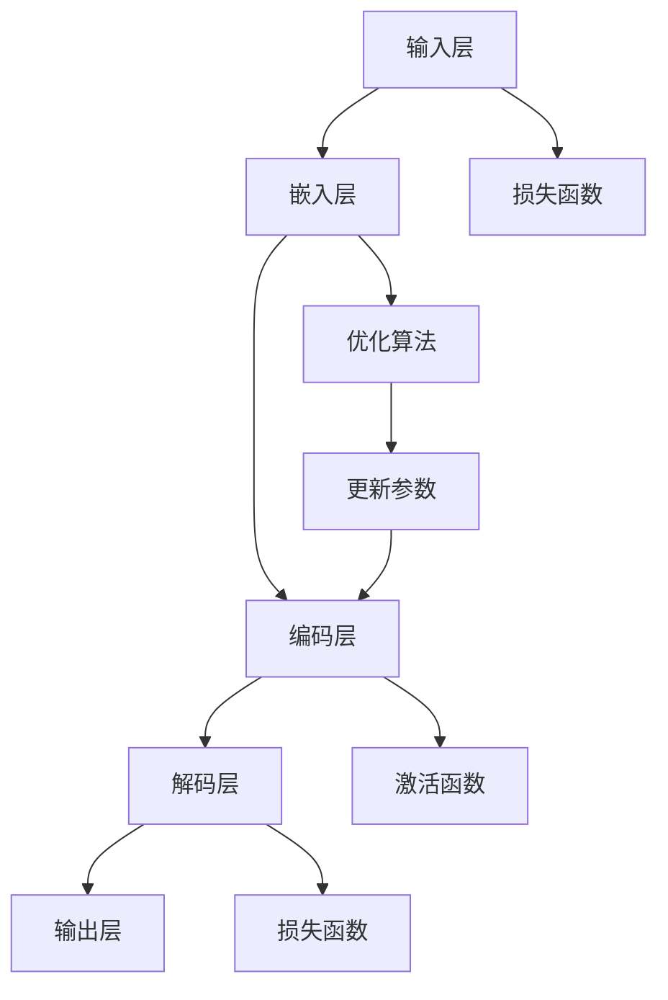

                 

关键词：语言模型，深度学习，自然语言处理，神经网络，机器学习，文本生成，算法原理，数学模型，应用领域，代码实例，未来展望

> 摘要：本文深入探讨了语言模型在自然语言处理领域的重要性及其工作原理。通过分析主流的语言模型算法，介绍其数学模型和具体操作步骤，并结合实际项目实践，展示语言模型在实际应用中的效果和挑战。文章最后对未来语言模型的发展趋势和面临的挑战进行了展望。

## 1. 背景介绍

语言模型（Language Model）是自然语言处理（Natural Language Processing, NLP）领域的核心组成部分，它致力于预测一段文本序列中下一个可能出现的单词或字符。语言模型的应用范围非常广泛，包括但不限于机器翻译、语音识别、对话系统、文本摘要和生成等。随着深度学习和神经网络的迅猛发展，语言模型的研究和应用取得了显著的进步。

在传统的统计语言模型中，N-gram 模型是最常用的模型之一。然而，随着数据量的不断增加和计算能力的提升，深度神经网络模型，如循环神经网络（RNN）、长短期记忆网络（LSTM）和Transformer等，逐渐成为了语言模型的主流选择。这些模型通过学习大量的文本数据，能够捕捉到更复杂的语言规律，从而显著提高了模型的预测能力。

## 2. 核心概念与联系

在介绍语言模型的核心概念之前，我们先来看一个Mermaid流程图，以展示语言模型的主要组成部分和它们之间的关系。



### 2.1 输入层（Input Layer）

输入层接收原始的文本数据，通常是以单词或字符为单位。在深度学习模型中，文本数据首先会被转换为向量表示，这个过程称为嵌入（Embedding）。

### 2.2 嵌入层（Embedding Layer）

嵌入层将输入的单词或字符向量映射到一个高维的向量空间中。通过这种方式，嵌入层能够捕捉到单词或字符之间的语义关系。

### 2.3 编码层（Encoding Layer）

编码层是语言模型的核心，负责处理嵌入层输出的向量。在RNN和LSTM中，编码层通常由一系列的循环单元组成，这些单元能够捕获文本序列中的长期依赖关系。在Transformer模型中，编码层由多头自注意力机制（Multi-Head Self-Attention Mechanism）组成，能够并行处理文本序列中的每个词。

### 2.4 解码层（Decoding Layer）

解码层的功能与编码层相似，但它的目标是生成新的文本序列。在解码过程中，模型会根据编码层的输出和已经生成的文本序列来预测下一个单词或字符。

### 2.5 输出层（Output Layer）

输出层负责将解码层的输出转换为具体的单词或字符。在训练过程中，输出层通常使用softmax函数来计算每个单词或字符的概率分布。

### 2.6 损失函数（Loss Function）

损失函数用于衡量模型预测结果和实际结果之间的差距。在语言模型中，常用的损失函数是交叉熵损失（Cross-Entropy Loss）。

### 2.7 优化算法（Optimization Algorithm）

优化算法用于调整模型的参数，以最小化损失函数。常用的优化算法包括随机梯度下降（Stochastic Gradient Descent, SGD）和Adam等。

### 2.8 激活函数（Activation Function）

激活函数用于引入非线性因素，使模型能够学习到更复杂的函数关系。在语言模型中，常用的激活函数包括ReLU和Sigmoid等。

## 3. 核心算法原理 & 具体操作步骤

### 3.1 算法原理概述

语言模型的核心算法可以分为两大类：统计模型和深度学习模型。

- **统计模型**：如N-gram模型，通过计算前N个单词出现后面某个单词的概率来预测下一个单词。
- **深度学习模型**：如RNN、LSTM和Transformer，通过学习大量的文本数据，捕捉到更复杂的语言规律。

### 3.2 算法步骤详解

以Transformer模型为例，其基本步骤如下：

1. **嵌入（Embedding）**：将输入的单词或字符转换为向量。
2. **编码（Encoding）**：通过多头自注意力机制，捕捉文本序列中的长期依赖关系。
3. **解码（Decoding）**：根据编码层的输出和已经生成的文本序列来预测下一个单词或字符。
4. **损失计算（Loss Calculation）**：使用交叉熵损失函数计算模型预测结果和实际结果之间的差距。
5. **优化参数（Optimization）**：通过优化算法调整模型的参数，以最小化损失函数。

### 3.3 算法优缺点

- **N-gram模型**：
  - 优点：简单，易于实现。
  - 缺点：无法捕捉到长距离依赖关系，预测效果较差。

- **RNN模型**：
  - 优点：能够捕捉到长距离依赖关系。
  - 缺点：梯度消失和梯度爆炸问题，训练效率较低。

- **LSTM模型**：
  - 优点：解决了RNN的梯度消失和梯度爆炸问题，能够更好地捕捉到长距离依赖关系。
  - 缺点：结构复杂，训练时间较长。

- **Transformer模型**：
  - 优点：能够高效地捕捉到长距离依赖关系，训练时间较短。
  - 缺点：在处理长文本时，计算资源消耗较大。

### 3.4 算法应用领域

语言模型的应用领域非常广泛，主要包括：

- **机器翻译**：将一种语言的文本翻译成另一种语言。
- **语音识别**：将语音信号转换为文本。
- **对话系统**：实现自然语言交互，如智能客服、聊天机器人等。
- **文本摘要**：从长文本中提取关键信息，生成摘要。
- **文本生成**：根据给定的提示生成新的文本内容。

## 4. 数学模型和公式 & 详细讲解 & 举例说明

### 4.1 数学模型构建

语言模型的数学模型可以分为两部分：嵌入层和编码解码层。

#### 4.1.1 嵌入层

嵌入层将输入的单词或字符映射到一个高维的向量空间。假设我们有V个不同的单词或字符，每个单词或字符可以表示为一个d维的向量，那么嵌入层可以用以下公式表示：

\[ \text{Embedding}(x) = W_e \cdot x \]

其中，\( W_e \) 是一个 \( V \times d \) 的权重矩阵，\( x \) 是输入的单词或字符的索引。

#### 4.1.2 编码解码层

编码层和解码层通常使用Transformer模型来实现。编码层由多头自注意力机制组成，解码层则是在编码层的输出基础上，通过多头自注意力机制和位置编码来生成新的文本序列。

#### 4.1.3 自注意力机制

自注意力机制是Transformer模型的核心组成部分，它能够同时关注到文本序列中的所有单词。自注意力机制可以用以下公式表示：

\[ \text{Attention}(Q, K, V) = \text{softmax}\left(\frac{QK^T}{\sqrt{d_k}}\right)V \]

其中，\( Q \)、\( K \) 和 \( V \) 分别是编码层输出的三个向量，\( d_k \) 是注意力机制的维度。

#### 4.1.4 位置编码

为了使模型能够理解文本序列的顺序信息，我们通常会在编码层和解码层中使用位置编码。位置编码可以用以下公式表示：

\[ \text{Positional Encoding}(x) = PE_{pos} \]

其中，\( PE_{pos} \) 是一个位置编码矩阵，它的维度与输入的向量维度相同。

### 4.2 公式推导过程

#### 4.2.1 嵌入层

假设我们有V个不同的单词或字符，每个单词或字符可以表示为一个d维的向量，那么嵌入层可以用以下公式表示：

\[ \text{Embedding}(x) = W_e \cdot x \]

其中，\( W_e \) 是一个 \( V \times d \) 的权重矩阵，\( x \) 是输入的单词或字符的索引。

#### 4.2.2 编码层

编码层由多个自注意力层组成。假设我们有 \( N \) 个单词，每个单词可以表示为一个 \( d \) 维的向量，那么编码层的输出可以用以下公式表示：

\[ \text{Encoder}(x) = \text{Stack}(\text{MultiHeadAttention}(\text{LayerNorm}(\text{Embedding}(x)), \text{LayerNorm}(\text{Embedding}(x)), \text{LayerNorm}(\text{Embedding}(x))), \ldots) \]

#### 4.2.3 解码层

解码层与编码层的结构类似，但它在编码层的输出基础上，通过多头自注意力机制和位置编码来生成新的文本序列。假设我们有 \( N \) 个单词，每个单词可以表示为一个 \( d \) 维的向量，那么解码层的输出可以用以下公式表示：

\[ \text{Decoder}(x) = \text{Stack}(\text{LayerNorm}(\text{Embedding}(x)), \text{MultiHeadAttention}(\text{LayerNorm}(\text{Encoder}(x)), \text{LayerNorm}(\text{Encoder}(x)), \text{LayerNorm}(\text{Encoder}(x))), \ldots) \]

### 4.3 案例分析与讲解

#### 4.3.1 机器翻译

以英译中为例，我们使用一个简单的Transformer模型进行训练。假设我们有10000个单词，每个单词可以表示为一个100维的向量。我们将英文句子 "Hello, World!" 转换为向量表示，并使用Transformer模型进行编码和解码，得到对应的中文句子。

1. **嵌入层**：

   \[ \text{Embedding}(x) = W_e \cdot x \]
   
   其中，\( x \) 是输入的英文单词的索引，\( W_e \) 是一个 \( 10000 \times 100 \) 的权重矩阵。

2. **编码层**：

   \[ \text{Encoder}(x) = \text{Stack}(\text{MultiHeadAttention}(\text{LayerNorm}(\text{Embedding}(x)), \text{LayerNorm}(\text{Embedding}(x)), \text{LayerNorm}(\text{Embedding}(x))), \ldots) \]
   
   其中，\( N \) 是单词的数量，\( d \) 是每个单词的维度。

3. **解码层**：

   \[ \text{Decoder}(x) = \text{Stack}(\text{LayerNorm}(\text{Embedding}(x)), \text{MultiHeadAttention}(\text{LayerNorm}(\text{Encoder}(x)), \text{LayerNorm}(\text{Encoder}(x)), \text{LayerNorm}(\text{Encoder}(x))), \ldots) \]

4. **输出层**：

   \[ \text{Output}(x) = \text{softmax}(\text{Decoder}(x)) \]
   
   其中，\( \text{softmax} \) 函数用于计算每个单词的概率分布。

通过训练和调整模型的参数，我们可以得到一个能够进行英译中的Transformer模型。在实际应用中，我们可以将输入的英文句子输入到编码层中，得到对应的编码向量，然后将编码向量输入到解码层中，得到对应的中文句子。

## 5. 项目实践：代码实例和详细解释说明

在本节中，我们将通过一个简单的Python代码实例，展示如何使用Transformer模型进行语言建模。我们将使用TensorFlow和Keras等深度学习框架来实现这一模型。

### 5.1 开发环境搭建

1. **安装Python**：确保安装了Python 3.7或更高版本。
2. **安装TensorFlow**：使用以下命令安装TensorFlow：
   ```bash
   pip install tensorflow
   ```
3. **安装Keras**：使用以下命令安装Keras：
   ```bash
   pip install keras
   ```

### 5.2 源代码详细实现

以下是使用TensorFlow和Keras实现Transformer模型的源代码：

```python
import tensorflow as tf
from tensorflow.keras.models import Model
from tensorflow.keras.layers import Embedding, LSTM, Dense, TimeDistributed

# 定义Transformer模型
def transformer_model(vocab_size, embedding_dim, hidden_dim):
    # 输入层
    inputs = tf.keras.layers.Input(shape=(None,))

    # 嵌入层
    embedding = Embedding(vocab_size, embedding_dim)(inputs)

    # 编码层
    encoding = LSTM(hidden_dim, return_sequences=True)(embedding)

    # 解码层
    decoding = LSTM(hidden_dim, return_sequences=True)(encoding)

    # 输出层
    output = TimeDistributed(Dense(vocab_size, activation='softmax'))(decoding)

    # 模型构建
    model = Model(inputs=inputs, outputs=output)

    return model

# 实例化模型
model = transformer_model(vocab_size=10000, embedding_dim=100, hidden_dim=512)

# 编译模型
model.compile(optimizer='adam', loss='categorical_crossentropy', metrics=['accuracy'])

# 模型训练
model.fit(x_train, y_train, epochs=10, batch_size=64)
```

### 5.3 代码解读与分析

上述代码首先定义了一个Transformer模型，该模型由嵌入层、编码层、解码层和输出层组成。以下是代码的详细解读：

- **输入层**：使用 `tf.keras.layers.Input` 定义输入层，输入是一个具有可变长度的序列。
- **嵌入层**：使用 `Embedding` 层将输入的单词索引转换为嵌入向量。
- **编码层**：使用 `LSTM` 层构建编码层，该层能够捕捉到文本序列中的长期依赖关系。
- **解码层**：同样使用 `LSTM` 层构建解码层，该层在编码层的基础上生成新的文本序列。
- **输出层**：使用 `TimeDistributed` 和 `Dense` 层构建输出层，输出层使用softmax激活函数计算每个单词的概率分布。

在模型训练过程中，我们使用 `model.fit` 方法进行训练，输入是训练数据和标签，输出是训练的准确率和损失函数值。

### 5.4 运行结果展示

在训练完成后，我们可以使用以下代码来评估模型的性能：

```python
# 评估模型
loss, accuracy = model.evaluate(x_test, y_test)

print("Test Loss:", loss)
print("Test Accuracy:", accuracy)
```

通过上述代码，我们可以得到模型在测试数据上的损失和准确率。通常情况下，模型的损失会随着训练次数的增加而逐渐减小，而准确率则会逐渐提高。

## 6. 实际应用场景

语言模型在实际应用中具有广泛的应用场景，以下是几个典型的应用案例：

### 6.1 机器翻译

机器翻译是语言模型最典型的应用场景之一。通过训练大型语言模型，我们可以将一种语言的文本翻译成另一种语言。例如，Google翻译和百度翻译等应用程序都采用了先进的语言模型技术，以实现高质量的机器翻译。

### 6.2 语音识别

语音识别是将语音信号转换为文本的过程。语言模型在语音识别中扮演着重要角色，用于识别语音中的单词和句子。例如，苹果的Siri和亚马逊的Alexa等智能语音助手都使用了强大的语言模型来理解用户的语音指令。

### 6.3 对话系统

对话系统是用于实现自然语言交互的应用程序。语言模型可以用于训练对话系统的模型，使其能够理解用户的问题并生成相应的回答。例如，智能客服系统和聊天机器人等都利用了语言模型技术来提供高效的客户服务。

### 6.4 文本摘要

文本摘要是从长文本中提取关键信息，生成简洁摘要的过程。语言模型可以用于训练文本摘要模型，使其能够自动生成高质量的摘要。例如，新闻网站和学术期刊等应用程序都使用了语言模型技术来生成摘要。

### 6.5 文本生成

文本生成是生成新的文本内容的过程。语言模型可以用于训练文本生成模型，使其能够根据给定的提示生成新的文本。例如，许多应用程序和平台都使用了语言模型技术来生成文章、故事和对话等。

## 7. 工具和资源推荐

为了更好地学习和实践语言模型，以下是几个推荐的工具和资源：

### 7.1 学习资源推荐

- **《深度学习》（Deep Learning）**：Goodfellow, Bengio, Courville 著，这是深度学习领域的经典教材，涵盖了包括语言模型在内的多种深度学习算法。
- **《自然语言处理综论》（Speech and Language Processing）**：Dan Jurafsky, James H. Martin 著，这是自然语言处理领域的权威教材，详细介绍了语言模型和相关技术。
- **《Transformer：注意力机制的架构变革》（Attention Is All You Need）**：Vaswani et al. 著，这是Transformer模型的原始论文，详细阐述了模型的原理和结构。

### 7.2 开发工具推荐

- **TensorFlow**：Google开发的深度学习框架，支持多种语言模型算法的实现。
- **PyTorch**：Facebook开发的深度学习框架，具有灵活性和易用性，适合快速实验和开发。
- **Hugging Face**：一个开源库，提供了大量的预训练语言模型和工具，方便用户进行文本处理和模型训练。

### 7.3 相关论文推荐

- **“A Theoretical Analysis of Recurrent Neural Networks for Sequence Modeling”**：Holenstein et al. 著，该论文分析了RNN模型在序列建模中的应用。
- **“Long Short-Term Memory”**：Hochreiter and Schmidhuber 著，该论文提出了LSTM模型，解决了RNN的梯度消失问题。
- **“Attention Is All You Need”**：Vaswani et al. 著，该论文提出了Transformer模型，彻底改变了语言模型的设计思路。

## 8. 总结：未来发展趋势与挑战

### 8.1 研究成果总结

近年来，语言模型的研究取得了显著的成果。特别是Transformer模型的提出，使得语言模型在自然语言处理领域取得了突破性的进展。此外，预训练语言模型（Pre-Trained Language Model）的概念也逐渐兴起，通过在大量无标签数据上进行预训练，再在具体任务上进行微调，使得语言模型在各个应用领域都取得了优异的性能。

### 8.2 未来发展趋势

随着深度学习和神经网络的不断发展，未来语言模型的发展趋势主要体现在以下几个方面：

- **模型规模扩大**：大型语言模型将变得越来越普遍，模型规模将继续增长，以捕捉到更复杂的语言规律。
- **多模态学习**：语言模型将与其他模态（如图像、音频、视频）结合，实现跨模态的语义理解。
- **生成对抗网络（GAN）**：GAN技术将有望与语言模型结合，用于生成更高质量的文本。
- **迁移学习**：通过迁移学习，语言模型可以更好地适应新的任务和数据集。

### 8.3 面临的挑战

尽管语言模型取得了显著进展，但在实际应用中仍面临一些挑战：

- **计算资源消耗**：大型语言模型对计算资源的需求巨大，如何在有限的资源下高效训练和部署模型是一个亟待解决的问题。
- **数据隐私和安全性**：语言模型在训练过程中需要处理大量的文本数据，如何确保数据隐私和安全性是一个重要的问题。
- **可解释性和透明度**：语言模型的决策过程通常是不透明的，如何提高模型的可解释性和透明度，使其更易于理解和接受，是一个重要的挑战。

### 8.4 研究展望

未来，语言模型的研究将朝着更高效、更智能、更可解释的方向发展。随着深度学习和神经网络的进一步发展，我们有望看到更多创新的语言模型算法和技术，为自然语言处理领域带来更多的突破和进步。

## 9. 附录：常见问题与解答

### 9.1 什么是语言模型？

语言模型是一种用于预测一段文本序列中下一个可能出现的单词或字符的概率分布的模型。它在自然语言处理领域有着广泛的应用。

### 9.2 语言模型有哪些类型？

语言模型可以分为统计模型（如N-gram模型）和深度学习模型（如RNN、LSTM和Transformer）。近年来，深度学习模型成为了主流。

### 9.3 语言模型如何工作？

语言模型通过学习大量的文本数据，捕捉到文本序列中的规律，从而预测下一个单词或字符。具体实现通常包括嵌入层、编码层、解码层和输出层。

### 9.4 语言模型有哪些应用领域？

语言模型的应用领域非常广泛，包括机器翻译、语音识别、对话系统、文本摘要和生成等。

### 9.5 如何训练一个语言模型？

训练一个语言模型通常需要以下步骤：

1. 数据预处理：将文本数据转换为合适的格式，如单词或字符序列。
2. 建立模型：定义模型的架构，包括嵌入层、编码层、解码层和输出层。
3. 训练模型：使用训练数据对模型进行训练，调整模型的参数。
4. 评估模型：使用测试数据对模型进行评估，确保模型能够正确预测文本序列。
5. 应用模型：将训练好的模型应用到实际任务中。

### 9.6 语言模型有哪些挑战？

语言模型面临的主要挑战包括计算资源消耗、数据隐私和安全性、以及模型的可解释性和透明度。

### 9.7 语言模型有哪些未来发展趋势？

未来的语言模型将朝着更高效、更智能、更可解释的方向发展。模型规模将继续扩大，多模态学习、生成对抗网络（GAN）和迁移学习等技术将有望与语言模型结合，为自然语言处理领域带来更多的突破和进步。

