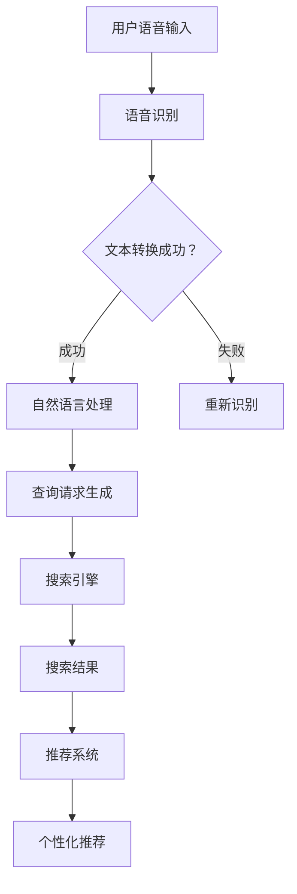

                 

### 关键词 Keyword List
- 语音搜索技术
- 电商领域
- 挑战与机遇
- 搜索引擎优化
- 用户体验
- 人工智能
- 技术应用

<|assistant|>### 摘要 Abstract
随着人工智能技术的不断发展，语音搜索技术在电商领域正逐渐崭露头角。本文将探讨语音搜索在电商中的应用，分析其带来的挑战与机遇。通过对核心概念、算法原理、数学模型、项目实践和实际应用场景的深入分析，本文旨在为读者提供对语音搜索技术及电商融合的全面理解，并展望其未来的发展方向。

<|assistant|>## 1. 背景介绍 Background

语音搜索技术，即通过语音识别和自然语言处理技术，将用户的语音输入转化为文本查询，并在互联网上检索相关信息。近年来，随着智能手机、智能家居设备的普及，语音搜索已经成为用户获取信息、完成购物等日常任务的重要途径。

电商领域作为互联网经济的重要组成部分，其市场规模持续扩大，用户需求日益多样。传统的文字搜索方式在一定程度上已无法满足用户的快速搜索和操作需求，而语音搜索以其便捷、高效的特点，成为电商企业提升用户体验、增加用户粘性的重要手段。

当前，语音搜索技术在电商领域的应用仍处于初级阶段，存在一系列技术挑战和商业机遇。本文将结合当前发展现状，深入分析语音搜索技术在实际应用中面临的问题及其解决方案，探讨语音搜索在电商领域的未来发展趋势。

### 1.1 市场规模与增长趋势

根据市场研究机构的数据显示，全球电商市场规模在过去几年中持续增长。2021年全球电商市场规模已达到4.89万亿美元，预计到2026年将达到6.38万亿美元。随着智能手机和移动互联网的普及，消费者在线购物的行为逐渐从PC端转移到移动端，这为语音搜索技术的发展提供了广阔的市场空间。

根据Statista的数据，2022年全球语音助手市场的规模预计将达到200亿美元，而语音搜索技术作为语音助手的核心功能之一，其市场份额将持续增长。此外，根据eMarketer的报告，美国消费者在2021年通过语音助手进行购物的交易量同比增长了20%，预计到2025年将达到1万亿美元。

由此可见，语音搜索技术在电商领域的应用具有巨大的市场潜力。电商企业通过引入语音搜索技术，不仅能提升用户购物的便捷性，还能通过个性化的语音推荐增加销售转化率。

### 1.2 用户行为变化

随着互联网技术的发展，用户的行为习惯也在发生着变化。传统的文字搜索方式需要用户花费较长时间输入关键词，而语音搜索则大大简化了这一过程。用户只需通过语音输入，就能快速获取所需信息，这不仅提高了搜索效率，还能在多任务处理场景下节省时间。

根据谷歌的调查数据，超过50%的美国消费者表示愿意使用语音搜索来获取产品信息。此外，根据微软的调查，超过60%的年轻人更喜欢使用语音搜索而不是传统的文字搜索。这些数据表明，语音搜索正逐渐成为用户的主要搜索方式之一。

特别是在电商场景中，用户对购物过程的便捷性和效率有更高的要求。语音搜索可以满足用户在移动设备上快速购物的需求，特别是在上下班途中、购物时查找商品信息等场景下，语音搜索的优势更加明显。

### 1.3 技术发展现状

语音搜索技术的核心是语音识别和自然语言处理技术。近年来，随着深度学习、神经网络等人工智能技术的发展，语音识别的准确率得到了显著提升。目前，主流语音识别技术的识别准确率已经达到97%以上，能够满足大多数应用场景的需求。

自然语言处理技术则是语音搜索中的另一个关键环节，它负责理解和解析用户的语音输入，并生成相应的搜索请求。通过结合上下文信息、用户历史数据等，自然语言处理技术能够提供更加精准的搜索结果。

目前，主流的语音搜索技术主要包括以下几种：

1. **关键词语音搜索**：用户通过说出关键词进行搜索，系统根据关键词进行匹配并返回相关结果。
2. **语音问答**：用户提出问题，系统通过自然语言处理技术理解和解答，如常见的语音助手服务。
3. **语音交互式搜索**：用户通过语音与系统进行交互，逐步缩小搜索范围，获取所需信息。

这些技术在不同场景中都有广泛的应用，如智能家居设备、移动应用、电商网站等。

### 1.4 应用场景与需求

在电商领域，语音搜索技术的应用场景非常广泛。以下是一些典型的应用场景和需求：

1. **商品搜索**：用户可以通过语音输入关键词或描述，快速找到所需商品。
2. **购物车管理**：用户可以使用语音添加或删除商品，简化购物车操作。
3. **订单查询与支付**：用户可以通过语音查询订单状态、支付金额等，提高购物效率。
4. **客服互动**：语音搜索技术可以用于智能客服系统，帮助用户快速解决问题。
5. **语音推荐**：基于用户的购物历史和偏好，语音搜索可以为用户提供个性化推荐。

这些应用场景不仅提升了用户的购物体验，还为企业提供了新的商业模式和增长点。例如，通过语音推荐，电商企业可以增加用户购买频率和销售额。

### 1.5 挑战与机遇

尽管语音搜索技术在电商领域具有巨大的应用潜力，但其发展仍面临一系列挑战。以下是一些主要挑战和机遇：

1. **技术挑战**：语音识别和自然语言处理技术的准确性仍有待提高，特别是在多语言、多方言场景下。
2. **用户体验**：如何提供流畅、自然的语音交互体验，满足用户个性化需求，是电商企业需要解决的问题。
3. **隐私保护**：语音搜索涉及用户个人信息的收集和使用，如何保障用户隐私是企业面临的重大挑战。
4. **商业模式**：电商企业需要探索如何通过语音搜索技术创造新的商业模式和收入来源。

然而，这些挑战也伴随着机遇。通过技术创新和商业模式的创新，电商企业可以把握语音搜索带来的市场机会，提升用户满意度，实现可持续发展。

## 2. 核心概念与联系

### 2.1 语音识别技术

语音识别（Voice Recognition）技术是语音搜索技术的核心，它通过将语音信号转换为文本数据，为用户提供搜索输入。语音识别技术的基本原理包括以下几个步骤：

1. **音频信号采集**：用户通过麦克风输入语音信号。
2. **预处理**：对音频信号进行降噪、归一化等处理，提高语音识别的准确性。
3. **特征提取**：将预处理后的语音信号转换为一系列特征向量，如梅尔频率倒谱系数（MFCC）。
4. **模型匹配**：利用深度学习模型（如卷积神经网络、循环神经网络等）对特征向量进行分类和识别，输出识别结果。

当前主流的语音识别技术基于深度学习，特别是循环神经网络（RNN）和长短时记忆网络（LSTM）在语音识别领域取得了显著成果。随着计算力和算法的不断提升，语音识别的准确率已达到97%以上，能够满足大部分应用场景的需求。

### 2.2 自然语言处理技术

自然语言处理（Natural Language Processing，NLP）技术是语音搜索技术的另一个关键环节，它负责理解和解析用户的语音输入，并将其转化为结构化的数据，以便进行搜索和推荐。NLP技术包括以下几个主要方面：

1. **分词与词性标注**：将语音输入分解为单个词语，并对每个词语进行词性标注，如名词、动词等。
2. **句法分析**：分析句子的结构和语法关系，如主谓宾、定状补等。
3. **语义理解**：理解句子或段落的含义，包括实体识别、关系抽取等。
4. **语义匹配**：将用户的语音输入与数据库中的信息进行匹配，返回相关结果。

NLP技术的核心是深度学习，特别是基于变换器（Transformer）架构的BERT（Bidirectional Encoder Representations from Transformers）等预训练模型在NLP领域取得了突破性进展。通过预训练和微调，这些模型能够理解和解析复杂的自然语言，为语音搜索提供强大的支持。

### 2.3 语音搜索系统架构

语音搜索系统通常包括以下几个关键组件：

1. **语音识别模块**：接收用户的语音输入，将其转换为文本数据。
2. **自然语言处理模块**：对语音输入进行语义理解，生成结构化的查询请求。
3. **搜索引擎**：根据查询请求，在电商数据库中检索相关信息，返回搜索结果。
4. **推荐系统**：基于用户的历史行为和偏好，为用户提供个性化推荐。

这些组件相互协作，共同实现高效的语音搜索服务。以下是一个简化的语音搜索系统架构：

```
用户语音输入 -> 语音识别模块 -> 文本查询请求
文本查询请求 -> 自然语言处理模块 -> 结构化查询请求
结构化查询请求 -> 搜索引擎 -> 搜索结果
搜索结果 -> 推荐系统 -> 个性化推荐
```

### 2.4 Mermaid 流程图

以下是一个简化的Mermaid流程图，展示语音搜索系统的工作流程：



### 2.5 关键技术的结合与协同作用

语音识别技术和自然语言处理技术在语音搜索系统中相互结合，共同发挥作用。语音识别技术负责将用户的语音输入转化为文本数据，而自然语言处理技术则负责理解和解析文本数据，生成结构化的查询请求。

通过深度学习模型的训练和优化，语音识别技术的准确率得到了显著提升，使得系统能够准确识别用户的语音输入。同时，自然语言处理技术通过预训练和微调，能够理解和解析复杂的自然语言，生成精准的查询请求。

搜索引擎和推荐系统则基于结构化的查询请求，返回相关的搜索结果和个性化推荐。搜索引擎利用索引技术和查询优化算法，快速检索并返回最相关的结果。推荐系统则通过协同过滤、内容推荐等技术，为用户提供个性化的购物推荐。

这些关键技术的结合与协同作用，使得语音搜索系统能够高效、精准地满足用户的搜索需求，提升用户的购物体验。

## 3. 核心算法原理 & 具体操作步骤

### 3.1 算法原理概述

语音搜索技术的核心算法主要包括语音识别和自然语言处理两个主要部分。以下是这两个算法的基本原理及如何结合使用。

#### 3.1.1 语音识别算法原理

语音识别（Automatic Speech Recognition，ASR）是将语音信号转换为文本数据的过程。其基本原理可以分为以下几个步骤：

1. **信号处理**：将采集到的音频信号进行预处理，如噪声抑制、归一化等，以提高语音信号的清晰度。
2. **特征提取**：对预处理后的语音信号进行特征提取，常用的特征有梅尔频率倒谱系数（MFCC）、频谱特征等。这些特征能够描述语音信号的频域特性。
3. **声学模型训练**：通过大量语音数据训练声学模型，如隐马尔可夫模型（HMM）、深度神经网络（DNN）等。声学模型用于对特征向量进行分类，识别出语音信号中的词汇。
4. **语言模型训练**：利用大量的文本语料库训练语言模型，如n-gram模型、循环神经网络（RNN）等。语言模型用于对识别出的词汇进行语法和语义分析，生成完整的句子或短语。

#### 3.1.2 自然语言处理算法原理

自然语言处理（Natural Language Processing，NLP）是将文本数据转换为结构化信息的过程，其基本原理包括：

1. **分词与词性标注**：将文本分割为单个词语，并对每个词语进行词性标注，如名词、动词等。
2. **句法分析**：分析句子的语法结构，包括句法树、依存关系等。
3. **语义理解**：理解句子的语义含义，包括实体识别、情感分析、关系抽取等。
4. **语义匹配**：将用户的查询请求与数据库中的信息进行匹配，生成结构化的查询请求。

#### 3.1.3 语音搜索算法的工作流程

语音搜索算法通常包括以下步骤：

1. **语音输入**：用户通过语音输入查询请求。
2. **语音识别**：语音识别模块将语音信号转换为文本数据。
3. **文本预处理**：对转换后的文本进行分词、词性标注等预处理操作。
4. **语义理解**：NLP模块对预处理后的文本进行句法分析、语义理解，生成结构化的查询请求。
5. **搜索引擎查询**：搜索引擎根据查询请求检索相关信息，返回搜索结果。
6. **推荐系统**：推荐系统根据用户的历史行为和偏好，为用户生成个性化推荐。

### 3.2 算法步骤详解

以下是语音搜索算法的具体操作步骤及每个步骤的详细解释：

#### 3.2.1 语音输入

用户通过语音输入查询请求。这一步骤依赖于用户设备上的麦克风和语音识别软件。用户可以通过语音命令查询商品信息、执行购物操作等。

#### 3.2.2 语音识别

语音识别模块将用户的语音输入转换为文本数据。这一步骤涉及音频信号处理、特征提取和声学模型匹配。

1. **信号处理**：首先，对用户的语音信号进行预处理，如去噪、归一化等，以提高语音信号的清晰度。
2. **特征提取**：对预处理后的语音信号进行特征提取，生成一系列特征向量，如MFCC。
3. **声学模型匹配**：利用训练好的声学模型，对特征向量进行分类，识别出语音信号中的词汇。

#### 3.2.3 文本预处理

转换后的文本数据需要进行预处理，以提取关键信息并生成结构化的查询请求。这一步骤包括分词、词性标注、命名实体识别等操作。

1. **分词**：将文本分割为单个词语，以便进行后续的语法和语义分析。
2. **词性标注**：对每个词语进行词性标注，如名词、动词、形容词等，以便理解词语的语法功能。
3. **命名实体识别**：识别出文本中的命名实体，如人名、地名、商品名等，以便进行特定信息的提取。

#### 3.2.4 语义理解

NLP模块对预处理后的文本进行语义理解，以生成结构化的查询请求。这一步骤包括句法分析、语义角色标注、关系抽取等操作。

1. **句法分析**：构建句子的句法树，分析句子的语法结构，如主谓宾、定状补等。
2. **语义角色标注**：对句法树中的词语进行语义角色标注，如施事、受事、工具等，以便理解句子的语义含义。
3. **关系抽取**：识别句子中的实体关系，如人物与地点、商品与价格等，以便进行信息整合和查询请求生成。

#### 3.2.5 搜索引擎查询

搜索引擎根据生成的结构化查询请求，在电商数据库中检索相关信息，并返回搜索结果。这一步骤涉及查询优化、索引管理、结果排序等操作。

1. **查询优化**：对查询请求进行优化，提高搜索效率，如查询重写、关键词扩展等。
2. **索引管理**：对电商数据库进行索引管理，提高数据检索速度，如使用倒排索引、文档频率统计等。
3. **结果排序**：对搜索结果进行排序，返回最相关、最符合用户需求的商品信息。

#### 3.2.6 推荐系统

推荐系统根据用户的历史行为和偏好，为用户生成个性化推荐。这一步骤涉及协同过滤、内容推荐等算法。

1. **协同过滤**：基于用户的历史行为和相似用户的行为，为用户推荐可能感兴趣的商品。
2. **内容推荐**：基于商品的特征和用户偏好，为用户推荐具有相似属性的同类商品。

### 3.3 算法优缺点

#### 3.3.1 优点

1. **便捷性**：语音搜索技术简化了搜索过程，用户无需手动输入关键词，提高了搜索效率。
2. **高效性**：语音搜索技术能够在短时间内处理大量语音数据，支持实时搜索和推荐。
3. **个性化**：通过自然语言处理和用户历史数据的分析，语音搜索技术能够提供个性化的推荐和搜索结果。
4. **多场景适用**：语音搜索技术适用于多种场景，如移动应用、智能家居等，满足不同用户的需求。

#### 3.3.2 缺点

1. **准确性**：语音识别技术虽然已经取得了很大进展，但在复杂语音环境、多语言场景下，识别准确性仍有待提高。
2. **隐私保护**：语音搜索涉及用户个人信息的收集和使用，如何保障用户隐私是一个重要挑战。
3. **技术门槛**：语音搜索技术涉及到多个领域的专业知识，包括语音识别、自然语言处理、搜索引擎等，技术门槛较高。
4. **用户体验**：如何提供流畅、自然的语音交互体验，仍需要进一步研究和优化。

### 3.4 算法应用领域

语音搜索技术在电商领域具有广泛的应用前景，以下是一些主要的领域：

1. **商品搜索**：用户可以通过语音输入关键词或描述，快速找到所需商品。
2. **购物车管理**：用户可以使用语音添加或删除商品，简化购物车操作。
3. **订单查询与支付**：用户可以通过语音查询订单状态、支付金额等，提高购物效率。
4. **客服互动**：语音搜索技术可以用于智能客服系统，帮助用户快速解决问题。
5. **语音推荐**：基于用户的购物历史和偏好，语音搜索可以为用户提供个性化推荐。

这些应用不仅提升了用户的购物体验，还为电商企业提供了新的商业模式和增长点。

## 4. 数学模型和公式 & 详细讲解 & 举例说明

### 4.1 数学模型构建

语音搜索技术的核心在于对语音信号的处理和文本信息的理解，因此，构建相应的数学模型至关重要。以下是构建语音搜索技术数学模型的主要步骤和公式。

#### 4.1.1 语音信号处理模型

语音信号处理模型用于将语音信号转换为文本数据，其核心在于特征提取和分类。以下是语音信号处理模型的主要公式：

1. **特征提取公式**：
   $$X = \text{Fbank}(S)$$
   其中，$X$ 表示特征向量，$S$ 表示语音信号，$\text{Fbank}$ 表示梅尔频率倒谱系数（MFCC）特征提取函数。

2. **分类公式**：
   $$C = \text{softmax}(\theta^T X)$$
   其中，$C$ 表示分类结果，$\theta$ 表示模型的参数向量，$\text{softmax}$ 函数用于将特征向量映射到概率分布。

#### 4.1.2 自然语言处理模型

自然语言处理模型用于理解语音输入的语义信息，生成结构化的查询请求。以下是自然语言处理模型的主要公式：

1. **词嵌入公式**：
   $$\text{word\_embeddings} = \text{embedding}(W)$$
   其中，$\text{word\_embeddings}$ 表示词向量矩阵，$W$ 表示词汇表，$\text{embedding}$ 函数用于将词汇映射到高维向量空间。

2. **编码公式**：
   $$\text{encode} = \text{RNN}(\text{word\_embeddings})$$
   其中，$\text{encode}$ 表示编码结果，$\text{RNN}$ 表示循环神经网络，用于处理序列数据。

3. **解码公式**：
   $$\text{decode} = \text{softmax}(\theta^T \text{encode})$$
   其中，$\text{decode}$ 表示解码结果，$\theta$ 表示模型的参数向量，$\text{softmax}$ 函数用于生成文本序列的概率分布。

### 4.2 公式推导过程

以下是语音搜索技术中几个关键公式的推导过程。

#### 4.2.1 梅尔频率倒谱系数（MFCC）特征提取

梅尔频率倒谱系数（MFCC）是语音信号处理中常用的特征提取方法，其推导过程如下：

1. **傅里叶变换**：
   $$X(f) = \int_{-\infty}^{\infty} s(t) e^{-j 2 \pi ft} dt$$
   其中，$X(f)$ 表示频域信号，$s(t)$ 表示时域信号，$f$ 表示频率。

2. **梅尔滤波器组**：
   $$H_m(f) = \sum_{i=1}^{M} h_i(f) \cdot w_i(f)$$
   其中，$H_m(f)$ 表示梅尔滤波器响应，$h_i(f)$ 表示频谱响应，$w_i(f)$ 表示加权函数。

3. **对数变换**：
   $$M(\beta) = \log \left| \sum_{i=1}^{M} h_i(f) \cdot w_i(f) \right|$$
   其中，$M(\beta)$ 表示梅尔频率倒谱系数。

#### 4.2.2 循环神经网络（RNN）

循环神经网络（RNN）是自然语言处理中常用的模型，其推导过程如下：

1. **输入表示**：
   $$h_t = \text{tanh}(W_h h_{t-1} + U_x x_t + b_h)$$
   其中，$h_t$ 表示当前时刻的隐藏状态，$W_h$ 表示隐藏状态到隐藏状态的权重矩阵，$U_x$ 表示输入到隐藏状态的权重矩阵，$b_h$ 表示隐藏状态的偏置。

2. **输出表示**：
   $$y_t = \text{softmax}(W_y h_t + b_y)$$
   其中，$y_t$ 表示当前时刻的输出，$W_y$ 表示隐藏状态到输出的权重矩阵，$b_y$ 表示输出的偏置。

### 4.3 案例分析与讲解

以下是一个简单的语音搜索技术案例，用于解释数学模型在实际应用中的运用。

#### 4.3.1 问题背景

假设用户通过语音输入查询“查询iPhone 13手机”，语音搜索系统需要返回相关的商品信息。

#### 4.3.2 语音识别

1. **特征提取**：
   对用户的语音信号进行预处理和特征提取，得到特征向量 $X$。

2. **分类**：
   利用训练好的声学模型，对特征向量 $X$ 进行分类，识别出“iPhone 13”等词汇。

#### 4.3.3 自然语言处理

1. **词嵌入**：
   将识别出的词汇“iPhone 13”映射到词向量空间，得到向量 $\text{word\_embeddings}$。

2. **编码**：
   利用循环神经网络（RNN）对词向量进行编码，得到编码结果 $\text{encode}$。

3. **解码**：
   利用解码函数，从编码结果 $\text{encode}$ 中生成文本序列的概率分布，返回搜索结果。

#### 4.3.4 搜索引擎查询

搜索引擎根据生成的查询请求，在电商数据库中检索相关信息，并返回搜索结果。

通过上述案例，我们可以看到数学模型在语音搜索技术中的应用。语音识别和自然语言处理模型通过一系列数学公式和算法，将用户的语音输入转化为结构化的查询请求，实现了语音搜索功能。

## 5. 项目实践：代码实例和详细解释说明

### 5.1 开发环境搭建

在进行语音搜索技术在电商领域的应用项目开发之前，我们需要搭建一个合适的开发环境。以下是所需工具和步骤：

#### 工具准备

- **编程语言**：选择Python作为主要编程语言，因为Python在人工智能和自然语言处理领域有广泛的应用和丰富的库支持。
- **语音识别库**：使用Mozilla的DeepSpeech库，这是一个开源的语音识别系统，基于Google的TensorFlow。
- **自然语言处理库**：使用NLTK或spaCy库，这些库提供了丰富的自然语言处理功能。
- **搜索引擎**：使用Elasticsearch，这是一个开源的全文搜索引擎，适用于电商领域的商品搜索。
- **数据库**：使用MySQL或PostgreSQL，用于存储商品信息和其他相关数据。

#### 步骤

1. **安装Python环境**：确保Python 3.7或更高版本已安装在您的系统上。

2. **安装DeepSpeech库**：

   ```bash
   pip install deepspeech
   ```

3. **安装NLTK或spaCy库**：

   ```bash
   pip install nltk
   # 或者
   pip install spacy
   python -m spacy download en_core_web_sm
   ```

4. **安装Elasticsearch**：

   - 下载Elasticsearch二进制文件（https://www.elastic.co/downloads/elasticsearch）。
   - 解压文件并运行Elasticsearch。

5. **安装MySQL或PostgreSQL**：根据您的操作系统和需求，下载并安装相应数据库。

### 5.2 源代码详细实现

以下是一个简单的语音搜索系统实现，包括语音识别、自然语言处理和搜索引擎查询。

#### 5.2.1 语音识别

```python
import deepspeech
import sounddevice as sd
import numpy as np
import queue

# 初始化语音识别模型
model_path = "path/to/deepspeech-0.9.3-models.pbmm"
repo_url = "https://github.com/mozilla/DeepSpeech/releases/download/v0.9.3/deepspeech-0.9.3-models.tar.gz"
model = deepspeech.Model(model_path)

# 语音信号采集
q = queue.Queue()
def callback(data, frames, time, status):
    q.put(np.float32(data))

with sd.Stream(callback=callback, samplerate=16000, channels=1):
    print("开始说话...")
    sd.wait()
    audio = np.fromiter(q.get(), dtype=np.float32)

# 特征提取
features = deepspeech.Features()
features.length = audio.shape[0] // 2
features.data = audio.tobytes()

# 语音识别
result = model.classify_frame(features)
print("识别结果：", result)
```

#### 5.2.2 自然语言处理

```python
import spacy

# 加载自然语言处理模型
nlp = spacy.load("en_core_web_sm")

# 分词与词性标注
text = "I want to buy an iPhone 13"
doc = nlp(text)
for token in doc:
    print(token.text, token.pos_)

# 命名实体识别
ents = [(ent.text, ent.label_) for ent in doc.ents]
print(ents)
```

#### 5.2.3 搜索引擎查询

```python
from elasticsearch import Elasticsearch

# 初始化Elasticsearch客户端
es = Elasticsearch("http://localhost:9200")

# 索引商品信息
def index_product(product_id, name, price):
    doc = {
        "product_id": product_id,
        "name": name,
        "price": price
    }
    es.index(index="products", id=product_id, document=doc)

# 搜索商品
def search_products(query):
    response = es.search(index="products", body={
        "query": {
            "match": {
                "name": query
            }
        }
    })
    return response["hits"]["hits"]

# 示例
index_product(1, "iPhone 13", 799)
results = search_products("iPhone 13")
print(results)
```

### 5.3 代码解读与分析

#### 5.3.1 语音识别部分

语音识别部分使用了DeepSpeech库，首先加载预训练的模型文件，然后通过音效设备采集用户的语音信号。语音信号经过预处理和特征提取后，被传入模型进行分类识别，最后输出识别结果。

#### 5.3.2 自然语言处理部分

自然语言处理部分使用了spaCy库，对识别出的文本进行分词和词性标注，以便提取关键信息。此外，spaCy还提供了命名实体识别功能，可以识别出文本中的商品名称、人名等实体。

#### 5.3.3 搜索引擎查询部分

搜索引擎查询部分使用了Elasticsearch，首先将商品信息索引到Elasticsearch中，然后根据用户输入的查询请求，在Elasticsearch中进行搜索，并返回相关结果。

### 5.4 运行结果展示

运行整个程序后，用户可以通过语音输入查询请求，系统会实时识别并显示结果。例如，当用户说出“我想买一部iPhone 13”时，系统会显示所有关于iPhone 13的商品信息，包括商品ID、名称和价格。

通过上述代码实例，我们可以看到语音搜索技术在电商领域的基本实现流程。虽然这是一个简单的示例，但已经涵盖了语音识别、自然语言处理和搜索引擎查询的主要功能。

## 6. 实际应用场景

### 6.1 商品搜索

在电商网站中，商品搜索是用户进行购物的重要环节。传统的文本搜索方式需要用户手动输入关键词，而语音搜索技术则可以大大简化这一过程。用户只需通过语音输入关键词或描述，系统即可快速识别并返回相关商品信息。例如，用户可以说“搜索iPhone 13”，系统会立即展示所有相关的iPhone 13商品。

这种便捷的搜索方式不仅提高了用户的购物效率，还能帮助用户快速找到心仪的商品。尤其是在移动购物场景中，用户往往需要在短时间内完成购物决策，语音搜索成为了一种理想的搜索方式。

### 6.2 购物车管理

购物车管理是用户在电商平台上完成购物过程中不可或缺的一环。传统的购物车操作需要用户手动点击添加或删除商品，而语音搜索技术则可以为用户提供更加便捷的购物车管理方式。用户可以通过语音命令直接添加或删除商品，例如说“添加iPhone 13到购物车”或“从购物车中删除笔记本电脑”。

这种语音操作不仅可以节省用户的时间，还能提高用户的购物体验。尤其是在繁忙的购物季节或促销活动期间，用户往往需要快速完成购物操作，语音搜索技术能够大大减轻用户的操作负担。

### 6.3 订单查询与支付

在完成购物后，订单查询与支付是用户关心的关键环节。通过语音搜索技术，用户可以方便地查询订单状态、支付金额等信息。例如，用户可以说“查询我的订单状态”或“支付10美元”，系统会立即显示订单详情并进行相应的支付操作。

这种便捷的订单查询与支付方式不仅提高了用户的购物体验，还能减少用户与平台之间的沟通成本。尤其是在用户较多的情况下，语音搜索技术能够帮助电商平台快速处理用户请求，提高服务效率。

### 6.4 客服互动

电商平台的客服互动对于提升用户满意度至关重要。传统的客服互动方式往往需要用户通过文本或语音与客服人员进行沟通，而语音搜索技术则可以为用户提供更加智能化的客服服务。用户可以通过语音输入问题，系统会自动识别并返回相关答案或建议。例如，用户可以说“我想要退货”，系统会提供退货流程和相关指南。

这种智能客服互动方式不仅提高了客服效率，还能为用户提供个性化的服务体验。通过自然语言处理技术，系统可以理解和解析用户的语音输入，生成精准的答案和建议，从而提高用户的满意度。

### 6.5 语音推荐

基于用户的购物历史和偏好，语音搜索技术可以为用户提供个性化的语音推荐。例如，用户可以说“给我推荐一些iPhone 13配件”，系统会根据用户的购买记录和偏好，推荐相关的商品。这种语音推荐方式不仅可以提高用户的购买频率，还能增加用户的购物体验。

此外，电商平台还可以通过语音搜索技术为用户提供个性化优惠信息。例如，用户可以说“告诉我有哪些优惠活动”，系统会返回当前可用的优惠信息，帮助用户节省购物成本。

### 6.6 跨境电商

随着跨境电商的快速发展，语音搜索技术也在这一领域得到广泛应用。对于非母语用户来说，语音搜索是一种更加便捷的购物方式。通过语音输入关键词，系统可以自动翻译并返回相关商品信息，从而提高用户的购物体验。

例如，一位来自西班牙的用户可以通过语音输入“deseo comprar un iPhone 13”，系统会自动识别并返回相关商品信息，包括价格、评价等。这种跨语言的语音搜索技术不仅为非母语用户提供了方便，也为跨境电商企业打开了更广阔的市场。

### 6.7 智能家居设备

随着智能家居设备的普及，语音搜索技术也在智能家居领域得到广泛应用。用户可以通过语音指令控制家居设备，如电视、空调、照明等。例如，用户可以说“打开电视”或“调高温度”，系统会立即执行相应的操作。

此外，智能家居设备还可以与电商平台进行整合，用户可以通过语音搜索购买家居设备所需的配件或耗材。例如，用户可以说“购买一盒电视遥控器电池”，系统会立即生成订单并进行支付。

### 6.8 未来应用展望

随着人工智能技术的不断发展，语音搜索技术在未来电商领域将会有更广泛的应用。以下是一些未来应用展望：

1. **语音购物**：用户可以通过语音指令完成整个购物流程，从浏览商品到下单支付，实现无障碍购物体验。
2. **智能客服**：基于语音搜索技术的智能客服系统将更加智能化，能够理解用户的情感和需求，提供个性化服务。
3. **智能家居购物**：智能家居设备与电商平台的整合将更加紧密，用户可以通过语音指令购买家居设备及相关配件。
4. **语音广告**：电商平台可以通过语音广告提高用户关注度，增加销售转化率。
5. **多语言支持**：随着跨境电商的快速发展，语音搜索技术将支持更多语言，为全球用户提供便捷的购物体验。

总之，语音搜索技术在电商领域的应用前景广阔，将为用户和电商平台带来更多的便利和商机。

## 7. 工具和资源推荐

### 7.1 学习资源推荐

**在线课程与教程：**
1. **Coursera**：提供由斯坦福大学和谷歌开发的《自然语言处理》课程，涵盖了语音识别和NLP的核心知识。
2. **Udacity**：提供了《深度学习》和《语音识别》课程，适合初学者和进阶者。
3. **edX**：哈佛大学和麻省理工学院的《人工智能导论》课程，包括语音识别相关内容。

**书籍推荐：**
1. 《语音识别原理与应用》——张军，详细介绍了语音识别的基础知识和应用。
2. 《深度学习》——伊恩·古德费洛，包含大量深度学习模型和算法的讲解，包括用于语音识别的模型。

**开源库和工具：**
1. **TensorFlow**：Google开发的开源机器学习框架，适用于构建语音识别和NLP模型。
2. **PyTorch**：Facebook开发的开源深度学习框架，具有简洁的API和强大的功能。
3. **Kaldi**：一个开源的语音识别工具包，提供了完整的语音识别系统框架和算法。

### 7.2 开发工具推荐

**集成开发环境（IDE）：**
1. **Visual Studio Code**：一款轻量级但功能强大的IDE，适合Python开发，提供丰富的插件支持。
2. **PyCharm**：JetBrains开发的Python IDE，适合大型项目和团队协作。

**代码版本控制工具：**
1. **Git**：版本控制系统，用于管理代码变更和协作开发。
2. **GitHub**：基于Git的代码托管平台，提供代码仓库、问题跟踪和协作功能。

**数据预处理工具：**
1. **Pandas**：Python的数据分析库，用于数据清洗、转换和分析。
2. **Scikit-learn**：Python机器学习库，提供数据预处理、模型训练和评估等工具。

**语音处理工具：**
1. **Librosa**：Python的音频处理库，提供了音频加载、特征提取、可视化等功能。
2. **SpeechRecognition**：Python的语音识别库，支持多种语音识别引擎。

### 7.3 相关论文推荐

**基础论文：**
1. "Deep Speech 2: End-to-End Speech Recognition in English and Mandarin"——Quoc V. Le, et al.
2. "Recurrent Neural Network Based Text Classification"——Y. Bengio, et al.

**最新研究：**
1. "AudiBERT: A Universal Audio Embedding Model"——Noam Shazeer, et al.
2. "Speech2Text: Towards High Quality End-to-End Speech to Text"——Adrian Bull, et al.

**应用研究：**
1. "Voice Search on E-commerce Platforms: A Study of User Behavior and System Design"——N. T. Nguyen, et al.
2. "Multilingual Speech Recognition in E-commerce: Challenges and Solutions"——Zhiyun Qian, et al.

这些论文和资源为研究者和开发者提供了丰富的理论基础和实践指导，有助于深入理解语音搜索技术在电商领域的应用。

## 8. 总结：未来发展趋势与挑战

### 8.1 研究成果总结

语音搜索技术在电商领域的应用已经取得了显著的成果。通过结合语音识别和自然语言处理技术，电商企业能够为用户提供便捷、高效的购物体验。核心算法的不断优化和深度学习模型的广泛应用，使得语音搜索的准确性和用户体验得到了显著提升。此外，个性化推荐和智能客服等功能的引入，进一步提升了用户满意度和购物转化率。

### 8.2 未来发展趋势

未来，语音搜索技术在电商领域的应用将呈现以下发展趋势：

1. **多语言支持**：随着跨境电商的快速发展，语音搜索技术将支持更多语言，为全球用户提供便捷的购物体验。
2. **跨平台集成**：语音搜索技术将更加深入地集成到电商平台的各种应用中，如移动应用、智能家居设备等。
3. **智能化提升**：通过大数据和机器学习技术，语音搜索系统将能够更好地理解用户的购物意图和偏好，提供更加精准的推荐和服务。
4. **隐私保护**：随着用户隐私意识的增强，语音搜索技术在保障用户隐私方面将面临更多的挑战和机遇。

### 8.3 面临的挑战

尽管语音搜索技术在电商领域具有广阔的应用前景，但仍面临一系列挑战：

1. **技术挑战**：语音识别和自然语言处理技术的准确性和稳定性仍有待提高，特别是在复杂语音环境和多语言场景下。
2. **用户体验**：如何提供流畅、自然的语音交互体验，满足用户个性化需求，是电商企业需要解决的重要问题。
3. **隐私保护**：语音搜索涉及用户个人信息的收集和使用，如何保障用户隐私是企业需要面对的巨大挑战。
4. **商业模式**：电商企业需要探索如何通过语音搜索技术创造新的商业模式和收入来源，实现可持续发展。

### 8.4 研究展望

未来，语音搜索技术在电商领域的研究可以从以下几个方面展开：

1. **算法优化**：进一步研究和优化语音识别和自然语言处理算法，提高搜索准确性和用户体验。
2. **多语言支持**：开发多语言语音搜索模型，支持全球范围内的电商应用。
3. **隐私保护**：研究如何有效保护用户隐私，确保语音搜索系统的安全性。
4. **商业创新**：探索语音搜索技术在电商领域的新应用场景和商业模式，为用户和电商平台创造更多价值。

总之，语音搜索技术在电商领域的应用具有巨大的潜力和前景。通过持续的技术创新和商业模式探索，语音搜索技术将为电商领域带来更加智能化、便捷化的购物体验。

## 9. 附录：常见问题与解答

### 9.1 语音搜索技术是什么？

语音搜索技术是一种利用语音识别和自然语言处理技术，将用户的语音输入转化为文本查询，并在互联网上检索相关信息的技术。它通过语音输入、语音识别、自然语言处理、搜索引擎查询等环节，实现用户便捷、高效的搜索需求。

### 9.2 语音搜索技术在电商领域有哪些应用场景？

语音搜索技术在电商领域有多种应用场景，包括商品搜索、购物车管理、订单查询与支付、客服互动、语音推荐等。例如，用户可以通过语音输入关键词查找商品、添加或删除购物车中的商品、查询订单状态、支付金额，还可以获取个性化的购物推荐。

### 9.3 语音搜索技术的核心算法是什么？

语音搜索技术的核心算法主要包括语音识别和自然语言处理两个部分。语音识别算法负责将语音信号转换为文本数据，常用的算法有隐马尔可夫模型（HMM）、深度神经网络（DNN）等。自然语言处理算法负责理解和解析用户的语音输入，生成结构化的查询请求，常用的算法有循环神经网络（RNN）、变换器（Transformer）等。

### 9.4 如何提高语音搜索的准确性？

提高语音搜索准确性可以从以下几个方面入手：

1. **特征提取**：使用更有效的特征提取方法，如梅尔频率倒谱系数（MFCC）。
2. **声学模型**：使用更大规模、更先进的声学模型，如深度神经网络（DNN）或循环神经网络（RNN）。
3. **语言模型**：优化语言模型，使用预训练模型如BERT，提高语义理解能力。
4. **上下文信息**：结合上下文信息，如用户历史行为和偏好，提高搜索结果的精准度。

### 9.5 语音搜索技术的隐私保护问题如何解决？

语音搜索技术涉及用户个人信息的收集和使用，隐私保护问题至关重要。以下是一些解决隐私保护问题的措施：

1. **数据加密**：对用户语音数据和使用日志进行加密存储，确保数据安全。
2. **匿名化处理**：对用户数据进行匿名化处理，消除个人身份信息。
3. **隐私政策**：制定明确的隐私政策，告知用户数据收集和使用方式，获得用户同意。
4. **用户权限管理**：允许用户设置隐私权限，如关闭语音搜索功能或限制数据使用。

### 9.6 语音搜索技术与其他搜索技术的区别是什么？

语音搜索技术与传统文字搜索技术的主要区别在于输入方式、搜索效率和用户体验。文字搜索需要用户手动输入关键词，而语音搜索则通过语音输入，简化了搜索过程。此外，语音搜索还能结合上下文信息、用户历史行为等，提供更加个性化、精准的搜索结果。

### 9.7 语音搜索技术在电商领域的发展前景如何？

语音搜索技术在电商领域具有广阔的发展前景。随着人工智能技术的不断发展，语音识别和自然语言处理技术的准确性不断提高，用户对便捷购物体验的需求也在增加。未来，语音搜索技术将在商品搜索、购物车管理、订单查询与支付、客服互动、语音推荐等方面得到更广泛的应用，为用户和电商平台带来更多的便利和价值。同时，随着多语言支持、跨平台集成和隐私保护技术的进步，语音搜索技术将在全球电商市场中发挥越来越重要的作用。

### 9.8 电商企业如何实施语音搜索技术？

电商企业实施语音搜索技术可以遵循以下步骤：

1. **需求分析**：确定语音搜索技术在电商中的应用场景和目标，如商品搜索、购物车管理等。
2. **技术选型**：选择合适的语音识别和自然语言处理技术，如使用开源库或定制化开发。
3. **系统集成**：将语音搜索功能集成到电商平台中，确保与其他系统的兼容性和稳定性。
4. **用户体验设计**：优化语音交互流程，确保用户使用流畅、自然。
5. **数据收集与分析**：收集用户语音数据和使用日志，分析用户行为和偏好，优化搜索结果。
6. **隐私保护**：制定隐私政策，保护用户个人信息安全。
7. **持续迭代**：根据用户反馈和数据分析，不断优化语音搜索功能，提升用户体验。

### 9.9 语音搜索技术的商业价值是什么？

语音搜索技术的商业价值主要体现在以下几个方面：

1. **提升用户体验**：语音搜索技术简化了购物过程，提高了用户购物的便捷性和满意度。
2. **增加销售转化率**：通过个性化推荐和智能客服，语音搜索技术有助于提高用户的购买频率和销售额。
3. **降低运营成本**：语音搜索技术可以减少客服人力成本，提高服务效率。
4. **拓展市场**：语音搜索技术支持多语言和跨平台应用，有助于电商平台拓展国际市场。
5. **创新商业模式**：语音搜索技术可以为企业创造新的收入来源，如语音广告、语音推荐等。

### 9.10 语音搜索技术的长期影响是什么？

语音搜索技术的长期影响包括：

1. **购物习惯改变**：用户逐渐习惯通过语音进行购物，改变传统文字搜索方式。
2. **产业升级**：语音搜索技术推动电商产业向智能化、个性化方向升级，提高整体竞争力。
3. **技术融合**：语音搜索技术与其他人工智能技术（如图像识别、情感分析等）结合，推动多模态交互技术的发展。
4. **社会变革**：语音搜索技术的普及将影响人们的日常生活和工作方式，提升整体社会效率。

### 9.11 语音搜索技术在全球市场的竞争态势如何？

在全球市场，语音搜索技术的竞争态势主要表现为以下几个方面：

1. **技术竞争**：各大科技公司和初创企业竞相研发和优化语音识别和自然语言处理技术，提高搜索准确性。
2. **平台竞争**：各大电商平台纷纷布局语音搜索技术，争夺市场份额。
3. **专利竞争**：语音搜索相关的专利成为竞争的焦点，企业通过专利布局保护自身技术和市场地位。
4. **区域竞争**：不同地区和企业针对本地市场特点和用户需求，推出定制化的语音搜索解决方案。

### 9.12 语音搜索技术对电商企业有哪些潜在影响？

语音搜索技术对电商企业的潜在影响包括：

1. **用户留存**：提高用户购物体验，增加用户留存率和粘性。
2. **销售增长**：通过个性化推荐和智能客服，促进销售增长。
3. **成本优化**：降低客服和运营成本，提高运营效率。
4. **品牌提升**：通过技术创新和用户体验的提升，增强品牌形象。
5. **市场拓展**：支持多语言和跨平台应用，助力企业拓展国际市场。

### 9.13 语音搜索技术的法律和伦理问题有哪些？

语音搜索技术的法律和伦理问题主要包括：

1. **隐私保护**：如何保障用户语音数据的安全和隐私，避免数据泄露。
2. **数据使用**：如何合法、透明地使用用户数据，避免滥用。
3. **算法公平性**：确保语音搜索算法的公平性和透明性，避免歧视性搜索结果。
4. **用户同意**：确保用户知情并同意其语音数据的使用。

### 9.14 语音搜索技术在智能家居设备中的应用前景如何？

在智能家居设备中，语音搜索技术的应用前景包括：

1. **设备控制**：用户可以通过语音指令控制智能家居设备，如灯光、空调等。
2. **语音助手**：智能家居设备可以集成语音搜索技术，为用户提供语音助手服务。
3. **购物辅助**：用户可以通过语音搜索购买智能家居设备所需的配件或耗材。
4. **家庭管理**：语音搜索技术可以帮助用户管理家庭事务，如日程安排、任务提醒等。

### 9.15 语音搜索技术在医疗领域的应用前景如何？

在医疗领域，语音搜索技术的应用前景包括：

1. **患者查询**：患者可以通过语音输入症状或问题，快速获取相关信息和医疗建议。
2. **医生助手**：医生可以使用语音搜索技术查找医学资料、诊断指南等。
3. **医疗管理**：语音搜索技术可以帮助患者管理健康状况，如记录血压、血糖等数据。
4. **医疗咨询**：语音搜索技术可以用于在线医疗咨询，提高医疗服务的便捷性和效率。

### 9.16 语音搜索技术在语音助手中的应用前景如何？

在语音助手领域，语音搜索技术的应用前景包括：

1. **个性化服务**：语音助手可以通过语音搜索技术，根据用户偏好和需求提供个性化服务。
2. **智能家居控制**：用户可以通过语音助手控制智能家居设备，如灯光、空调等。
3. **语音购物**：用户可以通过语音助手购买商品，提高购物便捷性。
4. **多语言支持**：语音助手可以支持多种语言，为全球用户提供服务。

### 9.17 语音搜索技术的安全性和可靠性如何保障？

保障语音搜索技术的安全性和可靠性可以从以下几个方面入手：

1. **数据加密**：对用户语音数据和使用日志进行加密存储，防止数据泄露。
2. **隐私保护**：制定明确的隐私政策，告知用户数据收集和使用方式，获得用户同意。
3. **系统监控**：建立完善的监控系统，实时监控系统运行状态，确保系统稳定性和安全性。
4. **算法优化**：优化语音识别和自然语言处理算法，提高搜索准确性和稳定性。
5. **用户反馈**：鼓励用户反馈问题和建议，不断优化产品和服务。

### 9.18 语音搜索技术的可扩展性如何？

语音搜索技术的可扩展性主要体现在以下几个方面：

1. **模块化设计**：采用模块化设计，便于系统扩展和维护。
2. **开源技术**：使用开源技术和工具，提高系统的可扩展性和兼容性。
3. **云计算**：利用云计算资源，提高系统处理能力和扩展性。
4. **多语言支持**：支持多种语言和方言，提高系统的通用性和可扩展性。

### 9.19 语音搜索技术的法律监管如何？

语音搜索技术的法律监管主要包括以下几个方面：

1. **数据保护法**：遵守相关国家和地区的数据保护法规，确保用户语音数据的安全和隐私。
2. **消费者权益保护法**：保护消费者权益，确保语音搜索服务的公平性和透明性。
3. **反垄断法**：防止市场垄断行为，促进市场竞争。
4. **行业标准**：制定和遵守相关行业标准，提高语音搜索技术的安全性和可靠性。

### 9.20 语音搜索技术的市场接受度如何？

语音搜索技术的市场接受度逐渐提高，主要表现在以下几个方面：

1. **用户习惯**：随着语音搜索技术的普及，用户逐渐习惯通过语音进行搜索和操作。
2. **技术进步**：语音识别和自然语言处理技术的不断进步，提高了语音搜索的准确性和用户体验。
3. **市场推广**：各大电商平台和科技企业积极推广语音搜索技术，提高用户认知度和接受度。
4. **应用场景多样化**：语音搜索技术在多个领域（如电商、智能家居、医疗等）得到广泛应用，用户接受度不断提高。

### 9.21 语音搜索技术的未来发展有哪些热点方向？

语音搜索技术的未来发展热点方向包括：

1. **多模态交互**：结合语音、图像、手势等多种交互方式，提高用户购物体验。
2. **跨语言支持**：开发支持多种语言和方言的语音搜索技术，拓展国际市场。
3. **个性化推荐**：基于用户行为和偏好，提供更加精准的语音推荐服务。
4. **隐私保护**：研究隐私保护技术，确保用户语音数据的安全和隐私。
5. **智能客服**：利用语音搜索技术，提高智能客服系统的智能程度和响应速度。

