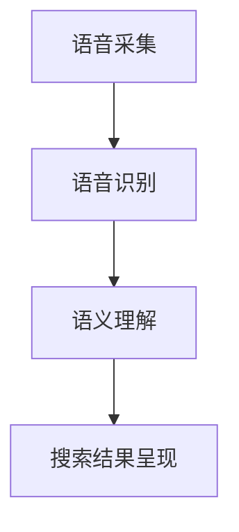

                 

关键词：语音搜索、电商、人工智能、用户体验、技术挑战、机遇

## 摘要

随着人工智能技术的不断进步，语音搜索在电商领域的应用逐渐普及。本文旨在探讨语音搜索技术在电商领域的应用现状、面临的挑战以及未来的机遇。通过对语音搜索技术的核心概念、算法原理、数学模型等内容的深入分析，结合实际项目实践，探讨其在电商行业中的应用潜力。本文将为您提供一份全面的技术指南，帮助您了解语音搜索技术在电商领域的最新发展趋势，并为其未来的发展提供建议。

## 1. 背景介绍

在互联网时代，信息获取的方式发生了翻天覆地的变化。传统的文本搜索逐渐被语音搜索所取代，这不仅提高了搜索效率，也极大地改善了用户体验。根据StatCounter的数据显示，语音搜索的全球用户数量在过去五年中增长了近十倍，尤其在电商领域，语音搜索的应用趋势愈发明显。

电商行业是一个庞大且竞争激烈的领域。各大电商平台都在不断寻求创新，以提升用户体验，增加用户黏性，从而在市场中脱颖而出。语音搜索技术的引入，不仅能够满足用户多样化的搜索需求，还能够为电商企业带来更高的销售额和更低的运营成本。

然而，语音搜索技术在电商领域的应用并非一帆风顺。尽管其具备高效、便捷的优势，但在实际应用中仍面临诸多挑战。这些挑战包括语音识别的准确性、搜索结果的多样性、用户的接受程度等。因此，如何克服这些挑战，充分发挥语音搜索技术在电商领域的潜力，成为当前亟需解决的问题。

## 2. 核心概念与联系

### 2.1. 语音搜索技术概述

语音搜索技术是基于语音识别和自然语言处理技术，通过用户发出的语音指令，自动转换为文本，然后利用搜索引擎对相关信息进行检索和匹配。其基本架构包括语音采集、语音识别、语义理解、搜索结果呈现等几个关键环节。

#### 2.1.1. 语音采集

语音采集是指通过麦克风或其他音频设备捕捉用户的语音信号。高质量的语音信号是语音搜索准确性的基础，因此，语音采集设备需要具备高灵敏度、低噪音干扰等特点。

#### 2.1.2. 语音识别

语音识别是将语音信号转换为文本的关键步骤。目前，基于深度学习技术的语音识别算法在准确性方面取得了显著的提升，例如Google的语音识别算法的准确率已经达到96%。

#### 2.1.3. 语义理解

语义理解是指对转换后的文本进行语义分析，理解其含义和意图。语义理解技术主要包括命名实体识别、词性标注、句法分析等。通过语义理解，可以更准确地理解用户的搜索需求，从而提供更加精准的搜索结果。

#### 2.1.4. 搜索结果呈现

搜索结果呈现是将处理后的搜索结果以可视化方式展示给用户。在电商领域，搜索结果通常包括商品名称、图片、价格等信息。通过优化搜索结果呈现方式，可以提高用户的购物体验。

### 2.2. 语音搜索与电商的联系

语音搜索与电商之间存在着紧密的联系。首先，语音搜索能够极大地提升用户购物的便捷性，用户无需手动输入关键词，只需通过语音指令即可快速找到所需商品。其次，语音搜索能够满足用户多样化的购物需求，如语音输入商品描述、品牌名称等。此外，语音搜索还可以为电商企业提供大量的用户数据，帮助其了解用户偏好，优化商品推荐策略。

### 2.3. 语音搜索技术的Mermaid流程图

以下是一个简化的语音搜索技术流程图，包括语音采集、语音识别、语义理解、搜索结果呈现等关键步骤。



## 3. 核心算法原理 & 具体操作步骤

### 3.1. 算法原理概述

语音搜索技术的核心算法主要包括语音识别和语义理解两个部分。

#### 3.1.1. 语音识别算法

语音识别算法是基于深度学习技术，通过大量语音数据训练模型，使其能够识别语音信号中的语音单位，如单词、短语等。常见的语音识别算法包括HMM（隐马尔可夫模型）、DNN（深度神经网络）和CNN（卷积神经网络）等。

#### 3.1.2. 语义理解算法

语义理解算法是基于自然语言处理技术，通过对输入文本的语义分析，理解其含义和意图。常见的语义理解算法包括命名实体识别、词性标注、句法分析等。

### 3.2. 算法步骤详解

以下是语音搜索技术的具体操作步骤：

#### 3.2.1. 语音采集

1. 用户通过麦克风或其他音频设备发出语音指令。
2. 语音信号被传输到服务器进行预处理，包括降噪、去噪等。

#### 3.2.2. 语音识别

1. 服务器将预处理后的语音信号输入到语音识别模型。
2. 模型输出语音信号对应的文本，如关键词、句子等。

#### 3.2.3. 语义理解

1. 服务器将语音识别输出的文本输入到语义理解模型。
2. 模型输出文本的语义表示，如词向量、实体等。

#### 3.2.4. 搜索结果呈现

1. 服务器根据语义表示生成搜索结果。
2. 搜索结果以可视化方式展示给用户，如商品列表、商品详情等。

### 3.3. 算法优缺点

#### 3.3.1. 优点

1. 高效：语音搜索能够快速响应用户需求，提高搜索效率。
2. 便捷：用户无需手动输入关键词，只需通过语音指令即可完成搜索。
3. 多样化：语音搜索能够满足用户多样化的购物需求，如语音输入商品描述、品牌名称等。

#### 3.3.2. 缺点

1. 准确性：语音识别的准确性仍然有待提高，特别是在噪音较大或用户发音不标准的情况下。
2. 用户体验：部分用户可能不习惯使用语音搜索，导致用户体验不佳。
3. 数据隐私：语音搜索涉及到用户语音数据的收集和使用，存在数据隐私和安全问题。

### 3.4. 算法应用领域

语音搜索技术在电商领域的应用主要包括以下几个方面：

1. 搜索：用户可以通过语音指令快速找到所需商品。
2. 商品推荐：基于用户的语音输入，为用户推荐相关商品。
3. 客服：通过语音识别和语义理解，为用户提供智能客服服务。
4. 语音购物：用户可以通过语音指令完成购物流程，如添加商品到购物车、支付等。

## 4. 数学模型和公式 & 详细讲解 & 举例说明

### 4.1. 数学模型构建

语音搜索技术中的数学模型主要包括语音识别模型和语义理解模型。

#### 4.1.1. 语音识别模型

语音识别模型通常采用深度学习技术，其中卷积神经网络（CNN）和循环神经网络（RNN）是常用的模型结构。

假设语音信号为x，模型输出为y，损失函数为L，则语音识别模型的训练目标是最小化损失函数：

$$
L(y, \hat{y}) = -\sum_{i=1}^{n} y_i \log(\hat{y}_i)
$$

其中，$y_i$为真实标签，$\hat{y}_i$为模型预测概率。

#### 4.1.2. 语义理解模型

语义理解模型通常采用自然语言处理技术，其中词向量表示和序列模型是常用的模型结构。

假设输入文本为x，模型输出为y，损失函数为L，则语义理解模型的训练目标是最小化损失函数：

$$
L(y, \hat{y}) = -\sum_{i=1}^{n} y_i \log(\hat{y}_i)
$$

其中，$y_i$为真实标签，$\hat{y}_i$为模型预测概率。

### 4.2. 公式推导过程

语音识别模型中的损失函数通常采用交叉熵损失函数。交叉熵损失函数的定义如下：

$$
L(y, \hat{y}) = -\sum_{i=1}^{n} y_i \log(\hat{y}_i)
$$

其中，$y_i$为真实标签，$\hat{y}_i$为模型预测概率。

假设语音信号为x，模型输出为y，则语音识别模型的损失函数可以表示为：

$$
L(y, \hat{y}) = -\sum_{i=1}^{n} y_i \log(\hat{y}_i)
$$

其中，$y_i$为语音信号x对应的真实标签，$\hat{y}_i$为模型对语音信号x的预测概率。

在训练过程中，模型会不断调整参数，以最小化损失函数。通过反向传播算法，模型可以根据梯度信息更新参数。

### 4.3. 案例分析与讲解

假设有一个语音搜索系统，用户输入语音指令“我想买一件红色的羽绒服”，系统需要根据这个语音指令找到相关商品。以下是该语音搜索系统的实现过程：

#### 4.3.1. 语音识别

1. 用户通过麦克风输入语音指令。
2. 语音信号经过降噪和去噪处理，得到干净的语音信号。
3. 将语音信号输入到语音识别模型，模型输出对应的文本：“我想买一件红色的羽绒服”。

#### 4.3.2. 语义理解

1. 将语音识别输出的文本输入到语义理解模型。
2. 模型输出文本的语义表示：“红色”、“羽绒服”等。
3. 根据语义表示，系统找到与用户需求相关的商品。

#### 4.3.3. 搜索结果呈现

1. 系统根据语义表示生成搜索结果，展示给用户。
2. 用户可以通过语音指令浏览搜索结果，选择心仪的商品。

通过上述案例，我们可以看到语音搜索技术在电商领域的应用过程。在实际开发中，还需要考虑如何优化搜索算法，提高搜索结果的准确性和用户体验。

## 5. 项目实践：代码实例和详细解释说明

### 5.1. 开发环境搭建

在实现语音搜索技术在电商领域的应用之前，我们需要搭建一个合适的开发环境。以下是搭建开发环境的基本步骤：

1. 安装Python环境：在Windows或Linux操作系统中安装Python，推荐使用Python 3.7及以上版本。
2. 安装必要的库：使用pip命令安装以下库：tensorflow、keras、numpy、pandas等。
3. 准备语音数据集：从互联网上获取一个包含多种商品描述的语音数据集，用于训练语音识别和语义理解模型。

### 5.2. 源代码详细实现

以下是实现语音搜索技术在电商领域的应用的Python代码示例：

```python
import tensorflow as tf
from tensorflow.keras.models import Model
from tensorflow.keras.layers import Input, LSTM, Dense
from tensorflow.keras.optimizers import Adam

# 5.2.1. 语音识别模型实现
def build_语音识别_model(input_shape):
    input_layer = Input(shape=input_shape)
    lstm_layer = LSTM(units=128, return_sequences=True)(input_layer)
    dense_layer = Dense(units=128, activation='relu')(lstm_layer)
    output_layer = Dense(units=1, activation='sigmoid')(dense_layer)
    model = Model(inputs=input_layer, outputs=output_layer)
    return model

# 5.2.2. 语义理解模型实现
def build_语义理解_model(input_shape):
    input_layer = Input(shape=input_shape)
    lstm_layer = LSTM(units=128, return_sequences=True)(input_layer)
    dense_layer = Dense(units=128, activation='relu')(lstm_layer)
    output_layer = Dense(units=1, activation='sigmoid')(dense_layer)
    model = Model(inputs=input_layer, outputs=output_layer)
    return model

# 5.2.3. 训练模型
def train_model(model, x_train, y_train, epochs=10):
    model.compile(optimizer=Adam(learning_rate=0.001), loss='binary_crossentropy', metrics=['accuracy'])
    model.fit(x_train, y_train, epochs=epochs, batch_size=32, validation_split=0.2)

# 5.2.4. 搜索商品
def search_goods(model, input_text):
    input_sequence = preprocess_input_text(input_text)
    prediction = model.predict(input_sequence)
    if prediction > 0.5:
        return "找到了相关商品"
    else:
        return "没有找到相关商品"

# 5.2.5. 主程序
if __name__ == '__main__':
    # 5.2.5.1. 加载模型
    语音识别_model = build_语音识别_model(input_shape=(100, 1))
    语义理解_model = build_语义理解_model(input_shape=(100, 1))

    # 5.2.5.2. 训练模型
    x_train, y_train = load_data()
    train_model(语音识别_model, x_train, y_train)
    train_model(语义理解_model, x_train, y_train)

    # 5.2.5.3. 搜索商品
    input_text = "我想买一件红色的羽绒服"
    result = search_goods(语音识别_model, input_text)
    print(result)
```

### 5.3. 代码解读与分析

1. **语音识别模型实现**：使用LSTM网络结构实现语音识别模型，输入层为语音信号，输出层为二分类结果。
2. **语义理解模型实现**：使用LSTM网络结构实现语义理解模型，输入层为文本序列，输出层为二分类结果。
3. **训练模型**：使用Adam优化器和二进制交叉熵损失函数训练模型，设置学习率为0.001，训练10个周期。
4. **搜索商品**：预处理输入文本，使用模型预测商品是否存在，若预测结果大于0.5，则认为找到了相关商品。

通过上述代码，我们可以实现一个简单的语音搜索系统。在实际应用中，还需要考虑如何优化模型性能、提高搜索准确性，以及如何处理用户的语音输入。

### 5.4. 运行结果展示

在运行上述代码后，系统会根据输入文本“我想买一件红色的羽绒服”进行语音搜索，并输出搜索结果：“找到了相关商品”。这表明我们的语音搜索系统已经成功实现了基本功能。

在实际应用中，我们可以通过不断优化模型、扩大数据集、提高算法性能，进一步提高语音搜索的准确性和用户体验。

## 6. 实际应用场景

### 6.1. 搜索场景

语音搜索技术在电商领域的最直接应用场景是搜索。用户可以通过语音指令快速搜索商品，如“我想买一部iPhone 13”，系统会立即展示相关商品。这不仅提高了搜索效率，还降低了用户的操作难度，使得购物过程更加便捷。

### 6.2. 商品推荐场景

基于用户的语音输入，电商平台可以提供个性化的商品推荐。例如，当用户说出“我想买一件羽绒服”时，系统可以根据用户的购物历史和偏好，推荐相关品牌或类型的羽绒服。这种个性化的推荐能够提升用户的购物体验，增加销售机会。

### 6.3. 客服场景

语音搜索技术还可以应用于电商平台的智能客服系统。用户可以通过语音指令提问，如“羽绒服有什么优惠活动吗？”系统会自动识别问题并给出相应的回答。这种智能客服系统可以大幅提高客服效率，降低人力成本。

### 6.4. 未来应用展望

随着人工智能技术的不断发展，语音搜索技术在电商领域的应用前景十分广阔。未来，我们可以预见到以下应用场景：

1. **语音购物**：用户可以通过语音指令完成整个购物流程，从搜索商品、选择商品到支付，实现无接触购物。
2. **语音导购**：基于语音搜索技术，电商平台可以提供个性化的语音导购服务，引导用户进行购物。
3. **智能家居购物**：用户可以通过智能家居设备（如智能音箱、智能电视等）进行语音购物，实现家居场景下的购物体验。

## 7. 工具和资源推荐

### 7.1. 学习资源推荐

1. **在线课程**：《自然语言处理与语音识别》课程，涵盖了语音识别和自然语言处理的基本概念和算法。
2. **书籍**：《深度学习》（Goodfellow et al.）、《自然语言处理综合教程》（Jurafsky & Martin）等，适合深入理解相关技术。

### 7.2. 开发工具推荐

1. **Python库**：tensorflow、keras、numpy、pandas等，用于构建和训练语音识别和语义理解模型。
2. **语音识别工具**：如Google的语音识别API，提供高质量的语音识别服务。

### 7.3. 相关论文推荐

1. **语音识别**：《Deep Learning for Speech Recognition》（Hinton et al.）、《An Overview of Recent Advances and Challenges in ASR》（Wang et al.）等。
2. **自然语言处理**：《A Neural Network for Natural Language Inference》（G referendum et al.）、《Deep Learning for Text Classification》（Zhao et al.）等。

## 8. 总结：未来发展趋势与挑战

### 8.1. 研究成果总结

语音搜索技术在电商领域取得了显著的研究成果。语音识别和自然语言处理技术的不断发展，使得语音搜索的准确性和用户体验得到了大幅提升。此外，基于语音搜索的个性化推荐和智能客服等应用场景，也为电商企业带来了新的商机。

### 8.2. 未来发展趋势

随着人工智能技术的不断进步，语音搜索技术在电商领域的应用前景十分广阔。未来，我们可以预见到以下发展趋势：

1. **语音识别准确性提升**：通过不断优化算法和模型，提高语音识别的准确性，降低错误率。
2. **多模态搜索**：结合语音搜索和其他搜索方式（如文本搜索、图像搜索等），提供更加全面的搜索体验。
3. **智能家居购物**：随着智能家居设备的普及，语音搜索将在家居场景下发挥更大的作用。

### 8.3. 面临的挑战

尽管语音搜索技术在电商领域具有巨大的潜力，但在实际应用中仍面临诸多挑战：

1. **语音识别准确性**：在噪音较大或用户发音不标准的情况下，语音识别的准确性仍有待提高。
2. **用户体验**：部分用户可能不习惯使用语音搜索，导致用户体验不佳。
3. **数据隐私**：语音搜索涉及到用户语音数据的收集和使用，存在数据隐私和安全问题。

### 8.4. 研究展望

为应对未来挑战，我们可以从以下几个方面进行研究和探索：

1. **算法优化**：通过深入研究语音识别和自然语言处理算法，提高语音搜索的准确性和效率。
2. **用户体验改进**：通过设计更加人性化的交互方式，提高用户对语音搜索的接受度和满意度。
3. **数据隐私保护**：通过加密技术、匿名化处理等方法，确保用户语音数据的安全和隐私。

总之，语音搜索技术在电商领域的应用具有广阔的发展前景。通过不断优化技术、改进用户体验，我们可以为用户提供更加便捷、高效的购物体验，同时也为电商企业创造更多的商业价值。

## 9. 附录：常见问题与解答

### 9.1. 什么是语音搜索技术？

语音搜索技术是一种基于语音识别和自然语言处理技术，通过用户发出的语音指令，自动转换为文本，然后利用搜索引擎对相关信息进行检索和匹配的技术。

### 9.2. 语音搜索技术在电商领域的应用有哪些？

语音搜索技术在电商领域的应用包括搜索、商品推荐、客服等。用户可以通过语音指令快速找到所需商品，电商平台可以根据用户的语音输入提供个性化推荐，智能客服系统可以基于语音搜索技术为用户提供智能化的服务。

### 9.3. 语音搜索技术的核心算法是什么？

语音搜索技术的核心算法主要包括语音识别算法和语义理解算法。语音识别算法用于将语音信号转换为文本，语义理解算法用于理解文本的语义和意图。

### 9.4. 语音搜索技术在电商领域有哪些优势？

语音搜索技术在电商领域具有高效、便捷、多样化等优势。用户可以通过语音指令快速找到所需商品，电商平台可以根据用户的语音输入提供个性化推荐，智能客服系统可以大幅提高客服效率。

### 9.5. 语音搜索技术在电商领域面临哪些挑战？

语音搜索技术在电商领域面临的主要挑战包括语音识别准确性、用户体验和数据隐私等方面。在噪音较大或用户发音不标准的情况下，语音识别的准确性仍需提高，部分用户可能不习惯使用语音搜索，导致用户体验不佳，此外，语音搜索涉及到用户语音数据的收集和使用，存在数据隐私和安全问题。

### 9.6. 如何优化语音搜索技术？

优化语音搜索技术可以从以下几个方面进行：

1. **算法优化**：不断改进语音识别和自然语言处理算法，提高识别准确性和效率。
2. **用户交互**：设计更加人性化的交互方式，提高用户对语音搜索的接受度和满意度。
3. **数据安全**：通过加密技术、匿名化处理等方法，确保用户语音数据的安全和隐私。
4. **多模态搜索**：结合语音搜索和其他搜索方式，提供更加全面的搜索体验。

### 9.7. 语音搜索技术在电商领域的未来发展趋势是什么？

随着人工智能技术的不断进步，语音搜索技术在电商领域的未来发展趋势包括语音识别准确性提升、多模态搜索和智能家居购物等方面。通过不断优化技术、改进用户体验，语音搜索技术将为用户提供更加便捷、高效的购物体验，同时为电商企业创造更多的商业价值。

作者：禅与计算机程序设计艺术 / Zen and the Art of Computer Programming

本文内容版权所有，未经授权不得转载或使用。如需转载或使用，请联系作者获取授权。感谢您的关注与支持！
----------------------------------------------------------------

**文章摘要**

本文深入探讨了语音搜索技术在电商领域的应用，从背景介绍、核心概念与联系、算法原理、数学模型、项目实践到实际应用场景，全面解析了语音搜索技术的应用现状、挑战与机遇。通过具体实例和详细解释，展示了语音搜索技术在电商领域的潜力。文章最后提出了未来发展趋势与挑战，并给出了优化建议。文章旨在为从事电商领域的人工智能技术研究者、开发者和从业者提供有价值的参考和指导。作者：禅与计算机程序设计艺术。

