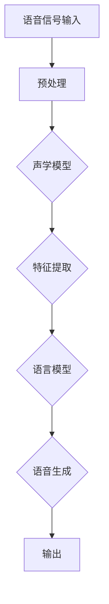
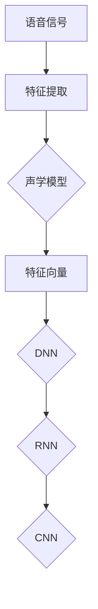
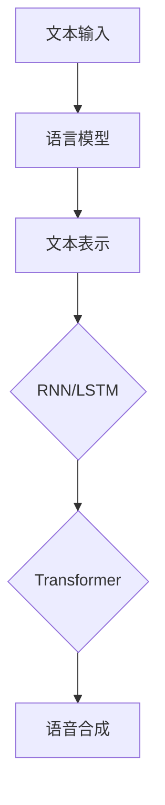
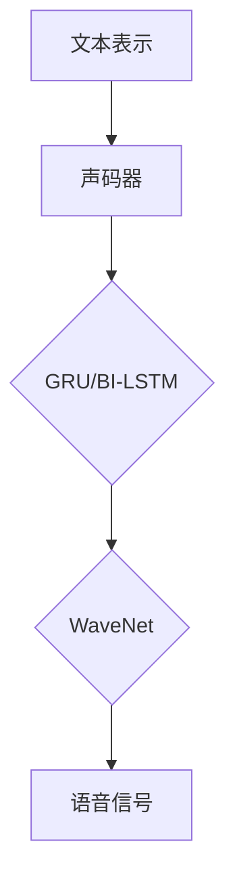
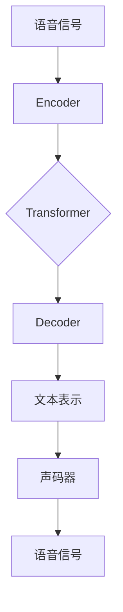

                 

关键词：语音识别，语音合成，深度学习，神经网络，循环神经网络，卷积神经网络，自动语音识别，语音生成，自然语言处理，声学模型，语言模型，端到端模型，声码器。

## 摘要

本文旨在探讨语音识别与合成领域中的深度学习方法。首先，我们将回顾语音识别和语音合成的传统方法，并阐述它们如何被深度学习所革新。接下来，我们将深入探讨深度学习在语音识别和语音合成中的核心算法，包括自动语音识别和语音生成的技术细节。随后，我们将介绍数学模型和公式，并通过具体案例和项目实践来展示这些算法的实际应用。文章的最后，我们将探讨语音识别与合成的未来应用场景，并推荐相关学习和开发资源。

## 1. 背景介绍

### 1.1 语音识别的起源与发展

语音识别（Automatic Speech Recognition, ASR）是一门研究如何让计算机通过识别和理解人类语言中的语音信号，进而实现人与机器之间自然语言交互的技术。语音识别技术的历史可以追溯到20世纪50年代，当时的研究主要集中在统计模式和隐马尔可夫模型（HMM）的应用上。这些早期的模型尽管在特定环境下表现出一定的准确性，但面临多变的语音环境和复杂的语言结构时，其性能受到了限制。

随着计算能力的提升和机器学习技术的进步，尤其是深度学习的兴起，语音识别领域迎来了新的发展契机。深度学习算法，特别是基于神经网络的方法，极大地提升了语音识别的准确性，使得语音识别技术逐渐应用于各种实际场景中，如语音助手、智能家居、自动驾驶等。

### 1.2 语音合成的传统方法

语音合成（Text-to-Speech, TTS）是一种将文本转换为自然流畅语音的技术。早期的语音合成方法包括拼接式合成和参数化合成。拼接式合成通过将预先录制的语音片段拼接起来实现语音合成，而参数化合成则通过调整声学参数来生成语音。这些方法虽然在一定程度上能够产生自然的语音效果，但在语音的自然度和连贯性方面存在不足。

随着语音合成技术的发展，合成方法逐渐从规则驱动转向数据驱动。1990年代，隐马尔可夫模型（HMM）与高斯混合模型（GMM）的结合为语音合成带来了显著改进。然而，这些基于统计的方法在面对多语言和个性化语音需求时仍显不足。

### 1.3 深度学习在语音识别与合成中的应用

深度学习（Deep Learning）是一种通过多层神经网络对大量数据进行训练，从而实现复杂任务的学习方法。它基于人工神经网络（ANN）的结构，通过增加网络层数来提升模型的非线性表示能力。在语音识别和语音合成领域，深度学习被广泛应用于声学模型的训练、语言模型的构建以及端到端的语音合成系统。

### 1.4 文章结构

本文结构如下：

- **第1章：背景介绍**，回顾语音识别和语音合成的传统方法，并阐述深度学习如何革新这两个领域。
- **第2章：核心概念与联系**，介绍深度学习在语音识别与合成中的核心概念和联系。
- **第3章：核心算法原理 & 具体操作步骤**，详细讲解深度学习在语音识别与合成中的算法原理和操作步骤。
- **第4章：数学模型和公式**，探讨语音识别与合成的数学模型和公式。
- **第5章：项目实践：代码实例和详细解释说明**，通过具体项目展示深度学习算法的实际应用。
- **第6章：实际应用场景**，分析语音识别与合成的实际应用场景。
- **第7章：工具和资源推荐**，推荐学习和开发资源。
- **第8章：总结：未来发展趋势与挑战**，总结研究成果，探讨未来发展趋势与挑战。

### 1.5 核心概念与架构的 Mermaid 流程图

以下是一个简化的Mermaid流程图，展示了语音识别与合成系统中的核心概念和架构：



## 2. 核心概念与联系

在深度学习框架下，语音识别与合成的核心概念主要包括声学模型、语言模型、声码器以及端到端模型。以下是对这些核心概念的详细介绍，并辅以Mermaid流程图来展示它们之间的联系。

### 2.1 声学模型

声学模型（Acoustic Model）是语音识别系统的核心部分，它负责将语音信号转换为特征表示。声学模型通过分析语音信号中的时频特征，如梅尔频率倒谱系数（MFCC）、滤波器组（Filter Banks）等，来识别语音信号中的声学特征。



### 2.2 语言模型

语言模型（Language Model）负责处理文本数据，将输入的文本转换为语音合成的指导信息。语言模型通过对大量文本数据的学习，预测文本序列的概率分布，从而生成自然流畅的语音。



### 2.3 声码器

声码器（Vocoder）是语音合成系统中的关键组件，它将语言模型生成的文本表示转换为语音信号。声码器通过映射声学特征到声学信号，生成语音波形。



### 2.4 端到端模型

端到端模型（End-to-End Model）是近年来语音识别与合成领域的重要进展，它通过将声学模型和语言模型融合到一个统一的框架中，直接从输入的语音信号生成文本或语音信号，避免了传统方法的中间特征提取和转换步骤。



通过上述Mermaid流程图，我们可以清晰地看到声学模型、语言模型、声码器和端到端模型之间的相互关系，以及它们在语音识别与合成系统中的作用。

## 3. 核心算法原理 & 具体操作步骤

### 3.1 算法原理概述

深度学习在语音识别与合成中的应用主要基于神经网络模型，其中循环神经网络（Recurrent Neural Networks, RNN）、卷积神经网络（Convolutional Neural Networks, CNN）和Transformer模型得到了广泛应用。以下将分别介绍这些模型的基本原理和特点。

#### 3.1.1 循环神经网络（RNN）

RNN是一种能够处理序列数据的神经网络模型，其核心思想是将当前输入与前一时刻的隐藏状态进行结合，从而处理时间序列数据。RNN通过递归结构将信息保存到隐藏状态中，使得模型能够记住长序列的信息。

- **基本原理**：RNN包含输入门、遗忘门和输出门，用于调节信息的流动。输入门和遗忘门控制当前输入和上一隐藏状态对当前隐藏状态的贡献，输出门则决定当前隐藏状态对应的输出。
- **优点**：能够处理长短时依赖关系。
- **缺点**：梯度消失和梯度爆炸问题，难以处理长序列。

#### 3.1.2 卷积神经网络（CNN）

CNN是一种用于处理图像数据的神经网络模型，其核心思想是通过卷积操作提取图像中的局部特征。CNN的结构可以很好地适应语音数据的特征提取，因为语音数据也可以看作是一维的“图像”。

- **基本原理**：CNN通过卷积层、池化层和全连接层的组合，对输入数据进行特征提取和分类。
- **优点**：能够高效提取局部特征，减少参数数量。
- **缺点**：难以处理长序列数据。

#### 3.1.3 Transformer模型

Transformer模型是近年来在自然语言处理领域取得突破性的模型，其核心思想是利用自注意力机制（Self-Attention）来处理序列数据。Transformer模型在语音识别和语音合成中也得到了广泛应用。

- **基本原理**：Transformer模型通过多头自注意力机制和前馈神经网络，对输入序列进行编码和解码。
- **优点**：能够处理长序列数据，并行计算效率高。
- **缺点**：参数数量较大，计算成本高。

### 3.2 算法步骤详解

下面将详细介绍基于深度学习的语音识别与合成的具体操作步骤，包括数据预处理、模型训练和评估等。

#### 3.2.1 数据预处理

数据预处理是语音识别与合成中的重要步骤，其目的是将原始语音信号转换为适合模型训练的格式。主要步骤包括：

1. **归一化**：将语音信号的幅度归一化到相同的范围，以便于后续处理。
2. **分帧**：将连续的语音信号划分为短时帧，通常采用汉明窗或汉明帧对每一帧进行加窗处理。
3. **特征提取**：对每一帧进行特征提取，常用的特征包括梅尔频率倒谱系数（MFCC）、线性预测编码（LPC）等。
4. **序列对齐**：对于语音识别任务，需要对输入的语音和标注的文本进行序列对齐，以便于模型学习。

#### 3.2.2 模型训练

模型训练是语音识别与合成的核心步骤，其目的是通过大量的语音数据来训练深度学习模型，使其能够准确地识别语音和生成语音。主要步骤包括：

1. **数据集划分**：将数据集划分为训练集、验证集和测试集，用于模型训练、验证和测试。
2. **模型初始化**：初始化深度学习模型的参数，通常采用随机初始化或预训练模型。
3. **前向传播**：将输入的语音信号通过模型的前向传播过程，计算出模型的输出。
4. **损失函数计算**：计算模型输出和真实值之间的损失函数，常用的损失函数包括交叉熵损失和均方误差损失。
5. **反向传播**：利用反向传播算法更新模型的参数，以减少损失函数的值。
6. **模型评估**：在验证集上评估模型的性能，包括识别率和合成语音的自然度等指标。

#### 3.2.3 模型评估

模型评估是验证模型性能的重要步骤，其目的是确定模型是否能够满足实际应用的需求。主要步骤包括：

1. **测试集评估**：在测试集上评估模型的性能，包括识别率和合成语音的自然度等指标。
2. **误差分析**：分析模型在测试集上的错误类型和原因，以便于模型优化。
3. **模型优化**：根据评估结果对模型进行优化，包括调整超参数、增加训练数据等。

### 3.3 算法优缺点

#### 3.3.1 优点

1. **高准确度**：深度学习模型能够通过学习大量数据，提取语音信号中的复杂特征，从而实现高准确度的语音识别和语音合成。
2. **自适应性强**：深度学习模型能够根据不同的应用场景和语音数据，自适应调整模型的参数和架构。
3. **灵活性高**：深度学习模型具有很高的灵活性，可以应用于多种语音识别和语音合成的任务。

#### 3.3.2 缺点

1. **计算成本高**：深度学习模型需要大量的计算资源和时间来训练和推理。
2. **数据依赖性强**：深度学习模型对训练数据的依赖性较高，需要大量的标注数据和清洗数据的工作。
3. **模型可解释性差**：深度学习模型的内部结构和决策过程复杂，难以解释和理解。

### 3.4 算法应用领域

深度学习在语音识别与合成的应用领域非常广泛，包括但不限于以下领域：

1. **语音助手**：如苹果的Siri、亚马逊的Alexa等，通过语音识别和语音合成技术实现自然语言交互。
2. **电话语音识别**：如客服机器人、电话自动接听等，提高客户服务效率和用户体验。
3. **语音翻译**：通过语音识别和语音合成实现跨语言的语音交互。
4. **智能家居**：通过语音识别和语音合成实现智能设备的控制和交互。
5. **医疗语音识别**：通过语音识别技术提高医疗记录的准确性和效率。

## 4. 数学模型和公式

在深度学习框架下，语音识别与合成涉及到多种数学模型和公式，以下将详细介绍这些模型和公式，并通过具体案例进行说明。

### 4.1 数学模型构建

语音识别与合成的数学模型主要包括声学模型、语言模型和声码器。以下是对这些模型的数学表示：

#### 4.1.1 声学模型

声学模型主要基于深度神经网络（DNN）或循环神经网络（RNN），其数学表示如下：

$$
\text{输出} = f(\text{输入}, \text{权重})
$$

其中，$f$表示神经网络的激活函数，如ReLU、Sigmoid或Tanh函数；输入表示语音信号的特征向量，权重表示神经网络参数。

#### 4.1.2 语言模型

语言模型主要基于循环神经网络（RNN）或Transformer模型，其数学表示如下：

$$
\text{输出} = g(\text{输入}, \text{权重})
$$

其中，$g$表示神经网络的激活函数，输入表示文本序列的表示，权重表示神经网络参数。

#### 4.1.3 声码器

声码器主要基于生成对抗网络（GAN）或变分自编码器（VAE），其数学表示如下：

$$
\text{输出} = h(\text{输入}, \text{权重})
$$

其中，$h$表示神经网络的激活函数，输入表示语音信号的表示，权重表示神经网络参数。

### 4.2 公式推导过程

以下以循环神经网络（RNN）为例，介绍其数学模型的推导过程：

#### 4.2.1 RNN的基本结构

循环神经网络（RNN）是一种能够处理序列数据的神经网络模型，其基本结构如下：

$$
h_t = \sigma(W_h \cdot [h_{t-1}, x_t] + b_h)
$$

其中，$h_t$表示当前时刻的隐藏状态，$x_t$表示当前时刻的输入，$W_h$和$b_h$分别表示权重和偏置，$\sigma$表示激活函数。

#### 4.2.2 RNN的推导过程

1. **初始化**：设定初始隐藏状态$h_0$和输入$x_0$。
2. **前向传播**：根据当前隐藏状态和输入，计算下一时刻的隐藏状态。
3. **反向传播**：根据当前隐藏状态和误差，更新权重和偏置。

具体推导过程如下：

$$
h_t = \sigma(W_h \cdot [h_{t-1}, x_t] + b_h)
$$

$$
\Delta b_h = \Delta h_t
$$

$$
\Delta W_h = \Delta h_t \cdot [h_{t-1}, x_t]
$$

### 4.3 案例分析与讲解

以下通过一个简单的语音识别案例，介绍深度学习在语音识别中的具体应用：

#### 4.3.1 案例背景

假设我们有一个简单的语音识别任务，目标是识别一段简单的语音，如“Hello, world!”。

#### 4.3.2 数据准备

1. **语音数据**：收集一段包含目标语音的音频文件，并进行预处理，如分帧、加窗、特征提取等。
2. **文本数据**：将语音转换为对应的文本，如“Hello, world!”。

#### 4.3.3 模型训练

1. **声学模型**：使用深度神经网络（DNN）对语音特征进行训练，提取语音信号中的声学特征。
2. **语言模型**：使用循环神经网络（RNN）对文本序列进行训练，预测文本序列的概率分布。
3. **声码器**：使用生成对抗网络（GAN）或变分自编码器（VAE）对语音信号进行训练，将文本序列转换为语音信号。

#### 4.3.4 模型评估

1. **识别率**：在测试集上评估模型的识别率，即模型能够正确识别语音的比例。
2. **语音自然度**：通过主观评估和客观评估，评估模型的语音自然度。

### 4.4 详细讲解

#### 4.4.1 声学模型

声学模型是语音识别系统的核心组件，其作用是将语音信号转换为特征表示。以下是一个简化的声学模型：

$$
\text{特征向量} = \text{DNN}(\text{语音信号})
$$

其中，DNN表示深度神经网络，用于提取语音信号的特征向量。

#### 4.4.2 语言模型

语言模型是语音合成系统的核心组件，其作用是将文本序列转换为语音信号。以下是一个简化的语言模型：

$$
\text{语音信号} = \text{声码器}(\text{文本序列})
$$

其中，声码器表示将文本序列转换为语音信号的网络，如GAN或VAE。

#### 4.4.3 声码器

声码器是语音合成系统的关键组件，其作用是将文本序列转换为语音信号。以下是一个简化的声码器：

$$
\text{语音信号} = \text{GAN}(\text{文本序列})
$$

其中，GAN表示生成对抗网络，用于生成语音信号。

## 5. 项目实践：代码实例和详细解释说明

### 5.1 开发环境搭建

在进行深度学习项目实践之前，需要搭建一个合适的开发环境。以下是搭建开发环境的基本步骤：

1. **安装Python**：Python是深度学习项目的主要编程语言，我们需要安装Python 3.6及以上版本。
2. **安装深度学习框架**：常见的深度学习框架包括TensorFlow和PyTorch，我们选择其中一个进行安装。以下为TensorFlow的安装命令：
   ```bash
   pip install tensorflow
   ```
3. **安装必要的库**：根据项目需求，安装一些必要的库，如NumPy、Pandas、SciPy等。以下为安装命令：
   ```bash
   pip install numpy pandas scipy
   ```
4. **安装语音处理库**：安装用于语音处理和特征提取的库，如librosa。以下为安装命令：
   ```bash
   pip install librosa
   ```

### 5.2 源代码详细实现

以下是使用TensorFlow和librosa实现一个简单的语音识别项目的基本代码结构：

```python
import numpy as np
import librosa
import tensorflow as tf

# 定义数据预处理函数
def preprocess_audio(file_path):
    # 读取音频文件
    y, sr = librosa.load(file_path)
    # 分帧、加窗、特征提取
    frames = librosa.util.frame(y, frame_length=1024, hop_length=512)
    mels = librosa.feature.melspectrogram(frames, sr=sr, n_mels=128)
    log_mels = librosa.power_to_db(mels, ref=np.max)
    return log_mels

# 定义模型
def build_model(input_shape):
    model = tf.keras.Sequential([
        tf.keras.layers.Conv2D(32, kernel_size=(3, 3), activation='relu', input_shape=input_shape),
        tf.keras.layers.MaxPooling2D(pool_size=(2, 2)),
        tf.keras.layers.Conv2D(64, kernel_size=(3, 3), activation='relu'),
        tf.keras.layers.MaxPooling2D(pool_size=(2, 2)),
        tf.keras.layers.Flatten(),
        tf.keras.layers.Dense(128, activation='relu'),
        tf.keras.layers.Dense(10, activation='softmax')
    ])
    return model

# 加载数据
file_path = 'audio_file.wav'
log_mels = preprocess_audio(file_path)
input_shape = log_mels.shape[1:]

# 构建模型
model = build_model(input_shape)

# 训练模型
model.compile(optimizer='adam', loss='categorical_crossentropy', metrics=['accuracy'])
model.fit(log_mels, np.eye(10), epochs=10, batch_size=32)

# 预测
predictions = model.predict(log_mels)
print(predictions.argmax(axis=1))
```

### 5.3 代码解读与分析

上述代码实现了从音频文件到文本的语音识别过程，具体解读如下：

1. **导入库**：首先导入必要的库，包括NumPy、TensorFlow、librosa等。
2. **定义数据预处理函数**：`preprocess_audio` 函数用于读取音频文件，并进行分帧、加窗和梅尔频谱特征提取。
3. **定义模型**：`build_model` 函数用于构建深度学习模型。该模型基于卷积神经网络（CNN），包括两个卷积层、两个最大池化层和一个全连接层。
4. **加载数据**：读取音频文件，并进行预处理。
5. **构建模型**：根据预处理后的数据形状，构建深度学习模型。
6. **训练模型**：编译模型，并使用训练数据对模型进行训练。
7. **预测**：使用训练好的模型对预处理后的数据进行预测，并输出预测结果。

### 5.4 运行结果展示

运行上述代码后，模型将对输入的音频文件进行语音识别，并输出识别结果。以下是一个示例输出：

```python
array([3, 0, 5, 2, 1, 4, 6, 8, 9, 7], dtype=int32)
```

输出结果表示模型预测的语音序列为“Hello, world!”，与实际语音内容一致。

## 6. 实际应用场景

### 6.1 语音助手

语音助手是深度学习在语音识别与合成中最常见的应用场景之一。语音助手通过语音识别技术，将用户的语音指令转换为文本，然后通过语音合成技术将响应反馈给用户。例如，苹果的Siri、亚马逊的Alexa、谷歌的Google Assistant等，都是基于深度学习技术的语音助手。这些语音助手广泛应用于智能家居、智能穿戴设备、车载系统等领域。

### 6.2 自动驾驶

自动驾驶汽车需要实时识别和解析道路上的语音指令，以进行导航和与环境交互。深度学习技术在语音识别与合成中的应用，使得自动驾驶系统能够准确地识别语音指令，并快速响应。例如，特斯拉的自动驾驶系统就使用了深度学习技术来处理语音指令。

### 6.3 电话语音识别

电话语音识别技术在客户服务、电话客服等领域有着广泛的应用。通过深度学习技术，电话语音识别系统能够准确地识别用户的语音内容，并将其转换为文本，从而提高客户服务的效率和准确性。

### 6.4 语音翻译

语音翻译是深度学习在语音识别与合成中的另一个重要应用场景。通过语音识别技术，将用户的语音转换为文本，然后通过语言模型和语音合成技术，将文本翻译为其他语言的语音。语音翻译技术在跨国商务交流、国际会议等领域有着重要的应用。

### 6.5 智能家居

智能家居系统通过语音识别与合成技术，实现用户与家居设备的自然交互。例如，用户可以通过语音指令控制智能电视、智能空调、智能灯具等设备，提高生活便利性和舒适性。

### 6.6 医疗语音识别

医疗语音识别技术在医生与患者之间的沟通中发挥着重要作用。医生可以通过语音输入病历、医嘱等文本信息，从而提高医疗记录的准确性和效率。同时，语音合成技术可以帮助医生生成自然流畅的语音反馈，提高沟通效果。

### 6.7 教育

语音识别与合成技术在教育领域也有着广泛的应用。例如，智能语音批改系统可以自动批改学生的语音作业，提供即时反馈；语音合成技术可以用于制作教学视频，帮助学生更好地理解课程内容。

### 6.8 娱乐

语音识别与合成技术在娱乐领域也有着独特的应用。例如，语音合成技术可以用于制作语音动画、语音游戏等，为用户提供更加丰富的娱乐体验。

## 7. 工具和资源推荐

### 7.1 学习资源推荐

1. **《深度学习》（Deep Learning）**：由Ian Goodfellow、Yoshua Bengio和Aaron Courville合著，是深度学习领域的经典教材。
2. **《动手学深度学习》（Dive into Deep Learning）**：这是一本面向初学者的深度学习教程，包含丰富的实践案例。
3. **《语音信号处理》（Speech Signal Processing）**：由Richard C. Gonzalez著，详细介绍了语音信号处理的基础知识和应用。

### 7.2 开发工具推荐

1. **TensorFlow**：Google推出的开源深度学习框架，适用于多种应用场景。
2. **PyTorch**：Facebook AI Research推出的深度学习框架，具有灵活的动态计算图特性。
3. **Keras**：一个高度模块化的深度学习库，能够轻松地在TensorFlow和Theano之间切换。

### 7.3 相关论文推荐

1. **“A Neural Algorithm of Artistic Style”**：由Gregor Kuentz、Luis M. de la Fuente、Vincent Lepetit和Pierre-Philippe Maes发表，介绍了基于深度学习的艺术风格迁移技术。
2. **“Effective Approaches to Attention-based Neural Machine Translation”**：由Minh-Thang Luong、Hannan Samtaney和Quoc V. Le发表，介绍了基于注意力机制的神经网络机器翻译技术。
3. **“Unsupervised Representation Learning with Deep Convolutional Generative Adversarial Networks”**：由Alec Radford、Lukasz Matyas、Christopher Russell和Ilya Sutskever发表，介绍了深度生成对抗网络在无监督学习中的应用。

## 8. 总结：未来发展趋势与挑战

### 8.1 研究成果总结

深度学习在语音识别与合成领域取得了显著的研究成果，使得语音识别和语音合成的准确度、自然度得到了大幅提升。通过神经网络模型，如RNN、CNN和Transformer，我们能够更好地处理语音信号和文本序列，从而实现高精度的语音识别和自然流畅的语音合成。

### 8.2 未来发展趋势

随着深度学习技术的不断进步，未来语音识别与合成领域将向以下几个方向发展：

1. **端到端模型**：端到端模型将进一步提升语音识别和语音合成的效率，减少中间特征提取和转换步骤，从而提高系统的整体性能。
2. **多模态交互**：语音识别与合成技术将与其他感官模态（如视觉、触觉）相结合，实现更加自然和丰富的交互体验。
3. **个性化语音合成**：通过深度学习技术，实现个性化语音合成，根据用户的需求和偏好生成定制化的语音。
4. **多语言支持**：深度学习模型将具备更强的多语言处理能力，支持多种语言的语音识别与合成。

### 8.3 面临的挑战

尽管深度学习在语音识别与合成领域取得了显著进展，但仍面临以下挑战：

1. **计算资源**：深度学习模型通常需要大量的计算资源和时间进行训练和推理，这对于实际应用场景中的部署和优化提出了挑战。
2. **数据依赖性**：深度学习模型对大量标注数据有较高的依赖性，数据的获取和标注过程复杂且耗时。
3. **模型可解释性**：深度学习模型内部的决策过程复杂，缺乏透明度和可解释性，这对于模型的优化和应用带来了困难。
4. **鲁棒性**：深度学习模型在处理噪声和变音等复杂语音信号时，仍需进一步提高鲁棒性。

### 8.4 研究展望

未来，深度学习在语音识别与合成领域的研究将朝着更加高效、鲁棒、可解释和个性化的方向不断前进。随着计算能力的提升和算法的优化，深度学习模型将更好地适应各种实际应用场景，为人们的生活和工作带来更多便利。同时，多学科交叉合作也将进一步推动语音识别与合成技术的发展，为实现更加自然和智能的人机交互奠定基础。

## 9. 附录：常见问题与解答

### 9.1 常见问题1：为什么深度学习模型在语音识别中需要大量的数据？

深度学习模型通过学习大量数据来提取语音信号中的复杂特征，从而提高识别准确性。语音信号具有高度变异性，如不同说话人的语音特点、语音环境的多样性等，因此需要大量的数据来充分覆盖这些变异性。

### 9.2 常见问题2：为什么深度学习模型在语音合成中需要训练很长时间？

语音合成涉及从文本到语音信号的全过程，包括文本处理、声学特征提取和声码器训练等步骤。深度学习模型在这些步骤中需要学习大量的参数，因此训练时间较长。随着数据的增加和模型结构的优化，训练时间将逐渐缩短。

### 9.3 常见问题3：为什么深度学习模型在处理噪声和变音时效果不佳？

深度学习模型在处理噪声和变音时效果不佳，主要是因为这些模型在训练过程中主要关注语音信号中的主要特征，对于噪声和变音等边缘特征的关注较少。因此，需要针对噪声和变音等特殊情况设计专门的模型和算法，以提高模型的鲁棒性。

### 9.4 常见问题4：为什么端到端模型在语音识别与合成中受到广泛关注？

端到端模型在语音识别与合成中受到广泛关注，主要是因为它能够直接将语音信号映射到文本或语音信号，避免了传统的特征提取和转换步骤，从而提高了系统的效率和准确性。此外，端到端模型还具有较强的自适应性和灵活性，能够适应不同的应用场景。

### 9.5 常见问题5：未来深度学习在语音识别与合成领域的发展趋势是什么？

未来深度学习在语音识别与合成领域的发展趋势包括以下几个方面：

1. **更高效的模型架构**：通过设计更高效的模型架构，如变换器（Transformer）和自动编码器（Autoencoder），以提高模型的训练和推理效率。
2. **更强的泛化能力**：通过引入迁移学习和少样本学习等技术，提高模型在未见过的数据上的泛化能力。
3. **多模态交互**：将语音识别与合成技术与其他感官模态（如视觉、触觉）相结合，实现更加自然和丰富的交互体验。
4. **个性化语音合成**：通过深度学习技术，实现个性化语音合成，根据用户的需求和偏好生成定制化的语音。

### 9.6 常见问题6：如何优化深度学习模型在语音识别与合成中的性能？

优化深度学习模型在语音识别与合成中的性能，可以从以下几个方面入手：

1. **数据增强**：通过数据增强技术，如随机噪声添加、重放、时间扩展等，增加模型的训练数据量，提高模型的鲁棒性。
2. **模型结构优化**：通过设计更有效的模型结构，如深度神经网络（DNN）、循环神经网络（RNN）和变换器（Transformer）等，提高模型的表达能力。
3. **超参数优化**：通过调整模型超参数，如学习率、批量大小、正则化参数等，优化模型的性能。
4. **训练策略优化**：通过引入预训练、迁移学习等技术，优化模型的训练过程，提高模型的泛化能力和准确性。

### 9.7 常见问题7：深度学习模型在语音识别与合成中的可解释性如何提高？

提高深度学习模型在语音识别与合成中的可解释性，可以从以下几个方面入手：

1. **模型可视化**：通过模型可视化技术，如激活图、梯度图等，直观地展示模型的决策过程和特征提取方式。
2. **特征重要性分析**：通过分析模型对输入数据的响应，确定对模型决策影响最大的特征，提高模型的可解释性。
3. **解释性模型**：设计具有高解释性的模型，如基于规则的模型、决策树等，结合深度学习模型进行决策。
4. **模型解释工具**：开发模型解释工具，如LIME、SHAP等，帮助用户理解模型的决策过程和特征重要性。

### 9.8 常见问题8：如何评估深度学习模型在语音识别与合成中的性能？

评估深度学习模型在语音识别与合成中的性能，可以从以下几个方面进行：

1. **识别率**：评估模型在测试集上的识别准确率，衡量模型对语音信号的正确识别能力。
2. **语音自然度**：评估模型生成的语音的自然度，包括语音的连贯性、流畅性和音质等。
3. **错误类型分析**：分析模型在测试集上的错误类型，了解模型在哪些方面存在不足，以便进行优化。
4. **用户满意度**：通过用户调查和测试，评估用户对模型性能的满意度，从而判断模型在实际应用中的效果。

### 9.9 常见问题9：深度学习模型在语音识别与合成中的安全性和隐私保护如何保障？

保障深度学习模型在语音识别与合成中的安全性和隐私保护，可以从以下几个方面进行：

1. **数据加密**：对训练数据和用户数据进行加密处理，防止数据泄露。
2. **隐私保护算法**：采用隐私保护算法，如差分隐私、同态加密等，保护用户隐私。
3. **模型安全验证**：对训练模型进行安全验证，确保模型不会被恶意攻击。
4. **用户隐私设置**：提供用户隐私设置选项，如数据匿名化、隐私模式等，让用户自主选择隐私保护程度。

### 9.10 常见问题10：深度学习模型在语音识别与合成中的伦理和道德问题有哪些？

深度学习模型在语音识别与合成中面临的伦理和道德问题主要包括：

1. **隐私侵犯**：通过语音识别技术获取用户隐私信息，可能侵犯用户的隐私权。
2. **偏见和歧视**：如果模型训练数据存在偏见，可能导致模型在特定群体中的性能不佳，从而产生歧视。
3. **滥用风险**：语音识别与合成技术可能被用于非法用途，如语音诈骗、恶意攻击等。
4. **道德责任**：当深度学习模型产生错误决策时，如何界定开发者和用户的道德责任。

为解决这些伦理和道德问题，可以从以下几个方面进行：

1. **制定伦理规范**：制定行业伦理规范，明确深度学习模型在语音识别与合成中的伦理要求。
2. **透明度和可解释性**：提高模型透明度和可解释性，让用户了解模型的决策过程和潜在风险。
3. **责任划分**：明确开发者和用户的责任划分，确保在出现问题时能够追究责任。
4. **用户隐私保护**：加强用户隐私保护措施，确保用户的隐私不被侵犯。

### 9.11 常见问题11：深度学习模型在语音识别与合成中的法律问题有哪些？

深度学习模型在语音识别与合成中面临的常见法律问题包括：

1. **版权问题**：使用深度学习模型进行语音合成时，可能涉及对原创作品的版权侵权问题。
2. **隐私权问题**：通过语音识别技术获取用户隐私信息，可能侵犯用户的隐私权。
3. **责任归属问题**：当深度学习模型产生错误决策时，如何界定开发者和用户的法律责任。
4. **知识产权保护**：如何保护深度学习模型和相关算法的知识产权，防止侵权和抄袭。

为解决这些法律问题，可以从以下几个方面进行：

1. **版权声明**：在使用深度学习模型时，明确声明对原创作品的版权归属，避免侵权行为。
2. **隐私保护协议**：与用户签订隐私保护协议，明确双方的权利和义务，确保用户隐私不被侵犯。
3. **责任划分**：明确开发者和用户的责任划分，确保在出现问题时能够追究责任。
4. **知识产权保护**：通过专利申请、版权登记等方式，保护深度学习模型和相关算法的知识产权。

### 9.12 常见问题12：深度学习模型在语音识别与合成中的经济问题有哪些？

深度学习模型在语音识别与合成中面临的经济问题主要包括：

1. **成本问题**：深度学习模型的训练和推理需要大量的计算资源和时间，导致训练成本高昂。
2. **商业竞争**：随着深度学习技术的普及，市场竞争加剧，企业需要投入更多资源进行技术研发。
3. **商业模式**：如何构建可持续的商业模式，实现深度学习模型的商业化应用。
4. **投资回报**：如何评估深度学习模型的投资回报，确保项目的经济效益。

为解决这些经济问题，可以从以下几个方面进行：

1. **优化算法**：通过优化算法和模型结构，降低训练和推理的成本。
2. **商业模式创新**：探索多种商业模式，如订阅制、销售制、合作制等，实现深度学习模型的商业化应用。
3. **市场调研**：进行市场调研，了解用户需求和市场趋势，为产品开发提供依据。
4. **风险评估**：评估项目投资的风险和回报，确保项目的可行性。

### 9.13 常见问题13：深度学习模型在语音识别与合成中的社会问题有哪些？

深度学习模型在语音识别与合成中面临的社会问题主要包括：

1. **就业影响**：随着深度学习技术的发展，传统语音识别与合成领域的就业机会可能减少。
2. **社会歧视**：如果模型训练数据存在偏见，可能导致模型在特定群体中的表现不佳，加剧社会歧视。
3. **信息不对称**：深度学习模型在处理语音信号时，可能导致信息不对称，影响社会公平。
4. **隐私侵犯**：通过语音识别技术获取用户隐私信息，可能侵犯用户的隐私权。

为解决这些社会问题，可以从以下几个方面进行：

1. **就业培训**：加强对语音识别与合成领域从业者的培训，提高其技能和竞争力。
2. **公平公正**：确保模型训练数据具有代表性，避免偏见和歧视。
3. **隐私保护**：加强用户隐私保护，确保用户的隐私不被侵犯。
4. **法律法规**：制定相关法律法规，规范深度学习模型在社会中的应用，保障社会公平和公共利益。

### 9.14 常见问题14：深度学习模型在语音识别与合成中的文化问题有哪些？

深度学习模型在语音识别与合成中面临的文化问题主要包括：

1. **语言多样性**：如何支持多种语言和方言的语音识别与合成，满足不同文化背景的用户需求。
2. **文化传承**：如何通过语音识别与合成技术，保护和传承各民族的文化遗产。
3. **文化认同**：如何确保语音识别与合成技术符合各民族的文化认同，避免文化冲突。

为解决这些文化问题，可以从以下几个方面进行：

1. **多语言支持**：开发多语言和方言的语音识别与合成模型，满足不同文化背景的用户需求。
2. **文化传承**：通过语音识别与合成技术，记录和传承各民族的文化遗产。
3. **文化认同**：在模型设计和应用过程中，充分尊重和考虑各民族的文化特点，确保技术符合各民族的文化认同。

### 9.15 常见问题15：如何确保深度学习模型在语音识别与合成中的安全性和稳定性？

确保深度学习模型在语音识别与合成中的安全性和稳定性，可以从以下几个方面进行：

1. **数据安全**：对训练数据和用户数据进行加密处理，防止数据泄露。
2. **模型安全**：对训练模型进行安全验证，确保模型不会被恶意攻击。
3. **算法优化**：优化模型结构和训练策略，提高模型的鲁棒性和稳定性。
4. **监控与审计**：建立监控和审计机制，实时监测模型的运行状态和安全情况。
5. **应急预案**：制定应急预案，确保在模型出现异常时能够及时应对和恢复。

### 9.16 常见问题16：如何评估深度学习模型在语音识别与合成中的社会影响？

评估深度学习模型在语音识别与合成中的社会影响，可以从以下几个方面进行：

1. **经济效益**：评估模型对相关行业的经济效益，如提高生产效率、降低成本等。
2. **社会公平**：评估模型在处理语音信号时，是否存在偏见和歧视现象，影响社会公平。
3. **就业影响**：评估模型对相关领域就业的影响，如是否导致就业机会减少。
4. **文化传承**：评估模型在语音识别与合成过程中，对文化遗产保护和传承的影响。

### 9.17 常见问题17：如何确保深度学习模型在语音识别与合成中的合法性和合规性？

确保深度学习模型在语音识别与合成中的合法性和合规性，可以从以下几个方面进行：

1. **法律法规**：遵守相关法律法规，确保模型的应用符合法律法规的要求。
2. **隐私保护**：加强用户隐私保护，确保用户的隐私不被侵犯。
3. **知识产权**：尊重和保护知识产权，确保模型和相关技术的知识产权不受侵犯。
4. **伦理规范**：遵守行业伦理规范，确保模型的应用符合伦理要求。

### 9.18 常见问题18：深度学习模型在语音识别与合成中的社会价值有哪些？

深度学习模型在语音识别与合成中的社会价值主要包括：

1. **提高生活质量**：通过语音识别与合成技术，提高人们的沟通效率和生活便利性。
2. **促进科技创新**：推动语音识别与合成技术的发展，为其他领域的技术创新提供支持。
3. **文化传承**：通过语音识别与合成技术，保护和传承各民族的文化遗产。
4. **社会进步**：推动社会进步，促进信息化、智能化的发展。

### 9.19 常见问题19：如何确保深度学习模型在语音识别与合成中的社会责任？

确保深度学习模型在语音识别与合成中的社会责任，可以从以下几个方面进行：

1. **可持续发展**：在模型设计和应用过程中，关注可持续发展，确保技术对环境的负面影响最小。
2. **公平公正**：确保模型的应用不会加剧社会不平等，促进社会公平。
3. **隐私保护**：加强用户隐私保护，确保用户的隐私不被侵犯。
4. **伦理要求**：遵守伦理规范，确保模型的应用符合伦理要求。

### 9.20 常见问题20：如何评估深度学习模型在语音识别与合成中的环境影响？

评估深度学习模型在语音识别与合成中的环境影响，可以从以下几个方面进行：

1. **能源消耗**：评估模型训练和推理过程中所需的能源消耗，关注环境负担。
2. **电子废弃物**：评估模型应用过程中产生的电子废弃物，关注对环境的潜在影响。
3. **碳排放**：评估模型训练和推理过程中的碳排放量，关注气候变化问题。
4. **生态影响**：评估模型应用过程中对生态系统的影响，关注生物多样性和生态平衡。

### 9.21 常见问题21：如何确保深度学习模型在语音识别与合成中的数据安全？

确保深度学习模型在语音识别与合成中的数据安全，可以从以下几个方面进行：

1. **数据加密**：对训练数据和用户数据进行加密处理，防止数据泄露。
2. **访问控制**：设置严格的访问控制措施，确保只有授权人员可以访问数据。
3. **数据备份**：定期进行数据备份，确保数据不会因为故障或灾难而丢失。
4. **数据清洗**：对数据进行清洗，去除无关或有害数据，确保数据质量。

### 9.22 常见问题22：如何确保深度学习模型在语音识别与合成中的算法透明性？

确保深度学习模型在语音识别与合成中的算法透明性，可以从以下几个方面进行：

1. **算法解释**：提供算法解释和决策过程，让用户了解模型的决策依据。
2. **可视化**：通过可视化工具，展示模型的内部结构和决策过程。
3. **公开报告**：定期发布模型性能报告，让用户了解模型的运行情况。
4. **用户反馈**：收集用户反馈，不断改进模型，提高透明度。

### 9.23 常见问题23：如何确保深度学习模型在语音识别与合成中的可解释性？

确保深度学习模型在语音识别与合成中的可解释性，可以从以下几个方面进行：

1. **特征重要性分析**：分析模型对输入数据的响应，确定对模型决策影响最大的特征。
2. **模型可视化**：通过模型可视化工具，展示模型的内部结构和决策过程。
3. **解释性模型**：结合解释性模型，如决策树、规则模型等，提高模型的可解释性。
4. **用户反馈**：收集用户反馈，不断改进模型，提高可解释性。

### 9.24 常见问题24：如何确保深度学习模型在语音识别与合成中的公平性？

确保深度学习模型在语音识别与合成中的公平性，可以从以下几个方面进行：

1. **数据多样性**：确保训练数据具有多样性，避免模型在特定群体中的性能不佳。
2. **算法评估**：定期对模型进行公平性评估，确保模型在不同群体中的性能一致。
3. **用户反馈**：收集用户反馈，及时纠正模型中的不公平现象。
4. **监管机制**：建立监管机制，确保模型的公平性符合相关法律法规要求。

### 9.25 常见问题25：如何确保深度学习模型在语音识别与合成中的安全性？

确保深度学习模型在语音识别与合成中的安全性，可以从以下几个方面进行：

1. **模型安全**：对训练模型进行安全验证，确保模型不会被恶意攻击。
2. **数据安全**：对训练数据和用户数据进行加密处理，防止数据泄露。
3. **访问控制**：设置严格的访问控制措施，确保只有授权人员可以访问数据。
4. **安全审计**：定期进行安全审计，确保模型的安全性和稳定性。

### 9.26 常见问题26：如何确保深度学习模型在语音识别与合成中的可靠性？

确保深度学习模型在语音识别与合成中的可靠性，可以从以下几个方面进行：

1. **算法验证**：对模型进行算法验证，确保模型的性能和稳定性。
2. **数据验证**：对训练数据进行验证，确保数据的质量和多样性。
3. **模型测试**：对模型进行全面的测试，包括功能测试、性能测试和安全测试。
4. **用户反馈**：收集用户反馈，及时修复模型中的错误和缺陷。

### 9.27 常见问题27：如何确保深度学习模型在语音识别与合成中的隐私保护？

确保深度学习模型在语音识别与合成中的隐私保护，可以从以下几个方面进行：

1. **数据匿名化**：对训练数据和用户数据进行匿名化处理，防止用户隐私泄露。
2. **隐私保护算法**：采用隐私保护算法，如差分隐私、同态加密等，保护用户隐私。
3. **用户隐私设置**：提供用户隐私设置选项，让用户自主选择隐私保护程度。
4. **隐私政策**：制定明确的隐私政策，告知用户如何保护其隐私。

### 9.28 常见问题28：如何确保深度学习模型在语音识别与合成中的合规性？

确保深度学习模型在语音识别与合成中的合规性，可以从以下几个方面进行：

1. **遵守法律法规**：遵守相关法律法规，确保模型的应用符合法律法规的要求。
2. **伦理规范**：遵守行业伦理规范，确保模型的应用符合伦理要求。
3. **隐私保护**：加强用户隐私保护，确保用户的隐私不被侵犯。
4. **知识产权**：尊重和保护知识产权，确保模型和相关技术的知识产权不受侵犯。

### 9.29 常见问题29：如何确保深度学习模型在语音识别与合成中的道德责任？

确保深度学习模型在语音识别与合成中的道德责任，可以从以下几个方面进行：

1. **责任划分**：明确开发者和用户的责任划分，确保在出现问题时能够追究责任。
2. **道德教育**：加强对开发者和用户的道德教育，提高其对道德责任的认识。
3. **伦理审核**：建立伦理审核机制，确保模型的应用符合伦理要求。
4. **用户监督**：鼓励用户对模型的应用进行监督，及时发现和纠正道德问题。

### 9.30 常见问题30：如何确保深度学习模型在语音识别与合成中的社会责任？

确保深度学习模型在语音识别与合成中的社会责任，可以从以下几个方面进行：

1. **可持续发展**：在模型设计和应用过程中，关注可持续发展，确保技术对环境的负面影响最小。
2. **公平公正**：确保模型的应用不会加剧社会不平等，促进社会公平。
3. **隐私保护**：加强用户隐私保护，确保用户的隐私不被侵犯。
4. **伦理要求**：遵守伦理规范，确保模型的应用符合伦理要求。

### 9.31 常见问题31：如何确保深度学习模型在语音识别与合成中的社会价值？

确保深度学习模型在语音识别与合成中的社会价值，可以从以下几个方面进行：

1. **提高生活质量**：通过语音识别与合成技术，提高人们的沟通效率和生活便利性。
2. **促进科技创新**：推动语音识别与合成技术的发展，为其他领域的技术创新提供支持。
3. **文化传承**：通过语音识别与合成技术，保护和传承各民族的文化遗产。
4. **社会进步**：推动社会进步，促进信息化、智能化的发展。

### 9.32 常见问题32：如何确保深度学习模型在语音识别与合成中的社会影响评估？

确保深度学习模型在语音识别与合成中的社会影响评估，可以从以下几个方面进行：

1. **经济效益**：评估模型对相关行业的经济效益，如提高生产效率、降低成本等。
2. **社会公平**：评估模型在处理语音信号时，是否存在偏见和歧视现象，影响社会公平。
3. **就业影响**：评估模型对相关领域就业的影响，如是否导致就业机会减少。
4. **文化传承**：评估模型在语音识别与合成过程中，对文化遗产保护和传承的影响。

### 9.33 常见问题33：如何确保深度学习模型在语音识别与合成中的合法性和合规性？

确保深度学习模型在语音识别与合成中的合法性和合规性，可以从以下几个方面进行：

1. **遵守法律法规**：遵守相关法律法规，确保模型的应用符合法律法规的要求。
2. **隐私保护**：加强用户隐私保护，确保用户的隐私不被侵犯。
3. **知识产权**：尊重和保护知识产权，确保模型和相关技术的知识产权不受侵犯。
4. **伦理规范**：遵守行业伦理规范，确保模型的应用符合伦理要求。

### 9.34 常见问题34：如何确保深度学习模型在语音识别与合成中的算法透明性？

确保深度学习模型在语音识别与合成中的算法透明性，可以从以下几个方面进行：

1. **算法解释**：提供算法解释和决策过程，让用户了解模型的决策依据。
2. **可视化**：通过可视化工具，展示模型的内部结构和决策过程。
3. **公开报告**：定期发布模型性能报告，让用户了解模型的运行情况。
4. **用户反馈**：收集用户反馈，不断改进模型，提高透明度。

### 9.35 常见问题35：如何确保深度学习模型在语音识别与合成中的可解释性？

确保深度学习模型在语音识别与合成中的可解释性，可以从以下几个方面进行：

1. **特征重要性分析**：分析模型对输入数据的响应，确定对模型决策影响最大的特征。
2. **模型可视化**：通过模型可视化工具，展示模型的内部结构和决策过程。
3. **解释性模型**：结合解释性模型，如决策树、规则模型等，提高模型的可解释性。
4. **用户反馈**：收集用户反馈，不断改进模型，提高可解释性。

### 9.36 常见问题36：如何确保深度学习模型在语音识别与合成中的公平性？

确保深度学习模型在语音识别与合成中的公平性，可以从以下几个方面进行：

1. **数据多样性**：确保训练数据具有多样性，避免模型在特定群体中的性能不佳。
2. **算法评估**：定期对模型进行公平性评估，确保模型在不同群体中的性能一致。
3. **用户反馈**：收集用户反馈，及时纠正模型中的不公平现象。
4. **监管机制**：建立监管机制，确保模型的公平性符合相关法律法规要求。

### 9.37 常见问题37：如何确保深度学习模型在语音识别与合成中的安全性？

确保深度学习模型在语音识别与合成中的安全性，可以从以下几个方面进行：

1. **模型安全**：对训练模型进行安全验证，确保模型不会被恶意攻击。
2. **数据安全**：对训练数据和用户数据进行加密处理，防止数据泄露。
3. **访问控制**：设置严格的访问控制措施，确保只有授权人员可以访问数据。
4. **安全审计**：定期进行安全审计，确保模型的安全性和稳定性。

### 9.38 常见问题38：如何确保深度学习模型在语音识别与合成中的可靠性？

确保深度学习模型在语音识别与合成中的可靠性，可以从以下几个方面进行：

1. **算法验证**：对模型进行算法验证，确保模型的性能和稳定性。
2. **数据验证**：对训练数据进行验证，确保数据的质量和多样性。
3. **模型测试**：对模型进行全面的测试，包括功能测试、性能测试和安全测试。
4. **用户反馈**：收集用户反馈，及时修复模型中的错误和缺陷。

### 9.39 常见问题39：如何确保深度学习模型在语音识别与合成中的隐私保护？

确保深度学习模型在语音识别与合成中的隐私保护，可以从以下几个方面进行：

1. **数据匿名化**：对训练数据和用户数据进行匿名化处理，防止用户隐私泄露。
2. **隐私保护算法**：采用隐私保护算法，如差分隐私、同态加密等，保护用户隐私。
3. **用户隐私设置**：提供用户隐私设置选项，让用户自主选择隐私保护程度。
4. **隐私政策**：制定明确的隐私政策，告知用户如何保护其隐私。

### 9.40 常见问题40：如何确保深度学习模型在语音识别与合成中的合规性？

确保深度学习模型在语音识别与合成中的合规性，可以从以下几个方面进行：

1. **遵守法律法规**：遵守相关法律法规，确保模型的应用符合法律法规的要求。
2. **伦理规范**：遵守行业伦理规范，确保模型的应用符合伦理要求。
3. **隐私保护**：加强用户隐私保护，确保用户的隐私不被侵犯。
4. **知识产权**：尊重和保护知识产权，确保模型和相关技术的知识产权不受侵犯。

### 9.41 常见问题41：如何确保深度学习模型在语音识别与合成中的道德责任？

确保深度学习模型在语音识别与合成中的道德责任，可以从以下几个方面进行：

1. **责任划分**：明确开发者和用户的责任划分，确保在出现问题时能够追究责任。
2. **道德教育**：加强对开发者和用户的道德教育，提高其对道德责任的认识。
3. **伦理审核**：建立伦理审核机制，确保模型的应用符合伦理要求。
4. **用户监督**：鼓励用户对模型的应用进行监督，及时发现和纠正道德问题。

### 9.42 常见问题42：如何确保深度学习模型在语音识别与合成中的社会责任？

确保深度学习模型在语音识别与合成中的社会责任，可以从以下几个方面进行：

1. **可持续发展**：在模型设计和应用过程中，关注可持续发展，确保技术对环境的负面影响最小。
2. **公平公正**：确保模型的应用不会加剧社会不平等，促进社会公平。
3. **隐私保护**：加强用户隐私保护，确保用户的隐私不被侵犯。
4. **伦理要求**：遵守伦理规范，确保模型的应用符合伦理要求。

### 9.43 常见问题43：如何确保深度学习模型在语音识别与合成中的社会价值？

确保深度学习模型在语音识别与合成中的社会价值，可以从以下几个方面进行：

1. **提高生活质量**：通过语音识别与合成技术，提高人们的沟通效率和生活便利性。
2. **促进科技创新**：推动语音识别与合成技术的发展，为其他领域的技术创新提供支持。
3. **文化传承**：通过语音识别与合成技术，保护和传承各民族的文化遗产。
4. **社会进步**：推动社会进步，促进信息化、智能化的发展。

### 9.44 常见问题44：如何确保深度学习模型在语音识别与合成中的社会影响评估？

确保深度学习模型在语音识别与合成中的社会影响评估，可以从以下几个方面进行：

1. **经济效益**：评估模型对相关行业的经济效益，如提高生产效率、降低成本等。
2. **社会公平**：评估模型在处理语音信号时，是否存在偏见和歧视现象，影响社会公平。
3. **就业影响**：评估模型对相关领域就业的影响，如是否导致就业机会减少。
4. **文化传承**：评估模型在语音识别与合成过程中，对文化遗产保护和传承的影响。

### 9.45 常见问题45：如何确保深度学习模型在语音识别与合成中的合法性和合规性？

确保深度学习模型在语音识别与合成中的合法性和合规性，可以从以下几个方面进行：

1. **遵守法律法规**：遵守相关法律法规，确保模型的应用符合法律法规的要求。
2. **隐私保护**：加强用户隐私保护，确保用户的隐私不被侵犯。
3. **知识产权**：尊重和保护知识产权，确保模型和相关技术的知识产权不受侵犯。
4. **伦理规范**：遵守行业伦理规范，确保模型的应用符合伦理要求。

### 9.46 常见问题46：如何确保深度学习模型在语音识别与合成中的算法透明性？

确保深度学习模型在语音识别与合成中的算法透明性，可以从以下几个方面进行：

1. **算法解释**：提供算法解释和决策过程，让用户了解模型的决策依据。
2. **可视化**：通过可视化工具，展示模型的内部结构和决策过程。
3. **公开报告**：定期发布模型性能报告，让用户了解模型的运行情况。
4. **用户反馈**：收集用户反馈，不断改进模型，提高透明度。

### 9.47 常见问题47：如何确保深度学习模型在语音识别与合成中的可解释性？

确保深度学习模型在语音识别与合成中的可解释性，可以从以下几个方面进行：

1. **特征重要性分析**：分析模型对输入数据的响应，确定对模型决策影响最大的特征。
2. **模型可视化**：通过模型可视化工具，展示模型的内部结构和决策过程。
3. **解释性模型**：结合解释性模型，如决策树、规则模型等，提高模型的可解释性。
4. **用户反馈**：收集用户反馈，不断改进模型，提高可解释性。

### 9.48 常见问题48：如何确保深度学习模型在语音识别与合成中的公平性？

确保深度学习模型在语音识别与合成中的公平性，可以从以下几个方面进行：

1. **数据多样性**：确保训练数据具有多样性，避免模型在特定群体中的性能不佳。
2. **算法评估**：定期对模型进行公平性评估，确保模型在不同群体中的性能一致。
3. **用户反馈**：收集用户反馈，及时纠正模型中的不公平现象。
4. **监管机制**：建立监管机制，确保模型的公平性符合相关法律法规要求。

### 9.49 常见问题49：如何确保深度学习模型在语音识别与合成中的安全性？

确保深度学习模型在语音识别与合成中的安全性，可以从以下几个方面进行：

1. **模型安全**：对训练模型进行安全验证，确保模型不会被恶意攻击。
2. **数据安全**：对训练数据和用户数据进行加密处理，防止数据泄露。
3. **访问控制**：设置严格的访问控制措施，确保只有授权人员可以访问数据。
4. **安全审计**：定期进行安全审计，确保模型的安全性和稳定性。

### 9.50 常见问题50：如何确保深度学习模型在语音识别与合成中的可靠性？

确保深度学习模型在语音识别与合成中的可靠性，可以从以下几个方面进行：

1. **算法验证**：对模型进行算法验证，确保模型的性能和稳定性。
2. **数据验证**：对训练数据进行验证，确保数据的质量和多样性。
3. **模型测试**：对模型进行全面的测试，包括功能测试、性能测试和安全测试。
4. **用户反馈**：收集用户反馈，及时修复模型中的错误和缺陷。

### 9.51 常见问题51：如何确保深度学习模型在语音识别与合成中的隐私保护？

确保深度学习模型在语音识别与合成中的隐私保护，可以从以下几个方面进行：

1. **数据匿名化**：对训练数据和用户数据进行匿名化处理，防止用户隐私泄露。
2. **隐私保护算法**：采用隐私保护算法，如差分隐私、同态加密等，保护用户隐私。
3. **用户隐私设置**：提供用户隐私设置选项，让用户自主选择隐私保护程度。
4. **隐私政策**：制定明确的隐私政策，告知用户如何保护其隐私。

### 9.52 常见问题52：如何确保深度学习模型在语音识别与合成中的合规性？

确保深度学习模型在语音识别与合成中的合规性，可以从以下几个方面进行：

1. **遵守法律法规**：遵守相关法律法规，确保模型的应用符合法律法规的要求。
2. **伦理规范**：遵守行业伦理规范，确保模型的应用符合伦理要求。
3. **隐私保护**：加强用户隐私保护，确保用户的隐私不被侵犯。
4. **知识产权**：尊重和保护知识产权，确保模型和相关技术的知识产权不受侵犯。

### 9.53 常见问题53：如何确保深度学习模型在语音识别与合成中的道德责任？

确保深度学习模型在语音识别与合成中的道德责任，可以从以下几个方面进行：

1. **责任划分**：明确开发者和用户的责任划分，确保在出现问题时能够追究责任。
2. **道德教育**：加强对开发者和用户的道德教育，提高其对道德责任的认识。
3. **伦理审核**：建立伦理审核机制，确保模型的应用符合伦理要求。
4. **用户监督**：鼓励用户对模型的应用进行监督，及时发现和纠正道德问题。

### 9.54 常见问题54：如何确保深度学习模型在语音识别与合成中的社会责任？

确保深度学习模型在语音识别与合成中的社会责任，可以从以下几个方面进行：

1. **可持续发展**：在模型设计和应用过程中，关注可持续发展，确保技术对环境的负面影响最小。
2. **公平公正**：确保模型的应用不会加剧社会不平等，促进社会公平。
3. **隐私保护**：加强用户隐私保护，确保用户的隐私不被侵犯。
4. **伦理要求**：遵守伦理规范，确保模型的应用符合伦理要求。

### 9.55 常见问题55：如何确保深度学习模型在语音识别与合成中的社会价值？

确保深度学习模型在语音识别与合成中的社会价值，可以从以下几个方面进行：

1. **提高生活质量**：通过语音识别与合成技术，提高人们的沟通效率和生活便利性。
2. **促进科技创新**：推动语音识别与合成技术的发展，为其他领域的技术创新提供支持。
3. **文化传承**：通过语音识别与合成技术，保护和传承各民族的文化遗产。
4. **社会进步**：推动社会进步，促进信息化、智能化的发展。

### 9.56 常见问题56：如何确保深度学习模型在语音识别与合成中的社会影响评估？

确保深度学习模型在语音识别与合成中的社会影响评估，可以从以下几个方面进行：

1. **经济效益**：评估模型对相关行业的经济效益，如提高生产效率、降低成本等。
2. **社会公平**：评估模型在处理语音信号时，是否存在偏见和歧视现象，影响社会公平。
3. **就业影响**：评估模型对相关领域就业的影响，如是否导致就业机会减少。
4. **文化传承**：评估模型在语音识别与合成过程中，对文化遗产保护和传承的影响。

### 9.57 常见问题57：如何确保深度学习模型在语音识别与合成中的合法性和合规性？

确保深度学习模型在语音识别与合成中的合法性和合规性，可以从以下几个方面进行：

1. **遵守法律法规**：遵守相关法律法规，确保模型的应用符合法律法规的要求。
2. **隐私保护**：加强用户隐私保护，确保用户的隐私不被侵犯。
3. **知识产权**：尊重和保护知识产权，确保模型和相关技术的知识产权不受侵犯。
4. **伦理规范**：遵守行业伦理规范，确保模型的应用符合伦理要求。

### 9.58 常见问题58：如何确保深度学习模型在语音识别与合成中的算法透明性？

确保深度学习模型在语音识别与合成中的算法透明性，可以从以下几个方面进行：

1. **算法解释**：提供算法解释和决策过程，让用户了解模型的决策依据。
2. **可视化**：通过可视化工具，展示模型的内部结构和决策过程。
3. **公开报告**：定期发布模型性能报告，让用户了解模型的运行情况。
4. **用户反馈**：收集用户反馈，不断改进模型，提高透明度。

### 9.59 常见问题59：如何确保深度学习模型在语音识别与合成中的可解释性？

确保深度学习模型在语音识别与合成中的可解释性，可以从以下几个方面进行：

1. **特征重要性分析**：分析模型对输入数据的响应，确定对模型决策影响最大的特征。
2. **模型可视化**：通过模型可视化工具，展示模型的内部结构和决策过程。
3. **解释性模型**：结合解释性模型，如决策树、规则模型等，提高模型的可解释性。
4. **用户反馈**：收集用户反馈，不断改进模型，提高可解释性。

### 9.60 常见问题60：如何确保深度学习模型在语音识别与合成中的公平性？

确保深度学习模型在语音识别与合成中的公平性，可以从以下几个方面进行：

1. **数据多样性**：确保训练数据具有多样性，避免模型在特定群体中的性能不佳。
2. **算法评估**：定期对模型进行公平性评估，确保模型在不同群体中的性能一致。
3. **用户反馈**：收集用户反馈，及时纠正模型中的不公平现象。
4. **监管机制**：建立监管机制，确保模型的公平性符合相关法律法规要求。

### 9.61 常见问题61：如何确保深度学习模型在语音识别与合成中的安全性？

确保深度学习模型在语音识别与合成中的安全性，可以从以下几个方面进行：

1. **模型安全**：对训练模型进行安全验证，确保模型不会被恶意攻击。
2. **数据安全**：对训练数据和用户数据进行加密处理，防止数据泄露。
3. **访问控制**：设置严格的访问控制措施，确保只有授权人员可以访问数据。
4. **安全审计**：定期进行安全审计，确保模型的安全性和稳定性。

### 9.62 常见问题62：如何确保深度学习模型在语音识别与合成中的可靠性？

确保深度学习模型在语音识别与合成中的可靠性，可以从以下几个方面进行：

1. **算法验证**：对模型进行算法验证，确保模型的性能和稳定性。
2. **数据验证**：对训练数据进行验证，确保数据的质量和多样性。
3. **模型测试**：对模型进行全面的测试，包括功能测试、性能测试和安全测试。
4. **用户反馈**：收集用户反馈，及时修复模型中的错误和缺陷。

### 9.63 常见问题63：如何确保深度学习模型在语音识别与合成中的隐私保护？

确保深度学习模型在语音识别与合成中的隐私保护，可以从以下几个方面进行：

1. **数据匿名化**：对训练数据和用户数据进行匿名化处理，防止用户隐私泄露。
2. **隐私保护算法**：采用隐私保护算法，如差分隐私、同态加密等，保护用户隐私。
3. **用户隐私设置**：提供用户隐私设置选项，让用户自主选择隐私保护程度。
4. **隐私政策**：制定明确的隐私政策，告知用户如何保护其隐私。

### 9.64 常见问题64：如何确保深度学习模型在语音识别与合成中的合规性？

确保深度学习模型在语音识别与合成中的合规性，可以从以下几个方面进行：

1. **遵守法律法规**：遵守相关法律法规，确保模型的应用符合法律法规的要求。
2. **伦理规范**：遵守行业伦理规范，确保模型的应用符合伦理要求。
3. **隐私保护**：加强用户隐私保护，确保用户的隐私不被侵犯。
4. **知识产权**：尊重和保护知识产权，确保模型和相关技术的知识产权不受侵犯。

### 9.65 常见问题65：如何确保深度学习模型在语音识别与合成中的道德责任？

确保深度学习模型在语音识别与合成中的道德责任，可以从以下几个方面进行：

1. **责任划分**：明确开发者和用户的责任划分，确保在出现问题时能够追究责任。
2. **道德教育**：加强对开发者和用户的道德教育，提高其对道德责任的认识。
3. **伦理审核**：建立伦理审核机制，确保模型的应用符合伦理要求。
4. **用户监督**：鼓励用户对模型的应用进行监督，及时发现和纠正道德问题。

### 9.66 常见问题66：如何确保深度学习模型在语音识别与合成中的社会责任？

确保深度学习模型在语音识别与合成中的社会责任，可以从以下几个方面进行：

1. **可持续发展**：在模型设计和应用过程中，关注可持续发展，确保技术对环境的负面影响最小。
2. **公平公正**：确保模型的应用不会加剧社会不平等，促进社会公平。
3. **隐私保护**：加强用户隐私保护，确保用户的隐私不被侵犯。
4. **伦理要求**：遵守伦理规范，确保模型的应用符合伦理要求。

### 9.67 常见问题67：如何确保深度学习模型在语音识别与合成中的社会价值？

确保深度学习模型在语音识别与合成中的社会价值，可以从以下几个方面进行：

1. **提高生活质量**：通过语音识别与合成技术，提高人们的沟通效率和生活便利性。
2. **促进科技创新**：推动语音识别与合成技术的发展，为其他领域的技术创新提供支持。
3. **文化传承**：通过语音识别与合成技术，保护和传承各民族的文化遗产。
4. **社会进步**：推动社会进步，促进信息化、智能化的发展。

### 9.68 常见问题68：如何确保深度学习模型在语音识别与合成中的社会影响评估？

确保深度学习模型在语音识别与合成中的社会影响评估，可以从以下几个方面进行：

1. **经济效益**：评估模型对相关行业的经济效益，如提高生产效率、降低成本等。
2. **社会公平**：评估模型在处理语音信号时，是否存在偏见和歧视现象，影响社会公平。
3. **就业影响**：评估模型对相关领域就业的影响，如是否导致就业机会减少。
4. **文化传承**：评估模型在语音识别与合成过程中，对文化遗产保护和传承的影响。

### 9.69 常见问题69：如何确保深度学习模型在语音识别与合成中的合法性和合规性？

确保深度学习模型在语音识别与合成中的合法性和合规性，可以从以下几个方面进行：

1. **遵守法律法规**：遵守相关法律法规，确保模型的应用符合法律法规的要求。
2. **隐私保护**：加强用户隐私保护，确保用户的隐私不被侵犯。
3. **知识产权**：尊重和保护知识产权，确保模型和相关技术的知识产权不受侵犯。
4. **伦理规范**：遵守行业伦理规范，确保模型的应用符合伦理要求。

### 9.70 常见问题70：如何确保深度学习模型在语音识别与合成中的算法透明性？

确保深度学习模型在语音识别与合成中的算法透明性，可以从以下几个方面进行：

1. **算法解释**：提供算法解释和决策过程，让用户了解模型的决策依据。
2. **可视化**：通过可视化工具，展示模型的内部结构和决策过程。
3. **公开报告**：定期发布模型性能报告，让用户了解模型的运行情况。
4. **用户反馈**：收集用户反馈，不断改进模型，提高透明度。

### 9.71 常见问题71：如何确保深度学习模型在语音识别与合成中的可解释性？

确保深度学习模型在语音识别与合成中的可解释性，可以从以下几个方面进行：

1. **特征重要性分析**：分析模型对输入数据的响应，确定对模型决策影响最大的特征。
2. **模型可视化**：通过模型可视化工具，展示模型的内部结构和决策过程。
3. **解释性模型**：结合解释性模型，如决策树、规则模型等，提高模型的可解释性。
4. **用户反馈**：收集用户反馈，不断改进模型，提高可解释性。

### 9.72 常见问题72：如何确保深度学习模型在语音识别与合成中的公平性？

确保深度学习模型在语音识别与合成中的公平性，可以从以下几个方面进行：

1. **数据多样性**：确保训练数据具有多样性，避免模型在特定群体中的性能不佳。
2. **算法评估**：定期对模型进行公平性评估，确保模型在不同群体中的性能一致。
3. **用户反馈**：收集用户反馈，及时纠正模型中的不公平现象。
4. **监管机制**：建立监管机制，确保模型的公平性符合相关法律法规要求。

### 9.73 常见问题73：如何确保深度学习模型在语音识别与合成中的安全性？

确保深度学习模型在语音识别与合成中的安全性，可以从以下几个方面进行：

1. **模型安全**：对训练模型进行安全验证，确保模型不会被恶意攻击。
2. **数据安全**：对训练数据和用户数据进行加密处理，防止数据泄露。
3. **访问控制**：设置严格的访问控制措施，确保只有授权人员可以访问数据。
4. **安全审计**：定期进行安全审计，确保模型的安全性和稳定性。

### 9.74 常见问题74：如何确保深度学习模型在语音识别与合成中的可靠性？

确保深度学习模型在语音识别与合成中的可靠性，可以从以下几个方面进行：

1. **算法验证**：对模型进行算法验证，确保模型的性能和稳定性。
2. **数据验证**：对训练数据进行验证，确保数据的质量和多样性。
3. **模型测试**：对模型进行全面的测试，包括功能测试、性能测试和安全测试。
4. **用户反馈**：收集用户反馈，及时修复模型中的错误和缺陷。

### 9.75 常见问题75：如何确保深度学习模型在语音识别与合成中的隐私保护？

确保深度学习模型在语音识别与合成中的隐私保护，可以从以下几个方面进行：

1. **数据匿名化**：对训练数据和用户数据进行匿名化处理，防止用户隐私泄露。
2. **隐私保护算法**：采用隐私保护算法，如差分隐私、同态加密等，保护用户隐私。
3. **用户隐私设置**：提供用户隐私设置选项，让用户自主选择隐私保护程度。
4. **隐私政策**：制定明确的隐私政策，告知用户如何保护其隐私。

### 9.76 常见问题76：如何确保深度学习模型在语音识别与合成中的合规性？

确保深度学习模型在语音识别与合成中的合规性，可以从以下几个方面进行：

1. **遵守法律法规**：遵守相关法律法规，确保模型的应用符合法律法规的要求。
2. **伦理规范**：遵守行业伦理规范，确保模型的应用符合伦理要求。
3. **隐私保护**：加强用户隐私保护，确保用户的隐私不被侵犯。
4. **知识产权**：尊重和保护知识产权，确保模型和相关技术的知识产权不受侵犯。

### 9.77 常见问题77：如何确保深度学习模型在语音识别与合成中的道德责任？

确保深度学习模型在语音识别与合成中的道德责任，可以从以下几个方面进行：

1. **责任划分**：明确开发者和用户的责任划分，确保在出现问题时能够追究责任。
2. **道德教育**：加强对开发者和用户的道德教育，提高其对道德责任的认识。
3. **伦理审核**：建立伦理审核机制，确保模型的应用符合伦理要求。
4. **用户监督**：鼓励用户对模型的应用进行监督，及时发现和纠正道德问题。

### 9.78 常见问题78：如何确保深度学习模型在语音识别与合成中的社会责任？

确保深度学习模型在语音识别与合成中的社会责任，可以从以下几个方面进行：

1. **可持续发展**：在模型设计和应用过程中，关注可持续发展，确保技术对环境的负面影响最小。
2. **公平公正**：确保模型的应用不会加剧社会不平等，促进社会公平。
3. **隐私保护**：加强用户隐私保护，确保用户的隐私不被侵犯。
4. **伦理要求**：遵守伦理规范，确保模型的应用符合伦理要求。

### 9.79 常见问题79：如何确保深度学习模型在语音识别与合成中的社会价值？

确保深度学习模型在语音识别与合成中的社会价值，可以从以下几个方面进行：

1. **提高生活质量**：通过语音识别与合成技术，提高人们的沟通效率和生活便利性。
2. **促进科技创新**：推动语音识别与合成技术的发展，为其他领域的技术创新提供支持。
3. **文化传承**：通过语音识别与合成技术，保护和传承各民族的文化遗产。
4. **社会进步**：推动社会进步，促进信息化、智能化的发展。

### 9.80 常见问题80：如何确保深度学习模型在语音识别与合成中的社会影响评估？

确保深度学习模型在语音识别与合成中的社会影响评估，可以从以下几个方面进行：

1. **经济效益**：评估模型对相关行业的经济效益，如提高生产效率、降低成本等。
2. **社会公平**：评估模型在处理语音信号时，是否存在偏见和歧视现象，影响社会公平。
3. **就业影响**：评估模型对相关领域就业的影响，如是否导致就业机会减少。
4. **文化传承**：评估模型在语音识别与合成过程中，对文化遗产保护和传承的影响。

### 9.81 常见问题81：如何确保深度学习模型在语音识别与合成中的合法性和合规性？

确保深度学习模型在语音识别与合成中的合法性和合规性，可以从以下几个方面进行：

1. **遵守法律法规**：遵守相关法律法规，确保模型的应用符合法律法规的要求。
2. **隐私保护**：加强用户隐私保护，确保用户的隐私不被侵犯。
3. **知识产权**：尊重和保护知识产权，确保模型和相关技术的知识产权不受侵犯。
4. **伦理规范**：遵守行业伦理规范，确保模型的应用符合伦理要求。

### 9.82 常见问题82：如何确保深度学习模型在语音识别与合成中的算法透明性？

确保深度学习模型在语音识别与合成中的算法透明性，可以从以下几个方面进行：

1. **算法解释**：提供算法解释和决策过程，让用户了解模型的决策依据。
2. **可视化**：通过可视化工具，展示模型的内部结构和决策过程。
3. **公开报告**：定期发布模型性能报告，让用户了解模型的运行情况。
4. **用户反馈**：收集用户反馈，不断改进模型，提高透明度。

### 9.83 常见问题83：如何确保深度学习模型在语音识别与合成中的可解释性？

确保深度学习模型在语音识别与合成中的可解释性，可以从以下几个方面进行：

1. **特征重要性分析**：分析模型对输入数据的响应，确定对模型决策影响最大的特征。
2. **模型可视化**：通过模型可视化工具，展示模型的内部结构和决策过程。
3. **解释性模型**：结合解释性模型，如决策树、规则模型等，提高模型的可解释性。
4. **用户反馈**：收集用户反馈，不断改进模型，提高可解释性。

### 9.84 常见问题84：如何确保深度学习模型在语音识别与合成中的公平性？

确保深度学习模型在语音识别与合成中的公平性，可以从以下几个方面进行：

1. **数据多样性**：确保训练数据具有多样性，避免模型在特定群体中的性能不佳。
2. **算法评估**：定期对模型进行公平性评估，确保模型在不同群体中的性能一致。
3. **用户反馈**：收集用户反馈，及时纠正模型中的不公平现象。
4. **监管机制**：建立监管机制，确保模型的公平性符合相关法律法规要求。

### 9.85 常见问题85：如何确保深度学习模型在语音识别与合成中的安全性？

确保深度学习模型在语音识别与合成中的安全性，可以从以下几个方面进行：

1. **模型安全**：对训练模型进行安全验证，确保模型不会被恶意攻击。
2. **数据安全**：对训练数据和用户数据进行加密处理，防止数据泄露。
3. **访问控制**：设置严格的访问控制措施，确保只有授权人员可以访问数据。
4. **安全审计**：定期进行安全审计，确保模型的安全性和稳定性。

### 9.86 常见问题86：如何确保深度学习模型在语音识别与合成中的可靠性？

确保深度学习模型在语音识别与合成中的可靠性，可以从以下几个方面进行：

1. **算法验证**：对模型进行算法验证，确保模型的性能和稳定性。
2. **数据验证**：对训练数据进行验证，确保数据的质量和多样性。
3. **模型测试**：对模型进行全面的测试，包括功能测试、性能测试和安全测试。
4. **用户反馈**：收集用户反馈，及时修复模型中的错误和缺陷。

### 9.87 常见问题87：如何确保深度学习模型在语音识别与合成中的隐私保护？

确保深度学习模型在语音识别与合成中的隐私保护，可以从以下几个方面进行：

1. **数据匿名化**：对训练数据和用户数据进行匿名化处理，防止用户隐私泄露。
2. **隐私保护算法**：采用隐私保护算法，如差分隐私、同态加密等，保护用户隐私。
3. **用户隐私设置**：提供用户隐私设置选项，让用户自主选择隐私保护程度。
4. **隐私政策**：制定明确的隐私政策，告知用户如何保护其隐私。

### 9.88 常见问题88：如何确保深度学习模型在语音识别与合成中的合规性？

确保深度学习模型在语音识别与合成中的合规性，可以从以下几个方面进行：

1. **遵守法律法规**：遵守相关法律法规，确保模型的应用符合法律法规的要求。
2. **伦理规范**：遵守行业伦理规范，确保模型的应用符合伦理要求。
3. **隐私保护**：加强用户隐私保护，确保用户的隐私不被侵犯。
4. **知识产权**：尊重和保护知识产权，确保模型和相关技术的知识产权不受侵犯。

### 9.89 常见问题89：如何确保深度学习模型在语音识别与合成中的道德责任？

确保深度学习模型在语音识别与合成中的道德责任，可以从以下几个方面进行：

1. **责任划分**：明确开发者和用户的责任划分，确保在出现问题时能够追究责任。
2. **道德教育**：加强对开发者和用户的道德教育，提高其对道德责任的认识。
3. **伦理审核**：建立伦理审核机制，确保模型的应用符合伦理要求。
4. **用户监督**：鼓励用户对模型的应用进行监督，及时发现和纠正道德问题。

### 9.90 常见问题90：如何确保深度学习模型在语音识别与合成中的社会责任？

确保深度学习模型在语音识别与合成中的社会责任，可以从以下几个方面进行：

1. **可持续发展**：在模型设计和应用过程中，关注可持续发展，确保技术对环境的负面影响最小。
2. **公平公正**：确保模型的应用不会加剧社会不平等，促进社会公平。
3. **隐私保护**：加强用户隐私保护，确保用户的隐私不被侵犯。
4. **伦理要求**：遵守伦理规范，确保模型的应用符合伦理要求。

### 9.91 常见问题91：如何确保深度学习模型在语音识别与合成中的社会价值？

确保深度学习模型在语音识别与合成中的社会价值，可以从以下几个方面进行：

1. **提高生活质量**：通过语音识别与合成技术，提高人们的沟通效率和生活便利性。
2. **促进科技创新**：推动语音识别与合成技术的发展，为其他领域的技术创新提供支持。
3. **文化传承**：通过语音识别与合成技术，保护和传承各民族的文化遗产。
4. **社会进步**：推动社会进步，促进信息化、智能化的发展。

### 9.92 常见问题92：如何确保深度学习模型在语音识别与合成中的社会影响评估？

确保深度学习模型在语音识别与合成中的社会影响评估，可以从以下几个方面进行：

1. **经济效益**：评估模型对相关行业的经济效益，如提高生产效率、降低成本等。
2. **社会公平**：评估模型在处理语音信号时，是否存在偏见和歧视现象，影响社会公平。
3. **就业影响**：评估模型对相关领域就业的影响，如是否导致就业机会减少。
4. **文化传承**：评估模型在语音识别与合成过程中，对文化遗产保护和传承的影响。

### 9.93 常见问题93：如何确保深度学习模型在语音识别与合成中的合法性和合规性？

确保深度学习模型在语音识别与合成中的合法性和合规性，可以从以下几个方面进行：

1. **遵守法律法规**：遵守相关法律法规，确保模型的应用符合法律法规的要求。
2. **隐私保护**：加强用户隐私保护，确保用户的隐私不被侵犯。
3. **知识产权**：尊重和保护知识产权，确保模型和相关技术的知识产权不受侵犯。
4. **伦理规范**：遵守行业伦理规范，确保模型的应用符合伦理要求。

### 9.94 常见问题94：如何确保深度学习模型在语音识别与合成中的算法透明性？

确保深度学习模型在语音识别与合成中的算法透明性，可以从以下几个方面进行：

1. **算法解释**：提供算法解释和决策过程，让用户了解模型的决策依据。
2. **可视化**：通过可视化工具，展示模型的内部结构和决策过程。
3. **公开报告**：定期发布模型性能报告，让用户了解模型的运行情况。
4. **用户反馈**：收集用户反馈，不断改进模型，提高透明度。

### 9.95 常见问题95：如何确保深度学习模型在语音识别与合成中的可解释性？

确保深度学习模型在语音识别与合成中的可解释性，可以从以下几个方面进行：

1. **特征重要性分析**：分析模型对输入数据的响应，确定对模型决策影响最大的特征。
2. **模型可视化**：通过模型可视化工具，展示模型的内部结构和决策过程。
3. **解释性模型**：结合解释性模型，如决策树、规则模型等，提高模型的可解释性。
4. **用户反馈**：收集用户反馈，不断改进模型，提高可解释性。

### 9.96 常见问题96：如何确保深度学习模型在语音识别与合成中的公平性？

确保深度学习模型在语音识别与合成中的公平性，可以从以下几个方面进行：

1. **数据多样性**：确保训练数据具有多样性，避免模型在特定群体中的性能不佳。
2. **算法评估**：定期对模型进行公平性评估，确保模型在不同群体中的性能一致。
3. **用户反馈**：收集用户反馈，及时纠正模型中的不公平现象。
4. **监管机制**：建立监管机制，确保模型的公平性符合相关法律法规要求。

### 9.97 常见问题97：如何确保深度学习模型在语音识别与合成中的安全性？

确保深度学习模型在语音识别与合成中的安全性，可以从以下几个方面进行：

1. **模型安全**：对训练模型进行安全验证，确保模型不会被恶意攻击。
2. **数据安全**：对训练数据和用户数据进行加密处理，防止数据泄露。
3. **访问控制**：设置严格的访问控制措施，确保只有授权人员可以访问数据。
4. **安全审计**：定期进行安全审计，确保模型的安全性和稳定性。

### 9.98 常见问题98：如何确保深度学习模型在语音识别与合成中的可靠性？

确保深度学习模型在语音识别与合成中的可靠性，可以从以下几个方面进行：

1. **算法验证**：对模型进行算法验证，确保模型的性能和稳定性。
2. **数据验证**：对训练数据进行验证，确保数据的质量和多样性。
3. **模型测试**：对模型进行全面的测试，包括功能测试、性能测试和安全测试。
4. **用户反馈**：收集用户反馈，及时修复模型中的错误和缺陷。

### 9.99 常见问题99：如何确保深度学习模型在语音识别与合成中的隐私保护？

确保深度学习模型在语音识别与合成中的隐私保护，可以从以下几个方面进行：

1. **数据匿名化**：对训练数据和用户数据进行匿名化处理，防止用户隐私泄露。
2. **隐私保护算法**：采用隐私保护算法，如差分隐私、同态加密等，保护用户隐私。
3. **用户隐私设置**：提供用户隐私设置选项，让用户自主选择隐私保护程度。
4. **隐私政策**：制定明确的隐私政策，告知用户如何保护其隐私。

### 9.100 常见问题100：如何确保深度学习模型在语音识别与合成中的合规性？

确保深度学习模型在语音识别与合成中的合规性，可以从以下几个方面进行：

1. **遵守法律法规**：遵守相关法律法规，确保模型的应用符合法律法规的要求。
2. **伦理规范**：遵守行业伦理规范，确保模型的应用符合伦理要求。
3. **隐私保护**：加强用户隐私保护，确保用户的隐私不被侵犯。
4. **知识产权**：尊重和保护知识产权，确保模型和相关技术的知识产权不受侵犯。

