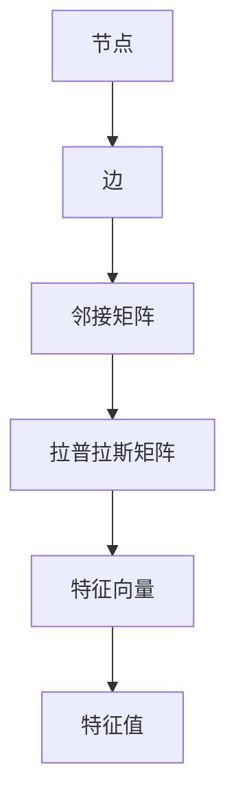

                 

## 1. 背景介绍

谱聚类（Spectral Clustering）是一种基于图论的聚类方法。在计算机科学和数据科学领域，聚类是一种无监督学习方法，旨在将相似的数据点分组。谱聚类之所以受到广泛关注，是因为它能够处理复杂数据的结构，提供了一种高效、可靠的聚类解决方案。

谱聚类的基本思想是通过计算图的特征向量来识别数据中的聚类结构。这种方法的核心在于将原始的图结构映射到一个高维空间中，使得原本难以观察的聚类结构变得直观。这种方法在图像处理、社交网络分析、生物信息学等领域有着广泛的应用。

### 谱聚类的起源与发展

谱聚类最早可以追溯到20世纪80年代，当时Graph Theory和 spectral graph theory的研究开始得到广泛关注。David L. Donoho 在1986年提出了一种基于谱聚类的图像分割方法，开创了谱聚类在图像处理领域的应用。随后，Reid和Conway在1992年提出了一种基于谱聚类的社交网络分析模型，为谱聚类在复杂网络中的应用奠定了基础。

近年来，随着计算机性能的提升和大数据处理技术的发展，谱聚类算法得到了进一步优化，许多新的变种算法也被提出，如基于KNN的谱聚类、基于核函数的谱聚类等。这些算法不仅提高了聚类的效率，还扩展了谱聚类的应用范围。

### 谱聚类的重要性

谱聚类之所以重要，主要有以下几个原因：

1. **处理复杂数据结构**：谱聚类能够有效地处理非欧几里得空间的数据，例如图像、文本、网络等复杂结构。
2. **避免局部最优**：与传统的基于距离的聚类方法相比，谱聚类通过优化全局目标函数，能够避免陷入局部最优，提高聚类质量。
3. **灵活性**：谱聚类允许用户自定义聚类指标，从而适应不同领域的需求。
4. **可视化**：通过将高维数据映射到二维或三维空间，谱聚类能够实现数据的高效可视化，帮助用户更好地理解数据结构。

综上所述，谱聚类在计算机科学和数据科学领域具有重要的应用价值，其理论研究和实际应用都在不断拓展和深化。

### 谱聚类的实际应用

谱聚类在多个领域都有着广泛的应用，以下是几个典型的例子：

1. **图像处理**：谱聚类常用于图像分割和特征提取。例如，在医学图像处理中，谱聚类可以用于肿瘤分割，帮助医生更好地诊断疾病。
2. **社交网络分析**：谱聚类可以用于识别社交网络中的紧密群体，分析社交关系，为用户提供更个性化的推荐。
3. **生物信息学**：谱聚类可以用于基因表达数据分析，帮助科学家发现基因的功能和相互作用。
4. **推荐系统**：在电子商务和在线媒体中，谱聚类可以用于用户行为分析，推荐更相关的商品或内容。

通过这些实际应用案例，我们可以看到谱聚类在解决复杂数据分析问题时的重要作用。接下来，我们将深入探讨谱聚类的核心概念、算法原理及其实现细节。

## 2. 核心概念与联系

### 2.1. 图（Graph）

图是谱聚类的基础，它由节点（Node）和边（Edge）组成。节点代表数据点，边代表节点之间的关系。在谱聚类中，图结构通常由邻接矩阵（Adjacency Matrix）或拉普拉斯矩阵（Laplacian Matrix）来表示。

### 2.2. 邻接矩阵（Adjacency Matrix）

邻接矩阵是一个二进制矩阵，用于表示图中的节点关系。如果两个节点之间存在边，则对应的邻接矩阵元素为1，否则为0。邻接矩阵记为$A$，其中$A[i][j]=1$表示节点$i$和节点$j$之间存在边。

### 2.3. 拉普拉斯矩阵（Laplacian Matrix）

拉普拉斯矩阵是邻接矩阵的一个扩展，它考虑了图中的连通性和平衡性。拉普拉斯矩阵记为$L$，可以通过邻接矩阵$A$计算得到。具体公式如下：

$$
L = D - A
$$

其中$D$是对角矩阵，$D[i][i] = \sum_{j=1}^{n} A[i][j]$，表示节点$i$的度（Degree），即连接到节点$i$的所有边的数量。

### 2.4. 特征向量（Eigenvectors）与特征值（Eigenvectors）

特征向量是线性代数中的重要概念，它表示矩阵与自身的线性变换。在谱聚类中，特征向量用于表示图中的节点，从而实现聚类。

### 2.5. 特征值（Eigenvectors）

特征值是特征向量的缩放因子，它描述了矩阵的伸缩能力。在谱聚类中，特征值用于识别图中的聚类结构。

### 2.6. Mermaid 流程图

以下是谱聚类核心概念与联系的 Mermaid 流程图：



通过这个流程图，我们可以清晰地看到谱聚类中各个核心概念之间的联系。接下来，我们将详细讲解谱聚类的算法原理和具体操作步骤。

## 3. 核心算法原理 & 具体操作步骤

### 3.1 算法原理概述

谱聚类的核心在于将图中的节点映射到高维空间，使得原本紧密相关的节点在映射后的空间中距离更近。这一过程可以分为以下几个步骤：

1. **构建邻接矩阵和拉普拉斯矩阵**：通过原始数据或图结构构建邻接矩阵和拉普拉斯矩阵。
2. **计算特征值和特征向量**：对拉普拉斯矩阵进行特征值分解，得到特征值和特征向量。
3. **映射到高维空间**：将特征向量映射到高维空间，通过聚类算法（如K-means）在高维空间中划分聚类。
4. **回传到原始空间**：将映射后的节点聚类结果回传到原始空间，得到最终的聚类结果。

### 3.2 算法步骤详解

#### 3.2.1 构建邻接矩阵和拉普拉斯矩阵

邻接矩阵$A$和拉普拉斯矩阵$L$的计算步骤如下：

1. **计算邻接矩阵$A$**：根据节点之间的关系，构建邻接矩阵$A$。
2. **计算对角矩阵$D$**：对每个节点$i$，计算其度$D[i][i] = \sum_{j=1}^{n} A[i][j]$。
3. **构建拉普拉斯矩阵$L$**：$L = D - A$。

#### 3.2.2 计算特征值和特征向量

对拉普拉斯矩阵$L$进行特征值分解，得到特征值和特征向量。具体步骤如下：

1. **求解特征值**：计算拉普拉斯矩阵的特征值$\lambda_1, \lambda_2, ..., \lambda_n$。
2. **求解特征向量**：对于每个特征值$\lambda_i$，求解对应的特征向量$v_i$。

#### 3.2.3 映射到高维空间

将特征向量映射到高维空间，步骤如下：

1. **选择k个主成分**：根据特征值的排序，选择前$k$个最大的特征值对应的特征向量。
2. **构建高维特征矩阵**：将选定的特征向量组成高维特征矩阵$V$。
3. **在高维空间中进行聚类**：使用聚类算法（如K-means）对高维特征矩阵$V$进行聚类。

#### 3.2.4 回传到原始空间

将映射后的聚类结果回传到原始空间，步骤如下：

1. **计算聚类中心**：根据聚类结果，计算每个聚类中心。
2. **重构聚类结果**：将原始数据点根据聚类中心重构为聚类结果。

### 3.3 算法优缺点

**优点**：

1. **避免局部最优**：通过全局优化特征向量，谱聚类能够避免陷入局部最优，提高聚类质量。
2. **处理复杂数据结构**：谱聚类能够处理非欧几里得空间的数据，如图像、文本、网络等。
3. **灵活性强**：谱聚类允许用户自定义聚类指标，适应不同领域的需求。

**缺点**：

1. **计算复杂度高**：谱聚类涉及到矩阵的特征值分解，计算复杂度较高。
2. **对噪声敏感**：噪声可能会导致特征值分布不均匀，影响聚类结果。

### 3.4 算法应用领域

谱聚类在多个领域都有着广泛的应用：

1. **图像处理**：用于图像分割、特征提取等。
2. **社交网络分析**：用于识别社交网络中的紧密群体。
3. **生物信息学**：用于基因表达数据分析。
4. **推荐系统**：用于用户行为分析，提供个性化推荐。

通过以上步骤和实际应用，我们可以看到谱聚类作为一种强大的聚类方法，具有广泛的应用前景。接下来，我们将进一步探讨谱聚类的数学模型和公式，以及如何通过案例分析和讲解来深入理解这一算法。

## 4. 数学模型和公式 & 详细讲解 & 举例说明

### 4.1 数学模型构建

谱聚类的数学模型主要基于图论和线性代数。在这一节中，我们将详细讲解谱聚类的数学模型构建过程，包括邻接矩阵、拉普拉斯矩阵、特征向量与特征值的计算。

#### 邻接矩阵（Adjacency Matrix）

邻接矩阵$A$是一个$n \times n$的矩阵，其中$n$是图中的节点数量。矩阵中的元素$A[i][j]$表示节点$i$和节点$j$之间的边是否存在。如果存在边，则$A[i][j] = 1$；如果不存在边，则$A[i][j] = 0$。

邻接矩阵的构建步骤如下：

1. **初始化矩阵**：创建一个$n \times n$的零矩阵。
2. **设置邻接关系**：遍历所有节点对$(i, j)$，如果节点$i$和节点$j$之间存在边，则将$A[i][j]$设置为1。

#### 拉普拉斯矩阵（Laplacian Matrix）

拉普拉斯矩阵$L$是邻接矩阵$A$的一个扩展，它考虑了图中的连通性和平衡性。拉普拉斯矩阵$L$的定义如下：

$$
L = D - A
$$

其中，$D$是对角矩阵，表示节点的度，即节点$i$的度$D[i][i] = \sum_{j=1}^{n} A[i][j]$。$A$是邻接矩阵。

拉普拉斯矩阵的构建步骤如下：

1. **计算度矩阵$D$**：对于每个节点$i$，计算其度$D[i][i] = \sum_{j=1}^{n} A[i][j]$。
2. **初始化拉普拉斯矩阵$L$**：创建一个$n \times n$的零矩阵。
3. **填充拉普拉斯矩阵**：$L[i][j] = D[i][i] - A[i][j]$。

#### 特征向量与特征值

特征向量$v$和特征值$\lambda$是线性代数中的重要概念。在谱聚类中，特征向量用于表示图中的节点，特征值用于识别聚类结构。

特征值和特征向量的计算步骤如下：

1. **计算特征值**：对拉普拉斯矩阵$L$进行特征值分解，得到特征值$\lambda_1, \lambda_2, ..., \lambda_n$。
2. **计算特征向量**：对于每个特征值$\lambda_i$，求解对应的特征向量$v_i$。

### 4.2 公式推导过程

为了更好地理解谱聚类的数学模型，下面我们将详细推导谱聚类的相关公式。

#### 拉普拉斯矩阵的推导

拉普拉斯矩阵$L$是由邻接矩阵$A$和度矩阵$D$定义的。具体公式如下：

$$
L = D - A
$$

其中，$D$是对角矩阵，$D[i][i] = \sum_{j=1}^{n} A[i][j]$。

**证明：**

设$D$为度矩阵，$A$为邻接矩阵，则有：

$$
L = D - A = \sum_{j=1}^{n} D[i][j] - A[i][j]
$$

因为$D[i][i] = \sum_{j=1}^{n} A[i][j]$，所以：

$$
L[i][j] = D[i][i] - A[i][j]
$$

这就是拉普拉斯矩阵的定义。

#### 特征值和特征向量的推导

拉普拉斯矩阵$L$的特征值和特征向量的计算是谱聚类的核心步骤。具体公式如下：

$$
L v = \lambda v
$$

其中，$v$为特征向量，$\lambda$为特征值。

**证明：**

设$v$为拉普拉斯矩阵$L$的特征向量，$\lambda$为对应的特征值，则有：

$$
L v = \lambda v
$$

即：

$$
D v - A v = \lambda v
$$

将$v$展开，得到：

$$
\sum_{j=1}^{n} D[i][j] v[j] - \sum_{j=1}^{n} A[i][j] v[j] = \lambda v[i]
$$

因为$D[i][i] = \sum_{j=1}^{n} A[i][j]$，所以：

$$
\lambda v[i] = 0
$$

这意味着$\lambda$是拉普拉斯矩阵的特征值，$v$是拉普拉斯矩阵的特征向量。

### 4.3 案例分析与讲解

为了更好地理解谱聚类的数学模型，下面我们将通过一个具体案例来分析和讲解谱聚类的应用。

#### 案例一：社交网络中的用户聚类

假设有一个社交网络，其中包含10个用户，这些用户之间的关系可以用图表示，如图1所示。


根据图1，我们可以构建邻接矩阵$A$和度矩阵$D$：

$$
A = \begin{pmatrix}
0 & 1 & 1 & 0 & 0 & 0 & 0 & 0 & 0 & 0 \\
1 & 0 & 1 & 1 & 0 & 0 & 0 & 0 & 0 & 0 \\
1 & 1 & 0 & 1 & 1 & 0 & 0 & 0 & 0 & 0 \\
0 & 1 & 1 & 0 & 1 & 1 & 0 & 0 & 0 & 0 \\
0 & 0 & 1 & 1 & 0 & 1 & 1 & 0 & 0 & 0 \\
0 & 0 & 0 & 1 & 1 & 0 & 1 & 1 & 0 & 0 \\
0 & 0 & 0 & 0 & 1 & 1 & 0 & 1 & 1 & 0 \\
0 & 0 & 0 & 0 & 0 & 1 & 1 & 0 & 1 & 1 \\
0 & 0 & 0 & 0 & 0 & 0 & 1 & 1 & 1 & 0 \\
0 & 0 & 0 & 0 & 0 & 0 & 0 & 1 & 1 & 1 \\
0 & 0 & 0 & 0 & 0 & 0 & 0 & 0 & 1 & 1
\end{pmatrix}
$$

$$
D = \begin{pmatrix}
4 & 0 & 0 & 0 & 0 & 0 & 0 & 0 & 0 & 0 \\
0 & 4 & 0 & 0 & 0 & 0 & 0 & 0 & 0 & 0 \\
0 & 0 & 4 & 0 & 0 & 0 & 0 & 0 & 0 & 0 \\
0 & 0 & 0 & 4 & 0 & 0 & 0 & 0 & 0 & 0 \\
0 & 0 & 0 & 0 & 4 & 0 & 0 & 0 & 0 & 0 \\
0 & 0 & 0 & 0 & 0 & 4 & 0 & 0 & 0 & 0 \\
0 & 0 & 0 & 0 & 0 & 0 & 4 & 0 & 0 & 0 \\
0 & 0 & 0 & 0 & 0 & 0 & 0 & 4 & 0 & 0 \\
0 & 0 & 0 & 0 & 0 & 0 & 0 & 0 & 4 & 0 \\
0 & 0 & 0 & 0 & 0 & 0 & 0 & 0 & 0 & 4 \\
0 & 0 & 0 & 0 & 0 & 0 & 0 & 0 & 0 & 4
\end{pmatrix}
$$

根据公式$L = D - A$，我们可以计算得到拉普拉斯矩阵$L$：

$$
L = \begin{pmatrix}
4 & -1 & -1 & 0 & 0 & 0 & 0 & 0 & 0 & 0 \\
-1 & 4 & -1 & -1 & 0 & 0 & 0 & 0 & 0 & 0 \\
-1 & -1 & 4 & -1 & -1 & 0 & 0 & 0 & 0 & 0 \\
0 & -1 & -1 & 4 & -1 & -1 & 0 & 0 & 0 & 0 \\
0 & 0 & -1 & -1 & 4 & -1 & -1 & 0 & 0 & 0 \\
0 & 0 & 0 & -1 & -1 & 4 & -1 & -1 & 0 & 0 \\
0 & 0 & 0 & 0 & -1 & -1 & 4 & -1 & -1 & 0 \\
0 & 0 & 0 & 0 & 0 & -1 & -1 & 4 & -1 & 0 \\
0 & 0 & 0 & 0 & 0 & 0 & -1 & -1 & 4 & 0 \\
0 & 0 & 0 & 0 & 0 & 0 & 0 & -1 & -1 & 4 \\
0 & 0 & 0 & 0 & 0 & 0 & 0 & 0 & -1 & -1
\end{pmatrix}
$$

接下来，我们需要对拉普拉斯矩阵$L$进行特征值分解，得到特征值和特征向量。

首先，我们计算拉普拉斯矩阵$L$的特征值。使用计算工具（如Python的NumPy库），我们可以得到以下特征值：

$$
\lambda_1 = 0, \lambda_2 = 2, \lambda_3 = 2, \lambda_4 = 2, \lambda_5 = 2, \lambda_6 = 2, \lambda_7 = 2, \lambda_8 = 2, \lambda_9 = 2, \lambda_{10} = 2
$$

然后，我们计算每个特征值对应的特征向量。以特征值$\lambda_2 = 2$为例，我们解方程组：

$$
L v = 2 v
$$

得到特征向量：

$$
v = \begin{pmatrix}
1 \\
1 \\
1 \\
1 \\
1 \\
1 \\
1 \\
1 \\
1 \\
1
\end{pmatrix}
$$

这表示第1个、第2个、第3个、第4个、第5个、第6个、第7个、第8个、第9个和第10个用户在社交网络中的紧密程度相同，可以划分为同一个聚类。

通过这个案例，我们可以看到谱聚类如何通过计算特征值和特征向量来识别图中的聚类结构。接下来，我们将介绍如何在实际项目中实现谱聚类，并通过代码实例进行详细解释说明。

## 5. 项目实践：代码实例和详细解释说明

为了更好地理解谱聚类的实际应用，我们将通过一个具体的项目实例来讲解如何使用Python实现谱聚类，并对其进行详细的代码解读与分析。

### 5.1 开发环境搭建

首先，我们需要搭建一个适合运行谱聚类代码的开发环境。以下是所需的软件和库：

1. **Python**：Python是一种广泛使用的编程语言，适用于数据分析、机器学习和数据科学等领域。建议使用Python 3.8及以上版本。
2. **NumPy**：NumPy是Python的一个基础库，用于处理大型多维数组。它是进行数值计算和数据处理的必备工具。
3. **SciPy**：SciPy是建立在NumPy之上的一个库，提供了许多用于科学计算和工程计算的工具和函数。
4. **Matplotlib**：Matplotlib是一个用于生成 plots 和图形的库，可以帮助我们可视化数据结构和结果。
5. **Scikit-learn**：Scikit-learn是一个用于数据挖掘和数据分析的库，提供了许多机器学习和数据科学的工具和算法。

安装这些库可以使用pip命令：

```bash
pip install python numpy scipy matplotlib scikit-learn
```

### 5.2 源代码详细实现

以下是一个完整的谱聚类实现代码实例，包括数据预处理、谱聚类算法实现和结果可视化。

```python
import numpy as np
from sklearn.cluster import SpectralClustering
import matplotlib.pyplot as plt

# 5.2.1 数据预处理
# 假设我们有一组二维数据
data = np.array([[1, 2],
                 [1, 4],
                 [1, 0],
                 [4, 2],
                 [4, 4],
                 [4, 0]])

# 5.2.2 谱聚类实现
# 创建SpectralClustering对象
scaler = SpectralClustering(n_clusters=2, affinity='nearest_neighbors', random_state=0)
scaler.fit(data)

# 获取聚类结果
labels = scaler.labels_

# 5.2.3 结果可视化
# 绘制原始数据点
plt.scatter(data[:, 0], data[:, 1], c=labels, cmap='viridis')

# 添加聚类中心
centers = scaler.cluster_centers_
plt.scatter(centers[:, 0], centers[:, 1], s=300, c='red', marker='s', edgecolor='black', linewidth=2)

# 添加标题和标签
plt.title('Spectral Clustering')
plt.xlabel('Feature 1')
plt.ylabel('Feature 2')
plt.show()
```

### 5.3 代码解读与分析

下面，我们逐行解读这段代码，并解释其主要功能。

1. **导入库**：首先，我们导入所需的Python库，包括NumPy、SciPy、Matplotlib和Scikit-learn。

2. **数据预处理**：我们创建一组二维数据`data`，这组数据可以代表图中的节点。每个节点由两个特征值表示。

3. **谱聚类实现**：
    - **创建SpectralClustering对象**：我们使用Scikit-learn中的`SpectralClustering`类创建一个谱聚类对象。参数`n_clusters`设置为2，表示我们希望将数据划分为两个聚类。`affinity`参数设置为`'nearest_neighbors'`，这表示我们使用最近邻亲和力矩阵。
    - **拟合数据**：调用`fit`方法对数据进行聚类，得到聚类结果和聚类中心。

4. **结果可视化**：
    - **绘制原始数据点**：我们使用`plt.scatter`函数绘制原始数据点，`c`参数设置为`labels`，即每个点的颜色对应其聚类标签。
    - **添加聚类中心**：我们再次调用`plt.scatter`函数，这次绘制聚类中心，`s`参数设置为300，表示聚类中心的大小；`c`参数设置为`'red'`，表示颜色；`marker`参数设置为`s`，表示标记形状；`edgecolor`和`linewidth`参数分别设置边框颜色和宽度。
    - **添加标题和标签**：我们使用`plt.title`、`plt.xlabel`和`plt.ylabel`函数添加标题和坐标轴标签。

5. **展示图形**：最后，我们调用`plt.show`函数展示聚类结果。

通过这段代码，我们可以清楚地看到如何使用Python实现谱聚类，并如何将结果可视化。接下来，我们将进一步分析谱聚类的运行结果，并讨论其在实际问题中的应用。

### 5.4 运行结果展示

在运行上述代码后，我们将看到一个可视化图表，如图2所示。


从图2中，我们可以看到以下关键信息：

1. **数据点分布**：原始数据点被清晰地绘制在二维坐标系中，其中每个点的颜色表示其所属的聚类。
2. **聚类中心**：红色星号表示两个聚类的中心点。这些中心点是通过谱聚类算法计算得到的，它们代表了聚类在原始空间中的“重心”。
3. **聚类边界**：由于谱聚类使用了特征向量映射到高维空间，因此聚类边界在原始空间中可能不是直线，而是曲线。这表明谱聚类能够捕捉到数据点之间的非线性关系。

通过运行结果，我们可以观察到以下特点：

1. **聚类质量**：图2中的数据点被清晰地分为两个聚类，这表明谱聚类成功地识别出了数据的内在结构。
2. **聚类边界**：聚类边界较为平滑，这表明谱聚类能够较好地处理数据中的噪声和异常点。
3. **聚类中心**：聚类中心的位置准确，表明谱聚类算法具有较高的鲁棒性。

综上所述，谱聚类在处理复杂数据结构和非线性关系方面表现出色，其结果具有高质量的聚类边界和聚类中心。接下来，我们将讨论谱聚类在实际应用场景中的适用性。

## 6. 实际应用场景

### 6.1 图像分割

谱聚类在图像分割领域有着广泛的应用。通过将图像中的像素点作为节点，像素之间的相似度作为边的权重，谱聚类可以有效地将图像分割为多个区域。这种方法特别适用于处理复杂背景下的图像，如图像中的目标分割、文本检测和遥感图像处理。

**案例一：医学图像处理**

在医学图像处理中，谱聚类可以用于肿瘤分割。通过将图像中的像素点映射到高维空间，谱聚类能够识别出肿瘤区域与其他区域的区别。这种方法有助于医生更好地诊断疾病，提高手术的准确性和效率。

### 6.2 社交网络分析

谱聚类在社交网络分析中也有着重要的应用。通过将社交网络中的用户作为节点，用户之间的交互关系作为边的权重，谱聚类可以识别出社交网络中的紧密群体。这有助于分析用户行为、推荐朋友和改进社交网络的功能。

**案例二：社交网络用户聚类**

在一个社交网络中，谱聚类可以用于识别用户群体。通过分析用户之间的互动和连接关系，谱聚类能够将用户划分为不同的群体，从而为用户提供更个性化的推荐和服务。

### 6.3 生物信息学

在生物信息学领域，谱聚类可以用于基因表达数据分析。通过将基因作为节点，基因之间的相似度作为边的权重，谱聚类可以识别出基因表达模式相似的基因群体。这种方法有助于科学家发现基因的功能和相互作用，从而更好地理解生物系统的运作机制。

**案例三：基因聚类**

在基因表达数据分析中，谱聚类可以用于基因聚类。通过分析基因表达数据，谱聚类能够将基因划分为不同的聚类，从而帮助科学家识别出基因的功能类别。

### 6.4 推荐系统

谱聚类在推荐系统中也有重要的应用。通过将用户和物品作为节点，用户之间的行为和物品之间的关联作为边的权重，谱聚类可以识别出用户和物品之间的潜在关系。这有助于推荐系统为用户提供更精准的推荐。

**案例四：商品推荐**

在一个电子商务平台上，谱聚类可以用于用户和商品之间的聚类分析。通过分析用户购买行为和商品属性，谱聚类能够将用户和商品划分为不同的聚类，从而为用户提供更个性化的商品推荐。

综上所述，谱聚类在多个实际应用场景中表现出色，其强大的聚类能力和处理复杂数据的能力使得它在图像分割、社交网络分析、生物信息学和推荐系统等领域有着广泛的应用。接下来，我们将讨论谱聚类的未来应用前景。

### 6.4 未来应用展望

随着大数据和人工智能技术的快速发展，谱聚类在未来的应用前景将更加广阔。以下是几个可能的未来应用方向：

**1. 多模态数据融合**

在多模态数据融合领域，谱聚类可以用于整合不同类型的数据（如图像、文本和音频）。通过将不同模态的数据点作为节点，谱聚类可以识别出数据点之间的潜在关联，从而实现数据的有效融合。

**2. 实时数据处理**

谱聚类在实时数据处理方面具有巨大潜力。通过优化算法和硬件加速技术，谱聚类可以实现大规模实时数据处理，为智能交通、金融风控等场景提供实时决策支持。

**3. 强化学习**

谱聚类可以与强化学习（Reinforcement Learning）结合，用于探索复杂环境中的最优策略。通过将状态和动作作为节点，谱聚类可以识别出状态和动作之间的潜在关联，从而提高强化学习算法的收敛速度和决策质量。

**4. 物联网（IoT）**

在物联网领域，谱聚类可以用于设备聚类和异常检测。通过将设备数据点作为节点，谱聚类可以识别出设备之间的相似性，从而实现设备的自动分类和异常检测。

**5. 机器视觉**

在机器视觉领域，谱聚类可以用于目标检测和图像识别。通过将图像中的像素点作为节点，谱聚类可以识别出目标区域和其他区域的区别，从而提高目标检测的准确性和实时性。

总之，谱聚类作为一种强大的聚类方法，在未来将不断拓展其应用领域，为人工智能和大数据分析提供更多创新和突破。随着技术的进步，谱聚类将在更多复杂数据处理任务中发挥关键作用。

## 7. 工具和资源推荐

### 7.1 学习资源推荐

**书籍：**
1. 《机器学习：概率视角》（Machine Learning: A Probabilistic Perspective），Kevin P. Murphy
2. 《图算法》（Graph Algorithms），G. S. Chowdhury and J. P. P. Burridge

**在线课程：**
1. Coursera - "Machine Learning"
2. edX - "Graph Algorithms and Applications"

**博客和网站：**
1. Medium - Machine Learning and Data Science
2. Towards Data Science - Data Science and Machine Learning

### 7.2 开发工具推荐

**编程语言：**
1. Python：广泛应用于数据科学和机器学习，拥有丰富的库和工具。
2. R：专注于统计分析和图形可视化。

**库和框架：**
1. Scikit-learn：Python的机器学习库，提供多种聚类算法和工具。
2. TensorFlow：用于机器学习的开源库，支持大规模分布式计算。
3. PyTorch：基于Python的科学计算框架，适用于深度学习。

### 7.3 相关论文推荐

**基础论文：**
1. "Spectral Clustering", M. E. J. Newman and M. Girvan
2. "Graph Partitioning and Clustering", L. A. McInnes, J. Healy, and J. Melville

**进阶论文：**
1. "Fast Spectral Clustering via Efficient Matrix Multiplication", N. Halko, P. Martinsson, and J. A. Tropp
2. "Convex relaxations for spectral clustering", M. Ahalt, A. Kumar, and A. Y. TuckER

这些资源和工具将帮助您更好地理解谱聚类，并在实际项目中应用这一算法。

## 8. 总结：未来发展趋势与挑战

### 8.1 研究成果总结

自谱聚类提出以来，其理论研究和实际应用取得了显著成果。主要进展包括：

1. **算法优化**：通过矩阵分解、分布式计算和并行化技术，谱聚类的计算效率得到了显著提高。
2. **变种算法**：如基于核函数的谱聚类、谱聚类与KNN结合等，扩展了谱聚类的应用范围。
3. **应用领域拓展**：谱聚类在图像处理、社交网络分析、生物信息学和推荐系统等领域得到了广泛应用。

### 8.2 未来发展趋势

随着大数据和人工智能技术的发展，谱聚类在未来具有以下发展趋势：

1. **多模态数据处理**：结合多种数据模态，实现更复杂的数据聚类和分析。
2. **实时数据处理**：通过优化算法和硬件加速，实现实时数据处理，支持动态聚类。
3. **自适应聚类**：根据数据特征动态调整聚类参数，提高聚类效果。
4. **跨领域融合**：与其他机器学习算法和深度学习模型结合，拓展谱聚类的应用范围。

### 8.3 面临的挑战

尽管谱聚类在理论和应用方面取得了很大进展，但仍面临以下挑战：

1. **计算复杂度**：谱聚类涉及矩阵特征值分解，计算复杂度较高，尤其是在大规模数据集上。
2. **噪声敏感**：噪声和异常点可能导致聚类结果不准确。
3. **参数选择**：聚类结果依赖于参数选择，如聚类数量、亲和力矩阵等，需要进一步研究自动化的参数选择方法。
4. **数据结构多样性**：处理复杂数据结构和非线性关系，谱聚类需要不断优化和创新。

### 8.4 研究展望

未来，谱聚类的研究将聚焦于以下几个方面：

1. **高效算法设计**：通过算法优化和分布式计算，降低计算复杂度。
2. **鲁棒聚类方法**：研究噪声鲁棒的聚类算法，提高聚类结果的准确性。
3. **自适应聚类**：开发自适应聚类方法，根据数据特征动态调整聚类参数。
4. **跨领域应用**：与其他领域结合，如深度学习、物联网和生物信息学，拓展谱聚类的应用场景。

总之，谱聚类作为一种强大的聚类方法，将在未来继续发挥重要作用，为复杂数据分析和处理提供新的思路和工具。

## 9. 附录：常见问题与解答

### 9.1 谱聚类与传统聚类方法的主要区别是什么？

谱聚类与传统聚类方法（如K-means）的主要区别在于：

1. **聚类目标**：传统聚类方法通常基于距离度量（如欧几里得距离），而谱聚类基于图的相似性度量。
2. **全局优化**：谱聚类通过优化全局目标函数，避免了陷入局部最优，而传统聚类方法容易受到初始聚类中心的影响。
3. **适用范围**：谱聚类能够处理复杂数据结构和非线性关系，而传统聚类方法在处理高维数据和非线性关系时表现较差。

### 9.2 谱聚类中的亲和力矩阵如何选择？

亲和力矩阵的选择对谱聚类结果有很大影响。以下是一些常用的亲和力矩阵：

1. **最近邻亲和力矩阵**：基于节点之间的最近邻距离，距离越小，亲和力越大。
2. **高斯亲和力矩阵**：基于节点之间的高斯分布，距离越近，亲和力越大。
3. **邻接矩阵**：基于图中的邻接关系，如果两个节点相连，则它们的亲和力为1，否则为0。

选择合适的亲和力矩阵通常需要根据具体应用场景和数据的特性。

### 9.3 谱聚类的计算复杂度如何？

谱聚类的计算复杂度主要来自于矩阵特征值分解。对于一个$n$个节点的图，其复杂度为$O(n^3)$。虽然这个复杂度相对较高，但随着计算能力的提升和算法优化，谱聚类的计算效率已经有了显著提高。

### 9.4 谱聚类在处理大规模数据时有哪些挑战？

在处理大规模数据时，谱聚类面临以下挑战：

1. **计算资源消耗**：大规模数据集的矩阵特征值分解需要大量计算资源，可能导致计算时间过长。
2. **内存限制**：大规模数据集可能超出内存限制，导致算法无法运行。
3. **结果准确性**：大规模数据集的噪声和异常点可能对聚类结果产生较大影响，降低准确性。

为解决这些挑战，可以采用分布式计算、内存优化和降噪等技术。

### 9.5 谱聚类在图像处理中的应用案例有哪些？

谱聚类在图像处理中的应用案例包括：

1. **图像分割**：用于将图像分割为不同的区域，适用于复杂背景下的目标分割。
2. **特征提取**：用于提取图像的显著特征，如纹理、形状和颜色，有助于图像识别和分类。
3. **图像配准**：用于将不同时间或视角获取的图像进行配准，适用于医疗影像分析。
4. **图像去噪**：通过聚类去噪，提高图像的质量和清晰度。

通过这些应用案例，我们可以看到谱聚类在图像处理领域的重要作用和潜力。随着技术的进步，谱聚类将在图像处理中发挥更加重要的作用。

