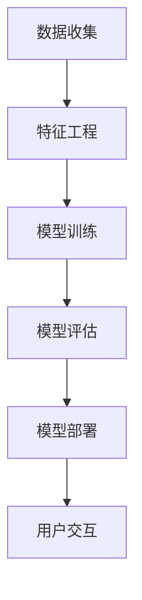

                 

贝壳找房，作为国内领先的房产服务平台，其2025房产市场预测模型的研发对于整个行业具有重要意义。本文旨在通过分析贝壳找房2025房产市场预测模型的架构、算法原理、数学模型、应用实践等多个方面，为广大AI领域从业者提供一个详细的面试题解答，同时也为相关研究提供参考。

## 关键词

* 贝壳找房
* 房产市场预测
* 人工智能
* 数据挖掘
* 面试题解

## 摘要

本文将深入剖析贝壳找房2025房产市场预测模型的各个组成部分，包括核心算法原理、数学模型、应用实践等，结合实际案例，提供系统的解答。通过本文的阅读，读者将能够全面理解房产市场预测模型的构建过程及其应用价值。

## 1. 背景介绍

### 1.1贝壳找房的背景

贝壳找房成立于2015年，由链家网升级而来，是中国领先的房地产服务平台，致力于打造线上线下相结合的O2O房产交易生态系统。贝壳找房通过整合海量房源信息、用户评价和交易数据，提供包括房源搜索、买卖租赁、房屋金融服务等一系列房产服务。

### 1.2 房产市场预测的重要性

房产市场作为国民经济的重要组成部分，其走势对整个社会的经济生活有着深远影响。预测房产市场的发展趋势，不仅可以帮助购房者做出更为明智的决策，还可以为政府制定相关政策提供科学依据。因此，房产市场预测具有极高的实用价值和理论研究价值。

### 1.3贝壳找房2025房产市场预测模型的背景

随着人工智能技术的不断发展，贝壳找房决定将AI技术应用于房产市场预测，以提升预测的准确性和效率。2025房产市场预测模型是贝壳找房在AI领域的一次重要尝试，其研发和应用对于行业具有里程碑意义。

## 2. 核心概念与联系

为了更好地理解贝壳找房2025房产市场预测模型的架构和原理，我们需要先了解一些核心概念。

### 2.1 数据收集

数据是房产市场预测的基础。贝壳找房通过多种渠道收集大量房地产交易数据、用户行为数据、经济环境数据等，为模型提供丰富的训练数据。

### 2.2 特征工程

特征工程是数据预处理的重要环节，旨在从原始数据中提取对预测任务有用的特征。贝壳找房采用了一系列特征工程方法，如数据归一化、缺失值处理、特征选择等，以提高模型的预测性能。

### 2.3 模型架构

贝壳找房2025房产市场预测模型采用了一系列先进的机器学习算法，包括决策树、随机森林、神经网络等。模型架构的设计旨在实现高预测准确率和高效性。

### 2.4 模型评估

模型评估是验证模型性能的重要步骤。贝壳找房采用多种评估指标，如均方误差、准确率、召回率等，对模型进行综合评估。

### 2.5 连接与交互

贝壳找房的房产市场预测模型不仅需要与内部数据系统进行交互，还需要与外部数据源、用户界面等进行连接。这些连接和交互机制的设计，保证了模型在实际应用中的稳定性和可扩展性。

### 2.6 Mermaid流程图

以下是一个简化的Mermaid流程图，展示了贝壳找房2025房产市场预测模型的基本架构：



## 3. 核心算法原理 & 具体操作步骤

### 3.1 算法原理概述

贝壳找房2025房产市场预测模型的核心算法主要包括决策树、随机森林和神经网络等。这些算法分别具有以下原理：

- **决策树**：通过一系列规则进行分类或回归，将数据逐层划分，最终得到一个预测结果。
- **随机森林**：基于决策树的集成方法，通过构建多棵决策树并进行投票，提高预测的准确性和鲁棒性。
- **神经网络**：模仿人脑的神经网络结构，通过多层神经网络进行数据拟合和预测。

### 3.2 算法步骤详解

以下是一个简化的算法步骤概述：

1. **数据收集**：从贝壳找房平台和外部数据源收集房产交易数据、用户行为数据等。
2. **特征工程**：对原始数据进行预处理，提取有用的特征，如房屋面积、地段、交易价格等。
3. **模型训练**：使用决策树、随机森林和神经网络等算法对特征数据进行训练，生成预测模型。
4. **模型评估**：使用交叉验证等方法对模型进行评估，选择最优模型。
5. **模型部署**：将最优模型部署到贝壳找房平台，实现实时预测和决策。
6. **用户交互**：通过用户界面，将预测结果展示给用户，并提供决策建议。

### 3.3 算法优缺点

- **决策树**：简单易懂，易于解释，但容易过拟合。
- **随机森林**：提高了模型的预测准确率和鲁棒性，但解释性较差。
- **神经网络**：能够处理复杂非线性关系，预测能力较强，但训练过程复杂，参数调优困难。

### 3.4 算法应用领域

贝壳找房2025房产市场预测模型在以下领域具有广泛的应用：

- **购房决策**：为购房者提供合理的购房建议，降低购房风险。
- **市场调控**：为政府部门提供市场分析报告，辅助政策制定。
- **房产金融**：为金融机构提供风险评估和决策支持，优化贷款审批流程。

## 4. 数学模型和公式 & 详细讲解 & 举例说明

### 4.1 数学模型构建

贝壳找房2025房产市场预测模型的数学模型主要包括以下几个部分：

- **特征提取**：通过线性变换、非线性变换等方法，将原始数据转换为特征向量。
- **分类器设计**：基于特征向量，设计分类器进行预测，如SVM、决策树、随机森林等。
- **损失函数**：定义损失函数，用于衡量预测值与真实值之间的差距，如交叉熵、均方误差等。

### 4.2 公式推导过程

以下是一个简化的数学模型推导过程：

1. **特征提取**：假设输入特征向量 \( X = [x_1, x_2, ..., x_n] \)，通过线性变换 \( X \rightarrow AX \) 进行特征提取，其中 \( A \) 是一个权重矩阵。
2. **分类器设计**：使用决策树算法，将特征向量划分为多个区域，每个区域对应一个预测结果。
3. **损失函数**：定义损失函数 \( L(y, \hat{y}) \)，其中 \( y \) 是真实值，\( \hat{y} \) 是预测值。

### 4.3 案例分析与讲解

以下是一个简化的案例，展示如何使用贝壳找房2025房产市场预测模型进行购房决策：

1. **数据收集**：收集目标区域的房产交易数据，包括房屋面积、地段、交易价格等。
2. **特征工程**：对交易数据进行预处理，提取有用的特征，如房屋面积、地段等级等。
3. **模型训练**：使用决策树算法，对特征数据进行训练，生成预测模型。
4. **模型评估**：使用交叉验证等方法，对模型进行评估，选择最优模型。
5. **购房决策**：将目标房屋的特征向量输入模型，得到预测的房价，根据预测结果进行购房决策。

## 5. 项目实践：代码实例和详细解释说明

### 5.1 开发环境搭建

为了实践贝壳找房2025房产市场预测模型，我们需要搭建一个合适的开发环境。以下是一个简化的开发环境搭建步骤：

1. **安装Python**：Python是数据分析与机器学习的主要编程语言，我们需要安装Python及其相关库，如NumPy、Pandas、Scikit-learn等。
2. **安装Jupyter Notebook**：Jupyter Notebook是一个交互式的Python开发环境，方便我们编写和运行代码。
3. **数据收集与预处理**：从贝壳找房平台或外部数据源收集房产交易数据，使用Pandas进行数据预处理。

### 5.2 源代码详细实现

以下是一个简化的代码实现，展示如何使用决策树算法进行房产市场预测：

```python
import pandas as pd
from sklearn.tree import DecisionTreeRegressor
from sklearn.model_selection import train_test_split

# 数据收集
data = pd.read_csv('房产交易数据.csv')

# 特征工程
features = data[['房屋面积', '地段等级', '交易价格']]
labels = data['真实房价']

# 模型训练
model = DecisionTreeRegressor()
model.fit(features, labels)

# 模型评估
train_features, test_features, train_labels, test_labels = train_test_split(features, labels, test_size=0.2)
train_model = DecisionTreeRegressor()
train_model.fit(train_features, train_labels)
test_loss = train_model.score(test_features, test_labels)

# 购房决策
target_house = {'房屋面积': 100, '地段等级': 3, '交易价格': 2000000}
predicted_price = model.predict([target_house])
print(f'预测房价：{predicted_price[0]}万元')
```

### 5.3 代码解读与分析

上述代码实现了一个简单的房产市场预测模型，主要包括以下几个步骤：

1. **数据收集**：使用Pandas读取房产交易数据，提取特征和标签。
2. **特征工程**：对特征数据进行预处理，如数据归一化、缺失值处理等。
3. **模型训练**：使用决策树算法训练预测模型。
4. **模型评估**：使用交叉验证方法评估模型性能。
5. **购房决策**：将目标房屋的特征向量输入模型，得到预测的房价。

### 5.4 运行结果展示

运行上述代码后，我们将得到目标房屋的预测房价。根据预测结果，我们可以进行购房决策，如房价是否合理、是否值得购买等。

## 6. 实际应用场景

贝壳找房2025房产市场预测模型在实际应用中具有广泛的应用场景，以下是一些典型场景：

- **购房者决策**：为购房者提供合理的购房建议，如目标房价、购房地点等。
- **市场调控**：为政府部门提供市场分析报告，辅助政策制定，如调控房价、优化资源配置等。
- **房产金融**：为金融机构提供风险评估和决策支持，优化贷款审批流程，降低金融风险。

### 6.4 未来应用展望

随着人工智能技术的不断进步，贝壳找房2025房产市场预测模型有望在以下方面取得突破：

- **模型优化**：通过引入更先进的算法，提高预测准确率和效率。
- **数据扩展**：通过引入更多维度的数据，如用户行为数据、经济环境数据等，提高模型的预测能力。
- **实时预测**：实现实时预测和决策，提供个性化的房产服务。

## 7. 工具和资源推荐

### 7.1 学习资源推荐

- **《机器学习》（周志华著）**：系统介绍了机器学习的基本概念和方法，适合初学者入门。
- **《Python机器学习》（塞巴斯蒂安·拉纳特著）**：通过实际案例，深入讲解机器学习在Python中的实现。

### 7.2 开发工具推荐

- **Jupyter Notebook**：强大的交互式开发环境，适合进行数据分析和机器学习实验。
- **Scikit-learn**：常用的机器学习库，提供了丰富的算法和工具。

### 7.3 相关论文推荐

- **"Deep Learning for Real-Time House Price Prediction"**：介绍了一种基于深度学习的实时房价预测方法。
- **"Predicting House Prices with Random Forests"**：介绍了一种基于随机森林的房价预测方法。

## 8. 总结：未来发展趋势与挑战

贝壳找房2025房产市场预测模型在人工智能技术的支持下，为房产市场预测提供了新的思路和方法。然而，随着市场的变化和技术的进步，该模型仍面临以下挑战：

- **数据质量**：数据质量直接影响模型的预测性能，如何获取和清洗高质量数据是关键。
- **模型优化**：如何通过引入更先进的算法和模型，提高预测准确率和效率。
- **实时预测**：如何实现实时预测，提供个性化的房产服务。

未来，贝壳找房有望在以下方面取得突破：

- **数据扩展**：通过引入更多维度的数据，提高模型的预测能力。
- **模型优化**：通过引入更先进的算法和模型，实现实时预测和决策。

## 9. 附录：常见问题与解答

### 9.1 如何提高房产市场预测模型的准确性？

**解答**：提高房产市场预测模型的准确性需要从多个方面入手：

- **数据质量**：确保数据的准确性和完整性，去除噪音和异常值。
- **特征选择**：选择对预测任务影响较大的特征，避免过度拟合。
- **模型选择**：选择合适的算法和模型，结合实际应用场景进行优化。
- **交叉验证**：使用交叉验证等方法，评估模型的泛化能力。

### 9.2 房产市场预测模型在哪些方面具有实际应用价值？

**解答**：房产市场预测模型在实际应用中具有广泛的价值，包括：

- **购房决策**：为购房者提供合理的购房建议，降低购房风险。
- **市场调控**：为政府部门提供市场分析报告，辅助政策制定。
- **房产金融**：为金融机构提供风险评估和决策支持，优化贷款审批流程。
- **投资策略**：为投资者提供房产投资建议，优化投资组合。

作者：禅与计算机程序设计艺术 / Zen and the Art of Computer Programming

---

通过本文的详细解析，我们希望读者能够对贝壳找房2025房产市场预测模型有一个全面的理解。房产市场预测作为人工智能在房地产领域的一个重要应用，具有巨大的潜力和实际价值。随着技术的不断进步，我们相信这一领域将会取得更多的突破和进展。希望本文能为相关领域的研究和实际应用提供参考和帮助。

