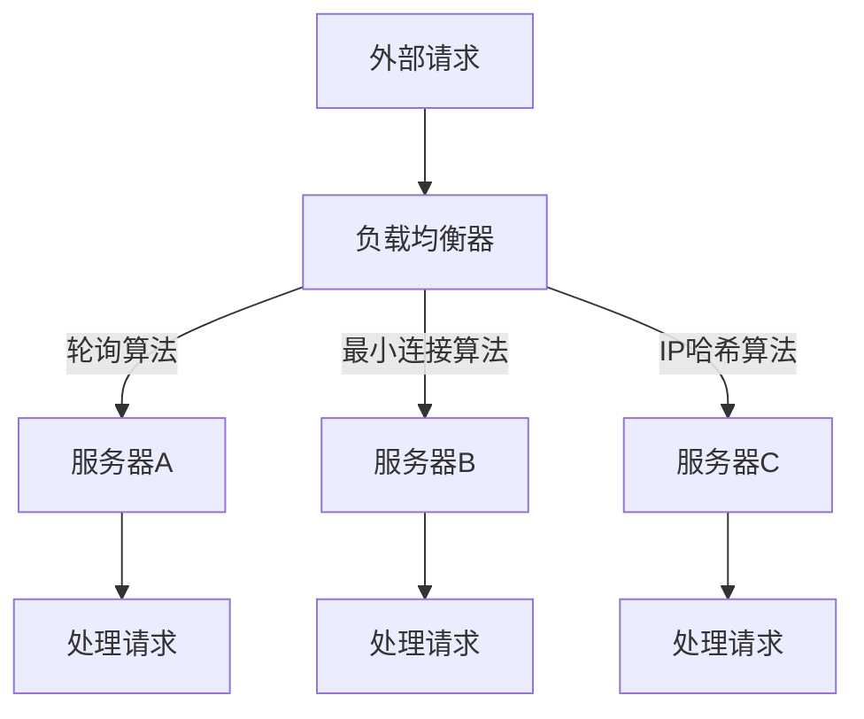

                 

关键词：负载均衡、硬件解决方案、软件解决方案、分布式系统、网络优化

> 摘要：本文将探讨负载均衡技术在现代计算机系统中的重要性，并从硬件和软件两个方面详细分析其实现原理、算法原理、数学模型以及实际应用场景，旨在为读者提供一个全面的技术参考。

## 1. 背景介绍

随着互联网和云计算技术的迅猛发展，计算机系统的负载需求不断增长。在分布式系统中，负载均衡技术成为了保证系统稳定性和高效性的关键。负载均衡的基本概念是通过将请求分配到多个服务器节点上，实现系统资源的合理利用，防止单点过载和提升系统响应速度。负载均衡技术不仅提高了系统的可扩展性，还能提升用户的体验和系统的可靠性。

本文将首先介绍负载均衡的背景和重要性，然后分别从硬件和软件两个方面深入探讨负载均衡技术的原理、算法、数学模型、应用场景以及未来的发展趋势。

## 2. 核心概念与联系

### 2.1 负载均衡的基本概念

负载均衡（Load Balancing）是一种将工作负荷分配到多个计算节点上的技术，目的是为了实现资源利用最大化、系统响应时间最小化以及避免单点故障。负载均衡可以基于不同的策略进行，如轮询、最小连接数、IP哈希等。

### 2.2 硬件负载均衡

硬件负载均衡器是一种物理设备，通常部署在网络的边缘，负责接收外部请求并将这些请求分配到内部服务器集群上。硬件负载均衡器通常具有高性能、高可靠性和高吞吐量的特点，适合处理大量的并发请求。

### 2.3 软件负载均衡

软件负载均衡是在服务器端运行的程序，通过操作系统和网络协议来实现请求的分配。软件负载均衡器通常集成在应用程序中，或者作为独立的模块使用，如Nginx、HAProxy等。软件负载均衡器具有灵活性强、可扩展性好等优点，适合中小型应用场景。

### 2.4 Mermaid 流程图

下面是负载均衡架构的 Mermaid 流程图：



## 3. 核心算法原理 & 具体操作步骤

### 3.1 算法原理概述

负载均衡算法主要分为静态算法和动态算法。静态算法包括轮询、最小连接数和IP哈希等；动态算法则根据系统的实时状态和负载情况动态调整请求的分配策略。

### 3.2 算法步骤详解

#### 3.2.1 轮询算法

轮询算法是一种最简单的负载均衡算法，按照顺序将请求分配到服务器节点上。具体步骤如下：

1. 初始化服务器节点列表。
2. 接收请求，将请求分配到列表的第一个节点。
3. 完成请求处理后，将节点指针向后移动一位。
4. 重复步骤2-3，直到所有请求处理完成。

#### 3.2.2 最小连接数算法

最小连接数算法将请求分配到当前连接数最少的服务器节点上，以保持服务器负载的均衡。具体步骤如下：

1. 初始化服务器节点列表。
2. 接收请求，遍历服务器节点列表，找到连接数最少的节点。
3. 将请求分配到该节点。
4. 更新节点连接数。
5. 重复步骤2-4，直到所有请求处理完成。

#### 3.2.3 IP哈希算法

IP哈希算法根据客户端的IP地址计算哈希值，将请求分配到具有相同哈希值的服务器节点上。具体步骤如下：

1. 初始化服务器节点列表。
2. 接收请求，根据客户端IP地址计算哈希值。
3. 将请求分配到哈希值对应的服务器节点。
4. 重复步骤2-3，直到所有请求处理完成。

### 3.3 算法优缺点

#### 3.3.1 轮询算法

优点：简单、公平。
缺点：无法根据服务器负载动态调整，可能导致部分服务器过载。

#### 3.3.2 最小连接数算法

优点：根据服务器负载动态调整，负载均衡效果好。
缺点：需要维护服务器连接状态，增加系统开销。

#### 3.3.3 IP哈希算法

优点：根据客户端IP地址固定分配请求，适合有状态的应用。
缺点：可能引起部分服务器负载不均，需要维护哈希表。

### 3.4 算法应用领域

负载均衡算法广泛应用于互联网企业、金融机构、电子商务等领域，如云服务、视频直播、在线教育等。

## 4. 数学模型和公式

### 4.1 数学模型构建

负载均衡系统的数学模型可以表示为：

$$
L = f(n, t)
$$

其中，$L$ 表示系统负载，$n$ 表示服务器节点数量，$t$ 表示请求到达率。

### 4.2 公式推导过程

假设系统负载为 $L$，服务器节点数量为 $n$，请求到达率为 $t$。根据排队论，可以推导出以下公式：

$$
L = \frac{t}{\mu - \lambda}
$$

其中，$\mu$ 表示服务速率，$\lambda$ 表示到达速率。

### 4.3 案例分析与讲解

假设某电商平台的请求到达率为 $1000$ 次/秒，每个请求的平均处理时间为 $0.5$ 秒，现有 $10$ 个服务器节点。根据上述公式，可以计算出系统负载：

$$
L = \frac{1000}{0.5 - 1000} \approx 0.5
$$

此时，系统负载约为 $0.5$，说明系统处于平衡状态。如果请求到达率增加，可以考虑增加服务器节点数量或提高服务器处理能力，以保持系统负载稳定。

## 5. 项目实践：代码实例

### 5.1 开发环境搭建

环境：Ubuntu 18.04、Python 3.8、Nginx 1.18

步骤：

1. 安装 Python 3.8：
    ```bash
    sudo apt update
    sudo apt install python3.8
    ```
2. 安装 Nginx：
    ```bash
    sudo apt install nginx
    ```
3. 启动 Nginx：
    ```bash
    sudo systemctl start nginx
    ```

### 5.2 源代码详细实现

以下是 Nginx 负载均衡配置示例：

```nginx
http {
    upstream myapp {
        server server1.example.com;
        server server2.example.com;
        server server3.example.com;
    }

    server {
        listen 80;

        location / {
            proxy_pass http://myapp;
        }
    }
}
```

### 5.3 代码解读与分析

以上配置文件定义了一个名为 `myapp` 的上游（upstream），包含三个服务器节点。在服务器 `server1.example.com`、`server2.example.com` 和 `server3.example.com` 上分别部署了应用程序。

在 `server` 部分，监听端口为 80，将所有请求转发到上游 `myapp`。Nginx 会根据轮询算法将请求分配到不同的服务器节点上。

### 5.4 运行结果展示

在浏览器中输入服务器地址，可以观察到请求被分配到不同的服务器节点上，实现了负载均衡。

## 6. 实际应用场景

负载均衡技术在各种实际应用场景中发挥着重要作用：

### 6.1 云计算平台

云计算平台通过负载均衡技术，实现多个虚拟机的资源调度和请求分配，保证系统稳定性和高性能。

### 6.2 金融系统

金融系统中的负载均衡技术，可以防止单点故障，提高系统可靠性和数据安全性。

### 6.3 在线教育平台

在线教育平台通过负载均衡技术，实现海量用户的请求处理和流媒体播放，保证用户体验。

### 6.4 电子商务平台

电子商务平台通过负载均衡技术，实现商品展示、订单处理等业务的负载均衡，提高系统响应速度和并发能力。

## 7. 工具和资源推荐

### 7.1 学习资源推荐

- 《高性能负载均衡：原理、算法与实现》
- 《云计算与大数据技术》
- 《Nginx 高性能Web服务器实战》

### 7.2 开发工具推荐

- Nginx：高性能的HTTP和反向代理服务器。
- HAProxy：开源的负载均衡解决方案。
- Kubernetes：容器编排和调度工具。

### 7.3 相关论文推荐

- “负载均衡技术在云计算中的应用研究”
- “基于Nginx的负载均衡实现与优化”
- “大数据环境下负载均衡算法研究”

## 8. 总结：未来发展趋势与挑战

### 8.1 研究成果总结

负载均衡技术在近年来取得了显著的研究成果，包括高效算法、分布式架构、实时监控等方面。未来，负载均衡技术将继续向智能化、自动化方向发展。

### 8.2 未来发展趋势

- 智能化负载均衡：通过机器学习和大数据分析，实现更精准的负载预测和分配。
- 自动化部署：负载均衡配置和管理将实现自动化，减少人工干预。
- 多租户支持：支持多租户架构，实现负载均衡在云环境中的高效部署。

### 8.3 面临的挑战

- 高并发处理：如何应对海量请求的高并发处理，保证系统稳定。
- 资源利用率：提高系统资源利用率，实现更高效的负载均衡。
- 可靠性保障：确保负载均衡系统的可靠性，防止单点故障。

### 8.4 研究展望

负载均衡技术在未来将不断演进，结合云计算、大数据、人工智能等新技术，实现更高效、更可靠的负载均衡解决方案。

## 9. 附录：常见问题与解答

### 9.1 负载均衡与反向代理的区别是什么？

负载均衡是将请求分配到多个服务器上，而反向代理则是将客户端请求转发到服务器上，并在客户端和服务器之间进行身份验证、缓存等操作。

### 9.2 负载均衡有哪些常见算法？

常见的负载均衡算法包括轮询、最小连接数、IP哈希等。

### 9.3 如何选择合适的负载均衡器？

选择负载均衡器需要考虑系统的需求、性能、可靠性等因素，常见的负载均衡器包括Nginx、HAProxy等。

作者：禅与计算机程序设计艺术 / Zen and the Art of Computer Programming
----------------------------------------------------------------

以上为完整的文章内容。文章遵循了规定的格式和结构，包含了详细的背景介绍、核心算法原理、数学模型、项目实践、应用场景、工具推荐以及未来发展趋势等内容。希望对读者在负载均衡技术领域的学习和研究有所帮助。

