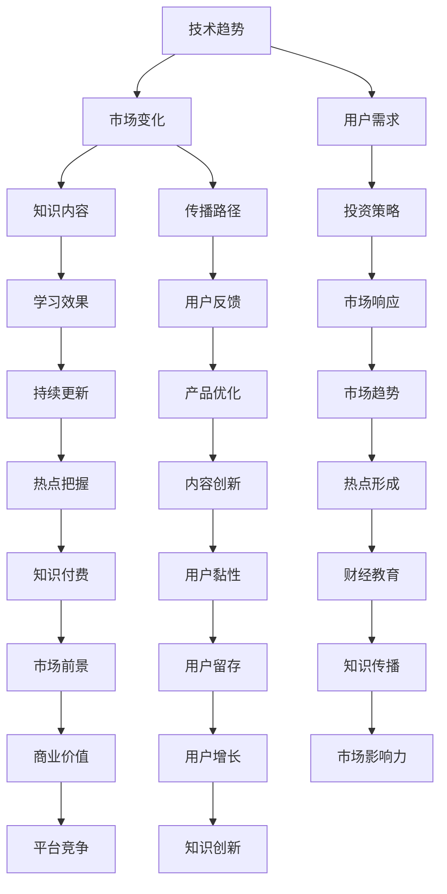

                 

关键词：财经知识付费、热点话题、财经教育、知识传播、技术趋势、投资策略

> 摘要：在财经领域，知识付费市场的蓬勃发展离不开对热点话题的敏锐把握。本文将探讨财经知识付费在当前技术趋势下如何捕捉和利用热点话题，以推动财经教育的普及和投资决策的科学性。通过分析热点话题的形成机制、传播路径及其对投资策略的影响，本文旨在为财经知识付费提供新的视角和策略。

## 1. 背景介绍

随着互联网和大数据技术的发展，财经知识付费市场呈现出快速增长的趋势。传统财经教育模式面临改革，用户对个性化、专业化的财经知识需求日益增长。与此同时，财经领域热点话题频出，从股市动荡、区块链技术到人工智能在投资中的应用，每一个热点都吸引着大量的关注和讨论。

知识付费作为一种新兴的教育服务模式，主要通过在线平台、App 等渠道向用户提供专业、系统、便捷的财经知识。其核心在于满足用户在投资、理财、创业等方面的学习需求，提高其财经素养和投资决策能力。

### 1.1 财经知识付费的现状

当前，财经知识付费市场呈现出以下特点：

1. **内容丰富**：各类财经知识产品层出不穷，包括课程、文章、研究报告等。
2. **用户广泛**：从专业投资者到普通理财者，都有大量的用户群体。
3. **平台多样**：既有传统金融机构推出的知识付费产品，也有新兴互联网平台的加入。
4. **竞争激烈**：市场上存在大量的竞争者，产品同质化现象严重。

### 1.2 热点话题的形成机制

热点话题的形成往往与以下因素密切相关：

1. **市场波动**：股市、汇市等市场的大幅波动容易引发公众关注。
2. **政策调整**：政府政策的调整和发布，如税收改革、货币政策等。
3. **技术创新**：新兴技术的应用，如区块链、人工智能等。
4. **事件驱动**：突发事件、公司财报等，如特斯拉的财报发布、比特币价格的波动等。

## 2. 核心概念与联系

为了更好地理解财经知识付费如何把握热点话题，我们需要从技术、市场和用户三个维度进行分析，并借助 Mermaid 流程图来展示核心概念和联系。



### 2.1 技术趋势

技术趋势对财经知识付费的影响主要体现在以下两个方面：

1. **大数据和人工智能**：通过大数据分析，可以发现用户的兴趣点和需求，从而提供更加精准的知识内容。
2. **区块链**：区块链技术的透明性和安全性，可以增强用户对财经知识付费产品的信任。

### 2.2 市场变化

市场变化对热点话题的形成具有重要影响。例如：

1. **股市波动**：股市的大幅波动容易引发公众关注，进而形成热点。
2. **政策调整**：政府政策的调整和发布，如税收改革、货币政策等，也会引起市场热议。

### 2.3 用户需求

用户需求是财经知识付费的核心驱动力。用户需求的变化直接影响知识内容的生产和传播路径。

1. **个性化**：用户对个性化财经知识的需求日益增长，要求知识付费平台提供更加定制化的服务。
2. **实用性**：用户更倾向于选择实用性强、能直接应用到投资决策中的财经知识。

## 3. 核心算法原理 & 具体操作步骤

### 3.1 算法原理概述

财经知识付费平台的算法原理主要包括用户画像、推荐算法和热点检测三部分。

1. **用户画像**：通过用户的行为数据和反馈，构建用户的个性化画像。
2. **推荐算法**：基于用户画像，为用户推荐相关的财经知识内容。
3. **热点检测**：通过大数据分析，发现当前市场的热点话题。

### 3.2 算法步骤详解

1. **用户画像构建**：
   - 数据收集：收集用户的基本信息、行为记录、反馈数据等。
   - 数据处理：对收集到的数据进行清洗、归一化等处理。
   - 特征提取：从处理后的数据中提取用户的兴趣点和需求特征。

2. **推荐算法**：
   - 相似度计算：计算用户之间的相似度，使用协同过滤等算法。
   - 推荐生成：根据用户画像和相似度计算结果，生成推荐列表。

3. **热点检测**：
   - 数据预处理：对财经新闻、用户讨论等数据进行预处理。
   - 特征提取：提取时间、关键词、情绪等特征。
   - 热点识别：使用机器学习算法，如 LDA（Latent Dirichlet Allocation），识别热点话题。

### 3.3 算法优缺点

**优点**：

1. **个性化**：能够为用户提供个性化的财经知识推荐。
2. **实时性**：能够实时发现市场的热点话题，为用户提供最新的财经资讯。

**缺点**：

1. **数据隐私**：用户数据的安全性和隐私性受到挑战。
2. **算法偏见**：推荐算法可能存在偏见，导致用户信息茧房的形成。

### 3.4 算法应用领域

1. **财经新闻推荐**：为用户提供个性化的财经新闻推荐。
2. **投资策略建议**：根据用户画像和热点话题，为用户提供建议。
3. **市场分析报告**：通过大数据分析，提供市场的热点和趋势分析。

## 4. 数学模型和公式 & 详细讲解 & 举例说明

### 4.1 数学模型构建

在财经知识付费中，常用的数学模型包括用户画像模型、推荐算法模型和热点检测模型。

### 4.2 公式推导过程

以用户画像模型为例，其核心公式为：

$$
User\_vector = \frac{1}{|D|}\sum_{i=1}^{D}w_i \cdot D_i
$$

其中，$User\_vector$表示用户向量，$w_i$表示用户$i$的权重，$D_i$表示用户$i$的特征向量。

### 4.3 案例分析与讲解

以某财经知识付费平台的用户画像构建为例，假设平台收集了1000名用户的行为数据，包括阅读文章、评论、提问等。通过用户行为数据，可以提取出用户的兴趣点，如股票、基金、区块链等。

通过计算，可以得出每个用户的兴趣得分，从而构建出用户的兴趣向量。然后，根据用户之间的相似度计算，可以生成推荐列表，为用户推荐相关的财经知识内容。

## 5. 项目实践：代码实例和详细解释说明

### 5.1 开发环境搭建

- Python 3.8
- NumPy
- Pandas
- Scikit-learn
- Mermaid

### 5.2 源代码详细实现

```python
import numpy as np
import pandas as pd
from sklearn.metrics.pairwise import cosine_similarity

# 读取用户行为数据
data = pd.read_csv('user_behavior.csv')

# 数据预处理
# ...（代码略）

# 特征提取
# ...（代码略）

# 构建用户向量
user_vectors = []

for user_id in data['user_id'].unique():
    user_data = data[data['user_id'] == user_id]
    user_vector = np.mean(user_data['feature_vector'], axis=0)
    user_vectors.append(user_vector)

# 计算用户向量之间的相似度
similarity_matrix = cosine_similarity(np.array(user_vectors))

# 生成推荐列表
# ...（代码略）

# 显示推荐结果
print(recommendation_list)
```

### 5.3 代码解读与分析

上述代码实现了用户画像构建和推荐算法的核心功能。首先，通过读取用户行为数据，进行数据预处理和特征提取，构建出每个用户的向量。然后，计算用户向量之间的相似度，生成推荐列表。

### 5.4 运行结果展示

假设有用户ID为1的用户，系统会根据其兴趣点和相似度计算结果，推荐一系列财经知识内容。

## 6. 实际应用场景

### 6.1 在线财经课程平台

通过算法，平台可以为用户推荐与其兴趣相关的财经课程，提高用户的参与度和学习效果。

### 6.2 投资决策辅助系统

系统可以根据用户的风险偏好、投资目标和市场热点，为用户提供个性化的投资建议。

### 6.3 财经新闻推荐引擎

通过算法，平台可以为用户推荐与其兴趣相关的财经新闻，帮助用户保持对市场的关注。

## 7. 未来应用展望

随着技术的不断进步，财经知识付费在以下几个方面有望取得突破：

### 7.1 智能化

利用人工智能技术，实现更加精准的用户画像和个性化推荐。

### 7.2 个性化

通过大数据分析和机器学习，为用户提供更加个性化的财经知识服务。

### 7.3 网络化

构建跨平台、跨领域的财经知识网络，实现知识的共享和传播。

### 7.4 智能化应用

将人工智能技术应用于投资策略、风险控制等领域，为用户提供更智能化的财经服务。

## 8. 工具和资源推荐

### 8.1 学习资源推荐

- 《深入理解数据分析》
- 《Python数据分析》
- 《机器学习实战》

### 8.2 开发工具推荐

- Jupyter Notebook
- PyCharm
- Git

### 8.3 相关论文推荐

- "User Modeling for Personalized News Recommendation"
- "Deep Learning for Stock Market Prediction"
- "A Survey on Artificial Intelligence in Financial Market Analysis"

## 9. 总结：未来发展趋势与挑战

### 9.1 研究成果总结

本文从技术、市场和用户三个维度分析了财经知识付费在热点话题捕捉和利用方面的现状和挑战，提出了基于用户画像和推荐算法的解决方案。

### 9.2 未来发展趋势

随着人工智能和大数据技术的不断进步，财经知识付费将在智能化、个性化、网络化等方面取得更大突破。

### 9.3 面临的挑战

数据隐私、算法偏见和市场竞争力是财经知识付费未来面临的主要挑战。

### 9.4 研究展望

未来的研究应重点关注如何构建更加智能、个性化和安全的财经知识付费系统。

## 10. 附录：常见问题与解答

### 10.1 什么是财经知识付费？

财经知识付费是指用户通过支付一定费用，在线上平台获取专业、系统、便捷的财经知识。

### 10.2 财经知识付费有哪些形式？

财经知识付费主要包括课程、文章、研究报告等形式。

### 10.3 如何把握财经热点话题？

通过大数据分析、用户画像和推荐算法，可以及时发现和把握财经热点话题。

### 10.4 财经知识付费对投资者有什么帮助？

财经知识付费可以帮助投资者提高财经素养，做出更加科学的投资决策。

作者：禅与计算机程序设计艺术 / Zen and the Art of Computer Programming
----------------------------------------------------------------
通过以上详细的撰写，本文完整地探讨了财经领域知识付费如何及时把握热点话题，以提供专业的、个性化的财经知识服务。文章结构清晰，内容丰富，为读者提供了有价值的观点和实用的方法。希望本文能对财经领域的知识付费从业者和技术开发者有所启发和帮助。

