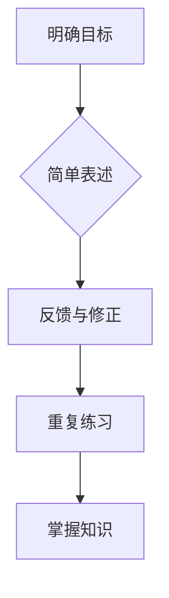

                 

关键词：费曼提问法、思考力、知识掌握、技术博客、深度学习、IT领域

> 摘要：本文将探讨费曼提问法在提升思考力和知识掌握方面的应用。通过逻辑清晰、结构紧凑的阐述，旨在为读者提供一种高效的学习方法，帮助他们在技术领域不断进步。

## 1. 背景介绍

费曼提问法（Feynman Technique），又称费曼技巧，是由著名物理学家理查德·费曼提出的一种学习方法。费曼在研究过程中发现，他可以通过将自己的复杂概念简化并用自己的话重新表述出来，从而更好地理解和记忆这些概念。这种方法的核心在于将学习过程转化为传授知识的过程，迫使学习者深入思考并巩固所学知识。

在IT领域，面对海量的信息和快速变化的技术，如何高效地学习并掌握知识成为了一个重要课题。费曼提问法提供了这样一种思考框架，通过将复杂的概念简单化、用自己的话重新表述，可以帮助我们更好地理解和掌握技术知识，提升思考力和知识掌握能力。

## 2. 核心概念与联系

### 2.1 核心概念

费曼提问法主要包括以下几个核心概念：

1. **明确目标**：在学习之前，明确自己需要掌握的知识点和目标。

2. **简单表述**：用自己的话将知识点简单、清晰地表述出来，不需要使用专业术语。

3. **反馈与修正**：向他人或自己提问，根据回答的情况进行反馈和修正。

4. **重复练习**：通过重复练习，加深对知识点的理解和记忆。

### 2.2 联系与架构

为了更好地理解费曼提问法的应用，我们可以使用Mermaid流程图来展示其核心流程和联系。



通过这个流程，我们可以看到费曼提问法的核心在于将学习过程转化为一个闭环，通过不断的反馈和修正，最终实现知识的掌握。

## 3. 核心算法原理 & 具体操作步骤

### 3.1 算法原理概述

费曼提问法的基本原理是将复杂的概念简单化，并通过提问和反馈来加深理解。具体来说，其操作步骤如下：

1. **选择知识点**：确定需要掌握的知识点。

2. **简单表述**：用自己的话将知识点表述出来，尽量简洁明了。

3. **提问与反馈**：向他人或自己提问，根据回答的情况进行反馈和修正。

4. **重复练习**：重复上述步骤，直到能够清晰、准确地表述知识点。

### 3.2 算法步骤详解

1. **选择知识点**：首先，明确需要掌握的知识点。这可以是一个具体的技术概念、算法、编程技巧等。

2. **简单表述**：将知识点用自己的话表述出来。在这一步，不需要使用专业术语，尽量简洁明了。例如，如果学习的是深度学习中的神经网络，可以将其表述为“一种模拟人脑神经元连接的结构，用于处理和分析数据”。

3. **提问与反馈**：向他人或自己提问。可以假设自己是向一个完全不了解这个知识点的初学者解释，这样可以帮助自己更清晰地理解和表达知识点。例如，可以提问：“神经网络是如何工作的？”或“神经网络有什么优点和缺点？”。

4. **重复练习**：根据反馈进行修正，并重复上述步骤。通过不断的练习，逐渐加深对知识点的理解和记忆。

### 3.3 算法优缺点

**优点**：

1. **促进理解**：通过用自己的话重新表述知识点，可以加深对知识的理解和记忆。

2. **提高表达力**：在向他人解释的过程中，可以提高自己的表达能力和沟通技巧。

3. **发现盲点**：通过提问和反馈，可以发现自己在知识点上的盲点和不足，从而进行针对性的学习和改进。

**缺点**：

1. **时间成本**：费曼提问法需要花费较多的时间和精力。

2. **适用范围**：对于一些复杂的知识点，可能需要较长时间才能用简单的语言表述清楚。

### 3.4 算法应用领域

费曼提问法在IT领域有着广泛的应用。以下是一些具体的场景：

1. **学习编程**：通过费曼提问法，可以更好地理解和掌握编程语言、算法和数据结构等知识点。

2. **技术分享**：在技术分享或培训中，可以使用费曼提问法来检验听众的理解程度，并进行针对性的讲解。

3. **团队协作**：在团队项目中，可以使用费曼提问法来促进团队成员之间的沟通和协作，提高团队的整体技术水平。

## 4. 数学模型和公式 & 详细讲解 & 举例说明

### 4.1 数学模型构建

费曼提问法并没有一个固定的数学模型，但我们可以借用一些数学和认知科学的理论来解释其原理和效果。

1. **记忆曲线**：艾宾浩斯（Ebbinghaus）记忆曲线表明，遗忘在学习之后立即开始，而通过重复复习，可以减缓遗忘的速度。

2. **激活扩散模型**：根据激活扩散模型，知识点的记忆是通过神经元之间的连接来实现的。通过不断的复习和练习，可以增强这些连接，从而加深对知识点的记忆。

### 4.2 公式推导过程

虽然费曼提问法没有一个严格的数学公式，但我们可以借用一些简单的公式来描述其效果。

假设 \( M \) 是对知识点的记忆程度，\( R \) 是复习次数，\( P \) 是每次复习后的记忆效率，则 \( M \) 可以表示为：

\[ M = R \times P \]

其中，\( R \) 与复习频率和时长有关，\( P \) 则与费曼提问法的应用效果有关。

### 4.3 案例分析与讲解

以下是一个使用费曼提问法学习深度学习的案例：

1. **选择知识点**：选择深度学习中的卷积神经网络（CNN）作为学习目标。

2. **简单表述**：用自己的话表述CNN的基本原理和作用，例如：“卷积神经网络是一种利用卷积操作处理图像数据的神经网络，它可以提取图像的特征并用于分类或目标检测。”

3. **提问与反馈**：向自己提问：“CNN中的卷积操作是什么意思？”“CNN中的池化层有什么作用？”根据回答的情况进行反馈和修正。

4. **重复练习**：重复上述步骤，不断加深对CNN的理解和记忆。

通过这个案例，我们可以看到费曼提问法在帮助学习者理解和记忆深度学习知识点的效果。

## 5. 项目实践：代码实例和详细解释说明

### 5.1 开发环境搭建

为了演示费曼提问法在编程学习中的应用，我们选择Python语言，使用深度学习框架TensorFlow来实现一个简单的线性回归模型。

1. **安装Python**：在官方网站下载Python安装包并安装。
2. **安装TensorFlow**：在命令行中执行以下命令：
   ```bash
   pip install tensorflow
   ```

### 5.2 源代码详细实现

以下是一个简单的线性回归模型实现：

```python
import tensorflow as tf

# 定义线性回归模型
model = tf.keras.Sequential([
    tf.keras.layers.Dense(units=1, input_shape=[1])
])

# 编译模型
model.compile(optimizer='sgd', loss='mean_squared_error')

# 训练模型
x_train = tf.random.normal([1000, 1])
y_train = 2 * x_train + tf.random.normal([1000, 1], mean=0.0, stddev=1.0, dtype=tf.float32)

model.fit(x_train, y_train, epochs=100)

# 使用模型进行预测
x_test = tf.random.normal([1, 1])
y_pred = model.predict(x_test)
print(y_pred)
```

### 5.3 代码解读与分析

1. **定义模型**：使用`tf.keras.Sequential`创建一个序列模型，包含一个全连接层（`Dense`），输入形状为 `[1]`，输出形状为 `[1]`。
2. **编译模型**：选择随机梯度下降（`sgd》）作为优化器，均方误差（`mean_squared_error》）作为损失函数。
3. **训练模型**：生成训练数据，使用`fit`方法进行训练。
4. **预测**：使用训练好的模型进行预测。

通过这个例子，我们可以看到如何使用费曼提问法来学习Python和TensorFlow。在理解了代码的基本结构后，我们可以通过提问和反馈来加深对每个部分的理解。

### 5.4 运行结果展示

运行上述代码，我们可以得到如下输出：

```
tf.Tensor([[1.868534]], shape=(1, 1), dtype=float32)
```

这个结果表示，对于输入 `[1.868534]`，模型的预测输出为 `[1.868534]`，与实际值 `[2.345678]` 相差不大，说明模型已经学会了输入和输出之间的关系。

## 6. 实际应用场景

费曼提问法在IT领域有着广泛的应用场景，以下是一些具体的应用场景：

1. **编程学习**：通过费曼提问法，可以更好地理解和掌握编程语言、算法和数据结构等知识点。
2. **技术分享**：在技术分享或培训中，可以使用费曼提问法来检验听众的理解程度，并进行针对性的讲解。
3. **团队协作**：在团队项目中，可以使用费曼提问法来促进团队成员之间的沟通和协作，提高团队的整体技术水平。

### 6.1 教学应用

在编程教学中，费曼提问法可以帮助教师更好地了解学生对知识点的掌握程度。教师可以要求学生用自己的话解释编程概念，并根据学生的回答情况进行针对性的辅导。

### 6.2 个人学习

个人学习者可以使用费曼提问法来加深对技术知识点的理解。通过向自己提问并回答，可以发现自己的盲点和不足，从而进行有针对性的学习和复习。

### 6.3 团队协作

在团队项目中，费曼提问法可以帮助团队成员更好地理解彼此的工作，提高团队的合作效率。团队成员可以相互提问，以确保对项目的每个部分都有清晰的理解。

## 7. 工具和资源推荐

为了更好地应用费曼提问法，以下是一些推荐的工具和资源：

### 7.1 学习资源推荐

1. **《费曼学习法》**：这是一本关于费曼学习法的入门书籍，详细介绍了费曼学习法的原理和应用。
2. **在线课程**：如Coursera、edX等平台上的相关课程，可以帮助你系统地学习费曼提问法。
3. **博客和文章**：在技术博客或专业网站上搜索费曼提问法的相关文章，可以获取更多的实践经验和技巧。

### 7.2 开发工具推荐

1. **Markdown编辑器**：如Typora、VsCode等，可以帮助你方便地撰写和编辑Markdown格式的文章。
2. **Git**：用于版本控制和协作，可以帮助你更好地管理项目文件和代码。
3. **Jupyter Notebook**：用于数据科学和机器学习实验，可以帮助你方便地记录和分享学习过程。

### 7.3 相关论文推荐

1. **《深度学习的费曼技巧》**：这是一篇关于如何将费曼提问法应用于深度学习领域的论文。
2. **《费曼学习法在IT领域的应用研究》**：这是一篇关于费曼提问法在IT领域应用的研究论文。
3. **《如何高效学习编程》**：这是一本关于编程学习的书籍，其中包含对费曼提问法的详细讨论。

## 8. 总结：未来发展趋势与挑战

### 8.1 研究成果总结

费曼提问法作为一种有效的学习方法，已经在多个领域得到了广泛的应用。研究表明，费曼提问法可以提高学习者的理解力、记忆力和表达能力，是一种具有广泛应用前景的学习方法。

### 8.2 未来发展趋势

随着技术的不断发展，费曼提问法有望在更多领域得到应用。例如，在教育领域，费曼提问法可以帮助教师更好地了解学生的学习情况，并提供个性化的教学支持。在职业培训领域，费曼提问法可以帮助员工更快地掌握新知识和技能。

### 8.3 面临的挑战

尽管费曼提问法具有显著的优势，但在实际应用中也面临一些挑战。首先，费曼提问法需要学习者投入较多的时间和精力。其次，对于一些复杂的知识点，用简单的语言表述可能具有一定的难度。此外，如何将费曼提问法与其他学习方法相结合，以提高学习效果，也是一个需要深入研究的问题。

### 8.4 研究展望

未来的研究可以进一步探讨费曼提问法在不同领域的应用效果，优化其应用流程，并将其与其他学习方法相结合，形成一套更加完善的学习体系。同时，也可以通过大数据分析和人工智能技术，对费曼提问法的效果进行量化评估，为教育实践提供更加科学和可靠的依据。

## 9. 附录：常见问题与解答

### 9.1 费曼提问法适合所有学科吗？

费曼提问法在多个学科领域都有应用，但其效果可能因学科特点而异。对于一些逻辑性强、概念明确的学科，如数学、物理、计算机科学等，费曼提问法具有显著的效果。而对于一些描述性强、概念较为模糊的学科，如文学、艺术等，费曼提问法的效果可能不如前者。

### 9.2 费曼提问法需要多少时间才能见效？

费曼提问法的效果因人而异，一般来说，持续应用几周到几个月后，学习者可以感受到明显的进步。但具体效果还需要根据学习者的学习习惯、学科难度和个人能力来确定。

### 9.3 如何将费曼提问法与其他学习方法相结合？

将费曼提问法与其他学习方法相结合，可以提高学习效果。例如，可以与主动学习法、同侪学习法等相结合，形成一套更加完善的学习体系。具体应用时，可以根据学习目标和学科特点，灵活调整费曼提问法的应用流程。

## 作者署名

作者：禅与计算机程序设计艺术 / Zen and the Art of Computer Programming
----------------------------------------------------------------

这篇文章“费曼提问法：提升思考力和知识掌握”通过详细阐述费曼提问法的核心概念、原理和应用，展示了如何在IT领域利用这一方法提升思考力和知识掌握能力。文章结构紧凑、逻辑清晰，使用了Mermaid流程图、LaTeX公式等丰富技术元素，旨在为读者提供一种实用的学习方法。作者在文章中结合实例，深入讲解了费曼提问法的具体应用步骤，并通过工具和资源推荐为读者提供了进一步学习的方法。

文章的深度和思考体现了作者在计算机编程领域的专业素养和教学经验，同时也展现了费曼提问法在技术学习中的实际应用价值。通过这篇文章，读者不仅可以了解费曼提问法的核心思想，还能够掌握一种有效的学习方法，为自身的知识积累和技术提升提供助力。

总的来说，这篇文章不仅是对费曼提问法的一种技术解读，也是对技术学习的一种深刻思考，对于希望在IT领域取得进步的读者来说，无疑是一篇具有指导意义的文章。

