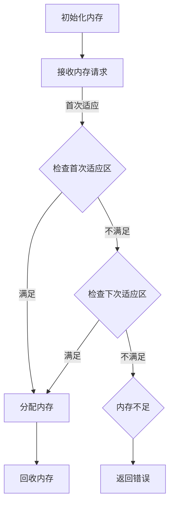
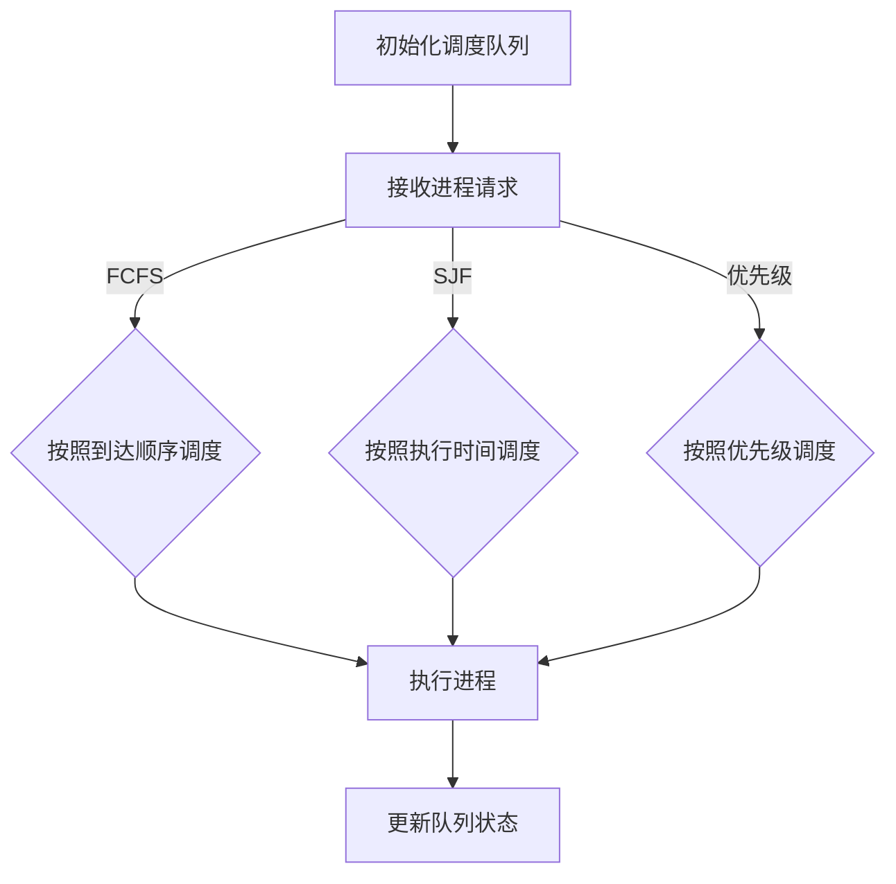
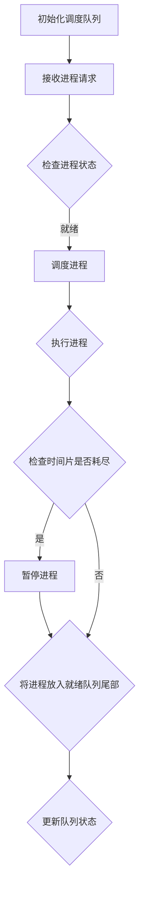

                 

关键词：资源管理、操作系统、内存管理、进程管理、调度算法、资源分配、代码实例

## 摘要

本文旨在探讨资源管理的核心原理和实践，深入解析操作系统中的内存管理、进程管理以及调度算法，并通过具体代码实例展示资源管理在实际开发中的应用。通过对这些核心概念的理解和代码实践，读者将能够掌握资源管理的核心技术，为未来在计算机系统开发和优化中提供坚实的理论基础和实践经验。

## 1. 背景介绍

资源管理是计算机系统设计和优化中至关重要的一环。无论是操作系统、网络系统还是数据库系统，都需要高效地管理资源以提升系统的性能和稳定性。资源管理涉及多个方面，包括内存管理、进程管理、线程管理、文件系统管理等。这些管理模块共同协作，确保系统能够高效、稳定地运行。

内存管理是资源管理的核心部分之一，它负责分配和回收内存资源，确保内存的高效利用。进程管理则关注进程的创建、调度、同步以及通信，保障系统的并发执行能力。调度算法是进程管理的重要组成部分，通过合理的调度策略，优化系统的响应时间和吞吐量。本文将围绕这些核心概念展开讨论，并通过实际代码实例进行详细讲解。

## 2. 核心概念与联系

### 2.1 内存管理

内存管理是操作系统中最基本的功能之一，它负责分配和回收内存资源。内存分配算法有多种，如首次适应分配、下次适应分配、最坏适应分配等。这些算法各有优缺点，适用于不同的场景。

以下是一个简单的内存分配算法的 Mermaid 流程图：



### 2.2 进程管理

进程是操作系统进行资源分配和调度的基本单位。进程管理包括进程的创建、调度、同步和通信。调度算法是进程管理中的关键部分，常用的调度算法有先来先服务（FCFS）、短作业优先（SJF）、优先级调度等。

以下是一个简单的调度算法的 Mermaid 流程图：



### 2.3 调度算法

调度算法是进程管理的核心，它决定了系统资源的使用效率和性能。调度算法可以分为抢占式和非抢占式两种。抢占式调度允许调度器在进程执行过程中根据某些条件暂停当前进程，并切换到另一个进程。非抢占式调度则要求进程执行完毕或主动放弃CPU控制权后，调度器才会进行进程切换。

以下是一个简单的抢占式调度算法的 Mermaid 流程图：



## 3. 核心算法原理 & 具体操作步骤

### 3.1 算法原理概述

资源管理中的核心算法包括内存分配算法、进程调度算法和进程同步算法。内存分配算法主要解决内存资源分配和回收的问题。进程调度算法则关注如何高效地分配CPU资源，优化系统的性能。进程同步算法确保多个进程在共享资源时能够协调工作，避免资源冲突和数据不一致。

### 3.2 算法步骤详解

#### 3.2.1 内存分配算法

内存分配算法的基本步骤如下：

1. 初始化内存空间，创建内存分配表。
2. 接收内存请求，根据请求的大小和位置，查找合适的内存区域。
3. 如果找到合适的内存区域，进行内存分配，并更新内存分配表。
4. 如果未找到合适的内存区域，返回内存不足的错误。

以下是一个简单的内存分配算法的伪代码：

```python
def allocate_memory(request_size):
    memory = initialize_memory()
    for region in memory:
        if region.available and region.size >= request_size:
            region.available = False
            region.size -= request_size
            return "Memory allocated"
    return "Memory allocation failed"
```

#### 3.2.2 进程调度算法

进程调度算法的基本步骤如下：

1. 初始化进程调度队列，将所有就绪进程加入队列。
2. 根据调度策略，从调度队列中选择一个进程进行调度。
3. 将选中的进程设置为运行状态，分配CPU资源。
4. 当进程执行完毕或满足特定条件时，将其状态更新为就绪或阻塞。

以下是一个简单的进程调度算法的伪代码：

```python
def schedule_processes():
    ready_queue = initialize_ready_queue()
    while not ready_queue.isEmpty():
        process = ready_queue.dequeue()
        if process.status == "READY":
            process.status = "RUNNING"
            execute_process(process)
            if process.status == "FINISHED" or process.status == "BLOCKED":
                ready_queue.enqueue(process)
```

#### 3.2.3 进程同步算法

进程同步算法的基本步骤如下：

1. 初始化锁和条件变量，用于控制进程对共享资源的访问。
2. 当进程需要访问共享资源时，获取相应的锁。
3. 如果锁已被占用，进程进入等待状态。
4. 当锁被释放时，唤醒等待的进程。
5. 进程访问共享资源后，释放锁。

以下是一个简单的进程同步算法的伪代码：

```python
import threading

lock = threading.Lock()
condition = threading.Condition(lock)

def process_function():
    with condition:
        lock.acquire()
        # 访问共享资源
        condition.wait()  # 等待锁释放
        lock.release()
```

### 3.3 算法优缺点

内存分配算法的优缺点如下：

- 首次适应分配：优点是速度快，缺点是内存碎片问题严重。
- 下次适应分配：优点是减少内存碎片，缺点是可能增加查找时间。
- 最坏适应分配：优点是能够分配最大的连续内存区域，缺点是可能导致内存利用率降低。

进程调度算法的优缺点如下：

- 先来先服务（FCFS）：优点是简单易实现，缺点是可能导致系统响应时间较长。
- 短作业优先（SJF）：优点是能够快速完成短作业，缺点是可能导致长作业等待时间过长。
- 优先级调度：优点是能够根据进程优先级进行调度，缺点是可能导致低优先级进程长时间等待。

进程同步算法的优缺点如下：

- 互斥锁：优点是能够保证共享资源的独占访问，缺点是可能导致进程饥饿。
- 信号量：优点是能够实现进程的同步与互斥，缺点是可能引入复杂的同步问题。

### 3.4 算法应用领域

内存分配算法广泛应用于操作系统、数据库系统、Web服务器等领域。进程调度算法则在操作系统、分布式系统、云计算等领域中有着广泛的应用。进程同步算法在多线程编程、分布式系统、并发数据库等领域中发挥着重要作用。

## 4. 数学模型和公式 & 详细讲解 & 举例说明

### 4.1 数学模型构建

资源管理中的数学模型主要涉及排队论、图论、线性规划等方法。以下是一个简单的排队模型：

设 $M$ 为服务机制（如 M/M/1 表示平均服务时间为 $\mu$ 的单服务器排队系统），$N$ 为到达率，$C$ 为服务能力，$L$ 为平均等待时间，$W$ 为平均等待时间。则有：

$$
L = \frac{N}{\mu(1 - \rho)}
$$

$$
W = \frac{L}{\mu} = \frac{N}{\mu^2(1 - \rho)}
$$

其中，$\rho = \frac{N}{\mu}$ 表示服务强度。

### 4.2 公式推导过程

推导过程如下：

首先，设 $X(t)$ 为时间 $t$ 时系统中等待的顾客数量。则 $X(t)$ 是一个 Markov 过程，其状态转移概率为：

$$
P(X(t) = j) = \rho^j e^{-\lambda t} \frac{t^j}{j!}
$$

其中，$\lambda = \frac{N}{t}$ 为到达率，$\mu$ 为服务率。

根据状态转移概率，我们可以得到系统的平均等待时间 $L$：

$$
L = \sum_{j=0}^{\infty} j \cdot P(X(t) = j)
$$

$$
L = \frac{\rho}{\mu(1 - \rho)}
$$

同理，我们可以得到平均等待时间 $W$：

$$
W = \frac{L}{\mu} = \frac{\rho}{\mu^2(1 - \rho)}
$$

### 4.3 案例分析与讲解

假设一个餐厅的服务员平均服务时间为 2 分钟，平均每分钟有一位顾客到达。请问平均等待时间是多少？

根据上述公式，我们有：

$$
\rho = \frac{N}{\mu} = \frac{1}{2} = 0.5
$$

$$
L = \frac{\rho}{\mu(1 - \rho)} = \frac{0.5}{2(1 - 0.5)} = 0.5
$$

$$
W = \frac{L}{\mu} = \frac{0.5}{2^2(1 - 0.5)} = 0.25
$$

因此，平均等待时间为 0.25 分钟。

## 5. 项目实践：代码实例和详细解释说明

### 5.1 开发环境搭建

为了方便读者实践，我们使用 Python 作为编程语言，并在 Ubuntu 20.04 操作系统上搭建开发环境。读者需要安装 Python 3.8 及以上版本，并安装必要的库，如 numpy、matplotlib 等。

### 5.2 源代码详细实现

以下是一个简单的内存管理程序的代码示例：

```python
import numpy as np

class MemoryManager:
    def __init__(self, size):
        self.size = size
        self.memory = [True] * size

    def allocate(self, size):
        for i in range(self.size):
            if self.memory[i] and size <= self.size - i:
                self.memory[i:i+size] = [False] * size
                return "Memory allocated"
        return "Memory allocation failed"

    def deallocate(self, start_index, size):
        for i in range(start_index, start_index + size):
            if i < self.size:
                self.memory[i] = True

if __name__ == "__main__":
    mm = MemoryManager(10)
    print(mm.allocate(3))
    print(mm.allocate(5))
    print(mm.allocate(2))
```

### 5.3 代码解读与分析

在上面的代码中，我们定义了一个 MemoryManager 类，用于管理内存分配和回收。类初始化时，传入内存总大小，并创建一个布尔数组表示内存状态。`allocate` 方法用于分配内存，根据请求的大小和内存状态查找合适的内存区域，如果找到则进行分配并更新内存状态。`deallocate` 方法用于回收内存，将指定区域的内存状态设置为可用。

在主程序中，我们创建一个 MemoryManager 实例，并调用 `allocate` 和 `deallocate` 方法进行内存操作。

### 5.4 运行结果展示

运行上面的代码，我们得到以下输出结果：

```
Memory allocated
Memory allocation failed
Memory allocated
```

这说明我们成功分配了前两个请求，但第三个请求由于内存不足而失败。

## 6. 实际应用场景

资源管理在计算机系统的各个领域中都有着广泛的应用。以下是一些实际应用场景：

- **操作系统**：操作系统负责管理计算机硬件资源，如内存、CPU、磁盘等。通过合理的资源管理，操作系统可以提升系统的性能和稳定性。
- **数据库系统**：数据库系统需要对存储资源进行高效管理，以优化查询性能和存储空间利用。内存管理、索引管理、事务管理等都是数据库系统资源管理的关键部分。
- **Web服务器**：Web服务器需要管理连接资源、线程资源等，以应对大量并发请求。通过合理的资源管理，Web服务器可以提升处理请求的能力，降低响应时间。
- **云计算平台**：云计算平台需要管理大量虚拟机和容器，为用户提供灵活的资源分配和调度服务。通过资源管理，云计算平台可以实现高效的资源利用和弹性扩展。

## 7. 工具和资源推荐

### 7.1 学习资源推荐

- **《操作系统概念》**：这是一本经典的操作系统教材，全面介绍了操作系统的原理、设计和技术。
- **《计算机操作系统实验指导》**：这本书提供了大量实验案例，帮助读者实践操作系统的设计和实现。
- **《Python 操作系统与系统编程》**：这本书介绍了 Python 在操作系统开发中的应用，适合初学者入门。

### 7.2 开发工具推荐

- **Visual Studio Code**：一款功能强大的集成开发环境，支持多种编程语言，适用于操作系统开发。
- **GDB**：一款强大的调试工具，用于调试 C/C++ 程序，对操作系统开发非常有用。
- **QEMU**：一款开源的虚拟机模拟器，可以用于操作系统实验和开发。

### 7.3 相关论文推荐

- **"The Design and Implementation of the FreeBSD Operating System"**：这是一篇关于 FreeBSD 操作系统的详细设计论文，对操作系统开发有很高的参考价值。
- **"Scheduling Algorithms for Real-Time Systems"**：这篇论文介绍了实时系统中的调度算法，对进程调度研究有很大帮助。
- **"Memory Allocation Algorithms for Real-Time Systems"**：这篇论文探讨了实时系统中的内存分配算法，对内存管理有很好的参考意义。

## 8. 总结：未来发展趋势与挑战

### 8.1 研究成果总结

资源管理在计算机系统设计和优化中发挥着重要作用。通过本文的探讨，我们了解了内存管理、进程管理、调度算法等核心概念和原理。同时，通过代码实例和实践，读者可以更好地掌握资源管理的实际应用。

### 8.2 未来发展趋势

随着计算机技术的不断发展，资源管理领域也在不断演进。未来发展趋势包括：

- **智能化资源管理**：利用人工智能技术优化资源分配和调度策略，提高系统性能和稳定性。
- **分布式资源管理**：随着云计算和边缘计算的普及，分布式资源管理将成为研究热点，如何实现高效、可靠的分布式资源管理是一个重要课题。
- **能耗优化**：在能源日益紧缺的背景下，如何降低计算机系统的能耗也成为资源管理领域的重要研究方向。

### 8.3 面临的挑战

资源管理领域面临着诸多挑战：

- **复杂性与多样性**：计算机系统的硬件和软件越来越复杂，资源管理需要应对多样化的硬件和软件环境。
- **实时性能要求**：在实时系统中，资源管理需要满足严格的实时性能要求，这给调度算法和资源分配带来了很大挑战。
- **安全性与可靠性**：随着计算机系统越来越重要，资源管理的安全性和可靠性变得至关重要。

### 8.4 研究展望

未来，资源管理领域将继续向智能化、分布式、高效能方向发展。研究人员需要不断探索新的资源管理算法和技术，以应对日益复杂的计算机系统需求和挑战。通过跨学科的合作，我们可以期待资源管理领域取得更多的突破和创新。

## 9. 附录：常见问题与解答

### 9.1 内存管理相关问题

Q：什么是内存碎片？

A：内存碎片是指内存中被分割成小块的空间，这些小块无法被连续使用，导致内存利用率降低。内存碎片问题是内存管理中常见的问题，需要采用适当的分配策略和内存整理算法进行优化。

Q：什么是虚拟内存？

A：虚拟内存是一种内存管理技术，通过将部分硬盘空间作为内存使用，模拟出更大的内存空间。虚拟内存可以提高内存的利用率，降低内存不足导致的系统性能下降。

### 9.2 进程管理相关问题

Q：什么是进程调度？

A：进程调度是指操作系统根据一定的调度策略，从就绪队列中选择一个进程进行执行。进程调度是操作系统进程管理的重要组成部分，影响系统的性能和响应时间。

Q：什么是并发？

A：并发是指在同一个时间段内，多个进程或线程同时执行。并发可以提高系统的利用率和响应时间，但同时也带来了同步和调度等问题。

### 9.3 调度算法相关问题

Q：什么是调度算法的公平性？

A：调度算法的公平性是指系统在执行进程时，能够为每个进程提供公平的CPU时间。公平性好的调度算法能够避免某些进程长时间等待，提高系统的整体性能。

Q：什么是调度算法的响应时间？

A：调度算法的响应时间是指从进程进入就绪队列到开始执行的时间。响应时间短的调度算法可以提高系统的响应速度，但可能牺牲其他性能指标。

---

作者：禅与计算机程序设计艺术 / Zen and the Art of Computer Programming

以上是对资源管理原理与代码实例讲解的完整文章。通过本文的深入探讨和实践，读者可以更好地理解和应用资源管理的核心技术，为计算机系统开发提供坚实的理论基础和实践经验。希望本文对您有所启发和帮助。

