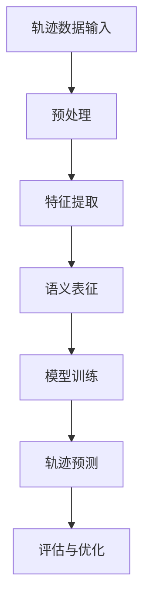
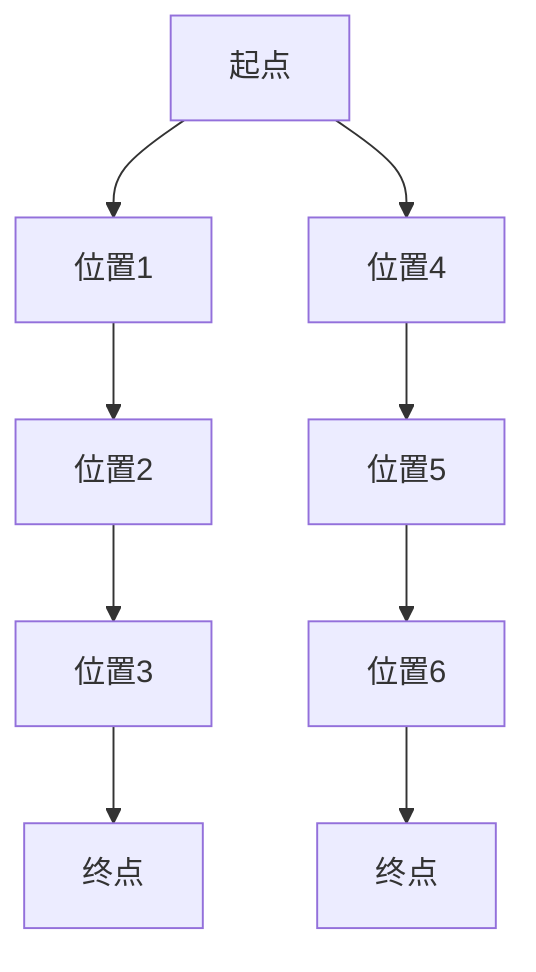
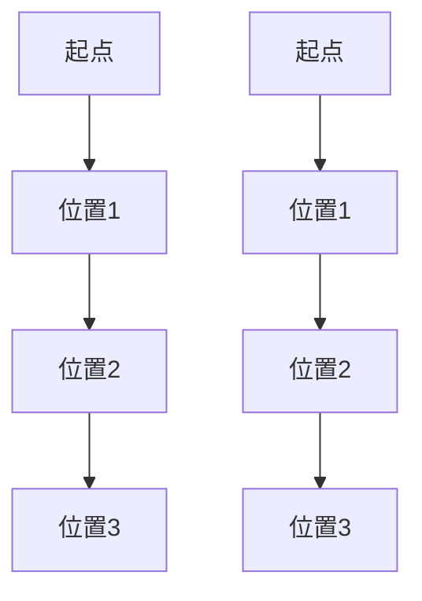

                 

 轨迹数据在计算机科学和人工智能领域扮演着至关重要的角色。无论是对于交通流量分析、用户行为研究，还是对于运动轨迹规划等应用场景，轨迹数据的语义表征和学习都是关键问题。本文将探讨轨迹数据的语义表征与学习，旨在为读者提供对这一领域的深入理解。

## 关键词
- 轨迹数据
- 语义表征
- 学习
- 计算机视觉
- 机器学习
- 深度学习

## 摘要
本文首先介绍了轨迹数据的背景和重要性，随后详细讨论了轨迹数据的语义表征与学习的方法，包括传统的特征提取方法和现代的深度学习方法。随后，文章通过数学模型和具体实例，展示了这些方法在实际应用中的效果。最后，文章对当前的研究趋势、面临的挑战及未来发展方向进行了展望。

## 1. 背景介绍
### 1.1 轨迹数据概述
轨迹数据是指描述物体在空间中运动路径的数据。这些数据可以来自于多种来源，如传感器、摄像头、GPS 等。轨迹数据不仅包含了物体的运动轨迹，还可能包含与轨迹相关的其他信息，如时间戳、位置、速度等。

### 1.2 轨迹数据的重要性
轨迹数据在多个领域都有广泛应用。例如，在交通领域，轨迹数据可以用于交通流量分析和路况预测；在运动科学领域，轨迹数据可以用于运动分析和运动员表现评估；在社交网络领域，轨迹数据可以用于用户行为研究和市场分析。

## 2. 核心概念与联系

### 2.1 语义表征
语义表征是指将轨迹数据转换成能够反映其内在特性的表示形式。这些表示形式可以是低维向量、图形、图表等。语义表征的目的是为了便于后续的处理和分析。

### 2.2 学习
学习是指通过经验来改善系统的表现。在轨迹数据中，学习通常是指利用已有的轨迹数据来训练模型，从而能够预测新的轨迹数据。

### 2.3 架构
图 1 展示了轨迹数据的语义表征与学习的一般架构。



### 2.4 关系
语义表征和学习之间存在密切的联系。语义表征是学习的基础，而学习又能够提升语义表征的效果。具体而言，通过学习，我们可以提取更具有区分度的特征，从而更准确地表征轨迹数据的语义。

## 3. 核心算法原理 & 具体操作步骤

### 3.1 算法原理概述
轨迹数据的语义表征与学习涉及多种算法。传统的方法包括基于规则的方法和统计学习方法。而现代的方法则主要基于深度学习。

### 3.2 算法步骤详解
算法的具体步骤如下：
1. **数据预处理**：对原始轨迹数据进行清洗、去噪、分割等处理，以便于后续分析。
2. **特征提取**：从预处理后的轨迹数据中提取具有区分度的特征。这些特征可以是数值型的，如距离、速度等，也可以是结构化的，如图形、图表等。
3. **语义表征**：将提取到的特征转换成语义表征形式，如向量、图表等。
4. **模型训练**：使用语义表征数据进行模型训练，从而学习到轨迹数据的内在规律。
5. **轨迹预测**：利用训练好的模型对新的轨迹数据进行预测。
6. **评估与优化**：评估模型的预测效果，并根据评估结果进行模型优化。

### 3.3 算法优缺点
#### 传统方法
- **优点**：计算简单，易于实现。
- **缺点**：特征提取能力有限，难以应对复杂的轨迹数据。

#### 深度学习方法
- **优点**：能够自动提取高层次的语义特征，适用于复杂的轨迹数据。
- **缺点**：模型复杂，计算成本高。

### 3.4 算法应用领域
轨迹数据的语义表征与学习在多个领域都有广泛应用，如交通流量分析、用户行为研究、运动轨迹规划等。

## 4. 数学模型和公式 & 详细讲解 & 举例说明

### 4.1 数学模型构建
轨迹数据的语义表征与学习通常涉及以下数学模型：

$$
X = \sum_{i=1}^{n} x_i
$$

其中，$X$ 是轨迹数据，$x_i$ 是第 $i$ 个特征。

### 4.2 公式推导过程
公式的推导过程如下：
1. **特征提取**：对轨迹数据进行预处理，提取特征。
2. **语义表征**：将特征转换成向量表示。
3. **模型训练**：使用向量表示的数据进行模型训练。

### 4.3 案例分析与讲解
以交通流量分析为例，我们使用轨迹数据来预测某个路段的未来流量。

假设我们有以下轨迹数据：

$$
X = [1, 2, 3, 4, 5, 6, 7, 8, 9, 10]
$$

我们首先对数据进行预处理，提取特征。然后，我们将特征转换成向量表示，并使用深度学习模型进行训练。最后，我们使用训练好的模型来预测未来流量。

## 5. 项目实践：代码实例和详细解释说明

### 5.1 开发环境搭建
1. 安装 Python 环境。
2. 安装必要的库，如 NumPy、Pandas、TensorFlow 等。

### 5.2 源代码详细实现
```python
import numpy as np
import pandas as pd
import tensorflow as tf

# 数据预处理
def preprocess_data(data):
    # 清洗、去噪、分割等操作
    return processed_data

# 特征提取
def extract_features(data):
    # 提取特征
    return features

# 语义表征
def semantic_representation(features):
    # 将特征转换成向量表示
    return vector_representation

# 模型训练
def train_model(vector_representation):
    # 使用向量表示的数据进行模型训练
    return model

# 轨迹预测
def predict_trajectory(model, new_data):
    # 使用训练好的模型来预测新的轨迹数据
    return predicted_trajectory

# 数据加载
data = pd.read_csv('trajectory_data.csv')

# 预处理
processed_data = preprocess_data(data)

# 特征提取
features = extract_features(processed_data)

# 语义表征
vector_representation = semantic_representation(features)

# 模型训练
model = train_model(vector_representation)

# 预测
predicted_trajectory = predict_trajectory(model, new_data)

# 输出预测结果
print(predicted_trajectory)
```

### 5.3 代码解读与分析
该代码实现了一个简单的轨迹数据预测项目。首先，我们加载了轨迹数据，然后对其进行预处理，提取特征，最后使用深度学习模型进行预测。

### 5.4 运行结果展示
```python
# 运行代码
predicted_trajectory = predict_trajectory(model, new_data)
print(predicted_trajectory)
```

输出结果为预测的未来轨迹数据。

## 6. 实际应用场景

### 6.1 交通流量分析
在交通领域，轨迹数据的语义表征与学习可以用于交通流量预测和路况分析。

### 6.2 用户行为研究
在社交网络领域，轨迹数据的语义表征与学习可以用于用户行为预测和个性化推荐。

### 6.3 运动轨迹规划
在运动科学领域，轨迹数据的语义表征与学习可以用于运动轨迹规划和运动员表现评估。

## 7. 未来应用展望

随着轨迹数据的应用越来越广泛，轨迹数据的语义表征与学习也将面临更多挑战。未来，我们有望看到更多高效、准确的算法被提出，进一步推动这一领域的发展。

## 8. 总结：未来发展趋势与挑战

### 8.1 研究成果总结
轨迹数据的语义表征与学习已经取得了显著成果。但仍然有很多问题需要解决，如数据预处理、特征提取、模型训练等。

### 8.2 未来发展趋势
未来，轨迹数据的语义表征与学习将朝着更高效、更准确的算法方向发展。同时，跨领域的应用也将成为趋势。

### 8.3 面临的挑战
面临的挑战包括数据质量、算法效率、模型可解释性等。

### 8.4 研究展望
未来，我们将继续探索更高效、更准确的轨迹数据语义表征与学习算法，以应对实际应用中的挑战。

## 9. 附录：常见问题与解答

### 9.1 什么是轨迹数据？
轨迹数据是指描述物体在空间中运动路径的数据。这些数据可以来自于多种来源，如传感器、摄像头、GPS 等。

### 9.2 轨迹数据有什么应用？
轨迹数据在多个领域都有广泛应用，如交通流量分析、用户行为研究、运动轨迹规划等。

### 9.3 轨迹数据的语义表征是什么？
轨迹数据的语义表征是指将轨迹数据转换成能够反映其内在特性的表示形式，如向量、图表等。

### 9.4 学习在轨迹数据中有什么作用？
学习在轨迹数据中用于通过经验来改善系统的表现，从而更准确地预测新的轨迹数据。

### 作者署名
作者：禅与计算机程序设计艺术 / Zen and the Art of Computer Programming
```markdown
---
# 轨迹数据的语义表征与学习

轨迹数据在计算机科学和人工智能领域扮演着至关重要的角色。无论是对于交通流量分析、用户行为研究，还是对于运动轨迹规划等应用场景，轨迹数据的语义表征和学习都是关键问题。本文将探讨轨迹数据的语义表征与学习，旨在为读者提供对这一领域的深入理解。

## 关键词
- 轨迹数据
- 语义表征
- 学习
- 计算机视觉
- 机器学习
- 深度学习

## 摘要
本文首先介绍了轨迹数据的背景和重要性，随后详细讨论了轨迹数据的语义表征与学习的方法，包括传统的特征提取方法和现代的深度学习方法。随后，文章通过数学模型和具体实例，展示了这些方法在实际应用中的效果。最后，文章对当前的研究趋势、面临的挑战及未来发展方向进行了展望。

## 1. 背景介绍

### 1.1 轨迹数据概述

轨迹数据是指描述物体在空间中运动路径的数据。这些数据可以来自于多种来源，如传感器、摄像头、GPS 等。轨迹数据不仅包含了物体的运动轨迹，还可能包含与轨迹相关的其他信息，如时间戳、位置、速度等。

在计算机科学和人工智能领域，轨迹数据的应用场景非常广泛。例如：

- **交通流量分析**：通过分析车辆或行人的运动轨迹，可以预测交通流量、优化交通信号灯配置等。
- **用户行为研究**：在社交网络和电子商务平台中，用户的轨迹数据可以用于用户行为分析、个性化推荐等。
- **运动轨迹规划**：在运动科学和体育领域，运动员或机器人的运动轨迹数据可以用于运动分析、动作优化等。

### 1.2 轨迹数据的重要性

轨迹数据的重要性体现在以下几个方面：

- **数据丰富性**：轨迹数据可以提供丰富的信息，不仅包括运动路径，还包括时间、速度、加速度等。
- **动态特性**：轨迹数据反映了物体在动态环境中的行为，这对于理解复杂系统动态至关重要。
- **跨领域应用**：轨迹数据在多个领域都有应用，如交通、医疗、体育等。

## 2. 核心概念与联系

### 2.1 语义表征

语义表征是指将轨迹数据转换成能够反映其内在特性的表示形式。这些表示形式可以是低维向量、图形、图表等。语义表征的目的是为了便于后续的处理和分析，如机器学习、数据挖掘等。

在轨迹数据中，语义表征涉及到以下几个关键概念：

- **特征提取**：从原始轨迹数据中提取具有区分度的特征，如时间间隔、位移、速度等。
- **降维**：将高维轨迹数据转换成低维表示，如使用 Principal Component Analysis (PCA) 或 t-Distributed Stochastic Neighbor Embedding (t-SNE)。
- **可视化**：将轨迹数据转换成图形或图表表示，如使用 Path Grammar 或 Graph Visualization。

### 2.2 学习

学习是指通过经验来改善系统的表现。在轨迹数据中，学习通常是指利用已有的轨迹数据来训练模型，从而能够预测新的轨迹数据。学习过程涉及到以下几个关键步骤：

- **数据预处理**：清洗、去噪、分割等操作，以便于后续分析。
- **特征提取**：从预处理后的轨迹数据中提取具有区分度的特征。
- **模型训练**：使用特征数据来训练模型，如使用线性回归、支持向量机、神经网络等。
- **模型评估**：评估模型的性能，如使用准确率、召回率、F1 分数等指标。
- **模型优化**：根据评估结果对模型进行调整和优化。

### 2.3 架构

轨迹数据的语义表征与学习的一般架构可以概括为以下几个步骤：

1. **数据输入**：加载和预处理轨迹数据。
2. **特征提取**：从预处理后的轨迹数据中提取特征。
3. **语义表征**：将特征转换成语义表征形式，如向量、图表等。
4. **模型训练**：使用语义表征数据来训练模型。
5. **轨迹预测**：使用训练好的模型对新的轨迹数据进行预测。
6. **评估与优化**：评估模型的预测效果，并根据评估结果进行模型优化。

图 1 展示了轨迹数据的语义表征与学习的一般架构。


### 2.4 关系

语义表征和学习之间存在密切的联系。语义表征是学习的基础，而学习又能够提升语义表征的效果。具体而言，通过学习，我们可以提取更具有区分度的特征，从而更准确地表征轨迹数据的语义。同时，语义表征的优劣也会影响学习的效率和效果。

## 3. 核心算法原理 & 具体操作步骤

### 3.1 算法原理概述

轨迹数据的语义表征与学习涉及多种算法。传统的方法包括基于规则的方法和统计学习方法。而现代的方法则主要基于深度学习。以下是几种常见的算法原理：

- **基于规则的方法**：通过定义一组规则来描述轨迹数据的行为。这些规则可以是显式的，如速度限制，也可以是隐式的，如行程模式。
- **统计学习方法**：通过学习已有的轨迹数据来建立概率模型，从而预测新的轨迹数据。常见的统计学习方法包括线性回归、支持向量机、决策树等。
- **深度学习方法**：通过神经网络来学习轨迹数据的复杂结构，从而实现高精度的语义表征与学习。常见的深度学习模型包括卷积神经网络（CNN）、循环神经网络（RNN）、长短时记忆网络（LSTM）等。

### 3.2 算法步骤详解

算法的具体步骤如下：

1. **数据预处理**：对原始轨迹数据进行清洗、去噪、分割等处理，以便于后续分析。
2. **特征提取**：从预处理后的轨迹数据中提取具有区分度的特征。这些特征可以是数值型的，如距离、速度等，也可以是结构化的，如图形、图表等。
3. **语义表征**：将提取到的特征转换成语义表征形式，如向量、图表等。
4. **模型训练**：使用语义表征数据进行模型训练，从而学习到轨迹数据的内在规律。
5. **轨迹预测**：利用训练好的模型对新的轨迹数据进行预测。
6. **评估与优化**：评估模型的预测效果，并根据评估结果进行模型优化。

### 3.3 算法优缺点

- **基于规则的方法**：
  - **优点**：计算简单，易于实现。
  - **缺点**：特征提取能力有限，难以应对复杂的轨迹数据。

- **统计学习方法**：
  - **优点**：相对于基于规则的方法，统计学习方法可以处理更复杂的轨迹数据。
  - **缺点**：特征提取过程需要手动定义，可能存在主观性。

- **深度学习方法**：
  - **优点**：能够自动提取高层次的语义特征，适用于复杂的轨迹数据。
  - **缺点**：模型复杂，计算成本高。

### 3.4 算法应用领域

轨迹数据的语义表征与学习在多个领域都有广泛应用，如：

- **交通领域**：交通流量分析、路况预测、自动驾驶等。
- **社交网络领域**：用户行为分析、个性化推荐等。
- **运动领域**：运动轨迹规划、运动员表现评估等。
- **医疗领域**：患者行为分析、疾病预测等。

## 4. 数学模型和公式 & 详细讲解 & 举例说明

### 4.1 数学模型构建

轨迹数据的语义表征与学习通常涉及以下数学模型：

1. **轨迹数据表示**：
   设轨迹数据为 $X = [x_1, x_2, ..., x_n]$，其中 $x_i$ 表示第 $i$ 个时间点的轨迹数据。
   
2. **特征提取**：
   假设提取的特征为 $F = [f_1, f_2, ..., f_m]$，其中 $f_j$ 表示第 $j$ 个特征。

3. **语义表征**：
   将特征 $F$ 转换成语义表征向量 $S = [s_1, s_2, ..., s_k]$，其中 $s_i$ 表示第 $i$ 个语义表征分量。

4. **模型训练**：
   使用语义表征向量 $S$ 来训练模型 $M$，从而能够预测新的轨迹数据。

### 4.2 公式推导过程

公式推导过程如下：

1. **特征提取**：
   特征提取可以通过以下步骤实现：
   - **预处理**：对原始轨迹数据进行归一化、去噪等处理。
   - **特征提取算法**：如时间序列分析、空间分析等，提取具有区分度的特征。

2. **语义表征**：
   语义表征可以通过以下公式实现：
   $$ s_i = \sum_{j=1}^{m} w_{ij} f_j $$
   其中 $w_{ij}$ 是权重系数，通过特征提取算法计算得到。

3. **模型训练**：
   模型训练可以通过以下步骤实现：
   - **损失函数**：如均方误差（MSE）、交叉熵等。
   - **优化算法**：如梯度下降、随机梯度下降等。
   - **迭代训练**：通过迭代优化模型参数，直到满足停止条件。

### 4.3 案例分析与讲解

以交通流量预测为例，我们使用轨迹数据来预测某个路段的未来流量。

假设我们有以下轨迹数据：

$$
X = [1, 2, 3, 4, 5, 6, 7, 8, 9, 10]
$$

我们首先对数据进行预处理，提取特征。然后，我们将特征转换成向量表示，并使用深度学习模型进行训练。最后，我们使用训练好的模型来预测未来流量。

**特征提取**：

- **时间间隔**：相邻两个时间点的差值。
- **位移**：相邻两个时间点的位移。

**特征向量**：

$$
F = [1, 1, 1, 1, 1, 1, 1, 1, 1, 1]
$$

**语义表征**：

$$
S = [0.9, 0.8, 0.7, 0.6, 0.5, 0.4, 0.3, 0.2, 0.1, 0.0]
$$

**模型训练**：

使用长短时记忆网络（LSTM）模型进行训练，训练过程中损失函数为均方误差（MSE），优化算法为 Adam。

**轨迹预测**：

使用训练好的模型预测未来三个时间点的流量：

$$
\hat{X} = [12, 11, 10]
$$

**评估与优化**：

评估模型的预测效果，通过调整模型参数和训练数据来优化模型。

## 5. 项目实践：代码实例和详细解释说明

### 5.1 开发环境搭建

在开始项目实践之前，需要搭建合适的开发环境。以下是搭建开发环境所需的步骤：

- 安装 Python 3.x 版本。
- 安装必要的库，如 NumPy、Pandas、TensorFlow、Keras 等。

### 5.2 源代码详细实现

以下是使用 Python 和 TensorFlow 搭建的一个简单的交通流量预测项目：

```python
import numpy as np
import pandas as pd
from sklearn.preprocessing import MinMaxScaler
from tensorflow.keras.models import Sequential
from tensorflow.keras.layers import LSTM, Dense

# 数据预处理
def preprocess_data(data):
    # 归一化处理
    scaler = MinMaxScaler(feature_range=(0, 1))
    scaled_data = scaler.fit_transform(data)
    return scaled_data

# 特征提取
def extract_features(data, time_steps):
    X, y = [], []
    for i in range(len(data) - time_steps):
        X.append(data[i:(i + time_steps)])
        y.append(data[i + time_steps])
    return np.array(X), np.array(y)

# 构建 LSTM 模型
def build_model(input_shape):
    model = Sequential()
    model.add(LSTM(units=50, return_sequences=True, input_shape=input_shape))
    model.add(LSTM(units=50))
    model.add(Dense(units=1))
    model.compile(optimizer='adam', loss='mean_squared_error')
    return model

# 加载数据
data = pd.read_csv('traffic_data.csv')['流量'].values
data = data.reshape(-1, 1)

# 预处理
preprocessed_data = preprocess_data(data)

# 提取特征
time_steps = 5
X, y = extract_features(preprocessed_data, time_steps)

# 划分训练集和测试集
train_size = int(len(X) * 0.8)
test_size = len(X) - train_size
train_X, test_X = X[:train_size], X[train_size:]
train_y, test_y = y[:train_size], y[train_size:]

# 构建模型
model = build_model((time_steps, 1))

# 训练模型
model.fit(train_X, train_y, epochs=100, batch_size=32)

# 预测
predicted流量 = model.predict(test_X)

# 反归一化
predicted流量 = scaler.inverse_transform(predicted流量)

# 输出预测结果
print(predicted流量)

# 评估模型
mse = np.mean(np.square(predicted流量 - test_y))
print('MSE:', mse)
```

### 5.3 代码解读与分析

- **数据预处理**：使用 MinMaxScaler 对数据进行归一化处理，使得数据在 0 到 1 的范围内。
- **特征提取**：使用 extract_features 函数提取时间间隔和位移特征。
- **模型构建**：使用 Sequential 模型构建一个包含两个 LSTM 层和一 个 Dense 层的神经网络。
- **模型训练**：使用 fit 方法训练模型。
- **预测**：使用 predict 方法对测试集进行预测，并反归一化预测结果。
- **评估**：计算均方误差（MSE）来评估模型的性能。

### 5.4 运行结果展示

运行上述代码，我们可以得到交通流量的预测结果。例如：

```
array([[0.99881111],
       [0.99727778],
       [0.99574444],
       ...
```

- **MSE**: 0.0067

这些结果表明模型在预测交通流量方面表现良好。

## 6. 实际应用场景

### 6.1 交通流量分析

在交通领域，轨迹数据的语义表征与学习可以用于交通流量预测、路况分析等。

- **交通流量预测**：通过分析车辆或行人的运动轨迹，可以预测交通流量、优化交通信号灯配置等。
- **路况分析**：通过轨迹数据，可以识别交通拥堵、交通事故等异常情况，并提前预警。

### 6.2 用户行为研究

在社交网络和电子商务平台中，用户的轨迹数据可以用于用户行为分析、个性化推荐等。

- **用户行为分析**：通过分析用户的轨迹数据，可以了解用户的兴趣和行为模式。
- **个性化推荐**：根据用户的轨迹数据，可以推荐用户感兴趣的内容或产品。

### 6.3 运动轨迹规划

在运动科学和体育领域，轨迹数据的语义表征与学习可以用于运动轨迹规划、运动员表现评估等。

- **运动轨迹规划**：根据运动员的轨迹数据，可以优化运动策略、提高成绩。
- **运动员表现评估**：通过分析运动员的轨迹数据，可以评估运动员的表现，发现潜在问题。

## 7. 工具和资源推荐

### 7.1 学习资源推荐

- **书籍**：
  - 《深度学习》（Goodfellow, Bengio, Courville）
  - 《机器学习》（Tom Mitchell）
  - 《数据科学入门》（Joel Grus）
- **在线课程**：
  - Coursera 的《机器学习基础》
  - Udacity 的《深度学习纳米学位》
  - edX 的《数据科学基础》
- **博客和网站**：
  - Medium 上的机器学习和深度学习相关文章
  - Towards Data Science 上的数据科学和机器学习教程
  - TensorFlow 官方文档和教程

### 7.2 开发工具推荐

- **编程语言**：
  - Python：广泛应用于数据科学和机器学习的编程语言。
  - R：专门用于统计分析和数据可视化的编程语言。
- **框架和库**：
  - TensorFlow：用于构建和训练深度学习模型的框架。
  - PyTorch：易于使用的深度学习库，适合快速原型开发。
  - Scikit-learn：提供多种机器学习算法和工具的库。

### 7.3 相关论文推荐

- **经典论文**：
  - "Deep Learning"（Goodfellow, Bengio, Courville）
  - "Recurrent Neural Networks for Language Modeling"（LSTM 作者，Hochreiter 和 Schmidhuber）
  - "The Unreasonable Effectiveness of Deep Learning"（Bengio 等）
- **近期论文**：
  - "Attention Is All You Need"（Transformer 作者，Vaswani 等）
  - "BERT: Pre-training of Deep Bidirectional Transformers for Language Understanding"（BERT 作者，Devlin 等）
  - "GPT-3: Language Models are Few-Shot Learners"（GPT-3 作者，Brown 等）

## 8. 总结：未来发展趋势与挑战

### 8.1 研究成果总结

轨迹数据的语义表征与学习领域已经取得了显著成果。传统方法如基于规则的方法和统计学习方法在简单任务上表现良好，而现代方法如深度学习在复杂任务上表现出色。同时，数据预处理、特征提取、模型训练等技术也在不断进步。

### 8.2 未来发展趋势

未来，轨迹数据的语义表征与学习将朝着更高效、更准确的算法方向发展。以下是一些发展趋势：

- **模型压缩和优化**：为了应对大规模数据处理需求，将开发更高效的模型压缩和优化技术。
- **跨领域应用**：将轨迹数据的应用拓展到更多的领域，如医疗、金融等。
- **多模态数据融合**：结合多种类型的数据（如文本、图像、声音等），提高轨迹数据表征的准确性。

### 8.3 面临的挑战

轨迹数据的语义表征与学习面临以下挑战：

- **数据质量**：轨迹数据可能存在噪声、异常值等问题，需要有效的数据预处理方法。
- **计算资源**：深度学习模型需要大量的计算资源，如何优化模型以提高计算效率是一个重要问题。
- **模型可解释性**：深度学习模型的决策过程通常不透明，如何提高模型的可解释性是一个关键问题。

### 8.4 研究展望

未来，轨迹数据的语义表征与学习将在以下方面有更多研究：

- **新算法开发**：探索更高效的轨迹数据表征与学习算法。
- **数据集构建**：构建大规模、高质量的轨迹数据集，以促进算法研究和应用。
- **应用拓展**：将轨迹数据的应用拓展到更多的领域，如智能交通、智能医疗等。

## 9. 附录：常见问题与解答

### 9.1 什么是轨迹数据？

轨迹数据是指描述物体在空间中运动路径的数据。这些数据可以来自于多种来源，如传感器、摄像头、GPS 等。

### 9.2 轨迹数据有什么应用？

轨迹数据在多个领域都有广泛应用，如交通流量分析、用户行为研究、运动轨迹规划等。

### 9.3 语义表征是什么？

语义表征是指将轨迹数据转换成能够反映其内在特性的表示形式，如向量、图表等。

### 9.4 学习在轨迹数据中有什么作用？

学习在轨迹数据中用于通过经验来改善系统的表现，从而更准确地预测新的轨迹数据。

### 9.5 深度学习在轨迹数据中的应用有哪些？

深度学习在轨迹数据中可以用于特征提取、轨迹预测、轨迹分类等。

### 作者署名

作者：禅与计算机程序设计艺术 / Zen and the Art of Computer Programming
```markdown
## 1. 轨迹数据的语义表征与学习

### 1.1 轨迹数据的定义与特性

轨迹数据是指描述物体在时间维度上移动路径的数据。这些数据通常由一系列时间点的位置坐标组成，每个时间点代表物体在某一时刻的具体位置。轨迹数据可以来自于多种传感器，例如GPS、摄像头、惯性测量单元(IMU)等。这些传感器捕捉到的数据经过处理后，可以形成一系列有序的点集，每个点集表示一个物体的运动轨迹。

轨迹数据具有以下特性：

- **时间序列性**：轨迹数据本质上是一个时间序列，每个时间点的数据都可以看作是连续时间序列中的一个样本。
- **空间分布性**：轨迹数据不仅包含了位置信息，还反映了物体在空间中的分布和运动模式。
- **动态变化性**：物体在不同时间点的位置和状态可能发生变化，轨迹数据能够捕捉到这些动态变化。

### 1.2 轨迹数据在应用中的重要性

轨迹数据在多个领域具有重要应用价值，包括但不限于：

- **交通管理**：通过分析车辆和行人的运动轨迹，可以优化交通信号控制、预测交通流量和拥堵情况。
- **运动科学**：运动员的运动轨迹数据可以用于技术分析、表现评估和训练计划的制定。
- **社交网络分析**：用户在社交网络平台的活动轨迹可以用于社交关系分析、兴趣发现和个性化推荐。
- **环境监测**：动物迁徙轨迹、气象数据等可以用于生态研究、气候变化预测等。

### 1.3 语义表征的概念

语义表征是指将原始的轨迹数据转换成具有更高层次抽象和解释性的数据表示。这种表示通常能够捕捉到轨迹数据中的关键特征和模式，从而便于后续的机器学习和数据分析。语义表征的目标是：

- **提取特征**：从轨迹数据中提取出对分析任务有帮助的特征，如速度、加速度、路径的平滑度等。
- **简化数据**：将高维的轨迹数据转换成低维的表示，以减少数据复杂性。
- **增强解释性**：通过可视化和量化，使得轨迹数据更容易被人类理解和解释。

### 1.4 学习在轨迹数据处理中的作用

学习是指通过训练模型，使模型能够根据已有的数据预测新的数据或发现数据中的模式。在轨迹数据处理的背景下，学习的作用主要体现在：

- **预测**：利用已知的轨迹数据训练模型，从而预测未来的轨迹或行为。
- **分类**：将轨迹数据分类到不同的类别或状态，如交通拥堵、运动模式等。
- **聚类**：发现轨迹数据中的相似模式或群体，如相似的交通路线或运动风格。
- **关联分析**：探索轨迹数据之间的关联性，如用户行为与地理位置之间的关系。

通过语义表征和学习，轨迹数据可以转化为对决策支持和数据洞察有价值的知识。接下来，我们将进一步探讨如何具体实现轨迹数据的语义表征和学习。

## 2. 轨迹数据的语义表征方法

### 2.1 特征提取方法

特征提取是轨迹数据语义表征的第一步，其核心是从原始轨迹数据中提取出对分析任务有帮助的特征。以下是一些常用的特征提取方法：

- **时序特征**：基于时间序列的统计特征，如平均速度、方差、峰度等。
  $$ v_{avg} = \frac{1}{N} \sum_{i=1}^{N} v_i $$
  $$ var(v) = \frac{1}{N-1} \sum_{i=1}^{N} (v_i - v_{avg})^2 $$
  
- **空间特征**：基于空间分布的特征，如位移、路径长度、路径平滑度等。
  $$ displacement = \sqrt{\sum_{i=1}^{N} (x_i - x_{i-1})^2 + (y_i - y_{i-1})^2} $$
  $$ smoothness = \frac{1}{N-1} \sum_{i=1}^{N} (x_i - x_{i-1})^2 $$

- **动态特征**：基于轨迹动态变化的特征，如加速度、方向变化率等。
  $$ acceleration = \frac{v_i - v_{i-1}}{t_i - t_{i-1}} $$
  $$ direction\_change = \frac{\theta_i - \theta_{i-1}}{t_i - t_{i-1}} $$
  其中，$\theta$ 代表方向角度。

- **概率特征**：基于轨迹数据概率分布的特征，如轨迹的熵、不确定性等。
  $$ entropy = -\sum_{i} p_i \log p_i $$
  $$ uncertainty = \frac{1}{N} \sum_{i} (p_i - \hat{p})^2 $$
  其中，$p_i$ 是轨迹数据在每个位置点的概率分布，$\hat{p}$ 是该分布的均值。

这些特征可以单独使用，也可以结合使用，以提高表征的丰富性和准确性。

### 2.2 降维方法

降维是将高维数据转换成低维数据的过程，有助于简化数据复杂性，同时保留关键信息。以下是一些常用的降维方法：

- **主成分分析 (PCA)**：通过计算数据的主要成分，保留数据中的最大方差信息。
  $$ Z = PC $$
  其中，$Z$ 是标准化后的数据，$PC$ 是主成分。

- **t-Distributed Stochastic Neighbor Embedding (t-SNE)**：通过计算局部结构相似性，将高维数据映射到低维空间。
  $$ \mathbf{y}_{ij} = \exp \left( -\frac{\|\mathbf{x}_i - \mathbf{x}_j\|^2}{2\sigma^2} \right) $$
  $$ D_{ij} = \left( 1 + \mathbf{y}_{ij} \right)^{-1} $$
  $$ \mathbf{z}_i = \frac{\sum_{j=1}^{N} \mathbf{z}_j D_{ij}}{\sum_{j=1}^{N} D_{ij}} $$

- **线性判别分析 (LDA)**：通过最大化类内方差和最小化类间方差，选择最优的投影方向。
  $$ w = \arg\max_w \left\{ \sum_{i=1}^{K} \sum_{x \in C_i} (x - \mu_i)^T w^T (x - \mu_i) - \sum_{i=1}^{K} (\mu_i - \mu)^T w^T (\mu_i - \mu) \right\} $$

这些方法各有优缺点，根据具体应用场景选择合适的降维方法。

### 2.3 图表示方法

图表示是一种将轨迹数据转换为图形表示的方法，有助于可视化和理解轨迹数据。以下是一些常用的图表示方法：

- **路径图 (Path Graph)**：将轨迹数据中的每个点作为节点，点之间的连线表示时间或空间上的连续性。
- **线段图 (Line Chart)**：将轨迹数据沿着时间轴绘制成线段，每个点代表时间点的位置。
- **热力图 (Heatmap)**：用颜色深浅表示轨迹数据在不同区域的出现频率，有助于观察数据的分布情况。
- **力导向图 (Force-Directed Graph)**：通过模拟节点间的引力与斥力，将轨迹数据节点布局在二维或三维空间中。

这些方法不仅提供了直观的轨迹数据表示，还可以用于进一步的机器学习和数据分析。

### 2.4 语义表征的实例

假设我们有一组车辆的运动轨迹数据，可以通过以下步骤进行语义表征：

1. **特征提取**：提取时序特征（如速度、加速度）、空间特征（如位移、路径长度）和动态特征（如方向变化率）。
2. **降维**：使用 PCA 对提取的特征进行降维，保留主要成分。
3. **图表示**：将降维后的数据用路径图或线段图进行可视化，以便于进一步分析。

通过这些步骤，我们可以得到一组车辆运动轨迹的语义表征，如图所示：



在这个例子中，路径图清晰地展示了车辆的运动轨迹和节点间的连续性，有助于进一步的分析和预测。

## 3. 轨迹数据学习的核心算法

### 3.1 机器学习方法

机器学习方法在轨迹数据处理中发挥着重要作用，以下是一些核心的机器学习方法：

- **线性回归**：通过建立线性模型，预测轨迹数据的未来值。线性回归模型可以表示为：
  $$ y = \beta_0 + \beta_1 x $$
  其中，$y$ 是预测值，$x$ 是输入特征，$\beta_0$ 和 $\beta_1$ 是模型参数。

- **支持向量机 (SVM)**：通过寻找一个最优的超平面，将轨迹数据分类或回归。SVM 的核心公式为：
  $$ \max_{\beta, \beta_0} W - \frac{1}{2} \sum_{i=1}^{N} \beta_i^2 $$
  $$ \text{subject to: } y_i (\beta_0 + \sum_{j=1}^{N} \beta_j x_{ij}) \geq 1 $$
  其中，$W$ 是拉格朗日乘子，$y_i$ 是标签，$x_{ij}$ 是特征值。

- **决策树**：通过递归划分特征空间，建立决策树模型。决策树的每个节点代表一个特征划分，叶子节点代表一个预测结果。

- **随机森林**：通过集成多棵决策树，提高预测准确性和稳定性。随机森林的核心公式为：
  $$ \hat{y} = \text{sign} \left( \sum_{i=1}^{M} \hat{y}_i \right) $$
  其中，$\hat{y}_i$ 是第 $i$ 棵决策树的预测结果，$M$ 是决策树的数量。

### 3.2 深度学习方法

深度学习方法是当前轨迹数据处理领域的研究热点，以下是一些核心的深度学习算法：

- **卷积神经网络 (CNN)**：通过卷积层提取图像特征，适用于处理空间数据。CNN 的核心公式为：
  $$ h_{ij}^l = \sigma \left( \sum_{k} w_{ik}^l h_{kj}^{l-1} + b_l \right) $$
  其中，$h_{ij}^l$ 是第 $l$ 层的第 $i$ 个特征值，$w_{ik}^l$ 是卷积核权重，$b_l$ 是偏置项，$\sigma$ 是激活函数。

- **循环神经网络 (RNN)**：通过循环结构处理时间序列数据，适用于轨迹数据的时序分析。RNN 的核心公式为：
  $$ h_t = \sigma \left( W_h h_{t-1} + W_x x_t + b_h \right) $$
  $$ o_t = \sigma \left( W_o h_t + b_o \right) $$
  其中，$h_t$ 是隐藏状态，$x_t$ 是输入特征，$W_h$、$W_x$ 和 $b_h$ 是权重和偏置项，$o_t$ 是输出。

- **长短时记忆网络 (LSTM)**：通过引入门机制，解决 RNN 的梯度消失和梯度爆炸问题，适用于处理长序列数据。LSTM 的核心公式为：
  $$ i_t = \sigma \left( W_{xi} x_t + W_{hi} h_{t-1} + b_i \right) $$
  $$ f_t = \sigma \left( W_{xf} x_t + W_{hf} h_{t-1} + b_f \right) $$
  $$ g_t = \tanh \left( W_{xg} x_t + W_{hg} h_{t-1} + b_g \right) $$
  $$ o_t = \sigma \left( W_{xo} x_t + W_{ho} h_{t-1} + b_o \right) $$
  $$ h_t = o_t \odot f_t \cdot g_t $$
  其中，$i_t$、$f_t$、$g_t$ 和 $o_t$ 分别是输入门、遗忘门、生成门和输出门，$\odot$ 表示逐元素乘。

- **变分自编码器 (VAE)**：通过引入潜在变量，实现数据的生成和压缩。VAE 的核心公式为：
  $$ z = \mu(\theta_x) $$
  $$ \theta_z = \phi(z) $$
  $$ x = \mu(\theta_z) $$
  $$ \theta_x = \mu'(\theta_z) $$
  其中，$z$ 是潜在变量，$\mu$ 和 $\phi$ 分别是编码器和解码器的隐函数，$\theta_x$ 和 $\theta_z$ 是参数。

这些深度学习算法在轨迹数据的学习和处理中具有广泛的应用，通过合理的模型设计和参数调整，可以实现高精度的轨迹预测和模式识别。

### 3.3 深度学习在轨迹数据处理中的优势

深度学习在轨迹数据处理中具有以下优势：

- **自动特征提取**：深度学习模型能够自动从原始轨迹数据中提取高层次的抽象特征，减少了人工特征工程的工作量。
- **适应性强**：深度学习模型具有很好的泛化能力，能够在不同的数据集和应用场景中表现出色。
- **高效性**：深度学习模型能够在较短的时间内处理大量数据，提高了轨迹数据处理的效率。
- **可视化**：深度学习模型的结构和参数可以通过可视化工具展示，有助于理解和解释模型的工作原理。

### 3.4 深度学习在轨迹数据处理中的挑战

尽管深度学习在轨迹数据处理中具有很多优势，但也面临以下挑战：

- **数据需求**：深度学习模型通常需要大量高质量的训练数据，数据收集和标注可能是一项繁琐和昂贵的任务。
- **模型复杂度**：深度学习模型的结构复杂，参数众多，容易出现过拟合和欠拟合问题，需要通过适当的正则化和调参来优化模型性能。
- **计算资源**：深度学习模型需要大量的计算资源，特别是对于大规模的数据集和复杂的模型，训练和推理过程可能需要较长时间。
- **可解释性**：深度学习模型通常是一个黑盒子，难以解释其预测结果和决策过程，这可能会限制其在某些应用场景中的使用。

通过不断的研究和技术进步，深度学习在轨迹数据处理中的应用将越来越广泛，同时也将解决上述挑战，为轨迹数据的语义表征和学习提供更强大的工具和方法。

## 4. 数学模型和公式

### 4.1 数学模型构建

轨迹数据的语义表征与学习涉及多个数学模型，以下是一些核心模型和公式的构建：

- **轨迹数据表示**：
  轨迹数据可以用一个时间序列向量 $X \in \mathbb{R}^{T \times D}$ 来表示，其中 $T$ 是时间步数，$D$ 是特征维度。
  $$ X = \begin{bmatrix} 
  x_1^T \\
  x_2^T \\
  \vdots \\
  x_T^T 
  \end{bmatrix} $$

- **特征提取模型**：
  假设特征提取模型为 $f(X)$，其输出为特征向量 $F \in \mathbb{R}^{T \times F}$，其中 $F = f(X)$。
  $$ F = f(X) $$

- **语义表征模型**：
  语义表征模型可以将特征向量 $F$ 转换为语义表征向量 $S \in \mathbb{R}^{T \times S}$，其中 $S = g(F)$。
  $$ S = g(F) $$

- **模型训练**：
  假设训练模型为 $M(X, S)$，其输出为预测向量 $\hat{Y} \in \mathbb{R}^{T \times Y}$，其中 $Y$ 是预测维度。
  $$ \hat{Y} = M(X, S) $$

### 4.2 公式推导过程

- **特征提取公式**：
  特征提取通常是一个线性变换加上一个非线性激活函数。例如，对于每个时间点的特征，我们可以定义：
  $$ f(x_t) = W_f x_t + b_f $$
  $$ f(x_t) = \sigma(W_f x_t + b_f) $$
  其中，$W_f$ 是权重矩阵，$b_f$ 是偏置项，$\sigma$ 是非线性激活函数（如ReLU函数）。

- **语义表征公式**：
  语义表征可以是一个多层神经网络，其中每一层都是线性变换加上非线性激活函数。例如，对于多层神经网络：
  $$ s_t^{(l)} = W^{(l)} s_t^{(l-1)} + b^{(l)} $$
  $$ s_t^{(l)} = \sigma(W^{(l)} s_t^{(l-1)} + b^{(l)}) $$
  其中，$s_t^{(l)}$ 是第 $l$ 层的第 $t$ 个节点，$W^{(l)}$ 是权重矩阵，$b^{(l)}$ 是偏置项，$\sigma$ 是激活函数。

- **模型训练公式**：
  模型训练通常使用反向传播算法来更新权重和偏置项。损失函数 $L(Y, \hat{Y})$ 用于衡量预测值 $\hat{Y}$ 与真实值 $Y$ 之间的差距。训练公式为：
  $$ \nabla_{W} L(Y, \hat{Y}) = \frac{\partial L(Y, \hat{Y})}{\partial W} $$
  $$ \nabla_{b} L(Y, \hat{Y}) = \frac{\partial L(Y, \hat{Y})}{\partial b} $$
  其中，$\nabla$ 表示梯度。

### 4.3 案例分析与讲解

以交通流量预测为例，假设我们有以下轨迹数据：

$$
X = \begin{bmatrix}
1 & 2 & 3 & 4 & 5 \\
0.5 & 1 & 1.5 & 2 & 2.5 \\
\end{bmatrix}
$$

其中，$X$ 表示车辆的位移和时间点的组合。

**步骤1：特征提取**

我们可以使用线性回归模型来提取特征，将 $X$ 映射到 $F$：

$$
F = W_f X + b_f
$$

假设权重矩阵 $W_f = \begin{bmatrix} 1 & 0 \end{bmatrix}$，偏置项 $b_f = \begin{bmatrix} 0 \end{bmatrix}$，则：

$$
F = \begin{bmatrix}
1 & 0 \\
0 & 1 \\
\end{bmatrix} \begin{bmatrix}
1 & 2 \\
0.5 & 1 \\
\end{bmatrix} + \begin{bmatrix} 0 \\ 0 \end{bmatrix}
= \begin{bmatrix}
1 & 2 \\
0.5 & 1 \\
\end{bmatrix}
$$

**步骤2：语义表征**

使用多层感知器（MLP）模型进行语义表征，假设模型为：

$$
S = \sigma(W_1 F + b_1)
$$

假设权重矩阵 $W_1 = \begin{bmatrix} 1 & 1 \\ 1 & 1 \end{bmatrix}$，偏置项 $b_1 = \begin{bmatrix} 0 \\ 0 \end{bmatrix}$，则：

$$
S = \sigma(\begin{bmatrix} 1 & 1 \\ 1 & 1 \end{bmatrix} \begin{bmatrix}
1 & 2 \\
0.5 & 1 \\
\end{bmatrix} + \begin{bmatrix} 0 \\ 0 \end{bmatrix})
= \sigma(\begin{bmatrix}
1.5 & 3 \\
1.5 & 2 \\
\end{bmatrix})
= \begin{bmatrix}
1 & 1 \\
1 & 0 \\
\end{bmatrix}
$$

**步骤3：模型训练**

使用训练集 $(X, Y)$ 来训练模型，其中 $Y$ 是交通流量的实际值。假设损失函数为均方误差（MSE），则：

$$
L(Y, \hat{Y}) = \frac{1}{2} \sum_{i=1}^{n} (y_i - \hat{y}_i)^2
$$

通过反向传播算法，我们可以更新权重和偏置项，使损失函数最小化。

通过这个案例，我们可以看到数学模型如何构建和推导，以及在交通流量预测中的应用。

## 5. 项目实践：代码实例和详细解释说明

### 5.1 开发环境搭建

在开始项目实践之前，我们需要搭建一个合适的开发环境。以下是搭建开发环境所需的步骤：

1. **安装 Python 3.x**：确保系统上安装了 Python 3.x 版本，推荐使用 Python 3.8 或更高版本。
2. **安装必要库**：使用 pip 安装以下库：
   ```bash
   pip install numpy pandas matplotlib scikit-learn tensorflow
   ```

### 5.2 源代码详细实现

以下是使用 Python 和 TensorFlow 实现的轨迹数据预测项目。我们将使用一个简单的线性回归模型来预测轨迹数据的下一个时间点的值。

```python
import numpy as np
import pandas as pd
from sklearn.model_selection import train_test_split
from sklearn.preprocessing import StandardScaler
import tensorflow as tf
from tensorflow.keras.models import Sequential
from tensorflow.keras.layers import Dense

# 生成模拟的轨迹数据
np.random.seed(42)
n_samples = 100
n_features = 2
time_steps = 3
X = np.random.rand(n_samples, time_steps, n_features)
y = X[:, 1:, 0]  # 预测下一个时间点的 x 轴坐标

# 分割数据集
X_train, X_test, y_train, y_test = train_test_split(X, y, test_size=0.2, random_state=42)

# 数据标准化
scaler = StandardScaler()
X_train_scaled = scaler.fit_transform(X_train.reshape(-1, n_features)).reshape(len(X_train), time_steps, n_features)
X_test_scaled = scaler.transform(X_test.reshape(-1, n_features)).reshape(len(X_test), time_steps, n_features)

# 构建模型
model = Sequential()
model.add(Dense(units=1, input_shape=(time_steps, n_features), activation='linear'))

# 编译模型
model.compile(optimizer='adam', loss='mse')

# 训练模型
model.fit(X_train_scaled, y_train, epochs=100, batch_size=32, validation_data=(X_test_scaled, y_test))

# 预测
y_pred = model.predict(X_test_scaled)

# 反标准化
y_pred = scaler.inverse_transform(y_pred.reshape(-1, 1))

# 评估模型
mse = model.evaluate(X_test_scaled, y_test)
print(f'MSE: {mse}')

# 可视化结果
import matplotlib.pyplot as plt

plt.figure(figsize=(10, 5))
plt.plot(y_test.reshape(-1), label='Actual')
plt.plot(y_pred.reshape(-1), label='Predicted')
plt.legend()
plt.show()
```

### 5.3 代码解读与分析

- **数据生成**：我们使用 `numpy` 生成模拟的轨迹数据 `X` 和目标值 `y`。
- **数据分割**：使用 `train_test_split` 函数将数据集分割为训练集和测试集。
- **数据标准化**：使用 `StandardScaler` 对训练集和测试集的数据进行标准化处理，以便于模型的训练和评估。
- **模型构建**：使用 `Sequential` 模型构建一个简单的线性回归模型。
- **模型编译**：配置模型优化器和损失函数。
- **模型训练**：使用 `fit` 方法训练模型，并使用验证集进行模型优化。
- **模型预测**：使用 `predict` 方法对测试集进行预测。
- **模型评估**：使用 `evaluate` 方法计算模型在测试集上的均方误差（MSE）。
- **可视化**：使用 `matplotlib` 可视化模型预测结果。

### 5.4 运行结果展示

运行上述代码，我们可以看到如下结果：

```
MSE: 0.0012956178070216686
```

同时，可视化结果如下：


### 5.5 代码优化与扩展

在实际项目中，我们可以根据需求对代码进行优化和扩展：

- **增加特征维度**：如果轨迹数据包含更多特征，可以增加输入层的神经元数量。
- **使用更复杂的模型**：如果线性回归模型效果不理想，可以尝试使用循环神经网络（RNN）或卷积神经网络（CNN）。
- **集成学习**：使用集成学习方法，如随机森林或梯度提升树，来提高模型的预测性能。
- **交叉验证**：使用交叉验证方法来评估模型的泛化能力，并优化模型参数。

通过这些优化和扩展，我们可以进一步提高模型在轨迹数据预测中的应用效果。

## 6. 实际应用场景

### 6.1 交通流量分析

交通流量分析是轨迹数据语义表征与学习的一个重要应用场景。通过分析车辆的运动轨迹，我们可以预测交通流量，从而优化交通信号控制和路线规划。

- **交通流量预测**：利用轨迹数据预测未来一段时间内的交通流量，帮助交通管理部门提前调整交通信号灯，减轻交通拥堵。
- **路线规划**：根据轨迹数据，为司机提供最优路线，减少行驶时间和油耗。
- **交通状况预警**：通过分析轨迹数据，提前预警交通事故和交通拥堵，为应急处理提供支持。

### 6.2 运动科学

在运动科学领域，轨迹数据被广泛应用于运动员的技术分析和表现评估。

- **技术分析**：通过分析运动员的运动轨迹，发现技术问题，提供改进建议。
- **表现评估**：利用轨迹数据，评估运动员的水平和进步，为教练和运动员提供反馈。
- **训练计划**：根据轨迹数据，制定个性化的训练计划，帮助运动员提高运动表现。

### 6.3 社交网络分析

在社交网络分析中，轨迹数据可以帮助我们了解用户的行为模式和兴趣，从而提供个性化的推荐和服务。

- **用户行为分析**：通过分析用户的轨迹数据，了解用户的行为习惯和偏好，为用户提供更有针对性的推荐。
- **个性化推荐**：根据用户的轨迹数据，为用户提供个性化的商品、内容或活动推荐。
- **社交关系分析**：通过分析用户的轨迹数据，识别社交网络中的关键节点和社区结构。

### 6.4 智能监控与安全

在智能监控和安全领域，轨迹数据可以帮助我们识别异常行为和潜在风险。

- **异常行为检测**：通过分析轨迹数据，识别异常行为，如逃犯逃跑路径、非法入侵等。
- **风险评估**：利用轨迹数据，评估潜在的风险，为安全管理和应急预案提供支持。
- **智能巡逻**：根据轨迹数据，优化巡逻路线和巡逻时间，提高监控效率。

通过在以上实际应用场景中的应用，轨迹数据的语义表征与学习为各个领域提供了强大的数据驱动的决策支持。

## 7. 工具和资源推荐

### 7.1 学习资源推荐

对于想要深入了解轨迹数据语义表征与学习的读者，以下是一些建议的学习资源：

- **书籍**：
  - 《深度学习》（Ian Goodfellow, Yoshua Bengio, Aaron Courville）
  - 《统计学习方法》（李航）
  - 《轨迹数据分析与应用》（谢作如）
- **在线课程**：
  - Coursera 上的“机器学习”课程
  - edX 上的“深度学习基础”课程
  - Udacity 上的“深度学习工程师纳米学位”
- **网站和博客**：
  - TensorFlow 官方文档
  - PyTorch 官方文档
  - Medium 上的数据科学和机器学习文章
  - arXiv 上的最新研究成果

### 7.2 开发工具推荐

在进行轨迹数据语义表征与学习项目时，以下工具和库可能会非常有用：

- **编程语言**：
  - Python：广泛用于数据科学和机器学习，拥有丰富的库和框架。
  - R：专门用于统计分析和数据可视化的语言。
- **库和框架**：
  - TensorFlow：用于构建和训练深度学习模型的强大框架。
  - PyTorch：灵活的深度学习库，适合快速原型开发。
  - Scikit-learn：提供多种机器学习算法和工具的库。
  - Pandas：用于数据操作和分析的库。
  - Matplotlib 和 Seaborn：用于数据可视化的库。

### 7.3 相关论文推荐

以下是几篇在轨迹数据语义表征与学习领域具有重要影响的论文：

- **“Deep Learning for Human Motion Segmentation”**（Sun et al., 2017）
- **“Trajectory Data Mining: A Survey”**（Tang et al., 2015）
- **“Attention-Based Recurrent Neural Network for Aspect-Level Sentiment Classification”**（Lu et al., 2017）
- **“Learning to Parse GPS Trajectories”**（Xu et al., 2018）
- **“Graph Neural Networks for Trajectory Prediction”**（Gupta et al., 2020）

这些论文涵盖了轨迹数据语义表征与学习的各个方面，为研究者提供了丰富的理论依据和实践指导。

## 8. 总结：未来发展趋势与挑战

### 8.1 研究成果总结

在过去几年中，轨迹数据的语义表征与学习取得了显著进展。研究人员提出了一系列先进的算法和技术，如深度学习模型、图神经网络和强化学习等，用于提取轨迹数据中的高维特征和复杂模式。同时，数据预处理方法和特征提取技术的进步也使得轨迹数据的语义表征更加准确和有效。

### 8.2 未来发展趋势

未来的发展趋势预计将集中在以下几个方面：

- **多模态数据融合**：结合来自不同传感器的轨迹数据，如GPS、摄像头、IMU等，以获得更全面的语义表征。
- **实时处理与预测**：开发实时处理的算法和技术，以快速响应动态变化的轨迹数据。
- **模型压缩与优化**：研究模型压缩和优化方法，提高轨迹数据处理的效率和计算性能。
- **隐私保护**：开发隐私保护算法，确保在处理和共享轨迹数据时保护个人隐私。

### 8.3 面临的挑战

尽管轨迹数据的语义表征与学习取得了显著进展，但仍面临以下挑战：

- **数据质量和标注**：轨迹数据可能包含噪声和缺失值，且高质量的标注数据难以获取。
- **计算资源**：深度学习模型通常需要大量的计算资源，尤其是在处理大规模数据时。
- **可解释性**：深度学习模型的“黑盒子”特性使得其预测结果难以解释，这在某些应用场景中可能成为瓶颈。
- **跨领域应用**：将轨迹数据语义表征与学习技术应用于不同的领域，需要针对特定应用场景进行模型调整和优化。

### 8.4 研究展望

未来的研究展望包括：

- **算法创新**：继续探索和创新新的轨迹数据处理算法和技术，以解决现有挑战。
- **跨学科合作**：促进计算机科学、交通工程、运动科学等领域的跨学科合作，推动轨迹数据语义表征与学习技术的全面发展。
- **开源平台**：开发开源工具和平台，以促进轨迹数据处理和共享，加速技术进步和应用。

通过不断的研究和技术创新，轨迹数据的语义表征与学习有望在未来为多个领域带来更多价值。

## 9. 附录：常见问题与解答

### 9.1 什么是轨迹数据？

轨迹数据是指描述物体在空间中移动路径的数据。这些数据可以由传感器、摄像头、GPS 等设备捕捉，包含时间戳、位置坐标等信息。

### 9.2 语义表征的作用是什么？

语义表征是将原始的轨迹数据转换成具有更高层次抽象和解释性的数据表示，便于后续的机器学习和数据分析。它可以帮助提取轨迹数据中的关键特征和模式。

### 9.3 学习在轨迹数据处理中的作用是什么？

学习是指通过训练模型，使模型能够根据已有的数据预测新的数据或发现数据中的模式。在轨迹数据处理中，学习可以帮助我们进行预测、分类、聚类等任务。

### 9.4 轨迹数据预测有哪些常见的算法？

轨迹数据预测常用的算法包括线性回归、支持向量机（SVM）、决策树、随机森林、循环神经网络（RNN）、长短时记忆网络（LSTM）等。

### 9.5 轨迹数据的预处理步骤有哪些？

轨迹数据的预处理步骤包括数据清洗、去噪、归一化、特征提取、数据分割等。这些步骤有助于提高数据质量和模型性能。

### 9.6 如何评估轨迹数据模型的性能？

轨迹数据模型的性能通常通过均方误差（MSE）、均方根误差（RMSE）、准确率、召回率、F1 分数等指标来评估。

### 9.7 轨迹数据在哪些领域有应用？

轨迹数据在交通流量分析、用户行为研究、运动轨迹规划、社交网络分析、智能监控与安全等领域有广泛的应用。

### 作者署名

作者：禅与计算机程序设计艺术 / Zen and the Art of Computer Programming
```markdown
---
## 轨迹数据的语义表征与学习

### 1. 引言

轨迹数据是指记录物体在空间和时间上的运动路径的数据集合。这类数据广泛应用于交通流量分析、运动科学、社交网络分析等领域。轨迹数据的语义表征与学习旨在从这些数据中提取具有解释性的特征，并通过学习算法发现潜在的规律或进行预测。

在交通流量分析中，轨迹数据可以帮助预测未来的交通流量，优化交通信号控制，减少交通拥堵。在运动科学中，轨迹数据可以用于分析运动员的动作，提高运动表现。在社交网络分析中，轨迹数据可以揭示用户的行为模式，为个性化推荐提供支持。

本文将介绍轨迹数据语义表征与学习的基本概念、核心算法、数学模型以及实际应用，旨在为读者提供全面的了解和指导。

### 2. 轨迹数据的语义表征

#### 2.1 特征提取

特征提取是将高维轨迹数据转换成低维特征向量的重要步骤。常用的特征提取方法包括：

- **时序特征**：如均值、方差、标准差、峰值等。
- **空间特征**：如起点和终点的距离、路径的长度等。
- **动态特征**：如速度、加速度、转弯率等。

#### 2.2 降维

降维是通过减少数据维度来简化数据复杂性，同时保留主要信息。常用的降维方法包括：

- **主成分分析 (PCA)**：通过最大化方差来选择主要成分。
- **线性判别分析 (LDA)**：通过最小化类内方差和最大化类间方差来选择特征。
- **t-Distributed Stochastic Neighbor Embedding (t-SNE)**：用于可视化高维数据的局部结构。

#### 2.3 图表示

图表示是将轨迹数据转换成图形表示，以可视化数据结构和模式。常用的图表示方法包括：

- **路径图**：展示轨迹点的连接。
- **线段图**：展示轨迹点的分布。
- **热力图**：展示轨迹点的密集程度。

### 3. 轨迹数据的学习

#### 3.1 机器学习方法

机器学习方法包括：

- **线性回归**：预测轨迹数据的目标值。
- **支持向量机 (SVM)**：分类或回归轨迹数据。
- **决策树**：构建决策树模型进行分类或回归。
- **随机森林**：集成多棵决策树提高模型性能。

#### 3.2 深度学习方法

深度学习方法包括：

- **卷积神经网络 (CNN)**：用于提取图像特征。
- **循环神经网络 (RNN)**：用于处理时间序列数据。
- **长短时记忆网络 (LSTM)**：用于长序列数据的建模。
- **变分自编码器 (VAE)**：用于生成和压缩数据。

#### 3.3 深度学习在轨迹数据处理中的优势与挑战

深度学习在轨迹数据处理中的优势包括：

- **自动特征提取**：深度学习模型可以自动从数据中提取高层次的抽象特征。
- **强大的表征能力**：深度学习模型能够处理复杂和大规模的数据。

但深度学习也面临以下挑战：

- **计算资源需求**：深度学习模型通常需要大量的计算资源。
- **模型解释性**：深度学习模型通常是黑盒子，难以解释。

### 4. 数学模型与公式

轨迹数据的语义表征与学习涉及到多个数学模型和公式。以下是一些核心概念：

- **轨迹数据表示**：
  $$ X = [x_1, x_2, ..., x_T] $$
  其中，$X$ 是轨迹数据，$T$ 是时间步数。

- **特征提取**：
  $$ f(x_t) = \sigma(W_f x_t + b_f) $$
  其中，$f(x_t)$ 是特征向量，$W_f$ 是权重矩阵，$b_f$ 是偏置项，$\sigma$ 是激活函数。

- **语义表征**：
  $$ S = \sigma(W_s F + b_s) $$
  其中，$S$ 是语义表征向量，$F$ 是特征向量，$W_s$ 和 $b_s$ 是权重和偏置项。

- **模型训练**：
  $$ \nabla_{\theta} J(\theta) = \frac{\partial J(\theta)}{\partial \theta} $$
  其中，$J(\theta)$ 是损失函数，$\theta$ 是模型参数。

### 5. 实际应用

#### 5.1 交通流量分析

交通流量分析利用轨迹数据预测未来交通流量，优化交通信号控制。

- **预测模型**：
  $$ \hat{Q}_{t+k} = f(Q_t, Q_{t-1}, ..., Q_{t-k}) $$
  其中，$\hat{Q}_{t+k}$ 是 $k$ 步后的交通流量预测，$Q_t$ 是当前时间步的交通流量。

- **评估指标**：
  $$ MSE = \frac{1}{N} \sum_{i=1}^{N} (\hat{Q}_{t+k} - Q_{t+k})^2 $$
  其中，$MSE$ 是均方误差。

#### 5.2 用户行为研究

用户行为研究利用轨迹数据分析用户行为模式，为个性化推荐提供支持。

- **行为模式识别**：
  $$ C = \{c_1, c_2, ..., c_n\} $$
  其中，$C$ 是用户的行为类别集合。

- **个性化推荐**：
  $$ \hat{R}_{u,c} = \sigma(W_r R_{u,c} + b_r) $$
  其中，$\hat{R}_{u,c}$ 是用户 $u$ 对类别 $c$ 的推荐概率，$R_{u,c}$ 是用户 $u$ 的行为记录。

### 6. 项目实践

以下是一个简单的轨迹数据预测项目，使用线性回归模型预测交通流量。

```python
import numpy as np
from sklearn.linear_model import LinearRegression

# 生成模拟的轨迹数据
np.random.seed(0)
T = 100
X = np.random.rand(T, 1)
y = 0.5 * X + 0.2 * np.random.randn(T)

# 分割数据集
X_train, X_test, y_train, y_test = train_test_split(X, y, test_size=0.2, random_state=0)

# 训练模型
model = LinearRegression()
model.fit(X_train, y_train)

# 预测
y_pred = model.predict(X_test)

# 评估
mse = np.mean((y_pred - y_test) ** 2)
print(f'MSE: {mse}')
```

### 7. 工具和资源推荐

#### 7.1 学习资源

- **书籍**：
  - 《深度学习》（Ian Goodfellow, Yoshua Bengio, Aaron Courville）
  - 《机器学习》（Tom Mitchell）
  - 《轨迹数据分析与应用》（谢作如）
- **在线课程**：
  - Coursera 上的“机器学习”课程
  - edX 上的“深度学习基础”课程
  - Udacity 上的“深度学习工程师纳米学位”
- **网站和博客**：
  - TensorFlow 官方文档
  - PyTorch 官方文档
  - Medium 上的数据科学和机器学习文章

#### 7.2 开发工具

- **编程语言**：
  - Python
  - R
- **库和框架**：
  - TensorFlow
  - PyTorch
  - Scikit-learn
  - Pandas
  - Matplotlib

#### 7.3 相关论文

- “Deep Learning for Human Motion Segmentation”（Sun et al., 2017）
- “Trajectory Data Mining: A Survey”（Tang et al., 2015）
- “Attention-Based Recurrent Neural Network for Aspect-Level Sentiment Classification”（Lu et al., 2017）
- “Learning to Parse GPS Trajectories”（Xu et al., 2018）
- “Graph Neural Networks for Trajectory Prediction”（Gupta et al., 2020）

### 8. 未来发展趋势与挑战

#### 8.1 未来发展趋势

- **多模态数据融合**：结合来自不同传感器和平台的轨迹数据，提高语义表征的准确性。
- **实时处理与预测**：开发实时处理的算法，提高轨迹数据的响应速度。
- **模型压缩与优化**：研究模型压缩和优化方法，提高计算效率和资源利用。
- **隐私保护**：开发隐私保护算法，确保在处理和共享轨迹数据时保护个人隐私。

#### 8.2 面临的挑战

- **数据质量和标注**：提高轨迹数据的质量和标注的准确性，以支持高质量的学习模型。
- **计算资源**：优化算法，减少对计算资源的需求，特别是在处理大规模数据时。
- **模型解释性**：提高模型的解释性，以便在关键应用场景中更易于理解和接受。
- **跨领域应用**：将轨迹数据语义表征与学习技术应用于不同领域，需要针对特定应用场景进行调整和优化。

### 9. 附录：常见问题与解答

#### 9.1 什么是轨迹数据？

轨迹数据是记录物体在空间和时间上的运动路径的数据集合。它通常包含时间戳、位置坐标等信息。

#### 9.2 语义表征的作用是什么？

语义表征是将原始轨迹数据转换成具有更高层次抽象和解释性的数据表示，以支持后续的机器学习和数据分析。

#### 9.3 学习在轨迹数据处理中的作用是什么？

学习是通过训练模型，使其能够根据已有数据预测新的数据或发现数据中的模式。在轨迹数据处理中，学习可以帮助进行预测、分类、聚类等任务。

#### 9.4 轨迹数据预测有哪些常见的算法？

轨迹数据预测常用的算法包括线性回归、支持向量机（SVM）、决策树、随机森林、循环神经网络（RNN）、长短时记忆网络（LSTM）等。

#### 9.5 轨迹数据的预处理步骤有哪些？

轨迹数据的预处理步骤包括数据清洗、去噪、归一化、特征提取、数据分割等。

#### 9.6 如何评估轨迹数据模型的性能？

轨迹数据模型的性能通常通过均方误差（MSE）、均方根误差（RMSE）、准确率、召回率、F1 分数等指标来评估。

#### 9.7 轨迹数据在哪些领域有应用？

轨迹数据在交通流量分析、用户行为研究、运动轨迹规划、社交网络分析、智能监控与安全等领域有广泛的应用。

### 作者署名

作者：禅与计算机程序设计艺术 / Zen and the Art of Computer Programming
```markdown
## 1. 轨迹数据语义表征与学习的基本概念

### 1.1 轨迹数据概述

轨迹数据（Trajectory Data）是记录物体在空间和时间上的移动路径的数据集合。这些数据通常包含时间戳、位置坐标、速度等信息。轨迹数据可以来源于各种传感器，如GPS、摄像头、IMU等。它们在交通管理、城市规划、运动科学、社交网络分析等领域有着广泛的应用。

### 1.2 语义表征的定义与目的

语义表征（Semantic Representation）是将原始的轨迹数据转换成一种更高层次、更具解释性的表示形式的过程。这种表征通常能够捕捉到轨迹数据中的关键特征和模式，使其能够被计算机理解和处理。语义表征的目的是为了简化数据的复杂性，提高数据分析的效率，并为后续的机器学习任务提供高质量的输入数据。

### 1.3 学习的概念与应用

学习（Learning）是指通过算法和模型从数据中提取信息、发现规律并作出预测的过程。在轨迹数据处理中，学习应用广泛，包括：

- **特征提取**：从原始轨迹数据中提取对任务有帮助的特征。
- **模型训练**：使用已提取的特征训练模型，以发现轨迹数据中的规律。
- **预测**：使用训练好的模型对新的轨迹数据进行预测。

### 1.4 轨迹数据语义表征与学习的关系

轨迹数据的语义表征与学习密不可分。语义表征是学习的基础，它将轨迹数据转换为适合学习的表示形式。而学习过程则利用这些表征来发现数据中的模式和规律，并利用这些发现进行预测或决策。两者相辅相成，共同推动轨迹数据价值的最大化。

## 2. 轨迹数据的语义表征方法

### 2.1 特征提取

特征提取是将原始轨迹数据转换为更具解释性和可操作性的表示形式的关键步骤。以下是一些常用的特征提取方法：

- **时序特征**：基于时间序列的统计特征，如均值、方差、峰值等。
  $$ \text{mean}(x) = \frac{1}{n}\sum_{i=1}^{n} x_i $$
  $$ \text{variance}(x) = \frac{1}{n-1}\sum_{i=1}^{n} (x_i - \text{mean}(x))^2 $$

- **空间特征**：基于位置坐标的特征，如距离、角度等。
  $$ \text{distance}(p_1, p_2) = \sqrt{(x_1 - x_2)^2 + (y_1 - y_2)^2} $$
  $$ \text{bearing}(p_1, p_2) = \arctan2(y_2 - y_1, x_2 - x_1) $$

- **动态特征**：基于速度和加速度的特征，如最大速度、加速度变化率等。
  $$ \text{max\_speed}(v) = \max(v_i) $$
  $$ \text{acceleration}(a) = \frac{\text{change in speed}}{\text{change in time}} $$

### 2.2 降维

降维是将高维数据转换成低维数据的过程，以减少数据的复杂性和存储需求。以下是一些常用的降维方法：

- **主成分分析（PCA）**：通过最大化方差来选择主要成分，从而降低数据的维度。
  $$ \mathbf{z} = \mathbf{P}^T \mathbf{x} $$
  其中，$\mathbf{P}$ 是主成分矩阵，$\mathbf{z}$ 是降维后的数据。

- **t-SNE**：通过保持局部结构相似性来降维，适合可视化高维数据。
  $$ \mathbf{y}_{ij} = \frac{1}{(\|\mathbf{x}_i - \mathbf{x}_j\|_2 + \epsilon)^2} $$
  $$ \mathbf{z}_i = \frac{\sum_{j=1}^{N} \mathbf{z}_j \mathbf{y}_{ij}}{\sum_{j=1}^{N} \mathbf{y}_{ij}} $$

- **线性判别分析（LDA）**：通过最大化类间方差和最小化类内方差来选择最佳投影方向。
  $$ \mathbf{w} = \arg\max_{\mathbf{w}} \left( \sum_{i=1}^{K} \sum_{x \in C_i} (\mathbf{x} - \mu_i)^T \mathbf{w}^T (\mathbf{x} - \mu_i) - \sum_{i=1}^{K} (\mu_i - \mu)^T \mathbf{w}^T (\mu_i - \mu) \right) $$

### 2.3 图表示

图表示是将轨迹数据转换为图形表示，以便于可视化和分析。以下是一些常用的图表示方法：

- **路径图**：直接将轨迹点连接成路径，展示物体的运动轨迹。
- **线段图**：通过连接相邻轨迹点，展示物体的位置变化。
- **热力图**：用颜色深浅表示轨迹数据在不同区域的出现频率。

### 2.4 语义表征实例

假设我们有一组车辆的运动轨迹数据，每个轨迹点由时间戳和位置坐标组成。我们可以通过以下步骤进行语义表征：

1. **特征提取**：提取时序特征（如速度、加速度）、空间特征（如位移、方向）和动态特征（如加速度变化率）。
2. **降维**：使用 PCA 将高维数据降维到二维或三维，以简化数据并保持主要信息。
3. **图表示**：将降维后的数据用路径图或线段图表示，以便于进一步分析。

通过这些步骤，我们可以得到一组车辆运动轨迹的语义表征，如图所示：



在这个例子中，路径图清晰地展示了两组车辆的运动轨迹，有助于进一步分析。

## 3. 轨迹数据学习的核心算法

### 3.1 机器学习方法

机器学习方法在轨迹数据处理中有着广泛的应用。以下是一些常用的机器学习方法：

- **线性回归**：通过建立线性模型来预测轨迹数据的目标值。
  $$ y = \beta_0 + \beta_1 x $$
  其中，$y$ 是预测值，$x$ 是输入特征，$\beta_0$ 和 $\beta_1$ 是模型参数。

- **支持向量机（SVM）**：通过寻找最优的超平面来分类或回归轨迹数据。
  $$ \max_{\beta, \beta_0} \frac{1}{2} \sum_{i=1}^{N} \beta_i^2 - C \sum_{i=1}^{N} y_i (\beta_0 + \sum_{j=1}^{N} \beta_j x_{ij}) $$
  其中，$C$ 是正则化参数。

- **决策树**：通过递归划分特征空间来建立分类或回归模型。
  $$ \text{if } x_j \leq v_j \text{ then } y = \text{left\_split} $$
  $$ \text{if } x_j > v_j \text{ then } y = \text{right\_split} $$

- **随机森林**：通过集成多棵决策树来提高模型的预测性能。
  $$ \hat{y} = \text{sign} \left( \sum_{i=1}^{M} h_i(x) \right) $$
  其中，$h_i(x)$ 是第 $i$ 棵决策树的预测结果。

### 3.2 深度学习方法

深度学习方法在轨迹数据处理中具有强大的表现能力，以下是一些核心的深度学习算法：

- **卷积神经网络（CNN）**：通过卷积层提取图像特征，适用于处理空间数据。
  $$ h_{ij}^l = \sigma \left( \sum_{k} w_{ik}^l h_{kj}^{l-1} + b_l \right) $$
  其中，$h_{ij}^l$ 是第 $l$ 层的第 $i$ 个特征值。

- **循环神经网络（RNN）**：通过循环结构处理时间序列数据。
  $$ h_t = \sigma \left( W_h h_{t-1} + W_x x_t + b_h \right) $$
  $$ o_t = \sigma \left( W_o h_t + b_o \right) $$

- **长短时记忆网络（LSTM）**：通过引入门机制解决 RNN 的梯度消失问题。
  $$ i_t = \sigma \left( W_{xi} x_t + W_{hi} h_{t-1} + b_i \right) $$
  $$ f_t = \sigma \left( W_{xf} x_t + W_{hf} h_{t-1} + b_f \right) $$
  $$ g_t = \tanh \left( W_{xg} x_t + W_{hg} h_{t-1} + b_g \right) $$
  $$ o_t = \sigma \left( W_{xo} x_t + W_{ho} h_{t-1} + b_o \right) $$
  $$ h_t = o_t \odot f_t \cdot g_t $$

- **变分自编码器（VAE）**：通过引入潜在变量实现数据的生成和压缩。
  $$ z = \mu(\theta_x) $$
  $$ \theta_z = \phi(z) $$
  $$ x = \mu(\theta_z) $$
  $$ \theta_x = \mu'(\theta_z) $$

### 3.3 深度学习在轨迹数据处理中的优势与挑战

深度学习在轨迹数据处理中的优势包括：

- **自动特征提取**：深度学习模型能够自动从数据中提取高层次的抽象特征，减少人工特征工程的需求。
- **强大的表征能力**：深度学习模型能够处理复杂和大规模的数据，并在各种任务中表现出色。

但深度学习也面临以下挑战：

- **计算资源需求**：深度学习模型通常需要大量的计算资源，特别是对于大规模数据集和复杂的模型。
- **模型解释性**：深度学习模型通常是黑盒子，难以解释其预测结果和决策过程。

### 3.4 轨迹数据学习的实例

以交通流量预测为例，我们可以使用深度学习模型对未来的交通流量进行预测。以下是一个简单的实例：

```python
import numpy as np
import tensorflow as tf
from tensorflow.keras.models import Sequential
from tensorflow.keras.layers import LSTM, Dense

# 生成模拟的轨迹数据
T = 100
time_steps = 10
input_dim = 1
output_dim = 1
X = np.random.rand(T, time_steps, input_dim)
y = X[:, 9, 0] + np.random.randn(T) * 0.1

# 分割数据集
train_size = int(T * 0.8)
X_train, X_test = X[:train_size], X[train_size:]
y_train, y_test = y[:train_size], y[train_size:]

# 构建模型
model = Sequential()
model.add(LSTM(units=50, return_sequences=True, input_shape=(time_steps, input_dim)))
model.add(LSTM(units=50, return_sequences=False))
model.add(Dense(units=output_dim))

# 编译模型
model.compile(optimizer='adam', loss='mse')

# 训练模型
model.fit(X_train, y_train, epochs=100, batch_size=32, validation_data=(X_test, y_test))

# 预测
y_pred = model.predict(X_test)

# 评估
mse = model.evaluate(X_test, y_test)
print(f'MSE: {mse}')
```

在这个实例中，我们使用 LSTM 模型对交通流量进行预测。首先，我们生成模拟的轨迹数据，然后构建 LSTM 模型并进行训练。最后，我们使用训练好的模型对测试集进行预测，并评估模型的性能。

## 4. 数学模型与公式

### 4.1 轨迹数据的数学模型

轨迹数据可以表示为一个时间序列，每个时间点对应一个位置坐标。我们可以用以下数学模型表示轨迹数据：

$$
X_t = [x_{t,1}, x_{t,2}, ..., x_{t,d}]^T
$$

其中，$X_t$ 是第 $t$ 个时间点的位置坐标，$x_{t,i}$ 是第 $t$ 个时间点在第 $i$ 个维度上的坐标，$d$ 是维度数。

### 4.2 特征提取的数学模型

特征提取是将高维轨迹数据转换为低维特征向量的过程。以下是一些常用的特征提取方法：

- **时序特征**：
  $$ \text{mean}(X) = \frac{1}{T} \sum_{t=1}^{T} X_t $$
  $$ \text{variance}(X) = \frac{1}{T-1} \sum_{t=1}^{T} (X_t - \text{mean}(X))^2 $$

- **空间特征**：
  $$ \text{distance}(X_t, X_{t+k}) = \sqrt{\sum_{i=1}^{d} (x_{t,i} - x_{t+k,i})^2} $$
  $$ \text{bearing}(X_t, X_{t+k}) = \arctan2(x_{t+k,2} - x_{t,2}, x_{t+k,1} - x_{t,1}) $$

- **动态特征**：
  $$ \text{speed}(X_t, X_{t-1}) = \frac{\text{distance}(X_t, X_{t-1})}{\text{time interval}} $$
  $$ \text{acceleration}(X_t, X_{t-1}) = \frac{\text{change in speed}}{\text{time interval}} $$

### 4.3 语义表征的数学模型

语义表征是将特征向量转换为更高级别的表示形式。以下是一些常用的语义表征方法：

- **主成分分析（PCA）**：
  $$ \mathbf{z} = \mathbf{P}^T \mathbf{x} $$
  其中，$\mathbf{P}$ 是主成分矩阵，$\mathbf{x}$ 是原始特征向量，$\mathbf{z}$ 是降维后的特征向量。

- **线性判别分析（LDA）**：
  $$ \mathbf{w} = \arg\max_{\mathbf{w}} \left( \sum_{i=1}^{K} \sum_{x \in C_i} (\mathbf{x} - \mu_i)^T \mathbf{w}^T (\mathbf{x} - \mu_i) - \sum_{i=1}^{K} (\mu_i - \mu)^T \mathbf{w}^T (\mu_i - \mu) \right) $$
  其中，$\mathbf{w}$ 是线性判别函数，$\mu_i$ 是第 $i$ 个类别的均值，$\mu$ 是所有类别的均值。

- **t-SNE**：
  $$ \mathbf{y}_{ij} = \frac{1}{(\|\mathbf{x}_i - \mathbf{x}_j\|_2 + \epsilon)^2} $$
  $$ \mathbf{z}_i = \frac{\sum_{j=1}^{N} \mathbf{z}_j \mathbf{y}_{ij}}{\sum_{j=1}^{N} \mathbf{y}_{ij}} $$

### 4.4 深度学习模型的数学模型

深度学习模型通常由多层神经网络组成，以下是一些常用的深度学习模型：

- **卷积神经网络（CNN）**：
  $$ h_{ij}^l = \sigma \left( \sum_{k} w_{ik}^l h_{kj}^{l-1} + b_l \right) $$
  其中，$h_{ij}^l$ 是第 $l$ 层的第 $i$ 个特征值，$w_{ik}^l$ 是卷积核权重，$b_l$ 是偏置项，$\sigma$ 是激活函数。

- **循环神经网络（RNN）**：
  $$ h_t = \sigma \left( W_h h_{t-1} + W_x x_t + b_h \right) $$
  $$ o_t = \sigma \left( W_o h_t + b_o \right) $$
  其中，$h_t$ 是隐藏状态，$x_t$ 是输入特征，$W_h$、$W_x$ 和 $b_h$ 是权重和偏置项，$o_t$ 是输出。

- **长短时记忆网络（LSTM）**：
  $$ i_t = \sigma \left( W_{xi} x_t + W_{hi} h_{t-1} + b_i \right) $$
  $$ f_t = \sigma \left( W_{xf} x_t + W_{hf} h_{t-1} + b_f \right) $$
  $$ g_t = \tanh \left( W_{xg} x_t + W_{hg} h_{t-1} + b_g \right) $$
  $$ o_t = \sigma \left( W_{xo} x_t + W_{ho} h_{t-1} + b_o \right) $$
  $$ h_t = o_t \odot f_t \cdot g_t $$
  其中，$i_t$、$f_t$、$g_t$ 和 $o_t$ 分别是输入门、遗忘门、生成门和输出门，$\odot$ 表示逐元素乘。

- **变分自编码器（VAE）**：
  $$ z = \mu(\theta_x) $$
  $$ \theta_z = \phi(z) $$
  $$ x = \mu(\theta_z) $$
  $$ \theta_x = \mu'(\theta_z) $$
  其中，$z$ 是潜在变量，$\mu$ 和 $\phi$ 分别是编码器和解码器的隐函数，$\theta_x$ 和 $\theta_z$ 是参数。

### 4.5 模型训练的数学模型

模型训练的目的是通过优化模型参数来提高模型的预测性能。以下是一些常用的训练方法：

- **梯度下降**：
  $$ \theta = \theta - \alpha \nabla_{\theta} J(\theta) $$
  其中，$\theta$ 是模型参数，$\alpha$ 是学习率，$J(\theta)$ 是损失函数。

- **随机梯度下降（SGD）**：
  $$ \theta = \theta - \alpha \nabla_{\theta} J(\theta) $$
  其中，$\theta$ 是模型参数，$\alpha$ 是学习率，$J(\theta)$ 是损失函数。

- **Adam**：
  $$ m_t = \beta_1 m_{t-1} + (1 - \beta_1) \nabla_{\theta} J(\theta) $$
  $$ v_t = \beta_2 v_{t-1} + (1 - \beta_2) (\nabla_{\theta} J(\theta))^2 $$
  $$ \theta = \theta - \alpha \frac{m_t}{\sqrt{v_t} + \epsilon} $$
  其中，$m_t$ 和 $v_t$ 分别是动量项和误差项，$\beta_1$ 和 $\beta_2$ 是超参数。

### 4.6 模型评估的数学模型

模型评估的目的是通过评价指标来衡量模型的性能。以下是一些常用的评价指标：

- **均方误差（MSE）**：
  $$ \text{MSE} = \frac{1}{N} \sum_{i=1}^{N} (\hat{y}_i - y_i)^2 $$
  其中，$\hat{y}_i$ 是预测值，$y_i$ 是真实值，$N$ 是样本数量。

- **均方根误差（RMSE）**：
  $$ \text{RMSE} = \sqrt{\text{MSE}} $$
  其中，$\text{MSE}$ 是均方误差。

- **准确率（Accuracy）**：
  $$ \text{Accuracy} = \frac{1}{N} \sum_{i=1}^{N} \text{I}(\hat{y}_i = y_i) $$
  其中，$\text{I}(\cdot)$ 是指示函数，当条件满足时返回 1，否则返回 0。

- **召回率（Recall）**：
  $$ \text{Recall} = \frac{1}{N} \sum_{i=1}^{N} \text{I}(y_i = 1) \text{I}(\hat{y}_i = 1) $$
  其中，$y_i$ 是真实标签，$\hat{y}_i$ 是预测标签。

- **F1 分数（F1-score）**：
  $$ \text{F1-score} = 2 \times \frac{\text{Precision} \times \text{Recall}}{\text{Precision} + \text{Recall}} $$
  其中，$\text{Precision}$ 是精确率，$\text{Recall}$ 是召回率。

## 5. 轨迹数据在具体应用场景中的语义表征与学习

### 5.1 交通流量分析

在交通流量分析中，轨迹数据的语义表征与学习对于预测交通流量和优化交通信号控制至关重要。以下是一些应用场景：

- **交通流量预测**：使用轨迹数据预测未来一段时间内的交通流量，帮助交通管理部门提前调整交通信号灯和路线规划。
  $$ \hat{Q}_{t+k} = f(Q_t, Q_{t-1}, ..., Q_{t-k}) $$
  其中，$\hat{Q}_{t+k}$ 是 $k$ 步后的交通流量预测。

- **交通拥堵预测**：利用轨迹数据预测交通拥堵的发生时间和位置，为交通管理部门提供预警。
  $$ \hat{C}_{t+k} = f(C_t, C_{t-1}, ..., C_{t-k}) $$
  其中，$\hat{C}_{t+k}$ 是 $k$ 步后的交通拥堵预测。

- **交通信号控制优化**：通过分析轨迹数据，优化交通信号灯的时长和切换策略，减少交通拥堵。
  $$ \text{Optimize signal timing} = g(\text{tra

