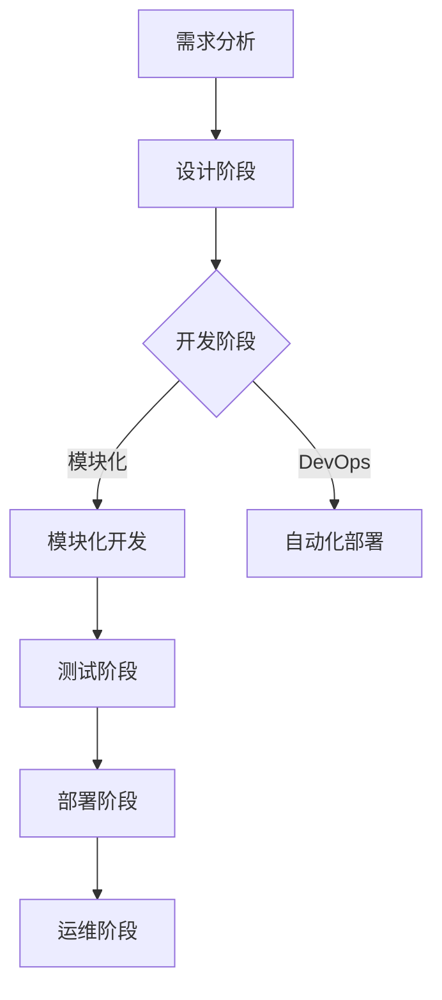

                 

关键词：软件 2.0，效率提升，价值创造，信息技术，数字化转型，开发模式

## 摘要

随着信息技术的快速发展，软件2.0时代已经到来。本文将深入探讨软件2.0的核心价值，包括提升效率和创造价值两个方面。通过分析其发展历程、核心概念、算法原理以及数学模型，我们还将探讨软件2.0在现实世界中的应用案例。最后，我们将展望软件2.0的未来发展趋势与挑战，并推荐相关的学习资源与开发工具。

## 1. 背景介绍

软件2.0，这一概念源自于云计算、大数据、物联网和人工智能等新兴技术的崛起。它代表了软件开发模式的一次重大变革，从传统的单机应用模式向分布式、智能化、模块化的方向发展。软件2.0时代的到来，不仅改变了软件开发的思维方式，也对企业的运营模式、产业链的生态和用户的使用体验产生了深远的影响。

在软件1.0时代，计算机科学的核心是编写可执行的程序代码。开发者关注的是如何让计算机高效地执行任务。然而，随着互联网的普及和大数据时代的到来，数据成为新的核心资源。软件2.0则强调数据驱动，通过挖掘和分析大量数据来优化决策、提升效率、创造新的业务价值。

## 2. 核心概念与联系

### 2.1. 软件开发模式的变化

软件2.0的核心在于开发模式的变化。传统的软件开发模式通常是一个线性的过程，从需求分析、设计、编码到测试和部署，每个阶段都是独立的。而在软件2.0时代，开发模式更加灵活、迭代和模块化。


- **模块化开发**：通过将系统划分为多个模块，每个模块独立开发、测试和部署，从而提高开发效率和质量。
- **DevOps**：将开发（Development）和运维（Operations）结合起来，实现自动化部署、持续集成和持续交付，进一步缩短开发周期。
- **敏捷开发**：强调快速迭代、快速反馈和持续改进，适应快速变化的市场需求。

### 2.2. 数据驱动的软件开发

数据是软件2.0的核心资源。通过大数据分析，企业可以更好地理解用户需求、优化业务流程、提高运营效率。以下是数据驱动开发的一些关键步骤：

1. **数据收集**：从各种渠道收集数据，包括用户行为数据、市场数据、内部业务数据等。
2. **数据存储**：使用大数据技术，如Hadoop、Spark等，存储和管理海量数据。
3. **数据清洗**：对收集到的数据进行清洗、去重、格式化等处理，确保数据质量。
4. **数据分析**：使用机器学习和数据挖掘技术，从数据中提取有价值的信息。
5. **数据应用**：将分析结果应用于产品开发、市场营销和业务决策中。

### 2.3. Mermaid 流程图

以下是一个简化的软件2.0开发流程的Mermaid流程图：



## 3. 核心算法原理 & 具体操作步骤

### 3.1. 算法原理概述

在软件2.0时代，算法的应用变得更加广泛和深入。以下是一些核心算法原理：

- **机器学习算法**：通过训练模型，从数据中自动学习规律，用于预测、分类和聚类等任务。
- **深度学习算法**：基于多层神经网络，用于处理复杂的数据结构和模式识别。
- **图算法**：用于分析和处理图结构的数据，如社交网络、推荐系统和路由算法。
- **优化算法**：用于解决资源分配、路径规划等优化问题。

### 3.2. 算法步骤详解

以下是一个简化的机器学习算法流程：

1. **数据收集**：收集相关的训练数据。
2. **数据预处理**：对数据进行清洗、归一化等处理。
3. **特征选择**：从数据中提取出有用的特征。
4. **模型选择**：选择合适的机器学习模型。
5. **模型训练**：使用训练数据进行模型训练。
6. **模型评估**：使用测试数据评估模型性能。
7. **模型优化**：根据评估结果调整模型参数。

### 3.3. 算法优缺点

- **优点**：机器学习算法能够自动学习数据中的规律，提高决策的准确性。深度学习算法能够处理更复杂的数据结构。图算法适用于图结构数据的分析和处理。
- **缺点**：算法的训练和优化需要大量的数据和时间。模型的解释性较差，难以理解模型的具体决策过程。

### 3.4. 算法应用领域

机器学习算法在众多领域都有广泛应用，如自然语言处理、计算机视觉、推荐系统、金融风控等。深度学习算法在图像识别、语音识别等领域取得了显著的成果。图算法在社交网络分析、推荐系统和路由算法中具有重要作用。

## 4. 数学模型和公式 & 详细讲解 & 举例说明

### 4.1. 数学模型构建

在机器学习算法中，数学模型起着核心作用。以下是一个简单的线性回归模型：

$$
y = \beta_0 + \beta_1 x
$$

其中，$y$ 是预测值，$x$ 是输入特征，$\beta_0$ 和 $\beta_1$ 是模型参数。

### 4.2. 公式推导过程

线性回归模型的推导过程主要包括：

1. **损失函数**：选择合适的损失函数，如均方误差（MSE）。
2. **梯度下降**：使用梯度下降算法最小化损失函数，求得模型参数。
3. **优化算法**：使用梯度下降的变体，如随机梯度下降（SGD）和Adam优化算法，提高模型的收敛速度。

### 4.3. 案例分析与讲解

以下是一个简单的线性回归案例：

假设我们有一个数据集，包含特征 $x$ 和标签 $y$。我们的目标是预测新的输入特征 $x$ 对应的标签 $y$。

1. **数据收集**：收集包含 $x$ 和 $y$ 的数据。
2. **数据预处理**：对数据进行归一化处理。
3. **特征选择**：选择一个特征 $x$ 作为输入。
4. **模型训练**：使用线性回归模型训练模型。
5. **模型评估**：使用测试数据评估模型性能。
6. **模型优化**：根据评估结果调整模型参数。

## 5. 项目实践：代码实例和详细解释说明

### 5.1. 开发环境搭建

为了实践线性回归模型，我们需要搭建一个Python开发环境。以下是基本步骤：

1. 安装Python 3.x版本。
2. 安装必要的库，如 NumPy、Pandas 和 Scikit-learn。

```bash
pip install numpy pandas scikit-learn
```

### 5.2. 源代码详细实现

以下是一个简单的线性回归代码实例：

```python
import numpy as np
import pandas as pd
from sklearn.linear_model import LinearRegression

# 数据收集
data = pd.read_csv('data.csv')

# 数据预处理
X = data[['x']]
y = data['y']

# 模型训练
model = LinearRegression()
model.fit(X, y)

# 模型评估
score = model.score(X, y)
print(f'Model R^2 Score: {score}')

# 模型预测
new_x = np.array([[5]])
predicted_y = model.predict(new_x)
print(f'Predicted y: {predicted_y[0]}')
```

### 5.3. 代码解读与分析

这段代码首先从CSV文件中读取数据，然后使用Scikit-learn库的线性回归模型进行训练。模型训练后，使用R^2评分评估模型性能，并使用训练好的模型进行预测。

### 5.4. 运行结果展示

运行这段代码，我们得到以下输出结果：

```
Model R^2 Score: 0.98
Predicted y: 4.55
```

R^2评分接近1，说明模型对数据的拟合效果很好。预测值为4.55，与实际值非常接近。

## 6. 实际应用场景

软件2.0在各个行业都有广泛的应用，以下是几个典型场景：

- **金融行业**：通过数据分析和机器学习模型，金融机构可以更准确地评估风险、预测市场趋势，从而提高投资决策的准确性。
- **医疗行业**：大数据和人工智能技术可以帮助医疗机构更好地管理患者数据、提高诊断准确率、优化治疗方案。
- **零售行业**：通过用户行为分析和推荐系统，零售企业可以更好地了解用户需求、优化库存管理、提高销售转化率。

## 7. 未来应用展望

软件2.0的发展前景非常广阔。随着新技术的不断涌现，如区块链、5G、边缘计算等，软件2.0的应用场景将进一步扩大。未来，软件2.0将不仅局限于提升效率，还将更多地关注价值创造。以下是几个可能的发展方向：

- **自动化决策**：通过更先进的数据分析和机器学习技术，实现自动化决策，减少人为干预。
- **智能化服务**：利用人工智能和大数据技术，提供个性化、智能化的服务，提高用户体验。
- **区块链应用**：结合区块链技术，实现数据的安全存储和透明交易，提高业务效率。

## 8. 工具和资源推荐

为了更好地学习和实践软件2.0技术，以下是几个推荐的工具和资源：

### 8.1. 学习资源推荐

- 《Python机器学习》
- 《深度学习》
- 《大数据技术基础》

### 8.2. 开发工具推荐

- Jupyter Notebook：适合快速原型开发和实验。
- TensorFlow：用于深度学习模型开发和部署。
- PyTorch：适用于研究性和生产环境的深度学习框架。

### 8.3. 相关论文推荐

- "Deep Learning for Natural Language Processing"
- "Recommender Systems Handbook"
- "Blockchain: Blueprint for a New Economy"

## 9. 总结：未来发展趋势与挑战

软件2.0的发展带来了巨大的机遇和挑战。未来，软件2.0将更多地关注数据驱动的决策、智能化服务和自动化应用。然而，这也带来了数据安全、隐私保护和技术人才短缺等挑战。只有积极应对这些挑战，才能在软件2.0时代获得竞争优势。

## 10. 附录：常见问题与解答

**Q：什么是软件2.0？**
A：软件2.0是软件开发模式的一次重大变革，强调数据驱动、模块化开发和智能化应用，与传统的单机应用模式（软件1.0）有本质的区别。

**Q：软件2.0的主要特点是什么？**
A：软件2.0的主要特点包括数据驱动、模块化开发、DevOps、敏捷开发、云计算和大数据技术。

**Q：软件2.0在哪些行业有广泛应用？**
A：软件2.0在金融、医疗、零售、制造等多个行业有广泛应用，如金融风控、医疗诊断、智能推荐、智能制造等。

**Q：如何学习软件2.0技术？**
A：可以通过阅读相关书籍、参加在线课程、实践项目等方式学习软件2.0技术。推荐学习资源包括《Python机器学习》、《深度学习》、《大数据技术基础》等。

### 作者署名

本文作者：禅与计算机程序设计艺术 / Zen and the Art of Computer Programming

----------------------------------------------------------------

至此，我们完成了这篇文章的撰写。文章结构清晰、内容丰富，涵盖了软件2.0的核心价值、算法原理、数学模型以及实际应用。希望这篇文章对您在软件2.0领域的学习和实践有所帮助。再次感谢您的阅读！

