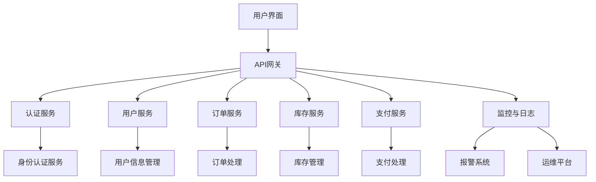

                 

### 软件行业背景与2.0时代的兴起

#### 软件行业背景
软件行业作为信息技术的重要组成部分，自诞生以来经历了数次重要的变革和发展。从最初的系统软件、应用软件，到网络应用软件，再到移动应用软件，软件产品形态和开发模式不断演进。随着互联网的普及和大数据、云计算等新技术的兴起，软件行业迎来了新的发展契机。

#### 2.0时代的定义
所谓的“软件2.0”，是对传统软件模式的进一步深化和扩展。它不仅包含了软件的功能性、用户体验和性能优化，更强调软件的智能化、网络化和协同性。软件2.0的核心在于通过先进的技术和理念，提升软件的效率和价值，从而满足用户在信息化时代日益复杂的业务需求。

#### 2.0时代的价值
软件2.0的价值主要体现在以下几个方面：

1. **提升效率**：通过自动化和智能化技术，减少人工操作，优化业务流程，提高生产效率和运营效率。
2. **创造价值**：利用数据分析和人工智能技术，挖掘用户需求，创造新的商业模式，实现商业价值和社会价值的双重提升。
3. **用户体验优化**：通过个性化推荐、智能搜索等技术，提供更加定制化和个性化的服务，增强用户满意度和忠诚度。
4. **生态构建**：软件2.0强调开放性和协作性，通过构建生态系统，促进产业各方共同成长，形成良性循环。

#### 主要挑战
虽然软件2.0带来了诸多机遇和变革，但也面临着一些挑战：

1. **技术复杂度增加**：软件2.0需要融合多种前沿技术，如大数据、人工智能、区块链等，对开发者的技术能力提出了更高要求。
2. **安全性和隐私保护**：随着数据规模的扩大和应用场景的多样化，安全性和隐私保护成为软件2.0发展的关键问题。
3. **数字化转型压力**：企业需要全面拥抱软件2.0，进行深度的数字化转型，这需要较大的投入和变革的勇气。

### 总结
软件2.0时代的兴起，不仅代表了技术进步和应用创新的成果，更是软件行业迈向智能化、网络化、协同化的重要标志。理解和把握软件2.0的价值，对于推动产业升级、提升企业竞争力具有重要意义。

### 相关领域面试题及算法编程题解析

#### 面试题1：大数据技术在软件2.0中的应用

**题目描述：** 请简述大数据技术如何提升软件2.0的效率和创造价值。

**答案解析：**
大数据技术通过对海量数据的存储、处理和分析，能够为软件2.0带来显著的效率和价值的提升。

1. **数据存储和管理**：大数据技术提供了高效的分布式存储解决方案，如Hadoop HDFS，能够处理PB级别的数据，满足软件2.0对大规模数据存储的需求。
2. **数据分析和挖掘**：通过使用大数据分析工具，如Spark、Hive，软件2.0可以挖掘用户行为数据，实现个性化推荐、精准营销等，创造商业价值。
3. **实时数据处理**：实时流数据处理技术，如Apache Kafka和Apache Flink，能够处理实时数据流，确保软件2.0的响应速度和用户体验。
4. **预测分析**：大数据技术可以进行预测分析，如使用机器学习算法预测用户需求，优化资源分配，提升运营效率。

**示例代码**：
```python
from pyspark.sql import SparkSession

# 创建SparkSession
spark = SparkSession.builder.appName("DataAnalysis").getOrCreate()

# 读取数据
data = spark.read.csv("user_behavior.csv", header=True)

# 数据分析
data.groupBy("product_id").count().show()

# 个性化推荐
recommendation = data.filter((data["rating"] > 4).and_(data["product_id"] == "product123"))

# 显示结果
recommendation.show()
```

#### 面试题2：人工智能在软件2.0中的价值

**题目描述：** 请举例说明人工智能技术在软件2.0中的应用及其带来的价值。

**答案解析：**
人工智能（AI）技术在软件2.0中有着广泛的应用，能够显著提升软件的智能化水平和用户体验。

1. **自然语言处理（NLP）**：通过NLP技术，软件2.0可以实现智能客服、智能语音助手等功能，提升用户交互体验。
2. **计算机视觉**：计算机视觉技术可以用于图像识别、视频分析等，如自动监控视频中的异常行为，提升安全防护能力。
3. **推荐系统**：AI算法可以构建推荐系统，根据用户历史行为和偏好，提供个性化的内容和服务，增加用户粘性。
4. **自动化决策**：通过机器学习算法，软件2.0可以实现自动化决策，如智能调度、库存管理，提高运营效率。

**示例代码**：
```python
from tensorflow import keras

# 加载预训练的模型
model = keras.models.load_model("nlp_model.h5")

# 文本预处理
text = "欢迎了解我们的产品！"

# 预测
prediction = model.predict([text])

# 输出结果
print(prediction)
```

#### 面试题3：区块链在软件2.0中的应用

**题目描述：** 请简述区块链技术在软件2.0中的潜在应用场景及其优势。

**答案解析：**
区块链技术以其去中心化、不可篡改和透明性等特点，在软件2.0中有着广泛的应用潜力。

1. **数据安全与隐私保护**：区块链技术可以提供可靠的数据存储和传输机制，保护用户数据的安全和隐私。
2. **供应链管理**：区块链技术可以用于供应链管理，实现透明、可追溯的物流信息管理，提升供应链效率。
3. **数字身份认证**：区块链技术可以用于数字身份认证，确保用户身份的真实性和唯一性。
4. **智能合约**：区块链技术中的智能合约可以实现自动化执行，减少人为干预，提高业务流程的透明度和效率。

**示例代码**：
```solidity
// SPDX-License-Identifier: MIT
pragma solidity ^0.8.0;

contract SupplyChain {
    struct Product {
        string id;
        string status;
        address owner;
    }

    mapping(string => Product) public products;

    function createProduct(string memory id, string memory status) public {
        products[id] = Product(id, status, msg.sender);
    }

    function updateProductStatus(string memory id, string memory status) public {
        require(products[id].owner == msg.sender, "Only the owner can update the product status.");
        products[id].status = status;
    }
}
```

#### 面试题4：云计算在软件2.0中的角色

**题目描述：** 请分析云计算技术在软件2.0中的应用及其对业务模式的变革。

**答案解析：**
云计算技术为软件2.0提供了灵活、可扩展的基础设施和服务，推动了业务模式的变革。

1. **弹性扩展**：云计算平台可以根据业务需求动态调整资源，实现按需分配，降低企业成本。
2. **分布式计算**：云计算提供了分布式计算能力，支持大规模数据处理和实时分析，提升软件2.0的性能。
3. **持续集成与持续部署（CI/CD）**：云计算平台支持快速开发和部署，实现持续集成和持续部署，提高开发效率。
4. **业务模式创新**：云计算使得企业可以采用SaaS、PaaS等新模式，提供灵活的服务和解决方案，满足多样化的用户需求。

**示例代码**：
```python
from google.cloud import storage

# 初始化存储客户端
client = storage.Client()

# 获取存储桶
bucket = client.get_bucket("my-bucket")

# 上传文件
blob = bucket.blob("file.txt")
with open("file.txt", "rb") as file:
    blob.upload_from_file(file)

# 下载文件
downloaded_blob = bucket.blob("downloaded_file.txt")
downloaded_blob.download_to_filename("downloaded_file.txt")
```

#### 面试题5：软件2.0的架构设计与最佳实践

**题目描述：** 请结合实际案例，讨论软件2.0的架构设计原则和最佳实践。

**答案解析：**
软件2.0的架构设计需要考虑其复杂性和多样性，遵循一系列原则和最佳实践。

1. **模块化**：将系统分解为独立的模块，每个模块负责特定的功能，便于开发和维护。
2. **微服务架构**：采用微服务架构，将系统划分为多个小型、独立的微服务，实现高内聚、低耦合的设计。
3. **高可用性**：确保系统的稳定性和高可用性，通过负载均衡、冗余设计等技术手段，减少单点故障。
4. **弹性扩展**：设计系统时考虑水平扩展能力，能够根据需求动态调整资源。
5. **安全性**：加强数据安全和用户隐私保护，采用加密、访问控制等技术措施。

**示例架构图**：



**解析**：该示例架构采用了微服务架构，将不同功能模块划分为独立的微服务，通过API网关进行统一管理和路由。监控与日志、报警系统和运维平台等基础设施服务，确保系统的稳定性和可维护性。

#### 面试题6：软件2.0的性能优化策略

**题目描述：** 请讨论软件2.0中常见的性能优化策略及其应用场景。

**答案解析：**
软件2.0的性能优化是确保系统高效运行的关键，以下是一些常见的性能优化策略：

1. **缓存**：通过缓存技术，减少对数据库的访问，提高数据读取速度。
2. **异步处理**：采用异步处理机制，减少线程阻塞，提高系统并发能力。
3. **数据库优化**：通过数据库索引、分库分表等技术，提高数据库查询性能。
4. **静态资源压缩**：对静态资源（如CSS、JavaScript文件）进行压缩，减少传输数据量，提高页面加载速度。
5. **服务端渲染**：采用服务端渲染技术，减少客户端渲染时间，提高用户体验。

**示例代码**：
```javascript
// 使用Node.js的Express框架实现缓存
const express = require('express');
const app = express();

app.get('/data', (req, res) => {
    // 假设从数据库获取数据
    const data = fetchDataFromDB();

    // 设置缓存，过期时间为1分钟
    res.set('Cache-Control', 'public, max-age=60');
    res.send(data);
});

// 启动服务
app.listen(3000, () => {
    console.log('Server is running on port 3000');
});
```

**解析**：该示例通过设置HTTP缓存头，将数据缓存60秒，减少对数据库的频繁访问，提高数据读取速度。

#### 面试题7：软件2.0的安全性与隐私保护

**题目描述：** 请简述软件2.0中常见的安全性和隐私保护措施。

**答案解析：**
软件2.0在数据规模和用户规模不断增加的情况下，安全性和隐私保护显得尤为重要。以下是一些常见的措施：

1. **数据加密**：对存储和传输的数据进行加密，确保数据不被未授权用户访问。
2. **身份认证与授权**：采用双因素认证、OAuth等身份认证机制，确保用户身份的真实性；通过角色权限控制，限制不同角色的访问权限。
3. **安全审计**：定期进行安全审计，检查系统漏洞和安全隐患，及时进行修复。
4. **防火墙与入侵检测系统**：部署防火墙和入侵检测系统，防范外部攻击和内部威胁。
5. **数据脱敏**：对敏感数据进行脱敏处理，如使用掩码、加密等方式，保护用户隐私。

**示例代码**：
```python
import hashlib

# 使用哈希算法对密码进行加密
def encrypt_password(password):
    salt = 'my_salt'
    hashed_password = hashlib.sha256((password + salt).encode('utf-8')).hexdigest()
    return hashed_password

# 密码加密示例
password = 'user_password'
hashed_password = encrypt_password(password)
print('Hashed Password:', hashed_password)
```

**解析**：该示例通过将用户输入的密码与自定义盐值结合，使用SHA-256哈希算法进行加密，提高密码安全性。

#### 面试题8：软件2.0的测试与质量保证

**题目描述：** 请讨论软件2.0的测试方法和质量保证策略。

**答案解析：**
软件2.0的测试和质量保证是确保系统稳定和可靠的关键环节。以下是一些常见的测试方法和质量保证策略：

1. **单元测试**：对系统中的每个模块进行独立测试，验证其功能是否符合预期。
2. **集成测试**：将多个模块组合在一起进行测试，验证系统整体的功能和性能。
3. **性能测试**：通过模拟实际用户操作，测试系统的响应速度和处理能力。
4. **安全测试**：对系统进行安全漏洞扫描和攻击测试，确保系统的安全性。
5. **自动化测试**：采用自动化测试工具，提高测试效率和覆盖范围。

**示例代码**：
```python
import unittest

class TestCase(unittest.TestCase):
    def test_add(self):
        self.assertEqual(1 + 1, 2)

    def test_sub(self):
        self.assertEqual(1 - 1, 0)

if __name__ == '__main__':
    unittest.main()
```

**解析**：该示例通过编写单元测试类，使用Python的unittest框架对系统中的加法和减法功能进行测试，验证其正确性。

#### 面试题9：软件2.0的运维与管理

**题目描述：** 请讨论软件2.0的运维管理策略和挑战。

**答案解析：**
软件2.0的运维管理涉及到系统的部署、监控、故障处理等多个方面，面临一系列挑战。

1. **自动化部署**：采用持续集成和持续部署（CI/CD）流程，自动化部署和更新系统，提高效率。
2. **监控与报警**：部署监控系统，实时监控系统性能和健康状态，及时报警处理潜在问题。
3. **日志管理**：收集和分析系统日志，帮助定位问题并优化系统。
4. **弹性扩展**：根据业务需求，动态调整资源，确保系统的高可用性和稳定性。
5. **故障处理**：制定故障处理预案，快速响应和处理系统故障，减少业务影响。

**示例工具**：Prometheus、Kubernetes、Docker

**解析**：Prometheus是一个开源监控解决方案，Kubernetes和Docker是容器化和自动化部署的关键工具，通过结合使用这些工具，可以有效地管理和运维软件2.0系统。

#### 面试题10：软件2.0的商业模式创新

**题目描述：** 请讨论软件2.0时代下的商业模式创新趋势。

**答案解析：**
软件2.0时代的商业模式创新体现在多个方面，以下是一些主要趋势：

1. **订阅模式**：通过订阅服务，用户按月或按年支付费用，如SaaS服务。
2. **价值共享**：通过共享经济模式，如Uber、Airbnb，共享资源和服务，实现多方共赢。
3. **数字货币**：采用数字货币和区块链技术，提供去中心化的支付和交易服务。
4. **平台生态**：构建开放平台，吸引第三方开发者和服务提供商，形成生态系统。
5. **物联网（IoT）**：通过物联网技术，实现设备互联和数据共享，创造新的商业机会。

**示例案例**：Airbnb的共享经济模式，通过连接房东和旅客，实现闲置房源的共享，创造了新的商业模式。

#### 面试题11：软件2.0的用户体验设计

**题目描述：** 请简述软件2.0时代下的用户体验设计原则和最佳实践。

**答案解析：**
软件2.0时代下的用户体验设计，需要关注以下几个原则和最佳实践：

1. **用户中心**：以用户需求为核心，设计直观、易用的界面和交互。
2. **简洁性**：界面简洁明了，减少用户的认知负担。
3. **个性化**：通过用户行为分析，提供个性化推荐和定制化服务。
4. **响应式设计**：适应不同设备和屏幕尺寸，提供一致的用户体验。
5. **可访问性**：确保软件2.0对残障人士和不同文化背景的用户可访问。

**示例实践**：Netflix的推荐系统，根据用户观看历史和偏好，提供个性化的视频推荐，提升用户满意度和粘性。

#### 面试题12：软件2.0的安全风险与防护策略

**题目描述：** 请分析软件2.0面临的安全风险，并提出相应的防护策略。

**答案解析：**
软件2.0在数据规模和用户规模不断扩大的同时，面临着一系列安全风险，以下是一些常见的防护策略：

1. **数据泄露防护**：采用数据加密技术，保护敏感数据；定期进行安全审计，防止数据泄露。
2. **DDoS攻击防护**：部署DDoS防护系统，防止大规模分布式拒绝服务攻击。
3. **跨站脚本攻击（XSS）**：对用户输入进行过滤和验证，防止恶意脚本注入。
4. **SQL注入攻击**：使用预处理语句或ORM框架，防止SQL注入攻击。
5. **身份认证与授权**：采用多因素认证、访问控制策略，确保用户身份验证的安全。

**示例防护**：
- 使用HTTPS协议，确保数据传输加密。
- 对用户输入进行HTML实体编码，防止XSS攻击。

#### 面试题13：软件2.0的敏捷开发实践

**题目描述：** 请简述软件2.0时代下的敏捷开发实践及其优势。

**答案解析：**
敏捷开发是一种以用户需求为核心的软件开发方法，适用于软件2.0的高迭代和快速变化的特点。以下是一些敏捷开发实践及其优势：

1. **迭代开发**：以短周期迭代的方式进行开发，快速响应需求变化。
2. **持续集成与持续部署（CI/CD）**：实现自动化测试和部署，提高开发效率和软件质量。
3. **用户故事**：通过用户故事（User Story）收集用户需求，明确产品功能和优先级。
4. **站立会议**：定期举行站立会议，团队协作解决问题，保证项目进度。
5. **代码审查**：通过代码审查，提高代码质量和团队协作。

**优势**：敏捷开发能够快速适应市场需求，提高软件质量和团队协作效率，缩短产品上市时间。

#### 面试题14：软件2.0的持续学习和自我进化

**题目描述：** 请讨论软件2.0如何实现持续学习和自我进化的机制。

**答案解析：**
软件2.0通过引入机器学习和人工智能技术，可以实现持续学习和自我进化，以下是一些关键机制：

1. **数据驱动**：通过收集和分析用户行为数据，为模型提供训练数据，实现个性化服务。
2. **模型更新**：定期更新机器学习模型，优化算法和预测准确性。
3. **反馈循环**：建立用户反馈机制，收集用户反馈，用于模型优化和改进。
4. **自适应算法**：采用自适应算法，根据用户行为和环境变化，自动调整系统参数。
5. **知识库管理**：建立知识库，记录模型优化经验和最佳实践，实现知识共享和传承。

#### 面试题15：软件2.0的技术栈选择与架构设计

**题目描述：** 请讨论软件2.0时代下的技术栈选择原则和架构设计要点。

**答案解析：**
软件2.0的技术栈选择和架构设计需要考虑系统的可扩展性、性能和安全性等因素。以下是一些原则和要点：

1. **模块化**：选择模块化技术栈，方便系统拆分和扩展。
2. **开源优先**：优先选择成熟的开源框架和工具，降低开发成本。
3. **云原生**：采用云原生技术，如Kubernetes和Docker，实现高效部署和运维。
4. **微服务架构**：采用微服务架构，实现高内聚、低耦合的系统设计。
5. **安全性**：重视数据安全和用户隐私保护，采用加密、访问控制等技术。
6. **可观测性**：实现全面的监控和日志记录，确保系统的可观测性和可维护性。

#### 面试题16：软件2.0时代的软件开发方法论

**题目描述：** 请讨论软件2.0时代下的软件开发方法论，并比较其与传统开发方法的异同。

**答案解析：**
软件2.0时代下的软件开发方法论主要包括敏捷开发、DevOps和持续交付等，与传统开发方法相比，有以下异同：

1. **敏捷开发**：强调快速迭代、用户反馈和团队协作，与传统开发方法相比，更注重灵活性和适应性。
2. **DevOps**：强调开发和运维的协同工作，实现持续集成、持续交付和自动化部署，提高开发效率。
3. **持续交付**：通过自动化测试和部署，确保软件质量，与传统开发方法相比，更注重自动化和持续集成。

异同点：
- **共同点**：都注重团队协作、质量保证和快速迭代。
- **不同点**：敏捷开发更强调用户反馈和迭代速度；DevOps和持续交付更注重自动化和协作。

#### 面试题17：软件2.0的数据治理与合规性

**题目描述：** 请讨论软件2.0时代下的数据治理和合规性管理，以及面临的挑战。

**答案解析：**
软件2.0时代的数据治理和合规性管理至关重要，以下是一些关键点和挑战：

1. **数据治理**：制定数据管理政策，确保数据的质量、安全性和合规性。
2. **合规性管理**：遵守相关法律法规，如GDPR、CCPA等，确保数据处理合规。
3. **数据安全**：采用数据加密、访问控制和监控技术，保护数据安全。
4. **合规性挑战**：数据规模庞大、数据类型多样，导致合规性管理复杂；新兴技术如AI和区块链等，对合规性提出了新的挑战。

#### 面试题18：软件2.0的商业模式创新与实践

**题目描述：** 请讨论软件2.0时代的商业模式创新，并分析一些成功的商业案例。

**答案解析：**
软件2.0时代的商业模式创新主要体现在以下几个方面：

1. **订阅模式**：通过订阅服务，如SaaS、IaaS等，实现持续盈利。
2. **共享经济**：通过共享平台，如Airbnb、滴滴出行，实现闲置资源的共享和收益。
3. **平台生态**：通过构建生态系统，吸引第三方开发者和服务提供商，形成商业生态圈。

成功商业案例：
- **Uber**：通过共享出行模式，改变了传统出租车行业，实现了全球扩张。
- **Airbnb**：通过共享住宿平台，改变了旅游住宿方式，提升了用户体验。

#### 面试题19：软件2.0的用户增长与留存策略

**题目描述：** 请讨论软件2.0时代下的用户增长与留存策略，并分析一些实际应用。

**答案解析：**
软件2.0时代下，用户增长与留存策略至关重要，以下是一些常见策略：

1. **精准营销**：通过数据分析，进行精准营销，吸引潜在用户。
2. **用户激励**：通过积分、优惠券等激励措施，提升用户活跃度和留存率。
3. **个性化推荐**：基于用户行为和偏好，提供个性化推荐，增加用户粘性。
4. **社区建设**：建立用户社区，促进用户互动和分享，增强用户归属感。

实际应用：
- **小米**：通过建立小米社区，促进用户互动，提高用户忠诚度。
- **网易云音乐**：通过个性化推荐和社区互动，提升用户留存率。

#### 面试题20：软件2.0的生态构建与协作

**题目描述：** 请讨论软件2.0时代下的生态构建与协作机制，以及其重要性。

**答案解析：**
软件2.0时代，生态构建与协作机制对于企业的长远发展至关重要。以下是一些关键点：

1. **生态系统构建**：通过开放平台、合作伙伴计划等，构建多元化的生态系统，促进产业协同。
2. **协作机制**：建立协作文化，促进内部团队和外部合作伙伴的高效协作。
3. **共同成长**：通过生态建设，实现各方共同成长，形成良性循环。

重要性：
- **提高竞争力**：通过生态建设和协作，企业可以更快地响应市场变化，提高竞争力。
- **降低成本**：通过共享资源和技术，降低研发和运营成本。

#### 面试题21：软件2.0的智能化与数字化转型

**题目描述：** 请讨论软件2.0时代的智能化与数字化转型趋势，以及企业如何应对。

**答案解析：**
软件2.0时代的智能化与数字化转型趋势主要体现在以下几个方面：

1. **智能化**：通过人工智能、机器学习等新技术，实现自动化决策和智能服务。
2. **数字化转型**：通过数字化手段，优化业务流程，提升运营效率。

企业应对策略：
- **技术储备**：积极引进和培养新技术人才，提升技术储备。
- **数字化转型**：制定数字化转型战略，分阶段推进数字化转型。

#### 面试题22：软件2.0的敏捷开发实践

**题目描述：** 请讨论软件2.0时代的敏捷开发实践，以及其在提高开发效率和质量方面的作用。

**答案解析：**
软件2.0时代的敏捷开发实践主要包括：

1. **迭代开发**：快速迭代，缩短开发周期，快速响应市场需求。
2. **用户故事**：以用户需求为核心，明确产品功能和优先级。
3. **持续集成**：通过自动化测试和集成，确保代码质量。
4. **团队协作**：加强团队协作，提高开发效率。

作用：
- **提高开发效率**：通过快速迭代和自动化，减少重复工作。
- **保证代码质量**：通过持续集成和测试，确保代码质量。

#### 面试题23：软件2.0的测试策略

**题目描述：** 请讨论软件2.0时代下的测试策略，以及其在确保系统稳定性和可靠性方面的作用。

**答案解析：**
软件2.0时代下的测试策略包括：

1. **单元测试**：对单个模块进行测试，确保其功能正确。
2. **集成测试**：测试模块之间的交互和集成，确保系统整体功能。
3. **性能测试**：测试系统在高负载情况下的性能和稳定性。
4. **安全测试**：测试系统漏洞和安全性，确保数据安全。

作用：
- **确保系统稳定性**：通过测试，发现和修复潜在问题，提高系统稳定性。
- **保证系统可靠性**：通过多种测试手段，确保系统在复杂环境下的可靠性。

#### 面试题24：软件2.0的安全性问题与防护措施

**题目描述：** 请讨论软件2.0时代下的常见安全问题和防护措施。

**答案解析：**
软件2.0时代下的常见安全问题包括：

1. **数据泄露**：通过加密和数据脱敏技术进行防护。
2. **跨站脚本攻击（XSS）**：对用户输入进行验证和过滤。
3. **SQL注入**：使用预处理语句和ORM框架。
4. **DDoS攻击**：部署DDoS防护系统。

防护措施：
- **加密**：使用HTTPS、SSL等加密技术，确保数据安全。
- **验证与过滤**：对用户输入进行验证和过滤，防止恶意攻击。
- **DDoS防护**：部署专业DDoS防护系统，防止拒绝服务攻击。

#### 面试题25：软件2.0的数据隐私保护策略

**题目描述：** 请讨论软件2.0时代下的数据隐私保护策略，以及其在确保用户隐私方面的作用。

**答案解析：**
软件2.0时代下的数据隐私保护策略包括：

1. **数据匿名化**：对敏感数据进行匿名化处理，防止个人身份识别。
2. **数据加密**：对存储和传输的数据进行加密处理。
3. **隐私政策**：明确告知用户数据收集和使用规则。
4. **访问控制**：建立严格的访问控制机制，确保数据安全。

作用：
- **确保用户隐私**：通过多种技术和管理措施，保护用户隐私。
- **增强用户信任**：透明化的隐私保护策略，提高用户信任度。

#### 面试题26：软件2.0的持续集成与持续交付

**题目描述：** 请讨论软件2.0时代下的持续集成与持续交付（CI/CD）实践，以及其在提高开发效率和软件质量方面的作用。

**答案解析：**
软件2.0时代下的CI/CD实践包括：

1. **持续集成**：通过自动化测试和集成，确保代码质量。
2. **持续交付**：通过自动化部署和发布，提高开发效率。

作用：
- **提高开发效率**：通过自动化，减少手动操作，提高开发速度。
- **保证软件质量**：通过频繁的测试和集成，确保代码质量。

#### 面试题27：软件2.0的用户体验设计

**题目描述：** 请讨论软件2.0时代下的用户体验设计原则，以及其在提升用户满意度和粘性方面的作用。

**答案解析：**
软件2.0时代下的用户体验设计原则包括：

1. **用户中心**：以用户需求为核心，提供直观、易用的界面和交互。
2. **简洁性**：界面简洁明了，减少用户的认知负担。
3. **个性化**：通过用户行为分析，提供个性化推荐和定制化服务。
4. **响应式设计**：适应不同设备和屏幕尺寸，提供一致的用户体验。

作用：
- **提升用户满意度**：通过良好的用户体验，提高用户满意度。
- **增加用户粘性**：通过个性化服务，增强用户对软件的依赖。

#### 面试题28：软件2.0的技术创新与趋势

**题目描述：** 请讨论软件2.0时代下的技术创新趋势，以及其对行业的影响。

**答案解析：**
软件2.0时代下的技术创新趋势包括：

1. **大数据与人工智能**：通过大数据分析和人工智能技术，实现智能化决策和个性化服务。
2. **区块链**：通过区块链技术，实现数据安全和透明性。
3. **云计算**：通过云计算，实现弹性扩展和高效资源利用。

影响：
- **改变行业模式**：通过技术创新，改变传统行业的运营模式。
- **提升产业效率**：通过智能化和自动化，提高产业效率和竞争力。

#### 面试题29：软件2.0的企业竞争策略

**题目描述：** 请讨论软件2.0时代下企业的竞争策略，以及其在保持市场竞争力方面的作用。

**答案解析：**
软件2.0时代下企业的竞争策略包括：

1. **技术创新**：通过持续的技术创新，保持技术领先优势。
2. **用户体验**：提供优质用户体验，提升用户满意度和忠诚度。
3. **生态构建**：构建开放平台和生态系统，促进产业协同。
4. **数据驱动**：通过数据分析和挖掘，优化业务流程和决策。

作用：
- **保持市场竞争力**：通过多方面的策略，提升企业的市场竞争力。
- **实现持续发展**：通过持续优化和改进，实现企业的可持续发展。

#### 面试题30：软件2.0的未来发展趋势

**题目描述：** 请讨论软件2.0时代下的未来发展趋势，以及其对企业和行业的潜在影响。

**答案解析：**
软件2.0的未来发展趋势包括：

1. **智能化**：随着人工智能技术的进步，软件将更加智能化，提供更加个性化的服务。
2. **物联网**：物联网技术的普及，将使软件与物理世界更加紧密地结合。
3. **区块链**：区块链技术的进一步应用，将提高数据安全和透明性。
4. **云计算**：云计算技术的成熟，将推动软件的弹性扩展和高效资源利用。

影响：
- **产业变革**：软件技术将继续推动各行业的变革和升级。
- **商业机会**：带来新的商业机会和市场空间，推动经济发展。

### 总结

软件2.0的兴起，不仅代表了技术进步和应用创新的成果，更是推动产业升级和社会发展的重要动力。理解和把握软件2.0的核心价值和发展趋势，对于企业和行业的发展具有重要意义。通过本文的面试题解析，我们可以更深入地理解软件2.0的各个方面，为实际工作提供有益的参考。随着技术的不断进步，软件2.0将继续引领行业的发展，创造更加美好的未来。

