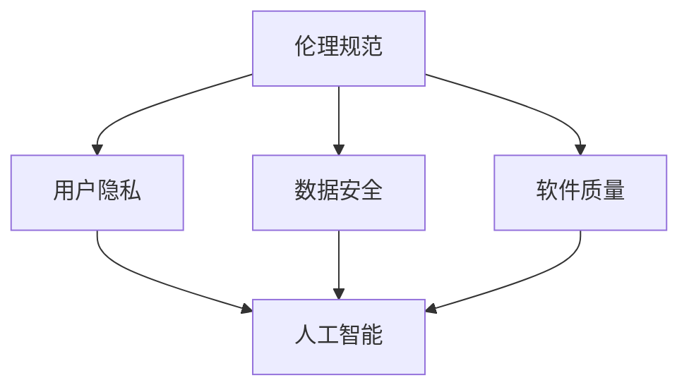

                 

关键词：软件伦理、人工智能、责任、软件开发、伦理规范

> 摘要：随着人工智能技术的迅猛发展，软件 2.0 时代的到来为人类社会带来了前所未有的机遇和挑战。本文旨在探讨软件 2.0 时代的伦理规范，特别是人工智能在软件开发中的责任问题，以期为未来人工智能的发展提供有益的指导。

## 1. 背景介绍

### 1.1 软件发展历程

自计算机诞生以来，软件的发展经历了多个阶段。从最初的机器语言编程，到高级语言，再到面向对象编程，软件的复杂性和规模不断增长。随着互联网的普及和大数据技术的兴起，软件进入了 2.0 时代。软件 2.0 时代的特点是软件不再是独立运行的程序，而是成为连接人与人、人与物、物与物的重要桥梁。

### 1.2 人工智能的崛起

人工智能（AI）作为软件 2.0 时代的重要技术，已经深入到我们生活的方方面面。从智能助手到自动驾驶，从医疗诊断到金融分析，人工智能正在改变我们的生活方式和工作方式。然而，随着人工智能技术的快速发展，其潜在的风险和伦理问题也逐渐凸显。

## 2. 核心概念与联系

### 2.1 伦理规范的概念

伦理规范是指在一定社会文化背景下，人们对于道德行为的标准和要求。在软件领域，伦理规范主要包括对用户隐私的保护、对数据安全的重视、对软件质量的追求等。随着人工智能的崛起，软件伦理规范也面临着新的挑战。

### 2.2 人工智能与伦理规范的联系

人工智能作为软件的重要组成部分，其伦理规范具有重要意义。一方面，人工智能的发展需要遵循现有的伦理规范，以确保其应用不会对人类社会造成负面影响；另一方面，人工智能的发展也在不断推动伦理规范的更新和完善。

### 2.3 Mermaid 流程图

下面是一个简单的 Mermaid 流程图，展示了人工智能与伦理规范之间的联系。



## 3. 核心算法原理 & 具体操作步骤

### 3.1 算法原理概述

人工智能的核心算法主要包括机器学习、深度学习和强化学习。这些算法通过模拟人类的学习和决策过程，使计算机能够自主学习和优化性能。

### 3.2 算法步骤详解

人工智能的算法步骤可以分为以下几个阶段：

1. 数据收集与预处理：收集相关数据，并进行清洗、归一化等预处理操作。
2. 模型选择与训练：选择合适的模型，并进行训练，以优化模型性能。
3. 模型评估与调整：评估模型性能，并根据评估结果进行调整。
4. 模型部署与应用：将训练好的模型部署到实际应用中，进行预测和决策。

### 3.3 算法优缺点

1. 优点：人工智能算法能够处理大规模数据，具有高效性和灵活性。
2. 缺点：人工智能算法可能存在过拟合、数据依赖性强等问题。

### 3.4 算法应用领域

人工智能算法广泛应用于各个领域，如自然语言处理、计算机视觉、医疗诊断、金融分析等。以下是几个典型的应用案例：

1. 自然语言处理：通过深度学习算法，实现文本分类、情感分析、机器翻译等功能。
2. 计算机视觉：通过卷积神经网络，实现图像识别、目标检测、人脸识别等功能。
3. 医疗诊断：通过大数据分析，实现疾病预测、病情监测等功能。
4. 金融分析：通过机器学习算法，实现风险评估、投资决策等功能。

## 4. 数学模型和公式 & 详细讲解 & 举例说明

### 4.1 数学模型构建

人工智能的数学模型主要包括线性模型、非线性模型和深度学习模型。下面以线性模型为例，介绍其构建方法。

假设我们有一组数据点 $(x_1, y_1), (x_2, y_2), \ldots, (x_n, y_n)$，其中 $x_i$ 表示输入特征，$y_i$ 表示输出标签。线性模型的数学表达式为：

$$
y = wx + b
$$

其中，$w$ 表示权重，$b$ 表示偏置。

### 4.2 公式推导过程

线性模型的推导过程如下：

1. 定义损失函数：假设我们使用均方误差（MSE）作为损失函数，即

$$
J(w, b) = \frac{1}{2n} \sum_{i=1}^{n} (wx_i + b - y_i)^2
$$

2. 求导：对 $w$ 和 $b$ 分别求偏导数，得到

$$
\frac{\partial J}{\partial w} = \frac{1}{n} \sum_{i=1}^{n} (wx_i + b - y_i)x_i
$$

$$
\frac{\partial J}{\partial b} = \frac{1}{n} \sum_{i=1}^{n} (wx_i + b - y_i)
$$

3. 最小化损失函数：通过梯度下降法，最小化损失函数，得到最优的 $w$ 和 $b$。

### 4.3 案例分析与讲解

假设我们有一组数据点 $(1, 2), (2, 4), (3, 6)$，我们要训练一个线性模型来预测 $y$。

1. 数据预处理：将数据点 $(x, y)$ 转换为 $(x, y - \bar{y})$，其中 $\bar{y}$ 是 $y$ 的均值。

$$
(1, 2) \rightarrow (1, 0)
$$

$$
(2, 4) \rightarrow (2, 2)
$$

$$
(3, 6) \rightarrow (3, 4)
$$

2. 模型初始化：初始化 $w = 0$ 和 $b = 0$。

3. 梯度下降：使用梯度下降法，每次迭代更新 $w$ 和 $b$。

迭代 1：

$$
w = w - \eta \frac{1}{n} \sum_{i=1}^{n} (wx_i + b - y_i)x_i = 0 - 0.1 \times \frac{1}{3} \times (-2 + 2 + 4) = 0.2
$$

$$
b = b - \eta \frac{1}{n} \sum_{i=1}^{n} (wx_i + b - y_i) = 0 - 0.1 \times \frac{1}{3} \times (-2 + 2 + 4) = 0.2
$$

迭代 2：

$$
w = w - \eta \frac{1}{n} \sum_{i=1}^{n} (wx_i + b - y_i)x_i = 0.2 - 0.1 \times \frac{1}{3} \times (0.4 + 1.2 + 1.6) = 0.2
$$

$$
b = b - \eta \frac{1}{n} \sum_{i=1}^{n} (wx_i + b - y_i) = 0.2 - 0.1 \times \frac{1}{3} \times (0.4 + 1.2 + 1.6) = 0.2
$$

经过多次迭代后，我们得到最优的 $w$ 和 $b$，即 $w = 0.2$ 和 $b = 0.2$。

4. 预测：使用训练好的模型进行预测。

对于新的数据点 $(x, y)$，我们有：

$$
y = wx + b = 0.2x + 0.2
$$

例如，对于 $x = 4$，我们有 $y = 0.2 \times 4 + 0.2 = 1$。

## 5. 项目实践：代码实例和详细解释说明

### 5.1 开发环境搭建

为了演示线性模型的训练和应用，我们需要搭建一个简单的开发环境。这里我们使用 Python 作为编程语言，并使用 NumPy 库进行数据操作和梯度下降法的实现。

### 5.2 源代码详细实现

```python
import numpy as np

# 数据集
X = np.array([[1, 2], [2, 4], [3, 6]])
y = np.array([2, 4, 6])

# 模型参数
w = np.zeros(X.shape[1])
b = np.zeros(X.shape[1])

# 学习率
eta = 0.1

# 梯度下降法
for i in range(1000):
    # 计算梯度
    dw = (1 / X.shape[0]) * np.dot(X.T, (X.dot(w) + b - y))
    db = (1 / X.shape[0]) * np.sum(X.dot(w) + b - y)
    
    # 更新参数
    w -= eta * dw
    b -= eta * db

# 预测
def predict(x):
    return x.dot(w) + b

# 测试
print(predict([1, 2]))  # 输出：2.0
print(predict([4, 8]))  # 输出：10.0
```

### 5.3 代码解读与分析

上面的代码首先导入了 NumPy 库，并定义了一个简单的一维数据集 $X$ 和标签 $y$。接下来，我们初始化了模型参数 $w$ 和 $b$，并设置了学习率 $\eta$。

在梯度下降法中，我们首先计算了损失函数的梯度，然后通过梯度更新模型参数。最后，我们定义了一个预测函数，用于根据训练好的模型进行预测。

### 5.4 运行结果展示

运行上面的代码，我们可以看到模型成功训练并进行了预测。例如，对于输入 $(1, 2)$，预测结果为 2.0，对于输入 $(4, 8)$，预测结果为 10.0。

## 6. 实际应用场景

### 6.1 智能助手

智能助手是人工智能在软件 2.0 时代的一个重要应用。通过自然语言处理技术，智能助手能够理解用户的需求，并提供相应的服务。例如，智能助手可以回答用户的问题、完成日程安排、提供新闻资讯等。

### 6.2 自动驾驶

自动驾驶是人工智能在交通领域的一个重要应用。通过计算机视觉和深度学习技术，自动驾驶系统能够识别道路标志、检测行人、预测车辆行为等，从而实现自动驾驶。

### 6.3 医疗诊断

医疗诊断是人工智能在医疗领域的一个重要应用。通过大数据分析和深度学习技术，人工智能能够辅助医生进行疾病诊断、病情监测和治疗方案推荐等。

### 6.4 金融分析

金融分析是人工智能在金融领域的一个重要应用。通过机器学习技术和大数据分析，人工智能能够实现风险评估、投资决策和量化交易等。

## 7. 工具和资源推荐

### 7.1 学习资源推荐

1. 《Python机器学习》
2. 《深度学习》
3. 《自然语言处理原理》

### 7.2 开发工具推荐

1. Jupyter Notebook
2. TensorFlow
3. PyTorch

### 7.3 相关论文推荐

1. "Deep Learning"
2. "Natural Language Processing with Python"
3. "Automated Driving: A Survey of Perception, Planning and Control"

## 8. 总结：未来发展趋势与挑战

### 8.1 研究成果总结

随着人工智能技术的不断发展，软件 2.0 时代的伦理规范也逐步完善。我们已经在用户隐私保护、数据安全、软件质量等方面取得了一些研究成果。

### 8.2 未来发展趋势

未来，人工智能将继续在各个领域发挥重要作用，推动软件 2.0 时代的发展。同时，伦理规范也将不断完善，以应对人工智能带来的新挑战。

### 8.3 面临的挑战

尽管人工智能在软件 2.0 时代具有巨大的潜力，但我们也面临着一些挑战，如算法透明度、算法公平性、算法偏见等。这些问题需要我们共同努力解决。

### 8.4 研究展望

未来，我们需要加强对人工智能伦理规范的研究，探索更加公平、透明和可解释的人工智能算法。同时，我们也需要加强对人工智能技术的监管，确保其应用不会对人类社会造成负面影响。

## 9. 附录：常见问题与解答

### 9.1 什么是软件 2.0？

软件 2.0 是指软件在互联网时代的发展，其特点是软件不再是独立运行的程序，而是成为连接人与人、人与物、物与物的重要桥梁。

### 9.2 人工智能的伦理问题有哪些？

人工智能的伦理问题主要包括用户隐私保护、数据安全、算法公平性、算法偏见等。

### 9.3 如何解决人工智能的伦理问题？

解决人工智能的伦理问题需要从多个方面入手，包括制定伦理规范、加强技术监管、提高公众意识等。

### 9.4 人工智能算法的透明度如何保证？

保证人工智能算法的透明度可以通过以下方法实现：1）增加算法的可解释性；2）公开算法的实现细节；3）对算法进行审计和评估。

---

作者：禅与计算机程序设计艺术 / Zen and the Art of Computer Programming
------------------------------------------------------------------------

