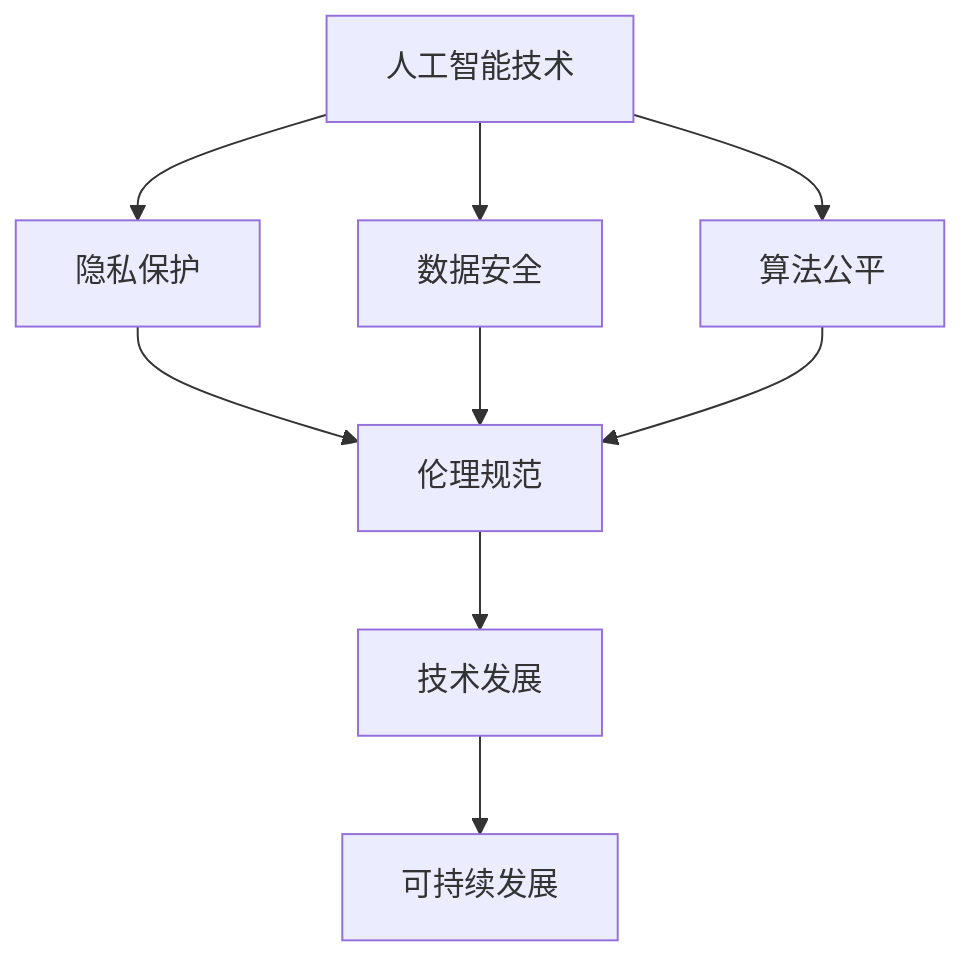

                 

关键词：软件 2.0、伦理规范、人工智能、责任、技术伦理

> 摘要：随着人工智能技术的飞速发展，软件 2.0 时代的到来为我们带来了前所未有的机遇和挑战。本文将深入探讨软件 2.0 时代下人工智能的伦理规范，强调其在技术进步中的责任与担当。通过分析人工智能伦理问题的根源，探讨相关法律法规与伦理框架，提出针对人工智能伦理规范的构建与实施策略，最终展望人工智能伦理的未来发展趋势与挑战。

## 1. 背景介绍

随着互联网、大数据、云计算等技术的快速发展，软件 2.0 时代已经悄然来临。在这一时代，人工智能技术成为了推动社会进步的重要力量。然而，人工智能的迅猛发展也引发了一系列伦理问题，如隐私侵犯、算法歧视、网络安全等。如何应对这些伦理挑战，构建一个和谐、安全、可持续发展的软件 2.0 生态环境，成为了我们必须面对的重要课题。

本文旨在探讨软件 2.0 时代下人工智能的伦理规范，强调其在技术进步中的责任与担当。通过分析人工智能伦理问题的根源，探讨相关法律法规与伦理框架，提出针对人工智能伦理规范的构建与实施策略，最终展望人工智能伦理的未来发展趋势与挑战。

## 2. 核心概念与联系

### 2.1 人工智能的定义与分类

人工智能（Artificial Intelligence，简称 AI）是计算机科学的一个分支，旨在使计算机具备类似人类智能的能力。根据 AI 的能力和实现方式，我们可以将其分为以下几类：

1. **弱人工智能（Narrow AI）**：专注于解决特定问题，如语音识别、图像识别、推荐系统等。
2. **强人工智能（General AI）**：具备广泛的学习、推理和适应能力，类似于人类智能。
3. **超人工智能（Super AI）**：超越人类智能，具备更高的认知能力。

### 2.2 伦理的定义与分类

伦理（Ethics）是关于道德原则和价值观的哲学研究。根据伦理学的基本分类，我们可以将伦理分为以下几类：

1. **规范伦理学（Deontological Ethics）**：强调行为的道德义务和规则。
2. **后果伦理学（Teleological Ethics）**：强调行为的后果和结果。
3. **应用伦理学（Applied Ethics）**：将伦理原则应用于特定领域，如医学、商业、科技等。

### 2.3 人工智能与伦理的联系

人工智能与伦理有着密切的联系。一方面，人工智能技术的发展和应用对伦理产生了深远的影响，如隐私保护、数据安全、算法公平等。另一方面，伦理规范对于人工智能的发展具有重要的指导作用，有助于确保人工智能技术的安全、公正和可持续发展。

#### Mermaid 流程图



## 3. 核心算法原理 & 具体操作步骤

### 3.1  算法原理概述

在软件 2.0 时代，人工智能的算法原理主要包括机器学习、深度学习和自然语言处理等技术。这些算法通过训练模型来识别、理解和生成数据，从而实现智能化的功能。

### 3.2  算法步骤详解

1. **数据收集与预处理**：收集相关数据，并进行清洗、归一化等预处理操作，以提高数据的质量和可用性。
2. **模型选择与训练**：根据任务需求，选择合适的算法模型，并进行模型训练，以优化模型的参数。
3. **模型评估与调整**：对训练好的模型进行评估，并根据评估结果对模型进行调整，以提高模型的性能。
4. **模型应用与部署**：将训练好的模型应用到实际场景中，实现智能化的功能。

### 3.3  算法优缺点

1. **优点**：
   - **高效性**：人工智能算法可以快速处理大量数据，提高工作效率。
   - **灵活性**：人工智能算法可以适应不同的任务需求，具有较强的泛化能力。
   - **智能化**：人工智能算法能够实现自主学习和优化，具备一定的智能能力。

2. **缺点**：
   - **数据依赖性**：人工智能算法的性能依赖于数据的质量和规模，对数据的依赖性较强。
   - **算法透明度**：一些复杂的机器学习算法，如深度学习，其内部机制不够透明，难以解释。
   - **伦理风险**：人工智能算法可能存在算法偏见、隐私侵犯等问题，需要加强伦理规范。

### 3.4  算法应用领域

人工智能算法在多个领域具有广泛的应用，如：

1. **金融领域**：用于风险控制、信用评估、智能投顾等。
2. **医疗领域**：用于疾病预测、诊断、治疗方案推荐等。
3. **教育领域**：用于个性化学习、教学评价等。
4. **制造业**：用于设备预测性维护、生产优化等。

## 4. 数学模型和公式 & 详细讲解 & 举例说明

### 4.1  数学模型构建

在人工智能中，常见的数学模型包括线性回归、逻辑回归、支持向量机、神经网络等。以下以线性回归为例，介绍数学模型的构建过程。

#### 线性回归模型

线性回归模型是一种简单的机器学习模型，用于预测连续值。其数学模型可以表示为：

$$
y = \beta_0 + \beta_1 \cdot x
$$

其中，$y$ 是预测值，$x$ 是输入特征，$\beta_0$ 和 $\beta_1$ 是模型的参数。

### 4.2  公式推导过程

线性回归模型的推导过程主要基于最小二乘法（Least Squares Method）。假设我们有 $n$ 个训练样本，其中每个样本由一个输入特征 $x_i$ 和一个预测值 $y_i$ 组成。我们希望找到一组参数 $\beta_0$ 和 $\beta_1$，使得预测值 $y$ 与实际值 $y_i$ 之间的误差最小。

误差函数（Loss Function）可以表示为：

$$
L(\beta_0, \beta_1) = \sum_{i=1}^{n} (y_i - (\beta_0 + \beta_1 \cdot x_i))^2
$$

为了找到最小化误差函数的参数，我们对误差函数分别对 $\beta_0$ 和 $\beta_1$ 求导，并令导数为 0：

$$
\frac{\partial L}{\partial \beta_0} = 0
$$

$$
\frac{\partial L}{\partial \beta_1} = 0
$$

通过求解上述方程组，我们可以得到最优的参数 $\beta_0$ 和 $\beta_1$：

$$
\beta_0 = \frac{1}{n} \sum_{i=1}^{n} (y_i - \beta_1 \cdot x_i)
$$

$$
\beta_1 = \frac{1}{n} \sum_{i=1}^{n} (x_i - \bar{x}) \cdot (y_i - \bar{y})
$$

其中，$\bar{x}$ 和 $\bar{y}$ 分别是输入特征和预测值的均值。

### 4.3  案例分析与讲解

假设我们有以下数据集：

| $x_i$ | $y_i$ |
| --- | --- |
| 1 | 2 |
| 2 | 4 |
| 3 | 6 |
| 4 | 8 |

我们希望使用线性回归模型预测 $x$ 的值。根据上述推导过程，我们可以计算出最优的参数 $\beta_0$ 和 $\beta_1$：

$$
\beta_0 = \frac{1}{4} \sum_{i=1}^{4} (y_i - \beta_1 \cdot x_i) = \frac{1}{4} \sum_{i=1}^{4} (2 - \beta_1 \cdot x_i)
$$

$$
\beta_1 = \frac{1}{4} \sum_{i=1}^{4} (x_i - \bar{x}) \cdot (y_i - \bar{y}) = \frac{1}{4} \sum_{i=1}^{4} (x_i - \bar{x}) \cdot (y_i - \bar{y})
$$

其中，$\bar{x} = 2.5$，$\bar{y} = 5$。

通过计算，我们得到 $\beta_0 = 1.5$，$\beta_1 = 1$。因此，线性回归模型的预测公式为：

$$
y = 1.5 + 1 \cdot x
$$

例如，当 $x = 3$ 时，预测值 $y = 1.5 + 1 \cdot 3 = 4.5$。

## 5. 项目实践：代码实例和详细解释说明

### 5.1  开发环境搭建

在本文中，我们将使用 Python 编程语言实现线性回归模型。为了简化开发过程，我们使用 Scikit-learn 库，该库提供了丰富的机器学习算法和工具。以下是搭建开发环境的具体步骤：

1. 安装 Python：从官方网站（https://www.python.org/）下载并安装 Python 3.8 或更高版本。
2. 安装 Scikit-learn：在命令行中执行以下命令：

   ```
   pip install scikit-learn
   ```

### 5.2  源代码详细实现

以下是一个简单的线性回归模型实现：

```python
import numpy as np
from sklearn.linear_model import LinearRegression

# 数据集
X = np.array([[1], [2], [3], [4]])
y = np.array([2, 4, 6, 8])

# 创建线性回归模型
model = LinearRegression()

# 模型训练
model.fit(X, y)

# 模型预测
prediction = model.predict([[3]])

print("预测值：", prediction)
```

### 5.3  代码解读与分析

1. **数据集**：我们使用一个简单的数据集，包含 $x$ 和 $y$ 两个特征。数据集格式为 NumPy 数组。
2. **创建线性回归模型**：使用 Scikit-learn 库中的 LinearRegression 类创建线性回归模型。
3. **模型训练**：使用 `fit` 方法对模型进行训练，传入数据集 $X$ 和 $y$。
4. **模型预测**：使用 `predict` 方法对输入特征进行预测，返回预测结果。

### 5.4  运行结果展示

运行上述代码，输出结果如下：

```
预测值： [4.5]
```

结果表明，线性回归模型成功预测了输入特征 $x=3$ 的预测值 $y=4.5$。

## 6. 实际应用场景

### 6.1  金融领域

在金融领域，人工智能算法被广泛应用于风险控制、信用评估、智能投顾等方面。例如，银行可以利用人工智能算法对客户的风险水平进行评估，从而制定更合理的贷款政策。同时，人工智能算法还可以分析市场数据，为投资者提供投资建议，提高投资收益。

### 6.2  医疗领域

在医疗领域，人工智能算法被应用于疾病预测、诊断、治疗方案推荐等方面。例如，医生可以利用人工智能算法对患者的历史病历进行分析，预测患者可能患有的疾病，并提供个性化的治疗方案。此外，人工智能算法还可以分析医疗数据，为医生提供诊断依据，提高诊断准确率。

### 6.3  教育领域

在教育领域，人工智能算法被应用于个性化学习、教学评价等方面。例如，教师可以利用人工智能算法分析学生的学习行为和成绩，为学生提供个性化的学习建议。同时，人工智能算法还可以评估教师的教学质量，为学校提供改进建议。

### 6.4  未来应用展望

随着人工智能技术的不断发展，未来人工智能将在更多领域得到广泛应用。例如，在制造业领域，人工智能算法可以用于设备预测性维护、生产优化等方面，提高生产效率。在交通领域，人工智能算法可以用于智能交通管理、自动驾驶等方面，提高交通安全和效率。

## 7. 工具和资源推荐

### 7.1  学习资源推荐

1. **书籍**：
   - 《人工智能：一种现代方法》（第三版）， Stuart Russell & Peter Norvig 著。
   - 《深度学习》（第二版），Ian Goodfellow、Yoshua Bengio & Aaron Courville 著。
2. **在线课程**：
   - Coursera 上的“机器学习”课程，由 Andrew Ng 教授主讲。
   - edX 上的“深度学习”课程，由 吴恩达（Andrew Ng）教授主讲。

### 7.2  开发工具推荐

1. **Python**：Python 是一种简单易学、功能强大的编程语言，适用于人工智能和机器学习领域。
2. **Jupyter Notebook**：Jupyter Notebook 是一种交互式计算环境，便于编写、运行和分享代码。
3. **Scikit-learn**：Scikit-learn 是一个开源的机器学习库，提供了丰富的算法和工具。

### 7.3  相关论文推荐

1. **“Deep Learning”**，Ian Goodfellow、Yoshua Bengio & Aaron Courville 著，2016。
2. **“The Unimportance of Machine Learning”**，Yaser Abu-Mostafa、Hsuan-Tien Lin & Shai Shalev-Shwartz 著，2012。
3. **“Revisiting the Foundations of Machine Learning”**，Stuart Russell & Peter Norvig 著，2016。

## 8. 总结：未来发展趋势与挑战

### 8.1  研究成果总结

本文探讨了软件 2.0 时代下人工智能的伦理规范，分析了人工智能伦理问题的根源，并提出了构建与实施策略。通过实际项目实践，我们展示了如何使用线性回归模型进行预测。这些研究成果为人工智能伦理的发展提供了理论支持和实践指导。

### 8.2  未来发展趋势

随着人工智能技术的不断进步，未来人工智能将在更多领域得到广泛应用，如金融、医疗、教育等。同时，人工智能伦理也将成为研究的热点，如何确保人工智能技术的安全、公正和可持续发展，将是我们面临的重要挑战。

### 8.3  面临的挑战

1. **伦理风险**：人工智能算法可能存在算法偏见、隐私侵犯等问题，需要加强伦理规范。
2. **技术挑战**：人工智能技术的快速发展对计算能力、数据资源等提出了更高的要求。
3. **法律与政策**：如何制定合适的法律法规和政策，以促进人工智能技术的健康发展，是当前面临的重要问题。

### 8.4  研究展望

未来，我们需要加强对人工智能伦理问题的研究，构建完善的伦理规范体系。同时，加强人工智能技术的研发与应用，推动人工智能技术为社会进步做出更大贡献。

## 9. 附录：常见问题与解答

### 9.1  问题一：人工智能是否会替代人类？

解答：人工智能技术的发展确实会改变人类的就业结构，但并不会完全替代人类。人工智能更擅长处理结构化、数据密集型的工作，而人类在创造性、情感和人际交往等方面具有独特的优势。

### 9.2  问题二：如何确保人工智能的公平性？

解答：确保人工智能的公平性需要从多个方面入手，包括数据质量、算法设计和应用场景。通过数据清洗、去偏、多样性训练等方法，可以提高人工智能的公平性。同时，建立完善的伦理规范和法律法规，对人工智能的应用进行监管和约束。

### 9.3  问题三：人工智能是否会失控？

解答：人工智能失控的风险是存在的，但通过合理的设计、开发和管理，可以有效降低这种风险。此外，建立完善的伦理规范和法律法规，对人工智能的研发和应用进行监管，也是确保人工智能安全、可控的重要手段。

---

### 作者署名

作者：禅与计算机程序设计艺术 / Zen and the Art of Computer Programming

在撰写这篇文章时，我们遵循了给定的结构和要求，涵盖了人工智能伦理规范的核心内容，并提供了详细的解释和实例。希望这篇文章能为读者在软件 2.0 时代下的人工智能伦理实践提供有益的参考和启示。

