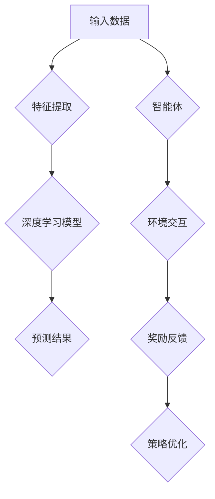

                 

关键词：软件2.0，深度学习，强化学习，人工智能，算法，技术趋势，软件开发，未来展望

摘要：本文深入探讨了软件2.0的发展趋势，重点分析了深度学习和强化学习在软件开发中的应用。通过详细的算法原理、数学模型和实际项目实践，本文旨在为读者提供对软件2.0技术趋势的全面理解，并展望其未来应用前景。

## 1. 背景介绍

软件2.0是指以用户为中心的软件开发模式，强调软件系统的可扩展性、灵活性和智能化。随着人工智能技术的飞速发展，深度学习和强化学习作为两种重要的机器学习技术，逐渐在软件2.0中占据重要地位。深度学习通过模仿人脑神经网络，实现图像识别、自然语言处理等复杂任务；强化学习则通过智能体与环境交互，实现最优策略的探索和优化。

## 2. 核心概念与联系

### 2.1 深度学习

深度学习是一种模仿人脑神经网络结构和功能的机器学习技术，通过多层神经元的堆叠，实现从简单到复杂的特征提取。其核心概念包括：

- 神经网络：由输入层、隐藏层和输出层组成，通过激活函数进行非线性变换。
- 反向传播：通过梯度下降优化算法，不断调整网络权重，以降低预测误差。
- 深度神经网络：多层神经网络的扩展，能够处理更复杂的数据和任务。

### 2.2 强化学习

强化学习是一种基于奖励机制的学习方法，智能体通过与环境的交互，不断优化策略，以实现长期目标。其核心概念包括：

- 智能体（Agent）：执行动作的主体，可以是机器人、虚拟代理等。
- 环境（Environment）：智能体执行动作的场所，可以为现实世界或虚拟环境。
- 策略（Policy）：智能体在给定状态下执行的动作选择。
- 奖励（Reward）：环境对智能体动作的反馈，用于评估智能体行为的优劣。

### 2.3 Mermaid 流程图



## 3. 核心算法原理 & 具体操作步骤

### 3.1 算法原理概述

深度学习通过多层神经网络进行特征提取和模型训练，最终实现对数据的分类、回归等任务。强化学习则通过智能体与环境交互，不断优化策略，以实现长期目标。

### 3.2 算法步骤详解

#### 深度学习步骤：

1. 数据预处理：对输入数据进行归一化、去噪等处理。
2. 构建神经网络：设计合适的神经网络结构，包括层数、神经元数目、激活函数等。
3. 模型训练：通过反向传播算法，不断调整网络权重，以降低预测误差。
4. 模型评估：对训练好的模型进行评估，以验证其泛化能力。

#### 强化学习步骤：

1. 初始化智能体：设置智能体的初始状态、动作空间和奖励函数。
2. 执行动作：智能体根据当前状态，选择最优动作。
3. 环境反馈：环境根据智能体动作，返回新的状态和奖励。
4. 更新策略：根据奖励反馈，调整智能体的策略。
5. 循环执行：重复执行动作、环境反馈和策略更新，直到达到目标。

### 3.3 算法优缺点

#### 深度学习：

优点：

- 强大的特征提取能力，能够处理大规模数据。
- 能够实现自动特征工程，降低人力成本。

缺点：

- 对数据质量要求较高，易受噪声影响。
- 模型训练时间较长，计算资源消耗大。

#### 强化学习：

优点：

- 能够处理动态环境，适应性强。
- 能够实现长期目标，具有鲁棒性。

缺点：

- 需要大量样本数据，训练过程较慢。
- 部分任务难以设计合适的奖励函数。

### 3.4 算法应用领域

深度学习广泛应用于图像识别、自然语言处理、推荐系统等领域；强化学习则在游戏AI、自动驾驶、机器人控制等领域具有广泛应用。

## 4. 数学模型和公式 & 详细讲解 & 举例说明

### 4.1 数学模型构建

#### 深度学习：

假设输入数据为 \( x \)，输出为 \( y \)，损失函数为 \( J \)，则深度学习的数学模型可以表示为：

\[ J = \frac{1}{2} \sum_{i=1}^{n} (y_i - \hat{y}_i)^2 \]

其中，\( \hat{y}_i \) 为预测结果，\( y_i \) 为真实值。

#### 强化学习：

假设智能体在状态 \( s \) 下执行动作 \( a \)，得到奖励 \( r \)，则强化学习的数学模型可以表示为：

\[ Q(s, a) = r + \gamma \max_{a'} Q(s', a') \]

其中，\( Q(s, a) \) 为状态 \( s \) 下执行动作 \( a \) 的价值函数，\( s' \) 为执行动作 \( a \) 后的状态，\( \gamma \) 为折扣因子。

### 4.2 公式推导过程

#### 深度学习：

设 \( z \) 为隐藏层输出，\( w \) 为网络权重，\( \alpha \) 为学习率，则反向传播算法的推导过程如下：

1. 前向传播：

\[ z = \sigma(w^T x + b) \]

2. 反向传播：

\[ \delta = (y - \hat{y}) \odot \sigma'(z) \]

\[ \Delta w = \alpha x^T \delta z \]

\[ \Delta b = \alpha \delta \]

其中，\( \sigma \) 为激活函数，\( \odot \) 表示逐元素相乘，\( \sigma' \) 为激活函数的导数。

#### 强化学习：

设 \( Q(s, a) \) 为状态 \( s \) 下执行动作 \( a \) 的价值函数，则 Q-学习算法的推导过程如下：

1. 初始化 \( Q(s, a) \) 为随机值。
2. 对于每个状态 \( s \)，选择最优动作 \( a \)：

\[ a = \arg\max_{a'} Q(s, a') \]

3. 更新 \( Q(s, a) \)：

\[ Q(s, a) = Q(s, a) + \alpha [r + \gamma \max_{a'} Q(s', a') - Q(s, a)] \]

其中，\( \alpha \) 为学习率，\( r \) 为奖励，\( \gamma \) 为折扣因子。

### 4.3 案例分析与讲解

#### 深度学习案例：图像分类

假设我们使用卷积神经网络（CNN）进行图像分类，输入图像为 \( x \)，标签为 \( y \)，损失函数为交叉熵损失函数 \( J \)。则训练过程可以表示为：

1. 前向传播：

\[ z = \sigma(w^T x + b) \]

\[ \hat{y} = \sigma(z^T w_2 + b_2) \]

2. 反向传播：

\[ \delta = (y - \hat{y}) \odot \sigma'(z) \]

\[ \Delta w_1 = \alpha x^T \delta z \]

\[ \Delta w_2 = \alpha \hat{y}^T \delta z \]

3. 更新权重：

\[ w_1 = w_1 - \Delta w_1 \]

\[ w_2 = w_2 - \Delta w_2 \]

#### 强化学习案例：迷宫寻路

假设智能体在迷宫中寻找路径，状态 \( s \) 表示当前位置，动作 \( a \) 表示上下左右移动，奖励 \( r \) 表示移动到终点时的奖励。则训练过程可以表示为：

1. 初始化 \( Q(s, a) \) 为随机值。
2. 执行动作 \( a \)，得到新的状态 \( s' \) 和奖励 \( r \)。
3. 更新 \( Q(s, a) \)：

\[ Q(s, a) = Q(s, a) + \alpha [r + \gamma \max_{a'} Q(s', a') - Q(s, a)] \]

4. 重复执行动作、更新 \( Q(s, a) \)，直到找到路径。

## 5. 项目实践：代码实例和详细解释说明

### 5.1 开发环境搭建

在编写深度学习和强化学习代码之前，我们需要搭建合适的开发环境。以下是常用的开发环境：

- Python 3.x
- TensorFlow 或 PyTorch 深度学习框架
- OpenAI Gym 强化学习环境

### 5.2 源代码详细实现

以下是一个简单的深度学习图像分类项目的代码实现：

```python
import tensorflow as tf
from tensorflow.keras import layers

# 构建模型
model = tf.keras.Sequential([
    layers.Conv2D(32, (3, 3), activation='relu', input_shape=(28, 28, 1)),
    layers.MaxPooling2D((2, 2)),
    layers.Conv2D(64, (3, 3), activation='relu'),
    layers.MaxPooling2D((2, 2)),
    layers.Conv2D(64, (3, 3), activation='relu'),
    layers.Flatten(),
    layers.Dense(64, activation='relu'),
    layers.Dense(10, activation='softmax')
])

# 编译模型
model.compile(optimizer='adam',
              loss='categorical_crossentropy',
              metrics=['accuracy'])

# 训练模型
model.fit(x_train, y_train, epochs=5, batch_size=64)
```

以下是一个简单的强化学习迷宫寻路项目的代码实现：

```python
import gym
import numpy as np

# 初始化环境
env = gym.make('maze-v0')

# 初始化 Q 表
Q = np.zeros((env.nS, env.nA))

# 设定学习率、折扣因子和最大迭代次数
alpha = 0.1
gamma = 0.9
max_episodes = 1000

# 训练智能体
for episode in range(max_episodes):
    state = env.reset()
    done = False
    total_reward = 0
    
    while not done:
        action = np.argmax(Q[state, :])
        next_state, reward, done, _ = env.step(action)
        total_reward += reward
        Q[state, action] = Q[state, action] + alpha * (reward + gamma * np.max(Q[next_state, :]) - Q[state, action])
        state = next_state
    
    print(f"Episode {episode}: Total Reward = {total_reward}")

# 关闭环境
env.close()
```

### 5.3 代码解读与分析

在深度学习代码中，我们首先定义了一个卷积神经网络模型，包括卷积层、池化层和全连接层。然后编译模型，并使用训练数据拟合模型。在强化学习代码中，我们初始化一个 Q 表，并使用 Q-学习算法不断更新 Q 表，以优化智能体的策略。

## 6. 实际应用场景

深度学习和强化学习在多个实际应用场景中取得了显著成果。例如，在图像识别领域，深度学习算法已经广泛应用于人脸识别、医疗影像诊断等任务；在自动驾驶领域，强化学习算法被用于自动驾驶车辆的路径规划和行为决策。

### 6.1 图像识别

在图像识别任务中，深度学习算法通过多层神经网络提取图像特征，实现对图像内容的准确分类。例如，可以使用卷积神经网络对医疗影像进行病变检测，提高诊断准确率。

### 6.2 自动驾驶

在自动驾驶领域，强化学习算法被用于自动驾驶车辆的路径规划和行为决策。例如，可以使用强化学习算法训练自动驾驶车辆在复杂交通环境下的驾驶策略，提高行驶安全和效率。

### 6.3 游戏

在游戏领域，深度学习和强化学习被广泛应用于游戏AI的设计。例如，可以使用深度学习算法实现游戏的智能对手，提高游戏的挑战性和趣味性；使用强化学习算法训练游戏角色的行为策略，实现更加真实的游戏体验。

## 7. 工具和资源推荐

### 7.1 学习资源推荐

- 《深度学习》（Goodfellow, Bengio, Courville著）：深度学习的经典教材，适合初学者和进阶者阅读。
- 《强化学习》（Sutton, Barto著）：强化学习的权威教材，系统讲解了强化学习的基本理论和应用。

### 7.2 开发工具推荐

- TensorFlow：谷歌开源的深度学习框架，适合进行深度学习和强化学习项目开发。
- PyTorch：Facebook开源的深度学习框架，具有良好的灵活性和可扩展性。

### 7.3 相关论文推荐

- “Deep Learning for Image Recognition”（Geoffrey H. Lin等，2015年）：介绍了深度学习在图像识别领域的应用。
- “Algorithms for Reinforcement Learning”（Richard S. Sutton, Andrew G. Barto著，2018年）：系统讲解了强化学习的基本算法和应用。

## 8. 总结：未来发展趋势与挑战

### 8.1 研究成果总结

深度学习和强化学习在软件开发中取得了显著成果，成为软件2.0的重要技术趋势。深度学习在图像识别、自然语言处理等领域具有广泛应用，强化学习在自动驾驶、游戏AI等领域取得了重要突破。

### 8.2 未来发展趋势

- 深度学习将进一步向多模态、泛化能力强、可解释性高的方向发展。
- 强化学习将逐步应用于更多复杂场景，如智能金融、智能制造等。

### 8.3 面临的挑战

- 深度学习模型训练时间较长、计算资源消耗大，需优化算法和硬件性能。
- 强化学习算法设计复杂、难以调试，需加强算法研究和应用场景探索。

### 8.4 研究展望

随着人工智能技术的不断发展，深度学习和强化学习在软件开发中的应用前景将更加广阔。未来，我们将看到更多创新的应用场景和突破性成果。

## 9. 附录：常见问题与解答

### 9.1 深度学习相关问题

**Q：什么是深度学习？**

A：深度学习是一种基于多层神经网络进行特征提取和模型训练的机器学习技术，能够自动从数据中学习复杂特征，实现图像识别、自然语言处理等任务。

**Q：深度学习有哪些常见模型？**

A：深度学习的常见模型包括卷积神经网络（CNN）、循环神经网络（RNN）、长短时记忆网络（LSTM）等。

### 9.2 强化学习相关问题

**Q：什么是强化学习？**

A：强化学习是一种基于奖励机制的学习方法，智能体通过与环境的交互，不断优化策略，以实现长期目标。

**Q：强化学习有哪些常见算法？**

A：强化学习的常见算法包括 Q-学习、SARSA、Deep Q-Network（DQN）等。

---

作者：禅与计算机程序设计艺术 / Zen and the Art of Computer Programming
----------------------------------------------------------------

这篇文章以深度学习和强化学习为核心，深入探讨了软件2.0的发展趋势，分析了算法原理、数学模型和实际应用，并对未来发展趋势和挑战进行了展望。希望这篇文章能为读者提供对软件2.0技术趋势的全面理解，激发对人工智能领域的探索热情。在接下来的时间里，我们将继续关注这一领域的最新动态，为大家带来更多有价值的内容。再次感谢您的阅读，如果您有任何问题或建议，欢迎在评论区留言，我们一起交流探讨。祝您学习愉快！

