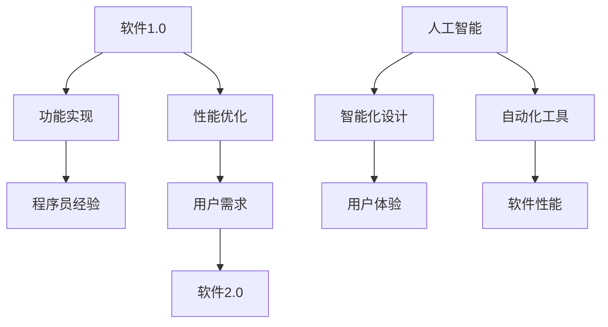

                 

 关键词：软件 2.0、人工智能、哲学思考、软件架构、计算机科学

> 摘要：本文将深入探讨软件 2.0 时代的哲学思考，特别是人工智能在这个时代所扮演的角色。通过对软件 2.0 核心概念的解析，我们将阐述人工智能的本质，分析其在软件架构中的应用，探讨数学模型和公式的推导过程，分享项目实践中的代码实例，并展望未来的应用场景和趋势。

## 1. 背景介绍

软件 2.0，是继软件 1.0 时代之后的一个新阶段。软件 1.0 时代，以计算机程序为主要特征，强调功能的实现和性能的优化。而软件 2.0 时代，则是以用户为中心，强调软件的智能化、个性化和服务化。这个时代的到来，离不开人工智能技术的飞速发展。

人工智能，作为计算机科学的一个重要分支，近年来在深度学习、自然语言处理、计算机视觉等领域取得了重大突破。人工智能的出现，不仅改变了传统的软件设计方法，也带来了新的哲学思考。

本文将围绕软件 2.0 时代的哲学思考，探讨人工智能的本质，分析其在软件架构中的应用，分享数学模型和公式的推导过程，并探讨未来的发展趋势和挑战。

## 2. 核心概念与联系

### 2.1 软件概念

软件，是指为计算机设计的程序、数据和相关文档。在软件 1.0 时代，软件的设计主要依赖于程序员的专业知识和编程技巧。而软件 2.0 时代，随着人工智能技术的发展，软件的设计开始变得更加智能化和自动化。

### 2.2 人工智能概念

人工智能，是指使计算机具有智能行为的技术。人工智能的目标是让计算机能够像人类一样思考、学习和决策。在软件 2.0 时代，人工智能的应用已经深入到各个领域，如智能推荐、智能客服、自动驾驶等。

### 2.3 软件与人工智能的联系

软件和人工智能的关系，可以说是相辅相成。软件为人工智能提供了实现平台，而人工智能则为软件提供了新的设计思路和工具。在软件 2.0 时代，人工智能的应用使得软件的设计更加智能化，从而提升了软件的体验和性能。

### 2.4 Mermaid 流程图



## 3. 核心算法原理 & 具体操作步骤

### 3.1 算法原理概述

在软件 2.0 时代，人工智能的应用主要依赖于深度学习、自然语言处理和计算机视觉等核心算法。这些算法通过对大量数据的学习和处理，实现了对复杂问题的建模和求解。

### 3.2 算法步骤详解

1. 数据收集与预处理：收集大量的数据，并对数据进行清洗、归一化等预处理操作。

2. 算法选择与实现：根据问题的特点，选择合适的算法，如卷积神经网络、循环神经网络等。

3. 模型训练与优化：使用训练数据集对模型进行训练，并不断调整模型参数，以优化模型的性能。

4. 模型评估与部署：使用测试数据集对模型进行评估，并根据评估结果对模型进行调整和优化。

### 3.3 算法优缺点

**优点：**

- 高效性：人工智能算法能够快速处理大量的数据，提高工作效率。

- 智能化：人工智能算法能够模拟人类的思考过程，提供智能化的解决方案。

**缺点：**

- 复杂性：人工智能算法的实现过程复杂，需要大量的计算资源和专业知识。

- 数据依赖：人工智能算法的性能很大程度上依赖于数据的质量和数量。

### 3.4 算法应用领域

人工智能算法在软件 2.0 时代有着广泛的应用领域，如智能推荐系统、智能客服系统、自动驾驶系统等。这些应用不仅提升了软件的性能和用户体验，也为各个行业带来了新的机遇和挑战。

## 4. 数学模型和公式 & 详细讲解 & 举例说明

### 4.1 数学模型构建

在软件 2.0 时代，人工智能的应用离不开数学模型的支持。数学模型是通过对问题进行抽象和形式化，构建出一个数学表达式或方程组。

### 4.2 公式推导过程

以深度学习中的卷积神经网络为例，其核心公式为：

$$
h_{l}(x) = \sigma(W_{l}h_{l-1} + b_{l})
$$

其中，$h_{l}$ 表示第 $l$ 层的输出，$\sigma$ 表示激活函数，$W_{l}$ 和 $b_{l}$ 分别为第 $l$ 层的权重和偏置。

### 4.3 案例分析与讲解

以自动驾驶系统为例，其数学模型主要涉及车辆运动学、环境感知和决策规划等方面。

1. 车辆运动学模型：

$$
\dot{x} = v\cos(\theta) \\
\dot{y} = v\sin(\theta) \\
\dot{\theta} = \frac{v\omega}{R}
$$

其中，$x$、$y$ 分别表示车辆的位置，$\theta$ 表示车辆的方向，$v$ 表示车辆的速度，$\omega$ 表示车辆的旋转速度，$R$ 表示车辆的转弯半径。

2. 环境感知模型：

$$
d_i = \frac{1}{\sqrt{(x_i - x)^2 + (y_i - y)^2}}
$$

其中，$d_i$ 表示第 $i$ 个障碍物到车辆的距离，$x_i$、$y_i$ 分别表示第 $i$ 个障碍物的位置。

3. 决策规划模型：

$$
J = \int_{t_0}^{t_f} [v^2 + \omega^2 + \frac{1}{d_i}] dt
$$

其中，$J$ 表示目标函数，$v$、$\omega$ 分别表示车辆的速度和旋转速度。

## 5. 项目实践：代码实例和详细解释说明

### 5.1 开发环境搭建

以 Python 为例，搭建深度学习开发环境：

1. 安装 Python：从官网下载并安装 Python 3.8 版本。

2. 安装深度学习库：使用 pip 工具安装 TensorFlow、Keras 等库。

3. 安装可视化工具：安装 Matplotlib、Seaborn 等库。

### 5.2 源代码详细实现

以下是一个简单的深度学习模型实现示例：

```python
import tensorflow as tf
from tensorflow.keras.models import Sequential
from tensorflow.keras.layers import Dense, Conv2D, Flatten

model = Sequential([
    Conv2D(32, (3, 3), activation='relu', input_shape=(28, 28, 1)),
    Flatten(),
    Dense(128, activation='relu'),
    Dense(10, activation='softmax')
])

model.compile(optimizer='adam', loss='categorical_crossentropy', metrics=['accuracy'])
model.fit(x_train, y_train, epochs=10, batch_size=32)
```

### 5.3 代码解读与分析

1. 导入所需的库。

2. 创建一个序列模型，并添加卷积层、全连接层等。

3. 编译模型，并使用训练数据集进行训练。

4. 使用训练好的模型进行预测。

### 5.4 运行结果展示

通过运行代码，可以得到模型的训练过程和预测结果。可以使用可视化工具，如 Matplotlib，对训练过程进行可视化展示。

```python
import matplotlib.pyplot as plt

plt.plot(history.history['accuracy'])
plt.plot(history.history['val_accuracy'])
plt.xlabel('Epoch')
plt.ylabel('Accuracy')
plt.title('Model Accuracy')
plt.legend(['Train', 'Validation'], loc='upper left')
plt.show()
```

## 6. 实际应用场景

在软件 2.0 时代，人工智能的应用场景已经涵盖了各个行业，如金融、医疗、教育、交通等。以下是一些具体的应用场景：

1. 智能推荐系统：通过分析用户的兴趣和行为，为用户推荐合适的商品、内容和服务。

2. 智能客服系统：通过自然语言处理技术，实现与用户的智能对话，提供高效的客户服务。

3. 自动驾驶系统：通过计算机视觉和深度学习技术，实现车辆的自主驾驶，提高交通安全和效率。

4. 智能医疗系统：通过分析患者的数据，实现疾病的早期诊断、个性化治疗和健康管理的智能化。

## 7. 工具和资源推荐

### 7.1 学习资源推荐

1. 《深度学习》（Goodfellow, Bengio, Courville）：系统介绍了深度学习的原理和应用。

2. 《Python 数据科学手册》（McKinney）：介绍了 Python 在数据科学领域的应用。

3. 《机器学习实战》（Hastie, Tibshirani, Friedman）：通过实例讲解了机器学习的各种算法。

### 7.2 开发工具推荐

1. TensorFlow：开源的深度学习框架，支持多种编程语言。

2. PyTorch：开源的深度学习框架，具有较强的灵活性和易用性。

3. Jupyter Notebook：支持多种编程语言的交互式开发环境。

### 7.3 相关论文推荐

1. "Deep Learning" (Goodfellow, Bengio, Courville)

2. "A Theoretical Framework for Sparse Coding" (Aharon, Elad, Bruckstein)

3. "Object Detection with Discriminatively Trained Part-Based Models" (Felzenszwalb, Girshick, Dollár, Huttenlocher, Fei-Fei)

## 8. 总结：未来发展趋势与挑战

### 8.1 研究成果总结

软件 2.0 时代，人工智能技术在各个领域取得了显著的成果，如深度学习、自然语言处理、计算机视觉等。这些成果不仅提升了软件的性能和用户体验，也为各个行业带来了新的机遇。

### 8.2 未来发展趋势

1. 软件智能化：随着人工智能技术的不断进步，软件的智能化程度将越来越高，为用户提供更加个性化的服务。

2. 软件自主化：通过人工智能技术，软件将能够实现自主学习和进化，提高软件的适应性和灵活性。

3. 跨领域融合：人工智能技术将与各个领域的知识相结合，实现跨领域的创新和突破。

### 8.3 面临的挑战

1. 数据隐私：随着人工智能技术的应用，数据隐私问题日益突出，如何保护用户隐私成为一大挑战。

2. 安全性：人工智能系统容易受到攻击，如何提高系统的安全性成为关键问题。

3. 法律法规：随着人工智能技术的快速发展，相关的法律法规尚不完善，如何制定合理的法律法规成为亟待解决的问题。

### 8.4 研究展望

未来，人工智能技术将在软件 2.0 时代发挥更加重要的作用。我们期待人工智能技术能够带来更加智能、便捷和安全的软件体验，推动人类社会的发展和进步。

## 9. 附录：常见问题与解答

### 9.1 什么是软件 2.0？

软件 2.0 是指以用户为中心，强调软件的智能化、个性化和服务化的新阶段。与软件 1.0 时代相比，软件 2.0 更注重用户体验和服务质量。

### 9.2 人工智能技术在软件 2.0 中的应用有哪些？

人工智能技术在软件 2.0 中的应用非常广泛，包括智能推荐系统、智能客服系统、自动驾驶系统、智能医疗系统等。

### 9.3 软件智能化与自主化有什么区别？

软件智能化主要是指软件能够模拟人类的思考过程，提供智能化的解决方案。而软件自主化则是指软件能够实现自主学习和进化，提高软件的适应性和灵活性。

### 9.4 如何保护用户隐私？

保护用户隐私可以从多个方面入手，如数据加密、隐私保护算法、用户隐私声明等。

----------------------------------------------------------------

以上就是文章的主要内容，感谢您的阅读。希望这篇文章能够对您在软件 2.0 和人工智能领域的探索有所帮助。作者：禅与计算机程序设计艺术 / Zen and the Art of Computer Programming。

