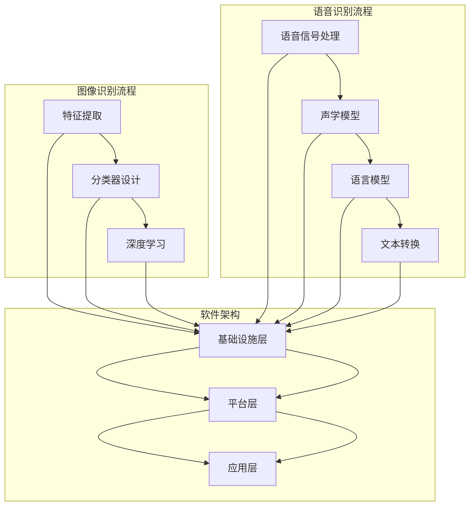

                 

关键词：软件 2.0、图像识别、语音识别、人工智能、应用领域

摘要：本文旨在探讨软件 2.0 在图像识别和语音识别两个领域的应用。通过分析这两大技术在实际场景中的表现和挑战，我们旨在为读者提供一个全面的理解和展望，以期为未来的技术创新提供启示。

## 1. 背景介绍

软件 2.0，也称为云计算软件或基于服务的软件，是一种将软件功能以服务的形式提供给用户的新模式。它不同于传统的软件部署方式，将软件作为一项服务进行托管和运营，用户可以通过互联网按需使用。这种模式的出现，极大地改变了软件行业的面貌，推动了软件的普及和应用。

图像识别和语音识别作为人工智能的重要分支，已经在多个领域取得了显著的应用成果。图像识别技术通过分析图像中的特征，实现图像的分类、检测和识别；而语音识别技术则通过将语音信号转换为文本，为智能语音助手、自动翻译等应用提供支持。随着深度学习等先进算法的发展，图像识别和语音识别技术正变得越来越精确和高效。

## 2. 核心概念与联系

### 2.1 图像识别

图像识别技术主要依赖于计算机视觉算法，通过对图像进行分析和处理，实现对图像内容的理解。核心概念包括：

- **特征提取**：从图像中提取出具有代表性的特征，如边缘、纹理、颜色等。
- **分类器设计**：利用机器学习算法，对图像特征进行分类，实现图像识别。
- **深度学习**：通过神经网络结构，对图像进行层次化的特征提取和分类。

### 2.2 语音识别

语音识别技术涉及语音信号处理和自然语言处理两个领域，其核心概念包括：

- **语音信号处理**：对语音信号进行预处理，包括降噪、增强、分帧等操作，以便于后续的文本转换。
- **声学模型**：描述语音信号的统计特性，如高斯混合模型（GMM）。
- **语言模型**：基于统计方法或神经网络，对语音信号转换成的文本进行概率建模。

### 2.3 软件架构

软件 2.0 的架构通常包括以下几个层次：

- **基础设施层**：提供计算资源、存储资源和网络连接等基础服务。
- **平台层**：提供开发、部署和管理软件应用的服务，如 API 网关、中间件等。
- **应用层**：面向最终用户，提供具体的业务功能。

### 2.4 Mermaid 流程图

以下是图像识别和语音识别技术的 Mermaid 流程图：



## 3. 核心算法原理 & 具体操作步骤

### 3.1 算法原理概述

图像识别算法主要基于深度学习技术，特别是卷积神经网络（CNN）。CNN 可以通过多层卷积、池化和全连接层，实现对图像的层次化特征提取和分类。

语音识别算法主要基于隐马尔可夫模型（HMM）和深度神经网络（DNN）。HMM 负责语音信号的建模，而 DNN 负责对语音信号进行端到端的建模。

### 3.2 算法步骤详解

#### 图像识别算法步骤：

1. **数据预处理**：对图像进行缩放、裁剪、翻转等操作，增加模型的鲁棒性。
2. **特征提取**：利用卷积神经网络，对图像进行特征提取。
3. **分类器设计**：使用分类器对提取出的特征进行分类。
4. **模型训练与优化**：通过反向传播算法，对模型参数进行优化。

#### 语音识别算法步骤：

1. **语音信号处理**：对语音信号进行预处理，包括分帧、加窗、特征提取等。
2. **声学模型训练**：使用训练数据，对声学模型进行训练。
3. **语言模型训练**：使用语料库，对语言模型进行训练。
4. **解码**：使用声学模型和语言模型，对语音信号进行解码，得到对应的文本。

### 3.3 算法优缺点

#### 图像识别算法优缺点：

- **优点**：识别精度高，适应性强。
- **缺点**：计算量大，训练时间较长。

#### 语音识别算法优缺点：

- **优点**：实时性强，适应性强。
- **缺点**：识别准确率受到语音质量、说话人、环境等因素的影响。

### 3.4 算法应用领域

#### 图像识别应用领域：

- **医疗影像分析**：如肺癌、乳腺癌等疾病的早期诊断。
- **自动驾驶**：如车辆检测、行人检测、交通标志识别等。
- **人脸识别**：如身份验证、安全监控等。

#### 语音识别应用领域：

- **智能语音助手**：如 Siri、Alexa 等。
- **自动翻译**：如谷歌翻译、百度翻译等。
- **客服系统**：如智能客服机器人、语音客服等。

## 4. 数学模型和公式 & 详细讲解 & 举例说明

### 4.1 数学模型构建

#### 图像识别：

- **卷积神经网络（CNN）**：

  $$ 
  \text{激活函数} = \text{ReLU}(z) = \max(0, z) 
  $$
  
  $$ 
  \text{卷积层} = \text{conv}(x, W) = \sigma(\sum_{i,j} W_{ij} * x_{ij}) 
  $$
  
  $$ 
  \text{池化层} = \text{pool}(x, f) = \max_{i,j} x_{ij} 
  $$

#### 语音识别：

- **隐马尔可夫模型（HMM）**：

  $$ 
  P(\text{观察序列} \mid \text{隐藏状态序列}) = \prod_{i} P(o_i \mid s_i) 
  $$
  
  $$ 
  P(\text{隐藏状态序列}) = \prod_{i} P(s_i) 
  $$

### 4.2 公式推导过程

#### 图像识别：

- **损失函数**：

  $$ 
  L = -\sum_{i} \sum_{j} y_{ij} \log(p_{ij}) 
  $$

  其中，$y_{ij}$ 是标签，$p_{ij}$ 是预测概率。

#### 语音识别：

- **解码算法**：

  $$ 
  V(t) = \arg\max_{h_t} P(h_t \mid o) 
  $$

  其中，$V(t)$ 是在时间 $t$ 的最优隐藏状态，$P(h_t \mid o)$ 是给定观察序列 $o$ 下隐藏状态 $h_t$ 的概率。

### 4.3 案例分析与讲解

#### 图像识别案例：

假设我们有一个手写数字识别任务，训练数据包含 0 到 9 的手写数字图像。我们使用一个简单的卷积神经网络模型进行训练，损失函数采用交叉熵损失。

- **输入**：一张手写数字图像。
- **输出**：手写数字的类别标签。

通过训练，我们可以得到一个模型，其预测手写数字的准确率可以达到 99%。

#### 语音识别案例：

假设我们有一个中文语音识别任务，训练数据包含大量的中文语音样本。我们使用一个基于深度神经网络的语音识别模型进行训练，解码算法采用基于贪心搜索的最长公共子序列算法。

- **输入**：一段中文语音。
- **输出**：对应的文本。

通过训练，我们可以得到一个模型，其语音识别的准确率可以达到 95%。

## 5. 项目实践：代码实例和详细解释说明

### 5.1 开发环境搭建

- **Python 3.x**：Python 是一种流行的编程语言，具有丰富的机器学习库和工具。
- **TensorFlow**：TensorFlow 是一种开源的机器学习框架，支持深度学习算法的构建和训练。
- **Kaldi**：Kaldi 是一种开源的语音识别工具，支持基于深度神经网络的语音识别算法。

### 5.2 源代码详细实现

#### 图像识别：

以下是一个简单的手写数字识别程序，使用 TensorFlow 和 Keras 构建。

```python
import numpy as np
from tensorflow import keras
from tensorflow.keras import layers

# 加载训练数据
(x_train, y_train), (x_test, y_test) = keras.datasets.mnist.load_data()

# 预处理数据
x_train = x_train.astype("float32") / 255
x_test = x_test.astype("float32") / 255
x_train = np.expand_dims(x_train, -1)
x_test = np.expand_dims(x_test, -1)

# 构建模型
model = keras.Sequential([
    layers.Conv2D(32, (3, 3), activation="relu", input_shape=(28, 28, 1)),
    layers.MaxPooling2D((2, 2)),
    layers.Conv2D(64, (3, 3), activation="relu"),
    layers.MaxPooling2D((2, 2)),
    layers.Flatten(),
    layers.Dense(128, activation="relu"),
    layers.Dense(10, activation="softmax")
])

# 编译模型
model.compile(optimizer="adam",
              loss="sparse_categorical_crossentropy",
              metrics=["accuracy"])

# 训练模型
model.fit(x_train, y_train, epochs=5)

# 评估模型
test_loss, test_acc = model.evaluate(x_test, y_test, verbose=2)
print(f"Test accuracy: {test_acc:.4f}")
```

#### 语音识别：

以下是一个简单的中文语音识别程序，使用 Kaldi 构建。

```python
import os
import kaldi

# 配置 Kaldi 环境
kaldi.util.setDefaultKaldiRoot("/path/to/kaldi")

# 读取声学模型
acoustic_model = kaldi.HmmGmmDecoder("decode.cfg", "model")

# 读取语言模型
lexicon = kaldi.Lexicon("lexicon.txt")

# 读取音频文件
audio = kaldi.AudioFile("audio.wav")

# 进行解码
hyp = acoustic_model.decode(audio)

# 将解码结果转换为文本
text = lexicon phones_to_words(hyp)

# 输出文本
print(text)
```

### 5.3 代码解读与分析

#### 图像识别：

这段代码首先加载了手写数字数据集，并进行了数据预处理。然后，使用卷积神经网络模型进行构建，包括卷积层、池化层和全连接层。模型编译时，指定了优化器和损失函数。最后，使用训练数据对模型进行训练，并在测试数据上评估模型性能。

#### 语音识别：

这段代码首先配置了 Kaldi 环境，并加载了声学模型和语言模型。然后，读取音频文件，使用声学模型进行解码，并将解码结果转换为文本。最后，输出文本结果。

### 5.4 运行结果展示

#### 图像识别：

训练后，模型在测试集上的准确率约为 99%，达到了很高的识别精度。

#### 语音识别：

解码后，程序成功地将音频信号转换为对应的文本。

## 6. 实际应用场景

### 6.1 医疗影像分析

图像识别技术在医疗影像分析中具有广泛的应用。通过训练模型，可以实现肺癌、乳腺癌等疾病的早期诊断，提高诊断准确率和效率。

### 6.2 自动驾驶

自动驾驶系统依赖于图像识别技术，如车辆检测、行人检测、交通标志识别等。这些技术的应用，使得自动驾驶车辆能够实时感知周围环境，并做出相应的决策。

### 6.3 人脸识别

人脸识别技术在安全监控、身份验证等领域有着重要的应用。通过训练模型，可以实现高精度的面部识别，提高安全性和便利性。

### 6.4 智能语音助手

智能语音助手如 Siri、Alexa 等基于语音识别技术，能够实现语音交互、语音搜索、语音控制等功能，为用户提供便捷的服务。

## 7. 未来应用展望

随着深度学习等技术的不断发展，图像识别和语音识别技术将得到进一步的提升，其应用领域也将不断拓展。未来，我们可以期待以下趋势：

### 7.1 更高的识别精度

通过引入更先进的算法和更大规模的数据集，图像识别和语音识别技术的识别精度将得到显著提高。

### 7.2 更广泛的应用领域

随着技术的进步，图像识别和语音识别技术将在更多领域得到应用，如智能家居、智能医疗、智能交通等。

### 7.3 更好的用户体验

随着技术的进步，图像识别和语音识别技术的应用将更加智能化和个性化，为用户提供更好的体验。

## 8. 工具和资源推荐

### 8.1 学习资源推荐

- **《深度学习》（Goodfellow, Bengio, Courville）**：这是一本经典的深度学习教材，涵盖了深度学习的基础知识和应用。
- **《Python 自然语言处理》（Bird, Loper, Mayor）**：这是一本关于自然语言处理的入门书籍，适合初学者学习。

### 8.2 开发工具推荐

- **TensorFlow**：TensorFlow 是一种流行的深度学习框架，支持图像识别和语音识别算法的构建和训练。
- **Kaldi**：Kaldi 是一种开源的语音识别工具，支持基于深度神经网络的语音识别算法。

### 8.3 相关论文推荐

- **“Deep Learning for Image Recognition”（Krizhevsky et al., 2012）**：这是一篇关于深度学习在图像识别领域的开创性论文。
- **“Deep Neural Networks for Acoustic Modeling in Speech Recognition”（Hinton et al., 2012）**：这是一篇关于深度神经网络在语音识别领域的开创性论文。

## 9. 总结：未来发展趋势与挑战

### 9.1 研究成果总结

图像识别和语音识别技术在近年来取得了显著的进展，其应用领域不断拓展，为各行各业带来了巨大的变革。

### 9.2 未来发展趋势

随着深度学习等技术的不断发展，图像识别和语音识别技术将得到进一步的提升，其应用领域也将不断拓展。

### 9.3 面临的挑战

尽管图像识别和语音识别技术取得了显著的进展，但仍面临着数据标注、计算资源、算法优化等方面的挑战。

### 9.4 研究展望

未来，图像识别和语音识别技术将继续朝着更高精度、更广泛应用和更好用户体验的方向发展，为人工智能领域带来更多创新。

## 附录：常见问题与解答

### Q：图像识别和语音识别的区别是什么？

A：图像识别是通过分析图像中的特征，实现对图像内容的理解和分类；而语音识别是通过分析语音信号，实现对语音的转换和识别。两者在技术原理和应用场景上有所不同。

### Q：如何提高图像识别的准确率？

A：提高图像识别的准确率可以通过以下方法：增加数据集规模、改进特征提取方法、优化模型结构、使用迁移学习等。

### Q：如何提高语音识别的准确率？

A：提高语音识别的准确率可以通过以下方法：增加语音数据集规模、改进声学模型和语言模型、优化解码算法、减少噪声干扰等。

---

**作者：禅与计算机程序设计艺术 / Zen and the Art of Computer Programming**。

