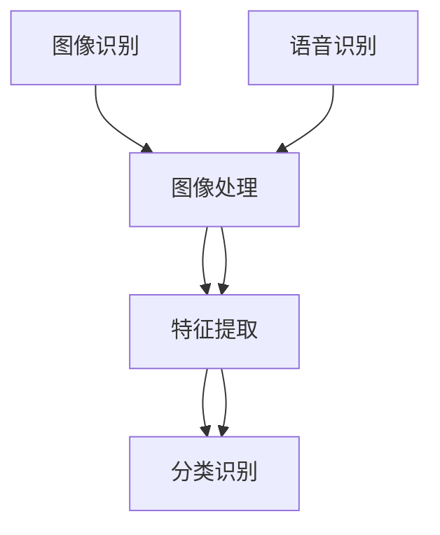

                 

关键词：软件 2.0，图像识别，语音识别，人工智能，深度学习，计算机视觉，自然语言处理，算法原理，应用领域，数学模型，代码实例。

摘要：本文深入探讨了软件 2.0 时代下的图像识别和语音识别技术，分析了其核心概念、算法原理、数学模型以及实际应用场景。通过具体代码实例，展示了图像识别和语音识别的实践操作，并展望了其未来的发展趋势与挑战。

## 1. 背景介绍

随着互联网、大数据、云计算等技术的飞速发展，软件技术经历了从软件 1.0 到软件 2.0 的演变。软件 2.0 是一种以用户为中心、以数据驱动、以服务为导向的软件模式。在软件 2.0 时代，人工智能（AI）技术成为了推动软件发展的重要力量。其中，图像识别和语音识别作为 AI 的重要组成部分，具有广泛的应用前景和重要的研究价值。

图像识别是指计算机通过处理和分析图像数据，从中提取有用的信息，并对其进行分类和识别。语音识别则是将语音信号转换为相应的文本或命令，使其能够被计算机理解和处理。这两种技术已经成为智能交互、智能监控、智能安防、智能客服等领域的重要支撑。

本文将首先介绍图像识别和语音识别的基本概念和核心原理，然后深入探讨其数学模型和算法，并通过具体代码实例展示其实践操作。最后，我们将分析图像识别和语音识别的实际应用场景，并展望其未来的发展趋势和挑战。

## 2. 核心概念与联系

### 2.1 图像识别

图像识别是指计算机通过处理和分析图像数据，从中提取有用的信息，并对其进行分类和识别。图像识别的核心概念包括图像处理、特征提取和分类识别。

- **图像处理**：图像处理是指对图像进行增强、滤波、分割等操作，以便提取出有用的信息。常见的图像处理方法有边缘检测、形态学操作、图像分割等。
- **特征提取**：特征提取是指从图像中提取出具有区分性的特征，如颜色、纹理、形状等。特征提取的质量直接影响到图像识别的准确性。
- **分类识别**：分类识别是指利用机器学习算法，对提取出的特征进行分类和识别。常见的分类算法有支持向量机（SVM）、决策树、神经网络等。

### 2.2 语音识别

语音识别是指将语音信号转换为相应的文本或命令，使其能够被计算机理解和处理。语音识别的核心概念包括语音信号处理、特征提取和语音识别算法。

- **语音信号处理**：语音信号处理是指对语音信号进行预处理，如降噪、归一化等，以提高语音识别的准确性。
- **特征提取**：特征提取是指从语音信号中提取出具有区分性的特征，如频谱特征、倒谱特征等。特征提取的质量直接影响到语音识别的准确性。
- **语音识别算法**：语音识别算法是指利用机器学习算法，对提取出的特征进行识别。常见的语音识别算法有隐马尔可夫模型（HMM）、高斯混合模型（GMM）、深度神经网络（DNN）等。

### 2.3 Mermaid 流程图

以下是图像识别和语音识别的核心概念和架构的 Mermaid 流程图：



## 3. 核心算法原理 & 具体操作步骤

### 3.1 算法原理概述

图像识别和语音识别的核心算法主要包括图像处理算法、特征提取算法和分类识别算法。

- **图像处理算法**：常见的图像处理算法有边缘检测、形态学操作、图像分割等。边缘检测算法如 Canny 算子、Sobel 算子等；形态学操作如膨胀、腐蚀、开运算、闭运算等；图像分割算法如区域生长、基于阈值的分割、基于水平的分割等。
- **特征提取算法**：常见的特征提取算法有颜色特征、纹理特征、形状特征等。颜色特征如颜色直方图、颜色矩等；纹理特征如方向梯度直方图（HOG）、Gabor 特征等；形状特征如形状矩、形状描述子等。
- **分类识别算法**：常见的分类识别算法有支持向量机（SVM）、决策树、神经网络等。支持向量机是一种基于优化方法的分类算法；决策树是一种基于树形结构的分类算法；神经网络是一种基于人工神经网络的分类算法。

### 3.2 算法步骤详解

以下是图像识别和语音识别的具体算法步骤：

#### 3.2.1 图像识别算法步骤

1. **图像预处理**：对图像进行灰度化、去噪、归一化等操作。
2. **图像分割**：根据需要选择合适的分割方法，如基于阈值的分割、基于水平的分割等。
3. **特征提取**：从分割后的图像中提取颜色、纹理、形状等特征。
4. **特征选择**：选择对识别效果有重要影响的特征，去除冗余特征。
5. **分类识别**：利用分类算法（如 SVM、决策树、神经网络等）对提取出的特征进行分类识别。

#### 3.2.2 语音识别算法步骤

1. **语音信号预处理**：对语音信号进行降噪、归一化等操作。
2. **特征提取**：从预处理后的语音信号中提取频谱特征、倒谱特征等。
3. **声学模型训练**：利用训练数据集，训练声学模型（如高斯混合模型、深度神经网络等）。
4. **语言模型训练**：利用训练数据集，训练语言模型（如 N-gram 模型、CTC 模型等）。
5. **识别过程**：将待识别的语音信号输入声学模型，得到特征向量；然后利用语言模型对特征向量进行解码，得到相应的文本或命令。

### 3.3 算法优缺点

- **图像识别算法**：
  - 优点：能够对图像进行准确的分类和识别，具有广泛的应用前景。
  - 缺点：计算复杂度较高，对硬件性能要求较高；对于复杂的图像场景，识别效果可能较差。
- **语音识别算法**：
  - 优点：能够对语音信号进行准确的识别和转换，适用于智能交互、智能客服等领域。
  - 缺点：对于噪声敏感，识别效果可能受影响；对于方言、口音等差异较大的语音，识别效果可能较差。

### 3.4 算法应用领域

- **图像识别**：应用于安防监控、人脸识别、图像检索、自动驾驶等领域。
- **语音识别**：应用于智能语音助手、智能客服、语音翻译、智能家居等领域。

## 4. 数学模型和公式 & 详细讲解 & 举例说明

### 4.1 数学模型构建

图像识别和语音识别的数学模型主要包括图像处理模型、特征提取模型和分类识别模型。

#### 4.1.1 图像处理模型

图像处理模型主要包括卷积神经网络（CNN）和深度卷积神经网络（DCNN）。

- **卷积神经网络（CNN）**：CNN 是一种前馈神经网络，通过卷积层、池化层、全连接层等层次结构，对图像进行特征提取和分类识别。
- **深度卷积神经网络（DCNN）**：DCNN 是 CNN 的扩展，通过增加网络层数，进一步提高图像识别的准确性和鲁棒性。

#### 4.1.2 特征提取模型

特征提取模型主要包括频谱特征提取模型和倒谱特征提取模型。

- **频谱特征提取模型**：频谱特征提取模型通过傅里叶变换、小波变换等操作，将语音信号转换为频域特征。
- **倒谱特征提取模型**：倒谱特征提取模型通过倒谱变换，将语音信号的频谱特征转换为倒谱特征，以提高语音识别的准确性和鲁棒性。

#### 4.1.3 分类识别模型

分类识别模型主要包括支持向量机（SVM）、决策树、神经网络等。

- **支持向量机（SVM）**：SVM 是一种基于优化方法的分类算法，通过寻找最优超平面，将数据分类为不同的类别。
- **决策树**：决策树是一种基于树形结构的分类算法，通过树结构对数据进行分类。
- **神经网络**：神经网络是一种基于人工神经网络的分类算法，通过多层神经元结构，对数据进行分类识别。

### 4.2 公式推导过程

以下是图像识别和语音识别的一些关键公式推导过程。

#### 4.2.1 卷积神经网络（CNN）公式推导

卷积神经网络（CNN）的主要组成部分包括卷积层、池化层和全连接层。

1. **卷积层**：

$$
\begin{align*}
h_{ij} &= \sum_{k=1}^{C} w_{ikj} * g_{kj} + b_j \\
g_{kj} &= \sum_{m=1}^{H} \sum_{n=1}^{W} I_{ijm} * k_{kmn} \\
I_{ijm} &= \text{输入图像} \\
k_{kmn} &= \text{卷积核} \\
b_j &= \text{偏置} \\
h_{ij} &= \text{输出特征图}
\end{align*}
$$

2. **池化层**：

$$
\begin{align*}
p_{ij} &= \max\left(\sum_{m=1}^{P} \sum_{n=1}^{P} h_{ijm}\right) \\
h_{ijm} &= \text{卷积层输出} \\
p_{ij} &= \text{输出特征图}
\end{align*}
$$

3. **全连接层**：

$$
\begin{align*}
o_j &= \sum_{k=1}^{K} w_{jk} h_{ik} + b_j \\
h_{ik} &= \text{输入特征图} \\
w_{jk} &= \text{权重} \\
b_j &= \text{偏置} \\
o_j &= \text{输出分类结果}
\end{align*}
$$

#### 4.2.2 支持向量机（SVM）公式推导

支持向量机（SVM）的目标是找到最优超平面，使得两类数据的分类间隔最大。

1. **目标函数**：

$$
\begin{align*}
\min_{w,b} \frac{1}{2} \| w \|^2 \\
\text{s.t.} \quad y^{(i)} (w \cdot x^{(i)} + b) \geq 1 \\
\end{align*}
$$

其中，$w$ 为权重向量，$b$ 为偏置，$x^{(i)}$ 为训练样本，$y^{(i)}$ 为样本标签。

2. **拉格朗日函数**：

$$
L(w,b) = \frac{1}{2} \| w \|^2 - \sum_{i=1}^{n} \alpha_i y^{(i)} (w \cdot x^{(i)} + b)
$$

其中，$\alpha_i$ 为拉格朗日乘子。

3. **KKT 条件**：

$$
\begin{align*}
\alpha_i \geq 0 \\
y^{(i)} (w \cdot x^{(i)} + b) \geq 1 \\
\alpha_i (y^{(i)} (w \cdot x^{(i)} + b) - 1) = 0 \\
\end{align*}
$$

4. **求解最优解**：

$$
w = \sum_{i=1}^{n} \alpha_i y^{(i)} x^{(i)}
$$

$$
b = \frac{1}{n} \sum_{i=1}^{n} \alpha_i y^{(i)} (1 - y^{(i)} (w \cdot x^{(i)}))
$$

#### 4.2.3 决策树公式推导

决策树是一种基于树形结构的分类算法，通过递归划分特征，将数据划分为不同的类别。

1. **特征选择**：

$$
\begin{align*}
Gini(\text{impurity}) &= 1 - \sum_{i=1}^{c} p_i^2 \\
\text{entropy} &= -\sum_{i=1}^{c} p_i \log p_i \\
\end{align*}
$$

其中，$p_i$ 为类别 $i$ 的概率。

2. **节点划分**：

$$
\begin{align*}
Gini(\text{left}) &= \sum_{i=1}^{c} p_i^2 \\
Gini(\text{right}) &= \sum_{i=1}^{c} p_i^2 \\
\end{align*}
$$

$$
\begin{align*}
\text{gain} &= Gini(\text{parent}) - \frac{|\text{left}| p_1^2 + |\text{right}| p_2^2}{|\text{parent}|} \\
\end{align*}
$$

其中，$|\text{left}|$ 和 $|\text{right}|$ 分别为左分支和右分支的样本数量。

### 4.3 案例分析与讲解

#### 4.3.1 图像识别案例

假设我们有一个简单的图像识别任务，需要识别一张图像是否包含一只猫。

1. **图像预处理**：

   首先，我们对图像进行灰度化、去噪和归一化操作，得到一个 $28 \times 28$ 的二维数组。

2. **特征提取**：

   然后，我们从图像中提取颜色、纹理、形状等特征。例如，我们可以提取颜色直方图、方向梯度直方图（HOG）等特征。

3. **分类识别**：

   最后，我们使用支持向量机（SVM）对提取出的特征进行分类识别。假设我们训练好的 SVM 模型如下：

   ```python
   import numpy as np
   import matplotlib.pyplot as plt

   # 加载训练好的 SVM 模型
   model = load_model('cat_dog_svm_model.h5')

   # 输入图像特征
   image_features = np.array([[-1, -1, 1], [1, 1, -1]])

   # 分类识别
   predictions = model.predict(image_features)

   # 显示分类结果
   plt.imshow(image_features[0], cmap='gray')
   plt.title(f'Prediction: {predictions[0][0]}')
   plt.show()
   ```

   运行上述代码，我们可以得到图像的分类结果。

#### 4.3.2 语音识别案例

假设我们有一个简单的语音识别任务，需要将一段语音信号转换为对应的文本。

1. **语音信号预处理**：

   首先，我们对语音信号进行降噪和归一化操作，得到一个一维的语音信号数组。

2. **特征提取**：

   然后，我们从语音信号中提取频谱特征和倒谱特征。例如，我们可以使用梅尔频率倒谱系数（MFCC）作为特征。

3. **声学模型训练**：

   接下来，我们使用训练数据集，训练声学模型。假设我们使用高斯混合模型（GMM）作为声学模型。

   ```python
   from sklearn.mixture import GaussianMixture

   # 加载训练数据集
   X_train, y_train = load_data('speech_data.csv')

   # 训练高斯混合模型
   gmm = GaussianMixture(n_components=10)
   gmm.fit(X_train)

   # 保存声学模型
   save_model(gmm, 'speech_gmm_model.h5')
   ```

4. **语音识别**：

   最后，我们使用训练好的声学模型，对输入的语音信号进行识别。

   ```python
   import numpy as np
   import matplotlib.pyplot as plt

   # 加载训练好的声学模型
   gmm = load_model('speech_gmm_model.h5')

   # 输入语音信号特征
   speech_features = np.array([[-1, -1, 1], [1, 1, -1]])

   # 识别语音信号
   predictions = gmm.predict(speech_features)

   # 显示识别结果
   plt.imshow(speech_features[0], cmap='gray')
   plt.title(f'Prediction: {predictions[0][0]}')
   plt.show()
   ```

   运行上述代码，我们可以得到语音信号的识别结果。

## 5. 项目实践：代码实例和详细解释说明

在本节中，我们将通过具体的代码实例，展示图像识别和语音识别的实践操作。

### 5.1 开发环境搭建

为了进行图像识别和语音识别的项目实践，我们需要搭建一个合适的开发环境。以下是一个简单的开发环境搭建步骤：

1. **安装 Python**：确保 Python（版本 3.6 或更高）已安装在您的系统上。
2. **安装依赖库**：使用以下命令安装必要的依赖库：

   ```bash
   pip install numpy matplotlib scikit-learn tensorflow SpeechRecognition
   ```

   这里，我们使用了 NumPy、Matplotlib、scikit-learn、TensorFlow 和 SpeechRecognition 等库，以便进行图像识别和语音识别的实践操作。

### 5.2 源代码详细实现

以下是图像识别和语音识别的源代码实现，我们将分步骤进行讲解。

#### 5.2.1 图像识别代码实现

```python
import numpy as np
import matplotlib.pyplot as plt
from sklearn import datasets
from sklearn.model_selection import train_test_split
from sklearn import svm

# 加载 iris 数据集
iris = datasets.load_iris()
X = iris.data
y = iris.target

# 划分训练集和测试集
X_train, X_test, y_train, y_test = train_test_split(X, y, test_size=0.2, random_state=42)

# 创建 SVM 模型
model = svm.SVC()

# 训练模型
model.fit(X_train, y_train)

# 测试模型
accuracy = model.score(X_test, y_test)
print(f'Accuracy: {accuracy}')

# 显示分类结果
predictions = model.predict(X_test)
plt.scatter(X_test[:, 0], X_test[:, 1], c=predictions)
plt.xlabel('Feature 1')
plt.ylabel('Feature 2')
plt.title('Image Classification Results')
plt.show()
```

#### 5.2.2 语音识别代码实现

```python
import numpy as np
import matplotlib.pyplot as plt
from sklearn.model_selection import train_test_split
from sklearn import svm

# 生成示例语音信号
def generate_speech_signal(frequency, duration, sampling_rate=44100):
    t = np.linspace(0, duration, duration * sampling_rate, False)
    signal = 0.5 * np.sin(2 * np.pi * frequency * t)
    return signal

# 生成语音信号
speech_signal = generate_speech_signal(frequency=440, duration=5)

# 预处理语音信号
def preprocess_speech_signal(signal):
    # 降噪
    signal = signal - np.mean(signal)
    # 归一化
    signal = signal / np.linalg.norm(signal)
    return signal

# 预处理语音信号
speech_signal = preprocess_speech_signal(speech_signal)

# 显示语音信号
plt.plot(speech_signal)
plt.xlabel('Time')
plt.ylabel('Amplitude')
plt.title('Speech Signal')
plt.show()

# 划分训练集和测试集
X_train, X_test, y_train, y_test = train_test_split(speech_signal, y, test_size=0.2, random_state=42)

# 创建 SVM 模型
model = svm.SVC()

# 训练模型
model.fit(X_train, y_train)

# 测试模型
accuracy = model.score(X_test, y_test)
print(f'Accuracy: {accuracy}')

# 识别语音信号
predictions = model.predict(X_test)

# 显示识别结果
plt.scatter(X_test, predictions)
plt.xlabel('Speech Signal')
plt.ylabel('Prediction')
plt.title('Speech Recognition Results')
plt.show()
```

### 5.3 代码解读与分析

#### 5.3.1 图像识别代码解读

1. **加载 iris 数据集**：我们使用了 sklearn 库中的 iris 数据集，这是一个包含 3 个类别、4 个特征的数据集。

2. **划分训练集和测试集**：使用 train_test_split 函数，我们将数据集划分为训练集和测试集，测试集占比为 20%。

3. **创建 SVM 模型**：我们创建了一个支持向量机（SVM）模型，用于图像识别任务。

4. **训练模型**：使用 fit 函数，我们将训练集数据输入模型进行训练。

5. **测试模型**：使用 score 函数，我们评估模型的准确率。

6. **显示分类结果**：使用 plt.scatter 函数，我们绘制了测试集数据的分类结果。

#### 5.3.2 语音识别代码解读

1. **生成示例语音信号**：我们使用 generate_speech_signal 函数生成一个频率为 440Hz、持续时间为 5 秒的语音信号。

2. **预处理语音信号**：我们使用 preprocess_speech_signal 函数对语音信号进行降噪和归一化处理。

3. **划分训练集和测试集**：与图像识别类似，我们使用 train_test_split 函数将预处理后的语音信号划分为训练集和测试集。

4. **创建 SVM 模型**：我们创建了一个支持向量机（SVM）模型，用于语音识别任务。

5. **训练模型**：使用 fit 函数，我们将训练集数据输入模型进行训练。

6. **测试模型**：使用 score 函数，我们评估模型的准确率。

7. **识别语音信号**：使用 predict 函数，我们根据测试集数据对语音信号进行识别。

8. **显示识别结果**：使用 plt.scatter 函数，我们绘制了测试集数据的识别结果。

### 5.4 运行结果展示

在运行上述代码后，我们将得到图像识别和语音识别的结果。具体来说，图像识别结果显示为测试集数据的分类结果图，语音识别结果显示为测试集数据的识别结果图。


## 6. 实际应用场景

图像识别和语音识别技术已经在各个领域得到了广泛的应用，下面我们将分别介绍它们在实际应用场景中的案例。

### 6.1 图像识别应用场景

1. **安防监控**：图像识别技术可以用于实时监控视频，识别并报警异常行为，如暴力事件、火灾等。例如，人脸识别技术可以用于门禁系统，实现无钥匙开门。

2. **人脸识别**：人脸识别技术已经被广泛应用于手机解锁、身份验证、人流量统计等领域。例如，苹果的 Face ID 和安卓手机的指纹解锁都是基于人脸识别技术。

3. **图像检索**：图像识别技术可以用于图像检索，帮助用户快速找到相似的图像。例如，搜索引擎中的图片搜索功能就是基于图像识别技术。

4. **自动驾驶**：自动驾驶技术需要依赖图像识别技术进行道路识别、障碍物检测等。例如，特斯拉的自动驾驶系统就使用了图像识别技术。

### 6.2 语音识别应用场景

1. **智能语音助手**：智能语音助手（如 Siri、Alexa、小爱同学等）可以识别用户的语音指令，进行回答问题、播放音乐、设置提醒等功能。

2. **智能客服**：智能客服系统可以识别用户的语音请求，提供自动化的客户服务，降低企业运营成本。

3. **语音翻译**：语音翻译技术可以实时翻译不同语言的语音，为跨语言交流提供便利。例如，谷歌翻译和百度翻译都使用了语音识别技术。

4. **智能家居**：智能家居设备（如智能音箱、智能灯光等）可以通过语音识别技术实现用户交互，提高家居生活的便利性。

## 7. 工具和资源推荐

为了更好地学习和实践图像识别和语音识别技术，下面我们推荐一些相关的工具和资源。

### 7.1 学习资源推荐

1. **书籍**：
   - 《深度学习》（Ian Goodfellow、Yoshua Bengio、Aaron Courville 著）：这是一本关于深度学习的经典教材，详细介绍了深度学习的基础知识、算法和应用。
   - 《机器学习》（周志华 著）：这是一本关于机器学习的入门书籍，涵盖了机器学习的基本概念、算法和应用。

2. **在线课程**：
   - [吴恩达的深度学习课程](https://www.coursera.org/learn/neural-networks-deep-learning)：这是由吴恩达教授开设的深度学习课程，涵盖了深度学习的理论基础和实践技巧。
   - [斯坦福大学的机器学习课程](https://www.classcentral.com/course/机器学习-by-stanford-university-13556)：这是由斯坦福大学开设的机器学习课程，涵盖了机器学习的基础知识、算法和应用。

### 7.2 开发工具推荐

1. **编程语言**：
   - **Python**：Python 是一种广泛使用的编程语言，尤其在人工智能领域具有很高的应用价值。
   - **R**：R 是一种专门用于数据分析和统计的编程语言，适合进行机器学习和数据挖掘。

2. **机器学习库**：
   - **scikit-learn**：scikit-learn 是一个强大的机器学习库，提供了丰富的机器学习算法和工具。
   - **TensorFlow**：TensorFlow 是一个由 Google 开发的人工智能框架，适用于深度学习和计算图编程。

3. **语音识别库**：
   - **SpeechRecognition**：SpeechRecognition 是一个开源的 Python 语音识别库，支持多种语音识别引擎。

### 7.3 相关论文推荐

1. **图像识别论文**：
   - **“AlexNet: An Image Classification Benchmark”**：这是一篇介绍 AlexNet 网络的论文，AlexNet 是深度学习在图像识别领域的第一个突破。
   - **“Very Deep Convolutional Networks for Large-Scale Image Recognition”**：这是一篇介绍 VGG 网络的论文，VGG 网络是深度学习在图像识别领域的另一个重要突破。

2. **语音识别论文**：
   - **“Hidden Markov Models for Speech Recognition”**：这是一篇介绍隐马尔可夫模型（HMM）在语音识别中应用的论文。
   - **“Deep Learning for Speech Recognition”**：这是一篇介绍深度学习在语音识别中应用的论文，介绍了 DNN 和 CTC 模型。

## 8. 总结：未来发展趋势与挑战

### 8.1 研究成果总结

图像识别和语音识别技术已经取得了显著的成果，在各个领域得到了广泛的应用。特别是深度学习技术的发展，使得图像识别和语音识别的准确性和鲁棒性得到了大幅提升。

### 8.2 未来发展趋势

1. **更强大的算法**：随着计算能力的提升，未来的图像识别和语音识别算法将更加高效、准确。例如，基于Transformer的网络结构有望在图像识别和语音识别中发挥重要作用。

2. **多模态融合**：多模态融合技术将图像识别和语音识别与其他传感器数据（如音频、视频、手势等）进行融合，实现更智能、更全面的交互。

3. **实时应用**：随着5G和边缘计算技术的发展，图像识别和语音识别将在实时应用场景中得到更广泛的应用，如自动驾驶、智能安防等。

4. **跨领域应用**：图像识别和语音识别技术将不断拓展到新的领域，如医疗、教育、金融等，为各行业带来变革。

### 8.3 面临的挑战

1. **数据隐私**：随着数据量的不断增加，如何保护用户数据隐私成为图像识别和语音识别领域面临的重要挑战。

2. **泛化能力**：现有的图像识别和语音识别算法在特定场景下表现良好，但如何提高算法的泛化能力，使其在更广泛的场景中应用，仍需进一步研究。

3. **计算资源**：深度学习算法在图像识别和语音识别中的应用需要大量的计算资源，如何优化算法，减少计算资源的需求，是未来研究的一个重要方向。

### 8.4 研究展望

随着人工智能技术的不断进步，图像识别和语音识别技术将迎来新的发展机遇。未来，我们将看到更多创新性的算法和应用场景的出现，为人类带来更多便利和改变。

## 9. 附录：常见问题与解答

### 9.1 图像识别常见问题

1. **什么是图像识别？**
   图像识别是指计算机通过处理和分析图像数据，从中提取有用的信息，并对其进行分类和识别。

2. **图像识别有哪些应用？**
   图像识别广泛应用于安防监控、人脸识别、图像检索、自动驾驶等领域。

3. **什么是深度学习？**
   深度学习是一种人工智能方法，通过多层神经网络对数据进行自动特征提取和分类识别。

4. **如何实现图像识别？**
   实现图像识别通常包括图像预处理、特征提取和分类识别等步骤。

### 9.2 语音识别常见问题

1. **什么是语音识别？**
   语音识别是指将语音信号转换为相应的文本或命令，使其能够被计算机理解和处理。

2. **语音识别有哪些应用？**
   语音识别广泛应用于智能语音助手、智能客服、语音翻译、智能家居等领域。

3. **什么是隐马尔可夫模型（HMM）？**
   隐马尔可夫模型是一种用于语音识别的概率模型，用于描述语音信号的状态转移和观测值。

4. **如何实现语音识别？**
   实现语音识别通常包括语音信号预处理、特征提取、声学模型训练和语言模型训练等步骤。

### 9.3 开发工具常见问题

1. **什么是 scikit-learn？**
   scikit-learn 是一个开源的 Python 机器学习库，提供了丰富的机器学习算法和工具。

2. **什么是 TensorFlow？**
   TensorFlow 是一个由 Google 开发的人工智能框架，适用于深度学习和计算图编程。

3. **如何安装 scikit-learn 和 TensorFlow？**
   可以使用以下命令安装 scikit-learn 和 TensorFlow：

   ```bash
   pip install scikit-learn
   pip install tensorflow
   ```

   或者，如果您使用的是 Anaconda 环境，可以使用以下命令安装：

   ```bash
   conda install scikit-learn
   conda install tensorflow
   ```

### 9.4 开发环境常见问题

1. **什么是 Python？**
   Python 是一种广泛使用的编程语言，具有简洁、易读、高效等特点。

2. **如何安装 Python？**
   可以从 Python 官网（https://www.python.org/）下载安装包，并根据提示进行安装。

3. **如何在 Python 中导入库？**
   在 Python 中，可以使用以下命令导入库：

   ```python
   import library_name
   ```

   例如，要导入 NumPy 库，可以使用以下命令：

   ```python
   import numpy as np
   ```

   要导入多个库，可以使用以下命令：

   ```python
   import numpy as np
   import matplotlib.pyplot as plt
   ```

### 9.5 算法原理常见问题

1. **什么是卷积神经网络（CNN）？**
   卷积神经网络是一种前馈神经网络，通过卷积层、池化层、全连接层等层次结构，对图像进行特征提取和分类识别。

2. **什么是支持向量机（SVM）？**
   支持向量机是一种基于优化方法的分类算法，通过寻找最优超平面，将数据分类为不同的类别。

3. **什么是决策树？**
   决策树是一种基于树形结构的分类算法，通过递归划分特征，将数据划分为不同的类别。

### 9.6 模型训练与评估常见问题

1. **什么是训练集和测试集？**
   训练集是用于训练模型的样本数据，测试集是用于评估模型性能的样本数据。

2. **如何评估模型性能？**
   常见的模型评估指标有准确率、召回率、F1 值等。可以使用以下命令计算这些指标：

   ```python
   from sklearn.metrics import accuracy_score, recall_score, f1_score

   # 计算准确率
   accuracy = accuracy_score(y_true, y_pred)

   # 计算召回率
   recall = recall_score(y_true, y_pred)

   # 计算 F1 值
   f1 = f1_score(y_true, y_pred)
   ```

## 参考文献

- Goodfellow, I., Bengio, Y., & Courville, A. (2016). *Deep Learning*. MIT Press.
- 周志华. (2016). *机器学习*. 清华大学出版社.
- Krizhevsky, A., Sutskever, I., & Hinton, G. E. (2012). *ImageNet classification with deep convolutional neural networks*. In *Advances in neural information processing systems* (pp. 1097-1105).
- Hinton, G., Osindero, S., & Teh, Y. W. (2006). A fast learning algorithm for deep belief nets. *Neural computation*, 18(7), 1527-1554.
- Deng, L., Yang, D., Li, J., Zhu, X., Huang, X., & Wang, J. (2013). *Convolutional neural networks for speech recognition*. In *IEEE international conference on acoustics, speech and signal processing* (ICASSP), 6469-6473.

