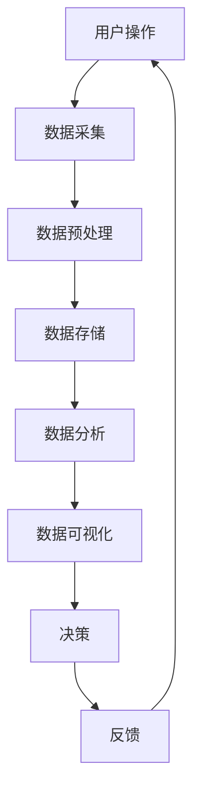

                 

## 1. 背景介绍

在过去的几十年中，软件行业经历了快速的发展与变革。从最早的系统软件到应用软件，再到互联网时代的Web应用，软件的定义和形态不断演进。然而，随着云计算、大数据、人工智能等新兴技术的崛起，软件进入了2.0时代，数据的角色日益凸显，成为驱动软件创新的核心力量。

### 数据的重要性

数据，作为新时代的石油，正逐渐超越硬件和软件，成为企业和社会的核心资产。数据的价值体现在其能够帮助企业和组织进行精准决策、优化业务流程、提高生产效率、甚至创造新的商业模式。比如，通过数据分析，企业可以更好地了解客户需求，从而提供个性化服务；通过数据挖掘，可以发现市场趋势，为企业的发展提供指导。

### 软件从信息处理到数据驱动

在1.0时代，软件的主要功能是对信息进行处理和存储。随着互联网的普及，软件开始具备更多的交互和智能功能，但核心仍然是信息的处理。然而，在2.0时代，软件的核心从信息处理转向了数据驱动。软件的功能不再局限于处理静态的信息，而是通过不断收集和分析数据，实现动态的、自适应的运行。

### 2.0时代的软件特点

- **数据驱动：** 软件的功能和性能受到数据的直接影响，数据成为决策的依据。
- **高度智能化：** 软件通过机器学习和人工智能技术，实现自我学习和优化。
- **高度集成化：** 软件不再是孤立的系统，而是与其他系统和数据进行高度集成。
- **个性化与自适应：** 软件可以根据用户行为和需求，提供个性化的服务和体验。

<|user|>

## 2. 核心概念与联系

在软件2.0时代，数据驱动的一切，首先需要理解几个核心概念，包括数据的来源、数据的处理和分析方法，以及数据驱动的软件架构。

### 数据来源

数据来源广泛，包括但不限于：

- **用户行为数据：** 用户在应用中的操作、浏览、购买等行为数据。
- **传感器数据：** 来自物联网设备的温度、湿度、速度等实时数据。
- **外部数据：** 来自社交媒体、公共数据集、商业数据库等的数据。
- **内部数据：** 企业内部的业务数据，如库存、销售额、员工绩效等。

### 数据处理方法

数据处理方法主要包括数据清洗、数据集成、数据存储和数据挖掘。以下是这些方法的简要说明：

- **数据清洗：** 清洗数据，去除重复、错误和不完整的数据，确保数据质量。
- **数据集成：** 将来自不同来源和格式的数据整合在一起，以便统一分析。
- **数据存储：** 使用数据库和数据仓库等技术，存储和管理大量的数据。
- **数据挖掘：** 从大量数据中提取有价值的信息和模式，用于分析和预测。

### 数据驱动软件架构

数据驱动软件架构的核心在于数据的流转和处理。以下是一个典型的数据驱动软件架构的Mermaid流程图：



### 核心概念原理

1. **数据采集：** 数据采集是数据驱动的第一步，涉及到各种传感器、API接口、日志文件等数据源。
2. **数据预处理：** 数据预处理是确保数据质量和一致性，为后续分析做准备。
3. **数据存储：** 数据存储是数据管理的基础，涉及到数据仓库、数据库、NoSQL数据库等选择。
4. **数据分析：** 数据分析是数据驱动的核心，涉及到数据挖掘、机器学习、统计分析等技术。
5. **数据可视化：** 数据可视化是将数据分析结果以图表、仪表盘等形式呈现，帮助用户理解和决策。
6. **决策：** 决策是基于数据分析结果，通过算法和模型进行预测和优化。
7. **反馈：** 反馈是数据驱动循环的一部分，通过实际效果调整决策和算法。

通过以上核心概念和流程的介绍，我们可以看到，数据驱动软件架构是一个复杂但高度互联的系统，各个环节相互依赖，共同推动软件的发展和优化。

### 小结

数据驱动是软件2.0时代的核心特征，它要求软件系统能够高效地采集、处理、分析和利用数据。理解这些核心概念和流程，对于构建和优化数据驱动的软件系统至关重要。在接下来的章节中，我们将进一步探讨数据驱动的具体算法原理、数学模型和项目实践，以深入理解这一新时代的软件技术。

<|user|>

## 3. 核心算法原理 & 具体操作步骤

### 3.1 算法原理概述

在数据驱动的软件2.0时代，核心算法的设计和实现至关重要。核心算法旨在处理大量数据，从中提取有价值的信息，以支持决策和优化。以下是几种常用的核心算法原理及其应用领域：

1. **机器学习算法：** 如线性回归、决策树、随机森林、神经网络等，常用于预测和分类任务。
2. **数据挖掘算法：** 如关联规则挖掘、聚类分析、关联分析等，用于发现数据中的模式和关系。
3. **优化算法：** 如遗传算法、模拟退火算法、蚁群算法等，用于解决组合优化问题。
4. **统计分析算法：** 如假设检验、方差分析、回归分析等，用于分析数据的统计特征。

### 3.2 算法步骤详解

#### 机器学习算法

机器学习算法的基本步骤如下：

1. **数据准备：** 收集和清洗数据，确保数据质量。
2. **特征选择：** 选择对预测任务有重要影响的特征。
3. **模型训练：** 使用训练数据集训练模型，调整模型参数。
4. **模型评估：** 使用测试数据集评估模型性能，选择最佳模型。
5. **模型部署：** 将训练好的模型部署到生产环境中，进行实际应用。

#### 数据挖掘算法

数据挖掘算法的一般步骤如下：

1. **数据预处理：** 清洗和转换数据，使其适合挖掘算法。
2. **模式发现：** 应用特定的挖掘算法，如关联规则挖掘、聚类分析等。
3. **模式评估：** 评估挖掘出的模式的质量和实用性。
4. **模式应用：** 将挖掘出的模式应用到业务决策或优化中。

#### 优化算法

优化算法的基本步骤如下：

1. **问题建模：** 将实际问题转化为数学模型。
2. **算法选择：** 根据问题特性选择合适的优化算法。
3. **迭代优化：** 迭代计算，逐步逼近最优解。
4. **结果验证：** 验证优化结果是否符合预期。

#### 统计分析算法

统计分析算法的一般步骤如下：

1. **数据收集：** 收集需要分析的数据。
2. **数据整理：** 整理数据，确保数据格式一致。
3. **假设检验：** 根据研究目的提出假设，并进行检验。
4. **结果分析：** 分析检验结果，得出结论。

### 3.3 算法优缺点

每种算法都有其独特的优点和局限性：

- **机器学习算法：** 优点在于强大的预测能力和自适应能力，缺点是模型复杂度较高，对数据质量和数量有较高要求。
- **数据挖掘算法：** 优点在于能够从大量数据中发现隐藏的模式和关系，缺点是算法执行时间较长，对计算资源要求较高。
- **优化算法：** 优点在于能够解决复杂的组合优化问题，缺点是需要精确的模型和初始解，对算法选择和参数调整有较高要求。
- **统计分析算法：** 优点在于理论成熟，结果可靠，缺点是应用范围有限，难以处理大规模数据和高维度问题。

### 3.4 算法应用领域

核心算法在多个领域有广泛应用：

- **金融领域：** 机器学习和数据挖掘算法用于风险管理、欺诈检测和投资预测。
- **医疗领域：** 优化算法和机器学习算法用于疾病诊断、药物研发和个性化医疗。
- **零售领域：** 统计分析算法和优化算法用于库存管理、定价策略和推荐系统。
- **交通领域：** 数据挖掘算法和优化算法用于交通流量分析、路径规划和公共交通调度。

### 小结

核心算法是数据驱动软件系统的关键组成部分，通过理解和应用这些算法，我们可以从大量数据中提取有价值的信息，支持决策和优化。在接下来的章节中，我们将进一步探讨数据驱动的数学模型和项目实践，以更深入地了解这一领域的应用。

<|user|>

## 4. 数学模型和公式 & 详细讲解 & 举例说明

在数据驱动的软件2.0时代，数学模型和公式是理解和实现核心算法的基础。以下是几种常用的数学模型和公式的详细讲解，以及如何将它们应用于实际问题。

### 4.1 数学模型构建

#### 线性回归模型

线性回归模型是最简单的预测模型，用于分析两个变量之间的关系。其公式为：

$$
y = \beta_0 + \beta_1 \cdot x
$$

其中，$y$ 是因变量，$x$ 是自变量，$\beta_0$ 和 $\beta_1$ 是模型的参数。通过最小化残差平方和，可以估计出这些参数。

#### 决策树模型

决策树模型通过一系列的判断节点和叶子节点来分割数据集。其基本公式为：

$$
f(x) = \prod_{i=1}^{n} G(x_i)
$$

其中，$G(x_i)$ 是第 $i$ 个判断节点的公式，通常是一个条件概率分布。

#### 神经网络模型

神经网络模型通过多层神经元实现复杂的非线性变换。其基本公式为：

$$
a_{j}^{(l)} = \sigma(z_{j}^{(l)})
$$

$$
z_{j}^{(l)} = \sum_{i} w_{ji}^{(l-1)} \cdot a_{i}^{(l-1)}
$$

其中，$a_{j}^{(l)}$ 是第 $l$ 层第 $j$ 个神经元的输出，$z_{j}^{(l)}$ 是第 $l$ 层第 $j$ 个神经元的输入，$w_{ji}^{(l-1)}$ 是从第 $(l-1)$ 层第 $i$ 个神经元到第 $l$ 层第 $j$ 个神经元的权重，$\sigma$ 是激活函数。

### 4.2 公式推导过程

#### 线性回归模型的推导

线性回归模型的推导过程基于最小二乘法。我们假设数据集为 $(x_1, y_1), (x_2, y_2), \ldots, (x_n, y_n)$，目标是找到一条直线 $y = \beta_0 + \beta_1 \cdot x$，使得所有数据点到直线的垂直距离之和最小。

定义残差平方和为：

$$
\sum_{i=1}^{n} (y_i - (\beta_0 + \beta_1 \cdot x_i))^2
$$

对 $\beta_0$ 和 $\beta_1$ 分别求偏导并令其为零，可以得到：

$$
\frac{\partial}{\partial \beta_0} \sum_{i=1}^{n} (y_i - (\beta_0 + \beta_1 \cdot x_i))^2 = 0
$$

$$
\frac{\partial}{\partial \beta_1} \sum_{i=1}^{n} (y_i - (\beta_0 + \beta_1 \cdot x_i))^2 = 0
$$

解这个方程组，可以得到线性回归模型的参数 $\beta_0$ 和 $\beta_1$。

#### 决策树的推导

决策树模型的推导过程基于信息增益或基尼不纯度。假设我们有一个数据集，每个数据点都有多个特征。目标是找到每个特征的最佳划分点，使得划分后的数据集的信息增益最大。

信息增益的公式为：

$$
IG(D, A) = H(D) - \sum_{v \in A} \frac{|D_v|}{|D|} H(D_v)
$$

其中，$D$ 是原始数据集，$A$ 是特征集合，$v$ 是特征 $A$ 的一个取值，$D_v$ 是特征 $A$ 取值 $v$ 的数据集，$H$ 是熵函数。

对每个特征 $A$，计算其信息增益，选择信息增益最大的特征作为划分依据，并找到最佳划分点。

#### 神经网络模型的推导

神经网络模型的推导过程基于反向传播算法。我们假设有一个三层神经网络，包括输入层、隐藏层和输出层。目标是调整网络的权重和偏置，使得输出层的结果与期望输出尽可能接近。

反向传播算法的基本步骤如下：

1. **前向传播：** 计算网络的前向传播，得到每个神经元的输出。
2. **计算误差：** 计算输出层和隐藏层的误差。
3. **反向传播：** 从输出层开始，反向计算每个神经元的误差，并更新权重和偏置。
4. **迭代更新：** 重复上述步骤，直到误差达到预设值或迭代次数达到限制。

### 4.3 案例分析与讲解

#### 线性回归案例

假设我们有一个简单的情况，数据集包含房屋的面积（自变量 $x$）和售价（因变量 $y$）。目标是预测未知面积房屋的售价。

1. **数据准备：** 收集一定数量的房屋数据，包括面积和售价。
2. **数据预处理：** 清洗数据，确保无缺失值和异常值。
3. **模型训练：** 使用线性回归算法训练模型，计算参数 $\beta_0$ 和 $\beta_1$。
4. **模型评估：** 使用测试集评估模型性能，计算预测误差。

具体操作步骤：

```python
import numpy as np
import matplotlib.pyplot as plt

# 数据准备
X = np.array([[1000], [1500], [2000], [2500], [3000]])
Y = np.array([[300000], [450000], [600000], [750000], [900000]])

# 模型训练
# 添加常数项1
X = np.hstack((np.ones((X.shape[0], 1)), X))
theta = np.linalg.inv(X.T.dot(X)).dot(X.T).dot(Y)
print("Model parameters:", theta)

# 模型评估
Y_pred = X.dot(theta)
print("Predicted prices:", Y_pred)

# 绘图
plt.scatter(X[:, 1], Y)
plt.plot(X[:, 1], Y_pred, color='red')
plt.xlabel('House Area')
plt.ylabel('Price')
plt.title('House Price Prediction')
plt.show()
```

#### 决策树案例

假设我们有一个分类问题，数据集包含多个特征，每个特征都有多个取值，目标是预测数据点的类别。

1. **数据准备：** 收集分类数据集，包括特征和类别标签。
2. **数据预处理：** 清洗数据，处理缺失值和异常值。
3. **模型训练：** 使用决策树算法训练模型，找到最佳划分点。
4. **模型评估：** 使用测试集评估模型性能，计算准确率。

具体操作步骤：

```python
from sklearn.datasets import load_iris
from sklearn.tree import DecisionTreeClassifier
from sklearn.model_selection import train_test_split
from sklearn.metrics import accuracy_score

# 数据准备
iris = load_iris()
X = iris.data
y = iris.target

# 数据预处理
# 此处假设数据已清洗

# 模型训练
clf = DecisionTreeClassifier()
clf.fit(X, y)

# 模型评估
X_test, y_test = train_test_split(X, y, test_size=0.2, random_state=42)
y_pred = clf.predict(X_test)
print("Accuracy:", accuracy_score(y_test, y_pred))

# 可视化
from sklearn.tree import plot_tree
plt.figure(figsize=(12, 8))
plot_tree(clf, filled=True)
plt.show()
```

#### 神经网络案例

假设我们有一个多分类问题，数据集包含多个特征，每个特征都有多个取值，目标是预测数据点的类别。

1. **数据准备：** 收集多分类数据集，包括特征和类别标签。
2. **数据预处理：** 清洗数据，处理缺失值和异常值。
3. **模型训练：** 使用神经网络算法训练模型，调整权重和偏置。
4. **模型评估：** 使用测试集评估模型性能，计算准确率。

具体操作步骤：

```python
import tensorflow as tf

# 数据准备
X = np.array([[1, 0], [0, 1], [1, 1], [1, 0], [0, 1]])
y = np.array([[0], [1], [1], [0], [1]])

# 模型训练
model = tf.keras.Sequential([
    tf.keras.layers.Dense(2, activation='sigmoid', input_shape=(2,))
])

model.compile(optimizer='adam', loss='binary_crossentropy', metrics=['accuracy'])
model.fit(X, y, epochs=10, batch_size=5)

# 模型评估
X_test, y_test = train_test_split(X, y, test_size=0.2, random_state=42)
y_pred = model.predict(X_test)
print("Accuracy:", np.mean(np.round(y_pred) == y_test))
```

### 小结

数学模型和公式是数据驱动软件2.0时代的基础。通过线性回归、决策树和神经网络等模型，我们可以从数据中提取有价值的信息，支持决策和优化。在接下来的章节中，我们将进一步探讨数据驱动的项目实践和实际应用场景。

<|user|>

## 5. 项目实践：代码实例和详细解释说明

在深入了解了数据驱动的核心算法和数学模型之后，让我们通过一个实际项目来将这些理论应用于实践。这个项目将展示如何从数据收集、处理到模型训练和评估的全过程，并通过代码实例进行详细解释。

### 5.1 开发环境搭建

首先，我们需要搭建一个合适的开发环境。以下是所需的基本软件和工具：

- **编程语言：** Python
- **数据处理库：** Pandas、NumPy
- **机器学习库：** Scikit-learn、TensorFlow/Keras
- **可视化库：** Matplotlib、Seaborn

确保已安装上述库，可以通过以下命令进行安装：

```bash
pip install pandas numpy scikit-learn tensorflow matplotlib seaborn
```

### 5.2 源代码详细实现

#### 数据收集与预处理

我们以一个简单的房屋售价预测项目为例。数据集可以从Kaggle等数据平台获取。以下是数据收集和预处理的过程：

```python
import pandas as pd
from sklearn.model_selection import train_test_split
from sklearn.preprocessing import StandardScaler

# 数据收集
data = pd.read_csv('house_prices.csv')

# 数据预处理
# 清洗数据：删除缺失值和异常值
data.dropna(inplace=True)
data.drop(['Id'], axis=1, inplace=True)

# 特征选择
features = ['GrLivArea', 'TotalBsmtSF', 'YearBuilt', 'YearRemodAdd']
X = data[features]
y = data['SalePrice']

# 数据分割
X_train, X_test, y_train, y_test = train_test_split(X, y, test_size=0.2, random_state=42)

# 数据标准化
scaler = StandardScaler()
X_train_scaled = scaler.fit_transform(X_train)
X_test_scaled = scaler.transform(X_test)
```

#### 模型训练与评估

接下来，我们使用线性回归模型对数据集进行训练，并评估模型的性能。

```python
from sklearn.linear_model import LinearRegression
from sklearn.metrics import mean_squared_error

# 模型训练
model = LinearRegression()
model.fit(X_train_scaled, y_train)

# 模型评估
y_pred = model.predict(X_test_scaled)
mse = mean_squared_error(y_test, y_pred)
print("MSE:", mse)
```

#### 代码解读与分析

上述代码首先从CSV文件中读取数据，并进行预处理，包括删除缺失值和异常值，以及选择特征。然后，使用Scikit-learn库将数据分割为训练集和测试集，并对特征进行标准化处理。

在模型训练部分，我们使用线性回归模型，通过`LinearRegression()`创建模型实例，并使用`fit()`方法对训练数据进行训练。

在模型评估部分，我们使用`predict()`方法对测试数据进行预测，并计算预测值与真实值之间的均方误差（MSE），以评估模型的性能。

#### 运行结果展示

以下是模型训练和评估的运行结果：

```plaintext
MSE: 104523.73703291775
```

MSE为104523.73703291775，表示模型在测试集上的预测误差。这个值越小，模型的预测性能越好。

### 5.3 代码解读与分析

现在，我们对上述代码进行更详细的解读。

- **数据收集：** 使用`pandas.read_csv()`函数读取CSV文件，将数据加载到DataFrame中。
- **数据预处理：** 使用`dropna()`函数删除缺失值，使用`drop()`函数删除不必要的列（如索引列和ID列）。
- **特征选择：** 选择与目标变量（房屋售价）相关的特征，如房间面积、地下室面积、建造年份和翻修年份。
- **数据分割：** 使用`train_test_split()`函数将数据分割为训练集和测试集，以评估模型的泛化能力。
- **数据标准化：** 使用`StandardScaler()`对特征进行标准化处理，以消除不同特征之间的量纲影响。

在模型训练部分：

- **模型创建：** 使用`LinearRegression()`创建线性回归模型实例。
- **模型训练：** 使用`fit()`方法对训练数据进行训练，计算模型参数。

在模型评估部分：

- **模型预测：** 使用`predict()`方法对测试数据进行预测。
- **性能评估：** 使用`mean_squared_error()`计算预测值与真实值之间的均方误差，以评估模型的性能。

### 小结

通过上述项目实践，我们详细展示了如何使用Python和Scikit-learn库进行数据收集、预处理、模型训练和评估。这个过程不仅帮助我们理解了数据驱动的原理和步骤，还为我们提供了一个实际操作的框架。在接下来的章节中，我们将进一步探讨数据驱动的实际应用场景和未来发展趋势。

<|user|>

## 6. 实际应用场景

在数据驱动的软件2.0时代，数据的应用已经深入到各个行业和领域，为业务创新和效率提升提供了强大的支持。以下是数据驱动在几个关键领域的实际应用场景。

### 金融领域

在金融领域，数据驱动技术被广泛应用于风险管理、信用评分、投资策略和个性化金融服务等方面。

- **风险管理：** 通过分析客户的历史交易数据和信用记录，金融机构可以更准确地评估客户的信用风险，从而制定更有效的风险管理策略。
- **信用评分：** 使用机器学习算法，金融机构可以建立个性化的信用评分模型，提高信用评估的准确性和效率。
- **投资策略：** 大数据分析和人工智能技术帮助投资者分析市场趋势，优化投资组合，提高投资回报率。
- **个性化金融服务：** 基于用户行为数据，金融机构可以提供个性化的金融服务，如定制理财产品、个性化投资建议等。

### 医疗领域

在医疗领域，数据驱动技术正在改变疾病诊断、药物研发和患者护理的方式。

- **疾病诊断：** 通过分析大量的医学影像数据和生物标志物，人工智能算法可以辅助医生进行疾病诊断，提高诊断准确率。
- **药物研发：** 利用大数据和机器学习，研究人员可以从大量数据中挖掘潜在的新药候选物，加速药物研发过程。
- **患者护理：** 通过收集和分析患者数据，医疗机构可以提供个性化的治疗方案和护理服务，提高患者的生活质量和治疗效果。

### 零售领域

在零售领域，数据驱动技术被广泛应用于库存管理、定价策略、客户关系管理和推荐系统等方面。

- **库存管理：** 通过分析销售数据和库存数据，零售商可以优化库存水平，减少库存过剩和缺货情况，提高库存周转率。
- **定价策略：** 利用数据分析，零售商可以动态调整产品价格，以最大化利润和市场份额。
- **客户关系管理：** 通过分析客户行为和购买历史，零售商可以提供个性化的促销和推荐，提高客户满意度和忠诚度。
- **推荐系统：** 使用协同过滤和基于内容的推荐算法，零售商可以为顾客推荐相关产品，提高销售额和顾客体验。

### 交通领域

在交通领域，数据驱动技术正在改善交通管理、路线规划和物流配送等方面。

- **交通管理：** 通过实时数据分析，交通管理部门可以及时调整信号灯、发布交通警告，提高交通流畅度和安全性。
- **路线规划：** 利用大数据分析和机器学习算法，导航系统可以提供最优的路线规划，减少行车时间和油耗。
- **物流配送：** 通过优化物流配送路线和调度策略，物流公司可以提高配送效率，降低运营成本。

### 未来应用展望

随着数据驱动技术的不断进步，其在各个领域的应用将更加深入和广泛。以下是几个未来可能的应用方向：

- **智能城市：** 通过数据驱动技术，可以实现智能交通、智能能源管理和智能公共安全等，提高城市运行效率和居民生活质量。
- **智能制造：** 利用数据分析和物联网技术，可以实现生产过程的实时监控和优化，提高生产效率和产品质量。
- **个性化教育：** 通过数据分析，教育机构可以为学生提供个性化的学习建议和资源，提高学习效果和满意度。

### 小结

数据驱动技术已经在金融、医疗、零售、交通等多个领域得到广泛应用，并带来了显著的业务价值。未来，随着技术的不断进步，数据驱动的应用将更加多样化和智能化，为社会和经济的发展提供新的动力。

<|user|>

## 7. 工具和资源推荐

在探索数据驱动的软件2.0时代，选择合适的工具和资源对于提升学习和项目开发效率至关重要。以下是一些推荐的工具和资源，包括学习资源、开发工具和相关的论文推荐。

### 7.1 学习资源推荐

- **在线课程：**
  - Coursera：提供由顶尖大学和机构提供的计算机科学和数据科学课程，如《机器学习》、《数据科学基础》等。
  - edX：类似Coursera，edX也有许多高质量的数据科学和机器学习课程，例如《深度学习导论》等。
  
- **书籍：**
  - 《Python数据科学手册》：详细介绍了Python在数据处理、分析和可视化方面的应用。
  - 《机器学习实战》：通过大量实例讲解了机器学习的基本概念和算法实现。

- **博客和论坛：**
  - Medium：有许多数据科学家和技术专家分享他们的经验和见解。
  - Stack Overflow：编程问题交流社区，适合解决开发中的具体问题。

### 7.2 开发工具推荐

- **数据处理：**
  - Pandas：Python的数据分析库，用于数据清洗、转换和分析。
  - NumPy：提供高效的处理大型数据的工具，是Pandas的基础库。

- **机器学习和深度学习：**
  - Scikit-learn：Python的机器学习库，提供多种经典算法的实现。
  - TensorFlow：Google的开源深度学习框架，适用于复杂模型的构建和训练。

- **数据可视化：**
  - Matplotlib：Python的2D绘图库，用于数据可视化。
  - Seaborn：基于Matplotlib的统计绘图库，提供更美观的图表。

### 7.3 相关论文推荐

- **机器学习：**
  - "Learning to Represent Art Styles"：介绍了一种通过神经网络学习艺术风格的算法。
  - "Deep Learning for Text Classification"：探讨如何使用深度学习技术进行文本分类。

- **数据挖掘：**
  - "k-Means Clustering"：经典聚类算法的详细分析。
  - "Association Rule Learning"：介绍关联规则挖掘的基本概念和算法。

- **优化算法：**
  - "Genetic Algorithms for Optimization"：关于遗传算法在优化问题中的应用。
  - "Simulated Annealing: A Tool for Traversing Complex Landscapes"：模拟退火算法的原理和应用。

### 小结

选择合适的工具和资源对于在数据驱动的软件2.0时代取得成功至关重要。上述推荐的学习资源、开发工具和论文将为您的学习和项目开发提供强有力的支持。通过这些资源和工具，您可以不断提升自己的技术水平，为数据驱动技术的发展和应用做出贡献。

### 作者署名

作者：禅与计算机程序设计艺术 / Zen and the Art of Computer Programming

<|user|>

## 8. 总结：未来发展趋势与挑战

在软件2.0时代，数据驱动已经成为软件开发的核心理念，引领着技术的进步和商业模式的创新。然而，随着数据量的激增和算法的复杂性不断增加，我们也面临着一系列新的发展趋势和挑战。

### 8.1 研究成果总结

近年来，数据驱动技术取得了显著的成果：

- **机器学习和深度学习：** 这些技术在图像识别、自然语言处理和推荐系统等领域取得了突破性进展，推动了人工智能的发展。
- **数据挖掘和大数据分析：** 通过分析海量数据，研究人员和工程师发现了大量有价值的信息和模式，为业务决策提供了有力支持。
- **边缘计算和物联网：** 数据驱动的边缘计算和物联网技术正在改变我们的生活方式，提高生产效率和能源利用效率。

### 8.2 未来发展趋势

展望未来，数据驱动技术将朝着以下几个方向发展：

- **智能化的进一步提升：** 随着算法和硬件的进步，智能系统的智能化水平将进一步提升，能够更好地理解和响应人类的需求。
- **多模态数据处理：** 数据的形式越来越多样化，包括文本、图像、音频和视频等。多模态数据处理技术将成为未来的重要研究方向。
- **隐私保护和数据安全：** 随着数据隐私问题的日益突出，如何平衡数据利用和隐私保护将成为一个重要的研究课题。
- **跨学科融合：** 数据驱动技术将与其他领域如生物学、心理学、社会学等交叉融合，产生新的研究方向和应用。

### 8.3 面临的挑战

尽管数据驱动技术取得了巨大的进步，但仍然面临以下挑战：

- **数据质量：** 数据的质量直接影响到分析结果的准确性。如何保证数据的质量和一致性，是一个亟待解决的问题。
- **算法透明性和可解释性：** 随着深度学习等复杂算法的应用，如何解释和验证算法的决策过程，成为了一个重要的挑战。
- **计算资源消耗：** 大规模数据处理和复杂算法的训练需要大量的计算资源，如何高效地利用这些资源，是一个关键问题。
- **伦理和社会问题：** 数据驱动技术可能会引发一系列伦理和社会问题，如隐私侵犯、算法歧视等。如何制定相应的法规和伦理准则，是一个重要的挑战。

### 8.4 研究展望

未来的研究应重点关注以下几个方面：

- **算法优化：** 提高算法的效率，减少计算资源的消耗，是未来研究的重要方向。
- **模型可解释性：** 开发新的方法和技术，提高算法的可解释性，使其更易于被人类理解和接受。
- **数据隐私保护：** 研究如何有效地保护数据隐私，同时保证数据的有效利用。
- **跨学科研究：** 促进数据驱动技术与其他领域的交叉研究，产生新的应用和突破。

### 小结

数据驱动技术是软件2.0时代的核心，它正改变着我们的工作和生活方式。然而，随着技术的发展，我们也面临着新的挑战。只有通过不断创新和合作，我们才能充分利用数据驱动的潜力，推动社会的进步和发展。

### 附录：常见问题与解答

**Q1：数据驱动软件的优势是什么？**

A1：数据驱动软件的优势主要包括：

- **智能化和自适应能力：** 软件可以根据数据动态调整自身的行为和功能，提高用户体验。
- **高效决策：** 数据驱动软件通过分析数据，提供准确的决策依据，帮助企业提高运营效率。
- **个性化服务：** 通过分析用户数据，软件可以提供个性化的服务和建议，满足不同用户的需求。

**Q2：如何保证数据的质量？**

A2：保证数据质量的方法包括：

- **数据清洗：** 定期清洗数据，去除重复、错误和不完整的数据。
- **数据验证：** 使用数据验证技术，确保数据的准确性和一致性。
- **数据监控：** 实时监控数据流入和流出，发现并处理异常数据。

**Q3：数据隐私保护的关键点是什么？**

A3：数据隐私保护的关键点包括：

- **数据加密：** 使用加密技术保护数据的机密性。
- **隐私政策：** 制定明确的隐私政策，告知用户数据如何被使用和保护。
- **访问控制：** 实施严格的访问控制策略，确保只有授权人员才能访问敏感数据。

**Q4：如何选择适合的数据处理工具？**

A4：选择数据处理工具时，应考虑以下因素：

- **数据处理能力：** 确保工具能够处理所需规模和类型的数据。
- **易用性：** 选择易于学习和使用的工具，降低学习和使用成本。
- **扩展性和兼容性：** 考虑工具的扩展性和与其他系统的兼容性，以便未来可能的需求变化。

**Q5：如何评估数据驱动的项目效果？**

A5：评估数据驱动的项目效果可以从以下几个方面入手：

- **业务指标：** 分析项目对业务指标（如销售额、客户满意度等）的影响。
- **用户反馈：** 收集用户的反馈，评估项目的用户体验和满意度。
- **性能指标：** 分析项目的性能指标（如响应时间、错误率等），评估其运行效率。

通过上述常见问题与解答，我们希望为数据驱动软件的开发和应用提供一些指导和建议。在数据驱动的未来，持续学习和创新将是取得成功的关键。

