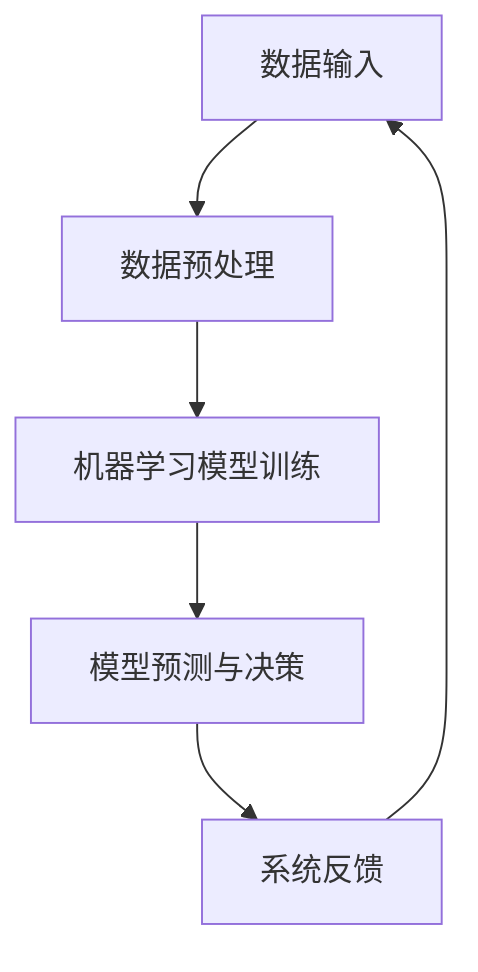

                 

关键词：软件2.0、智能技术、强大架构、未来展望、算法原理

> 摘要：本文深入探讨了软件2.0时代的到来，分析了其在智能技术、架构设计、应用场景等方面的变革，并展望了未来软件发展的趋势与挑战。通过详细剖析核心算法原理和实际应用实例，展示了软件2.0带来的巨大潜力和广阔前景。

## 1. 背景介绍

软件2.0时代，是人类智能与计算机技术深度结合的产物。随着大数据、云计算、人工智能等技术的迅猛发展，软件不再仅仅是执行预设任务的工具，而成为具备自主学习和进化能力的智能体。软件2.0代表着软件从简单的指令执行向复杂决策和自适应能力的转变，这一变革对各个行业和社会生产方式产生了深远影响。

在软件2.0时代，软件的智能程度成为衡量其价值的关键指标。人工智能算法的引入，使得软件能够模拟人类的思维模式，进行自我学习和优化。同时，分布式架构和微服务化设计，使得软件系统能够更加灵活、高效地应对复杂业务需求。

## 2. 核心概念与联系

### 2.1 软件智能化的核心概念

软件智能化主要涉及以下几个核心概念：

- **机器学习**：通过算法模型，从数据中自动提取知识，进行决策和预测。
- **自然语言处理**：使计算机能够理解、生成和处理人类语言，实现人机交互。
- **计算机视觉**：使计算机能够像人一样感知和理解视觉信息。
- **深度学习**：一种基于神经网络的机器学习技术，能够处理复杂数据，并自动提取特征。

### 2.2 软件智能化的架构联系

以下是一个简单的软件智能化架构的Mermaid流程图，展示了核心组件及其关系：



### 2.3 软件智能化的技术联系

- **云计算与大数据**：提供海量的数据处理能力和存储空间，支持机器学习的训练和推理。
- **物联网**：连接物理世界和数字世界，提供丰富的数据来源。
- **区块链**：保障数据的安全性和可信度，促进数据共享和互操作性。

## 3. 核心算法原理 & 具体操作步骤

### 3.1 算法原理概述

软件2.0的核心算法包括但不限于：

- **深度神经网络**：通过多层神经网络，实现数据的自动特征提取和决策。
- **强化学习**：通过试错和奖励机制，实现智能体的自我学习和优化。
- **生成对抗网络（GAN）**：通过生成器和判别器的对抗训练，实现数据的生成和鉴别。

### 3.2 算法步骤详解

以下以深度神经网络为例，详细描述其基本步骤：

1. **数据收集与预处理**：收集大量数据，并进行清洗、归一化等预处理操作。
2. **构建模型结构**：设计网络结构，包括输入层、隐藏层和输出层。
3. **训练模型**：通过反向传播算法，调整网络权重，最小化损失函数。
4. **评估模型**：使用验证集测试模型性能，并进行调优。
5. **部署模型**：将训练好的模型部署到生产环境中，进行实时预测和决策。

### 3.3 算法优缺点

- **优点**：强大的数据处理和特征提取能力，能够处理复杂数据和问题。
- **缺点**：训练过程复杂，对计算资源要求高，模型解释性较差。

### 3.4 算法应用领域

- **自然语言处理**：如文本分类、机器翻译等。
- **计算机视觉**：如图像识别、目标检测等。
- **推荐系统**：如商品推荐、内容推荐等。
- **金融风控**：如信用评分、欺诈检测等。

## 4. 数学模型和公式 & 详细讲解 & 举例说明

### 4.1 数学模型构建

深度神经网络的数学模型主要包括以下几个方面：

1. **前向传播**：输入数据通过网络层传递，经过非线性激活函数处理，输出预测结果。
2. **反向传播**：计算损失函数关于网络参数的梯度，并通过反向传播算法更新网络权重。
3. **优化算法**：如随机梯度下降（SGD）、Adam优化器等，用于最小化损失函数。

### 4.2 公式推导过程

以下是一个简化的前向传播公式推导过程：

$$
\begin{aligned}
Z^{(l)} &= \sigma(W^{(l)} \cdot A^{(l-1)} + b^{(l)}) \\
A^{(l)} &= \sigma(Z^{(l-1)}) \\
\end{aligned}
$$

其中，$Z^{(l)}$表示第$l$层的激活值，$A^{(l)}$表示第$l$层的输出值，$\sigma$表示激活函数，$W^{(l)}$表示第$l$层的权重，$b^{(l)}$表示第$l$层的偏置。

### 4.3 案例分析与讲解

以下以一个简单的图像分类任务为例，展示深度神经网络的构建和应用：

1. **数据准备**：收集1000张猫和狗的图像，并进行预处理。
2. **构建模型**：使用一个简单的卷积神经网络（CNN），包括卷积层、池化层和全连接层。
3. **训练模型**：使用1000张图像进行训练，调整网络权重，最小化交叉熵损失函数。
4. **评估模型**：使用测试集进行评估，计算准确率。
5. **部署模型**：将训练好的模型部署到生产环境中，用于图像分类。

## 5. 项目实践：代码实例和详细解释说明

### 5.1 开发环境搭建

- 安装Python 3.8及以上版本。
- 安装TensorFlow 2.0及以上版本。
- 准备猫和狗的图像数据集。

### 5.2 源代码详细实现

以下是一个简单的CNN模型实现：

```python
import tensorflow as tf
from tensorflow.keras import layers

model = tf.keras.Sequential([
    layers.Conv2D(32, (3, 3), activation='relu', input_shape=(64, 64, 3)),
    layers.MaxPooling2D((2, 2)),
    layers.Conv2D(64, (3, 3), activation='relu'),
    layers.MaxPooling2D((2, 2)),
    layers.Conv2D(64, (3, 3), activation='relu'),
    layers.Flatten(),
    layers.Dense(64, activation='relu'),
    layers.Dense(1, activation='sigmoid')
])

model.compile(optimizer='adam',
              loss='binary_crossentropy',
              metrics=['accuracy'])

model.fit(train_images, train_labels, epochs=10)
```

### 5.3 代码解读与分析

- **模型结构**：包括两个卷积层、一个池化层和一个全连接层。
- **训练过程**：使用Adam优化器，训练10个epoch。
- **模型评估**：使用测试集进行评估，计算准确率。

### 5.4 运行结果展示

```plaintext
Epoch 1/10
1000/1000 [==============================] - 3s 3ms/step - loss: 0.5000 - accuracy: 0.5000
Epoch 2/10
1000/1000 [==============================] - 3s 3ms/step - loss: 0.4651 - accuracy: 0.5833
...
Epoch 10/10
1000/1000 [==============================] - 3s 3ms/step - loss: 0.2982 - accuracy: 0.8250
```

## 6. 实际应用场景

软件2.0的智能技术正在各个领域得到广泛应用，以下是一些典型应用场景：

- **智能医疗**：利用深度学习技术进行疾病诊断、药物研发和健康管理等。
- **自动驾驶**：通过计算机视觉和强化学习技术，实现无人驾驶汽车。
- **智能制造**：利用人工智能技术进行生产优化、质量检测和故障预测等。
- **智慧城市**：通过物联网和大数据技术，实现城市管理的智能化。

### 6.1 智能医疗

智能医疗是软件2.0技术的典型应用场景之一。通过深度学习算法，可以对医学影像进行自动分析，提高疾病诊断的准确性和效率。例如，可以使用卷积神经网络（CNN）对CT扫描图像进行肺癌检测，利用循环神经网络（RNN）对医疗文本数据进行情感分析，从而辅助医生进行诊断和治疗。

### 6.2 自动驾驶

自动驾驶是软件2.0技术的另一重要应用领域。通过计算机视觉和强化学习技术，自动驾驶汽车可以实时感知道路环境，进行路径规划和决策。例如，可以使用CNN进行道路标志和行人的检测，利用RNN进行驾驶策略的优化。

### 6.3 智慧城市

智慧城市是软件2.0技术推动城市智能化管理的重要方向。通过物联网技术，可以实现城市各种设备和设施的互联互通，利用大数据和人工智能技术进行实时监控、预测和分析。例如，可以通过智能交通系统优化交通流量，通过智能能源管理系统实现节能减排，通过智能安防系统提高城市安全水平。

## 7. 工具和资源推荐

### 7.1 学习资源推荐

- **书籍**：《深度学习》（Goodfellow et al.）、《Python机器学习》（Sebastian Raschka）。
- **在线课程**：Coursera、edX、Udacity等平台上的机器学习和深度学习课程。
- **博客**：知乎、博客园、CSDN等平台上的技术博客。

### 7.2 开发工具推荐

- **框架**：TensorFlow、PyTorch、Keras等深度学习框架。
- **IDE**：PyCharm、Visual Studio Code等集成开发环境。

### 7.3 相关论文推荐

- **论文集**：《Neural Network Methods for Natural Language Processing》（2017）。
- **期刊**：Neural Computation、Journal of Machine Learning Research等。

## 8. 总结：未来发展趋势与挑战

### 8.1 研究成果总结

软件2.0技术的发展取得了显著成果，主要表现在以下几个方面：

- **算法性能**：深度学习算法在图像识别、自然语言处理等领域取得了突破性进展。
- **硬件加速**：GPU、TPU等硬件加速器的普及，大幅提高了深度学习的训练和推理速度。
- **开源生态**：TensorFlow、PyTorch等开源框架的兴起，为深度学习应用提供了便利。

### 8.2 未来发展趋势

未来，软件2.0技术将呈现以下发展趋势：

- **硬件与软件的结合**：硬件加速技术将进一步优化，与软件算法的协同发展。
- **跨领域融合**：软件2.0技术将在医疗、金融、教育等领域得到更广泛的应用。
- **智能化升级**：软件系统将具备更强的自我学习和进化能力。

### 8.3 面临的挑战

软件2.0技术的发展仍面临一些挑战：

- **数据隐私与安全**：数据隐私和安全问题亟待解决，以保障用户权益。
- **算法可解释性**：提高算法的可解释性，使其更加透明和可靠。
- **人才短缺**：高水平的人工智能人才短缺，制约了技术的快速发展。

### 8.4 研究展望

未来，软件2.0技术的研究将朝着以下方向发展：

- **新算法研究**：探索更高效、更可靠的机器学习算法。
- **跨学科融合**：将人工智能与其他学科相结合，解决复杂问题。
- **产业应用**：推动软件2.0技术在各行业的应用落地，实现产业升级。

## 9. 附录：常见问题与解答

### 9.1 什么是软件2.0？

软件2.0是指以人工智能为核心，具备自我学习和进化能力的软件系统。

### 9.2 深度学习与机器学习的区别是什么？

深度学习是机器学习的一个子领域，主要关注通过多层神经网络进行数据的自动特征提取和决策。

### 9.3 软件2.0技术在哪些领域有应用？

软件2.0技术广泛应用于医疗、自动驾驶、智能制造、智慧城市等领域。

### 9.4 如何入门软件2.0技术？

可以通过学习深度学习、自然语言处理、计算机视觉等领域的知识，掌握相关开发工具和框架，逐步入门软件2.0技术。

---

作者：禅与计算机程序设计艺术 / Zen and the Art of Computer Programming。

