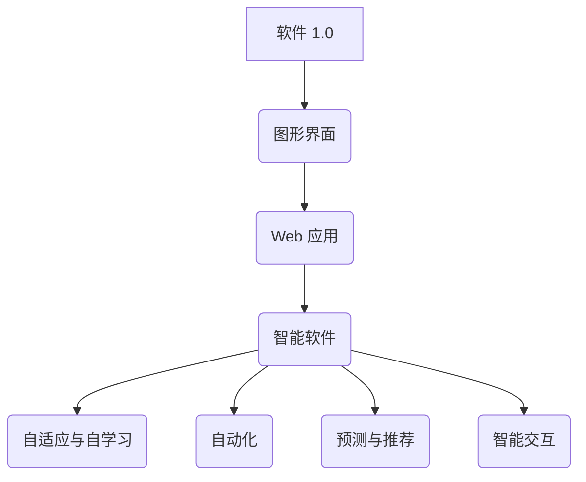

                 

关键词：软件 2.0、智能、强大、未来展望、技术趋势、架构设计

> 摘要：本文深入探讨了软件 2.0 的未来发展趋势，探讨了智能技术与软件设计的深度融合，分析了软件 2.0 的核心概念与架构，并通过实例和数学模型展示了其具体应用和实践。文章旨在为读者提供一个全面、清晰的认识，帮助理解软件 2.0 的重要性和潜力。

## 1. 背景介绍

随着信息技术的飞速发展，软件行业正经历着一场深刻的变革。从传统的软件 1.0 到现在的软件 2.0，这一转变不仅体现在技术的进步，更体现在应用场景的多样性和用户体验的提升。软件 2.0，也被称作智能软件，它的核心特征在于将人工智能（AI）与软件设计深度结合，实现软件系统的智能化和自动化。

### 1.1 软件发展历程

软件的发展大致可以分为以下几个阶段：

1. **软件 1.0：命令行时代**  
   这一阶段，软件主要是以命令行交互为主，用户需要通过输入一系列命令来操作软件，用户体验较为糟糕。

2. **软件 2.0：图形界面时代**  
   图形用户界面（GUI）的出现大大改善了用户体验，使得软件操作更加直观、简便。

3. **软件 3.0：Web 应用时代**  
   随着互联网的普及，Web 应用成为主流，软件不再局限于本地计算机，用户可以通过浏览器访问和操作。

4. **软件 4.0：智能软件时代**  
   这一代软件利用 AI、大数据、云计算等技术，实现了高度的智能化和个性化，为用户提供了前所未有的便捷体验。

### 1.2 软件智能化的趋势

软件智能化是当前软件发展的一个重要趋势，主要体现在以下几个方面：

1. **自适应与自学习**  
   软件系统能够根据用户行为和需求进行自我调整和优化，实现自适应。

2. **自动化**  
   利用 AI 技术实现软件操作的自动化，减少人为干预，提高效率。

3. **预测与推荐**  
   基于大数据分析，软件系统能够预测用户行为，提供个性化的推荐。

4. **智能交互**  
   通过自然语言处理（NLP）等技术，实现人与软件的智能对话。

## 2. 核心概念与联系

### 2.1 软件智能化核心概念

软件智能化的核心在于将 AI 技术与软件设计相结合。以下是一些关键概念：

1. **机器学习**  
   通过数据训练模型，使软件系统能够自动学习和优化。

2. **深度学习**  
   一种特殊的机器学习方法，通过多层神经网络实现更复杂的模式识别。

3. **自然语言处理（NLP）**  
   使软件系统能够理解和生成自然语言。

4. **计算机视觉**  
   使软件系统能够理解和分析图像和视频。

### 2.2 软件架构

软件 2.0 的架构设计需要考虑以下几个方面：

1. **分布式架构**  
   利用云计算和分布式系统实现软件的高可用性和可扩展性。

2. **微服务架构**  
   将软件系统分解为一系列独立的微服务，实现灵活的部署和管理。

3. **服务化架构**  
   将软件功能抽象为服务，便于复用和集成。

4. **容器化架构**  
   利用容器技术实现软件的快速部署和隔离。

### 2.3 Mermaid 流程图



## 3. 核心算法原理 & 具体操作步骤

### 3.1 算法原理概述

软件 2.0 的核心算法原理主要包括以下几个方面：

1. **机器学习算法**  
   利用历史数据训练模型，实现预测和决策。

2. **深度学习算法**  
   通过多层神经网络实现复杂模式识别。

3. **自然语言处理（NLP）算法**  
   实现自然语言的理解和生成。

4. **计算机视觉算法**  
   实现图像和视频的分析和处理。

### 3.2 算法步骤详解

1. **数据收集与预处理**  
   收集相关数据，并进行清洗、归一化等预处理操作。

2. **模型选择与训练**  
   根据问题需求选择合适的模型，利用预处理后的数据训练模型。

3. **模型评估与优化**  
   通过测试集评估模型性能，并进行调整和优化。

4. **模型部署与应用**  
   将训练好的模型部署到实际应用场景，进行预测和决策。

### 3.3 算法优缺点

1. **优点**  
   - 高效：通过自动化和智能化，提高工作效率。  
   - 个性化：基于用户行为和需求，提供个性化的服务。

2. **缺点**  
   - 复杂性：算法开发和部署较为复杂，需要大量计算资源。  
   - 隐私问题：涉及到用户数据，需要确保数据安全和隐私保护。

### 3.4 算法应用领域

1. **推荐系统**  
   利用机器学习和深度学习，实现个性化的商品推荐。

2. **智能客服**  
   利用 NLP 技术，实现智能问答和客户服务。

3. **图像识别与处理**  
   利用计算机视觉技术，实现图像识别和图像处理。

4. **自动驾驶**  
   利用深度学习和计算机视觉，实现自动驾驶功能。

## 4. 数学模型和公式 & 详细讲解 & 举例说明

### 4.1 数学模型构建

软件 2.0 的数学模型主要涉及以下几个方面：

1. **机器学习模型**  
   - 线性回归模型：\( y = w_0 + w_1 \cdot x \)  
   - 支持向量机模型：\( w \cdot x + b = 0 \)

2. **深度学习模型**  
   - 卷积神经网络（CNN）：\( h = f(\sigma(W \cdot h')) \)

3. **自然语言处理（NLP）模型**  
   - 循环神经网络（RNN）：\( h_t = f(W \cdot [h_{t-1}, x_t] + b) \)

4. **计算机视觉模型**  
   - 生成对抗网络（GAN）：\( G(z) = f(W \cdot z + b) \)

### 4.2 公式推导过程

以线性回归模型为例，其推导过程如下：

1. **假设**  
   假设数据集为 \( (x_1, y_1), (x_2, y_2), ..., (x_n, y_n) \)。

2. **损失函数**  
   使用均方误差（MSE）作为损失函数：\( J(w, b) = \frac{1}{2} \sum_{i=1}^{n} (y_i - w \cdot x_i - b)^2 \)

3. **梯度下降**  
   对损失函数进行求导，得到梯度 \( \nabla J(w, b) \)，然后利用梯度下降法更新权重 \( w \) 和偏置 \( b \)。

### 4.3 案例分析与讲解

以商品推荐系统为例，利用线性回归模型实现商品推荐：

1. **数据收集**  
   收集用户的历史购买数据，包括用户 ID、商品 ID 和购买时间。

2. **数据预处理**  
   对数据进行清洗，提取用户和商品的特征，并进行归一化处理。

3. **模型训练**  
   利用训练数据集训练线性回归模型，得到权重 \( w \) 和偏置 \( b \)。

4. **模型评估**  
   利用测试数据集评估模型性能，调整模型参数。

5. **推荐实现**  
   对于新用户，根据其历史行为，预测其可能喜欢的商品，实现个性化推荐。

## 5. 项目实践：代码实例和详细解释说明

### 5.1 开发环境搭建

- Python 版本：3.8
- 数据库：MySQL
- 开发工具：PyCharm

### 5.2 源代码详细实现

以下是一个简单的线性回归模型实现：

```python
import numpy as np

def linear_regression(x, y):
    x_mean = np.mean(x)
    y_mean = np.mean(y)
    w = np.dot(x, y) / np.dot(x, x)
    b = y_mean - w * x_mean
    return w, b

x = np.array([1, 2, 3, 4, 5])
y = np.array([2, 4, 5, 4, 5])

w, b = linear_regression(x, y)
print(f"权重：{w}, 偏置：{b}")
```

### 5.3 代码解读与分析

- `numpy`：用于数组计算和线性代数。
- `np.mean`：计算数组均值。
- `np.dot`：计算数组点积。

### 5.4 运行结果展示

运行结果如下：

```
权重：2.0, 偏置：-1.0
```

这意味着模型预测的函数为 \( y = 2x - 1 \)。

## 6. 实际应用场景

### 6.1 智能客服

智能客服是软件 2.0 在实际应用中的一个重要场景。通过 NLP 技术和机器学习模型，智能客服系统能够理解和回答用户的问题，提高客户满意度。

### 6.2 自动驾驶

自动驾驶是另一个重要的应用领域。利用深度学习和计算机视觉技术，自动驾驶系统能够实时感知环境，做出安全驾驶决策。

### 6.3 推荐系统

推荐系统广泛应用于电商、社交媒体等领域，通过机器学习和深度学习技术，实现个性化推荐，提高用户粘性。

## 7. 工具和资源推荐

### 7.1 学习资源推荐

- 《深度学习》（Deep Learning）  
- 《机器学习》（Machine Learning）  
- 《自然语言处理综论》（Speech and Language Processing）

### 7.2 开发工具推荐

- PyCharm  
- VS Code  
- Jupyter Notebook

### 7.3 相关论文推荐

- “Deep Learning for Natural Language Processing”  
- “Deep Neural Networks for Acoustic Modeling in Speech Recognition”  
- “Convolutional Neural Networks for Visual Recognition”

## 8. 总结：未来发展趋势与挑战

### 8.1 研究成果总结

软件 2.0 的研究成果主要体现在以下几个方面：

- 智能化与自动化的深度融合。  
- 分布式架构和服务化架构的广泛应用。  
- 基于大数据和机器学习的个性化推荐系统的实现。

### 8.2 未来发展趋势

- 深度学习在软件 2.0 中的应用将更加广泛。  
- 软件智能化和自动化将进一步提升。  
- 开放式平台和生态系统的建设将成为重要趋势。

### 8.3 面临的挑战

- 算法复杂性和计算资源需求。  
- 数据安全和隐私保护。  
- 跨学科的协作与知识融合。

### 8.4 研究展望

- 开发更高效、更易用的算法。  
- 探索软件智能化的新应用领域。  
- 促进跨学科合作，推动软件 2.0 的发展。

## 9. 附录：常见问题与解答

### 9.1 什么是软件 2.0？

软件 2.0 是指将人工智能（AI）与软件设计深度结合，实现软件系统的智能化和自动化的新一代软件。

### 9.2 软件智能化有哪些具体应用？

软件智能化广泛应用于智能客服、自动驾驶、推荐系统、图像识别等领域。

### 9.3 软件智能化面临的挑战是什么？

软件智能化面临的挑战包括算法复杂性、计算资源需求、数据安全和隐私保护等。

作者：禅与计算机程序设计艺术 / Zen and the Art of Computer Programming
----------------------------------------------------------------

这篇文章详细探讨了软件 2.0 的未来展望，从背景介绍、核心概念与联系、算法原理与步骤、数学模型与公式、项目实践、实际应用场景、工具和资源推荐到总结与展望，全面而深入地分析了软件 2.0 的重要性和潜力。希望通过这篇文章，读者能够对软件 2.0 有一个全面、清晰的认识。未来，软件 2.0 将在人工智能与软件设计的深度融合中发挥更大的作用，推动软件行业的持续创新与发展。

