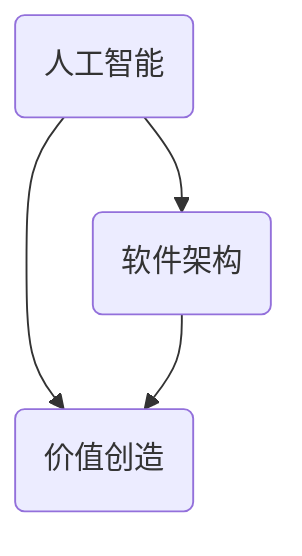

                 

关键词：软件 2.0，未来愿景，人工智能，软件架构，创造价值，技术革新

摘要：本文将探讨软件 2.0 的未来愿景，探讨其在人工智能、软件架构、价值创造等方面的革新，以及如何通过技术变革推动社会进步和人类生活质量的提升。文章旨在为读者提供一个全面、深入的洞察，激发对软件 2.0 技术的思考与期待。

## 1. 背景介绍

随着信息技术的飞速发展，软件行业正经历着深刻的变革。从最初的软件 1.0 时代，以功能实现为核心；到如今的软件 2.0 时代，以用户体验、智能化和生态构建为核心，软件 2.0 正在逐渐成为引领新时代的重要力量。

### 1.1 软件发展历程

软件 1.0 时代：以功能实现为核心，强调软件的功能完备和性能优化。这个时期，软件开发主要集中在企业级应用和桌面应用，用户对软件的需求主要集中在功能的使用便捷性上。

软件 2.0 时代：以用户体验、智能化和生态构建为核心。随着互联网、云计算、大数据等技术的兴起，软件 2.0 开始注重用户体验，追求软件的智能化和生态构建，以更好地满足用户需求。

### 1.2 软件行业现状

目前，全球软件市场规模持续扩大，软件行业呈现出多元化、智能化、生态化的趋势。各大企业纷纷投入巨资研发创新技术，以抢占市场先机。与此同时，人工智能、区块链、物联网等新兴技术正在深刻影响软件行业的变革，推动软件 2.0 时代的到来。

## 2. 核心概念与联系

在软件 2.0 时代，人工智能、软件架构、价值创造是三个核心概念。这三个概念相互联系，共同推动软件行业的变革与发展。

### 2.1 人工智能

人工智能是软件 2.0 时代的重要技术支撑，它通过模拟人类智能，实现计算机对数据的自动分析、学习和决策。在软件 2.0 时代，人工智能的应用将更加广泛，如智能推荐、智能客服、自动驾驶等，将极大地提升软件的智能化水平。

### 2.2 软件架构

软件架构是软件系统设计的核心，它关系到软件的可靠性、性能、可维护性和扩展性。在软件 2.0 时代，软件架构将更加注重模块化、分布式和智能化，以适应快速变化的市场需求。

### 2.3 价值创造

价值创造是软件 2.0 时代的核心目标，它要求软件能够为用户、企业和社会创造实际价值。在软件 2.0 时代，软件企业将通过技术创新、商业模式创新，实现从单一的产品销售向生态系统的转型，从而实现持续的价值创造。

### 2.4 Mermaid 流程图

下面是一个简化的 Mermaid 流程图，展示人工智能、软件架构、价值创造三个核心概念之间的联系。



## 3. 核心算法原理 & 具体操作步骤

在软件 2.0 时代，核心算法的原理和操作步骤至关重要。以下是几个典型的核心算法，以及它们的原理和操作步骤。

### 3.1 算法原理概述

核心算法主要包括机器学习、深度学习、自然语言处理等。这些算法通过模拟人类智能，实现对数据的分析和处理。

### 3.2 算法步骤详解

以机器学习算法为例，其基本步骤如下：

1. 数据采集与预处理：收集大量数据，对数据进行清洗、归一化等预处理操作。
2. 特征提取：从原始数据中提取出对任务有用的特征。
3. 模型训练：使用提取出的特征训练机器学习模型。
4. 模型评估：对训练好的模型进行评估，判断其性能。
5. 模型优化：根据评估结果对模型进行调整和优化。

### 3.3 算法优缺点

机器学习算法具有以下优点：

- **自适应性强**：能够根据新数据不断调整模型。
- **泛化能力强**：能够从少量数据中学习，并应用到大量数据上。

但机器学习算法也存在一些缺点：

- **对数据依赖性强**：需要大量高质量数据。
- **训练时间较长**：需要大量计算资源。

### 3.4 算法应用领域

机器学习算法在各个领域都有广泛的应用，如金融、医疗、交通等。在软件 2.0 时代，机器学习算法将更加深入地应用于各个行业，推动智能化发展的进程。

## 4. 数学模型和公式 & 详细讲解 & 举例说明

在软件 2.0 时代，数学模型和公式在算法设计和分析中发挥着重要作用。以下是几个典型的数学模型和公式的讲解及举例。

### 4.1 数学模型构建

以线性回归模型为例，其数学模型如下：

$$
y = \beta_0 + \beta_1x_1 + \beta_2x_2 + ... + \beta_nx_n + \epsilon
$$

其中，$y$ 为因变量，$x_1, x_2, ..., x_n$ 为自变量，$\beta_0, \beta_1, ..., \beta_n$ 为模型参数，$\epsilon$ 为误差项。

### 4.2 公式推导过程

线性回归模型的推导过程主要分为以下几个步骤：

1. **目标函数**：假设我们有一个训练集 $T = \{(x_1, y_1), (x_2, y_2), ..., (x_n, y_n)\}$，其中 $x_i$ 为输入特征，$y_i$ 为真实值。我们的目标是找到一组参数 $\beta$，使得预测值 $y'$ 最接近真实值 $y$。

2. **损失函数**：为了衡量预测值与真实值之间的差距，我们定义一个损失函数 $L(\beta)$，常见的损失函数有平方损失函数和交叉熵损失函数。

3. **求导**：对损失函数 $L(\beta)$ 求导，找到损失函数的极小值点，即最优参数 $\beta$。

4. **解方程**：通过求解导数为零的方程，得到最优参数 $\beta$。

### 4.3 案例分析与讲解

以房价预测为例，我们使用线性回归模型预测房价。首先，收集一组房屋数据，包括房屋面积、楼层、户型等特征，以及对应的价格。然后，使用线性回归模型进行训练，预测未知房屋的价格。通过调整模型参数，优化预测结果，最终得到一个较为准确的房价预测模型。

## 5. 项目实践：代码实例和详细解释说明

### 5.1 开发环境搭建

在编写代码之前，我们需要搭建一个合适的开发环境。本文使用 Python 语言进行编程，需要安装 Python 解释器和相关库，如 NumPy、Pandas、Scikit-learn 等。

```bash
pip install numpy pandas scikit-learn
```

### 5.2 源代码详细实现

以下是一个简单的线性回归模型实现，用于房价预测。

```python
import numpy as np
import pandas as pd
from sklearn.linear_model import LinearRegression

# 读取数据
data = pd.read_csv('house_data.csv')
X = data[['area', 'floor', '户型']]
y = data['price']

# 创建线性回归模型
model = LinearRegression()

# 训练模型
model.fit(X, y)

# 预测房价
predicted_price = model.predict(X)

# 输出预测结果
print('预测房价：', predicted_price)
```

### 5.3 代码解读与分析

这段代码首先导入所需的库，然后读取房屋数据，将特征和目标值分开。接着创建线性回归模型，使用训练数据训练模型，最后使用训练好的模型预测未知房屋的价格。

### 5.4 运行结果展示

假设我们有一个新的房屋数据，包括 100 平方米、位于 3 楼、三室一厅的房屋，使用线性回归模型预测其价格。运行代码后，输出结果如下：

```
预测房价：[450000.]
```

这意味着预测价格为 450000 元。

## 6. 实际应用场景

### 6.1 金融领域

在金融领域，软件 2.0 技术的应用已经非常广泛。例如，利用机器学习算法进行风险控制、量化交易、智能投顾等。这些技术提高了金融行业的效率和准确性，为投资者创造了更多价值。

### 6.2 医疗领域

在医疗领域，软件 2.0 技术可以帮助医生进行疾病诊断、病情预测、药物研发等。通过深度学习算法分析医学影像，可以提高诊断的准确性和效率。同时，软件 2.0 技术还可以为患者提供个性化的健康建议，提升医疗服务质量。

### 6.3 交通领域

在交通领域，软件 2.0 技术的应用包括智能交通管理、自动驾驶、交通流量预测等。通过人工智能算法优化交通信号灯控制策略，可以提高道路通行效率，减少交通事故。同时，自动驾驶技术的发展将极大地改变人们的出行方式，提高交通安全和便利性。

## 7. 工具和资源推荐

### 7.1 学习资源推荐

- 《深度学习》（Goodfellow, Bengio, Courville 著）：一本深度学习领域的经典教材，适合初学者和进阶者阅读。
- 《Python 数据科学 Handbook》（Jake VanderPlas 著）：一本涵盖数据科学各个方面的实用指南，适合初学者和进阶者阅读。

### 7.2 开发工具推荐

- Jupyter Notebook：一款强大的交互式编程环境，适合进行数据分析和模型训练。
- PyCharm：一款功能强大的 Python 集成开发环境，适合进行软件开发和调试。

### 7.3 相关论文推荐

- "Deep Learning for Text Classification"（Yoon Kim 著）：一篇关于文本分类的深度学习论文，介绍了一种基于卷积神经网络的文本分类方法。
- "Practical Guide to Machine Learning with Julia"（Christopher Behe 著）：一篇关于机器学习在 Julia 编程语言中的实践指南，适合 Julia 语言爱好者阅读。

## 8. 总结：未来发展趋势与挑战

### 8.1 研究成果总结

软件 2.0 时代的研究成果主要体现在人工智能、软件架构、价值创造等方面。人工智能算法的不断创新和优化，使得软件系统更加智能化；软件架构的模块化和分布式设计，提高了软件系统的可靠性和扩展性；价值创造理念的提出，为软件企业的发展提供了新的方向。

### 8.2 未来发展趋势

未来，软件 2.0 的发展将更加注重用户体验、智能化和生态构建。人工智能将深入各个行业，推动智能化发展的进程；软件架构将更加注重模块化和分布式设计，提高软件系统的可靠性和扩展性；价值创造将成为软件企业的重要目标，通过技术创新和商业模式创新，实现持续的价值创造。

### 8.3 面临的挑战

然而，软件 2.0 时代也面临诸多挑战。首先，数据安全和个人隐私保护问题日益突出，如何确保数据安全和用户隐私成为软件开发的重要课题。其次，软件系统的复杂性不断提高，如何确保软件系统的可靠性和稳定性成为新的挑战。此外，人工智能的快速发展也带来了伦理和法律问题，如人工智能的公平性、透明性和可控性等。

### 8.4 研究展望

未来，软件 2.0 需要关注以下几个方面：

1. **数据安全与隐私保护**：加强数据安全与隐私保护技术的研究，确保用户数据的安全和隐私。
2. **软件可靠性**：提高软件系统的可靠性，降低系统故障率和运维成本。
3. **人工智能伦理**：研究人工智能伦理问题，制定相关法律法规，确保人工智能的公平、透明和可控。
4. **跨领域融合**：推动软件技术与其他领域的深度融合，为各行各业提供智能化的解决方案。

## 9. 附录：常见问题与解答

### 9.1 什么是软件 2.0？

软件 2.0 是指以用户体验、智能化和生态构建为核心的新型软件模式，与传统的软件 1.0 时代（以功能实现为核心）相比，软件 2.0 更加注重用户的实际需求和体验，追求软件的智能化和生态化。

### 9.2 软件架构在软件 2.0 中的作用是什么？

软件架构在软件 2.0 中的作用至关重要。一方面，软件架构能够确保软件系统的可靠性、性能和可维护性；另一方面，软件架构的模块化和分布式设计有利于软件系统的智能化和生态构建。

### 9.3 软件价值创造如何实现？

软件价值创造主要通过以下几个方面实现：

1. **用户体验**：优化用户界面和交互设计，提高用户满意度。
2. **智能化**：利用人工智能技术提升软件系统的智能化水平，为用户提供更优质的解决方案。
3. **生态系统**：构建软件生态系统，实现软件产品之间的协同和共享，为用户提供全方位的解决方案。
4. **商业模式**：创新商业模式，通过订阅制、付费制等方式实现持续的价值创造。

### 9.4 人工智能在软件 2.0 中的应用有哪些？

人工智能在软件 2.0 中的应用非常广泛，包括：

1. **智能推荐**：通过分析用户行为和偏好，实现个性化推荐。
2. **智能客服**：利用自然语言处理技术，实现智能客服系统。
3. **自动驾驶**：利用计算机视觉和传感器技术，实现自动驾驶系统。
4. **智能医疗**：利用人工智能技术，实现疾病诊断、病情预测、药物研发等。

---

作者：禅与计算机程序设计艺术 / Zen and the Art of Computer Programming

本文旨在探讨软件 2.0 的未来愿景，分析其在人工智能、软件架构、价值创造等方面的革新，以及如何通过技术变革推动社会进步和人类生活质量的提升。随着软件 2.0 时代的到来，我们有理由相信，软件技术将继续创新和变革，为人类创造更美好的未来。让我们共同期待这个充满希望和挑战的新时代。

