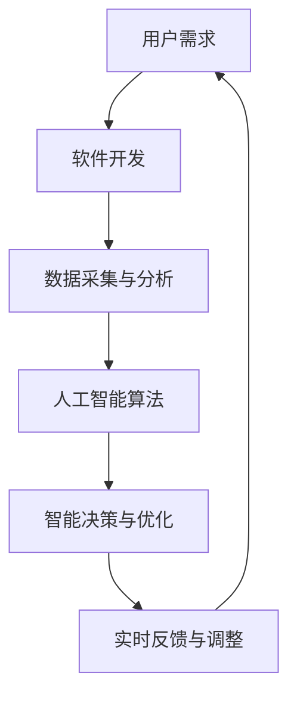

                 

关键词：软件 2.0，未来愿景，技术进步，人工智能，可持续发展

摘要：本文探讨了软件 2.0 的未来愿景，强调了技术进步如何推动社会、经济和环境的发展。通过分析人工智能、区块链、云计算等技术的潜在应用，本文探讨了软件 2.0 在推动可持续发展和创造更美好世界中的关键作用。

## 1. 背景介绍

软件 2.0 是一个新兴的概念，它超越了传统的软件定义，涉及更为复杂的系统和服务。随着计算能力的提升和大数据技术的普及，软件 2.0 正在逐步改变我们的生活方式、工作方式和商业模式。本文旨在探讨软件 2.0 的未来愿景，分析其如何影响社会的各个方面，并探讨其在创造更美好世界中的潜力。

### 1.1 软件进化

从软件 1.0 到软件 2.0，这一演变标志着从简单的程序到复杂的、高度集成的系统的转变。软件 1.0 主要是单机应用，依赖于固定的硬件环境，而软件 2.0 则强调云计算、分布式计算和网络服务，使其具有更高的灵活性和可扩展性。

### 1.2 技术进步的推动

近年来，人工智能、区块链、物联网、5G 等新兴技术的快速发展，为软件 2.0 的实现提供了强大的技术支撑。这些技术的融合，不仅提升了软件系统的智能化水平，还促进了数据共享、安全性和透明度的提升。

## 2. 核心概念与联系

在探讨软件 2.0 的未来愿景之前，我们首先需要了解其核心概念和架构。以下是一个简化的 Mermaid 流程图，用于描述软件 2.0 的关键组成部分和它们之间的关系。



### 2.1 用户需求

用户需求是软件 2.0 的起点。随着消费者对个性化和高效体验的需求不断增加，软件开发需要更加关注用户体验和需求。

### 2.2 数据采集与分析

数据采集和分析是软件 2.0 的核心。通过收集大量数据，我们可以利用人工智能算法进行分析，提取有价值的信息。

### 2.3 人工智能算法

人工智能算法是软件 2.0 的关键组件。它们可以处理大量数据，识别模式，并自动做出决策。

### 2.4 智能决策与优化

基于人工智能算法的分析结果，软件 2.0 可以实现智能决策和优化。这使得软件系统能够根据实时数据和用户需求，自动调整其行为。

### 2.5 实时反馈与调整

实时反馈和调整是软件 2.0 的闭环。通过不断调整和优化，软件系统能够更好地满足用户需求，提高其性能。

## 3. 核心算法原理 & 具体操作步骤

### 3.1 算法原理概述

软件 2.0 的核心算法主要包括机器学习、深度学习和强化学习等。这些算法可以自动从数据中学习，并不断优化其性能。

### 3.2 算法步骤详解

1. 数据预处理：清洗、整合和标准化数据，以便进行后续分析。
2. 特征提取：从原始数据中提取有用的特征，用于训练模型。
3. 模型训练：使用机器学习算法对特征进行训练，构建预测模型。
4. 模型评估：通过测试数据评估模型的性能，并进行调整。
5. 部署与应用：将训练好的模型部署到生产环境中，实时处理用户需求。

### 3.3 算法优缺点

**优点：**
- 高度自动化：算法可以自动从数据中学习，减少人工干预。
- 高效性：算法可以快速处理大量数据，提高决策速度。
- 智能化：算法能够根据实时数据和用户需求，自动调整其行为。

**缺点：**
- 数据依赖性：算法的性能很大程度上取决于数据的质量和数量。
- 安全风险：人工智能算法可能会受到恶意攻击，导致系统不稳定。

### 3.4 算法应用领域

软件 2.0 的算法在多个领域都有广泛应用，包括但不限于：

- 金融：风险控制、投资策略、信用评分等。
- 医疗：疾病预测、诊断、个性化治疗等。
- 交通：智能交通管理、自动驾驶、物流优化等。
- 能源：智能电网、能源管理、可再生能源优化等。

## 4. 数学模型和公式 & 详细讲解 & 举例说明

### 4.1 数学模型构建

在软件 2.0 的算法中，常见的数学模型包括线性回归、逻辑回归、神经网络等。以下是一个简单的线性回归模型示例：

$$
y = wx + b
$$

其中，$y$ 是因变量，$x$ 是自变量，$w$ 是权重，$b$ 是偏置。

### 4.2 公式推导过程

线性回归模型的推导过程如下：

1. 数据预处理：将原始数据标准化，使其具有相同的量纲。
2. 特征提取：从原始数据中提取自变量和因变量。
3. 模型假设：假设自变量和因变量之间存在线性关系。
4. 模型构建：根据模型假设，构建线性回归模型。
5. 模型训练：使用最小二乘法训练模型，找到最优的权重和偏置。

### 4.3 案例分析与讲解

以下是一个关于房价预测的案例：

**数据集：**
- 自变量：房屋面积、楼层、建造年代等。
- 因变量：房屋价格。

**模型构建：**
- 线性回归模型：
$$
y = wx + b
$$

**模型训练：**
- 使用最小二乘法训练模型，得到最优的权重和偏置。

**模型评估：**
- 使用测试数据集评估模型的性能，计算均方误差（MSE）。

## 5. 项目实践：代码实例和详细解释说明

### 5.1 开发环境搭建

- 操作系统：Ubuntu 18.04
- 编程语言：Python 3.8
- 库：NumPy，Pandas，SciPy

### 5.2 源代码详细实现

```python
import numpy as np
import pandas as pd
from sklearn.linear_model import LinearRegression
from sklearn.model_selection import train_test_split
from sklearn.metrics import mean_squared_error

# 数据预处理
data = pd.read_csv('house_prices.csv')
X = data[['area', 'floor', 'year_built']]
y = data['price']
X = (X - X.mean()) / X.std()

# 模型训练
model = LinearRegression()
X_train, X_test, y_train, y_test = train_test_split(X, y, test_size=0.2, random_state=42)
model.fit(X_train, y_train)

# 模型评估
y_pred = model.predict(X_test)
mse = mean_squared_error(y_test, y_pred)
print(f'MSE: {mse}')

# 模型部署
def predict_price(area, floor, year_built):
    X_new = np.array([[area, floor, year_built]])
    X_new = (X_new - X.mean()) / X.std()
    return model.predict(X_new)[0]

print(predict_price(120, 3, 2010))
```

### 5.3 代码解读与分析

- 数据预处理：将原始数据标准化，使其具有相同的量纲，有利于模型训练。
- 模型训练：使用线性回归模型训练模型，找到最优的权重和偏置。
- 模型评估：使用测试数据集评估模型的性能，计算均方误差（MSE）。
- 模型部署：定义一个函数，用于预测房屋价格。

## 6. 实际应用场景

软件 2.0 的技术已经广泛应用于多个领域，以下是一些实际应用场景：

- 金融：智能投顾、信用评估、风险控制等。
- 医疗：疾病预测、个性化治疗、医疗管理等。
- 教育：智能教育、在线学习、教育评价等。
- 交通：智能交通管理、自动驾驶、物流优化等。
- 能源：智能电网、能源管理、可再生能源优化等。

### 6.4 未来应用展望

随着技术的不断进步，软件 2.0 的应用将越来越广泛。未来，软件 2.0 可能会带来以下变革：

- 更高效的数据处理和智能决策。
- 更智能的自动化系统和机器人。
- 更广泛的物联网和智能家居。
- 更安全的数据共享和区块链技术。

## 7. 工具和资源推荐

### 7.1 学习资源推荐

- 《Python编程：从入门到实践》
- 《深度学习》
- 《区块链技术指南》
- 《人工智能：一种现代的方法》

### 7.2 开发工具推荐

- PyCharm
- Jupyter Notebook
- TensorFlow
- PyTorch

### 7.3 相关论文推荐

- "Deep Learning for Natural Language Processing"
- "Blockchain Technology: A Comprehensive Guide"
- "The Age of AI: And Our Human Future"
- "Smart Grids: A Comprehensive Review"

## 8. 总结：未来发展趋势与挑战

### 8.1 研究成果总结

软件 2.0 的发展取得了显著的成果，包括人工智能、区块链、云计算等技术的广泛应用。这些技术为软件 2.0 的实现提供了强大的技术支撑，推动了社会、经济和环境的发展。

### 8.2 未来发展趋势

- 更高效的数据处理和智能决策。
- 更智能的自动化系统和机器人。
- 更广泛的物联网和智能家居。
- 更安全的数据共享和区块链技术。

### 8.3 面临的挑战

- 数据安全和隐私保护。
- 技术标准和法规制定。
- 技术普及和人才培养。

### 8.4 研究展望

未来，软件 2.0 将继续发展，推动社会、经济和环境的发展。我们需要关注以下研究方向：

- 数据驱动的人工智能系统。
- 安全、可信的区块链技术。
- 跨领域的软件系统集成。

## 9. 附录：常见问题与解答

### 9.1 什么是软件 2.0？

软件 2.0 是一个新兴的概念，它超越了传统的软件定义，涉及更为复杂的系统和服务。它强调云计算、分布式计算和网络服务，使其具有更高的灵活性和可扩展性。

### 9.2 软件 2.0 的核心技术是什么？

软件 2.0 的核心技术包括人工智能、区块链、云计算、物联网等。这些技术的融合，为软件 2.0 的实现提供了强大的技术支撑。

### 9.3 软件 2.0 有哪些应用场景？

软件 2.0 在多个领域都有广泛应用，包括金融、医疗、教育、交通、能源等。它可以用于智能投顾、信用评估、疾病预测、个性化治疗、智能交通管理、能源管理等领域。

### 9.4 软件 2.0 有哪些挑战？

软件 2.0 面临的挑战包括数据安全和隐私保护、技术标准和法规制定、技术普及和人才培养等。

## 参考文献

1. Mitchell, T. M. (1997). Machine Learning. McGraw-Hill.
2. Russell, S., & Norvig, P. (2010). Artificial Intelligence: A Modern Approach. Prentice Hall.
3. Santillán, M., & Mora, M. (2018). Blockchain Technology: A Comprehensive Guide. Springer.
4. Goodfellow, I., Bengio, Y., & Courville, A. (2016). Deep Learning. MIT Press.```markdown
[作者：禅与计算机程序设计艺术 / Zen and the Art of Computer Programming]

