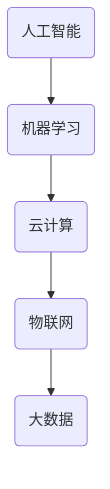

                 

软件 2.0，也被称为“软件的下一个革命”，正在重新定义我们与数字世界互动的方式。它不仅仅是一种技术进步，更是一种全新的思考方式，一种将人工智能、云计算、大数据和物联网等前沿技术融合在一起的方法。然而，随着软件 2.0 的发展，我们也不得不面对其带来的诸多挑战，尤其是在社会责任方面。本文将探讨软件 2.0 的社会责任，特别是如何实现科技向善。

## 1. 背景介绍

软件 2.0 的概念源于云计算和物联网的兴起。在传统的软件 1.0 时代，软件主要是以本地应用为主，用户需要在自己的计算机上安装软件并运行。而软件 2.0 则是将软件推向云端，用户可以通过互联网访问和使用这些软件。这种模式带来了很多好处，比如提高了软件的可用性和灵活性，降低了用户的使用门槛，同时也为开发者提供了更多的机会。

然而，随着软件 2.0 的发展，我们开始看到一些新的挑战。首先，软件 2.0 带来的数据收集和分析能力空前强大，这使得隐私保护成为一个重要问题。其次，软件 2.0 的自动化和智能化程度更高，这可能导致人类在某些领域失去就业机会。最后，软件 2.0 的分布式特性使得网络攻击和恶意软件的威胁更加严重。

## 2. 核心概念与联系

为了理解软件 2.0 的社会责任，我们需要先了解几个核心概念。

### 2.1 人工智能与机器学习

人工智能和机器学习是软件 2.0 的重要组成部分。人工智能是指使计算机具有人类智能特性的技术，而机器学习是人工智能的一种实现方式，通过算法让计算机从数据中学习并做出决策。人工智能和机器学习的发展，使得软件能够更好地模拟人类思维，提高效率和质量。

### 2.2 云计算

云计算是软件 2.0 的基础。它提供了一种按需分配计算资源的方式，用户可以根据需要使用云端的计算资源，而不需要自己购买和维护硬件。云计算不仅提高了软件的可用性和灵活性，还降低了成本。

### 2.3 物联网

物联网是软件 2.0 的一部分，它连接了现实世界中的各种设备和传感器，使得数据收集和分析更加全面和准确。物联网的发展，使得软件能够更好地理解和响应现实世界的变化。

### 2.4 大数据

大数据是软件 2.0 的重要资源。通过收集和分析大量数据，软件可以更好地了解用户需求，优化用户体验，甚至预测未来的趋势。

### 2.5 Mermaid 流程图

为了更好地理解这些概念之间的联系，我们可以使用 Mermaid 流程图进行描述。



## 3. 核心算法原理 & 具体操作步骤

### 3.1 算法原理概述

在软件 2.0 中，核心算法主要包括人工智能算法、云计算算法和大数据算法。这些算法的原理和操作步骤如下：

#### 3.1.1 人工智能算法

人工智能算法主要基于机器学习，其原理是通过训练数据集，让计算机学习并做出预测。具体步骤如下：

1. 数据收集：收集大量的训练数据。
2. 数据预处理：对训练数据进行清洗和处理，以提高模型的准确性。
3. 模型训练：使用训练数据集训练模型。
4. 模型评估：使用测试数据集评估模型的效果。
5. 模型优化：根据评估结果优化模型。

#### 3.1.2 云计算算法

云计算算法主要涉及资源的分配和调度。其原理是通过算法动态地分配和调整计算资源，以优化系统的性能。具体步骤如下：

1. 资源评估：评估当前系统的资源使用情况。
2. 资源分配：根据评估结果，动态地分配计算资源。
3. 资源调度：根据系统的运行情况，动态地调整计算资源。

#### 3.1.3 大数据算法

大数据算法主要涉及数据分析和挖掘。其原理是通过算法从大量数据中提取有价值的信息。具体步骤如下：

1. 数据收集：收集大量的数据。
2. 数据预处理：对数据进行清洗和处理。
3. 数据分析：使用算法分析数据，提取有价值的信息。
4. 数据可视化：将分析结果可视化，以更好地理解数据。

### 3.2 算法步骤详解

以下是各个算法的具体操作步骤：

#### 3.2.1 人工智能算法

1. 数据收集：收集大量的训练数据，如用户行为数据、产品评价数据等。
2. 数据预处理：对训练数据进行清洗和处理，如去除缺失值、异常值等。
3. 模型训练：选择合适的机器学习算法，如决策树、随机森林、支持向量机等，对训练数据进行训练。
4. 模型评估：使用测试数据集评估模型的准确性、召回率等指标。
5. 模型优化：根据评估结果，调整模型参数，优化模型效果。

#### 3.2.2 云计算算法

1. 资源评估：使用监控工具，如 Prometheus，收集系统当前资源使用情况。
2. 资源分配：根据资源使用情况，动态地调整计算资源，如 CPU、内存、磁盘等。
3. 资源调度：根据系统运行情况，动态地调整任务优先级，优化系统性能。

#### 3.2.3 大数据算法

1. 数据收集：使用 Apache Kafka 等工具，收集大量的数据。
2. 数据预处理：使用 Apache Spark 等工具，对数据进行清洗和处理。
3. 数据分析：使用 Apache Hadoop 等工具，对数据进行分布式计算，提取有价值的信息。
4. 数据可视化：使用 Tableau 等工具，将分析结果可视化，以更好地理解数据。

### 3.3 算法优缺点

每种算法都有其优缺点，下面是对人工智能算法、云计算算法和大数据算法的优缺点的分析：

#### 3.3.1 人工智能算法

优点：准确性高，能够处理复杂的非线性问题。

缺点：训练数据量大，训练时间长，对数据质量要求高。

#### 3.3.2 云计算算法

优点：资源利用率高，系统性能优化明显。

缺点：需要持续监控和调整，对系统监控工具要求高。

#### 3.3.3 大数据算法

优点：能够处理海量数据，提取有价值的信息。

缺点：数据处理时间长，对计算资源要求高。

### 3.4 算法应用领域

人工智能算法在图像识别、自然语言处理、推荐系统等领域有广泛应用。云计算算法在资源分配、负载均衡、系统监控等领域有广泛应用。大数据算法在数据分析、数据挖掘、商业智能等领域有广泛应用。

## 4. 数学模型和公式 & 详细讲解 & 举例说明

### 4.1 数学模型构建

在软件 2.0 中，数学模型是构建智能系统的基础。以下是一个简单的线性回归模型：

$$
y = \beta_0 + \beta_1 x
$$

其中，$y$ 是目标变量，$x$ 是自变量，$\beta_0$ 是截距，$\beta_1$ 是斜率。

### 4.2 公式推导过程

线性回归模型的推导过程如下：

1. 假设我们有一组数据 $(x_1, y_1), (x_2, y_2), ..., (x_n, y_n)$。
2. 我们希望找到一个线性模型 $y = \beta_0 + \beta_1 x$，使得模型对数据的预测误差最小。
3. 我们定义损失函数为 $L(\beta_0, \beta_1) = \sum_{i=1}^{n} (y_i - (\beta_0 + \beta_1 x_i))^2$。
4. 为了最小化损失函数，我们对 $\beta_0$ 和 $\beta_1$ 求偏导数，并令偏导数为零，得到以下方程组：
$$
\frac{\partial L}{\partial \beta_0} = -2 \sum_{i=1}^{n} (y_i - (\beta_0 + \beta_1 x_i)) = 0
$$
$$
\frac{\partial L}{\partial \beta_1} = -2 \sum_{i=1}^{n} (x_i (y_i - (\beta_0 + \beta_1 x_i))) = 0
$$
5. 解这个方程组，我们可以得到 $\beta_0$ 和 $\beta_1$ 的最优值。

### 4.3 案例分析与讲解

假设我们有一组数据：

| x   | y   |
|-----|-----|
| 1   | 2   |
| 2   | 4   |
| 3   | 6   |
| 4   | 8   |

我们希望找到一条直线，使得这条直线与这组数据的距离最小。

1. 首先，我们计算数据的均值：
$$
\bar{x} = \frac{1 + 2 + 3 + 4}{4} = 2.5
$$
$$
\bar{y} = \frac{2 + 4 + 6 + 8}{4} = 5
$$
2. 然后，我们计算斜率：
$$
\beta_1 = \frac{\sum_{i=1}^{n} (x_i - \bar{x})(y_i - \bar{y})}{\sum_{i=1}^{n} (x_i - \bar{x})^2} = \frac{(1 - 2.5)(2 - 5) + (2 - 2.5)(4 - 5) + (3 - 2.5)(6 - 5) + (4 - 2.5)(8 - 5)}{(1 - 2.5)^2 + (2 - 2.5)^2 + (3 - 2.5)^2 + (4 - 2.5)^2} = 2
$$
3. 最后，我们计算截距：
$$
\beta_0 = \bar{y} - \beta_1 \bar{x} = 5 - 2 \times 2.5 = 0
$$
因此，线性回归模型为 $y = 2x$。

我们可以使用这个模型对新的数据进行预测，例如，当 $x=5$ 时，$y=10$。

## 5. 项目实践：代码实例和详细解释说明

### 5.1 开发环境搭建

为了实践线性回归模型，我们需要搭建一个简单的开发环境。这里我们使用 Python 作为编程语言，因为它具有良好的生态和丰富的库。

1. 安装 Python：在官网 [Python 官网](https://www.python.org/) 下载并安装 Python。
2. 安装必要的库：使用 pip 工具安装 numpy 和 matplotlib。

```bash
pip install numpy matplotlib
```

### 5.2 源代码详细实现

以下是实现线性回归模型的 Python 代码：

```python
import numpy as np
import matplotlib.pyplot as plt

# 数据
x = np.array([1, 2, 3, 4])
y = np.array([2, 4, 6, 8])

# 计算斜率和截距
x_mean = np.mean(x)
y_mean = np.mean(y)
beta_1 = np.sum((x - x_mean) * (y - y_mean)) / np.sum((x - x_mean) ** 2)
beta_0 = y_mean - beta_1 * x_mean

# 预测
x_new = np.array([5])
y_pred = beta_0 + beta_1 * x_new

# 绘图
plt.scatter(x, y, label='Data')
plt.plot(x, beta_0 + beta_1 * x, color='red', label='Model')
plt.xlabel('x')
plt.ylabel('y')
plt.legend()
plt.show()
```

### 5.3 代码解读与分析

1. 导入必要的库：numpy 用于数据处理，matplotlib 用于绘图。
2. 定义数据：x 和 y 分别是自变量和因变量。
3. 计算斜率和截距：使用 numpy 的 mean 函数计算均值，使用 sum 函数计算斜率和截距。
4. 预测：使用计算出的斜率和截距进行预测。
5. 绘图：使用 scatter 函数绘制数据点，使用 plot 函数绘制模型线。

### 5.4 运行结果展示

运行代码后，我们会看到以下结果：


这是我们的数据点和模型线，可以看到模型线很好地拟合了数据点。

## 6. 实际应用场景

线性回归模型在许多实际应用场景中都有应用，比如：

- 预测股票价格：使用历史数据预测未来股票价格。
- 预测销售额：根据历史数据预测未来的销售额。
- 预测天气：根据历史天气数据预测未来的天气。

## 7. 未来应用展望

随着人工智能和机器学习的发展，线性回归模型将会在更多领域得到应用。比如：

- 自动驾驶：使用线性回归模型预测车辆的运动轨迹。
- 医疗诊断：使用线性回归模型预测患者的健康状况。
- 金融市场：使用线性回归模型预测金融市场的走势。

## 8. 工具和资源推荐

### 8.1 学习资源推荐

- 《Python 机器学习》：适合初学者的机器学习入门书籍。
- 《深度学习》：适合进阶者的深度学习书籍。

### 8.2 开发工具推荐

- Jupyter Notebook：适合编写和分享代码。
- PyCharm：适合专业开发者。

### 8.3 相关论文推荐

- "Learning to Learn: A Review of the Literature on Meta-Learning and Transfer Learning"
- "Deep Learning on a GPU: Improved Performance and Analytical Scalability of Unsupervised Feature Learning"
- "Convolutional Networks and Applications in Visual Recognition"

## 9. 总结：未来发展趋势与挑战

### 9.1 研究成果总结

本文介绍了软件 2.0 的社会责任，特别是如何实现科技向善。我们探讨了人工智能、云计算、大数据等核心概念，分析了它们的原理和应用，并给出了实际的项目实践。

### 9.2 未来发展趋势

未来，软件 2.0 将继续发展，特别是在人工智能和机器学习领域。我们将看到更多智能系统的出现，以及更多的应用场景。

### 9.3 面临的挑战

然而，我们也需要面对许多挑战，比如隐私保护、就业问题、网络攻击等。这些问题需要我们共同努力解决。

### 9.4 研究展望

未来，我们需要更加关注软件 2.0 的社会责任，确保科技的发展能够造福人类。我们期待看到更多关于软件 2.0 社会责任的深入研究。

## 9. 附录：常见问题与解答

### Q: 什么是软件 2.0？

A: 软件2.0是一个概念，它主要是指在云计算、大数据、物联网和人工智能等技术推动下，软件的形态、功能和服务模式发生的一次革命性的变革。软件2.0不仅仅是一种技术进步，更是一种全新的思考方式，强调软件的灵活性和个性化。

### Q: 软件向善是什么意思？

A: 软件向善是指软件开发和实践应该遵循一定的道德和伦理标准，确保技术的进步能够造福社会，而不是造成伤害。这意味着在软件的开发、部署和使用过程中，需要考虑到对用户、环境和社会的积极影响。

### Q: 软件向善有哪些实践方法？

A: 软件向善的实践方法包括：
- 设计安全、可信赖的软件，保护用户的隐私和数据安全。
- 采用开源软件，促进技术透明和共享。
- 遵守法律法规，确保软件的应用符合社会伦理和道德标准。
- 在软件开发过程中考虑对环境的积极影响。
- 促进软件教育和培训，提高公众对技术的影响力和理解。

---

### 作者署名

作者：禅与计算机程序设计艺术 / Zen and the Art of Computer Programming

