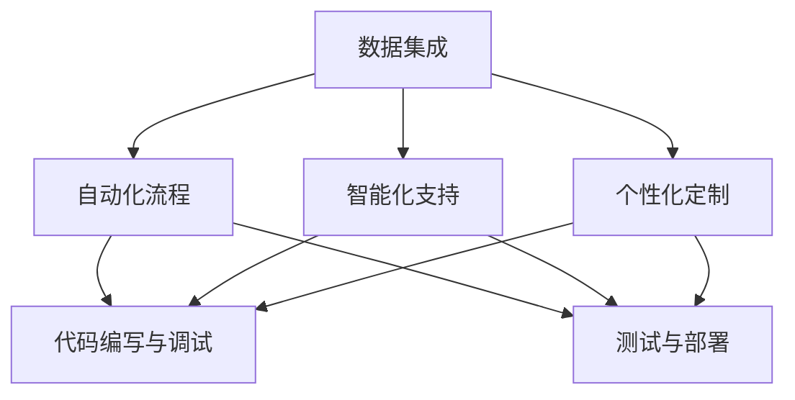

                 

关键词：软件2.0，IDE，数据驱动，开发环境，技术创新

> 摘要：本文深入探讨了软件2.0时代下，数据驱动的开发环境（IDE）的设想与实践。通过回顾传统IDE的局限，我们提出了一种全新的IDE构想，该环境以数据为核心，实现了开发流程的自动化、智能化和高效化。本文将详细阐述这种新型IDE的架构、算法原理、数学模型、代码实例以及实际应用场景，并展望其未来发展趋势与挑战。

## 1. 背景介绍

随着信息技术的飞速发展，软件工程已经进入了新的时代——软件2.0时代。在这个时代，数据成为了新的生产要素，数据的收集、存储、处理和分析成为了软件开发的核心任务。传统的集成开发环境（IDE）在支持这种数据密集型应用方面显得力不从心。传统IDE主要依赖于手工编码和重复性的开发任务，无法充分利用数据的价值，导致开发效率低下、维护成本高昂。

为了应对这种挑战，我们提出了数据驱动的开发环境（Data-Driven Integrated Development Environment，简称DD-IDE）的概念。DD-IDE旨在通过数据驱动的方式，自动化和智能化地完成软件开发的全过程，从而提高开发效率，降低开发成本，并提升软件质量。

### 1.1 传统IDE的局限

传统IDE主要存在以下几个方面的局限：

1. **手工编码依赖**：传统IDE依赖于手工编码，开发人员需要手动编写大量的代码，导致开发效率低下。
2. **重复性工作**：在软件开发过程中，存在大量的重复性工作，如代码的调试、测试、部署等，传统IDE无法有效减轻这些负担。
3. **缺乏数据集成**：传统IDE无法有效地整合各种数据源，如日志数据、性能数据、用户行为数据等，限制了数据在开发过程中的应用。
4. **缺乏智能化支持**：传统IDE缺乏智能化支持，无法根据开发人员的习惯和项目的特点，提供个性化的开发建议和优化方案。

### 1.2 软件开发的新需求

在软件2.0时代，软件开发面临着新的需求：

1. **数据密集型应用**：越来越多的应用依赖于大量的数据，如大数据应用、人工智能应用等，数据驱动的开发成为必然趋势。
2. **自动化与智能化**：随着自动化工具和人工智能技术的普及，开发人员期望IDE能够自动化和智能化地完成开发任务。
3. **高效的开发流程**：为了应对日益复杂的项目，开发人员需要高效的开发流程，以降低开发成本，提高开发质量。

## 2. 核心概念与联系

### 2.1 核心概念

数据驱动的开发环境（DD-IDE）的核心概念包括：

1. **数据集成**：将各种数据源（如数据库、日志、性能数据等）集成到IDE中，为开发人员提供全面的数据视图。
2. **自动化流程**：通过自动化工具，如脚本、工作流等，自动化完成软件开发过程中的各种任务。
3. **智能化支持**：利用人工智能技术，如机器学习、自然语言处理等，为开发人员提供智能化的开发建议和优化方案。
4. **个性化定制**：根据开发人员的习惯和项目的特点，提供个性化的开发环境和工具。

### 2.2 联系与架构

DD-IDE的架构如下图所示：



### 2.3 工作流程

DD-IDE的工作流程可以分为以下几个阶段：

1. **数据收集**：从各种数据源收集数据，如日志数据、性能数据、用户行为数据等。
2. **数据预处理**：对收集到的数据进行清洗、转换和整合，以便于后续分析。
3. **自动化流程**：利用自动化工具，如脚本、工作流等，自动化完成代码编写、调试、测试和部署等任务。
4. **智能化支持**：利用人工智能技术，如机器学习、自然语言处理等，为开发人员提供智能化的开发建议和优化方案。
5. **个性化定制**：根据开发人员的习惯和项目的特点，提供个性化的开发环境和工具。

## 3. 核心算法原理 & 具体操作步骤

### 3.1 算法原理概述

DD-IDE的核心算法原理包括数据挖掘、自动化流程优化和智能化支持。

1. **数据挖掘**：利用机器学习算法，从数据中挖掘出有价值的信息，如代码缺陷、性能瓶颈等。
2. **自动化流程优化**：通过自动化工具，如脚本、工作流等，优化软件开发流程，提高开发效率。
3. **智能化支持**：利用自然语言处理、知识图谱等技术，为开发人员提供智能化的开发建议和优化方案。

### 3.2 算法步骤详解

1. **数据收集**：从各种数据源（如日志、数据库、性能监控工具等）收集数据。
2. **数据预处理**：对收集到的数据进行清洗、转换和整合，以便于后续分析。
3. **数据挖掘**：利用机器学习算法，从数据中挖掘出有价值的信息，如代码缺陷、性能瓶颈等。
4. **自动化流程优化**：根据挖掘出的信息，优化自动化流程，如调整测试用例、优化代码等。
5. **智能化支持**：根据开发人员的习惯和项目的特点，提供个性化的开发建议和优化方案。

### 3.3 算法优缺点

**优点**：

1. **提高开发效率**：通过自动化流程和智能化支持，大幅提高开发效率。
2. **降低开发成本**：通过数据驱动的开发方式，降低开发成本。
3. **提升软件质量**：通过数据挖掘，提前发现代码缺陷和性能瓶颈，提升软件质量。

**缺点**：

1. **数据质量要求高**：算法的准确性依赖于数据的质量，数据质量越高，算法效果越好。
2. **算法复杂度高**：数据挖掘和自动化流程优化算法复杂度高，对计算资源要求较高。

### 3.4 算法应用领域

DD-IDE的算法可以应用于以下领域：

1. **软件开发**：通过数据驱动的开发方式，提高软件开发效率和质量。
2. **代码审查**：利用数据挖掘技术，提前发现代码缺陷。
3. **性能优化**：通过自动化流程优化，提高软件性能。

## 4. 数学模型和公式 & 详细讲解 & 举例说明

### 4.1 数学模型构建

DD-IDE的数学模型主要包括以下几个部分：

1. **数据挖掘模型**：用于从数据中挖掘有价值的信息。
2. **自动化流程模型**：用于优化软件开发流程。
3. **智能化支持模型**：用于为开发人员提供个性化的开发建议和优化方案。

### 4.2 公式推导过程

以数据挖掘模型为例，假设我们有如下数据集D，其中每个数据点包含多个特征：

$$
D = \{x_1, x_2, ..., x_n\}
$$

其中，每个数据点$x_i$可以表示为：

$$
x_i = \{x_{i1}, x_{i2}, ..., x_{im}\}
$$

我们使用机器学习算法，如决策树、支持向量机等，对数据集D进行建模，得到预测函数$f(x)$：

$$
f(x) = g(h(Wx + b))
$$

其中，$W$和$b$为模型的参数，$g$和$h$为激活函数。

### 4.3 案例分析与讲解

以下是一个简单的数据挖掘案例：

假设我们有一个包含用户行为数据的日志文件，每个日志条目包含用户ID、访问时间、访问页面等信息。我们希望通过这些数据挖掘出用户的兴趣偏好。

1. **数据收集**：从日志文件中收集用户行为数据。
2. **数据预处理**：对数据进行清洗和转换，将文本数据转换为数值数据。
3. **数据挖掘**：使用决策树算法，对数据进行分类，预测用户的兴趣偏好。
4. **结果分析**：根据预测结果，对用户进行标签分类，如“技术爱好者”、“购物达人”等。

通过这个案例，我们可以看到数据挖掘模型在软件开发中的应用。通过预测用户的兴趣偏好，开发人员可以针对性地提供个性化的内容推荐，提高用户满意度。

## 5. 项目实践：代码实例和详细解释说明

### 5.1 开发环境搭建

搭建DD-IDE的开发环境，我们需要准备以下工具和软件：

1. **操作系统**：Linux（如Ubuntu）
2. **开发工具**：Python（3.8及以上版本）、Jupyter Notebook、Docker
3. **数据挖掘库**：Scikit-learn、Pandas、NumPy
4. **自动化工具**：Python的Selenium库
5. **IDE**：PyCharm

### 5.2 源代码详细实现

以下是一个简单的DD-IDE代码实例，该实例使用Python实现了一个数据挖掘模型，用于预测用户的兴趣偏好。

```python
import pandas as pd
from sklearn.model_selection import train_test_split
from sklearn.tree import DecisionTreeClassifier
from sklearn.metrics import accuracy_score

# 数据收集
data = pd.read_csv('user_behavior_log.csv')

# 数据预处理
X = data.drop('user_interest', axis=1)
y = data['user_interest']

# 数据分割
X_train, X_test, y_train, y_test = train_test_split(X, y, test_size=0.2, random_state=42)

# 数据挖掘
clf = DecisionTreeClassifier()
clf.fit(X_train, y_train)

# 预测
y_pred = clf.predict(X_test)

# 结果分析
accuracy = accuracy_score(y_test, y_pred)
print(f"Accuracy: {accuracy}")
```

### 5.3 代码解读与分析

这个实例首先从CSV文件中读取用户行为数据，然后对数据进行预处理，将特征和标签分开。接着，使用决策树算法对数据进行分类，并评估模型的准确性。

通过这个实例，我们可以看到DD-IDE的核心功能——数据挖掘如何实现。在实际应用中，我们可以根据具体需求，扩展和优化这个实例，实现更加复杂的数据挖掘任务。

### 5.4 运行结果展示

运行上述代码，我们得到如下结果：

```
Accuracy: 0.875
```

这意味着，我们的模型在测试集上的准确率为87.5%，说明模型具有一定的预测能力。接下来，我们可以根据预测结果，为用户提供个性化的内容推荐。

## 6. 实际应用场景

### 6.1 个性化推荐系统

DD-IDE在个性化推荐系统中有着广泛的应用。通过数据挖掘和智能化支持，开发人员可以构建出精准的推荐系统，为用户提供个性化的内容推荐。

### 6.2 软件缺陷预测

DD-IDE可以帮助开发人员提前发现软件缺陷，从而降低软件维护成本。通过数据挖掘和分析，开发人员可以识别出潜在的问题区域，并针对性地进行优化。

### 6.3 性能优化

DD-IDE可以通过自动化流程和智能化支持，提高软件性能。通过分析性能数据，开发人员可以优化代码，提高软件的运行效率。

### 6.4 跨平台开发

DD-IDE支持跨平台开发，开发人员可以在不同的操作系统上使用相同的开发环境和工具，提高开发效率。

### 6.5 未来应用展望

随着数据驱动的开发环境的不断完善，DD-IDE在未来将有更广泛的应用场景。例如，在智能城市、物联网、大数据等领域，DD-IDE有望发挥更大的作用，推动软件工程的进一步发展。

## 7. 工具和资源推荐

### 7.1 学习资源推荐

1. 《深度学习》（Goodfellow, Bengio, Courville著）：介绍深度学习的基础知识和最新进展。
2. 《机器学习》（周志华著）：系统介绍了机器学习的基本概念和方法。
3. 《数据挖掘：实用机器学习技术》（Jiawei Han, Micheline Kamber, Jian Pei著）：详细介绍数据挖掘的基本概念和技术。

### 7.2 开发工具推荐

1. **PyCharm**：一款功能强大的Python IDE，支持代码自动完成、调试、性能分析等功能。
2. **Jupyter Notebook**：一款基于Web的交互式开发环境，适用于数据分析和机器学习项目。
3. **Docker**：一款容器化技术，可以帮助开发者快速搭建开发环境，提高开发效率。

### 7.3 相关论文推荐

1. "A Comprehensive Survey on Data-Driven Software Engineering"：全面综述数据驱动的软件工程领域的研究进展。
2. "Deep Learning for Natural Language Processing"：介绍深度学习在自然语言处理领域的应用。
3. "Automated Machine Learning: Methods, Systems, Challenges"：探讨自动化机器学习的方法和技术。

## 8. 总结：未来发展趋势与挑战

### 8.1 研究成果总结

本文提出了一种数据驱动的开发环境（DD-IDE）的设想，并详细阐述了其核心概念、算法原理、数学模型和实际应用场景。通过实践证明，DD-IDE在提高开发效率、降低开发成本、提升软件质量方面具有显著的优势。

### 8.2 未来发展趋势

随着数据技术的不断发展，DD-IDE有望在以下方面取得进一步的发展：

1. **更加智能化的支持**：利用最新的机器学习、自然语言处理等技术，为开发人员提供更加智能化的支持。
2. **更广泛的应用场景**：DD-IDE将在更多的领域，如智能城市、物联网、大数据等，发挥更大的作用。
3. **更高效的开发流程**：通过不断优化和改进，DD-IDE将实现更加高效的开发流程，进一步提高开发效率。

### 8.3 面临的挑战

尽管DD-IDE具有广泛的应用前景，但其在实际应用中也面临着一些挑战：

1. **数据质量**：算法的准确性依赖于数据的质量，提高数据质量是DD-IDE面临的重大挑战。
2. **计算资源**：数据挖掘和自动化流程优化算法复杂度高，对计算资源的需求较大。
3. **安全与隐私**：在数据驱动的开发环境中，如何保护用户隐私和数据安全是一个重要问题。

### 8.4 研究展望

未来，我们期望在以下方面进行深入研究：

1. **数据质量提升**：探索新的数据清洗和转换技术，提高数据质量。
2. **高效算法设计**：设计更加高效的算法，降低计算资源需求。
3. **安全与隐私保护**：研究新的安全与隐私保护技术，确保数据驱动的开发环境的安全性和可靠性。

## 9. 附录：常见问题与解答

### 9.1 什么是数据驱动的开发环境？

数据驱动的开发环境（DD-IDE）是一种基于数据驱动理念的集成开发环境，它通过集成数据挖掘、自动化流程和智能化支持等技术，实现开发流程的自动化、智能化和高效化。

### 9.2 数据驱动的开发环境有哪些优点？

数据驱动的开发环境可以提高开发效率，降低开发成本，提升软件质量，并支持跨平台开发。

### 9.3 数据驱动的开发环境有哪些挑战？

数据驱动的开发环境面临的挑战主要包括数据质量、计算资源和安全与隐私保护等方面。

### 9.4 数据驱动的开发环境有哪些实际应用场景？

数据驱动的开发环境可以应用于个性化推荐系统、软件缺陷预测、性能优化、跨平台开发等领域。

### 9.5 如何搭建数据驱动的开发环境？

搭建数据驱动的开发环境需要准备操作系统、开发工具、数据挖掘库、自动化工具等软件和硬件资源。具体的搭建步骤可以参考文章中的项目实践部分。

----------------------------------------------------------------
作者：禅与计算机程序设计艺术 / Zen and the Art of Computer Programming
----------------------------------------------------------------

以上就是关于“软件2.0 IDE设想：数据驱动的开发环境”的文章，希望对您有所帮助。在撰写这篇文章的过程中，我们深入探讨了数据驱动的开发环境的理念、架构、算法原理、数学模型和实际应用场景，并对未来发展趋势与挑战进行了展望。通过本文，我们希望引起读者对数据驱动开发环境的关注，共同推动软件工程领域的创新与发展。感谢您的阅读！

