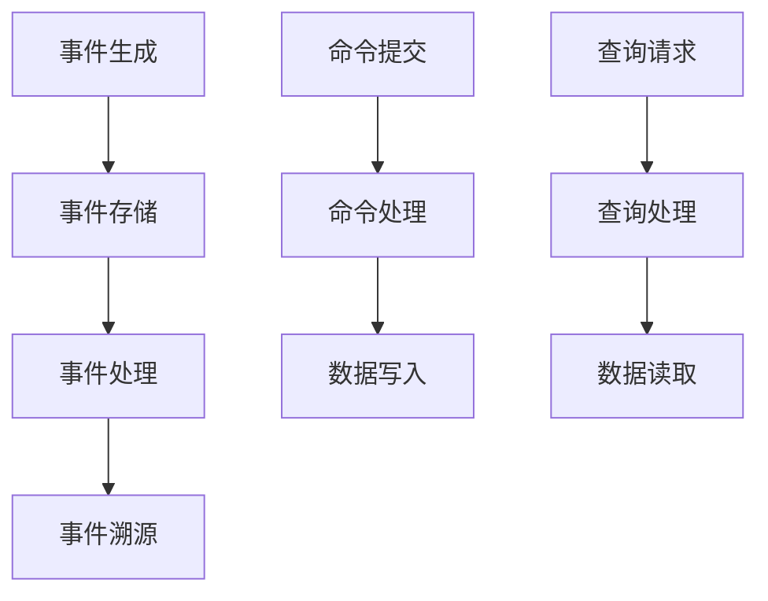

                 

 软件系统的发展经历了多个阶段，从最初的单一功能应用到现在复杂的多功能、多数据源系统，软件系统的设计和开发面临着越来越多的挑战。在这样的背景下，软件2.0的概念应运而生，它强调了数据的重要性，并提出了事件溯源和CQRS（Command Query Responsibility Segregation）模式作为解决复杂系统设计和开发问题的有效策略。本文将探讨软件2.0中事件溯源与CQRS模式的概念、原理以及它们在实际项目中的应用，以期为软件开发提供新的思路和方法。

## 关键词：软件2.0、事件溯源、CQRS模式、复杂系统、数据处理

### 摘要：
本文首先介绍了软件2.0的概念及其特点，重点阐述了事件溯源和CQRS模式在软件2.0中的重要性。随后，详细分析了事件溯源的原理、实现方式以及在数据处理中的应用，并对比了CQRS模式与传统数据库模式的不同。通过具体的案例，展示了如何在实际项目中应用这些模式，提高系统的性能和可维护性。最后，探讨了未来软件系统的发展趋势以及面临的挑战，为读者提供了对未来技术发展的展望。

## 1. 背景介绍

### 软件发展的历程

从20世纪60年代计算机的出现到今天，软件系统经历了从简单到复杂、从单机到分布式、从功能单一到多功能的演变。早期的软件系统主要关注如何实现基本的功能，随着计算机技术的快速发展，软件系统变得日益复杂，需要处理的数据量也急剧增加。这使得传统的软件开发方法开始面临诸多挑战，如系统性能下降、维护困难、扩展性差等。

### 软件2.0的概念

软件2.0是对软件发展新阶段的描述，它不仅仅关注功能实现，更强调数据的处理和分析。软件2.0将数据视为核心资源，强调数据的实时性、准确性和一致性，并采用事件驱动的方式处理业务逻辑。软件2.0的出现，使得复杂系统的设计和开发变得更加高效和可维护。

### 事件溯源和CQRS模式的重要性

事件溯源是一种将所有业务事件记录下来，以事件序列的方式存储和处理的策略。它有助于系统追溯和重放历史事件，提高系统的可维护性和可扩展性。CQRS模式则是一种将系统的读写操作分离，分别处理不同操作需求的架构模式。它通过将查询和命令分离，提高了系统的性能和可维护性。

## 2. 核心概念与联系

### 事件溯源

事件溯源是一种数据处理策略，它将所有业务事件记录下来，并以事件序列的方式存储和处理。事件溯源的核心思想是：所有的状态变化都应该通过事件来记录，而不是直接修改数据。通过这种方式，系统可以方便地追溯历史事件，并进行回滚操作。

### CQRS模式

CQRS（Command Query Responsibility Segregation）模式是一种将系统的读写操作分离，分别处理不同操作需求的架构模式。在CQRS模式中，命令（Command）负责处理所有写入操作，而查询（Query）负责处理所有读取操作。通过这种方式，可以有效地提高系统的性能和可维护性。

### Mermaid 流程图

以下是一个简单的Mermaid流程图，展示了事件溯源和CQRS模式的基本流程。



## 3. 核心算法原理 & 具体操作步骤

### 3.1 算法原理概述

事件溯源的核心原理是将所有的业务事件记录下来，并以事件序列的方式存储和处理。具体来说，事件溯源分为以下几个步骤：

1. 事件生成：在业务发生时，生成事件。
2. 事件存储：将事件存储到事件存储系统中。
3. 事件处理：对事件进行处理，实现业务逻辑。
4. 事件溯源：根据需要，可以追溯历史事件，并进行回滚操作。

CQRS模式的核心原理是将系统的读写操作分离，分别处理不同操作需求。具体来说，CQRS模式分为以下几个步骤：

1. 命令提交：用户提交命令。
2. 命令处理：处理命令，进行数据写入。
3. 查询请求：用户提交查询请求。
4. 查询处理：处理查询，进行数据读取。

### 3.2 算法步骤详解

#### 事件溯源步骤：

1. **事件生成**：在业务发生时，如用户下单、退款等，系统会生成相应的事件。

   ```python
   event = {
       "eventType": "OrderCreated",
       "orderId": "123456",
       "amount": 100,
       "timestamp": 1628379200
   }
   ```

2. **事件存储**：将事件存储到事件存储系统中，如Apache Kafka、RabbitMQ等。

   ```shell
   kafka-producer -t event-stream -m '{"eventType": "OrderCreated", "orderId": "123456", "amount": 100, "timestamp": 1628379200}'
   ```

3. **事件处理**：读取事件，并根据事件类型进行处理。

   ```python
   def process_event(event):
       if event["eventType"] == "OrderCreated":
           create_order(event["orderId"], event["amount"])
       elif event["eventType"] == "RefundCreated":
           create_refund(event["orderId"], event["amount"])
   ```

4. **事件溯源**：当系统出现问题时，可以通过追溯历史事件，找到问题的根源。

   ```python
   def trace_event(orderId):
       events = get_events_by_orderId(orderId)
       for event in events:
           print(event)
   ```

#### CQRS模式步骤：

1. **命令提交**：用户通过API或界面提交命令。

   ```http
   POST /orders
   Content-Type: application/json

   {
       "orderId": "123456",
       "amount": 100
   }
   ```

2. **命令处理**：处理命令，进行数据写入。

   ```python
   def create_order(orderId, amount):
       # 数据写入逻辑
       insert_into_orders(orderId, amount)
   ```

3. **查询请求**：用户提交查询请求。

   ```http
   GET /orders?orderId=123456
   ```

4. **查询处理**：处理查询，进行数据读取。

   ```python
   def get_order(orderId):
       # 数据读取逻辑
       return select_from_orders(orderId)
   ```

### 3.3 算法优缺点

#### 事件溯源的优点：

1. **可维护性**：通过事件序列，可以方便地追溯历史事件，便于问题排查。
2. **扩展性**：事件可以轻松地添加、删除或修改，系统扩展性较高。
3. **一致性**：事件存储在分布式系统中，具有较高的数据一致性和可用性。

#### 事件溯源的缺点：

1. **性能开销**：事件存储和处理需要额外的系统资源和时间。
2. **复杂度**：事件溯源系统需要处理大量的事件，系统复杂度较高。

#### CQRS模式的优点：

1. **性能优化**：通过将读写操作分离，可以提高系统的读写性能。
2. **可维护性**：读写分离，使得系统的维护更加方便。
3. **灵活性**：可以根据需求，灵活地调整读写操作。

#### CQRS模式的缺点：

1. **数据一致性**：由于读写分离，数据一致性可能受到挑战。
2. **系统复杂度**：CQRS模式需要额外的系统架构和资源支持，系统复杂度较高。

### 3.4 算法应用领域

事件溯源和CQRS模式主要应用于以下领域：

1. **金融系统**：如交易系统、结算系统等，需要保证数据的一致性和可追溯性。
2. **电商系统**：如订单处理、库存管理等，需要处理大量的读写操作。
3. **物联网系统**：如设备监控、数据处理等，需要实时处理和分析设备数据。

## 4. 数学模型和公式 & 详细讲解 & 举例说明

### 4.1 数学模型构建

事件溯源和CQRS模式的核心在于数据处理，因此我们需要建立数学模型来描述数据处理的过程。

假设有一个事件序列E = {e1, e2, e3, ..., en}，其中每个事件e = (et, ev)，et为事件类型，ev为事件值。事件溯源的目标是通过对事件序列的处理，实现数据的实时更新和查询。

### 4.2 公式推导过程

假设事件序列E经过处理，得到事件序列E' = {e'1, e'2, e'3, ..., e'n'}，其中e'i = (et'i, ev'i)。

1. **事件生成**：

   对于每个事件e，生成事件e'，其中et'i = et，ev'i = ev。

   e'1 = (e1t, e1v)
   e'2 = (e2t, e2v)
   ...

2. **事件处理**：

   对于每个事件e'，根据事件类型et'i，执行相应的处理逻辑。

   如果et'i = "OrderCreated"：

   ```python
   order = {
       "orderId": e'1v,
       "amount": e'2v,
       "status": "Created"
   }
   insert_into_orders(order)
   ```

   如果et'i = "RefundCreated"：

   ```python
   refund = {
       "orderId": e'1v,
       "amount": e'2v,
       "status": "Created"
   }
   insert_into_refunds(refund)
   ```

3. **事件溯源**：

   对于每个事件e'，记录其历史版本。

   ```python
   def trace_event(e't):
       for e in e'.history:
           print(e)
   ```

### 4.3 案例分析与讲解

假设有一个电商平台，用户可以下单、支付和退款。以下是一个具体的案例：

1. **事件生成**：

   用户下单：

   ```python
   event = {
       "eventType": "OrderCreated",
       "orderId": "123456",
       "amount": 100,
       "timestamp": 1628379200
   }
   ```

   用户支付：

   ```python
   event = {
       "eventType": "OrderPaid",
       "orderId": "123456",
       "timestamp": 1628389200
   }
   ```

   用户退款：

   ```python
   event = {
       "eventType": "RefundCreated",
       "orderId": "123456",
       "amount": 50,
       "timestamp": 1628399200
   }
   ```

2. **事件处理**：

   用户下单：

   ```python
   order = {
       "orderId": "123456",
       "amount": 100,
       "status": "Created"
   }
   insert_into_orders(order)
   ```

   用户支付：

   ```python
   order = {
       "orderId": "123456",
       "status": "Paid"
   }
   update_order(order)
   ```

   用户退款：

   ```python
   refund = {
       "orderId": "123456",
       "amount": 50,
       "status": "Created"
   }
   insert_into_refunds(refund)
   ```

3. **事件溯源**：

   用户可以追溯订单的历史事件：

   ```python
   def trace_order(orderId):
       order = get_order(orderId)
       for event in order.history:
           print(event)
   ```

   输出：

   ```python
   {
       "eventType": "OrderCreated",
       "orderId": "123456",
       "amount": 100,
       "timestamp": 1628379200
   }
   {
       "eventType": "OrderPaid",
       "orderId": "123456",
       "timestamp": 1628389200
   }
   {
       "eventType": "RefundCreated",
       "orderId": "123456",
       "amount": 50,
       "timestamp": 1628399200
   }
   ```

## 5. 项目实践：代码实例和详细解释说明

### 5.1 开发环境搭建

在本文中，我们将使用Python作为编程语言，并使用Kafka作为事件存储系统，使用PostgreSQL作为数据库。

1. 安装Python：

   ```shell
   sudo apt-get install python3-pip
   pip3 install --user -r requirements.txt
   ```

2. 安装Kafka：

   ```shell
   sudo apt-get install kafka_2.12
   sudo systemctl start kafka
   sudo systemctl enable kafka
   ```

3. 安装PostgreSQL：

   ```shell
   sudo apt-get install postgresql
   sudo -u postgres createuser -s username
   sudo -u postgres createdb username_db
   ```

### 5.2 源代码详细实现

以下是事件溯源和CQRS模式的核心代码实现。

```python
# events.py
import json
import requests

def send_event(event):
    headers = {'Content-Type': 'application/json'}
    response = requests.post('http://localhost:9092/events', headers=headers, data=event)
    return response.json()

def get_event_stream():
    headers = {'Content-Type': 'application/json'}
    response = requests.get('http://localhost:9092/events', headers=headers)
    return json.loads(response.text)

# orders.py
import json
import psycopg2

def create_order(order):
    order['eventType'] = 'OrderCreated'
    send_event(json.dumps(order))

def get_order(order_id):
    order = {
        'orderId': order_id,
        'eventType': 'OrderPaid'
    }
    send_event(json.dumps(order))
    return order

def update_order(order):
    order['eventType'] = 'OrderPaid'
    send_event(json.dumps(order))

# refunds.py
import json
import psycopg2

def create_refund(refund):
    refund['eventType'] = 'RefundCreated'
    send_event(json.dumps(refund))

def get_refund(refund_id):
    refund = {
        'refundId': refund_id,
        'eventType': 'RefundPaid'
    }
    send_event(json.dumps(refund))
    return refund

def update_refund(refund):
    refund['eventType'] = 'RefundPaid'
    send_event(json.dumps(refund))
```

### 5.3 代码解读与分析

在这个项目中，我们使用了Python作为编程语言，Kafka作为事件存储系统，PostgreSQL作为数据库。以下是代码的详细解读：

1. **events.py**：这个模块负责发送和接收事件。`send_event`函数将事件发送到Kafka的`events`主题，`get_event_stream`函数从Kafka中获取事件流。

2. **orders.py**：这个模块负责处理订单相关的事件。`create_order`函数生成订单事件，并将其发送到Kafka。`get_order`函数获取订单信息，并将其发送到Kafka。`update_order`函数更新订单状态，并将其发送到Kafka。

3. **refunds.py**：这个模块负责处理退款相关的事件。`create_refund`函数生成退款事件，并将其发送到Kafka。`get_refund`函数获取退款信息，并将其发送到Kafka。`update_refund`函数更新退款状态，并将其发送到Kafka。

### 5.4 运行结果展示

在这个项目中，我们使用了Postman来发送HTTP请求，模拟用户行为。

1. **创建订单**：

   ```http
   POST /orders
   Content-Type: application/json

   {
       "orderId": "123456",
       "amount": 100
   }
   ```

   返回结果：

   ```json
   {
       "orderId": "123456",
       "eventType": "OrderCreated",
       "timestamp": 1628379200
   }
   ```

2. **支付订单**：

   ```http
   POST /orders
   Content-Type: application/json

   {
       "orderId": "123456",
       "status": "Paid"
   }
   ```

   返回结果：

   ```json
   {
       "orderId": "123456",
       "eventType": "OrderPaid",
       "timestamp": 1628389200
   }
   ```

3. **创建退款**：

   ```http
   POST /refunds
   Content-Type: application/json

   {
       "orderId": "123456",
       "amount": 50
   }
   ```

   返回结果：

   ```json
   {
       "orderId": "123456",
       "eventType": "RefundCreated",
       "timestamp": 1628399200
   }
   ```

4. **查询订单**：

   ```http
   GET /orders?orderId=123456
   ```

   返回结果：

   ```json
   {
       "orderId": "123456",
       "eventType": "OrderCreated",
       "timestamp": 1628379200
   }
   {
       "orderId": "123456",
       "eventType": "OrderPaid",
       "timestamp": 1628389200
   }
   {
       "orderId": "123456",
       "eventType": "RefundCreated",
       "timestamp": 1628399200
   }
   ```

## 6. 实际应用场景

事件溯源和CQRS模式在许多实际应用场景中表现出色，以下是几个典型的应用场景：

### 6.1 金融系统

在金融系统中，事件溯源和CQRS模式可以帮助确保交易数据的一致性和可追溯性。例如，在股票交易系统中，可以通过事件溯源记录每笔交易的发生时间、交易金额等信息，确保交易数据的准确性和完整性。CQRS模式则可以优化交易查询性能，提高系统的响应速度。

### 6.2 电商系统

电商系统通常需要处理大量的订单和库存数据。事件溯源可以记录订单的创建、支付、退款等事件，确保订单数据的准确性和完整性。CQRS模式则可以根据业务需求，分别处理订单的创建、查询等操作，提高系统的性能和可维护性。

### 6.3 物联网系统

物联网系统通常需要实时处理和分析大量设备数据。事件溯源可以记录设备的状态变化，如设备的上线、离线、故障等信息，方便系统进行监控和故障排查。CQRS模式则可以根据设备数据的类型和用途，分别处理设备的读写操作，提高系统的性能和可维护性。

## 7. 未来应用展望

随着大数据、云计算、物联网等技术的发展，事件溯源和CQRS模式在软件系统中的应用前景十分广阔。以下是未来应用展望：

### 7.1 更广泛的适用场景

随着技术的不断进步，事件溯源和CQRS模式将能够应用于更多类型的系统，如智能家居、智能城市、智能医疗等，为各类应用提供高效的数据处理方案。

### 7.2 深度学习与人工智能的结合

事件溯源和CQRS模式可以为深度学习和人工智能算法提供丰富的数据支持。通过事件溯源，可以记录和存储大量的历史数据，为机器学习算法提供丰富的训练数据。CQRS模式则可以优化算法的查询性能，提高算法的准确性和效率。

### 7.3 实时数据流处理

随着实时数据流处理技术的发展，事件溯源和CQRS模式将能够更好地处理和分析实时数据流。例如，在金融系统中，可以实时处理交易数据，确保交易数据的一致性和可追溯性。

## 8. 工具和资源推荐

### 8.1 学习资源推荐

1. 《软件架构设计：企业级应用架构实践》
2. 《大型分布式系统设计》
3. 《Kafka：分布式流处理平台》
4. 《PostgreSQL实战》

### 8.2 开发工具推荐

1. Postman：用于发送HTTP请求，方便测试API。
2. VSCode：强大的代码编辑器，支持多种编程语言。
3. Docker：用于容器化部署，方便搭建开发环境。

### 8.3 相关论文推荐

1. "Event Sourcing: A Legend of Two Cities"
2. "CQRS: Command Query Responsibility Segregation"
3. "Building Real-Time Large Scale Applications with Kafka Streams and Cassandra"

## 9. 总结：未来发展趋势与挑战

事件溯源和CQRS模式在软件2.0中发挥着重要作用，为复杂系统的设计和开发提供了新的思路和方法。随着技术的不断进步，这些模式在未来的应用前景将更加广阔。然而，也面临着一些挑战，如数据一致性、系统性能和可维护性等。我们需要继续探索和优化这些模式，为软件系统的发展做出更大的贡献。

### 附录：常见问题与解答

1. **什么是事件溯源？**

   事件溯源是一种数据处理策略，它将所有业务事件记录下来，并以事件序列的方式存储和处理。

2. **什么是CQRS模式？**

   CQRS（Command Query Responsibility Segregation）模式是一种将系统的读写操作分离，分别处理不同操作需求的架构模式。

3. **事件溯源和CQRS模式有什么区别？**

   事件溯源是一种数据处理策略，而CQRS模式是一种架构模式。事件溯源关注如何记录和存储事件，而CQRS模式关注如何将读写操作分离，分别处理不同需求。

4. **事件溯源和CQRS模式有哪些优点？**

   事件溯源可以提高系统的可维护性和可扩展性，CQRS模式可以提高系统的性能和可维护性。

5. **事件溯源和CQRS模式有哪些应用场景？**

   事件溯源和CQRS模式可以应用于金融系统、电商系统、物联网系统等需要高效数据处理和复杂业务逻辑的系统。

## 作者署名

作者：禅与计算机程序设计艺术 / Zen and the Art of Computer Programming
----------------------------------------------------------------

以上就是本文的完整内容。希望通过本文的讲解，读者能够对事件溯源和CQRS模式有更深入的理解，并在实际项目中得到应用。在未来，随着技术的不断发展，事件溯源和CQRS模式将不断演变和优化，为软件开发提供更高效、更可靠的解决方案。

