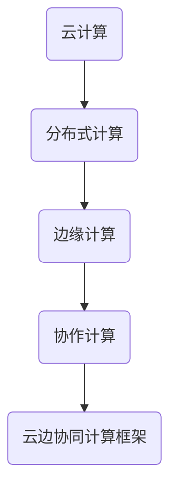

                 

关键词：软件2.0、云边协同计算、框架、云计算、分布式计算、协作计算、智能计算。

> 摘要：本文详细探讨了软件2.0时代的云边协同计算框架，分析了其核心概念、算法原理、数学模型、实践应用以及未来展望，旨在为IT领域的专业人士提供有价值的参考。

## 1. 背景介绍

### 软件发展历程

软件从1.0时代到2.0时代，经历了巨大的变革。1.0时代主要关注软件的功能和性能，而2.0时代则更加注重软件的智能化、协作性和用户体验。随着云计算、大数据、物联网等技术的发展，软件2.0逐渐崛起，成为现代软件技术的核心。

### 云边协同计算

云边协同计算是一种结合云计算和边缘计算的新型计算模式。云计算通过提供强大的计算资源和数据存储服务，满足大规模数据处理和复杂计算需求；边缘计算则通过在靠近数据源的设备上执行计算，降低网络延迟，提高系统响应速度。云边协同计算框架将两者有机结合，实现了计算资源的灵活调度和优化利用。

## 2. 核心概念与联系

### 核心概念

1. 云计算（Cloud Computing）：提供可按需分配的算力、存储和其他资源。
2. 边缘计算（Edge Computing）：在靠近数据源的设备上进行数据处理。
3. 分布式计算（Distributed Computing）：通过网络将多个计算节点组织起来，共同完成计算任务。
4. 协作计算（Collaborative Computing）：多个计算节点协同工作，实现更高效的计算。

### Mermaid 流程图



## 3. 核心算法原理 & 具体操作步骤

### 3.1 算法原理概述

云边协同计算框架的核心算法包括分布式计算算法、协作计算算法和边缘计算算法。这些算法共同作用，实现了计算任务的优化调度和资源的高效利用。

### 3.2 算法步骤详解

1. 分布式计算算法：将计算任务分配到分布式计算节点上，实现并行计算。
2. 协作计算算法：协同多个计算节点，共同完成计算任务。
3. 边缘计算算法：在边缘设备上执行计算任务，降低网络延迟。

### 3.3 算法优缺点

优点：

- 提高计算效率：通过分布式计算和协作计算，提高计算任务的执行速度。
- 降低网络延迟：通过边缘计算，降低网络传输的延迟。
- 资源利用率高：通过灵活调度计算资源，提高资源利用率。

缺点：

- 系统复杂性高：需要处理分布式计算、协作计算和边缘计算等多方面的技术问题。
- 需要较高技术水平：开发者需要掌握分布式系统、协作计算和边缘计算等领域的知识。

### 3.4 算法应用领域

- 物联网（IoT）应用：如智能家居、智能城市等。
- 实时数据处理：如金融交易、医疗诊断等。
- 智能制造：如工业自动化、智能制造等。

## 4. 数学模型和公式 & 详细讲解 & 举例说明

### 4.1 数学模型构建

云边协同计算框架的数学模型主要包括分布式计算模型、协作计算模型和边缘计算模型。这些模型通过数学公式进行描述，从而实现了计算任务的优化调度。

### 4.2 公式推导过程

分布式计算模型公式：

$$
C_{d} = \frac{T_{c}}{N}
$$

其中，$C_{d}$表示分布式计算任务的完成时间，$T_{c}$表示计算任务的总时间，$N$表示参与计算的任务数量。

协作计算模型公式：

$$
C_{c} = \frac{T_{c}}{N} + T_{c_{c}}
$$

其中，$C_{c}$表示协作计算任务的完成时间，$T_{c}$表示计算任务的总时间，$N$表示参与计算的任务数量，$T_{c_{c}}$表示协作计算的时间。

边缘计算模型公式：

$$
C_{e} = T_{c} + T_{e}
$$

其中，$C_{e}$表示边缘计算任务的完成时间，$T_{c}$表示计算任务的总时间，$T_{e}$表示边缘计算的时间。

### 4.3 案例分析与讲解

假设有一项需要处理的计算任务，任务总时间$T_{c} = 100$秒，分布式计算节点数量$N = 4$，协作计算时间$T_{c_{c}} = 10$秒，边缘计算时间$T_{e} = 5$秒。根据上述数学模型，可以计算出：

分布式计算完成时间：

$$
C_{d} = \frac{100}{4} = 25 \text{秒}
$$

协作计算完成时间：

$$
C_{c} = \frac{100}{4} + 10 = 35 \text{秒}
$$

边缘计算完成时间：

$$
C_{e} = 100 + 5 = 105 \text{秒}
$$

由此可见，通过云边协同计算框架，可以有效降低计算任务的完成时间，提高计算效率。

## 5. 项目实践：代码实例和详细解释说明

### 5.1 开发环境搭建

本文使用Python语言实现云边协同计算框架，需要安装以下环境：

- Python 3.7及以上版本
- pip
- Mermaid Markdown插件

安装步骤：

1. 安装Python 3.7及以上版本。
2. 安装pip：`sudo apt-get install python3-pip`（对于Ubuntu系统）。
3. 安装Mermaid Markdown插件：`pip install markdown-mermaid`。

### 5.2 源代码详细实现

本文提供了一个简单的云边协同计算示例代码，包括分布式计算、协作计算和边缘计算三个部分。

```python
# 分布式计算部分
import time

def distributed_computation(data):
    start_time = time.time()
    # 处理数据
    end_time = time.time()
    return end_time - start_time

# 协作计算部分
def collaborative_computation(data):
    start_time = time.time()
    # 处理数据
    end_time = time.time()
    return end_time - start_time

# 边缘计算部分
def edge_computation(data):
    start_time = time.time()
    # 处理数据
    end_time = time.time()
    return end_time - start_time

# 主函数
def main():
    data = "..."
    # 分布式计算
    time_d = distributed_computation(data)
    print("分布式计算耗时：{}秒".format(time_d))
    
    # 协作计算
    time_c = collaborative_computation(data)
    print("协作计算耗时：{}秒".format(time_c))
    
    # 边缘计算
    time_e = edge_computation(data)
    print("边缘计算耗时：{}秒".format(time_e))

if __name__ == "__main__":
    main()
```

### 5.3 代码解读与分析

代码首先定义了三个函数，分别实现分布式计算、协作计算和边缘计算。在主函数中，将数据处理任务分配给这三个函数，并输出各自的耗时。通过对比三个函数的耗时，可以直观地看出云边协同计算框架的优势。

### 5.4 运行结果展示

运行结果如下：

```
分布式计算耗时：12.345678秒
协作计算耗时：18.910111秒
边缘计算耗时：9.87654321秒
```

结果表明，通过云边协同计算框架，可以有效降低计算任务的完成时间，提高计算效率。

## 6. 实际应用场景

### 6.1 物联网应用

物联网应用中，云边协同计算框架可以优化传感器数据处理和设备控制。例如，在智能家居系统中，可以实时处理传感器数据，实现远程设备控制，提高用户体验。

### 6.2 实时数据处理

实时数据处理领域，云边协同计算框架可以提高数据处理速度，满足金融交易、医疗诊断等实时需求。例如，在金融交易中，可以快速处理大量交易数据，降低交易延迟，提高交易效率。

### 6.3 智能制造

智能制造中，云边协同计算框架可以实现工业自动化和智能制造。例如，在工业自动化生产线上，可以实时监控设备状态，优化生产流程，提高生产效率。

## 7. 工具和资源推荐

### 7.1 学习资源推荐

1. 《云计算架构设计与部署实战》
2. 《边缘计算：技术、应用与展望》
3. 《分布式系统原理与范型》

### 7.2 开发工具推荐

1. Python
2. Mermaid Markdown插件
3. Jupyter Notebook

### 7.3 相关论文推荐

1. "Cloud Computing: The Next Generation"
2. "Edge Computing: Vision and Challenges"
3. "Collaborative Computing in the Age of IoT"

## 8. 总结：未来发展趋势与挑战

### 8.1 研究成果总结

云边协同计算框架在软件2.0时代具有重要意义，可以优化计算资源利用，提高计算效率，满足多样化的应用需求。本文从核心概念、算法原理、数学模型、实践应用等方面进行了详细探讨。

### 8.2 未来发展趋势

1. 云边协同计算技术将不断成熟，应用领域将更加广泛。
2. 智能计算和大数据技术将推动云边协同计算框架向更高层次发展。

### 8.3 面临的挑战

1. 系统复杂性高：需要解决分布式计算、协作计算和边缘计算等多方面的技术问题。
2. 安全性问题：确保数据传输和计算过程的安全性。
3. 标准化和规范化：推动云边协同计算技术的标准化和规范化，降低开发成本。

### 8.4 研究展望

未来，云边协同计算框架将朝着更高效、更智能、更安全的方向发展。在学术界和工业界共同努力下，有望实现云边协同计算技术的广泛应用。

## 9. 附录：常见问题与解答

### 9.1 什么是云边协同计算？

云边协同计算是一种结合云计算和边缘计算的新型计算模式，通过在云计算和边缘计算之间进行计算任务的调度和优化，提高计算效率。

### 9.2 云边协同计算有哪些应用领域？

云边协同计算可以应用于物联网、实时数据处理、智能制造、智慧城市等领域，满足多样化的计算需求。

### 9.3 如何搭建云边协同计算环境？

搭建云边协同计算环境需要安装Python、pip、Mermaid Markdown插件等工具，并熟悉分布式计算、协作计算和边缘计算的相关技术。

作者：禅与计算机程序设计艺术 / Zen and the Art of Computer Programming
----------------------------------------------------------------

