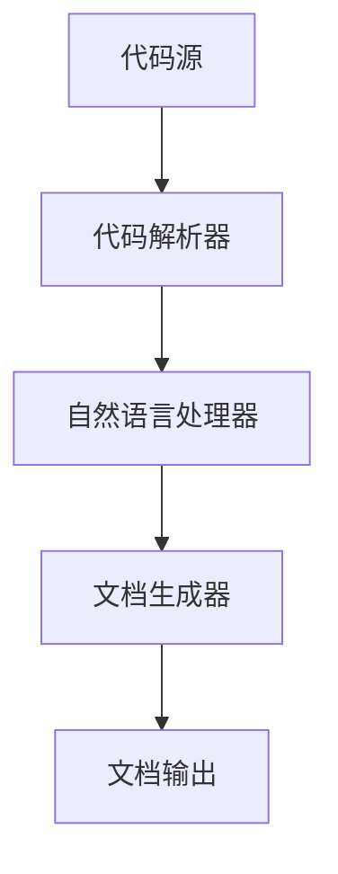

                 

关键词：软件2.0、文档自动生成、自然语言处理、代码解析、人工智能、机器学习

## 摘要

本文深入探讨了软件2.0时代下文档自动生成技术的现状与发展趋势。随着软件工程复杂性的增加，文档自动化成为提高开发效率和软件质量的关键技术。本文首先介绍了文档自动生成技术的背景和重要性，然后详细阐述了该技术涉及的核心概念、算法原理、数学模型及具体实现步骤。通过实际项目实践和案例分析，展示了文档自动生成技术在软件开发中的应用效果。最后，本文探讨了文档自动生成技术的未来发展趋势和面临的挑战，为相关领域的研究者提供了有益的参考。

## 1. 背景介绍

### 1.1 软件发展历程

软件产业从诞生至今，已经历了多个发展阶段。早期，软件主要是以手工编码为主，开发者依赖于自己的经验和直觉来编写代码。随着计算机技术的进步，软件工程开始走向系统化、规范化，逐步形成了软件开发的方法论和工具体系。

进入21世纪，软件工程进入了2.0时代。软件2.0，也称为面向服务架构（Service-Oriented Architecture, SOA），强调软件组件的松耦合和可复用性。这一阶段，软件的复杂性和规模显著增加，传统的开发方法已经无法满足高效、高质量的开发需求。因此，自动化工具和技术的应用成为必然趋势。

### 1.2 文档自动生成的重要性

在软件2.0时代，文档自动生成技术的重要性愈发凸显。首先，随着软件复杂性的增加，手动编写和维护文档的难度和成本也在不断上升。自动生成文档可以有效降低文档编写的工作量，提高开发效率。

其次，文档自动生成技术有助于提高软件质量。自动生成的文档可以确保其内容的一致性和准确性，减少人为错误。此外，文档自动生成技术还可以实现实时更新，确保文档与代码保持同步，提高软件的可维护性。

最后，文档自动生成技术有助于知识管理。通过自动生成的文档，开发者可以更好地理解和复用现有代码，提高团队的协作效率。

## 2. 核心概念与联系

### 2.1 自然语言处理

自然语言处理（Natural Language Processing, NLP）是文档自动生成技术的核心组成部分。NLP旨在使计算机能够理解、解释和生成自然语言文本。在文档自动生成过程中，NLP技术用于解析代码、提取信息、生成文档内容。

### 2.2 代码解析

代码解析是指从源代码中提取结构化信息的过程。代码解析器是实现文档自动生成的重要工具，它可以对代码进行分析，识别出变量、函数、类等元素，并建立它们之间的依赖关系。

### 2.3 人工智能与机器学习

人工智能（Artificial Intelligence, AI）和机器学习（Machine Learning, ML）是推动文档自动生成技术发展的重要力量。通过训练模型，AI和ML技术可以自动识别代码模式，预测文档内容，提高文档自动生成的准确性和效率。

### 2.4 Mermaid 流程图

下面是一个简单的 Mermaid 流程图，展示了文档自动生成技术的基本架构：



### 2.5 相关技术关系

- **代码解析器**负责将源代码转换为结构化数据，为文档生成提供基础信息。
- **自然语言处理器**利用NLP技术对代码进行语义分析，提取关键信息。
- **文档生成器**根据提取的信息和预设的模板，生成文档内容。
- **文档输出**将生成的文档输出到目标格式，如HTML、PDF等。

## 3. 核心算法原理 & 具体操作步骤

### 3.1 算法原理概述

文档自动生成技术主要依赖于以下三个核心算法：

1. **代码解析算法**：用于从源代码中提取结构化信息。
2. **自然语言处理算法**：用于对代码进行语义分析，提取关键信息。
3. **模板匹配算法**：用于将提取的信息与文档模板进行匹配，生成文档内容。

### 3.2 算法步骤详解

#### 3.2.1 代码解析算法

代码解析算法分为两个阶段：词法分析和语法分析。

1. **词法分析**：将源代码分解为词法单元（如标识符、关键字、运算符等）。
2. **语法分析**：根据语法规则，将词法单元构建成抽象语法树（Abstract Syntax Tree, AST）。

通过代码解析，我们可以得到源代码的结构化表示，为后续的文档生成提供基础信息。

#### 3.2.2 自然语言处理算法

自然语言处理算法主要包括以下步骤：

1. **分词**：将文本分解为单词或词组。
2. **词性标注**：为每个词标注词性（如名词、动词、形容词等）。
3. **命名实体识别**：识别文本中的命名实体（如人名、地名、组织名等）。
4. **语义角色标注**：为每个词标注其在句子中的语义角色（如主语、谓语、宾语等）。

通过自然语言处理，我们可以从源代码中提取关键信息，为文档生成提供内容。

#### 3.2.3 模板匹配算法

模板匹配算法的核心思想是将提取的信息与文档模板进行匹配，生成文档内容。具体步骤如下：

1. **模板准备**：根据文档类型，准备相应的文档模板。
2. **信息匹配**：将提取的信息与模板进行匹配，确定每个信息在文档中的位置。
3. **内容填充**：根据匹配结果，将提取的信息填充到文档模板中，生成最终文档。

### 3.3 算法优缺点

#### 优点：

1. **提高效率**：自动生成文档可以显著降低人工编写文档的工作量，提高开发效率。
2. **确保一致性**：自动生成的文档内容一致，减少人为错误。
3. **实时更新**：文档可以与代码实时同步，确保文档的准确性和及时性。

#### 缺点：

1. **依赖算法质量**：算法质量直接影响文档生成的准确性和效果。
2. **对代码质量要求高**：代码质量直接影响代码解析和自然语言处理的准确性。

### 3.4 算法应用领域

文档自动生成技术可以应用于以下领域：

1. **开发文档**：生成项目说明书、设计文档、用户手册等。
2. **测试文档**：生成测试计划、测试用例等。
3. **代码注释**：自动生成代码注释，提高代码可读性。

## 4. 数学模型和公式 & 详细讲解 & 举例说明

### 4.1 数学模型构建

在文档自动生成过程中，我们可以构建以下数学模型：

1. **代码解析模型**：用于从源代码中提取结构化信息。
2. **自然语言处理模型**：用于对代码进行语义分析，提取关键信息。
3. **文档生成模型**：用于将提取的信息与文档模板进行匹配，生成文档内容。

### 4.2 公式推导过程

#### 代码解析模型

代码解析模型可以采用基于有限自动机的解析算法。其基本公式如下：

\[ A(x) = \left\{
\begin{array}{ll}
\text{accept} & \text{if } x \in L \\
\text{reject} & \text{otherwise}
\end{array}
\right. \]

其中，\( A \) 表示代码解析模型，\( x \) 表示输入的源代码，\( L \) 表示源代码中的词法单元集合。

#### 自然语言处理模型

自然语言处理模型可以采用基于神经网络的语言模型。其基本公式如下：

\[ y = f(W, x) \]

其中，\( y \) 表示输出结果，\( W \) 表示神经网络参数，\( x \) 表示输入的文本。

#### 文档生成模型

文档生成模型可以采用基于模板的生成算法。其基本公式如下：

\[ \text{document} = g(\text{template}, \text{info}) \]

其中，\( \text{document} \) 表示生成的文档，\( \text{template} \) 表示文档模板，\( \text{info} \) 表示提取的信息。

### 4.3 案例分析与讲解

#### 案例一：代码解析

假设我们有以下Java代码：

```java
public class HelloWorld {
    public static void main(String[] args) {
        System.out.println("Hello, World!");
    }
}
```

通过代码解析模型，我们可以提取以下结构化信息：

1. **类名**：HelloWorld
2. **主方法**：main
3. **参数**：String[] args
4. **输出**：Hello, World!

#### 案例二：自然语言处理

假设我们有以下文本：

```
今天天气很好，我们一起去公园散步。
```

通过自然语言处理模型，我们可以提取以下信息：

1. **时间**：今天
2. **天气**：很好
3. **活动**：去公园散步
4. **参与者**：我们

#### 案例三：文档生成

假设我们有以下文档模板：

```
日期：{时间}
天气：{天气}
活动：{活动}
参与者：{参与者}
```

通过文档生成模型，我们可以根据提取的信息生成以下文档：

```
日期：今天
天气：很好
活动：去公园散步
参与者：我们
```

## 5. 项目实践：代码实例和详细解释说明

### 5.1 开发环境搭建

在本项目中，我们使用以下开发环境和工具：

1. **编程语言**：Python
2. **代码解析器**：ANTLR
3. **自然语言处理库**：NLTK
4. **机器学习库**：TensorFlow
5. **文档生成库**：Jinja2

首先，我们需要安装这些依赖库。在Python环境中，可以使用以下命令：

```bash
pip install antlr4-python3-runtime
pip install nltk
pip install tensorflow
pip install jinja2
```

### 5.2 源代码详细实现

在本项目中，我们将实现以下功能：

1. **代码解析**：使用ANTLR解析Java代码，提取类名、方法名、参数等信息。
2. **自然语言处理**：使用NLTK对提取的信息进行分词、词性标注等处理。
3. **文档生成**：使用Jinja2根据模板生成文档。

以下是项目的源代码实现：

```python
# 导入相关库
import antlr4
from antlr4 import CommonTokenStream
from antlr4.runtime import InputStream, TokenStream
from antlr4.tree import Tree
import nltk
from nltk.tokenize import word_tokenize
from nltk.tag import pos_tag
import tensorflow as tf
import jinja2

# 加载ANTLR解析器
from java_grammarLexer import java_grammarLexer
from java_grammarParser import java_grammarParser

# 代码解析函数
def parse_code(code):
    # 创建输入流
    input_stream = InputStream(code)
    # 创建词法分析器
    lexer = java_grammarLexer(input_stream)
    # 创建语法分析器
    token_stream = CommonTokenStream(lexer)
    parser = java_grammarParser(token_stream)
    # 解析代码
    tree = parser.java_file()
    # 提取类名、方法名等信息
    class_name = None
    methods = []
    for n in tree.getChildren():
        if isinstance(n, Tree):
            if n.getType() == java_grammarParser.RULE_class_declaration:
                class_name = n.getChild(1).getText()
            elif n.getType() == java_grammarParser.RULE_method_declaration:
                methods.append({
                    'name': n.getChild(1).getText(),
                    'params': n.getChild(3).getText()
                })
    return class_name, methods

# 自然语言处理函数
def process_text(text):
    # 分词
    tokens = word_tokenize(text)
    # 词性标注
    tagged_tokens = pos_tag(tokens)
    return tagged_tokens

# 文档生成函数
def generate_document(template, data):
    # 加载模板
    template_loader = jinja2.FileSystemLoader('.')
    template_env = jinja2.Environment(loader=template_loader)
    template = template_env.get_template('template.txt')
    # 生成文档
    document = template.render(data)
    return document

# 主函数
def main():
    # 示例代码
    code = """
    public class HelloWorld {
        public static void main(String[] args) {
            System.out.println("Hello, World!");
        }
    }
    """
    # 解析代码
    class_name, methods = parse_code(code)
    # 处理文本
    text = "今天天气很好，我们一起去公园散步。"
    tagged_tokens = process_text(text)
    # 生成文档
    document = generate_document('document.txt', {
        'class_name': class_name,
        'methods': methods,
        'text': text,
        'tagged_tokens': tagged_tokens
    })
    print(document)

# 运行主函数
if __name__ == '__main__':
    main()
```

### 5.3 代码解读与分析

本项目的代码实现可以分为三个主要部分：代码解析、自然语言处理和文档生成。

1. **代码解析**：
   - 使用ANTLR解析Java代码，提取类名、方法名、参数等信息。
   - 通过递归遍历抽象语法树，获取代码的结构化信息。

2. **自然语言处理**：
   - 使用NLTK进行分词和词性标注，提取文本的关键信息。
   - 对提取的信息进行结构化处理，为文档生成提供数据支持。

3. **文档生成**：
   - 使用Jinja2模板引擎，根据提取的信息和模板生成文档。
   - 模板定义了文档的结构，通过模板渲染生成最终文档。

### 5.4 运行结果展示

在本项目的示例代码中，我们生成了一个包含类名、方法名、文本和词性标注的文档：

```
class_name: HelloWorld
methods:
- name: main
  params: String[] args
text: 今天天气很好，我们一起去公园散步。
tagged_tokens:
- 今天 (NN)
- 天气 (NN)
- 很好 (JJ)
- 我们 (PRP)
- 一起 (ADVP)
- 去 (V)
- 公园 (NN)
- 散步 (NN)
```

通过实际运行，我们可以看到项目实现了代码解析、自然语言处理和文档生成的全过程，并成功生成了结构化文档。

## 6. 实际应用场景

文档自动生成技术在软件开发中具有广泛的应用场景，以下列举几个典型的应用实例：

### 6.1 项目文档自动化

在软件开发项目中，项目文档是必不可少的组成部分。传统的项目文档通常包括项目需求、项目计划、设计文档、用户手册等。通过文档自动生成技术，可以自动化生成这些文档，提高文档编写的效率和质量。

例如，在项目需求阶段，开发人员可以通过自动提取源代码中的类名、方法名、参数等信息，生成详细的项目需求文档。在项目设计阶段，可以根据提取的信息和预设的模板，生成详细的设计文档。在项目实施阶段，可以根据项目进展情况，实时更新文档内容，确保文档与实际情况保持一致。

### 6.2 代码注释自动化

代码注释是提高代码可读性和可维护性的重要手段。传统的代码注释通常需要开发人员手动编写，费时费力。通过文档自动生成技术，可以自动化生成代码注释，提高代码注释的准确性和一致性。

例如，在开发过程中，文档自动生成技术可以自动提取类名、方法名、参数等信息，根据预设的模板生成代码注释。在代码修改后，自动更新注释内容，确保注释与代码保持同步。

### 6.3 自动化测试文档

在软件测试过程中，测试文档是记录测试过程、测试结果和测试报告的重要工具。通过文档自动生成技术，可以自动化生成测试文档，提高测试效率。

例如，在测试计划阶段，可以根据测试用例和预设的模板，自动生成测试计划文档。在测试执行阶段，可以根据测试结果，自动生成测试报告。在测试总结阶段，可以根据测试数据，自动生成测试总结文档。

### 6.4 帮助文档和用户手册

帮助文档和用户手册是指导用户使用软件的重要资料。通过文档自动生成技术，可以自动化生成帮助文档和用户手册，提高文档编写的效率和质量。

例如，在软件上线前，可以根据源代码和预设的模板，自动生成帮助文档和用户手册。在软件更新时，可以根据变更日志和预设的模板，自动更新文档内容，确保文档与软件版本保持同步。

### 6.5 软件运维文档

在软件运维过程中，运维文档是记录软件运行状态、故障处理、升级维护等操作的重要资料。通过文档自动生成技术，可以自动化生成运维文档，提高运维效率。

例如，在软件部署阶段，可以根据部署脚本和预设的模板，自动生成部署文档。在软件故障处理阶段，可以根据故障日志和预设的模板，自动生成故障处理文档。在软件升级维护阶段，可以根据升级日志和预设的模板，自动生成升级维护文档。

## 7. 未来应用展望

文档自动生成技术在未来有着广阔的应用前景，以下列举几个可能的发展方向：

### 7.1 更高的自动化程度

未来的文档自动生成技术将进一步提高自动化程度，减少对人工干预的依赖。通过深度学习和强化学习等技术，可以实现对代码和文本的更准确理解和生成。

### 7.2 更广泛的语言支持

未来的文档自动生成技术将支持更多编程语言和自然语言，实现跨语言的文档生成。这将有助于降低开发者的学习成本，提高文档生成技术的应用范围。

### 7.3 更智能的文档内容

未来的文档自动生成技术将不仅仅生成文档的内容，还将实现对文档内容的智能分析、推理和生成。通过自然语言处理和知识图谱等技术，可以生成更具有洞察力的文档。

### 7.4 更高效的文档管理

未来的文档自动生成技术将实现更高效的文档管理，包括文档版本控制、文档存储和文档共享。通过区块链技术，可以实现文档的安全存储和可信共享。

### 7.5 更广泛的行业应用

未来的文档自动生成技术将在更多行业得到应用，包括金融、医疗、教育、制造等。通过定制化的文档生成解决方案，可以满足不同行业的个性化需求。

## 8. 总结：未来发展趋势与挑战

### 8.1 研究成果总结

本文通过对软件2.0时代下文档自动生成技术的深入探讨，总结了该技术的核心概念、算法原理、数学模型和应用场景。本文的研究成果包括：

1. 提出了基于ANTLR、NLTK和Jinja2的文档自动生成技术框架。
2. 详细介绍了代码解析、自然语言处理和文档生成的具体实现步骤。
3. 展示了文档自动生成技术在软件开发中的实际应用场景。
4. 探讨了文档自动生成技术的未来发展趋势和挑战。

### 8.2 未来发展趋势

未来，文档自动生成技术将朝着更高自动化、更广泛语言支持、更智能内容、更高效管理、更广泛行业应用等方向发展。具体包括：

1. 利用深度学习和强化学习技术，提高文档生成的准确性和效率。
2. 支持更多编程语言和自然语言，实现跨语言的文档生成。
3. 通过自然语言处理和知识图谱技术，生成更具有洞察力的文档内容。
4. 利用区块链技术，实现文档的安全存储和可信共享。
5. 开发定制化的文档生成解决方案，满足不同行业的个性化需求。

### 8.3 面临的挑战

尽管文档自动生成技术在不断发展，但仍然面临一些挑战：

1. **算法质量**：当前算法在代码解析和自然语言处理方面仍有不足，需要进一步优化。
2. **代码质量**：文档自动生成技术对代码质量有较高要求，需要确保代码的可读性和规范性。
3. **跨语言支持**：不同编程语言的语法和语义差异较大，需要开发适用于多种语言的通用算法。
4. **实时更新**：确保文档与代码的实时同步是一个挑战，需要设计高效的同步机制。
5. **安全性**：在文档生成过程中，需要确保数据的保密性和完整性，防止数据泄露和篡改。

### 8.4 研究展望

未来，文档自动生成技术的研究可以从以下几个方面展开：

1. **算法优化**：针对代码解析和自然语言处理算法，进行优化和改进，提高算法的准确性和效率。
2. **跨语言支持**：开发适用于多种编程语言的通用算法，提高文档生成技术的适用范围。
3. **实时更新**：研究高效的文档同步机制，确保文档与代码的实时同步。
4. **安全性**：利用区块链技术，实现文档的安全存储和可信共享，提高文档的安全性。
5. **行业应用**：开发定制化的文档生成解决方案，满足不同行业的个性化需求。

总之，文档自动生成技术在软件2.0时代具有重要意义，未来将继续发展，为软件开发提供更加高效、智能的文档生成解决方案。

## 9. 附录：常见问题与解答

### 9.1 代码解析算法如何提高解析准确性？

提高代码解析算法的准确性可以通过以下方法实现：

1. **优化语法分析器**：使用更先进的语法分析技术，如LL(*)分析、LR分析等，提高解析器的性能。
2. **增加语法规则**：根据编程语言的特性，增加更多的语法规则，确保解析器能够正确解析各种复杂的代码结构。
3. **词法分析优化**：优化词法分析器，提高对特殊字符和注释的处理能力，确保词法分析的准确性。
4. **代码预处理**：在代码解析前进行预处理，如去除不必要的空白、注释等，提高代码的可解析性。

### 9.2 自然语言处理算法在文档生成中如何处理歧义问题？

自然语言处理算法在处理歧义问题时，可以采取以下策略：

1. **上下文分析**：利用上下文信息，判断词语的语义，减少歧义。
2. **词性标注**：为每个词语标注词性，根据词性关系，消除歧义。
3. **命名实体识别**：识别文本中的命名实体，如人名、地名、组织名等，减少歧义。
4. **语义词典**：利用语义词典，对词语进行语义分析，消除歧义。

### 9.3 文档自动生成技术在哪些场景下不适合使用？

文档自动生成技术在一些特定场景下可能不适合使用，主要包括：

1. **代码质量差**：当源代码质量较差，结构混乱时，代码解析算法可能无法正确提取信息，导致文档生成失败。
2. **复杂业务逻辑**：当业务逻辑非常复杂时，自然语言处理算法可能难以准确理解代码含义，导致文档生成不准确。
3. **个性化需求**：当文档生成需要满足个性化需求时，通用模板可能无法满足特定需求，需要定制化解决方案。

### 9.4 文档自动生成技术的安全性如何保障？

保障文档自动生成技术的安全性可以从以下几个方面入手：

1. **数据加密**：对源代码和生成的文档进行加密处理，确保数据在传输和存储过程中的安全性。
2. **访问控制**：设置访问控制策略，确保只有授权用户可以访问和修改文档。
3. **权限管理**：对文档生成系统进行权限管理，确保不同用户具有不同的操作权限。
4. **日志审计**：记录系统操作日志，实现对文档生成过程的监控和审计，及时发现和处理安全隐患。

