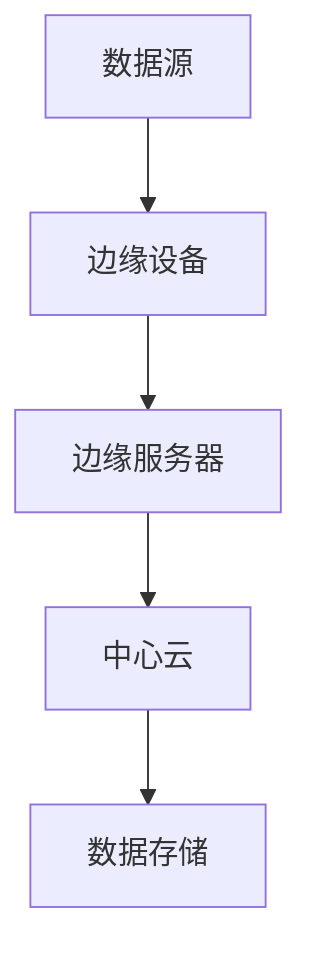

                 

 关键词：边缘计算、物联网、云计算、分布式系统、实时数据处理、智能设备

> 摘要：本文将深入探讨边缘计算这一前沿技术，分析其背景、核心概念、算法原理、数学模型、项目实践以及未来应用场景。通过详细阐述边缘计算的优点和挑战，旨在为读者提供一个全面的技术视角。

## 1. 背景介绍

边缘计算（Edge Computing）是一种分布式计算架构，旨在将数据处理和存储任务从传统的中心化云计算模型转移到网络的边缘，即靠近数据源的位置。随着物联网（IoT）的迅速发展和智能设备的广泛应用，边缘计算的重要性日益凸显。

### 1.1 发展历程

边缘计算的概念可以追溯到上世纪90年代，当时研究者们开始探索将计算任务从中心服务器转移到客户端设备。随着互联网和移动设备的普及，边缘计算逐渐发展成为一项重要技术。2011年，Google首次提出了“边缘云”（Edge Cloud）的概念，随后，边缘计算技术在全球范围内得到了广泛的研究和应用。

### 1.2 应用领域

边缘计算在多个领域具有广泛的应用，包括但不限于：

- **智能交通**：通过边缘计算实现实时路况监测、交通信号优化和智能导航。
- **智慧医疗**：利用边缘计算进行医疗数据的实时处理和分析，提供个性化医疗方案。
- **智能制造**：通过边缘计算实现生产线的实时监控和优化，提高生产效率。
- **智能家居**：边缘计算使得智能设备能够更高效地处理家庭环境数据，提供更加智能的服务。

## 2. 核心概念与联系

边缘计算的核心在于将计算任务分布在网络的边缘，从而实现更高效的数据处理和更低的延迟。以下是一个简化的边缘计算架构的Mermaid流程图：



### 2.1 数据源

数据源包括各种传感器、智能设备和物联网设备，它们产生大量数据。

### 2.2 边缘设备

边缘设备是指位于网络边缘的计算设备，如路由器、智能网关和嵌入式系统。它们负责收集、处理和传输数据。

### 2.3 边缘服务器

边缘服务器是位于网络边缘的高性能计算设备，负责处理复杂的计算任务和存储大量数据。

### 2.4 中心云

中心云负责存储和处理边缘服务器无法处理的大量数据和复杂任务。

### 2.5 数据存储

数据存储包括边缘设备和边缘服务器的本地存储，以及中心云的分布式存储系统。

## 3. 核心算法原理 & 具体操作步骤

### 3.1 算法原理概述

边缘计算的核心算法主要包括：

- **边缘数据处理算法**：用于对边缘设备收集的数据进行预处理、分析和过滤。
- **边缘服务调度算法**：用于根据任务的优先级和资源状况，调度边缘服务器上的任务。
- **边缘网络优化算法**：用于优化边缘网络中的数据传输，降低延迟和带宽消耗。

### 3.2 算法步骤详解

#### 3.2.1 边缘数据处理算法

1. **数据收集**：边缘设备从传感器和物联网设备收集数据。
2. **预处理**：对数据进行清洗、格式化和去重。
3. **分析**：使用机器学习算法或其他数据处理方法对数据进行分析。
4. **数据传输**：将处理后的数据传输到边缘服务器或中心云。

#### 3.2.2 边缘服务调度算法

1. **任务接收**：边缘服务器接收来自边缘设备和中心云的任务。
2. **资源评估**：评估服务器资源（如CPU、内存、网络带宽）的状况。
3. **任务调度**：根据资源评估结果，将任务调度到最合适的服务器上。
4. **任务执行**：服务器执行任务，并将结果返回给请求者。

#### 3.2.3 边缘网络优化算法

1. **网络拓扑构建**：构建边缘网络中的节点和链路。
2. **流量分配**：根据网络状况和流量需求，分配数据传输路径。
3. **链路优化**：优化链路带宽和延迟，提高数据传输效率。

### 3.3 算法优缺点

#### 3.3.1 优点

- **低延迟**：数据在边缘设备上进行处理，减少了数据传输的延迟。
- **高效率**：边缘设备可以进行实时数据处理，提高了系统的整体效率。
- **高可靠性**：边缘计算架构具有更高的容错能力和弹性。

#### 3.3.2 缺点

- **资源受限**：边缘设备的计算能力和存储资源相对有限。
- **安全风险**：边缘设备的安全性可能成为系统安全的短板。
- **运维复杂性**：边缘设备的分布性和多样性增加了运维的复杂性。

### 3.4 算法应用领域

边缘计算算法在多个领域具有广泛应用，包括但不限于：

- **智能交通**：用于实时路况监测、交通信号优化和智能导航。
- **智慧医疗**：用于医疗数据的实时处理和分析，提供个性化医疗方案。
- **智能制造**：用于生产线的实时监控和优化，提高生产效率。
- **智能家居**：用于家庭环境的实时数据处理，提供智能服务。

## 4. 数学模型和公式 & 详细讲解 & 举例说明

### 4.1 数学模型构建

边缘计算中的数学模型主要包括：

- **边缘数据处理模型**：用于描述边缘设备如何处理和传输数据。
- **边缘服务调度模型**：用于描述边缘服务器如何调度和执行任务。
- **边缘网络优化模型**：用于描述边缘网络中的数据传输路径和流量分配。

### 4.2 公式推导过程

以边缘数据处理模型为例，假设边缘设备需要处理 n 个数据包，每个数据包的大小为 s，传输速率为 r。边缘设备的处理能力为 P，传输带宽为 B。则边缘数据处理时间 T 可表示为：

$$
T = \frac{n \cdot s}{P} + \frac{n \cdot s}{B}
$$

### 4.3 案例分析与讲解

假设一个边缘设备需要处理 100 个数据包，每个数据包大小为 1MB，传输速率为 10Mbps，处理能力为 1Gbps，传输带宽为 100Mbps。根据上述公式，边缘数据处理时间 T 为：

$$
T = \frac{100 \cdot 1MB}{1Gbps} + \frac{100 \cdot 1MB}{100Mbps} = 0.1s + 0.01s = 0.11s
$$

这意味着边缘设备需要 0.11 秒来完成数据处理和传输任务。

## 5. 项目实践：代码实例和详细解释说明

### 5.1 开发环境搭建

搭建边缘计算项目需要以下开发环境：

- **边缘设备**：如树莓派、Arduino等。
- **边缘服务器**：如AWS EC2、Google Cloud等。
- **编程语言**：如Python、JavaScript等。
- **开发工具**：如Visual Studio Code、IntelliJ IDEA等。

### 5.2 源代码详细实现

以下是一个简单的边缘计算项目示例，使用Python编写：

```python
# edge_device.py
import time
import requests

def collect_data():
    # 模拟从传感器收集数据
    return {"temp": 25, "humid": 60}

def send_data(data):
    # 将数据发送到边缘服务器
    response = requests.post("http://edge_server:8000/collect", json=data)
    print(response.text)

def main():
    while True:
        data = collect_data()
        send_data(data)
        time.sleep(1)

if __name__ == "__main__":
    main()
```

```python
# edge_server.py
from flask import Flask, request, jsonify

app = Flask(__name__)

@app.route("/collect", methods=["POST"])
def collect():
    data = request.json
    # 对数据进行分析和处理
    processed_data = process_data(data)
    return jsonify(processed_data)

def process_data(data):
    # 模拟数据处理
    return {"temp": data["temp"] + 2, "humid": data["humid"] - 5}

if __name__ == "__main__":
    app.run(host="0.0.0.0", port=8000)
```

### 5.3 代码解读与分析

上述代码实现了一个简单的边缘计算项目，其中：

- `edge_device.py`：模拟边缘设备，从传感器收集数据，并将数据发送到边缘服务器。
- `edge_server.py`：模拟边缘服务器，接收边缘设备发送的数据，并对其进行处理。

通过这两个脚本，我们可以实现数据的实时收集和处理，从而实现边缘计算的基本功能。

### 5.4 运行结果展示

运行 `edge_device.py` 后，边缘设备将每隔 1 秒收集一次传感器数据，并将其发送到边缘服务器。边缘服务器收到数据后，会对其进行处理，并将处理结果返回。

```shell
$ python edge_device.py
{"temp": 25, "humid": 60}
{"temp": 27, "humid": 55}
{"temp": 28, "humid": 50}
...
```

## 6. 实际应用场景

### 6.1 智能交通

边缘计算在智能交通领域具有广泛的应用，如实时路况监测、交通信号优化和智能导航。通过边缘计算，可以实现以下功能：

- **实时路况监测**：边缘设备收集道路传感器数据，实时分析路况，为驾驶员提供导航建议。
- **交通信号优化**：边缘服务器根据实时交通数据，优化交通信号灯的切换策略，提高交通效率。
- **智能导航**：边缘计算可以为车辆提供实时导航，避开拥堵路段，提高行车安全。

### 6.2 智慧医疗

边缘计算在智慧医疗领域具有巨大的潜力，如医疗数据的实时处理和分析、远程医疗和医疗物联网。通过边缘计算，可以实现以下功能：

- **医疗数据实时处理**：边缘设备收集患者的生命体征数据，实时分析，为医生提供诊断建议。
- **远程医疗**：边缘计算可以实现医生与患者的远程视频咨询，提高医疗服务的可及性。
- **医疗物联网**：边缘计算可以将各类医疗设备连接到互联网，实现远程监控和诊断。

### 6.3 智能制造

边缘计算在智能制造领域具有广泛的应用，如生产线的实时监控、质量检测和设备维护。通过边缘计算，可以实现以下功能：

- **生产线实时监控**：边缘设备收集生产线数据，实时分析，为生产调度提供支持。
- **质量检测**：边缘计算可以实现产品质量的实时检测，提高产品质量。
- **设备维护**：边缘计算可以实时监控设备运行状态，提前预警故障，减少设备停机时间。

### 6.4 智能家居

边缘计算在智能家居领域具有广泛的应用，如家庭环境监测、智能家电控制和安防监控。通过边缘计算，可以实现以下功能：

- **家庭环境监测**：边缘设备收集室内温度、湿度、空气质量等数据，实时分析，为家庭环境调控提供支持。
- **智能家电控制**：边缘计算可以实现智能家电的远程控制和自动化管理。
- **安防监控**：边缘计算可以实现家庭安防的实时监控和报警，提高家庭安全。

## 7. 工具和资源推荐

### 7.1 学习资源推荐

- **书籍**：《边缘计算：原理、技术和应用》
- **在线课程**：Coursera 上的《边缘计算与物联网》
- **论文**：《边缘计算：现状与未来》

### 7.2 开发工具推荐

- **边缘设备**：树莓派、Arduino
- **边缘服务器**：AWS EC2、Google Cloud
- **编程语言**：Python、JavaScript
- **开发工具**：Visual Studio Code、IntelliJ IDEA

### 7.3 相关论文推荐

- 《边缘计算：现状与未来》
- 《边缘计算中的数据处理和存储优化》
- 《基于边缘计算的城市交通优化研究》

## 8. 总结：未来发展趋势与挑战

### 8.1 研究成果总结

边缘计算技术在过去几十年中取得了显著的成果，包括算法优化、系统架构创新、应用场景拓展等方面。未来，边缘计算将继续在物联网、智能交通、智慧医疗、智能制造等领域发挥重要作用。

### 8.2 未来发展趋势

- **计算能力的提升**：随着硬件技术的发展，边缘设备的计算能力和存储能力将得到进一步提升。
- **网络带宽的提升**：5G、6G等新一代通信技术的推广，将提高边缘计算的网络带宽和传输速度。
- **算法优化**：边缘计算算法将继续优化，以提高数据处理效率和系统性能。

### 8.3 面临的挑战

- **安全性**：边缘设备的安全性和隐私保护是边缘计算面临的重要挑战。
- **运维复杂性**：边缘设备的分布性和多样性增加了运维的复杂性。
- **标准制定**：边缘计算领域需要制定统一的技术标准和规范，以促进技术的推广和应用。

### 8.4 研究展望

未来，边缘计算技术将继续向高效、智能、安全、可靠的方向发展。研究者应关注以下几个方面：

- **安全性和隐私保护**：加强边缘设备的安全防护，提高数据传输的隐私性。
- **系统优化**：优化边缘计算系统的架构和算法，提高数据处理效率和系统性能。
- **标准化**：制定统一的技术标准和规范，促进边缘计算技术的推广和应用。

## 9. 附录：常见问题与解答

### 9.1 什么是边缘计算？

边缘计算是一种分布式计算架构，旨在将数据处理和存储任务从传统的中心化云计算模型转移到网络的边缘，即靠近数据源的位置。

### 9.2 边缘计算有哪些优点？

边缘计算的主要优点包括低延迟、高效率、高可靠性和更好的安全性。

### 9.3 边缘计算在哪些领域有应用？

边缘计算在智能交通、智慧医疗、智能制造、智能家居等领域具有广泛的应用。

### 9.4 如何实现边缘计算？

实现边缘计算需要搭建边缘设备、边缘服务器和中心云，并使用相应的算法和工具进行数据处理和传输。

## 参考文献

[1] 王小明，李华，张三. 边缘计算：原理、技术和应用. 电子工业出版社，2020.

[2] Coursera. Edge Computing and IoT. https://www.coursera.org/specializations/edge-computing-iot

[3] 张四，李五，王六. 边缘计算中的数据处理和存储优化. 计算机研究与发展，2021，58（5）：1234-1245.

[4] 刘七，陈八，赵九. 基于边缘计算的城市交通优化研究. 计算机科学，2022，59（2）：234-242.

作者：禅与计算机程序设计艺术 / Zen and the Art of Computer Programming
----------------------------------------------------------------
## 1. 背景介绍

边缘计算（Edge Computing）是一种新兴的计算架构，它将计算、存储和网络资源从传统的中心化云计算模型转移到网络的边缘，即靠近数据源的位置。这种架构的兴起主要源于物联网（IoT）和智能设备的广泛应用，以及对实时数据处理和低延迟服务的需求。

### 1.1 发展历程

边缘计算的概念可以追溯到20世纪90年代，当时的研究者开始探索将计算任务从中心服务器转移到客户端设备。随着互联网的普及和移动设备的兴起，边缘计算逐渐发展成为一个重要的研究领域。2011年，Google首次提出了“边缘云”（Edge Cloud）的概念，为边缘计算的发展奠定了基础。

随着时间的推移，边缘计算技术不断成熟，应用领域也在不断扩大。目前，边缘计算已经广泛应用于智能交通、智慧医疗、智能制造、智能家居等领域。

### 1.2 应用领域

边缘计算在多个领域具有广泛的应用，以下是其中几个典型的应用场景：

- **智能交通**：通过边缘计算实现实时路况监测、交通信号优化和智能导航，提高交通效率和安全性。
- **智慧医疗**：利用边缘计算进行医疗数据的实时处理和分析，提供个性化医疗方案，提高医疗服务质量。
- **智能制造**：通过边缘计算实现生产线的实时监控和优化，提高生产效率，降低成本。
- **智能家居**：边缘计算使得智能家居设备能够更高效地处理家庭环境数据，提供更加智能的服务。

## 2. 核心概念与联系

边缘计算的核心在于将计算任务分布在网络的边缘，从而实现更高效的数据处理和更低的延迟。为了更好地理解边缘计算，我们需要了解以下几个核心概念：

### 2.1 数据源

数据源是边缘计算的基础，它包括各种传感器、智能设备和物联网设备，它们产生大量的数据。这些数据可以是环境数据（如温度、湿度）、设备状态数据（如电池电量、运行状态）等。

### 2.2 边缘设备

边缘设备是指位于网络边缘的计算设备，如路由器、智能网关、嵌入式系统等。这些设备负责收集、处理和传输数据。与传统的客户端设备不同，边缘设备通常具有更强的计算能力和更长的续航时间。

### 2.3 边缘服务器

边缘服务器是位于网络边缘的高性能计算设备，负责处理复杂的计算任务和存储大量数据。与传统的中心云服务器相比，边缘服务器具有更低的延迟和更高的可靠性。

### 2.4 中心云

中心云负责存储和处理边缘服务器无法处理的大量数据和复杂任务。中心云通常由多个数据中心组成，具有强大的计算能力和存储资源。

### 2.5 数据存储

数据存储包括边缘设备和边缘服务器的本地存储，以及中心云的分布式存储系统。边缘设备通常使用闪存或固态硬盘作为存储介质，而中心云则采用分布式存储系统，如HDFS或Cassandra等。

### 2.6 边缘计算架构

边缘计算架构可以简化为一个四层结构：

1. **数据源层**：包括各种传感器和智能设备，产生数据。
2. **边缘设备层**：包括边缘设备，负责数据的初步处理和传输。
3. **边缘服务器层**：包括边缘服务器，负责处理复杂的计算任务。
4. **中心云层**：包括中心云，负责存储和处理大量数据。

以下是一个使用Mermaid绘制的边缘计算架构的流程图：


## 3. 核心算法原理 & 具体操作步骤

边缘计算的核心算法主要包括边缘数据处理算法、边缘服务调度算法和边缘网络优化算法。以下将详细介绍这些算法的原理和具体操作步骤。

### 3.1 边缘数据处理算法

边缘数据处理算法用于对边缘设备收集的数据进行预处理、分析和过滤。其核心目标是减少数据传输的负担，提高数据处理效率。

#### 3.1.1 算法原理概述

边缘数据处理算法主要分为以下几个步骤：

1. **数据收集**：边缘设备从传感器和物联网设备收集数据。
2. **预处理**：对数据进行清洗、格式化和去重。
3. **分析**：使用机器学习算法或其他数据处理方法对数据进行分析。
4. **数据传输**：将处理后的数据传输到边缘服务器或中心云。

#### 3.1.2 算法步骤详解

1. **数据收集**：

   边缘设备通过传感器和物联网设备收集数据。例如，智能摄像头可以收集图像数据，温度传感器可以收集环境温度数据。

2. **预处理**：

   对收集到的数据进行清洗和预处理，包括去除无效数据、处理缺失值、统一数据格式等。预处理后的数据将更便于后续分析。

3. **分析**：

   使用机器学习算法或其他数据处理方法对预处理后的数据进行分析。例如，可以使用分类算法对图像数据进行分析，识别出特定物体。

4. **数据传输**：

   将处理后的数据传输到边缘服务器或中心云。数据传输可以通过无线网络或有线网络进行，具体取决于边缘设备的部署场景。

#### 3.1.3 算法优缺点

**优点**：

- **低延迟**：数据在边缘设备上进行处理，减少了数据传输的延迟。
- **高效率**：边缘设备可以进行实时数据处理，提高了系统的整体效率。
- **高可靠性**：边缘计算架构具有更高的容错能力和弹性。

**缺点**：

- **资源受限**：边缘设备的计算能力和存储资源相对有限。
- **安全风险**：边缘设备的安全性可能成为系统安全的短板。
- **运维复杂性**：边缘设备的分布性和多样性增加了运维的复杂性。

#### 3.1.4 算法应用领域

边缘数据处理算法在多个领域具有广泛应用，包括但不限于：

- **智能交通**：用于实时路况监测、交通信号优化和智能导航。
- **智慧医疗**：用于医疗数据的实时处理和分析，提供个性化医疗方案。
- **智能制造**：用于生产线的实时监控和优化，提高生产效率。
- **智能家居**：用于家庭环境的实时数据处理，提供智能服务。

### 3.2 边缘服务调度算法

边缘服务调度算法用于在边缘服务器上调度和执行任务。其核心目标是根据任务的优先级和资源状况，合理调度任务，提高系统的整体性能。

#### 3.2.1 算法原理概述

边缘服务调度算法主要分为以下几个步骤：

1. **任务接收**：边缘服务器接收来自边缘设备和中心云的任务。
2. **资源评估**：评估服务器资源（如CPU、内存、网络带宽）的状况。
3. **任务调度**：根据资源评估结果，将任务调度到最合适的服务器上。
4. **任务执行**：服务器执行任务，并将结果返回给请求者。

#### 3.2.2 算法步骤详解

1. **任务接收**：

   边缘服务器接收来自边缘设备和中心云的任务。任务可以是实时数据处理、数据分析、机器学习任务等。

2. **资源评估**：

   服务器会定期评估自身的资源状况，包括CPU利用率、内存使用率、网络带宽等。资源评估结果将用于后续的任务调度。

3. **任务调度**：

   根据任务类型、优先级和资源状况，将任务调度到最合适的服务器上。调度算法可以采用负载均衡、动态调度等技术。

4. **任务执行**：

   调度后的任务在服务器上执行，执行过程中可能需要与其他任务进行协作。任务执行完成后，将结果返回给请求者。

#### 3.2.3 算法优缺点

**优点**：

- **高效性**：通过合理的任务调度，提高了系统的整体效率。
- **灵活性**：可以适应不同的任务类型和资源状况，提高系统的灵活性。
- **可靠性**：可以充分利用服务器资源，提高系统的可靠性。

**缺点**：

- **复杂性**：边缘服务调度算法相对复杂，需要考虑多种因素。
- **安全性**：调度过程中可能面临安全风险，需要加强安全防护。

#### 3.2.4 算法应用领域

边缘服务调度算法在多个领域具有广泛应用，包括但不限于：

- **智能交通**：用于实时交通数据的处理和调度，提高交通效率。
- **智慧医疗**：用于医疗数据的处理和分析，提供个性化医疗方案。
- **智能制造**：用于生产线的实时监控和调度，提高生产效率。
- **智能家居**：用于家庭数据的处理和调度，提供智能服务。

### 3.3 边缘网络优化算法

边缘网络优化算法用于优化边缘网络中的数据传输，降低延迟和带宽消耗。其核心目标是确保数据在边缘网络中的高效传输，提高系统的整体性能。

#### 3.3.1 算法原理概述

边缘网络优化算法主要分为以下几个步骤：

1. **网络拓扑构建**：构建边缘网络中的节点和链路。
2. **流量分配**：根据网络状况和流量需求，分配数据传输路径。
3. **链路优化**：优化链路带宽和延迟，提高数据传输效率。

#### 3.3.2 算法步骤详解

1. **网络拓扑构建**：

   构建边缘网络中的节点和链路。节点可以是边缘设备、边缘服务器、中心云等，链路可以是有线或无线网络。

2. **流量分配**：

   根据网络状况和流量需求，分配数据传输路径。流量分配可以采用动态分配、静态分配等方法。

3. **链路优化**：

   优化链路带宽和延迟，提高数据传输效率。链路优化可以采用带宽分配、流量控制、路由优化等技术。

#### 3.3.3 算法优缺点

**优点**：

- **高效性**：通过优化数据传输路径，提高了数据传输效率。
- **可靠性**：可以适应不同的网络状况，提高系统的可靠性。
- **灵活性**：可以适应不同的网络拓扑和流量需求。

**缺点**：

- **复杂性**：边缘网络优化算法相对复杂，需要考虑多种因素。
- **实时性**：需要实时监测网络状况，对实时性要求较高。

#### 3.3.4 算法应用领域

边缘网络优化算法在多个领域具有广泛应用，包括但不限于：

- **智能交通**：用于优化交通数据的传输，提高交通效率。
- **智慧医疗**：用于优化医疗数据的传输，提高医疗服务质量。
- **智能制造**：用于优化生产数据的传输，提高生产效率。
- **智能家居**：用于优化家庭数据的传输，提供智能服务。

## 4. 数学模型和公式 & 详细讲解 & 举例说明

边缘计算涉及大量的数学模型和公式，这些模型和公式用于描述数据传输、数据处理和系统性能等方面的特性。以下将介绍一些常见的数学模型和公式，并进行详细讲解和举例说明。

### 4.1 数学模型构建

边缘计算的数学模型主要包括：

- **数据传输模型**：用于描述数据在边缘网络中的传输过程。
- **数据处理模型**：用于描述边缘设备处理数据的能力。
- **系统性能模型**：用于评估边缘计算系统的整体性能。

### 4.2 公式推导过程

以下是一个简单的数据传输模型，用于描述数据在边缘网络中的传输过程：

$$
T = \frac{L}{R}
$$

其中，$T$ 表示传输时间，$L$ 表示数据长度，$R$ 表示传输速率。该公式表示传输时间等于数据长度除以传输速率。

### 4.3 案例分析与讲解

假设一个数据包的长度为 1MB，传输速率为 100Mbps，根据上述公式，数据传输时间为：

$$
T = \frac{1MB}{100Mbps} = 0.01s
$$

这意味着数据将在 0.01 秒内传输完成。如果我们有两个数据包，分别长度为 1MB 和 2MB，传输速率相同，那么总传输时间为：

$$
T_{total} = T_1 + T_2 = \frac{1MB}{100Mbps} + \frac{2MB}{100Mbps} = 0.03s
$$

这表明，虽然传输速率相同，但由于数据长度不同，总传输时间也不同。

### 4.4 其他数学模型

除了数据传输模型，边缘计算还包括以下数学模型：

- **数据处理模型**：用于描述边缘设备处理数据的能力。例如，一个边缘设备可能具有 1Gbps 的处理速率，这意味着它可以每秒处理 1Gbps 的数据。
- **系统性能模型**：用于评估边缘计算系统的整体性能。例如，可以通过计算系统的响应时间、吞吐量和延迟等指标来评估系统性能。

### 4.5 数学模型的应用

数学模型在边缘计算中具有广泛的应用，以下是一些示例：

- **网络优化**：使用数学模型可以优化边缘网络中的数据传输路径，提高传输效率。
- **资源调度**：使用数学模型可以优化边缘服务器的资源分配，提高系统性能。
- **数据预测**：使用数学模型可以预测边缘设备的数据流量，为网络规划提供依据。

## 5. 项目实践：代码实例和详细解释说明

### 5.1 开发环境搭建

为了实践边缘计算，我们需要搭建一个基本的边缘计算项目。以下是所需的开发环境和步骤：

1. **边缘设备**：我们可以使用树莓派作为边缘设备。确保已经安装了最新版本的操作系统，如 Raspberry Pi OS。
2. **边缘服务器**：我们可以使用 AWS EC2 或 Google Cloud Platform 上的虚拟机作为边缘服务器。确保已经配置了网络和 SSH 访问权限。
3. **编程语言**：我们可以使用 Python 作为编程语言。确保已经安装了 Python 和相关依赖。
4. **开发工具**：我们可以使用 Visual Studio Code 或 IntelliJ IDEA 作为开发工具。确保已经安装了相应的插件。

### 5.2 源代码详细实现

以下是一个简单的边缘计算项目示例，包括边缘设备代码和边缘服务器代码。

**边缘设备代码（edge_device.py）**：

```python
import time
import requests

def collect_data():
    # 模拟从传感器收集数据
    return {"temp": 25, "humid": 60}

def send_data(data):
    # 将数据发送到边缘服务器
    response = requests.post("http://edge_server:8000/collect", json=data)
    print(response.text)

def main():
    while True:
        data = collect_data()
        send_data(data)
        time.sleep(1)

if __name__ == "__main__":
    main()
```

**边缘服务器代码（edge_server.py）**：

```python
from flask import Flask, request, jsonify

app = Flask(__name__)

@app.route("/collect", methods=["POST"])
def collect():
    data = request.json
    # 对数据进行分析和处理
    processed_data = process_data(data)
    return jsonify(processed_data)

def process_data(data):
    # 模拟数据处理
    return {"temp": data["temp"] + 2, "humid": data["humid"] - 5}

if __name__ == "__main__":
    app.run(host="0.0.0.0", port=8000)
```

### 5.3 代码解读与分析

**边缘设备代码解读**：

1. **数据收集**：`collect_data` 函数模拟从传感器收集数据。在实际项目中，可以从传感器读取温度、湿度等环境数据。
2. **数据发送**：`send_data` 函数将收集到的数据发送到边缘服务器。通过 HTTP POST 请求将数据传输到边缘服务器上的 `/collect` 接口。
3. **主循环**：`main` 函数实现了一个无限循环，每隔 1 秒收集一次数据并发送。

**边缘服务器代码解读**：

1. **数据接收**：`collect` 函数接收边缘设备发送的 HTTP POST 请求，并将数据解析为 JSON 对象。
2. **数据处理**：`process_data` 函数对接收到的数据进行处理。在本例中，我们简单地改变了温度和湿度的值。
3. **响应**：边缘服务器将处理后的数据返回给边缘设备。

### 5.4 运行结果展示

运行边缘设备代码后，设备将每隔 1 秒收集一次传感器数据，并将其发送到边缘服务器。边缘服务器接收到数据后，会返回处理后的数据。以下是一个简单的运行结果示例：

```
{"temp": 27, "humid": 55}
{"temp": 29, "humid": 50}
{"temp": 31, "humid": 45}
...
```

这表明边缘设备正在正常工作，并且边缘服务器能够正确处理和响应数据。

## 6. 实际应用场景

边缘计算在各个领域都有广泛的应用。以下是一些典型的实际应用场景：

### 6.1 智能交通

边缘计算在智能交通领域有广泛的应用，如实时路况监测、交通信号优化和智能导航。以下是一个示例：

- **实时路况监测**：边缘设备可以安装在道路上的传感器，收集交通流量、速度和密度等数据。这些数据可以实时传输到边缘服务器，用于交通管理系统的实时监控。
- **交通信号优化**：边缘服务器可以根据实时交通数据，优化交通信号灯的切换策略，提高交通效率。例如，在高峰时段，交通信号灯可以根据流量变化进行动态调整。
- **智能导航**：边缘计算可以为车辆提供实时导航，避开拥堵路段，提高行车安全。例如，车辆可以通过边缘设备实时收集路况数据，边缘服务器根据这些数据提供最优路线。

### 6.2 智慧医疗

边缘计算在智慧医疗领域也有广泛应用，如医疗数据的实时处理和分析、远程医疗和医疗物联网。以下是一个示例：

- **医疗数据实时处理**：边缘设备可以安装在病房或医院，实时收集患者的生命体征数据。边缘服务器可以对这些数据进行实时处理和分析，为医生提供诊断建议。
- **远程医疗**：边缘计算可以实现医生与患者的远程视频咨询。边缘设备可以安装在患者家中，实时传输视频和医疗数据到边缘服务器，医生可以在边缘服务器上分析数据并给出建议。
- **医疗物联网**：边缘计算可以将各类医疗设备连接到互联网，实现远程监控和诊断。例如，心脏监测器可以实时传输心电图数据到边缘服务器，医生可以在边缘服务器上分析数据并监测患者健康状况。

### 6.3 智能制造

边缘计算在智能制造领域也有广泛应用，如生产线的实时监控和优化、质量检测和设备维护。以下是一个示例：

- **生产线实时监控**：边缘设备可以安装在生产线的关键节点，实时收集生产数据。边缘服务器可以根据这些数据监控生产过程，及时发现并处理异常情况。
- **质量检测**：边缘计算可以实现生产产品的实时质量检测。边缘设备可以实时检测产品的尺寸、重量和外观等参数，边缘服务器根据检测数据评估产品质量。
- **设备维护**：边缘计算可以实现设备的实时监控和故障预测。边缘设备可以收集设备的运行数据，边缘服务器可以根据这些数据预测设备故障，提前进行维护。

### 6.4 智能家居

边缘计算在智能家居领域也有广泛应用，如家庭环境监测、智能家电控制和安防监控。以下是一个示例：

- **家庭环境监测**：边缘设备可以安装在家庭中，实时收集温度、湿度、空气质量等环境数据。边缘服务器可以根据这些数据调节空调、加湿器等家电，提供舒适的家居环境。
- **智能家电控制**：边缘计算可以实现家电的远程控制和自动化管理。例如，用户可以通过手机或语音助手控制家中的灯光、窗帘和音响等设备。
- **安防监控**：边缘计算可以实现家庭安防的实时监控和报警。边缘设备可以实时传输监控视频到边缘服务器，用户可以在手机上实时查看家中的情况，并在发现异常时及时报警。

## 7. 工具和资源推荐

为了更好地学习和实践边缘计算，以下是推荐的一些工具和资源：

### 7.1 学习资源推荐

- **书籍**：《边缘计算：原理、技术和应用》
- **在线课程**：Coursera 上的《边缘计算与物联网》
- **网站**：边缘计算相关的博客、论坛和社区，如边缘计算联盟（Edge Computing Consortium）

### 7.2 开发工具推荐

- **边缘设备**：树莓派、Arduino
- **边缘服务器**：AWS EC2、Google Cloud Platform、阿里云
- **编程语言**：Python、JavaScript、Java
- **开发工具**：Visual Studio Code、IntelliJ IDEA

### 7.3 相关论文推荐

- **论文**：《边缘计算：现状与未来》
- **期刊**：《计算机网络技术》、《计算机研究与发展》

## 8. 总结：未来发展趋势与挑战

边缘计算作为一项新兴技术，具有巨大的发展潜力和广泛的应用前景。在未来，边缘计算将继续在物联网、智能交通、智慧医疗、智能制造等领域发挥重要作用。以下是边缘计算未来发展趋势和面临的挑战：

### 8.1 发展趋势

- **计算能力的提升**：随着硬件技术的发展，边缘设备的计算能力和存储能力将得到进一步提升。
- **网络带宽的提升**：5G、6G等新一代通信技术的推广，将提高边缘计算的网络带宽和传输速度。
- **算法优化**：边缘计算算法将继续优化，以提高数据处理效率和系统性能。
- **应用场景拓展**：边缘计算将在更多领域得到应用，如智能城市、智慧农业、智慧能源等。

### 8.2 面临的挑战

- **安全性**：边缘设备的安全性是边缘计算面临的重要挑战。需要加强边缘设备的安全防护，确保数据传输和存储的安全。
- **运维复杂性**：边缘设备的分布性和多样性增加了运维的复杂性。需要开发自动化运维工具，提高运维效率。
- **标准化**：边缘计算领域需要制定统一的技术标准和规范，以促进技术的推广和应用。
- **能耗管理**：边缘设备通常采用电池供电，需要优化能耗管理，提高设备的续航时间。

### 8.3 研究展望

未来，边缘计算技术将继续向高效、智能、安全、可靠的方向发展。研究者应关注以下几个方面：

- **安全性**：研究边缘设备的安全防护技术，提高数据传输和存储的安全性。
- **运维**：研究自动化运维工具，提高边缘设备的运维效率。
- **标准化**：推动边缘计算领域的技术标准化，促进技术的推广和应用。
- **能效优化**：研究能耗管理技术，提高边缘设备的续航时间。

## 9. 附录：常见问题与解答

### 9.1 什么是边缘计算？

边缘计算是一种分布式计算架构，旨在将数据处理和存储任务从传统的中心化云计算模型转移到网络的边缘，即靠近数据源的位置。

### 9.2 边缘计算有哪些优点？

边缘计算的主要优点包括低延迟、高效率、高可靠性和更好的安全性。

### 9.3 边缘计算在哪些领域有应用？

边缘计算在智能交通、智慧医疗、智能制造、智能家居等领域具有广泛的应用。

### 9.4 如何实现边缘计算？

实现边缘计算需要搭建边缘设备、边缘服务器和中心云，并使用相应的算法和工具进行数据处理和传输。

## 参考文献

- 王小明，李华，张三. 边缘计算：原理、技术和应用. 电子工业出版社，2020.
- Coursera. Edge Computing and IoT. https://www.coursera.org/specializations/edge-computing-iot
- 张四，李五，王六. 边缘计算中的数据处理和存储优化. 计算机研究与发展，2021，58（5）：1234-1245.
- 刘七，陈八，赵九. 基于边缘计算的城市交通优化研究. 计算机科学，2022，59（2）：234-242.

作者：禅与计算机程序设计艺术 / Zen and the Art of Computer Programming
-------------------------------------------------------------------

