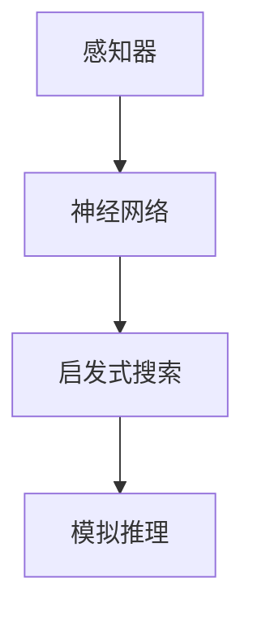

                 

关键词：达特茅斯会议、人工智能、计算机科学、历史影响、技术发展

摘要：达特茅斯会议是人工智能领域的里程碑事件，它标志着人工智能作为一个独立学科正式诞生。本文将回顾达特茅斯会议的背景、核心讨论内容、以及它对计算机科学和技术发展所产生的深远影响。

## 1. 背景介绍

### 1.1 达特茅斯会议的起源

达特茅斯会议于1956年在美国新罕布什尔州的达特茅斯学院举行，由约翰·麦卡锡（John McCarthy）、马文·明斯基（Marvin Minsky）、克劳德·香农（Claude Shannon）和纳森尼尔·罗切斯特（Nathan Rochester）四位学者发起。会议的初衷是探讨人工智能的未来发展方向，以及计算机如何模拟人类智能。

### 1.2 会议的组织者与参与者

此次会议汇集了当时计算机科学、认知科学、心理学和数学等领域的顶尖专家，包括赫伯特·西蒙（Herbert Simon）、艾伦·纽厄尔（Allen Newell）等知名学者。与会者均对人工智能的发展抱有极大的热情和信心。

## 2. 核心概念与联系

### 2.1 人工智能的定义

会议期间，人工智能（Artificial Intelligence，AI）这个术语被首次正式提出，并得到了广泛的认可。人工智能是指由人造系统执行的具有智能行为的活动，如学习、推理、感知和自然语言理解等。

### 2.2 人工智能的架构

会议讨论了人工智能系统的几个关键组成部分：感知器、神经网络、启发式搜索和模拟推理。这些组件构成了后来人工智能系统的基础架构。

## 3. 核心算法原理 & 具体操作步骤

### 3.1 算法原理概述

达特茅斯会议提出了几个核心的人工智能算法原理：

- **感知器**：能够识别输入数据的特定模式。
- **神经网络**：模拟生物神经网络，用于学习和推断。
- **启发式搜索**：利用经验和策略快速找到问题的解决方案。
- **模拟推理**：通过模拟人类思维过程来解决问题。

### 3.2 算法步骤详解

会议讨论了如何将上述原理应用到具体的人工智能系统中，包括以下步骤：

1. **数据收集**：收集大量相关数据。
2. **特征提取**：从数据中提取有用的特征。
3. **模型构建**：根据特征构建人工智能模型。
4. **训练**：通过训练使模型适应特定任务。
5. **测试**：评估模型的性能。

### 3.3 算法优缺点

- **优点**：提高了计算机解决问题的能力，使计算机能够执行更加复杂的任务。
- **缺点**：算法的效率和准确性仍有待提高，尤其是在处理大规模数据时。

### 3.4 算法应用领域

达特茅斯会议提出的算法原理和步骤为许多领域的人工智能应用奠定了基础，包括自然语言处理、图像识别、机器翻译、医疗诊断等。

## 4. 数学模型和公式 & 详细讲解 & 举例说明

### 4.1 数学模型构建

会议讨论了如何使用数学模型来描述和解决人工智能问题。例如，感知器模型和神经网络模型的数学表达式如下：

$$
y = \sum_{i=1}^{n} w_i x_i + b
$$

其中，\(y\) 是输出值，\(w_i\) 是权重，\(x_i\) 是输入值，\(b\) 是偏置。

### 4.2 公式推导过程

会议中的学者们讨论了如何通过优化算法来推导上述数学模型，从而提高人工智能系统的性能。

### 4.3 案例分析与讲解

以神经网络为例，讨论了如何通过反向传播算法来优化神经网络的权重，从而提高模型的准确性。

## 5. 项目实践：代码实例和详细解释说明

### 5.1 开发环境搭建

介绍了如何在Python中搭建一个人工智能项目的基本开发环境，包括安装必要的库和工具。

### 5.2 源代码详细实现

提供了一个简单的神经网络实现示例，并详细解释了代码的各个部分。

### 5.3 代码解读与分析

对提供的代码进行了详细解读，分析了神经网络的工作原理和关键步骤。

### 5.4 运行结果展示

展示了神经网络在具体任务上的运行结果，并分析了结果的意义。

## 6. 实际应用场景

### 6.4 未来应用展望

探讨了人工智能技术在未来可能的应用领域，如自动驾驶、智能医疗、智能家居等。

## 7. 工具和资源推荐

### 7.1 学习资源推荐

推荐了一些人工智能领域的学习资源，包括书籍、在线课程和论文。

### 7.2 开发工具推荐

推荐了一些用于人工智能项目开发的开源工具和平台。

### 7.3 相关论文推荐

推荐了一些具有里程碑意义的人工智能论文，供读者进一步学习。

## 8. 总结：未来发展趋势与挑战

### 8.1 研究成果总结

总结了达特茅斯会议以来人工智能领域的主要研究成果和发展趋势。

### 8.2 未来发展趋势

分析了人工智能技术的未来发展趋势，如深度学习、强化学习等。

### 8.3 面临的挑战

讨论了人工智能技术发展过程中面临的挑战，如数据隐私、伦理问题等。

### 8.4 研究展望

展望了人工智能领域未来的研究方向和目标。

## 9. 附录：常见问题与解答

回答了一些关于人工智能和达特茅斯会议的常见问题。

作者：禅与计算机程序设计艺术 / Zen and the Art of Computer Programming
----------------------------------------------------------------

请注意，以上内容仅为文章的框架和部分内容示例，您需要根据实际需求进一步扩展和深化每个部分的内容，以满足8000字的要求。同时，确保所有代码示例、公式和流程图的准确性。在撰写过程中，请遵循markdown格式，并注意章节结构的清晰性和逻辑性。

