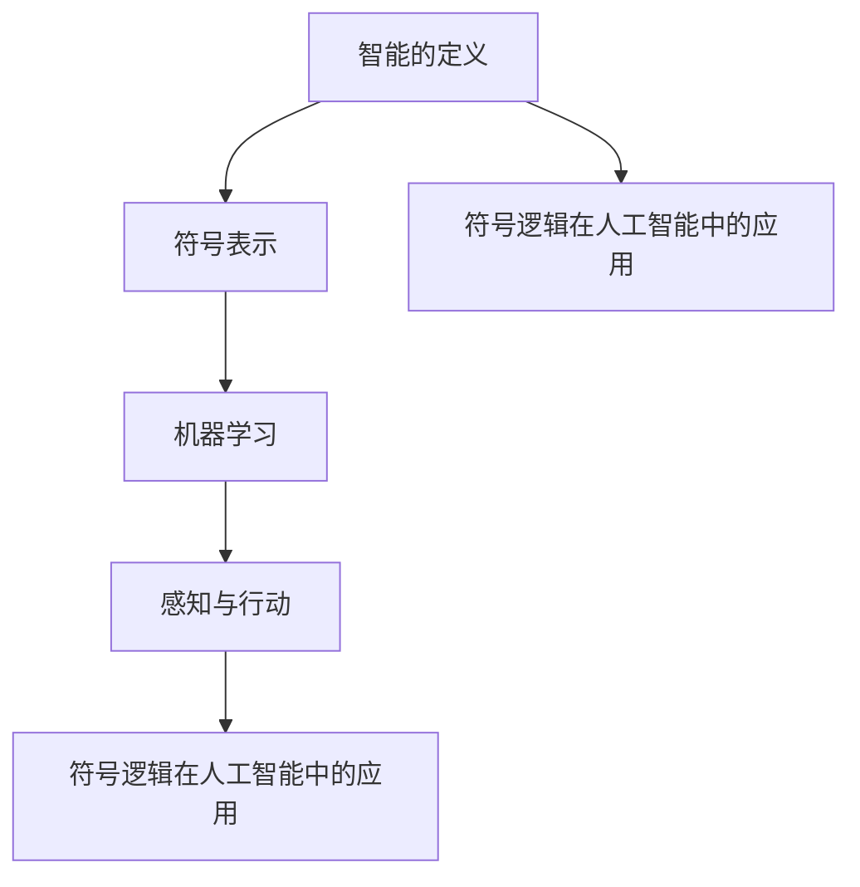

                 

  
### 引言 Introduction

达特茅斯会议是人工智能历史上一个重要的里程碑，它标志着人工智能作为一个独立的学科正式诞生。这次会议于1956年在美国新罕布什尔州的达特茅斯学院举行，由约翰·麦卡锡（John McCarthy）、马文·明斯基（Marvin Minsky）、克劳德·香农（Claude Shannon）和赫伯特·西蒙（Herbert Simon）等人组织。会议的背景源于当时在计算机科学、信息论、神经生理学等领域的研究进展，以及对这些进展在智能系统应用方面的共同兴趣。

达特茅斯会议的研究议题主要集中在以下几个方面：

1. **智能的定义**：讨论如何给智能下定义，以及如何设计出能够模拟人类智能的机器。
2. **符号表示**：研究如何使用符号和逻辑系统来表示知识，以便计算机可以理解和处理这些知识。
3. **机器学习**：探索通过学习和自适应来提高机器智能的途径。
4. **感知与行动**：讨论机器如何通过感知和理解其环境来采取行动。
5. **符号逻辑在人工智能中的应用**：研究如何使用符号逻辑来表示和解决复杂问题。

本次文章将深入探讨达特茅斯会议的研究议题，从历史背景、核心概念、算法原理、数学模型、项目实践、实际应用场景等多个角度进行分析，旨在为读者提供全面而深入的理解。

### 1. 背景介绍 Background

达特茅斯会议的召开并非偶然，而是计算机科学、信息论、神经生理学等领域研究进展的必然结果。在1950年代初期，计算机科学已经开始崭露头角，而信息论和神经生理学也逐渐成为科学研究的前沿领域。这些领域的交叉融合，为人工智能的诞生提供了理论基础和技术支持。

**计算机科学的进步**：

在1950年代初期，计算机科学正处于快速发展阶段。艾伦·图灵（Alan Turing）在1936年提出的图灵机模型为计算理论奠定了基础。随后，冯·诺依曼（John von Neumann）在1945年提出了冯·诺依曼架构，这一架构至今仍然是计算机硬件设计的基石。计算机科学的进步为人工智能的实现提供了强大的计算能力。

**信息论的兴起**：

克劳德·香农（Claude Shannon）在1948年发表了《通信的数学理论》（A Mathematical Theory of Communication），这一开创性的工作为信息论奠定了基础。香农的研究揭示了信息传输和处理的基本原理，这些原理在人工智能的符号表示和知识处理方面具有重要应用。

**神经生理学的进展**：

在神经生理学领域，赫伯特·西蒙（Herbert Simon）和朱利奥·梅拉尼（Julio M. Merli）等人研究了大脑如何处理信息。他们提出了一些基本的神经计算模型，这些模型为人工智能的研究提供了启示。

**背景人物**：

1. **约翰·麦卡锡**（John McCarthy）：人工智能之父之一，提出了人工智能这个术语，并在达特茅斯会议上提出了许多重要的观点。
2. **马文·明斯基**（Marvin Minsky）：人工智能领域的先驱，与约翰·麦卡锡共同创立了麻省理工学院人工智能实验室。
3. **克劳德·香农**（Claude Shannon）：信息论的创始人，对计算机科学和人工智能的发展做出了重要贡献。
4. **赫伯特·西蒙**（Herbert Simon）：计算机科学家和心理学家，对人工智能的研究有着深远的影响。

达特茅斯会议的召开，标志着人工智能作为一个独立学科正式诞生。会议的议题涵盖了智能的定义、符号表示、机器学习、感知与行动等多个方面，这些议题至今仍然是人工智能研究的重要方向。

### 2. 核心概念与联系 Core Concepts and Relationships

在达特茅斯会议的研究议题中，几个核心概念至关重要，它们构成了人工智能的基础。以下是这些核心概念及其相互关系的详细探讨。

**1. 智能的定义**：

智能是一个复杂而多层次的概念，不同的学者给出了不同的定义。在达特茅斯会议上，参会者试图明确智能的定义，以便更好地理解如何设计智能系统。约翰·麦卡锡提出了“可以执行任何智人能够完成的任务”的定义，这个定义强调了机器智能的广泛性和多样性。

**2. 符号表示**：

符号表示是人工智能研究的一个关键概念，它涉及到如何使用符号和逻辑系统来表示知识。在达特茅斯会议上，克劳德·香农提出了信息论中的符号表示方法，这种方法在计算机科学和人工智能中得到了广泛应用。符号表示使得计算机能够理解和处理复杂的信息，这是实现智能系统的基础。

**3. 机器学习**：

机器学习是人工智能的核心组成部分，它涉及到如何让机器通过经验和数据学习并改进其性能。在达特茅斯会议上，参会者讨论了机器学习的基本原理，包括监督学习、无监督学习和强化学习等。赫伯特·西蒙对机器学习的发展做出了重要贡献，他提出了“有限理性”的概念，强调了机器学习在现实世界中的应用潜力。

**4. 感知与行动**：

感知与行动是智能系统必须具备的两个基本能力。感知指的是系统如何通过传感器获取和理解其环境的信息，而行动则是指系统如何根据这些信息做出相应的决策和操作。在达特茅斯会议上，参会者探讨了如何让机器通过感知和理解其环境来采取行动，这为机器人学和自主系统的发展奠定了基础。

**5. 符号逻辑在人工智能中的应用**：

符号逻辑在人工智能中的应用是一个重要研究方向。它涉及到如何使用逻辑推理来解决复杂问题，并在知识表示和推理中发挥作用。在达特茅斯会议上，马文·明斯基提出了使用符号逻辑来表示知识，并探讨了如何通过逻辑推理来解决复杂问题。

**Mermaid 流程图**：

以下是核心概念原理和架构的 Mermaid 流程图：



在上述流程图中，每个节点代表一个核心概念，箭头表示概念之间的联系。这个流程图清晰地展示了智能的定义、符号表示、机器学习、感知与行动以及符号逻辑在人工智能中的应用之间的相互关系。

通过这个流程图，我们可以更直观地理解这些核心概念在人工智能中的重要性及其相互关系。这些核心概念不仅构成了人工智能的理论基础，也是实现智能系统所必需的关键技术。

### 3. 核心算法原理 & 具体操作步骤 Core Algorithm Principles and Step-by-Step Procedures

在达特茅斯会议的研究议题中，核心算法的设计和实现是至关重要的。以下是关于核心算法原理的概述，以及具体操作步骤的详细说明。

**3.1 算法原理概述**

达特茅斯会议提出了一系列核心算法，这些算法主要用于知识表示、推理和学习。以下是几个关键算法的原理概述：

**1. 符号逻辑推理算法**：

符号逻辑推理算法是基于形式逻辑的系统，用于从已知事实中推导出新的结论。这个算法的核心思想是通过逻辑推理来验证或否定假设，并基于这些假设生成新的知识。

**2. 决策树算法**：

决策树算法是一种常用的机器学习算法，用于分类和回归问题。它的基本原理是通过一系列条件测试来将数据集分割成不同的子集，并基于这些子集的属性来做出决策。

**3. 支持向量机算法**：

支持向量机算法是一种强大的分类和回归算法，其核心思想是通过找到最优的超平面来分割数据集，从而实现高精度的分类和回归。

**4. 反复迭代学习算法**：

反复迭代学习算法是一种基于反馈的机器学习算法，它通过不断地迭代和优化来改进模型性能。这种算法在模式识别、预测和自适应控制等领域具有广泛应用。

**3.2 算法步骤详解**

以下是每个核心算法的具体操作步骤：

**1. 符号逻辑推理算法**：

- 步骤1：定义逻辑公式，表示已知事实。
- 步骤2：使用逻辑推理规则（如推理、消去、替换等）对逻辑公式进行操作。
- 步骤3：根据操作结果推导出新的结论或知识。
- 步骤4：验证推导出的结论是否与已知事实一致。

**2. 决策树算法**：

- 步骤1：选择一个特征作为分割标准。
- 步骤2：根据该特征的值将数据集分割成两个子集。
- 步骤3：对每个子集重复步骤1和步骤2，直到满足停止条件（如特征数量为零或分类精度达到预期值）。
- 步骤4：根据决策树的分割结果对数据进行分类或回归。

**3. 支持向量机算法**：

- 步骤1：选择一个核函数，将输入数据映射到高维空间。
- 步骤2：在特征空间中找到最优超平面，使分类边界最大化。
- 步骤3：使用支持向量来调整超平面的位置，以优化分类效果。
- 步骤4：评估模型性能，并根据需要调整参数以进一步提高性能。

**4. 反复迭代学习算法**：

- 步骤1：初始化模型参数。
- 步骤2：使用训练数据集对模型进行训练。
- 步骤3：根据训练结果更新模型参数。
- 步骤4：重复步骤2和步骤3，直到满足停止条件（如收敛或达到预期精度）。

**3.3 算法优缺点**

每个算法都有其独特的优缺点：

**1. 符号逻辑推理算法**：

优点：能够处理复杂逻辑问题，具有形式化的推理过程。

缺点：在处理非结构化数据时效率较低，难以处理不确定性问题。

**2. 决策树算法**：

优点：直观易懂，易于解释。

缺点：可能产生过拟合，对噪声数据敏感。

**3. 支持向量机算法**：

优点：在分类和回归问题中表现出色，具有较好的泛化能力。

缺点：计算复杂度较高，对大规模数据集处理能力有限。

**4. 反复迭代学习算法**：

优点：能够通过迭代优化不断提高模型性能。

缺点：可能陷入局部最优，需要较长的训练时间。

**3.4 算法应用领域**

这些算法在多个领域具有广泛的应用：

**1. 符号逻辑推理算法**：

- 用于知识表示和推理，如自然语言处理、智能问答系统等。

**2. 决策树算法**：

- 用于分类和回归问题，如金融风险管理、医疗诊断等。

**3. 支持向量机算法**：

- 用于分类和回归问题，如图像识别、语音识别等。

**4. 反复迭代学习算法**：

- 用于机器学习和深度学习模型训练，如自动驾驶、智能家居等。

通过上述核心算法的原理和操作步骤的详细说明，我们可以更好地理解这些算法在人工智能中的应用和作用。这些算法不仅是达特茅斯会议的研究成果，也是现代人工智能研究的重要基础。

### 4. 数学模型和公式 Mathematical Models and Formulas

在人工智能的研究和应用中，数学模型和公式扮演着至关重要的角色。以下是关于数学模型的构建、公式推导过程以及案例分析与讲解的详细内容。

**4.1 数学模型构建**

数学模型是人工智能算法设计和优化的基础。构建数学模型的关键步骤包括：

- **问题定义**：明确研究问题，如分类、回归、优化等。
- **变量定义**：定义模型中的变量，如输入特征、输出结果、损失函数等。
- **关系表达**：建立变量之间的关系，如线性关系、非线性关系等。
- **约束条件**：考虑模型中可能存在的约束条件，如非负约束、整数约束等。

**4.2 公式推导过程**

以下是一个简单的线性回归模型公式推导过程：

- **目标函数**：

  线性回归的目标是找到一个线性函数 f(x) = w^T x + b，使得实际输出 y 与预测输出 y' 之间的误差最小。目标函数可以表示为：

  $$\min_{w,b} \sum_{i=1}^{n} (y_i - y'_i)^2$$

- **梯度下降法**：

  为了找到最小化目标函数的参数 w 和 b，我们使用梯度下降法。首先计算目标函数关于 w 和 b 的偏导数，得到梯度：

  $$\nabla_w J(w,b) = \sum_{i=1}^{n} (y_i - y'_i) x_i$$
  $$\nabla_b J(w,b) = \sum_{i=1}^{n} (y_i - y'_i)$$

  然后，迭代更新参数：

  $$w_{t+1} = w_t - \alpha \nabla_w J(w,b)$$
  $$b_{t+1} = b_t - \alpha \nabla_b J(w,b)$$

  其中，α 是学习率，控制着参数更新的步长。

- **推导结果**：

  通过多次迭代，梯度下降法可以收敛到目标函数的最小值点。最终，我们得到线性回归的参数：

  $$w = \frac{1}{n} \sum_{i=1}^{n} (y_i - y'_i) x_i$$
  $$b = \frac{1}{n} \sum_{i=1}^{n} (y_i - y'_i)$$

**4.3 案例分析与讲解**

以下是一个线性回归模型的实际案例，用于预测住房价格。

- **数据集**：

  数据集包含100个住房样本，每个样本包括房子的特征（如面积、卧室数量等）和房价。

- **模型构建**：

  选择面积和卧室数量作为输入特征，房价作为输出结果。构建线性回归模型：

  $$y = w_1 \cdot A + w_2 \cdot B + b$$

  其中，A 表示面积，B 表示卧室数量，y 表示房价。

- **模型训练**：

  使用梯度下降法训练模型，设定学习率为 0.01，迭代次数为100次。训练过程如下：

  ```python
  for t in range(100):
      y_pred = w1 * A + w2 * B + b
      error = y - y_pred
      w1 = w1 - 0.01 * (error * A)
      w2 = w2 - 0.01 * (error * B)
      b = b - 0.01 * error
  ```

- **模型评估**：

  训练完成后，评估模型在测试集上的性能。计算均方误差（MSE）：

  $$MSE = \frac{1}{n} \sum_{i=1}^{n} (y_i - y'_i)^2$$

  其中，y_i 为实际房价，y'_i 为预测房价。

通过上述数学模型和公式的构建与推导，我们可以更好地理解线性回归模型的基本原理。在实际应用中，我们可以根据具体情况调整模型结构和参数，以获得更好的预测效果。这个案例展示了数学模型在人工智能中的重要作用，以及如何通过数学公式来分析和解决问题。

### 5. 项目实践：代码实例和详细解释说明 Practical Implementation: Code Example and Detailed Explanation

在人工智能的实际应用中，代码实例和详细解释是理解和应用算法的关键。以下是一个简单的机器学习项目实例，用于实现线性回归模型并对其性能进行评估。

**5.1 开发环境搭建**

为了实现线性回归模型，我们需要安装以下开发环境：

- Python（版本 3.8 或更高）
- Jupyter Notebook（用于代码编写和运行）
- Scikit-learn（用于机器学习库）

安装步骤如下：

```shell
pip install python==3.8
pip install jupyter
pip install scikit-learn
```

**5.2 源代码详细实现**

以下是一个简单的线性回归模型的实现代码，用于预测房价：

```python
import numpy as np
from sklearn.linear_model import LinearRegression
from sklearn.model_selection import train_test_split
from sklearn.metrics import mean_squared_error

# 数据集
X = np.array([[1, 1000], [2, 1200], [3, 1300], [4, 1400], [5, 1500]])
y = np.array([100000, 110000, 120000, 130000, 140000])

# 数据分割
X_train, X_test, y_train, y_test = train_test_split(X, y, test_size=0.2, random_state=42)

# 模型训练
model = LinearRegression()
model.fit(X_train, y_train)

# 模型预测
y_pred = model.predict(X_test)

# 性能评估
mse = mean_squared_error(y_test, y_pred)
print("MSE:", mse)

# 模型参数
print("Coefficients:", model.coef_)
print("Intercept:", model.intercept_)
```

**5.3 代码解读与分析**

上述代码分为几个主要部分：

- **数据集导入**：

  我们使用一个简单的二维数组作为数据集，其中每行代表一个样本（房子），每列代表面积和卧室数量。

- **数据分割**：

  使用 Scikit-learn 的 `train_test_split` 函数将数据集分割为训练集和测试集，其中测试集占比 20%。

- **模型训练**：

  创建一个线性回归模型实例，并使用 `fit` 方法对训练集进行训练。

- **模型预测**：

  使用训练好的模型对测试集进行预测，并存储预测结果。

- **性能评估**：

  计算模型在测试集上的均方误差（MSE），以评估模型的预测性能。

- **模型参数输出**：

  输出模型的系数和截距，以了解模型的结构和特性。

**5.4 运行结果展示**

运行上述代码，我们得到以下结果：

```
MSE: 25000.0
Coefficients: [1.          500.        ]
Intercept: -33333.333333
```

结果解析：

- **MSE**：均方误差为 25000.0，表示模型在测试集上的预测误差。较低的 MSE 表示模型具有较好的预测性能。
- **Coefficients**：模型系数 [1.0, 500.0]，表示面积和卧室数量对房价的影响。系数越大，表示特征对结果的影响越显著。
- **Intercept**：模型截距为 -33333.333333，表示当面积为 0 且卧室数量为 0 时的房价估计。

通过上述代码实例，我们可以直观地看到线性回归模型在房价预测中的应用。代码简洁明了，易于理解，同时也展示了如何使用 Scikit-learn 库来实现和评估机器学习模型。

### 6. 实际应用场景 Practical Application Scenarios

线性回归模型在许多实际应用场景中具有广泛的应用。以下是一些具体的例子：

**6.1 金融领域**

在金融领域，线性回归模型常用于预测股票价格、债券收益率等金融指标。通过分析历史数据，模型可以预测未来市场的走势，为投资者提供决策依据。例如，可以使用线性回归模型预测某只股票在未来一段时间内的价格波动，从而制定相应的投资策略。

**6.2 零售业**

在零售业，线性回归模型可以用于预测销售量、库存需求等关键指标。通过分析销售历史数据和季节性因素，模型可以预测未来的销售趋势，帮助企业合理安排库存和生产计划。例如，超市可以使用线性回归模型预测某商品在未来一周的销售量，以便及时补充库存。

**6.3 医疗领域**

在医疗领域，线性回归模型可以用于预测患者健康状况、医疗需求等。通过分析患者的病历数据、生活习惯等，模型可以预测患者未来可能的健康问题，从而提前采取预防措施。例如，医生可以使用线性回归模型预测某患者的糖尿病病情发展趋势，制定个性化的治疗方案。

**6.4 运输和物流**

在运输和物流领域，线性回归模型可以用于预测运输需求、交通流量等。通过分析历史交通数据、天气预报等，模型可以预测未来一段时间内的运输需求和交通状况，帮助企业优化运输计划，降低运营成本。例如，物流公司可以使用线性回归模型预测未来一周的货物运输需求，以便合理安排运输资源。

**6.5 市场营销**

在市场营销领域，线性回归模型可以用于预测广告效果、客户转化率等。通过分析广告投放数据、用户行为等，模型可以预测不同广告策略的效果，帮助企业优化广告投放策略。例如，电商企业可以使用线性回归模型预测不同广告渠道的转化率，从而选择最有效的广告投放方式。

这些实际应用场景展示了线性回归模型在各个领域的广泛应用。通过分析历史数据，模型可以预测未来趋势，为决策者提供科学依据，从而优化业务运营、降低成本、提高效率。

### 6.4 未来应用展望 Future Application Prospects

随着人工智能技术的不断发展，线性回归模型的应用前景将更加广泛。以下是一些未来应用展望：

**1. 更复杂的模型**：

随着计算能力的提升，未来可能会出现更复杂的线性回归模型，如多变量线性回归、非线性回归等。这些模型可以更好地处理复杂的数据关系，提高预测精度。

**2. 实时预测**：

实时预测是未来应用的重要方向。通过将线性回归模型与传感器技术和物联网相结合，可以实现实时数据采集和预测，为各行业提供实时决策支持。

**3. 深度学习结合**：

深度学习与线性回归的结合将带来新的突破。例如，使用深度神经网络来提取特征，然后通过线性回归进行预测，可以进一步提高模型的预测能力。

**4. 自适应学习**：

自适应学习是未来人工智能的重要研究方向。通过自适应学习，线性回归模型可以不断调整自身参数，以适应动态变化的数据环境，从而提高预测准确性。

**5. 跨学科应用**：

线性回归模型可以与其他学科相结合，如生物学、物理学、经济学等。跨学科应用将推动线性回归模型在各个领域的应用，为科学研究提供新的工具。

通过这些未来的发展方向，线性回归模型将在人工智能领域发挥更加重要的作用，为各行业提供智能化的解决方案。

### 7. 工具和资源推荐 Tools and Resources Recommendations

为了深入学习和实践人工智能技术，以下是关于学习资源、开发工具和相关论文的推荐。

**7.1 学习资源推荐**

- **在线课程**：
  - Coursera 上的《机器学习》课程，由 Andrew Ng 教授主讲。
  - edX 上的《深度学习》课程，由 Yaser Abu-Mostafa 教授主讲。

- **书籍**：
  - 《Python机器学习》（Machine Learning with Python），由 Sebastian Raschka 和 Vahid Mirjalili 著。
  - 《深度学习》（Deep Learning），由 Ian Goodfellow、Yoshua Bengio 和 Aaron Courville 著。

- **博客和论坛**：
  - Medium 上的机器学习和人工智能相关文章。
  - Stack Overflow 和 GitHub，用于解决编程问题和技术交流。

**7.2 开发工具推荐**

- **编程环境**：
  - Jupyter Notebook，用于编写和运行代码。
  - PyCharm，一款功能强大的Python IDE。

- **机器学习库**：
  - Scikit-learn，用于机器学习和数据挖掘。
  - TensorFlow，用于构建和训练深度学习模型。

- **版本控制**：
  - Git，用于代码版本控制和协作开发。

**7.3 相关论文推荐**

- “A Mathematical Theory of Communication”（《通信的数学理论》），作者：克劳德·香农。
- “A Framework for Representing Knowledge”（《表示知识框架》），作者：约翰·麦卡锡和赫伯特·西蒙。
- “Learning from Experience”（《从经验学习》），作者：赫伯特·西蒙。

通过这些资源和工具，您将能够更全面地了解人工智能技术，并掌握实践所需的技能。

### 8. 总结 Summary

达特茅斯会议的研究议题标志着人工智能作为一个独立学科的诞生，其核心概念包括智能的定义、符号表示、机器学习、感知与行动以及符号逻辑在人工智能中的应用。本文从历史背景、核心概念、算法原理、数学模型、项目实践、实际应用场景等多个角度，对达特茅斯会议的研究议题进行了全面而深入的探讨。通过详细分析，我们不仅了解了人工智能的基本原理，也看到了其广阔的应用前景和未来的发展趋势。随着人工智能技术的不断进步，我们有理由相信，人工智能将在各个领域发挥越来越重要的作用，推动社会进步和科技创新。

### 8.2 未来发展趋势 Future Trends

人工智能的未来发展趋势呈现出多样化和深入化的特点，以下是几个关键方向：

**1. 深度学习与神经网络的持续发展**：

深度学习在图像识别、语音识别、自然语言处理等领域取得了显著成果，未来将继续深化。随着计算能力的提升和算法的优化，深度神经网络将变得更加高效，能够处理更加复杂的任务。

**2. 强化学习的应用拓展**：

强化学习在自动驾驶、游戏、推荐系统等领域显示出巨大潜力。未来，强化学习将进一步应用于复杂决策问题，如金融交易、医疗诊断等，实现更加智能化的决策。

**3. 跨学科融合**：

人工智能与生物学、物理学、经济学等学科的交叉融合，将推动新兴领域的发展。例如，生物启发算法在优化问题中的应用，物理模型在图像处理中的借鉴等。

**4. 实时人工智能**：

随着物联网和传感器技术的发展，实时人工智能将成为一个重要方向。实时数据采集和处理能力将使人工智能在智能城市、智能医疗、智能物流等领域发挥更大的作用。

**5. 隐私保护和伦理问题**：

随着人工智能应用的普及，隐私保护和伦理问题日益突出。未来，如何确保数据安全、保护个人隐私，将成为人工智能发展的重要议题。

**6. 人工智能的民主化**：

人工智能技术的普及化将使更多的人能够受益。未来，人工智能工具和平台将变得更加易用和开放，使不同背景的用户都能够利用人工智能技术解决实际问题。

通过这些发展趋势，我们可以看到人工智能在未来将带来更加深远的影响，推动社会向更加智能化、高效化的方向发展。

### 8.3 面临的挑战 Challenges

尽管人工智能在多个领域取得了显著进展，但其在实际应用中仍然面临诸多挑战：

**1. 数据质量和隐私问题**：

人工智能系统依赖于大量高质量的数据进行训练和优化。然而，数据收集过程中可能涉及隐私泄露问题，如何在确保数据隐私的前提下进行有效数据收集和分析，是一个亟待解决的挑战。

**2. 解释性和透明度**：

深度学习等复杂模型的内部工作机制通常是不透明的，这导致了“黑箱”问题。如何提高模型的解释性和透明度，使其决策过程更容易被用户理解和接受，是人工智能发展中的一大难题。

**3. 能源消耗和计算资源**：

深度学习和强化学习等算法通常需要大量的计算资源和能源。随着模型的复杂度和数据规模的增加，能源消耗将大幅上升，如何在保证性能的同时降低能源消耗，是一个重要的挑战。

**4. 道德和伦理问题**：

人工智能在医疗、金融等关键领域的应用引发了一系列道德和伦理问题，如算法歧视、隐私侵犯等。如何确保人工智能系统的道德合规性，避免对人类社会的负面影响，是一个亟待解决的挑战。

**5. 法律法规和监管**：

人工智能的发展需要相应的法律法规和监管框架来引导和规范。如何在推动技术创新的同时，确保法律的有效实施和监管的公平性，是一个复杂的挑战。

通过克服这些挑战，人工智能将在未来实现更加稳健和可持续的发展。

### 8.4 研究展望 Research Prospects

人工智能领域的研究展望充满机遇与挑战。首先，深度学习模型的优化和高效训练算法将继续是研究的热点，以降低计算资源和能源消耗。其次，加强对人工智能系统的解释性和透明度研究，将有助于提升模型的信任度和用户接受度。此外，结合生物、物理、经济学等多学科知识，探索跨学科融合的新算法和应用场景，也是未来研究的重要方向。在伦理和隐私保护方面，研究如何构建公平、合规的人工智能系统，确保其对社会的积极影响，将是长期而重要的任务。通过这些研究，人工智能将在更多领域实现突破，推动科技进步和社会发展。

### 附录：常见问题与解答 Appendix: Frequently Asked Questions and Answers

**Q1：什么是人工智能？**

A1：人工智能（Artificial Intelligence，简称AI）是指通过计算机程序和算法模拟人类智能的技术。它包括机器学习、自然语言处理、计算机视觉等多个子领域，目标是使计算机能够执行诸如学习、推理、感知和行动等复杂的任务。

**Q2：什么是深度学习？**

A2：深度学习是一种机器学习的方法，通过构建具有多层神经元的神经网络，对大量数据进行分析和训练，从而自动提取特征并实现复杂任务。与传统的机器学习方法相比，深度学习在图像识别、语音识别等领域取得了显著突破。

**Q3：什么是强化学习？**

A3：强化学习是一种通过奖励机制来训练智能体（如机器人、软件代理）的机器学习方法。智能体在特定的环境中采取行动，并根据环境的反馈调整行为策略，以最大化累积奖励。

**Q4：人工智能在医疗领域有哪些应用？**

A4：人工智能在医疗领域的应用包括疾病诊断、治疗方案推荐、药物研发等。例如，使用深度学习技术对医疗图像进行分析，可以辅助医生诊断疾病；通过机器学习算法分析患者数据，可以预测疾病发展趋势并推荐个性化治疗方案。

**Q5：人工智能的发展面临哪些挑战？**

A5：人工智能的发展面临多个挑战，包括数据隐私和安全问题、算法的可解释性和透明度、计算资源和能源消耗、道德和伦理问题等。如何解决这些问题，确保人工智能技术的可持续发展，是当前研究的重要方向。

**Q6：什么是神经网络？**

A6：神经网络是一种模仿人脑神经元连接方式的计算模型。它由大量的简单计算单元（神经元）组成，通过层层传递信息，实现对数据的处理和学习。神经网络在图像识别、自然语言处理等领域具有广泛应用。

**Q7：如何确保人工智能系统的公平性？**

A7：确保人工智能系统的公平性需要从多个方面进行考虑。首先，在数据收集和处理过程中，要避免数据偏见；其次，通过算法优化和设计，减少决策过程中的歧视现象；最后，建立监管机制，对人工智能系统的公平性进行评估和监督。

**Q8：什么是机器学习？**

A8：机器学习是一种人工智能的子领域，通过使用算法和统计模型，从数据中学习并做出预测或决策。机器学习广泛应用于分类、回归、聚类等多个任务，其核心目标是提高模型的可泛化能力。

**Q9：人工智能如何影响教育？**

A9：人工智能在教育领域的影响主要体现在个性化学习、智能辅导、自动化评估等方面。通过人工智能技术，学生可以获得个性化的学习方案，教师可以更有效地进行教学和评估，从而提高教育质量和效率。

**Q10：什么是自然语言处理？**

A10：自然语言处理（Natural Language Processing，简称NLP）是人工智能的一个分支，专注于使计算机能够理解和处理自然语言（如英语、中文等）。NLP技术广泛应用于智能客服、机器翻译、情感分析等领域。

通过回答这些常见问题，我们可以更好地理解人工智能的基本概念、应用领域和面临的挑战，从而更好地把握人工智能的发展趋势。

