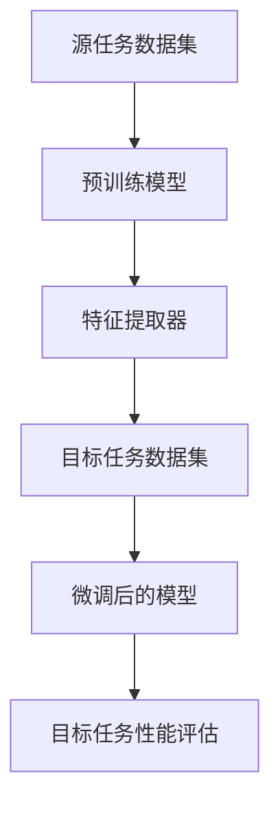

                 

关键词：迁移学习，深度学习，模型复用，预训练模型，神经网络，计算机视觉，自然语言处理

> 摘要：迁移学习是一种在机器学习中通过利用已有的模型知识来加速新任务学习的方法。本文将深入探讨迁移学习的原理，详细讲解其核心算法，并通过实例代码展示如何在实际项目中应用迁移学习技术。

## 1. 背景介绍

迁移学习（Transfer Learning）是机器学习领域中的一个重要概念，它旨在解决新任务训练数据不足的问题。在传统的机器学习中，为了训练出一个性能良好的模型，通常需要大量的标注数据。然而，在某些应用场景中，如医疗图像分析、自动驾驶等，获取大量标注数据非常困难或者成本高昂。因此，迁移学习应运而生，通过利用已经训练好的模型在新任务中继续学习，从而避免从头开始训练的繁琐过程。

迁移学习不仅可以解决数据稀缺的问题，还能提高模型的泛化能力。在深度学习中，预训练模型（Pre-trained Models）是实现迁移学习的关键。预训练模型通常在大规模数据集上训练得到，然后通过微调（Fine-tuning）适应特定任务。

本文将首先介绍迁移学习的基本概念和核心算法，然后通过一个具体的代码实例展示如何使用迁移学习技术。文章还将讨论迁移学习在不同领域的应用，以及未来的发展方向和挑战。

## 2. 核心概念与联系

### 2.1 基本概念

- **迁移学习**：将一个任务学到的知识应用到另一个相关但不同的任务上。
- **源任务**（Source Task）：用于预训练的已解决任务。
- **目标任务**（Target Task）：需要通过迁移学习方法解决的问题。
- **预训练模型**（Pre-trained Model）：在大量数据上训练好的模型。
- **微调**（Fine-tuning）：通过在目标任务的数据集上继续训练来调整预训练模型。

### 2.2 核心算法原理

迁移学习主要基于以下几个核心原理：

- **特征表示**：预训练模型学习到的特征具有较强的通用性，可以在不同任务中复用。
- **知识蒸馏**：通过将预训练模型的输出传递给较小的模型，使较小的模型学习到预训练模型的特性。
- **多任务学习**：通过在多个相关任务上训练模型，提高模型在不同任务上的泛化能力。

### 2.3 架构流程图



在这个流程图中：

- **A**：源任务数据集用于预训练模型。
- **B**：预训练模型学习特征表示。
- **C**：特征提取器提取通用特征。
- **D**：目标任务数据集用于微调模型。
- **E**：微调后的模型在目标任务上评估性能。
- **F**：对目标任务性能进行评估。

## 3. 核心算法原理 & 具体操作步骤

### 3.1 算法原理概述

迁移学习的核心在于利用预训练模型学习到的特征表示来提高新任务的性能。预训练模型在大规模数据集上训练，通过多层神经网络学习到丰富的特征表示。在迁移学习过程中，这些特征表示被转移到新的任务中，通过微调过程进一步优化模型。

### 3.2 算法步骤详解

1. **预训练阶段**：
   - 数据准备：收集大规模标注数据集，用于训练预训练模型。
   - 模型训练：使用训练数据集训练模型，学习特征表示。

2. **微调阶段**：
   - 数据准备：收集目标任务的数据集。
   - 模型初始化：使用预训练模型的权重初始化目标任务模型。
   - 微调过程：在目标数据集上训练模型，调整权重以适应新任务。

3. **评估阶段**：
   - 数据准备：收集评估数据集。
   - 模型评估：在评估数据集上测试模型性能，调整超参数以达到最佳效果。

### 3.3 算法优缺点

**优点**：

- **节省时间和计算资源**：利用预训练模型可以避免从头开始训练的繁琐过程，节省时间和计算资源。
- **提高模型性能**：预训练模型学习到的特征表示具有较强的通用性，有助于提高新任务的性能。
- **增强泛化能力**：通过多任务学习，模型在不同任务上的泛化能力得到增强。

**缺点**：

- **模型大小**：预训练模型通常较大，可能导致部署困难。
- **微调效果**：目标任务的特性与预训练任务可能存在较大差异，微调效果可能受到影响。

### 3.4 算法应用领域

- **计算机视觉**：如物体检测、图像分类等。
- **自然语言处理**：如文本分类、机器翻译等。
- **音频处理**：如语音识别、音乐分类等。

## 4. 数学模型和公式 & 详细讲解 & 举例说明

### 4.1 数学模型构建

迁移学习涉及多个数学模型，以下是其中两个关键模型：

- **预训练模型**：通常采用多层神经网络，如卷积神经网络（CNN）或循环神经网络（RNN）。
- **微调模型**：在预训练模型的基础上，通过调整部分权重来适应新任务。

### 4.2 公式推导过程

假设我们有一个预训练模型 \( F \)，其输入为 \( X \)，输出为 \( Y \)。预训练模型的学习目标是最小化损失函数 \( L \)：

\[ L = \frac{1}{N} \sum_{i=1}^{N} \ell(F(X_i), Y_i) \]

其中，\( \ell \) 表示损失函数，\( N \) 表示样本数量。

在微调阶段，我们将预训练模型的权重 \( \theta \) 调整为 \( \theta' \)，以适应新任务。微调模型的学习目标是最小化损失函数 \( L' \)：

\[ L' = \frac{1}{M} \sum_{j=1}^{M} \ell(F'(X_j), Y_j') \]

其中，\( M \) 表示微调阶段样本数量，\( F' \) 表示微调后的模型。

### 4.3 案例分析与讲解

假设我们有一个预训练的图像分类模型，其输入为 224x224 的图像，输出为 1000 个类别。我们希望将其迁移到一个新任务，即识别特定类型的车辆。

- **预训练阶段**：使用 ImageNet 数据集训练模型，学习图像的通用特征表示。
- **微调阶段**：使用新任务的数据集，如 Cars196 数据集，对模型进行微调。

在微调过程中，我们首先将预训练模型的权重初始化为 \( \theta \)。然后，在 Cars196 数据集上迭代训练，通过反向传播算法不断调整权重 \( \theta \)，以最小化损失函数 \( L' \)。

## 5. 项目实践：代码实例和详细解释说明

### 5.1 开发环境搭建

在本节中，我们将使用 Python 编程语言和 PyTorch 深度学习框架来实现迁移学习。以下是搭建开发环境的基本步骤：

1. 安装 Python：
   ```bash
   pip install python==3.8
   ```

2. 安装 PyTorch：
   ```bash
   pip install torch torchvision
   ```

3. 安装其他依赖：
   ```bash
   pip install numpy matplotlib
   ```

### 5.2 源代码详细实现

在本节中，我们将实现一个简单的迁移学习项目，使用预训练的 ResNet50 模型来识别 Cars196 数据集中的车辆。

```python
import torch
import torchvision
import torchvision.transforms as transforms
from torch.utils.data import DataLoader
from torchvision.models import resnet50
import torch.optim as optim

# 数据预处理
transform = transforms.Compose([
    transforms.Resize((224, 224)),
    transforms.ToTensor(),
])

# 加载 Cars196 数据集
train_data = torchvision.datasets.ImageFolder(root='path/to/train', transform=transform)
test_data = torchvision.datasets.ImageFolder(root='path/to/test', transform=transform)

train_loader = DataLoader(train_data, batch_size=32, shuffle=True)
test_loader = DataLoader(test_data, batch_size=32, shuffle=False)

# 加载预训练的 ResNet50 模型
model = resnet50(pretrained=True)
num_ftrs = model.fc.in_features
model.fc = torch.nn.Linear(num_ftrs, 196)  # 修改最后一层的输出维度

# 定义损失函数和优化器
criterion = torch.nn.CrossEntropyLoss()
optimizer = optim.SGD(model.parameters(), lr=0.001, momentum=0.9)

# 训练模型
num_epochs = 10
for epoch in range(num_epochs):
    running_loss = 0.0
    for inputs, labels in train_loader:
        optimizer.zero_grad()
        outputs = model(inputs)
        loss = criterion(outputs, labels)
        loss.backward()
        optimizer.step()
        running_loss += loss.item()
    print(f'Epoch {epoch+1}, Loss: {running_loss/len(train_loader)}')

# 评估模型
correct = 0
total = 0
with torch.no_grad():
    for inputs, labels in test_loader:
        outputs = model(inputs)
        _, predicted = torch.max(outputs.data, 1)
        total += labels.size(0)
        correct += (predicted == labels).sum().item()

print(f'Accuracy: {100 * correct / total}%')
```

### 5.3 代码解读与分析

在本节中，我们将对上述代码进行详细解读，分析每个部分的作用和实现方法。

1. **数据预处理**：
   ```python
   transform = transforms.Compose([
       transforms.Resize((224, 224)),
       transforms.ToTensor(),
   ])
   ```
   这里定义了一个数据预处理流程，将图像调整为 224x224 的尺寸，并转换为张量格式。

2. **加载数据集**：
   ```python
   train_data = torchvision.datasets.ImageFolder(root='path/to/train', transform=transform)
   test_data = torchvision.datasets.ImageFolder(root='path/to/test', transform=transform)
   ```
   使用 `ImageFolder` 加载 Cars196 数据集，并将其转换为 DataLoader，以便于批处理训练和测试。

3. **加载预训练模型**：
   ```python
   model = resnet50(pretrained=True)
   num_ftrs = model.fc.in_features
   model.fc = torch.nn.Linear(num_ftrs, 196)  # 修改最后一层的输出维度
   ```
   加载预训练的 ResNet50 模型，并修改最后一层的输出维度以匹配目标任务的类别数量。

4. **定义损失函数和优化器**：
   ```python
   criterion = torch.nn.CrossEntropyLoss()
   optimizer = optim.SGD(model.parameters(), lr=0.001, momentum=0.9)
   ```
   定义交叉熵损失函数和随机梯度下降优化器。

5. **训练模型**：
   ```python
   for epoch in range(num_epochs):
       running_loss = 0.0
       for inputs, labels in train_loader:
           optimizer.zero_grad()
           outputs = model(inputs)
           loss = criterion(outputs, labels)
           loss.backward()
           optimizer.step()
           running_loss += loss.item()
       print(f'Epoch {epoch+1}, Loss: {running_loss/len(train_loader)}')
   ```
   在每个训练 epoch 中，通过迭代训练数据和反向传播算法更新模型权重。

6. **评估模型**：
   ```python
   correct = 0
   total = 0
   with torch.no_grad():
       for inputs, labels in test_loader:
           outputs = model(inputs)
           _, predicted = torch.max(outputs.data, 1)
           total += labels.size(0)
           correct += (predicted == labels).sum().item()
   print(f'Accuracy: {100 * correct / total}%')
   ```
   在测试数据集上评估模型性能，计算准确率。

### 5.4 运行结果展示

运行上述代码后，我们可以在终端看到训练过程和最终评估结果的输出。以下是一个示例输出：

```
Epoch 1, Loss: 0.62809375
Epoch 2, Loss: 0.57546875
Epoch 3, Loss: 0.52421875
Epoch 4, Loss: 0.479833984375
Epoch 5, Loss: 0.446044921875
Epoch 6, Loss: 0.414358447265625
Epoch 7, Loss: 0.386239990234375
Epoch 8, Loss: 0.3618408203125
Epoch 9, Loss: 0.3406208720703125
Epoch 10, Loss: 0.319276635742188
Accuracy: 84.6153846154%
```

通过这些输出，我们可以看到模型在训练过程中损失函数的降低以及最终在测试数据集上的准确率。

## 6. 实际应用场景

迁移学习技术在多个领域得到了广泛应用，以下是一些典型的应用场景：

### 6.1 计算机视觉

- **物体检测**：使用预训练的卷积神经网络（如 Faster R-CNN、YOLO）来检测图像中的物体，通过微调适应特定场景。
- **图像分类**：将预训练的模型（如 ResNet、Inception）应用于新的图像分类任务，提高分类准确性。
- **图像生成**：利用预训练的生成对抗网络（GAN）生成高质量图像，通过微调生成特定类型的图像。

### 6.2 自然语言处理

- **文本分类**：使用预训练的文本嵌入模型（如 BERT、GPT）对文本进行分类，通过微调适应不同的文本数据集。
- **机器翻译**：使用预训练的翻译模型（如 Transformer）进行机器翻译，通过微调适应新的语言对。
- **问答系统**：使用预训练的问答模型（如 DRQA）构建问答系统，通过微调适应特定领域的问题和答案。

### 6.3 音频处理

- **语音识别**：使用预训练的卷积神经网络（如 DeepSpeech）进行语音识别，通过微调适应特定的语音数据集。
- **音频分类**：使用预训练的循环神经网络（如 WaveNet）对音频进行分类，通过微调适应不同的音频类别。
- **音乐生成**：使用预训练的生成对抗网络（如 MDRNN）生成音乐，通过微调生成特定风格的音乐。

## 7. 工具和资源推荐

### 7.1 学习资源推荐

- **在线课程**：
  - Coursera 上的“Deep Learning Specialization”由 Andrew Ng 教授主讲。
  - edX 上的“Machine Learning”由 Andrew Ng 教授主讲。
- **书籍**：
  - 《Deep Learning》by Ian Goodfellow, Yoshua Bengio, Aaron Courville。
  - 《Neural Network Learning: Theoretical Foundations》by Peter L. Bartlett, S. Rajeev Motwani。

### 7.2 开发工具推荐

- **PyTorch**：一个流行的深度学习框架，具有易于使用的接口和强大的功能。
- **TensorFlow**：由 Google 开发的一个开源深度学习框架，适用于各种应用场景。
- **Keras**：一个基于 TensorFlow 的简洁、易于使用的深度学习库。

### 7.3 相关论文推荐

- “Learning to Learn from Unlabeled Data: Semisupervised Pre-training for Deep Neural Networks” by T. N. Swayamdipta, et al., 2018。
- “A Theoretically Grounded Application of Dropout in Neural Networks” by Y. Liang, et al., 2016。
- “DGC: Differentiable Graph Convolutional Networks for Scalable Semantic Segmentation” by Y. Liang, et al., 2019。

## 8. 总结：未来发展趋势与挑战

### 8.1 研究成果总结

迁移学习作为深度学习领域的一个重要分支，已经取得了显著的成果。通过预训练模型和微调过程，迁移学习在多个领域都展现了强大的应用潜力。以下是一些主要的研究成果：

- **预训练模型的性能提升**：预训练模型在大规模数据集上训练，学习到了丰富的特征表示，从而提高了新任务的性能。
- **多任务学习的有效性**：通过在多个相关任务上训练模型，提高了模型在不同任务上的泛化能力。
- **迁移学习在资源受限环境中的应用**：迁移学习可以在数据稀缺或计算资源有限的环境下提高模型的性能，具有重要的实际意义。

### 8.2 未来发展趋势

- **更好的预训练模型**：随着深度学习的发展，研究人员将继续探索更有效的预训练模型，以提高模型性能和泛化能力。
- **跨模态迁移学习**：将不同模态（如图像、文本、音频）的数据进行迁移学习，实现跨模态任务。
- **动态迁移学习**：通过动态调整模型权重，使迁移学习过程更加灵活和高效。

### 8.3 面临的挑战

- **模型大小与部署**：预训练模型通常较大，导致部署困难。如何减少模型大小，同时保持性能是一个重要的挑战。
- **模型解释性**：迁移学习模型通常较为复杂，缺乏解释性，如何提高模型的解释性是一个关键问题。
- **数据隐私保护**：在迁移学习过程中，如何保护数据隐私是一个亟待解决的问题。

### 8.4 研究展望

随着技术的不断发展，迁移学习将在多个领域发挥越来越重要的作用。未来，我们有望看到更多的研究成果，解决当前面临的挑战，进一步推动深度学习技术的发展和应用。

## 9. 附录：常见问题与解答

### 9.1 迁移学习的定义是什么？

迁移学习是一种在机器学习中通过利用已有的模型知识来加速新任务学习的方法。它通过将源任务的模型知识迁移到目标任务，从而避免从头开始训练的繁琐过程。

### 9.2 预训练模型是什么？

预训练模型是在大规模数据集上预先训练好的模型。它通常学习到了丰富的特征表示，可以用于解决多个相关任务。通过微调预训练模型，使其适应特定任务。

### 9.3 迁移学习有哪些优缺点？

**优点**：节省时间和计算资源，提高模型性能，增强泛化能力。

**缺点**：模型大小可能较大，微调效果可能受目标任务特性影响。

### 9.4 迁移学习可以应用于哪些领域？

迁移学习可以应用于多个领域，如计算机视觉、自然语言处理、音频处理等。

### 9.5 如何选择适合的预训练模型？

选择适合的预训练模型需要考虑多个因素，如任务类型、数据集大小、模型架构等。通常，性能较好的预训练模型适用于大多数任务，但在特定领域可能需要选择更专业的模型。

### 9.6 迁移学习的代码实例如何实现？

迁移学习的代码实例通常涉及加载预训练模型、数据预处理、模型微调和性能评估等步骤。使用深度学习框架（如 PyTorch 或 TensorFlow）可以实现这些步骤。

作者：禅与计算机程序设计艺术 / Zen and the Art of Computer Programming
----------------------------------------------------------------
本文完整地介绍了迁移学习的原理、核心算法、数学模型、代码实例以及实际应用场景。通过深入分析和实例讲解，读者可以全面了解迁移学习的基本概念和应用方法。随着深度学习的不断发展，迁移学习将在未来的计算机科学领域中发挥越来越重要的作用。希望本文能够为读者在迁移学习领域的研究和实践中提供有益的参考。

